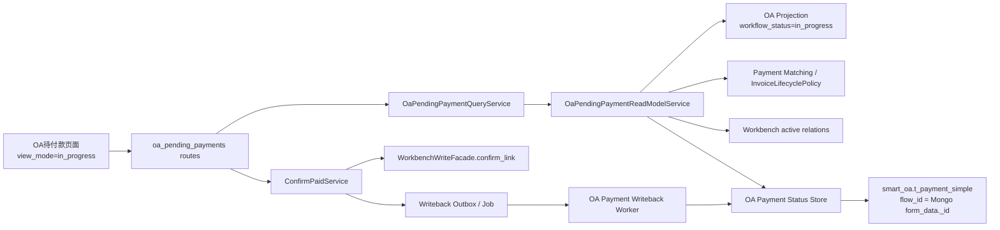

# 08-RESEARCH：进行中 OA 支付匹配架构研究

日期：2026-06-17
阶段：08-oa-pending-payments-improvements

## 结论

该需求合理，且不应做成新菜单页。最佳落点是在现有 `OA待付款` 页面新增 `已完成 OA / 进行中 OA` view mode，并复用现有 OA 付款匹配和 Workbench relation 确认能力。

核心设计不是新建一个独立事实源，而是在同一 payment matching domain 下拆两个 scope：

- `completed_oa`：现有已完成 OA 待付款视图。
- `in_progress_oa`：新增进行中 OA 支付匹配视图。

两个 scope 共享流水读取、候选/确认关系、付款判定、写回状态和刷新机制；差异只在 OA workflow status filter 与写回触发策略。

## 现有代码发现

### 页面和 API

当前 `OaPendingPaymentsPage` 已有列表、筛选、刷新、详情等结构，适合加入 view mode。后端 `routes_oa_pending_payments.py` 目前以 read-only 查询为主，需要新增或扩展 API：

- `GET /api/oa-pending-payments/rows?view_mode=in_progress&payment_status=...`
- `POST /api/oa-pending-payments/in-progress/confirm-paid`

最终命名可按现有路由风格调整，但 contract 必须表达 view mode 与确认已支付复合动作。

### 付款判定

`InvoiceLifecyclePolicy.evaluate_oa_payment(...)` 已经根据 OA 金额、支出流水、金额差额等条件判断支付状态。新增视图应复用它，避免出现 `已完成 OA` 与 `进行中 OA` 两套付款口径。

设计含义：

- confirmed relation 不是唯一条件。
- 必须存在支出流水。
- 金额口径必须符合既有规则。
- 单纯候选永远不自动写回。

### OA workflow status

`MongoOAAdapter.canonical_process_status(...)` 已能把 `processStatus=1` 映射为 `in_progress`，把 `processStatus=2` 映射为 `completed`。但现有 `OAApplicationRecord` 没有一等 `workflow_status` 字段，PostgreSQL projection 的 `status` 字段当前不是流程状态。

推荐新增：

- `OAApplicationRecord.workflow_status`
- `app.oa_applications.workflow_status`
- repository read/write/filter 支持

不要复用 `status`，否则会污染现有 section/source scope。

### OA payment flow id

2026-06-17 远端脱敏核验显示 `t_payment_simple.flow_id` 对应 OA Mongo `form_data._id`。平台展示 row id 与 MySQL 写回 key 不同，但 `oa-pay-/oa-exp-` 行 ID 后缀可解析回 Mongo 文档 ID。

推荐新增 resolver：

```text
platform_oa_id/detail -> mongo_id -> t_payment_simple.flow_id
```

该 resolver 优先从平台 projection detail fields 的 `Mongo文档ID` 读取；缺失时使用 `oa-pay-/oa-exp-` row id 后缀。Flowable 流程实例 ID、流程请求 ID 和 relation case id 不作为写回 key。

### 外部 MySQL 边界

仓库已有外部 OA MySQL client 用于角色同步，且有 runtime boundary guard。新增支付状态写回应采用同类 adapter/repository 模式：

- route 不 import `pymysql`
- service 不散落 SQL
- adapter/repository 持有连接和 SQL
- env 配置由 runtime/bootstrap 注入
- 测试更新 allowlist，只允许新的 adapter 文件 import `pymysql`

## 推荐后端架构



## 写回触发时机

不在打开页面或查询列表时写回。推荐两个触发点：

1. 用户点击 `确认已支付`：先确认 relation，再 enqueue 写回。
2. read model refresh 发现已有 confirmed active relation 且通过付款判定，但 OA MySQL 尚未为已支付：enqueue 写回补偿。

这样可以避免列表查询产生副作用，也能覆盖从其他入口确认 relation 的场景。

## 1-2 秒同步设计

优先级：

1. OA webhook/event：流程状态或表单变化后通知平台，平台解析 affected OA，enqueue 小范围 refresh。
2. Workbench relation event：确认关系后直接刷新 affected OA row，并推送前端。
3. Fallback：1 秒级轻量 fingerprint polling，只拉变更指纹，不做页面打开全量扫描。
4. 前端：SSE 或既有状态轮询收到刷新完成后更新列表。

关键点：

- polling 必须限流和只处理变更。
- read model freshness 不能伪装 fresh。
- OA 变成 `completed` 后，应从 `in_progress` scope 删除或过滤掉。

## 风险

1. `t_payment_simple.flow_id` 非唯一，可能导致同一 OA 文档多条支付状态记录。
2. Mongo 文档 ID 缺失时，resolver 必须拒绝写回，不能降级使用 Flowable 流程实例 ID 或流程请求 ID。
3. 1 秒 polling 对 OA Mongo/Flowable 压力需要压测或至少限流。
4. confirmed relation 如金额不一致，不能写回已支付。
5. 新 view mode 扩展不能破坏现有 `已完成 OA` 页面响应 shape。

## 验证重点

- `in_progress` 过滤准确，OA 完成后移除。
- 平台 OA id、Mongo 文档 ID 与 Flowable process id 不混用。
- 候选不会自动写回。
- 点击确认后幂等确认 relation 和 enqueue 写回。
- 写回成功后行内显示 `已写回`。
- writeback 失败时后台可追踪、可重试，行内仍为 `未写回`。
- 已完成 OA 现有行为保持不变。
