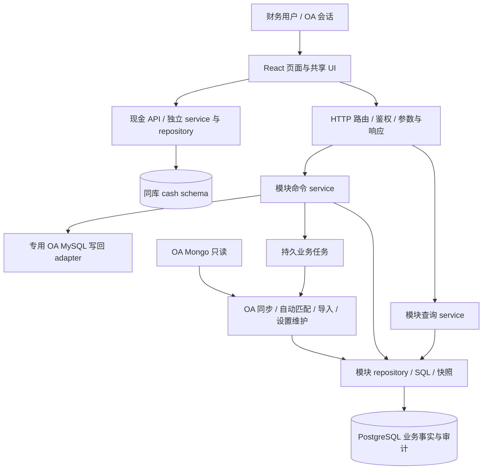

# App 设计与架构

## 系统形态

平台采用模块化单体：React 页面调用 Python HTTP API，各业务模块在同一 PostgreSQL 数据库内通过明确的查询和写入边界协作。页面直接读取 canonical 业务事实，没有页面 read model、generation、freshness barrier 或页面刷新 worker。后台任务只承担真正异步的业务工作。

图中的层表示职责，不要求每个简单操作新增一层。真实页面和能力清单见[模块索引](docs/modules/README.md)。

## 模块边界与 I/O

| 边界 | 输入与输出 | 职责限制 |
| --- | --- | --- |
| 页面 / hook | 页面参数、用户操作 → API 请求与视图状态 | 不计算跨模块业务归属，不保存持久业务事实 |
| 公共 UI | props → 用户事件 | 不请求业务 API、不解释业务金额、权限或对象归属 |
| HTTP route | cookie/header、JSON/query → DTO 与 HTTP 状态 | 鉴权、参数校验、组装依赖、错误映射 |
| 查询 service | 已验证查询条件 → rows/summary/counts | 组合本模块 repository，不读取其它页面 payload |
| 命令 service | actor、身份、版本、业务参数 → 命令回执 | 校验业务不变量，调用事实 owner，协调事务 |
| repository | 精确 ID/scope/查询条件 → canonical 数据 | 持有 SQL、连接与存储结构，不依赖 HTTP |
| worker | 已登记业务任务 → 完成/失败/重试 | 不依赖 Application、路由或 HTTP 状态 |
| 外部 adapter | 明确外部合同 → 规范化数据/写回结果 | 不把 OA 密钥传给页面，不把外部系统当 App 写库 |

Service 构造函数接收 repository、queue 或 settings provider 等明确依赖，不传整个 Application；SQL 留在 repository。现有实现仍有较大的 Application/server 组装面，本说明不代表所有存量代码已经完全拆分，也不因整理文档顺带重构它。

## 事实归属与一致性

PostgreSQL 是 App 业务事实的唯一持久来源。银行流水及用途拆分由银行 owner 管理，发票由发票 owner 管理，正式关系由关系 owner 管理，成本、往来、税金各自拥有其业务状态。导入和 OA 同步调用相应 owner；页面只消费这些事实，不通过页面之间的通知同步副本。

查询优先使用请求内短生命周期的 `REPEATABLE READ READ ONLY` 快照，使 rows、总数、统计和当前页关系一致。列表先过滤/分页，再按当前页 IDs 批量补齐详情；统计使用相同业务条件、在分页前计算。金额和归属不在浏览器全量扫描推导。

写入在持有数据所有权的事务中提交业务事实、必要历史、审计和需要持久化的业务任务；采用现有唯一约束、版本检查和幂等键解决冲突。模块协作使用明确命令，不能从页面旁路改表。涉及外部 OA MySQL 的写回不与 PostgreSQL 构成分布式事务，必须区分提交与外部写回状态，不能伪报全部成功。

写成功后当前页重新执行 normal GET；其它页面在访问或重新激活时查询当前事实。请求取消或乱序响应不能覆盖更新的页面状态。保留加载期间已知计数只是视觉稳定，不是业务缓存或旧数据兜底。

## 后台工作与存储

运行时登记集中在 [worker registry](backend/src/fin_ops_platform/services/runtime_worker_registry.py)。当前实例为 `oa-sync`、`workbench-matching`、`import`、`settings-maintenance`。通用任务使用 PostgreSQL outbox、attempt 与 heartbeat；导入直接领取 `job.import_jobs`，使用 owner/claim version fencing，确认和提交是明确状态。

自动匹配是异步业务写入，不是页面读取前提。匹配只在精确业务范围内产生正式归属或关系，页面仍直接查事实。外部同步、文件解析、设置维护不能借 HTTP GET 隐式启动。

OA Mongo adapter 只读源单据；付款状态与角色同步走各自 OA MySQL adapter。附件由文件对象 owner 管理元数据与配置的对象存储，不把真实文件或密钥写入文档/测试产物。现金复用同一登录和数据库，使用 `cash.*` 与独立连接池，不借普通业务全局状态、审计或任务队列处理现金写入。

## 权限、错误和性能

App 入场依赖 OA 会话与 `FIN_OPS_OA_REQUIRED_PERMISSION`；具体页面权限来自 canonical `page_access_accounts`。固定管理员 `YNSYLP005` 管理账户并拥有全部页面；普通账户只拥有明确分配的页面及该页既有操作。服务端是权限裁决者，侧栏隐藏不替代 API 鉴权。现金的操作限制见其模块说明。

非法输入、缺失依赖、权限不足、版本冲突和外部失败必须明确返回；不能吞异常、返回成功空列表或悄悄调用旧链路。保留正常的 loading/empty/error、用户重试、事务回滚和幂等恢复，这些不是业务兜底。

性能来自有界 SQL、合适索引、批量 hydration、分页、短事务、连接池和有限并发。现有 HTTP SLO 目标为核心 GET p95 ≤ 1000ms、p99 ≤ 2000ms；这是测量目标，不是对任意数据量或公网条件的承诺。性能报告必须注明窗口、端点、样本数、并发、冷/热状态和测量位置。API 耗时、浏览器渲染与写后可见时延分别测量；少量 smoke 不代表长期 p99。

## 运行形态与维护

API 使用 Gunicorn + WSGI adapter，前端由 Nginx 提供，worker 是独立 systemd 进程。PostgreSQL、对象存储与 OA 连接设置由部署环境提供，密钥独立保存。HTTP/数据库池、请求体、statement timeout 与 worker lease 使用现有有界配置。

部署通过版本目录、systemd release drop-in、前端目录切换和现有候选/激活检查完成。数据库迁移是可执行结构历史，不能作为“过程文档”删除；已发生 forward-only 变更的数据库禁止回切不兼容代码。操作步骤见[运行说明](docs/operations.md)。

文档按当前行为更新，不追加阶段日志。模块职责变化同步修改该模块说明；公共合同只在本页、开发、运行或 UI 文档中维护一次。
