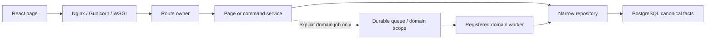

# 运行时调用链与模块归属

日期：2026-08-15

## 总体调用链

## 读请求

所有业务页面使用同一个合同：

1. API client 发送鉴权后的 bounded query 参数。
2. Route 只做 HTTP 解析、权限和错误映射。
3. Page query service 调用 narrow PostgreSQL repository。
4. 组合页面在一个短 `REPEATABLE READ READ ONLY` snapshot 内生成 rows、summary、facets、statistics。
5. API 返回页面 DTO；GET 不 enqueue、不轮询、不访问 RabbitMQ/Redis。

缺 repository、schema 或 snapshot contract 时 fail fast。禁止回退历史 projection、app Mongo、进程内
snapshot、双读或 shadow read。OA Mongo 只通过只读 adapter 为明确 OA integration query 提供输入。

## 写请求

1. Route 校验 HTTP/auth/permission 并组装明确依赖。
2. Command service 校验业务状态、version、preview fingerprint、exact set 和 idempotency。
3. Repository/UoW 原子提交 canonical facts、active relation、audit 与必要的 domain job。
4. 当前页面需要展示新结果时执行一次 normal GET；其它页面不触发 I/O。

写成功不代表其它页面被“刷新”，而是所有页面下次读取同一 canonical 事实。权限、CAS、审计和幂等仍是
同步写边界；OA sync、import、settings maintenance、Workbench matching 是各自的 durable domain job。

## Worker owner

| Instance | Owner | 事实源 |
| --- | --- | --- |
| `oa-sync` | OA integration | PostgreSQL outbox + OA adapter |
| `workbench-matching` | matching orchestrator | matching domain scopes |
| `import` | import service | background job + outbox |
| `settings-maintenance` | settings/reset/recalculation | background job + outbox |

Worker 不依赖 HTTP/Application response，不拥有页面 DTO，也不创建页面读取副本。

## App Status

全局状态只聚合 session、OA sync、background jobs、四个 worker、通用 queue 和外部依赖。页面数据是否正确由
canonical page/system audit 证明，不再由 projection freshness/status 表推导。App Health polling 是运维状态
通道，不是业务页面刷新总线。

## 性能

- canonical SQL set-based、分页有界、批量 hydration，禁止 N+1。
- 核心 GET 默认生产 SLO：p95 <= 1000ms、p99 <= 2000ms。
- 监控 endpoint duration、DB duration、connection acquire、SQL execute/fetch 与 query count。
- 无变化响应可使用标准 ETag/304；不得用缓存掩盖 stale facts。

## 删除合同

旧 manifest/gateway/readiness/scope/projection/worker、operation barrier、frontend polling 和 deploy command 已删除。
Migration 0149 删除相关 schema；当前 release 不提供兼容 fallback，forward-only migration 后只允许向前修复。

模块 canonical owner matrix 见 `../architecture/module-boundaries/canonical-facts.md`，页面细节见对应
`../modules/<module>/boundary-io.md`。
