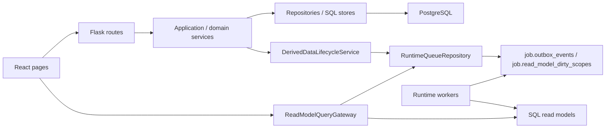
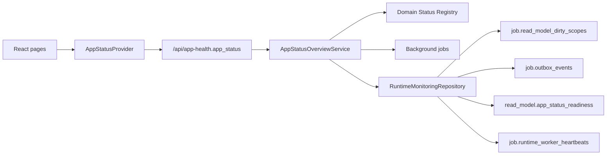

# 运行时调用链与模块归属

本文维护当前 app 的运行时序、read model/worker 边界和模块 owner。它回答“请求如何到达事实源”“写入如何触发派生数据刷新”“哪个模块负责维护某类事实”。

## 总体调用链

## 读请求

1. 页面调用 `web/src/features/*/api.ts`。
2. Flask route 完成 HTTP 参数解析、权限映射和响应 shape。
3. 查询型 service 或 `ReadModelQueryGateway` 判断 read model 是否 fresh。
4. fresh 时读取 SQL projection 或 repository；stale/missing 时返回状态并按需 enqueue refresh。
5. 页面根据 `read_model_status`、`refreshing`、`stale`、`job` 等字段展示加载、刷新或不可用状态。

页面不能自行假设 read model fresh，也不能为了“有数据”绕过 freshness gate。

## OA 会话启动边界

React 启动时由 `SessionProvider` 调用 `fetchSessionMe()`，通过 `SessionGate` 决定是否渲染业务路由。该请求属于应用 bootstrap 边界，不是页面级 loading：

- 前端 `fetchSessionMe()` 必须使用 `apiRequestJson(..., { timeoutMs })` 设置明确 deadline；请求挂起时进入 `error` 状态并提供 `SessionProvider.refresh()` 重试入口，不能无限停留在“正在验证 OA 会话”。
- 后端 `/api/session/me` 只做 HTTP mapping、错误码映射和 `resolve_oa_request_session(...)` 调用；OA 身份查询仍由 `OAIdentityService` 按 `FIN_OPS_OA_REQUEST_TIMEOUT_MS` 控制外部服务超时。
- 会话失败不能伪装成 read model fresh，也不写 facts、audit、dirty scope、outbox 或 read model。全局 App Status 可以把 session 不可用展示为 blocked/red，但页面本地不能改写后端 runtime facts。
- retry 只重新执行 session bootstrap；不会清理页面 session/keep-alive 缓存，除非返回的新用户 scope 或 session generation 触发前端缓存隔离规则。

## 写请求

1. Route 只做 HTTP contract、auth/permission、依赖组装和错误映射。
2. Application/domain service 校验业务规则，调用 repository 做原子写入。
3. 写入产生业务事件或 dirty scope。
4. `DerivedDataLifecycleService` 统一判断哪些 read model、缓存或页面事实被影响。
5. 通过 durable queue/outbox 记录 refresh 请求；worker 异步重建 projection。
6. API 返回写入结果、受影响月份/对象、版本、job 或 refresh 状态。

写模型、权限认证、冲突校验不做“分发 read model”；它们保留明确 command/service 边界。

### 待找发票规则写入

待找发票规则保存走独立规则集边界：

1. `PendingInvoiceRulesApplicationService.update_rules(...)` 只接收 HTTP route 映射后的 direction、payload 和 actor。
2. `AppSettingsService.update_pending_invoice_rule_groups(...)` 校验当前 direction 的规则 `version`、归一化分组、递增对应规则版本并写审计。
3. 保存事件返回 `event_type=pending_invoice_rules_changed`、`direction`、`old_version`、`new_version`、`affected_groups` 和 `actor_id`。
4. API finalizer 只清必要内存 cache，并把 `pending_invoice_rules_changed` 交给 `DerivedDataLifecycleService`。
5. lifecycle executor 通过 `RuntimeQueueRepository.enqueue_read_model_refresh(...)` 或 workbench dirty queue 入队相关 read model refresh；API server 不同步重建发票生命周期、待找发票、成本、税金、OA 或关联台 read model。

该事件的影响域必须保持低耦合：刷新 `invoice_lifecycle`、`pending_invoice`、workbench、进项使用、OA 待付款、销项收款、税金抵扣、成本统计和 search；不刷新 `turnover_ledger`、`no_oa_bank_batch`、`bank_account_balance`。App Health 只根据这些 read model 的 readiness/dirty/outbox/worker 事实判定页面 busy 或 blocked，不能因为规则版本变化把无关页面标红。

### 成本统计全期间 read model

成本统计的 `all` scope 是真实物化视图，不是只负责 fan-out 的队列父 scope：

1. `active:YYYY-MM` / `all:YYYY-MM` 月份 shard 由 `CostStatisticsSqlProjectionBuilder` 基于对应工作台月份 read model 重建。
2. `CostStatisticsReadModelRefreshService` 收到 `active:all` 或 `all:all` 时，先检查所需月份 shard readiness。缺失、stale 或 failed 的 shard 通过 `RuntimeQueueRepository.enqueue_read_model_refresh(...)` 入队，父 scope 返回 `readiness_status=refreshing`，不写假 fresh。
3. 所有所需月份 shard fresh 后，`active:all` / `all:all` 从 `read_model.cost_statistics_rows` 的月份 rows 聚合生成，并原子发布到 `read_model.cost_statistics_read_models` 和 parent rows；父 scope 不再读取 `read_model.workbench_groups.scope_key='all'` 的全量 JSON payload。
4. 月份 shard 发布成功后重新入队同 project scope 的父 scope，使全期间视图最终收敛。
5. `ReadModelReadinessReporter` 对 fan-out-only 事件继续不写 `fresh`；父 scope 等待 shard 时记录 `refreshing`，只有事件已经完成父 scope rebuild 且带有显式 `readiness_status=fresh` 时，才记录父 scope fresh readiness。
6. 成本统计 domain 根据 scope 级 readiness 推导状态：`active:all` / `all:all` 父 scope failed/unavailable 时 blocked；`active:YYYY-MM` / `all:YYYY-MM` 月份 shard failed/unavailable、pending 或 refreshing 时显示 busy，并在 App Status 面板暴露失败 scope 与 last error。

## Worker 与队列

- durable truth：PostgreSQL 的 `job.outbox_events` 与 `job.read_model_dirty_scopes`。
- queue API：`RuntimeQueueRepository.enqueue_read_model_refresh(...)` 或事务内 writer。
- worker registry：`runtime_worker_registry.py` 定义 worker 名称、scope、manifest、health 可见性。
- RabbitMQ 只能作为可选 wakeup/transport，不能成为 read model 状态事实源。
- Redis 只能缓存通过 fresh gate 后的 payload，不能缓存或伪造 freshness。

## App Health / SSE

App Health 读取后台任务、worker、queue 和 read model 状态，给页面提供可见的刷新、stale、失败和重试信号。SSE 或轮询只负责通知 UI 更新状态，不替代 durable queue。

## Global Runtime Status Plane

Global Runtime Status Plane 是 App Health 之上的用户可见全局投影。它由后端 `AppStatusOverviewService` 生成，输入只来自 session、后台任务、read model dirty scopes、outbox、worker heartbeat、runtime registry、依赖和 alert。React 页面不向它上报当前路由 loading，也不负责推导全局状态。

Runtime facts 的 read-side repository 是 `RuntimeMonitoringRepository.app_status_runtime_snapshot()`。PostgreSQL state store 通过公开方法暴露该 snapshot；`server.py` 只做 `/api/app-health` snapshot 组装，不能直接读取 state store 私有连接，也不能把 `job.*` 或 `read_model.*` SQL 写进 app status service。`AppStatusOverviewService` 只接收已归一化的 runtime facts 并执行状态优先级判定，不执行 rebuild、不写 queue、不调用页面 API。

`RuntimeMonitoringRepository.app_status_runtime_snapshot()` 必须保留 read model scope 明细。聚合后的 `read_model_statuses[read_model_key].status` 用于全局优先级，`read_model_statuses[read_model_key].scopes[]` 用于解释具体 `scope_key`、`status`、`last_error` 和 `updated_at`。App Status domain payload 继续输出聚合字段，同时通过 `read_model_scopes[]` 暴露 scope 诊断；前端只展示该后端事实，不按当前页面筛选自行推断。

左上角 App Status Icon 和 hover 面板只消费 `app_status`，因此切换页面不改变 icon 或 hover 内容。页面局部 table/drawer/form loading 只在页面内展示；如果页面背后的 read model 或 worker 未 ready，则由后端全局投影把对应 domain 标记为 busy 或 blocked。

`read_model.app_status_readiness` 是全局绿色状态的 read model 证明层。普通 read model refresh worker/service 在成功、失败、schema/source mismatch 时通过 repository 公共方法记录 `read_model_key`、scope、status、schema/source version、row count、生成时间和错误原因。`workbench` 使用 active generation/readiness metadata 作为等价证明，不机械套普通 projection 表。空业务结果允许 green，但必须有 readiness scope 记录；没有 readiness 记录的 registry read model 必须输出 `missing`，不能被空 dirty scope 推断为 ready。

Workbench active generation 在发布前执行对象身份仲裁。`WorkbenchObjectIdentityArbitrationService` 复用统一 identity policy，为 OA、流水、正式发票和 OA 附件发票写入 `object_identity_*` payload；正式发票与 OA 附件发票命中同一强发票 identity 时只能进入一个展示状态。`read_model.workbench_generation_consistency` 会把强发票 identity 或稳定银行 identity 横跨 `paired/open` 视为 inconsistent generation。

Workbench 首屏读路径必须以 active generation 为边界。`/api/workbench/summary` 优先读取 `read_model.workbench_summary` 中已物化的 summary/stat payload，不在请求热路径扫描 `workbench_group_rows` 或执行银行明细 diagnostics；diagnostics 属于 health/deep health/operations。`/api/workbench/groups?detail_level=summary` 的 Redis page cache 只保存 fresh gate 后的 payload，cache key 使用 active generation version。`worker-workbench` 发布任一月 shard active generation 后，会低优先级 enqueue `all` aggregate-only refresh；`all` aggregate 发布成功后再预热首屏 `paired/open` page 1 summary 和 version key。导入等可判定月份的事件优先 dirty 具体月份，只有无法判定范围或真正跨期时才直接 dirty `all`。

runtime snapshot 读取失败不能被解释成 ready。critical read model failed/unavailable、required worker missing/mismatch/stale、关键依赖 missing/unavailable 或 session 不可用会把全局状态升级到 blocked/red；readiness missing/refreshing/stale/schema_mismatch/source_mismatch、dirty scope、outbox backlog、后台任务 queued/running/attention 和非阻塞 stale 会保持 busy/yellow。成本统计是特例化的 scope 级聚合：月份 shard failed/unavailable 是局部风险，不能无条件污染已经 fresh 的父 scope。

Registry 强一致由测试保护：domain registry 的 `read_model_keys` 必须存在于 `AppStatusReadModelRegistry`，`worker_instances` 必须存在于 `runtime_worker_registry`，`job_types` 必须存在于 app status background job registry 或 runtime state policy，`dependencies` 必须存在于 app status dependency registry。新增页面、read model、worker、job type 或 dependency 时，如果没有同步 registry 和测试，不能上线。

## 模块归属

| 模块域 | Route owner | Service / policy owner | Read model / worker owner | 文档入口 |
| --- | --- | --- | --- | --- |
| 银企核销 / 关联台 | reconciliation/workbench routes、部分 legacy `server.py` handler | reconciliation service、workbench service、relationship policy | workbench active generation、相关 SQL projection | `docs/product-specs/reconciliation-and-workbench.md` |
| 银行明细 / 标签 | bank detail routes | bank detail service、tagging/classification policy | bank detail read model refresh | `docs/product-specs/bank-turnover-and-no-oa.md` |
| 待找发票 / 发票生命周期 | pending invoice / invoice routes | pending invoice rules service、invoice lifecycle policy、pending invoice query service | invoice lifecycle、pending invoice、invoice usage / collection read models | `docs/product-specs/invoice-lifecycle.md` |
| OA 待付款 | OA pending payment routes | OA reconciliation/query service | OA pending payment SQL projection | `docs/product-specs/invoice-lifecycle.md` |
| ETC / 导入 | import and ETC routes | import service、ETC business batch service | import jobs、ETC batch state | `docs/product-specs/imports-and-etc.md` |
| 成本 / 税金 | cost/tax routes | cost attribution policy、tax offset service | cost/tax read models | `docs/product-specs/cost-tax.md` |
| 设置 / 健康 | settings/app health routes | settings service、runtime health service | runtime workers、queue health | `docs/product-specs/platform-settings-health.md` |
| 对象 identity/dedup | object identity routes/service | identity/dedup policy | repair/backfill worker if needed | `docs/operations/object-identity-dedup.md` |

## 仍需关注的 legacy 边界

- `server.py` 仍有部分 route handler 和 dependency wiring，需要按 `docs/architecture/backend-refactor/` 的 Python-first 方向继续拆分。
- service 构造必须接收明确依赖，不把整个 `Application` 注入 service。
- repository 可以知道 SQL 表结构；业务 service 不应散落 SQL。
- worker 不依赖 `Application`、HTTP response、cookie/header 或 auth module。

## 维护要求

新增 read model、worker、dirty cascade、queue job、runtime health 指标或跨模块 service owner 时，更新本文。若变更属于长期重构计划进度，只更新 `docs/architecture/backend-refactor/migration-state-log.md`；若改变当前生产事实，还必须更新对应产品、开发或运维文档。
