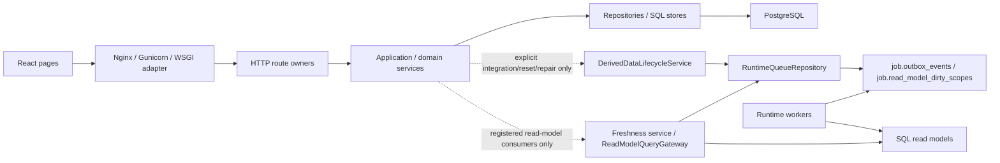

# 运行时调用链与模块归属

本文维护当前 app 的运行时序、read model/worker 边界和模块 owner。它回答“请求如何到达事实源”“页面访问如何收敛派生数据”“哪个模块负责维护某类事实”。

PostgreSQL 业务唯一真相的全局 owner matrix 见 `../architecture/module-boundaries/canonical-facts.md`。本文描述运行链路；具体 canonical fact family 的写入口、读入口和禁止路径以 canonical facts 合同和对应业务模块 `boundary-io.md` 为准。

## 总体调用链

## 读请求

HTTP 请求先经过 `WsgiHttpAdapter` 的 body/request-ID/access-log 边界，再进入 `Application.handle_request()`。Gunicorn 提供有界线程、backlog、graceful shutdown 和 worker recycling；数据库连接池另有 acquire timeout/max waiting，不能把 HTTP 排队无限传递到 PostgreSQL。App Health 与 Workbench 状态通过有界 polling 读取；运行时不再维护长连接 SSE。

当前存在两种互斥读取合同，页面必须选择其模块登记的唯一合同，不能双读或 fallback：

### 页面专属 direct canonical read

1. 页面调用 `web/src/features/*/api.ts`，Flask route 完成 HTTP 参数解析、权限映射和响应 shape。
2. 页面 query service 调用 page-specific repository，在一个 `REPEATABLE READ / READ ONLY` PostgreSQL snapshot 中读取 canonical facts、active formal relations、summary/facets 与分页结果。
3. API 直接返回页面 DTO；不读取 projection/Redis，不比较 read-model version，不访问 dirty/outbox/readiness，也不 enqueue 或返回 `read_model_status`。
4. 缺少 canonical repository 或 snapshot 合同时 fail fast，不能回退历史 projection、进程内 snapshot 或 app Mongo。

关联台、成本统计、银行明细、OA 待付款、流水规则批量处理、批量账务、ETC、税金抵扣、待找发票、进项使用、销项收款和外部往来款均使用该合同。关联台额外保留 OA sync safety gate，但不因此读取 page projection。

### 已登记 read model read

只有 `workbench_relation` 使用 read-model runtime：

1. Query owner 带 expected schema/source contract 调用自身 freshness service 或 `ReadModelQueryGateway`。
2. fresh 必须同时满足 expected contract、actual projection metadata、dirty/outbox/readiness 状态；缺少 expected contract 或 actual schema/source proof 时不能标 fresh。
3. fresh 时读取 SQL projection；stale/missing/schema/source mismatch 时返回明确状态，并只按登记 scope policy enqueue 精确 refresh。
4. 登记消费者根据 `read_model_status` 或等价 freshness 语义展示刷新/不可用状态。它们不能为了“有数据”绕过 freshness gate，Redis 也不能参与 fresh 判定。

### 批量账务读路径

`/api/batch-accounting` 不拥有或读取 read model。它的读边界是 `BatchAccountingApiRoutes -> BatchAccountingService -> PostgresBatchAccountingQueryRepository`：

1. `unsubmitted` 查询指定年份的 canonical 批量账务银行候选和不限年份的已完成日常报销 OA；银行候选在精确“批量账务集中处理”集合内复用 Bank Details canonical classifier，只让 Settings 已选 effective tag 进入；OA 必须没有包含银行成员的 active relation，已有 invoice-only relation不排除。
2. 当前 OA page 的附件发票只按 OA IDs 批量读取；禁止全量附件扫描。
3. `submitted` 只读 `app.workbench_pair_relations` 中 active、`relation_mode=batch_accounting` 且包含指定年份 canonical 银行成员的关系；对齐的 `row_ids + row_types` 是唯一成员事实源，再按当前页 member IDs 一次批量补齐 OA/发票详情。
4. rows、summary、counts 和 pagination 在同一个显式 `REPEATABLE READ / READ ONLY` snapshot 中得到。银行/OA 服务端分页；禁止 Workbench full payload、12 月循环、逐 scope proof、N+1 或 Python/浏览器全量分页。
5. submit 的 `bank_row_id + oa_row_ids` 上下文也走页面专属窄 canonical snapshot，并重新检查标签规则 version 和 current effective tag 仍被选中；正式写入和 withdraw 继续交给 `WorkbenchRelationCommandService`。缺 query repository 或 command service 时 fail closed。
6. 响应不再包含 read-model status/source-version/refresh enqueue/polling/operation barrier 字段。
7. 标签选择由 Settings owner 以 stable codes + CAS version 持久化；规则保存和银行明细分类变化都在页面下一次 normal GET 生效，不新增 cache/read model/worker。

## OA 会话启动边界

React 启动时由 `SessionProvider` 调用 `fetchSessionMe()`，通过 `SessionGate` 决定是否渲染业务路由。该请求属于应用 bootstrap 边界，不是页面级 loading：

- 前端 `fetchSessionMe()` 必须使用 `apiRequestJson(..., { timeoutMs })` 设置明确 deadline；请求挂起时进入 `error` 状态并提供 `SessionProvider.refresh()` 重试入口，不能无限停留在“正在验证 OA 会话”。
- 后端 `/api/session/me` 只做 HTTP mapping、错误码映射和 `resolve_oa_request_session(...)` 调用；OA 身份查询仍由 `OAIdentityService` 按 `FIN_OPS_OA_REQUEST_TIMEOUT_MS` 控制外部服务超时。
- `OAIdentityService` 的 identity cache 可保留用户名、roles 和 permissions，但不缓存 APP tier。`AccessControlService` 对精确 `YNSYLP005` 固定返回 admin；对其他账号每次最多取一次 canonical Settings ACL snapshot，provider 缺失/非法/失败即 denied。
- APP 级别判断不读 OA roles/permissions 或退役 env admission。`finops:app:view` 即使出现在 identity 中也只是 OA 菜单信息；`/api/session/me` 返回的 normalized access fields 和 backend guards 仍以 canonical ACL 为准。
- `/api/oa-pending-payments*` 已由模块 route 的显式 read-session/write-auth ports 完整执行权限门，因此 global dispatcher 不再对该路径树重复解析同一 session；所有其它受保护页面继续经过原 global guard。该例外只去重 I/O，不缓存 identity、不改变共享权限策略或错误语义。
- 会话失败不能伪装成 read model fresh，也不写 facts、audit、dirty scope、outbox 或 read model。全局 App Status 可以把 session 不可用展示为 blocked/red，但页面本地不能改写后端 runtime facts。
- retry 只重新执行 session bootstrap；不会清理轻量页面 session state，除非返回的新用户 scope 或 session generation 触发前端缓存隔离规则。

## 写请求

1. Route 只做 HTTP contract、auth/permission、依赖组装和错误映射。
2. Application/domain service 校验业务规则，调用 repository 做原子写入。
3. 普通写只提交 owner canonical facts、可比较 source version、审计/idempotency 与必要领域任务；返回精确 affected scopes 作为信息，不产生页面 dirty/outbox。
4. API 返回写入结果、受影响月份/对象和版本；普通写的 `freshness_targets`、`operation_barrier_targets` 为空，不等待任何未访问页面重建。
5. 当前页可以在成功后重新执行自己的普通 GET；其它 direct-canonical 页面和 hidden 页面不执行 I/O。关联台不接收 writer notification，不轮询 page refresh-status。
6. route 进入/重进、页面查询变化、浏览器手动刷新或用户明确重试时，direct canonical 页面只执行 normal GET；只有已登记 read-model consumer 的 query owner 比较 expected/actual source versions，并在当前精确 scope missing/stale 时经 `ReadModelRefreshGateway` 入 durable queue。

authoritative integration snapshot 默认同样只提交 canonical facts/source version；当前 OA sync 不主动入队页面 refresh。只有 data reset、repair/backfill/reapply 和人工 maintenance 可按已登记合同主动入队；它们必须被标记为 batch/full-history，经过 scope policy/gateway，并与普通用户写严格区分。`DerivedDataLifecycleService` 只服务管理员 settings reset 与历史 ETC repair，不是普通写后的默认分发器。

写模型、权限认证、冲突校验不做“分发 read model”；它们保留明确 command/service 边界。

Settings ACL 是低频 control-plane command：generic settings route 不含 ACL I/O；`/settings` 的“访问账户权限”是唯一人工 UI，admin-only access-control route 把 session actor 和 server request id 交给 `AppSettingsService`。Settings repository 在 advisory lock/CAS critical section 内只合并 ACL keys 与 durable audit；semantic no-op 在 OA/PG write 前返回。用户名等值使用 casefold key，canonical spelling 仅由 OA `sys_user.user_name` 拥有；碰撞在 OA I/O 前 fail closed。

OA integration 只消费归一后的真实变化：它在一个 OA transaction 内验证唯一 `finops:app:view` menu、三个唯一专用 role 和 exact 三绑定，然后只替换三类 `sys_user_role` members。它不能反向决定 APP tier、管理员或读写 PostgreSQL；runtime 发现 non-dedicated menu binding 时 fail closed，部署只读验证 steady-state exact topology，不再拥有 cleanup/read-back/rollback 写路径。

真 ACL 变化只在 OA target 和 PostgreSQL ACL/audit 达到当前补偿合同后返回成功；OA 失败返回 `502`，补偿或 commit outcome 不一致返回 `503`。ACL 删除后，同一 cached OA identity 的下一次 session/global guard/module guard 立即读到 denied；新 OA router/session 用于验收菜单投影，旧浏览器 DOM 不是后端撤权边界。

该链路没有新增 read model、worker、dirty scope、outbox、Redis 或 cache。backend direct API/管理页回归由 `tests/test_session_api.py`、`tests/test_auth_guard.py`、`tests/test_route_access_policy.py`、`tests/test_app_health_api.py`、`tests/test_oa_applicant_credentials_api.py` 和 `tests/test_settings_data_reset_job.py` 锁定；frontend/17-route 消费合同由 `web/src/test/SessionGate.test.tsx`、`web/src/test/PageRouteHost.test.tsx` 和 `web/e2e/permissions-role-matrix.spec.ts` 锁定。这些是已完成自动化证据，不代表生产已发布。

任何写入 PostgreSQL canonical facts 的路径，都必须先落到 `../architecture/module-boundaries/canonical-facts.md` 登记的 owner 模块。非 owner 模块只能通过 owner service、facade、UoW 或明确 adapter 发起写入；不能把 `read_model.*`、Redis、RabbitMQ 或前端事件反向当作业务事实。

### 写操作后的页面闭环

用户触发确认关联、撤回、异常处理、规则保存、导入确认、批量账务或往来款闭环等普通写操作时：

1. 写 API 成功代表 canonical write、version、audit/idempotency 已提交，并返回 affected scopes/months。
2. 写操作立即结束，不轮询其它页面的 operation barrier，也不把无关后台工作显示为本次操作阻塞。
3. 当前可见页若需要立即展示结果，只重新调用自己的正常 GET。direct canonical 页面直接读取新事实；已登记 read-model consumer 才由 freshness gate 负责 exact-scope enqueue、refreshing/failed 状态和有界轮询。
4. 其它已打开、未挂载或 document hidden 的页面不响应业务刷新事件、不缓冲重放、不执行 load。包括关联台在内的 direct-canonical 页面在 focus、hidden→visible 与 BFCache 恢复时不触发 Workbench business GET；全局 App Health、background jobs 和 OA sync safety 仍按各自 owner 运行。
5. 排序、分页和筛选只改变当前查询参数，不是页面激活，也不能触发其它页面重建。

`/api/operation-barrier/status` 只保留给显式返回非空 targets 的 maintenance/integration 操作；普通 mutation 不再依赖它。权限/session、DB 可写性、canonical version/idempotency/owner 状态仍由 command service 和 UoW 决定。

### 待找发票规则写入

待找发票规则保存走独立规则集边界：

1. `PendingInvoiceRulesApplicationService.update_rules(...)` 只接收 HTTP route 映射后的 direction、payload 和 actor。
2. `AppSettingsService.update_pending_invoice_rule_groups(...)` 校验当前 direction 的规则 `version`、归一化分组、递增对应规则版本并写审计。
3. 保存结果返回 `direction`、`old_version`、`new_version`、`affected_groups`、`actor_id` 与精确 scope hints；普通 freshness/barrier targets 为空。
4. API finalizer 只清必要的 process-local cache，不调用 `DerivedDataLifecycleService`，不写 dirty/outbox。
5. 当前待找发票页重新执行 normal GET；其余逻辑消费者在各自被访问时比较规则 owner version 并精确收敛。expense/income 使用独立 expected version，避免无关方向被误判 stale。

OA 付款算法不读取待找发票规则，因此 OA 页面不因该规则保存而刷新。App Health 只展示真实 runtime scope 事件，不把规则版本变化推导成未实际入队的全局同步。

### 关联台 automatic decision 显示边界

关联台的“撤回关联”只出现在已配对区并且只撤销 active relation；未配对区不提供撤回动作，也不兼容自动候选拆分：

1. route / facade 通过 `WorkbenchRelationCommandService` 预览 canonical active relation 撤回；只有存在 active relation 时才返回 `withdraw_relation`。
2. 若没有 active relation，preview/submit 必须返回 relation not found 或 invalid operation，不能回退到任何 legacy candidate/decision 表、store 或 snapshot。
3. 自动匹配只允许在内存中生成可原子提交的 `FormalRelationPlan`；无法满足确定性安全规则的结果不持久化、不合并未配对事实，也不得驱动 pending invoice、input invoice usage、OA pending、cost statistics 等 linked-only 下游状态。
4. Workbench direct group spine、groups page 和 canonical relation audit 必须共同保证旧 `case:decision:*`、`automatic_decision` / `automatic_match` payload 不会继续污染页面。历史 page-generation 物理表只为上一 immutable release 的短期离线回滚暂留，当前运行时必须保持零访问；物理删除另立 forward migration。

### 成本统计 direct canonical read boundary

成本统计不再消费任何页面 read model。explorer、详情和导出均由 `CostStatisticsQueryService` 调用 canonical repository，在一个 `REPEATABLE READ READ ONLY` 数据库快照内读取银行流水、OA、正式配对关系、标签与设置，再由无 I/O policy 生成五种视图。

页面访问或浏览器刷新只发起本页面 API；不读取 Workbench/Bank Detail 页面 payload，不经过 freshness/version/dirty/outbox/worker，不产生跨页面 fan-out。页面打开期间不自动订阅变化；用户再次刷新读取最新已提交事实。旧 Cost projection、parent/shard、Redis、worker 和 scope 状态由 migration `0126` 退出并删除。

### 银行明细 direct canonical read boundary

银行明细 accounts、transactions 和 export 由 `BankDetailsCanonicalQueryService` 调用 page-specific PostgreSQL repository。transactions 的 rows、statistics、category facets 与当前目标行 active relation overlap 在同一个显式 `REPEATABLE READ READ ONLY` snapshot 中读取；accounts 以账户级 SQL 聚合 canonical 流水的最新余额和日期范围笔数。

正式关系只读取 `app.workbench_pair_relations status=active`，并只对当前可见或导出目标 legacy/canonical bank row IDs 做 bounded overlap；不读取 Workbench 页面 payload、`workbench_relation` projection、`bank_detail` projection 或 `bank_account_balance` projection。页面响应没有 freshness/version/job/barrier，前端不轮询；写成功后只重新 GET 当前 transactions。旧 Bank Detail/Balance read-model runtime 已删除；历史 migration/表只供上一版本回滚。

### OA 待付款 direct canonical read boundary

OA 待付款 rows、summary、statistics、facets 和当前页 hydrate 由页面专属 query service/repository 在一个 `REPEATABLE READ READ ONLY` PostgreSQL snapshot 中完成。completed OA 读取 `app.oa_applications`，in-progress 读取 tenant-scoped admission，支付状态读取 PostgreSQL snapshot；completed/in-progress 关系统一只读取 `app.workbench_pair_relations.status='active'`。历史 pending relation/claim 只读审计，不参与页面、候选占用或 promotion。

页面访问不经过 OA read-model freshness/version/dirty/outbox/Redis/worker，也不读取 Workbench page payload或 `workbench_relation` projection。前端没有 `202/304/ETag` 或 polling；route进入、query变化、手工刷新和本页写成功后各执行 normal GET。外部 OA MySQL写回继续走 command/adapter，并在 PostgreSQL payment snapshot 中幂等收敛；页面 GET 不访问外部源。

旧 `oa_pending_payment` projection/worker/readiness 和 invoice-lifecycle 页面链已删除；历史 migration/表只供上一版本回滚，没有当前 reader/writer。
