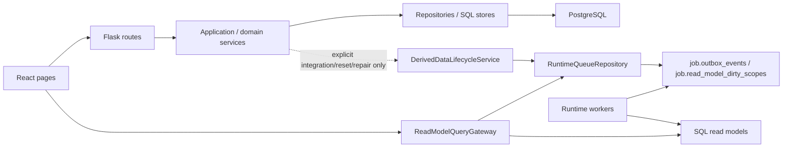
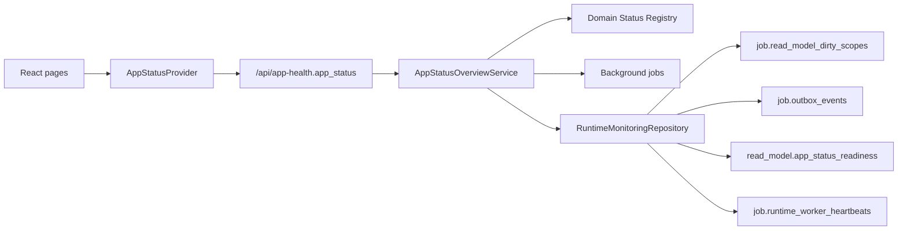

# 运行时调用链与模块归属

本文维护当前 app 的运行时序、read model/worker 边界和模块 owner。它回答“请求如何到达事实源”“页面访问如何收敛派生数据”“哪个模块负责维护某类事实”。

PostgreSQL 业务唯一真相的全局 owner matrix 见 `../architecture/module-boundaries/canonical-facts.md`。本文描述运行链路；具体 canonical fact family 的写入口、读入口和禁止路径以 canonical facts 合同和对应业务模块 `boundary-io.md` 为准。

## 总体调用链

## 读请求

1. 页面调用 `web/src/features/*/api.ts`。
2. Flask route 完成 HTTP 参数解析、权限映射和响应 shape。
3. 查询型 service 或 `ReadModelQueryGateway` 带着 expected schema/source contract 判断 read model 是否 fresh。
4. fresh 必须同时满足 expected contract、actual projection metadata、dirty/readiness 状态；缺少 expected contract 或 actual schema/source proof 时不能标 fresh。
5. fresh 时读取 SQL projection 或 repository；stale/missing/schema/source mismatch 时返回状态并按需 enqueue refresh。
6. 页面根据 `read_model_status`、`refreshing`、`stale`、`job` 等字段展示加载、刷新或不可用状态。

页面不能自行假设 read model fresh，也不能为了“有数据”绕过 freshness gate。

### 批量账务读路径

`/api/batch-accounting` 不拥有独立 read model。它的读边界由 `BatchAccountingService` 组合 Workbench active payload 与 `WorkbenchRelationReadFacade`：

1. `unsubmitted` bucket 只从专属年份 SQL loader 得到批量账务银行候选和日常报销 OA 候选，附件只按这些 OA IDs 读取；候选 row ids 只进入 batch 专用 relation facade I/O，不能调用 Workbench full-page builder、通用逐 scope relation reader 或把全量 open OA 当作输入。
2. `summary.submitted_count` 由 `get_batch_accounting_by_row_ids(..., submitted_year=year)` 的同一 repository bundle 返回；该快照同时证明候选/年度 scopes、读取候选关系和 referenced groups，并直接聚合年度 count。未提交首屏不能调用独立 count reader，也不能扫描 12 个月完整 relation DTO。
3. `submitted` bucket 的银行上下文只读专属年份 SQL loader；关系详情用一次 bulk proof + 一次 groups query 读取年度 DTO，并通过 batch 专用 row reader补齐 distribution，继续透出 freshness 诊断。
4. submit/withdraw 写路径只用 `bank_row_id + oa_row_ids` 专属 SQL loader 取得本次 row context，再交给 `WorkbenchRelationCommandService` 的 canonical write safety；不能因为整页普通 relation distribution 追赶中阻断无关 row 的写操作。
5. 任一专属 loader 缺失/无效时返回 `503 batch_accounting_workbench_read_model_unavailable`，不能跨用其它 loader、返回假空数据或回退 Workbench full-page builder。

## OA 会话启动边界

React 启动时由 `SessionProvider` 调用 `fetchSessionMe()`，通过 `SessionGate` 决定是否渲染业务路由。该请求属于应用 bootstrap 边界，不是页面级 loading：

- 前端 `fetchSessionMe()` 必须使用 `apiRequestJson(..., { timeoutMs })` 设置明确 deadline；请求挂起时进入 `error` 状态并提供 `SessionProvider.refresh()` 重试入口，不能无限停留在“正在验证 OA 会话”。
- 后端 `/api/session/me` 只做 HTTP mapping、错误码映射和 `resolve_oa_request_session(...)` 调用；OA 身份查询仍由 `OAIdentityService` 按 `FIN_OPS_OA_REQUEST_TIMEOUT_MS` 控制外部服务超时。
- `/api/oa-pending-payments*` 已由模块 route 的显式 read-session/write-auth ports 完整执行权限门，因此 global dispatcher 不再对该路径树重复解析同一 session；所有其它受保护页面继续经过原 global guard。该例外只去重 I/O，不缓存 identity、不改变共享权限策略或错误语义。
- 会话失败不能伪装成 read model fresh，也不写 facts、audit、dirty scope、outbox 或 read model。全局 App Status 可以把 session 不可用展示为 blocked/red，但页面本地不能改写后端 runtime facts。
- retry 只重新执行 session bootstrap；不会清理轻量页面 session state，除非返回的新用户 scope 或 session generation 触发前端缓存隔离规则。

## 写请求

1. Route 只做 HTTP contract、auth/permission、依赖组装和错误映射。
2. Application/domain service 校验业务规则，调用 repository 做原子写入。
3. 普通写只提交 owner canonical facts、可比较 source version、审计/idempotency 与必要领域任务；返回精确 affected scopes 作为信息，不产生页面 dirty/outbox。
4. API 返回写入结果、受影响月份/对象和版本；普通写的 `freshness_targets`、`operation_barrier_targets` 为空，不等待任何未访问页面重建。
5. 当前可见页可以在成功后重新执行自己的普通 GET；未访问或 hidden 页面不执行 I/O。
6. 页面进入、focus 或 hidden→visible 时，页面 query owner 比较 expected/actual source versions。只有 missing/stale 的当前精确 scope 经 `ReadModelRefreshGateway` 入 durable queue，worker 异步重建 projection，页面有界轮询到 fresh。

authoritative integration snapshot 默认同样只提交 canonical facts/source version；当前 OA sync 不主动入队页面 refresh。只有 data reset、repair/backfill/reapply 和人工 maintenance 可按已登记合同主动入队；它们必须被标记为 batch/full-history，经过 scope policy/gateway，并与普通用户写严格区分。`DerivedDataLifecycleService` 只服务管理员 settings reset 与历史 ETC repair，不是普通写后的默认分发器。

写模型、权限认证、冲突校验不做“分发 read model”；它们保留明确 command/service 边界。

任何写入 PostgreSQL canonical facts 的路径，都必须先落到 `../architecture/module-boundaries/canonical-facts.md` 登记的 owner 模块。非 owner 模块只能通过 owner service、facade、UoW 或明确 adapter 发起写入；不能把 `read_model.*`、Redis、RabbitMQ 或前端事件反向当作业务事实。

### 写操作后的页面闭环

用户触发确认关联、撤回、异常处理、规则保存、导入确认、批量账务或往来款闭环等普通写操作时：

1. 写 API 成功代表 canonical write、version、audit/idempotency 已提交，并返回 affected scopes/months。
2. 写操作立即结束，不轮询其它页面的 operation barrier，也不把无关后台工作显示为本次操作阻塞。
3. 当前可见页若需要立即展示结果，只重新调用自己的正常 GET。GET 的 freshness gate 负责 exact-scope enqueue、refreshing/failed 状态和有界轮询。
4. 未挂载或 document hidden 的页面不响应 domain event、不缓冲重放、不执行 load。route mount、window focus 或 hidden→visible 会递增中央 `activationGeneration`，当前页面据此重新运行自己的 load/freshness contract。
5. 排序、分页和筛选只改变当前查询参数，不是页面激活，也不能触发其它页面重建。

`/api/operation-barrier/status` 只保留给显式返回非空 targets 的 maintenance/integration 操作；普通 mutation 不再依赖它。权限/session、DB 可写性、canonical version/idempotency/owner 状态仍由 command service 和 UoW 决定。

### 待找发票规则写入

待找发票规则保存走独立规则集边界：

1. `PendingInvoiceRulesApplicationService.update_rules(...)` 只接收 HTTP route 映射后的 direction、payload 和 actor。
2. `AppSettingsService.update_pending_invoice_rule_groups(...)` 校验当前 direction 的规则 `version`、归一化分组、递增对应规则版本并写审计。
3. 保存结果返回 `direction`、`old_version`、`new_version`、`affected_groups`、`actor_id` 与精确 scope hints；普通 freshness/barrier targets 为空。
4. API finalizer 只清必要的 process-local cache，不调用 `DerivedDataLifecycleService`，不写 dirty/outbox。
5. 当前待找发票页重新执行 normal GET；其余逻辑消费者在各自被访问时比较规则 owner version 并精确收敛。expense/income 使用独立 expected version，避免无关方向被误判 stale。

OA 付款算法不读取待找发票规则，因此 OA 页面不因该规则保存而刷新。App Health 只展示真实 runtime scope 事件，不把规则版本变化推导成未实际入队的全局同步。

### 关联台 automatic decision 显示边界

关联台的“撤回关联”只出现在已配对区并且只撤销 active relation；未配对区不提供撤回动作，也不兼容自动候选拆分：

1. route / facade 通过 `WorkbenchRelationCommandService` 预览 canonical active relation 撤回；只有存在 active relation 时才返回 `withdraw_relation`。
2. 若没有 active relation，preview/submit 必须返回 relation not found 或 invalid operation，不能回退到任何 legacy candidate/decision 表、store 或 snapshot。
3. 自动匹配只允许在内存中生成可原子提交的 `FormalRelationPlan`；无法满足确定性安全规则的结果不持久化、不合并未配对事实，也不得驱动 pending invoice、input invoice usage、OA pending、cost statistics 等 linked-only 下游状态。
4. Workbench active generation、all-scope aggregate、groups page 和 `audit_workbench_relation_display` 必须共同保证旧 `case:decision:*`、`automatic_decision` / `automatic_match` payload 不会继续污染页面。Release A 仅为应用回滚暂留旧物理表，但运行时必须保持零访问；Release B 通过独立 migration 删除。

### 成本统计全期间 read model

成本统计的 `all` scope 是真实物化视图，不是只负责 fan-out 的队列父 scope：

1. Cost concrete-month 访问比较该月 canonical Workbench expected versions 与 active generation；Cost all 访问用一次 set-based proof 比较全部 canonical month scopes 与 active generations。上游 stale 时只 enqueue 真正漂移的 Workbench 月份，不同时 enqueue Cost；上游 fresh 后的下一次 GET 才允许收敛当前 Cost scope。relation transaction 和 Workbench publish 都不 fan-out Cost。
2. `active:YYYY-MM` / `all:YYYY-MM` 月份 shard 由 `CostStatisticsSqlProjectionBuilder` 基于对应工作台月份 read model 重建。
3. all 页面 gate 与 `CostStatisticsReadModelRefreshService` 都不能只信任 parent 自身 readiness。页面 gate 逐月比较 Cost child 的 Workbench/Bank Detail lineage、latest dependency dirty 与 parent `source_shards`；concrete month 页面也用该证明保护同页全期间 statistics，但 parent drift 不阻断当前月主 rows。缺失、stale 或 failed 的 shard 通过 `ReadModelRefreshGateway` 精确入队，父 scope 返回 `readiness_status=refreshing`，不写假 fresh。
4. 所有所需月份 shard fresh 后，`active:all` / `all:all` 从结构化月份 rows 聚合生成，并原子发布 parent snapshot；父 scope 不重复物化业务 rows，也不读 Workbench `all` 历史 payload。
5. 月份 shard 发布成功后重新入队同 project scope 的父 scope，使全期间视图最终收敛。
6. 页面只在 Cost scope fresh 时解锁；refreshing 显示本页面 overlay 并有界重试，不轮询全局 App Status 或 operation barrier。

## Worker 与队列

- durable truth：PostgreSQL 的 `job.outbox_events` 与 `job.read_model_dirty_scopes`。
- queue API：producer 先通过 `ReadModelRefreshGateway` / scope policy registry 归一化、校验和去重 read model scope，再委托 `RuntimeQueueRepository.enqueue_read_model_refresh(...)` 或事务内 writer 写入 durable queue。
- worker registry：`runtime_worker_registry.py` 定义 worker 名称、scope、manifest、health 可见性。
- parent/aggregate read model event 只能在 parent shard fresh 后发布聚合；遇到同一 read model `parent_scope_keys` 未 fresh 时，worker 必须补投 parent shard 并使用 retry 级退避，让 shard work 先 drain，不能用快速 dependency retry 反复重发 `all` 聚合事件。
- RabbitMQ 只能作为可选 wakeup/transport，不能成为 read model 状态事实源。
- Redis 只能缓存通过 fresh gate 后的 payload，不能缓存或伪造 freshness。

## App Health / SSE

App Health 读取后台任务、worker、queue 和 read model 状态，给页面提供可见的刷新、stale、失败和重试信号。SSE 或轮询只负责通知 UI 更新状态，不替代 durable queue。

## Global Runtime Status Plane

Global Runtime Status Plane 是 App Health 之上的用户可见全局投影。它由后端 `AppStatusOverviewService` 生成，输入只来自 session、后台任务、read model dirty scopes、outbox、worker heartbeat、runtime registry、依赖和 alert。React 页面不向它上报当前路由 loading，也不负责推导全局状态。

Runtime facts 的 read-side repository 是 `RuntimeMonitoringRepository.app_status_runtime_snapshot()`。PostgreSQL state store 通过公开方法暴露该 snapshot；`server.py` 只做 `/api/app-health` snapshot 组装，不能直接读取 state store 私有连接，也不能把 `job.*` 或 `read_model.*` SQL 写进 app status service。`AppStatusOverviewService` 只接收已归一化的 runtime facts 并执行状态优先级判定，不执行 rebuild、不写 queue、不调用页面 API。

`RuntimeMonitoringRepository.app_status_runtime_snapshot()` 必须保留 read model scope 明细。聚合后的 `read_model_statuses[read_model_key].status` 用于全局优先级，`read_model_statuses[read_model_key].scopes[]` 只包含 current-effective scope，用于解释具体 `scope_key`、`status`、`last_error` 和 `updated_at`。废弃 scope contract、已被 canonical scope 覆盖的历史 readiness/dirty scope 进入 `historical_scopes[]`；App Status domain payload 通过 `read_model_scopes[]` 暴露当前诊断，通过 `historical_read_model_scopes[]` 暴露历史诊断。前端只展示该后端事实，不按当前页面筛选自行推断。

左上角 App Status Icon 和 hover 面板只消费 `app_status`，因此切换页面不改变 icon 或 hover 内容。页面局部 table/drawer/form loading 只在页面内展示；如果页面背后的 read model 或 worker 未 ready，则由后端全局投影把对应 domain 标记为 busy 或 blocked。

`read_model.app_status_readiness` 是全局绿色状态的 read model 证明层。普通 read model refresh worker/service 在成功、失败、schema/source mismatch 时通过 repository 公共方法记录 `read_model_key`、scope、status、schema/source version、row count、生成时间和错误原因。`workbench` 使用 active generation/readiness metadata 作为等价证明，不机械套普通 projection 表。空业务结果允许 green，但必须有 readiness scope 记录；没有 readiness 记录的 registry read model 必须输出 `missing`，不能被空 dirty scope 推断为 ready。

Workbench active generation 在发布前执行对象身份仲裁。`WorkbenchObjectIdentityArbitrationService` 复用统一 identity policy，为 OA、流水、正式发票和 OA 附件发票写入 `object_identity_*` payload；正式发票与 OA 附件发票命中同一强发票 identity 时只能进入一个展示状态。`read_model.workbench_generation_consistency` 会把强发票 identity 或稳定银行 identity 横跨 `paired/open` 视为 inconsistent generation。`all` scope 从 active month shard 聚合时还必须执行展示归属权收敛：同一事实不能在多个 open group 中同时成为 visible/operable row；发票 open/open 使用强发票 identity 和 row id 收敛，银行 open/open 只按 row id 收敛以避免误折叠真实重复交易。

Workbench 首屏读路径必须以 active month generation set 为边界。`GET /api/workbench` 在一个 `REPEATABLE READ READ ONLY` 快照内组合返回已物化的 summary 与 paired/unpaired 各自首页，三者共用同一 generation-set version；repository 内部仍保留 summary 窄 I/O，但不再对外暴露独立 summary HTTP 合同。默认首屏 payload 只能在 fresh/stable gate 后按 generation version 进入 Redis read-through cache；cache miss/down 回到同一 PostgreSQL cold path，不预热、不入队、不伪装 fresh。后续搜索、筛选、分页和详情使用 `/api/workbench/groups` 等窄接口并固定 `expected_read_model_version`。`month=all` 只在查询时组合 active month generations 并仲裁唯一 canonical owner；不物化 `all` aggregate generation，不存在 aggregate-only worker lane 或 cache warmer。可判定月份的变更只 dirty 具体月份，无法判定范围或真正跨期时由现有 Workbench worker 把 `all` command fan-out 为月 shard。

runtime snapshot 读取失败不能被解释成 ready。critical read model failed/unavailable、required worker missing/mismatch/stale、关键依赖 missing/unavailable 或 session 不可用会把全局状态升级到 blocked/red；readiness missing/refreshing/stale/schema_mismatch/source_mismatch、dirty scope、outbox backlog、后台任务 queued/running/attention 和非阻塞 stale 会保持 busy/yellow。状态判定必须只看 current-effective blocker：已被后续同 scope `done` 事件或 fresh readiness 覆盖的 outbox failed/dead-letter、以及成本统计 legacy scope `all` / 裸 `YYYY-MM`，只能作为历史诊断或 repair 对象，不能污染当前页面同步状态。成本统计是特例化的 scope 级聚合：月份 shard failed/unavailable 是局部风险，不能无条件污染已经 fresh 的父 scope。

Registry 强一致由测试保护：domain registry 的 `read_model_keys` 必须存在于 `AppStatusReadModelRegistry`，`worker_instances` 必须存在于 `runtime_worker_registry`，`job_types` 必须存在于 app status background job registry 或 runtime state policy，`dependencies` 必须存在于 app status dependency registry。新增页面、read model、worker、job type 或 dependency 时，如果没有同步 registry 和测试，不能上线。

## 模块归属

| 模块域 | Route owner | Service / policy owner | Read model / worker owner | 文档入口 |
| --- | --- | --- | --- | --- |
| 银企核销 / 关联台 | reconciliation/workbench routes、部分 legacy `server.py` handler | reconciliation service、workbench service、relationship policy | workbench active generation、相关 SQL projection | `docs/product-specs/reconciliation-and-workbench.md` |
| 银行明细 / 标签 | bank detail routes | bank detail service、tagging/classification policy | bank detail read model refresh | `docs/product-specs/bank-turnover-and-no-oa.md` |
| 待找发票 / 发票生命周期 | pending invoice / invoice routes | pending invoice rules service、invoice lifecycle policy、pending invoice query service | invoice lifecycle、pending invoice、invoice usage / collection read models | `docs/product-specs/invoice-lifecycle.md` |
| OA 待付款 | OA pending payment routes | OA reconciliation/query service | OA pending payment SQL projection | `docs/product-specs/invoice-lifecycle.md` |
| ETC / 导入 | import and ETC routes | import service、ETC business batch service | import jobs、ETC batch state | `docs/product-specs/imports-and-etc.md` |
| 成本 / 税金 | cost/tax routes | cost attribution policy、tax offset service | cost/tax read models | `docs/product-specs/cost-tax.md` |
| 设置 / 健康 | settings/app health routes | settings service、runtime health service | runtime workers、queue health | `docs/product-specs/platform-settings-health.md` |
| 对象 identity/dedup | object identity routes/service | identity/dedup policy | repair/backfill worker if needed | `docs/operations/object-identity-dedup.md` |

## 仍需关注的 legacy 边界

- `server.py` 仍有部分 route handler 和 dependency wiring，需要按 `docs/architecture/backend-refactor/` 的 Python-first 方向继续拆分。
- 已拆出的 `routes_*.py` route owner 需要保持登记、导入、factory/accessor 和 handler 委托关系；`tests/test_platform_runtime_boundary_guards.py::PlatformRuntimeBoundaryGuardTests::test_server_route_owner_inventory_stays_registered` 作为静态 guard，防止新增 route module 未登记或既有 owner 回退到无归属的 `server.py` 私有链路。
- service 构造必须接收明确依赖，不把整个 `Application` 注入 service。
- repository 可以知道 SQL 表结构；业务 service 不应散落 SQL。
- worker 不依赖 `Application`、HTTP response、cookie/header 或 auth module。

## 维护要求

新增 read model、worker、dirty cascade、queue job、runtime health 指标或跨模块 service owner 时，更新本文。若变更属于长期重构计划进度，只更新 `docs/architecture/backend-refactor/migration-state-log.md`；若改变当前生产事实，还必须更新对应产品、开发或运维文档。
