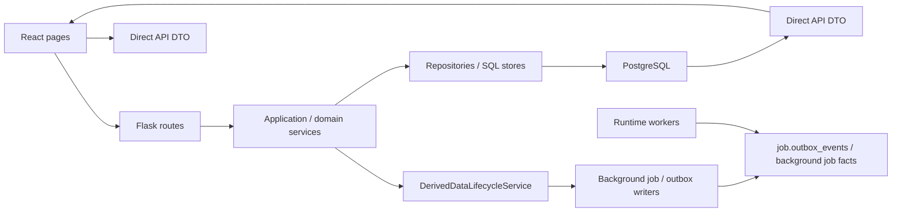
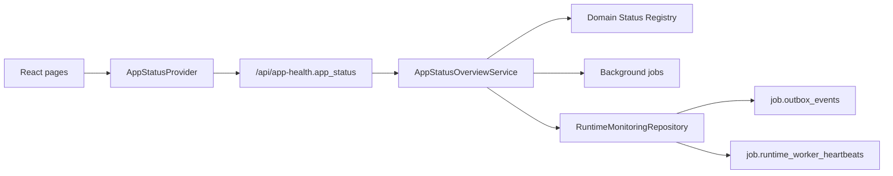

# 运行时调用链与模块归属

本文维护当前 app 的运行时序、direct API 读路径、真实 worker 边界和模块 owner。它回答“请求如何到达事实源”“写入如何触发派生数据或后台任务”“哪个模块负责维护某类事实”。

PostgreSQL 业务唯一真相的全局 owner matrix 见 `../architecture/module-boundaries/canonical-facts.md`。本文描述运行链路；具体 canonical fact family 的写入口、读入口和禁止路径以 canonical facts 合同和对应业务模块 `boundary-io.md` 为准。

2026-06-28 当前架构见 `../architecture/direct-api-read-architecture.md`：页面读路径走 direct API，legacy read model/freshness/operation barrier 只作为历史迁移对象或负向 guard 保留。

## 总体调用链

图中 `Direct API DTO` 是页面读路径；历史 `job.read_model_dirty_scopes`、SQL page read models 和 `ReadModelQueryGateway` 不再是当前页面读取链路。

## 读请求

目标 direct API 读请求：

1. 页面调用 `web/src/features/*/api.ts`。
2. Flask route 完成 HTTP 参数解析、权限映射和响应 shape。
3. 查询型 service 调用 narrow repository。
4. repository 直接从 PostgreSQL canonical facts、OA SQL projection、导入事实和必要业务表分页/过滤/聚合查询。
5. API 返回业务 DTO、分页、summary、权限和明确错误，不返回 read model freshness 字段。
6. 页面按普通 loading、empty、error 和业务状态展示。

Legacy read model 读请求只作为历史迁移对象或负向 guard 保留。`ReadModelQueryGateway` 已删除，迁移目标不是继续扩展 freshness gate。

## OA 会话启动边界

React 启动时由 `SessionProvider` 调用 `fetchSessionMe()`，通过 `SessionGate` 决定是否渲染业务路由。该请求属于应用 bootstrap 边界，不是页面级 loading：

- 前端 `fetchSessionMe()` 必须使用 `apiRequestJson(..., { timeoutMs })` 设置明确 deadline；请求挂起时进入 `error` 状态并提供 `SessionProvider.refresh()` 重试入口，不能无限停留在“正在验证 OA 会话”。
- 后端 `/api/session/me` 只做 HTTP mapping、错误码映射和 `resolve_oa_request_session(...)` 调用；OA 身份查询仍由 `OAIdentityService` 按 `FIN_OPS_OA_REQUEST_TIMEOUT_MS` 控制外部服务超时。
- 会话失败不能写 facts、audit、outbox、background job 或历史 read model。全局 App Status 可以把 session 不可用展示为 blocked/red，但页面本地不能改写后端 runtime facts。
- retry 只重新执行 session bootstrap；不会清理轻量页面 session state，除非返回的新用户 scope 或 session generation 触发前端缓存隔离规则。

## 写请求

1. Route 只做 HTTP contract、auth/permission、依赖组装和错误映射。
2. Application/domain service 校验业务规则，调用 repository 做原子写入。
3. 写入产生业务事件、audit 和 affected ids/months。
4. API 返回写入结果、受影响月份/对象、版本、job 或可选 updated DTO。
5. 前端直接 refetch 目标 direct GET。

写后跨模块影响通过 canonical facts、audit、affected ids/months、真实后台任务和 direct refetch 表达；不得重新引入页面 read model refresh。

写模型、权限认证、冲突校验不做“分发 read model”；它们保留明确 command/service 边界。

任何写入 PostgreSQL canonical facts 的路径，都必须先落到 `../architecture/module-boundaries/canonical-facts.md` 登记的 owner 模块。非 owner 模块只能通过 owner service、facade、UoW 或明确 adapter 发起写入；不能把 `read_model.*`、Redis、RabbitMQ 或前端事件反向当作业务事实。

### 写操作后的页面闭环

用户触发确认关联、撤回、异常处理、批量账务、免 OA 批次、往来款闭环等写操作时，目标行为是写成功后直接 refetch direct GET。需要阻塞用户继续操作时，阻塞条件来自写事务、权限、版本冲突、DB 可用性或真实后台任务，不来自 read model freshness。

Legacy operation barrier backend 已删除；前端页面不再轮询该 API：

1. 写 API 返回成功只代表 canonical write 已提交并产生 affected scopes/months。
2. 目标 frontend 行为是写成功后直接 refetch 受影响 direct GET，或使用写响应中的真实投影。
3. 后端 operation barrier service/endpoint 已删除；read-model target fields 仍是后续 backend 批次删除对象。

权限/session、DB 可写性、canonical relation version/idempotency/owner 状态仍由 command service 和 UoW 决定。

### 待找发票规则写入

待找发票规则保存走独立规则集边界：

1. `PendingInvoiceRulesApplicationService.update_rules(...)` 只接收 HTTP route 映射后的 direction、payload 和 actor。
2. `AppSettingsService.update_pending_invoice_rule_groups(...)` 校验当前 direction 的规则 `version`、归一化分组、递增对应规则版本并写审计。
3. 保存事件返回 `event_type=pending_invoice_rules_changed`、`direction`、`old_version`、`new_version`、`affected_groups` 和 `actor_id`。
4. API finalizer 只清必要内存 cache，并把 `pending_invoice_rules_changed` 交给 `DerivedDataLifecycleService`。
5. lifecycle executor 只发布真实业务事件、affected domains、outbox 或后台任务；API server 不同步重建发票生命周期、待找发票、成本、税金、OA 或关联台 read model。

该事件的影响域必须保持低耦合：只影响待找发票、发票生命周期、workbench、进项使用、OA 待付款、销项收款、税金抵扣、成本统计和 search 的 direct read 结果或真实后台任务；不刷新 `turnover_ledger`、`no_oa_bank_batch`、`bank_account_balance`。App Health 只根据真实 runtime、worker、job、dependency 和 alert 事实判定 busy 或 blocked，不能因为规则版本变化把无关页面标红。

### 关联台候选拆分写入

关联台未配对区的“撤回关联”是统一入口，不等同于一定撤销 active relation：

1. route / facade 先通过 `WorkbenchRelationCommandService` 预览 canonical active relation 撤回；只有存在 active relation 时才返回 `withdraw_relation`。
2. 若没有 active relation，facade 继续判定自动候选拆分。legacy candidate 来自 `WorkbenchCandidateMatchService`；自动匹配 decision 读取仍可经过 `WorkbenchReconciliationDecisionStore` 兼容旧 `read_model.workbench_reconciliation_decisions` 存储，但页面事实由 Workbench direct API 输出。
3. 命中自动候选或 automatic decision 时，preview 必须返回 `operation_type=split_candidate`、`preview_id`、`submit_expected_versions` 和候选自身的 affected scope；submit suppress candidate/decision，不写 `app.workbench_pair_relations` history。
4. candidate/decision split 完成后只更新候选/decision facts；Workbench direct API 重新读取当前 facts，不再 invalidate 或刷新候选所属月份的 page read model scope。

### 成本统计 direct read

成本统计页面不再有 `all` read model 父 scope 或 SQL projection worker：

1. `/api/cost-statistics*` 由 `CostStatisticsQueryService` 直接调用业务 service/repository 组装 explorer、summary、export-preview 和 export payload。
2. `active` / `all` project scope 是 direct query 参数，不再物化为 `active:YYYY-MM`、`all:YYYY-MM`、`active:all` 或 `all:all` read model shard。
3. 页面不消费 `read_model_status`、readiness、dirty scope、operation barrier 或 refresh job 结果；写操作完成后通过 direct refetch / cache warmup 体现最新事实。
4. 历史 `read_model.cost_statistics_*` 表只作为迁移清理对象存在，不能作为页面 freshness proof 或后台重建目标。
5. App Status 只展示真实 runtime/worker/import/cache warmup 诊断；不得重新绑定成本统计 page read-model readiness。

## Worker 与队列

- durable truth：PostgreSQL 的 `job.outbox_events`、background job facts、worker heartbeat 和 canonical facts。
- queue API：真实后台任务 producer 写入对应 job/outbox 事实；不得恢复 `RuntimeQueueRepository.enqueue_read_model_refresh(...)` 作为页面刷新入口。
- worker registry：`runtime_worker_registry.py` 定义真实 worker 名称、scope、manifest、health 可见性。
- RabbitMQ 只能作为可选 wakeup/transport，不能成为页面数据状态事实源。
- Redis 只能做可删除短 TTL response cache，不能缓存或伪造 freshness。

## App Health / SSE

目标 App Health 读取 session、后台任务、保留 worker、queue、依赖、alert 和 deployment/runtime guard，不再读取页面 read model readiness。页面级 direct payload loading/error/unavailable 信号不能通过 App Health 或 App Status 重新变成全局健康事实。SSE 或轮询只负责通知 UI 更新状态，不替代 durable queue。

## Global Runtime Status Plane

Global Runtime Status Plane 是 App Health 之上的用户可见全局投影。它由后端 `AppStatusOverviewService` 生成，输入只来自 session、后台任务、outbox、worker heartbeat、runtime registry、依赖和 alert。React 页面不向它上报当前路由 loading，也不负责推导全局状态。

Runtime facts 的 read-side repository 是 `RuntimeMonitoringRepository.app_status_runtime_snapshot()`。PostgreSQL state store 通过公开方法暴露该 snapshot；`server.py` 只做 `/api/app-health` snapshot 组装，不能直接读取 state store 私有连接，也不能把 `job.*` 或 `read_model.*` SQL 写进 app status service。`AppStatusOverviewService` 只接收已归一化的 runtime facts 并执行状态优先级判定，不执行 rebuild、不写 queue、不调用页面 API。

`AppStatusOverviewService` 不再接收 `read_model_statuses`，也不在 domain payload 或 `runtime_summary` 中暴露 read model readiness/scope 诊断。`RuntimeMonitoringRepository.app_status_runtime_snapshot()` 仍可为其他运维视图提供 durable queue、worker 和历史 read model 数据，但这些字段不能作为 App Status domain/overall 状态输入。

左上角 App Status Icon 和 hover 面板只消费 `app_status`，因此切换页面不改变 icon 或 hover 内容。页面局部 table/drawer/form loading 只由 direct API 和页面状态决定；全局投影只由真实 runtime、worker、job、dependency、session 和 alert 事实染色。

历史 Workbench active generation 在发布前执行对象身份仲裁。`WorkbenchObjectIdentityArbitrationService` 复用统一 identity policy，为 OA、流水、正式发票和 OA 附件发票写入 `object_identity_*` payload；正式发票与 OA 附件发票命中同一强发票 identity 时只能进入一个展示状态。`read_model.workbench_generation_consistency`、active month shard 和 `all` scope 聚合只作为迁移审计对象保留，不再作为页面首屏数据源或 App Status readiness 输入。

Workbench 首屏读路径现在走 direct `/api/workbench` payload 及其 summary/groups/group-detail 切片，不再以 SQL active generation 为页面数据源。`workbench-read-model` worker lane、groups cache warmup、refresh-status、Redis fresh gate 和 read-model status 均不得重新接回页面 GET；历史 `read_model.workbench_*` 表只作为迁移/审计对象。

runtime snapshot 读取失败不能被解释成 ready。required worker missing/mismatch/stale、关键依赖 missing/unavailable 或 session 不可用会把全局状态升级到 blocked/red；outbox backlog、后台任务 queued/running/attention 和非阻塞 stale 会保持 busy/yellow。Legacy read model readiness missing/refreshing/stale/schema_mismatch/source_mismatch/failed/unavailable 不再进入 App Status domain、overall 或 runtime summary。状态判定必须只看 current-effective runtime blocker：已被后续同 scope `done` 事件覆盖的 outbox failed/dead-letter 只能作为历史诊断或 repair 对象，不能污染当前页面同步状态。

Registry 强一致由测试保护：domain registry 的 `worker_instances` 必须存在于 `runtime_worker_registry`，`job_types` 必须存在于 app status background job registry 或 runtime state policy，`dependencies` 必须存在于 app status dependency registry。新增 worker、job type 或 dependency 时，如果没有同步 registry 和测试，不能上线。新增页面不得把 read model key 加回 App Status domain registry。

## 模块归属

| 模块域 | Route owner | Service / policy owner | Direct/runtime evidence owner | 文档入口 |
| --- | --- | --- | --- | --- |
| 银企核销 / 关联台 | reconciliation/workbench routes、部分 legacy `server.py` handler | reconciliation service、workbench service、relationship policy | direct workbench payload、matching job；历史 active generation/SQL projection 仅作迁移审计 | `docs/product-specs/reconciliation-and-workbench.md` |
| 银行明细 / 标签 | bank detail routes | bank detail service、tagging/classification policy、direct effective category provider | 无 active bank_detail read-model worker；页面和下游标签读取走 direct facts | `docs/product-specs/bank-turnover-and-no-oa.md` |
| 待找发票 / 发票生命周期 | pending invoice / invoice routes | pending invoice rules service、invoice lifecycle policy、pending invoice query service | direct invoice/pending invoice facts；历史 read models 为迁移对象 | `docs/product-specs/invoice-lifecycle.md` |
| OA 待付款 | OA pending payment routes | OA reconciliation/query service | direct OA projection / pending payment facts | `docs/product-specs/invoice-lifecycle.md` |
| ETC / 导入 | import and ETC routes | import service、ETC business batch service | import jobs、ETC batch state | `docs/product-specs/imports-and-etc.md` |
| 成本 / 税金 | cost/tax routes | cost attribution policy、tax offset service | direct cost/tax payload、cache warmup jobs | `docs/product-specs/cost-tax.md` |
| 设置 / 健康 | settings/app health routes | settings service、runtime health service | runtime workers、queue health | `docs/product-specs/platform-settings-health.md` |
| 对象 identity/dedup | object identity routes/service | identity/dedup policy | canonical identity audit、relation facts、business repair tools | `docs/operations/object-identity-dedup.md` |

## 仍需关注的 legacy 边界

- `server.py` 仍有部分 route handler 和 dependency wiring，需要按 `docs/architecture/backend-refactor/` 的 Python-first 方向继续拆分。
- 已拆出的 `routes_*.py` route owner 需要保持登记、导入、factory/accessor 和 handler 委托关系；`tests/test_platform_runtime_boundary_guards.py::PlatformRuntimeBoundaryGuardTests::test_server_route_owner_inventory_stays_registered` 作为静态 guard，防止新增 route module 未登记或既有 owner 回退到无归属的 `server.py` 私有链路。
- service 构造必须接收明确依赖，不把整个 `Application` 注入 service。
- repository 可以知道 SQL 表结构；业务 service 不应散落 SQL。
- worker 不依赖 `Application`、HTTP response、cookie/header 或 auth module。

## 维护要求

迁移 legacy read model、新增真实后台 worker、改变 dirty cascade、queue job、runtime health 指标或跨模块 service owner 时，更新本文。新增页面读取不得新增 read model；若变更属于长期重构计划进度，只更新 `docs/architecture/backend-refactor/migration-state-log.md`；若改变当前生产事实，还必须更新对应产品、开发或运维文档。
