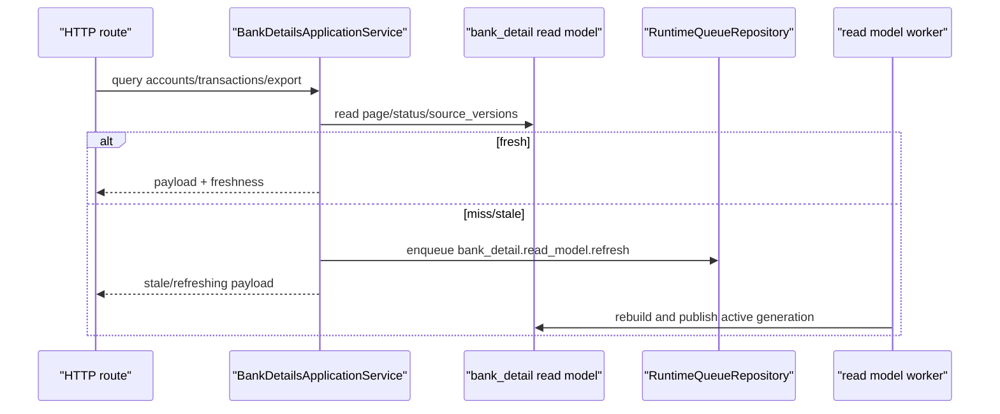
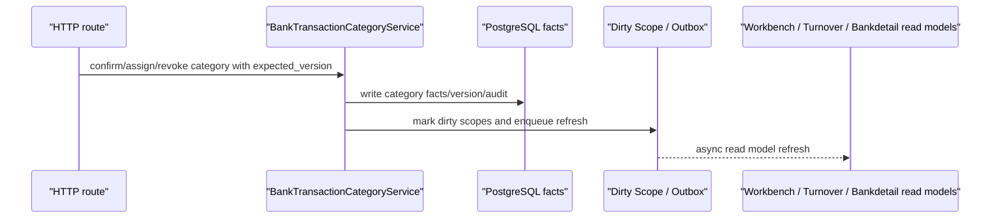
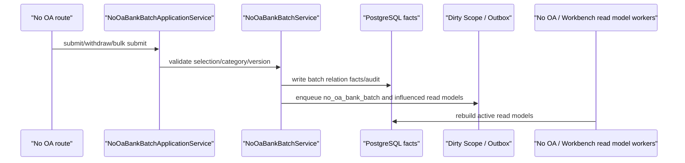

# Bankdetail / No OA Batch Discovery and Planning

## PF-P190 Summary

`PF-P190` 是 Bankdetail / No OA Batch 模块的 Micro-JIT discovery。它只做边界扫描、运行时链路整理、风险识别和下一步测试计划，不修改业务代码。

结论：

- Bankdetail 不能只按旧 `bank_details_service.py` 重构；当前边界已经扩展到 route facade、application service、SQL projection、category/auto-tag rules、account balance read model、No OA Batch lifecycle、runtime worker 和 Turnover/Workbench 影响链。
- No OA Batch 必须作为 Bankdetail 模块内的高风险子域处理，而不是单独散落在 Workbench 或 Imports。
- Turnover Ledger 已完成后的 bank row tags / category expected-version ownership，会反向要求 Bankdetail 明确分类 facts、tag versions、dirty/outbox 和 read model refresh 的责任边界。
- 下一步必须先写 characterization tests，不能直接抽 service 或引入 UoW。

## API Boundary Matrix

| API | Owner | Current route boundary | Primary behavior | Next test focus |
| --- | --- | --- | --- | --- |
| `GET /api/bank-details/accounts` | Bankdetail | `app/routes_bank_details.py` | 银行账户列表 / 账户余额投影 | response shape、freshness、空数据 |
| `GET /api/bank-details/transactions` | Bankdetail | `app/routes_bank_details.py` | 银行流水分页、筛选、排序、read model freshness | pagination/count 一致性、stale/refreshing 语义 |
| `GET /api/bank-details/transactions/export` | Bankdetail | `app/routes_bank_details.py` | 导出流水 | export payload 与 filters |
| `GET/PUT /api/bank-details/auto-tag-rules` | Bankdetail | `app/routes_bank_details.py` | 自动打标规则读取和更新 | validation、audit、read model dirty scope |
| `POST /api/bank-details/auto-tag-rules/reapply` | Bankdetail | `app/routes_bank_details.py` | 重新应用自动分类 | idempotency baseline、dirty/outbox |
| `POST /api/bank-details/auto-tag-rules/file-replacement` | Bankdetail | `app/routes_bank_details.py` | 从文件来源替换规则 | validation、partial failure |
| `POST/DELETE /api/bank-details/transactions/{id}/category-confirmation` | Bankdetail | `app/routes_bank_details.py` | 分类确认 / 撤销 | expected_version、conflict、dirty/outbox |
| `POST/DELETE /api/bank-details/transactions/{id}/category-assignment` | Bankdetail | `app/routes_bank_details.py` | 手动分类分配 / 清除 | expected_version、conflict、Turnover influence |
| `GET /api/no-oa-bank-batches` | Bankdetail / No OA | `app/routes_no_oa_bank_batches.py` | 免 OA 批次列表 | read model 不同步刷新、freshness |
| `GET /api/no-oa-bank-batches/{batch_id}` | Bankdetail / No OA | `app/routes_no_oa_bank_batches.py` | 批次详情 | response shape、stale category drift |
| `GET/PUT /api/no-oa-bank-batches/tag-selection` | Bankdetail / No OA | `app/routes_no_oa_bank_batches.py` | tag selection read/write | expected_version conflict `no_oa_bank_batch_tag_selection_version_conflict` |
| `POST /api/no-oa-bank-batches/submit-selection` | Bankdetail / No OA | `app/routes_no_oa_bank_batches.py` | 提交当前选择 | stale tag/category conflict |
| `POST /api/no-oa-bank-batches/submit` | Bankdetail / No OA | `app/routes_no_oa_bank_batches.py` | bulk submit | partial result、idempotency baseline |
| `POST /api/no-oa-bank-batches/{batch_id}/submit` | Bankdetail / No OA | `app/routes_no_oa_bank_batches.py` | 单批次 submit | facts/audit/dirty/outbox |
| `POST /api/no-oa-bank-batches/{batch_id}/withdraw` | Bankdetail / No OA | `app/routes_no_oa_bank_batches.py` | 单批次 withdraw | facts rollback、dirty/outbox、Workbench influence |

## File Ownership

### Route / HTTP Boundary

| File | Owner | Notes |
| --- | --- | --- |
| `backend/src/fin_ops_platform/app/routes_bank_details.py` | Bankdetail | Route facade。允许读取 `OARequestSession`，但只能做 HTTP mapping 和依赖组装。 |
| `backend/src/fin_ops_platform/app/routes_no_oa_bank_batches.py` | Bankdetail / No OA | Route facade。不得把 No OA service 逻辑回灌到 handler。 |
| `backend/src/fin_ops_platform/app/bank_account_balance_backfill.py` | Platform / Ops, secondary Bankdetail | 回填入口，后续 Bankdetail read model 变更必须带 smoke checklist。 |
| `backend/src/fin_ops_platform/app/bank_detail_backfill.py` | Platform / Ops, secondary Bankdetail | 银行流水 read model 回填入口。 |
| `backend/src/fin_ops_platform/app/bank_detail_category_api.py` | Bankdetail legacy route boundary | 后续需确认是否仍被 server 注册。 |

### Services / Application Boundary

| File | Owner | Risk |
| --- | --- | --- |
| `services/bank_details_application_service.py` | Bankdetail | 高风险。聚合 read model freshness、cache、export、category mutation 和 enqueue。 |
| `services/bank_details_service.py` | Bankdetail | legacy bank detail service。 |
| `services/bank_detail_sql_projection.py` | Bankdetail repository/projection | SQL projection owner；业务 service 不应散落 SQL。 |
| `services/bank_detail_read_model_refresh.py` | Bankdetail read model worker | `bank_detail.read_model.refresh` builder。 |
| `services/bank_details_export_service.py` | Bankdetail | 导出 payload contract。 |
| `services/bank_transaction_category_service.py` | Bankdetail | 高风险大文件；分类 facts、version、Turnover/Workbench influence。 |
| `services/bank_transaction_auto_category_service.py` | Bankdetail | 自动分类规则执行。 |
| `services/bank_detail_category_selection.py` | Bankdetail | 分类选择 / selection contract。 |
| `services/bank_transaction_tag_read_facade.py` | Bankdetail | tag read facade。 |
| `services/bank_transaction_effective_category_provider.py` | Bankdetail | effective category provider。 |
| `services/bank_turnover_tag_semantics.py` | Bankdetail, secondary Turnover | Turnover bank row tags 和 Bankdetail 分类语义桥。 |
| `services/bank_account_balance_projection.py` | Bankdetail | 账户余额 projection。 |
| `services/bank_account_balance_read_model_refresh.py` | Bankdetail read model worker | balance refresh builder。 |
| `services/bank_account_resolver.py` | Bankdetail | account identity helper。 |
| `services/bank_internal_transfer_detector.py` | Bankdetail | 内部转账识别。 |
| `services/bank_details_relation_tag_projection_service.py` | Bankdetail / Workbench influence | relation tag projection。 |
| `services/no_oa_bank_batch_application_service.py` | Bankdetail / No OA | 高风险。No OA route application boundary。 |
| `services/no_oa_bank_batch_service.py` | Bankdetail / No OA | 高风险大文件；submit/withdraw、legacy migration、relation consistency。 |
| `services/no_oa_bank_batch_read_model_refresh.py` | Bankdetail / No OA read model worker | `no_oa_bank_batch.read_model.refresh` builder。 |
| `services/no_oa_bank_batch_tag_selection_service.py` | Bankdetail / No OA | tag selection expected-version owner。 |
| `services/no_oa_managed_rule_policy.py` | Bankdetail / No OA | managed rule policy。 |
| `services/no_oa_legacy_relation_migration_service.py` | Bankdetail / No OA legacy/ops | legacy migration，不能进入高频 request path。 |

## Runtime Sequence

### Bank Detail Read

### Bank Category Write

PF-P190 发现阶段未证明所有 write side effects 已在同一 transaction 中完成；PF-P191 必须先 characterization 当前行为，再进入 extraction/UoW。

### No OA Submit / Withdraw

## Cross-Module Contracts

- Turnover Ledger：`/api/turnover-ledger/bank-row-tags/batch` 是 Turnover API，但写入 Bankdetail facts。后续 Bankdetail 必须明确 tag/category version ownership。
- Workbench：No OA submit/withdraw 和 bank category 写入会影响 Workbench grouping/read model，不能同步调用 Workbench usecase。
- Search / Pending Query：Bankdetail facts 和 source_versions 可能影响 pending/search projection。
- App Settings：分类、标签、规则配置属于 settings/provider 边界，Bankdetail service 不应直接依赖整个 `Application`。
- Runtime Worker：`runtime_worker_registry.py` 中存在 `no-oa-bank-batch-read-model` worker；RabbitMQ 只作为 wakeup/transport，PostgreSQL durable queue 是事实源。

## High-Risk Findings

1. `bank_transaction_category_service.py` 与 `no_oa_bank_batch_service.py` 体量极大，必须按行为切片测试后再抽 facade/UoW。
2. `bank_details_application_service.py` 当前职责过宽，后续应拆成 query facade、category write facade、export facade 和 read model freshness boundary。
3. `server.py` 仍包含 bank detail / no OA read model enqueue、source version、fallback/cache helper；后续要逐步移入明确 service/repository 边界。
4. No OA read APIs 已有“不在 GET 同步刷新”的测试事实，后续必须继续保护。
5. Category / tag selection 已有 expected-version conflict 契约，后续不能为了抽服务而丢失 `409` 语义。
6. 回填脚本是生产运维入口，Bankdetail read model 改动必须附带 ops smoke checklist。

## Recommended Next Prompts

1. `PF-P191 - Bankdetail / No OA Batch Characterization Tests`
   - 只新增或补强测试。
   - 锁定 Bankdetail read freshness、pagination/count、category expected-version、dirty/outbox baseline、No OA list/detail/tag-selection/submit/withdraw、no synchronous refresh。
   - 不修改 production code。
2. `PF-P192 - Bankdetail Route/Application Facade Cleanup`
   - 在测试保护下薄化 `server.py` / route helper。
   - 只拆 HTTP mapping 与 service 调用，不引入 UoW。
3. `PF-P193 - Bankdetail Category / Auto Tag Boundary Planning`
   - 深挖 `bank_transaction_category_service.py`，输出写路径 UoW readiness。
4. `PF-P194 - No OA Batch Write Boundary Planning`
   - 深挖 submit/withdraw/bulk submit，明确 facts/audit/dirty/outbox 同事务目标。

## PF-P191 Hard Constraints

- 不得跳过 characterization tests 直接抽 service 或引入 UoW。
- 不得访问真实 Redis/RabbitMQ/OA/Mongo/MySQL。
- 不得修改 schema、deploy、Nginx、生产配置或 feature flag。
- 不得把 No OA Batch 机械拆成独立脱离 Bankdetail 的模块；它是 Bankdetail 模块内高风险子域。
- Tests 不得通过放宽断言、删除旧字段或跳过 legacy compatibility 来转绿。

## PF-P191 Characterization Test Update

PF-P191 已补强第一批低成本 route facade characterization tests，作为后续 route/application cleanup 的安全网。

新增锁定：

- Bankdetail route facade 在 mutation permission denied 时必须直接返回 403，且不得调用 application service。
- Bankdetail category validation/conflict payload 必须保留 `error` 和 `transaction_id`。
- No OA tag selection expected-version conflict 必须返回 409 和 `no_oa_bank_batch_tag_selection_version_conflict`。
- No OA submit 必须保留 expected_version string normalization、actor mapping 和 note trim。
- No OA bulk submit 必须保留 partial failure aggregation、affected_months / changed_case_ids aggregation，并只通过一次 `after_mutation(..., persist=True)` 收口。

PF-P191 仍未覆盖的后续测试目标：

- Bankdetail SQL read model pagination/count/freshness。
- Category / auto-tag dirty scope 与 outbox baseline。
- No OA submit/withdraw service-level facts/audit/dirty/outbox。
- Account balance read model refresh 与 backfill smoke checklist。

## PF-P192 Route / Application Cleanup Planning

PF-P192 继续保持 planning-only，不修改 production code。当前扫描结论：

- `app/routes_bank_details.py` 和 `app/routes_no_oa_bank_batches.py` 已经承担 route facade 角色，后续不应再新增平行 route abstraction。
- `server.py` 中 Bankdetail / No OA path dispatch 仍负责 HTTP response 构造、文件导出 response、body parsing、session mapping 和 route facade 调用；这部分属于允许的 HTTP mapping。
- `server.py` 中仍存在 Bankdetail / No OA read model source version、enqueue、fallback/cache helper。下一步 cleanup 不能机械移动函数，必须先判断每个 helper 属于：
  - route-only HTTP mapping；
  - Bankdetail application service；
  - read model freshness boundary；
  - runtime queue / repository adapter；
  - ops/backfill。
- `BankDetailsApplicationService` 当前依赖较宽，包括 `state_store`、`runtime_repositories`、SQL read repository、derived lifecycle、cache clearers 和多个 callback。后续 cleanup 目标应是减少隐式 callback/god dependency，而不是把 route handler 原样搬入 service。
- `NoOaBankBatchApplicationService` 当前承担 read model fallback、tag selection、submit/withdraw、Workbench relation influence、derived lifecycle 和 queue enqueue。后续必须先用 tests 锁住 service-level side effects，再做 UoW 或 service 拆分。

PF-P192 后推荐下一条：

- `PF-P193 - Bankdetail / No OA Batch Read Model Characterization Tests`
  - 先覆盖 Bankdetail SQL read model pagination/count/freshness、No OA read model missing/stale/no synchronous refresh。
  - 不修改 production code。
  - 先不做 route/application production cleanup，因为现有低成本 route facade tests 还不足以保护 SQL/read model 行为。

Cleanup 禁止线：

- 不新增平行 route abstraction。
- 不把 `Application` god object 注入 service。
- 不把 HTTP response、cookie/header/session 逻辑移入 service。
- 不把 SQL 散落到业务 service。
- 不在没有 read model characterization tests 前改 `_transactions_from_sql_read_model`、No OA read model fallback 或 runtime queue enqueue helper。

## PF-P193 Read Model Characterization Test Update

PF-P193 已补强 Bankdetail read model missing-scope characterization，并复验 No OA read model integration tests。

新增锁定：

- 当 Bankdetail SQL read model scope missing 时，`BankDetailsApplicationService.transactions_payload(...)` 必须返回 `read_model_status="refreshing"`。
- missing scope 必须通过 `RuntimeQueueRepository.enqueue_read_model_refresh(scope_type="bank_detail", scope_key=<month>, reason="api_missing")` enqueue durable refresh。
- missing SQL read model 不得同步调用 legacy `BankDetailsService.list_transactions(...)` 扫描事实表。
- page_size 继续在 application boundary clamp 到 100，避免大页请求绕过 read model missing gate。

复验确认：

- No OA missing SQL read model GET 路径不会同步 rebuild batches，只 enqueue `no_oa_bank_batch` refresh。
- No OA stale SQL source versions 不会伪装 fresh。

PF-P193 后仍未覆盖的测试目标：

- Category / auto-tag write 的 dirty scope 与 outbox baseline。
- No OA submit/withdraw service-level facts/audit/dirty/outbox。
- Account balance read model refresh 与 backfill smoke checklist。

## PF-P194 Category / Auto Tag Side-Effect Characterization Update

PF-P194 已补强 Bankdetail auto-tag rules update 的 side-effect characterization。

新增锁定：

- `finalize_auto_tag_rules_update(...)` 必须清理 relation tag projection cache 和 Turnover Ledger read model cache。
- Auto-tag rules 变更必须 enqueue `turnover_ledger` all-scope refresh，reason 为 `bank_auto_tag_rules_changed`。
- 带 `bank_detail_priority_scope_keys` 的变更必须 enqueue 对应 Bankdetail priority scope refresh，reason 为 `bank_auto_tag_rules_changed_priority`。
- Priority scope 不允许把 `"all"` 当作 Bankdetail priority month scope 直接 enqueue。
- Auto-tag rules 变更必须发出 derived lifecycle event `bank_auto_tag_rules_changed`，并保留 `new_version` metadata。

PF-P194 后仍未覆盖的测试目标：

- No OA submit/withdraw service-level facts/audit/dirty/outbox。
- Account balance read model refresh 与 backfill smoke checklist。
- 真正的事务内 facts/audit/dirty/outbox UoW 收敛尚未实现。

## PF-P195 No OA Mutation Side-Effect Characterization Update

PF-P195 已新增 `tests/test_no_oa_bank_batch_application_service.py`，锁定 No OA application service 的 mutation side-effect 边界。

新增锁定：

- `after_mutation(...)` 必须过滤合法月份，只把 `YYYY-MM` 月份传给 derived lifecycle event。
- `after_mutation(..., persist=True)` 必须通过 `save_no_oa_bank_batch_mutation(...)` 持久化 pair relation snapshot、No OA batch snapshot、Workbench read model snapshot、changed case ids 和 expanded workbench scope keys。
- `after_mutation(..., persist=False)` 只发 lifecycle event，不保存 mutation snapshot。
- `enqueue_background_refresh(...)` 必须只通过 durable queue boundary enqueue `no_oa_bank_batch` read model refresh，并过滤空 scope。

PF-P195 后仍未覆盖的目标：

- Account balance read model refresh 与 backfill smoke checklist。
- No OA/Bankdetail 真实 PostgreSQL 事务内 facts/audit/dirty/outbox UoW 收敛。

当前切片已覆盖 discovery、route characterization、read model characterization、category/auto-tag side effects、No OA mutation side effects。下一步适合生成 cumulative MG，统一覆盖 PF-P190 到 PF-P195 的完整 diff 后合入 `dev`。

## PF-P196 Account Balance / Backfill Smoke Planning

PF-P196 从最新 `dev` 新建分支后执行，继续 Bankdetail / No OA 模块，只做 account balance 和 backfill smoke planning，不修改业务代码。

当前事实：

- `bank_account_balance.read_model.refresh` 已有独立 refresh service：`BankAccountBalanceReadModelRefreshService`。
- `BankAccountBalanceProjectionBuilder` 直接从 `app.bank_transactions` 聚合账户余额，并通过 `PostgresReadModelRepository.save_bank_account_balances(...)` 发布 read model。
- `tests/test_bank_account_balance_read_model.py` 已覆盖：
  - 最新非空余额选择。
  - 稳定 account identity。
  - 人民币 currency alias normalize。
  - repository 读取 `read_model.bank_account_balances`，不从 bank detail rows 取余额。
  - empty projection 返回 fresh empty payload。
- `app/bank_account_balance_backfill.py` 支持：
  - `--dry-run`
  - `--rebuild-now`
  - `--enqueue`
  - `--worker-drain`
  - `--max-iterations`
- `app/bank_detail_backfill.py` 支持：
  - `--scope-key`
  - `--enqueue-missing`
  - `--enqueue-all`
  - `--worker-drain`
  - `--dry-run`

缺口：

- 缺少 CLI dry-run smoke tests，无法机械保证 backfill 命令不会在 dry-run 下连接 PostgreSQL 或 enqueue。
- 缺少 enqueue-only smoke tests，无法锁定 `bank_account_balance_backfill` / `bank_detail_backfill` 的 scope_type、scope_key、reason contract。
- 缺少 worker-drain 参数/handler wiring smoke tests，后续 refactor worker registry 时可能破坏 backfill CLI。

PF-P196 后推荐下一条：

- `PF-P197 - Bankdetail Backfill CLI Characterization Tests`
  - 只新增 tests，不修改 production code。
  - 使用 `unittest.mock.patch` 或等价 fake 替换 `PostgresConnection`、`RuntimeQueueRepository`、projection builder 和 worker。
  - 锁定 dry-run 不实例化真实连接。
  - 锁定 enqueue contract：
    - `bank_account_balance` / `all` / `bank_account_balance_backfill`
    - `bank_detail` / `all` / `bank_detail_backfill_all`
    - `bank_detail` / `<month>` / `bank_detail_backfill_missing`
  - 锁定 worker-drain 使用正确 event type 和 handler key。

PF-P197 禁止线：

- 不访问真实 PostgreSQL。
- 不访问真实 Redis/RabbitMQ/OA/Mongo/MySQL。
- 不改 backfill production code，除非测试暴露真实 bug 且修复范围极小。
- 不把 backfill smoke 扩大成 worker/runtime registry 重构。
