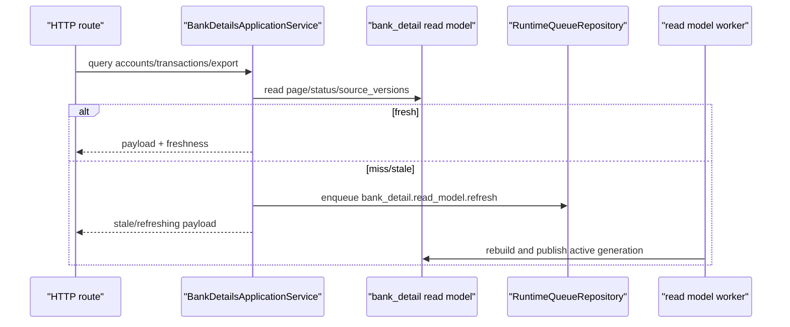
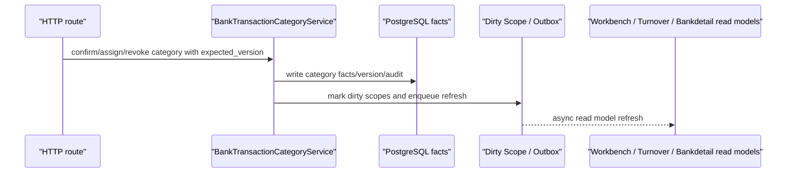
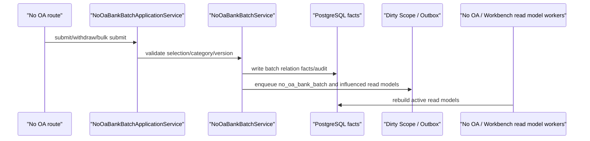
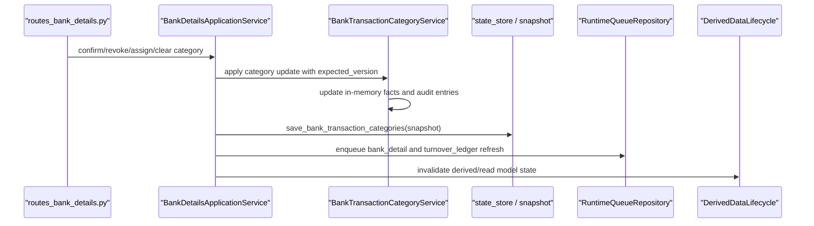
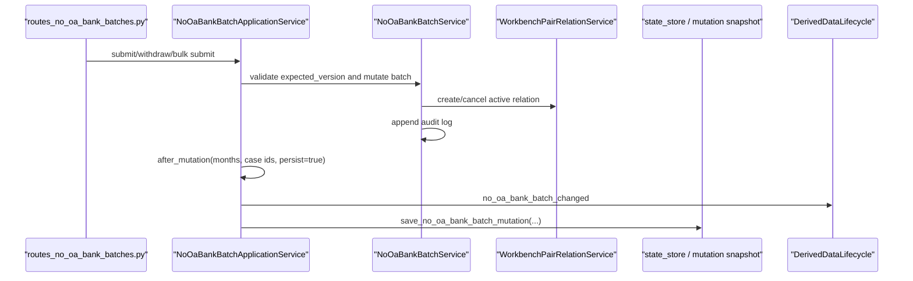
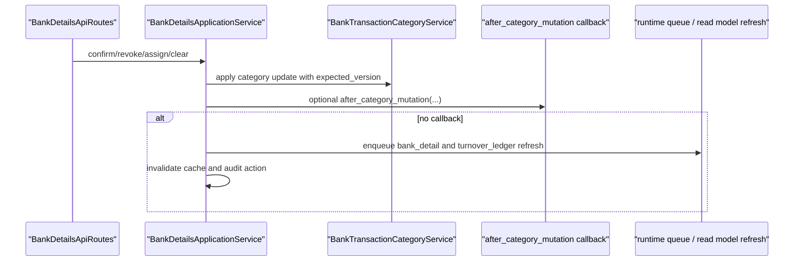

# Bankdetail / No OA Batch Discovery and Planning

## PF-P190 Summary

`PF-P190` 是 Bankdetail / No OA Batch 模块的 Micro-JIT discovery。它只做边界扫描、运行时链路整理、风险识别和下一步测试计划，不修改业务代码。

结论：

- Bankdetail 不能只按旧 `bank_details_service.py` 重构；当前边界已经扩展到 route facade、application service、SQL projection、category/auto-tag rules、account balance read model、No OA Batch lifecycle、runtime worker 和 Turnover/Workbench 影响链。
- No OA Batch 必须作为 Bankdetail 模块内的高风险子域处理，而不是单独散落在 Workbench 或 Imports。
- Turnover Ledger 已完成后的 bank row tags / category expected-version ownership，会反向要求 Bankdetail 明确分类 facts、tag versions、dirty/outbox 和 read model refresh 的责任边界。
- 下一步必须先写 characterization tests，不能直接抽 service 或引入 UoW。

## API Boundary Matrix

| API | Owner | Current route boundary | Primary behavior | Next test focus |
| --- | --- | --- | --- | --- |
| `GET /api/bank-details/accounts` | Bankdetail | `app/routes_bank_details.py` | 银行账户列表 / 账户余额投影 | response shape、freshness、空数据 |
| `GET /api/bank-details/transactions` | Bankdetail | `app/routes_bank_details.py` | 银行流水分页、筛选、排序、read model freshness | pagination/count 一致性、stale/refreshing 语义 |
| `GET /api/bank-details/transactions/export` | Bankdetail | `app/routes_bank_details.py` | 导出流水 | export payload 与 filters |
| `GET/PUT /api/bank-details/auto-tag-rules` | Bankdetail | `app/routes_bank_details.py` | 自动打标规则读取和更新 | validation、audit、read model dirty scope |
| `POST /api/bank-details/auto-tag-rules/reapply` | Bankdetail | `app/routes_bank_details.py` | 重新应用自动分类 | idempotency baseline、dirty/outbox |
| `POST /api/bank-details/auto-tag-rules/file-replacement` | Bankdetail | `app/routes_bank_details.py` | 从文件来源替换规则 | validation、partial failure |
| `POST/DELETE /api/bank-details/transactions/{id}/category-confirmation` | Bankdetail | `app/routes_bank_details.py` | 分类确认 / 撤销 | expected_version、conflict、dirty/outbox |
| `POST/DELETE /api/bank-details/transactions/{id}/category-assignment` | Bankdetail | `app/routes_bank_details.py` | 手动分类分配 / 清除 | expected_version、conflict、Turnover influence |
| `GET /api/no-oa-bank-batches` | Bankdetail / No OA | `app/routes_no_oa_bank_batches.py` | 免 OA 批次列表 | read model 不同步刷新、freshness |
| `GET /api/no-oa-bank-batches/{batch_id}` | Bankdetail / No OA | `app/routes_no_oa_bank_batches.py` | 批次详情 | response shape、stale category drift |
| `GET/PUT /api/no-oa-bank-batches/tag-selection` | Bankdetail / No OA | `app/routes_no_oa_bank_batches.py` | tag selection read/write | expected_version conflict `no_oa_bank_batch_tag_selection_version_conflict` |
| `POST /api/no-oa-bank-batches/submit-selection` | Bankdetail / No OA | `app/routes_no_oa_bank_batches.py` | 提交当前选择 | stale tag/category conflict |
| `POST /api/no-oa-bank-batches/submit` | Bankdetail / No OA | `app/routes_no_oa_bank_batches.py` | bulk submit | partial result、idempotency baseline |
| `POST /api/no-oa-bank-batches/{batch_id}/submit` | Bankdetail / No OA | `app/routes_no_oa_bank_batches.py` | 单批次 submit | facts/audit/dirty/outbox |
| `POST /api/no-oa-bank-batches/{batch_id}/withdraw` | Bankdetail / No OA | `app/routes_no_oa_bank_batches.py` | 单批次 withdraw | facts rollback、dirty/outbox、Workbench influence |

## File Ownership

### Route / HTTP Boundary

| File | Owner | Notes |
| --- | --- | --- |
| `backend/src/fin_ops_platform/app/routes_bank_details.py` | Bankdetail | Route facade。允许读取 `OARequestSession`，但只能做 HTTP mapping 和依赖组装。 |
| `backend/src/fin_ops_platform/app/routes_no_oa_bank_batches.py` | Bankdetail / No OA | Route facade。不得把 No OA service 逻辑回灌到 handler。 |
| `backend/src/fin_ops_platform/app/bank_account_balance_backfill.py` | Platform / Ops, secondary Bankdetail | 回填入口，后续 Bankdetail read model 变更必须带 smoke checklist。 |
| `backend/src/fin_ops_platform/app/bank_detail_backfill.py` | Platform / Ops, secondary Bankdetail | 银行流水 read model 回填入口。 |
| `backend/src/fin_ops_platform/app/bank_detail_category_api.py` | Bankdetail legacy route boundary | 后续需确认是否仍被 server 注册。 |

### Services / Application Boundary

| File | Owner | Risk |
| --- | --- | --- |
| `services/bank_details_application_service.py` | Bankdetail | 高风险。聚合 read model freshness、cache、export、category mutation 和 enqueue。 |
| `services/bank_details_service.py` | Bankdetail | legacy bank detail service。 |
| `services/bank_detail_sql_projection.py` | Bankdetail repository/projection | SQL projection owner；业务 service 不应散落 SQL。 |
| `services/bank_detail_read_model_refresh.py` | Bankdetail read model worker | `bank_detail.read_model.refresh` builder。 |
| `services/bank_details_export_service.py` | Bankdetail | 导出 payload contract。 |
| `services/bank_transaction_category_service.py` | Bankdetail | 高风险大文件；分类 facts、version、Turnover/Workbench influence。 |
| `services/bank_transaction_auto_category_service.py` | Bankdetail | 自动分类规则执行。 |
| `services/bank_detail_category_selection.py` | Bankdetail | 分类选择 / selection contract。 |
| `services/bank_transaction_tag_read_facade.py` | Bankdetail | tag read facade。 |
| `services/bank_transaction_effective_category_provider.py` | Bankdetail | effective category provider。 |
| `services/bank_turnover_tag_semantics.py` | Bankdetail, secondary Turnover | Turnover bank row tags 和 Bankdetail 分类语义桥。 |
| `services/bank_account_balance_projection.py` | Bankdetail | 账户余额 projection。 |
| `services/bank_account_balance_read_model_refresh.py` | Bankdetail read model worker | balance refresh builder。 |
| `services/bank_account_resolver.py` | Bankdetail | account identity helper。 |
| `services/bank_internal_transfer_detector.py` | Bankdetail | 内部转账识别。 |
| `services/bank_details_relation_tag_projection_service.py` | Bankdetail / Workbench influence | relation tag projection。 |
| `services/no_oa_bank_batch_application_service.py` | Bankdetail / No OA | 高风险。No OA route application boundary。 |
| `services/no_oa_bank_batch_service.py` | Bankdetail / No OA | 高风险大文件；submit/withdraw、legacy migration、relation consistency。 |
| `services/no_oa_bank_batch_read_model_refresh.py` | Bankdetail / No OA read model worker | `no_oa_bank_batch.read_model.refresh` builder。 |
| `services/no_oa_bank_batch_tag_selection_service.py` | Bankdetail / No OA | tag selection expected-version owner。 |
| `services/no_oa_managed_rule_policy.py` | Bankdetail / No OA | managed rule policy。 |
| `services/no_oa_legacy_relation_migration_service.py` | Bankdetail / No OA legacy/ops | legacy migration，不能进入高频 request path。 |

## Runtime Sequence

### Bank Detail Read

### Bank Category Write

PF-P190 发现阶段未证明所有 write side effects 已在同一 transaction 中完成；PF-P191 必须先 characterization 当前行为，再进入 extraction/UoW。

### No OA Submit / Withdraw

## Cross-Module Contracts

- Turnover Ledger：`/api/turnover-ledger/bank-row-tags/batch` 是 Turnover API，但写入 Bankdetail facts。后续 Bankdetail 必须明确 tag/category version ownership。
- Workbench：No OA submit/withdraw 和 bank category 写入会影响 Workbench grouping/read model，不能同步调用 Workbench usecase。
- Search / Pending Query：Bankdetail facts 和 source_versions 可能影响 pending/search projection。
- App Settings：分类、标签、规则配置属于 settings/provider 边界，Bankdetail service 不应直接依赖整个 `Application`。
- Runtime Worker：`runtime_worker_registry.py` 中存在 `no-oa-bank-batch-read-model` worker；RabbitMQ 只作为 wakeup/transport，PostgreSQL durable queue 是事实源。

## High-Risk Findings

1. `bank_transaction_category_service.py` 与 `no_oa_bank_batch_service.py` 体量极大，必须按行为切片测试后再抽 facade/UoW。
2. `bank_details_application_service.py` 当前职责过宽，后续应拆成 query facade、category write facade、export facade 和 read model freshness boundary。
3. `server.py` 仍包含 bank detail / no OA read model enqueue、source version、fallback/cache helper；后续要逐步移入明确 service/repository 边界。
4. No OA read APIs 已有“不在 GET 同步刷新”的测试事实，后续必须继续保护。
5. Category / tag selection 已有 expected-version conflict 契约，后续不能为了抽服务而丢失 `409` 语义。
6. 回填脚本是生产运维入口，Bankdetail read model 改动必须附带 ops smoke checklist。

## Recommended Next Prompts

1. `PF-P191 - Bankdetail / No OA Batch Characterization Tests`
   - 只新增或补强测试。
   - 锁定 Bankdetail read freshness、pagination/count、category expected-version、dirty/outbox baseline、No OA list/detail/tag-selection/submit/withdraw、no synchronous refresh。
   - 不修改 production code。
2. `PF-P192 - Bankdetail Route/Application Facade Cleanup`
   - 在测试保护下薄化 `server.py` / route helper。
   - 只拆 HTTP mapping 与 service 调用，不引入 UoW。
3. `PF-P193 - Bankdetail Category / Auto Tag Boundary Planning`
   - 深挖 `bank_transaction_category_service.py`，输出写路径 UoW readiness。
4. `PF-P194 - No OA Batch Write Boundary Planning`
   - 深挖 submit/withdraw/bulk submit，明确 facts/audit/dirty/outbox 同事务目标。

## PF-P191 Hard Constraints

- 不得跳过 characterization tests 直接抽 service 或引入 UoW。
- 不得访问真实 Redis/RabbitMQ/OA/Mongo/MySQL。
- 不得修改 schema、deploy、Nginx、生产配置或 feature flag。
- 不得把 No OA Batch 机械拆成独立脱离 Bankdetail 的模块；它是 Bankdetail 模块内高风险子域。
- Tests 不得通过放宽断言、删除旧字段或跳过 legacy compatibility 来转绿。

## PF-P191 Characterization Test Update

PF-P191 已补强第一批低成本 route facade characterization tests，作为后续 route/application cleanup 的安全网。

新增锁定：

- Bankdetail route facade 在 mutation permission denied 时必须直接返回 403，且不得调用 application service。
- Bankdetail category validation/conflict payload 必须保留 `error` 和 `transaction_id`。
- No OA tag selection expected-version conflict 必须返回 409 和 `no_oa_bank_batch_tag_selection_version_conflict`。
- No OA submit 必须保留 expected_version string normalization、actor mapping 和 note trim。
- No OA bulk submit 必须保留 partial failure aggregation、affected_months / changed_case_ids aggregation，并只通过一次 `after_mutation(..., persist=True)` 收口。

PF-P191 仍未覆盖的后续测试目标：

- Bankdetail SQL read model pagination/count/freshness。
- Category / auto-tag dirty scope 与 outbox baseline。
- No OA submit/withdraw service-level facts/audit/dirty/outbox。
- Account balance read model refresh 与 backfill smoke checklist。

## PF-P192 Route / Application Cleanup Planning

PF-P192 继续保持 planning-only，不修改 production code。当前扫描结论：

- `app/routes_bank_details.py` 和 `app/routes_no_oa_bank_batches.py` 已经承担 route facade 角色，后续不应再新增平行 route abstraction。
- `server.py` 中 Bankdetail / No OA path dispatch 仍负责 HTTP response 构造、文件导出 response、body parsing、session mapping 和 route facade 调用；这部分属于允许的 HTTP mapping。
- `server.py` 中仍存在 Bankdetail / No OA read model source version、enqueue、fallback/cache helper。下一步 cleanup 不能机械移动函数，必须先判断每个 helper 属于：
  - route-only HTTP mapping；
  - Bankdetail application service；
  - read model freshness boundary；
  - runtime queue / repository adapter；
  - ops/backfill。
- `BankDetailsApplicationService` 当前依赖较宽，包括 `state_store`、`runtime_repositories`、SQL read repository、derived lifecycle、cache clearers 和多个 callback。后续 cleanup 目标应是减少隐式 callback/god dependency，而不是把 route handler 原样搬入 service。
- `NoOaBankBatchApplicationService` 当前承担 read model fallback、tag selection、submit/withdraw、Workbench relation influence、derived lifecycle 和 queue enqueue。后续必须先用 tests 锁住 service-level side effects，再做 UoW 或 service 拆分。

PF-P192 后推荐下一条：

- `PF-P193 - Bankdetail / No OA Batch Read Model Characterization Tests`
  - 先覆盖 Bankdetail SQL read model pagination/count/freshness、No OA read model missing/stale/no synchronous refresh。
  - 不修改 production code。
  - 先不做 route/application production cleanup，因为现有低成本 route facade tests 还不足以保护 SQL/read model 行为。

Cleanup 禁止线：

- 不新增平行 route abstraction。
- 不把 `Application` god object 注入 service。
- 不把 HTTP response、cookie/header/session 逻辑移入 service。
- 不把 SQL 散落到业务 service。
- 不在没有 read model characterization tests 前改 `_transactions_from_sql_read_model`、No OA read model fallback 或 runtime queue enqueue helper。

## PF-P193 Read Model Characterization Test Update

PF-P193 已补强 Bankdetail read model missing-scope characterization，并复验 No OA read model integration tests。

新增锁定：

- 当 Bankdetail SQL read model scope missing 时，`BankDetailsApplicationService.transactions_payload(...)` 必须返回 `read_model_status="refreshing"`。
- missing scope 必须通过 `RuntimeQueueRepository.enqueue_read_model_refresh(scope_type="bank_detail", scope_key=<month>, reason="api_missing")` enqueue durable refresh。
- missing SQL read model 不得同步调用 legacy `BankDetailsService.list_transactions(...)` 扫描事实表。
- page_size 继续在 application boundary clamp 到 100，避免大页请求绕过 read model missing gate。

复验确认：

- No OA missing SQL read model GET 路径不会同步 rebuild batches，只 enqueue `no_oa_bank_batch` refresh。
- No OA stale SQL source versions 不会伪装 fresh。

PF-P193 后仍未覆盖的测试目标：

- Category / auto-tag write 的 dirty scope 与 outbox baseline。
- No OA submit/withdraw service-level facts/audit/dirty/outbox。
- Account balance read model refresh 与 backfill smoke checklist。

## PF-P194 Category / Auto Tag Side-Effect Characterization Update

PF-P194 已补强 Bankdetail auto-tag rules update 的 side-effect characterization。

新增锁定：

- `finalize_auto_tag_rules_update(...)` 必须清理 relation tag projection cache 和 Turnover Ledger read model cache。
- Auto-tag rules 变更必须 enqueue `turnover_ledger` all-scope refresh，reason 为 `bank_auto_tag_rules_changed`。
- 带 `bank_detail_priority_scope_keys` 的变更必须 enqueue 对应 Bankdetail priority scope refresh，reason 为 `bank_auto_tag_rules_changed_priority`。
- Priority scope 不允许把 `"all"` 当作 Bankdetail priority month scope 直接 enqueue。
- Auto-tag rules 变更必须发出 derived lifecycle event `bank_auto_tag_rules_changed`，并保留 `new_version` metadata。

PF-P194 后仍未覆盖的测试目标：

- No OA submit/withdraw service-level facts/audit/dirty/outbox。
- Account balance read model refresh 与 backfill smoke checklist。
- 真正的事务内 facts/audit/dirty/outbox UoW 收敛尚未实现。

## PF-P195 No OA Mutation Side-Effect Characterization Update

PF-P195 已新增 `tests/test_no_oa_bank_batch_application_service.py`，锁定 No OA application service 的 mutation side-effect 边界。

新增锁定：

- `after_mutation(...)` 必须过滤合法月份，只把 `YYYY-MM` 月份传给 derived lifecycle event。
- `after_mutation(..., persist=True)` 必须通过 `save_no_oa_bank_batch_mutation(...)` 持久化 pair relation snapshot、No OA batch snapshot、Workbench read model snapshot、changed case ids 和 expanded workbench scope keys。
- `after_mutation(..., persist=False)` 只发 lifecycle event，不保存 mutation snapshot。
- `enqueue_background_refresh(...)` 必须只通过 durable queue boundary enqueue `no_oa_bank_batch` read model refresh，并过滤空 scope。

PF-P195 后仍未覆盖的目标：

- Account balance read model refresh 与 backfill smoke checklist。
- No OA/Bankdetail 真实 PostgreSQL 事务内 facts/audit/dirty/outbox UoW 收敛。

当前切片已覆盖 discovery、route characterization、read model characterization、category/auto-tag side effects、No OA mutation side effects。下一步适合生成 cumulative MG，统一覆盖 PF-P190 到 PF-P195 的完整 diff 后合入 `dev`。

## PF-P196 Account Balance / Backfill Smoke Planning

PF-P196 从最新 `dev` 新建分支后执行，继续 Bankdetail / No OA 模块，只做 account balance 和 backfill smoke planning，不修改业务代码。

当前事实：

- `bank_account_balance.read_model.refresh` 已有独立 refresh service：`BankAccountBalanceReadModelRefreshService`。
- `BankAccountBalanceProjectionBuilder` 直接从 `app.bank_transactions` 聚合账户余额，并通过 `PostgresReadModelRepository.save_bank_account_balances(...)` 发布 read model。
- `tests/test_bank_account_balance_read_model.py` 已覆盖：
  - 最新非空余额选择。
  - 稳定 account identity。
  - 人民币 currency alias normalize。
  - repository 读取 `read_model.bank_account_balances`，不从 bank detail rows 取余额。
  - empty projection 返回 fresh empty payload。
- `app/bank_account_balance_backfill.py` 支持：
  - `--dry-run`
  - `--rebuild-now`
  - `--enqueue`
  - `--worker-drain`
  - `--max-iterations`
- `app/bank_detail_backfill.py` 支持：
  - `--scope-key`
  - `--enqueue-missing`
  - `--enqueue-all`
  - `--worker-drain`
  - `--dry-run`

缺口：

- 缺少 CLI dry-run smoke tests，无法机械保证 backfill 命令不会在 dry-run 下连接 PostgreSQL 或 enqueue。
- 缺少 enqueue-only smoke tests，无法锁定 `bank_account_balance_backfill` / `bank_detail_backfill` 的 scope_type、scope_key、reason contract。
- 缺少 worker-drain 参数/handler wiring smoke tests，后续 refactor worker registry 时可能破坏 backfill CLI。

PF-P196 后推荐下一条：

- `PF-P197 - Bankdetail Backfill CLI Characterization Tests`
  - 只新增 tests，不修改 production code。
  - 使用 `unittest.mock.patch` 或等价 fake 替换 `PostgresConnection`、`RuntimeQueueRepository`、projection builder 和 worker。
  - 锁定 dry-run 不实例化真实连接。
  - 锁定 enqueue contract：
    - `bank_account_balance` / `all` / `bank_account_balance_backfill`
    - `bank_detail` / `all` / `bank_detail_backfill_all`
    - `bank_detail` / `<month>` / `bank_detail_backfill_missing`
  - 锁定 worker-drain 使用正确 event type 和 handler key。

PF-P197 禁止线：

- 不访问真实 PostgreSQL。
- 不访问真实 Redis/RabbitMQ/OA/Mongo/MySQL。
- 不改 backfill production code，除非测试暴露真实 bug 且修复范围极小。
- 不把 backfill smoke 扩大成 worker/runtime registry 重构。

## PF-P197 Backfill CLI Characterization Update

PF-P197 已新增 `tests/test_bankdetail_backfill_cli.py`，并做了一个最小 production fix：

- `bank_detail_backfill --dry-run --scope-key <month>` 现在会在实例化 PostgreSQL connection 前输出 plan 并返回。
- 该修复只影响显式 scope dry-run 路径，不改变 enqueue、worker-drain 或真实 backfill 行为。

新增锁定：

- `bank_account_balance_backfill --dry-run` 不打开 PostgreSQL。
- `bank_detail_backfill --dry-run --scope-key <month>` 不打开 PostgreSQL。
- `bank_account_balance_backfill --enqueue` enqueue：
  - `scope_type="bank_account_balance"`
  - `scope_key="all"`
  - `reason="bank_account_balance_backfill"`
- `bank_detail_backfill --enqueue-all --enqueue-missing` enqueue：
  - `bank_detail/all/bank_detail_backfill_all`
  - `bank_detail/<month>/bank_detail_backfill_missing`
- `bank_account_balance_backfill --worker-drain` 使用 `bank-account-balance-read-model` worker kind 和 `bank_account_balance.read_model.refresh` handler key。

PF-P197 后剩余目标：

- Bankdetail / No OA 真正的事务内 facts/audit/dirty/outbox UoW 收敛。
- Account balance backfill 不需要立即进入 UoW；当前更适合作为 ops smoke baseline 合入。

当前 PF-P196/PF-P197 形成一个较小可合并切片，下一步适合生成 cumulative MG 合入 `dev`。

## PF-P198 Write UoW Readiness / Category and No OA Transaction Boundary Planning

PF-P198 从最新 `dev` 新建分支后执行，继续 Bankdetail / No OA 模块，只做写路径 UoW readiness planning，不修改 production code。

扫描范围：

- `services/bank_details_application_service.py`
- `services/bank_transaction_category_service.py`
- `services/no_oa_bank_batch_application_service.py`
- `services/no_oa_bank_batch_service.py`
- 已有 Bankdetail / No OA characterization tests

### Category / Auto Tag Write Readiness

当前 Bankdetail category 写路径：

关键事实：

- `BankTransactionCategoryService._apply_updates(...)` 已具备 actor validation、duplicate transaction guard、transaction existence guard 和 `expected_version` conflict。
- `BankDetailsApplicationService._persist_category_mutation(...)` 是当前 category side-effect 收口点。
- 当前 side effects 包括 category snapshot persistence、Bankdetail refresh enqueue、Turnover Ledger all-scope refresh、cache invalidation 和 audit record。
- Auto-tag rules update 当前通过 `finalize_auto_tag_rules_update(...)` 清 cache、enqueue Turnover all-scope、enqueue Bankdetail priority month scopes，并发出 `bank_auto_tag_rules_changed` derived lifecycle event。
- 当前没有显式 PostgreSQL UoW seam 能保证 category facts、audit、dirty scope、outbox/read model refresh request 同一 transaction 提交。

### No OA Submit / Withdraw Readiness

当前 No OA 写路径：

关键事实：

- `NoOaBankBatchApplicationService.submit_batch(...)`、`submit_selected_rows(...)` 和 `withdraw_batch(...)` 在异常时通过 `_restore_snapshots(...)` 恢复 in-memory batch/pair relation snapshot。
- `NoOaBankBatchService.submit_batch(...)` / `withdraw_batch(...)` 已具备 idempotent-ish status short circuit 和 `expected_version` stale guard。
- `NoOaBankBatchApplicationService.after_mutation(...)` 是当前 No OA mutation side-effect 收口点。
- `persist_mutation(...)` 当前保存 pair relation snapshot、No OA batch snapshot、Workbench read model snapshot、changed case ids 和 expanded workbench scope keys。
- 当前 rollback 是应用内 snapshot rollback，不是 PostgreSQL transaction boundary；dirty/outbox/read model refresh 仍没有显式纳入同一 transaction。

### UoW Readiness Blockers

1. Bankdetail category facts 仍主要由 service snapshot/state_store 持久化，缺少明确 repository port。
2. `BankDetailsApplicationService` 仍通过 `runtime_repositories.queue_repository` 和 callback 触发 refresh/invalidation，side effects 不是 transaction-bound writer。
3. Auto-tag rules update 通过 app settings lifecycle + callback 触发多模块 refresh，未来 UoW 必须把 settings facts、audit、dirty scope/outbox 和 lifecycle event 的 ownership 拆清。
4. No OA submit/withdraw 同时修改 No OA batch facts、Workbench pair relation facts、Workbench read model snapshot 和 derived lifecycle；必须先定义 transaction envelope，不能只把现有函数搬进一个 service。
5. No OA 当前 `persist_mutation(...)` 依赖 `state_store.save_no_oa_bank_batch_mutation(...)` 兼容快照；未来 PostgreSQL UoW 需要 repository port 来替代 snapshot persistence。
6. Cross-module influence 包括 Bankdetail、Turnover Ledger、Workbench、Search/Pending；UoW 只能写本模块 facts 和 outbox/dirty scope，不能同步调用其它模块 usecase。

### PF-P199 Recommendation

下一条建议：

- `PF-P199 - Bankdetail Write UoW Contract Tests`

PF-P199 边界：

- 先新增目标契约测试，不实现 UoW。
- 测试应覆盖 category mutation 和 No OA submit/withdraw 的 transaction-bound target：
  - facts/audit/dirty scope/outbox 必须同一 transaction。
  - category expected_version conflict 不得产生 dirty/outbox。
  - No OA submit/withdraw stale expected_version 不得保存 mutation snapshot 或 enqueue refresh。
  - side-effect writer 失败时不得留下半写事实。
- 尚未实现的目标契约可以使用 `unittest.expectedFailure`，但必须保留为默认测试套件中的可见目标。
- 不得修改 schema，不得访问真实 PostgreSQL/Redis/RabbitMQ/OA/Mongo/MySQL。

PF-P198 验证：

- `git status --short --branch`
- `git ls-files --others --exclude-standard`
- `git diff --check`
- `git diff --name-only`
- 本轮为 planning-only，未运行 targeted unittest。

## PF-P199 Write UoW Contract Tests

PF-P199 在同一分支继续 Bankdetail / No OA 写一致性切片，只新增目标契约测试，不实现 UoW，不修改 production code。

新增文件：

- `tests/test_bankdetail_write_uow_contract.py`

新增目标契约：

- `test_target_category_expected_version_conflict_does_not_write_dirty_or_outbox`
- `test_target_category_mutation_commits_facts_audit_and_dirty_outbox_in_one_transaction`
- `test_target_category_side_effect_failure_rolls_back_facts_and_refresh_requests`
- `test_target_auto_tag_rules_update_commits_settings_audit_bankdetail_and_turnover_dirty_scopes`
- `test_target_no_oa_stale_expected_version_does_not_persist_lifecycle_or_refresh`
- `test_target_no_oa_submit_commits_batch_relation_audit_dirty_and_outbox_in_one_transaction`
- `test_target_no_oa_side_effect_failure_rolls_back_batch_and_pair_relation_facts`

当前 7 个目标测试均为 `unittest.expectedFailure`，原因是目标 `fin_ops_platform.services.bankdetail_write_uow.BankdetailWriteUnitOfWork` 尚未实现。它们不是跳过测试，而是默认套件内可见的 future contract；后续实现切片必须逐步移除 expectedFailure 并转绿。

PF-P199 验证：

- `git status --short --branch`
- `git ls-files --others --exclude-standard`
- `git diff --check`
- `PYTHONPATH=backend/src python3 -m unittest tests.test_bankdetail_write_uow_contract -v`：Pass，7 tests，expected failures=7。
- `PYTHONPATH=backend/src python3 -m unittest tests.test_no_oa_bank_batch_application_service -v`：Pass，3 tests。

下一条建议：

- `PF-P200 - Bankdetail Minimal Write UoW Skeleton`

PF-P200 边界：

- 只建立 `services/bankdetail_write_uow.py` 最小 skeleton 和 fake/in-memory target seam。
- 先转绿最小 contract，如 UoW 类存在、constructor 接收细粒度 port、不依赖 Application。
- 不迁移真实 category/auto-tag/No OA 写路径。
- 不修改 schema，不访问真实外部服务。

## PF-P200 Minimal Write UoW Skeleton

PF-P200 新增最小 `BankdetailWriteUnitOfWork` skeleton，不接入真实 route 或 application service。

新增文件：

- `backend/src/fin_ops_platform/services/bankdetail_write_uow.py`

当前能力：

- `BankdetailWriteUnitOfWork.__init__` 只接收明确细粒度依赖：
  - `category_port`
  - `settings_port`
  - `no_oa_port`
  - `side_effect_writer`
- `confirm_category(...)` 只调用 `category_port.confirm_category(...)`。
- category conflict 会在 side-effect writer 前抛出，因此不会写 dirty/outbox。

测试结果：

- `test_target_category_expected_version_conflict_does_not_write_dirty_or_outbox` 已从 expectedFailure 转为普通通过。
- 其余 6 个 UoW target tests 仍保留 expectedFailure。

PF-P200 验证：

- `PYTHONPATH=backend/src python3 -m unittest tests.test_bankdetail_write_uow_contract -v`：Pass，7 tests，expected failures=6。
- `PYTHONPATH=backend/src python3 -m unittest tests.test_no_oa_bank_batch_application_service -v`：Pass，3 tests。
- `python3 -m compileall backend/src/fin_ops_platform/services/bankdetail_write_uow.py`：Pass。

下一条建议：

- `PF-P201 - Bankdetail Category UoW Transaction Writer Contract`

PF-P201 边界：

- 只处理 category mutation success / side-effect failure 的 UoW target tests。
- 不接入真实 `BankDetailsApplicationService` 或 route。
- 不处理 auto-tag rules 或 No OA submit/withdraw。

## PF-P201 Category UoW Transaction Writer Contract

PF-P201 只增强 `BankdetailWriteUnitOfWork.confirm_category(...)` 的 category transaction writer seam，不接入真实 production path。

当前能力：

- category conflict 仍在 side-effect writer 前发生。
- category success 后写入 transaction-bound side-effect record：
  - facts: `bank_transaction_category`
  - audit: `bank_detail_category_confirmed`
  - dirty scopes: `bank_detail/<affected_month>`、`turnover_ledger/all`
  - outbox: `bank_detail.read_model.refresh`、`turnover_ledger.read_model.refresh`
- side-effect writer 成功后才调用 category port commit seam。
- side-effect writer 失败时调用 category port rollback seam。

测试结果：

- 以下目标已从 expectedFailure 转为普通通过：
  - category expected_version conflict no-side-effect
  - category mutation 同事务 facts/audit/dirty/outbox
  - category side-effect failure rollback
- 剩余 4 个 expectedFailure：
  - auto-tag rules update UoW
  - No OA stale expected_version no-side-effect
  - No OA submit transaction-bound UoW
  - No OA side-effect failure rollback

PF-P201 验证：

- `PYTHONPATH=backend/src python3 -m unittest tests.test_bankdetail_write_uow_contract -v`：Pass，7 tests，expected failures=4。
- `PYTHONPATH=backend/src python3 -m unittest tests.test_no_oa_bank_batch_application_service -v`：Pass，3 tests。
- `python3 -m compileall backend/src/fin_ops_platform/services/bankdetail_write_uow.py`：Pass。

下一条建议：

- `PF-P202 - Bankdetail Auto Tag Rules UoW Seam`

PF-P202 边界：

- 只处理 auto-tag rules update 的 UoW target。
- 不接入真实 app settings route/application service。
- 不处理 No OA submit/withdraw。

## PF-P202 Auto Tag Rules UoW Seam

PF-P202 只增强 `BankdetailWriteUnitOfWork.update_auto_tag_rules(...)`，不接入真实 app settings 或 route。

当前能力：

- 通过 `settings_port.update_auto_tag_rules(...)` 获得 `new_version` 和 priority scope keys。
- Bankdetail priority scope 会过滤 `"all"`，只保留明确 month scope。
- 写入 transaction-bound side-effect record：
  - facts: `bank_auto_tag_rules`
  - audit: `bank_auto_tag_rules_changed`
  - dirty scopes: `bank_detail/<priority_month>`、`turnover_ledger/all`
  - outbox: `bank_detail.read_model.refresh`、`turnover_ledger.read_model.refresh`
  - lifecycle event: `bank_auto_tag_rules_changed`

测试结果：

- `test_target_auto_tag_rules_update_commits_settings_audit_bankdetail_and_turnover_dirty_scopes` 已从 expectedFailure 转为普通通过。
- 剩余 3 个 expectedFailure 均为 No OA submit/withdraw 目标。

PF-P202 验证：

- `PYTHONPATH=backend/src python3 -m unittest tests.test_bankdetail_write_uow_contract -v`：Pass，7 tests，expected failures=3。
- `PYTHONPATH=backend/src python3 -m unittest tests.test_no_oa_bank_batch_application_service -v`：Pass，3 tests。
- `python3 -m compileall backend/src/fin_ops_platform/services/bankdetail_write_uow.py`：Pass。

下一条建议：

- `PF-P203 - Bankdetail No OA Submit Withdraw UoW Seam`

PF-P203 边界：

- 只处理 No OA stale no-side-effect、submit transaction-bound UoW 和 side-effect rollback 目标测试。
- 不接入真实 No OA application service 或 route。

## PF-P203 No OA Submit / Withdraw UoW Seam

PF-P203 只增强 `BankdetailWriteUnitOfWork` 的 No OA submit/withdraw seam，不接入真实 No OA application service 或 route。

当前能力：

- `submit_no_oa_batch(...)` 通过 `no_oa_port.submit_no_oa_batch(...)` 先执行 stale expected-version 检查和目标 mutation seam。
- `withdraw_no_oa_batch(...)` 通过 `no_oa_port.withdraw_no_oa_batch(...)` 执行目标 mutation seam。
- stale expected-version 会在 side-effect writer 前抛出，因此不会保存 mutation snapshot、不会 enqueue refresh、不会发 lifecycle。
- submit success 后写入 transaction-bound side-effect record：
  - facts: `no_oa_bank_batch`、`workbench_pair_relation`
  - audit: `no_oa_bank_batch_submit`
  - dirty scopes: `no_oa_bank_batch/all`、`no_oa_bank_batch/<month>`、`workbench/<case_id>`
  - outbox: `no_oa_bank_batch.read_model.refresh`、`workbench.read_model.refresh`
  - lifecycle event: `no_oa_bank_batch_changed`
- side-effect writer 成功后才调用 no-OA port commit seam。
- side-effect writer 失败时调用 no-OA port rollback seam。

测试结果：

- PF-P199 的 7 个 target contracts 已全部从 expectedFailure 转为普通通过。
- 当前 UoW skeleton 仍未接入真实 Bankdetail / No OA production 写路径。

PF-P203 验证：

- `PYTHONPATH=backend/src python3 -m unittest tests.test_bankdetail_write_uow_contract -v`：Pass，7 tests。
- `PYTHONPATH=backend/src python3 -m unittest tests.test_no_oa_bank_batch_application_service -v`：Pass，3 tests。
- `python3 -m compileall backend/src/fin_ops_platform/services/bankdetail_write_uow.py`：Pass。

当前切片已形成可合并边界：

- PF-P198：写路径 UoW readiness planning。
- PF-P199：目标契约测试。
- PF-P200：最小 UoW skeleton。
- PF-P201：category transaction writer seam。
- PF-P202：auto-tag rules UoW seam。
- PF-P203：No OA submit/withdraw UoW seam。

下一条建议：

- `PF-P203-MG - Bankdetail Write UoW Skeleton Cumulative Merge Gate`

MG 必须统一覆盖 PF-P198 到 PF-P203 的完整 diff，并只合入 `dev`。

## PF-P203-MG Write UoW Skeleton Cumulative Merge Gate

PF-P203-MG 已将 PF-P198 到 PF-P203 的 Bankdetail / No OA write UoW skeleton 切片合入 `dev`。

合入内容：

- UoW readiness planning。
- `tests/test_bankdetail_write_uow_contract.py` 目标契约测试。
- `BankdetailWriteUnitOfWork` skeleton。
- Category transaction writer seam。
- Auto-tag rules UoW seam。
- No OA submit/withdraw UoW seam。

当前边界：

- 7 个 UoW target contracts 已全部普通通过。
- Skeleton 尚未接入真实 `BankDetailsApplicationService`、`NoOaBankBatchApplicationService` 或 route。
- 生产写路径行为未改变。

`dev` 验证：

- `PYTHONPATH=backend/src python3 -m unittest tests.test_bankdetail_write_uow_contract -v`：Pass，7 tests。
- `PYTHONPATH=backend/src python3 -m unittest tests.test_no_oa_bank_batch_application_service -v`：Pass，3 tests。
- `python3 -m compileall backend/src/fin_ops_platform/services/bankdetail_write_uow.py`：Pass。

下一条建议：

- `PF-P204 - Bankdetail Write UoW Application Integration Planning`

PF-P204 应只规划真实 application-service 接入顺序和风险，不直接迁移 production write path。

## PF-P204 Application Integration Planning

状态：`planned`

PF-P204 必须只规划真实 application-service 接入顺序，不直接迁移 production write path。

重点问题：

- Category：`BankDetailsApplicationService._persist_category_mutation(...)` 如何被 UoW port/writer 逐步替换。
- Auto-tag：`finalize_auto_tag_rules_update(...)` 与 app settings facts ownership 是否适合立即接入 UoW。
- No OA：`submit_batch` / `submit_selected_rows` / `withdraw_batch` 的 snapshot rollback 与 `persist_mutation(...)` 如何被 transaction-bound writer 替换。

PF-P204 输出后，下一条 prompt 必须基于真实发现生成，不能直接默认进入实现。

### PF-P204 Execution Findings

状态：`implemented`

PF-P204 只做 planning，不修改 production code。

#### Category Integration

当前真实路径：

接入判断：

- Category 是最适合优先接入 UoW skeleton 的真实路径，但不能直接替换 `_persist_category_mutation(...)`。
- 原因：`BankDetailsApplicationService` 目前已经有 `after_category_mutation` callback seam；可以先增加 adapter / port，将 category side effects 封装为细粒度 dependency，而不是让 service 直接知道 UoW internals。
- 必须先补测试：
  - Route 层 category conflict 仍返回原有 payload。
  - `_persist_category_mutation(...)` 调用 callback 时不得走 fallback enqueue/audit。
  - callback adapter 失败时 category mutation 是否 rollback 的当前行为必须先被 characterization 锁定，不能假设已经原子。

下一步建议：

- `PF-P205 - Bankdetail Category UoW Adapter Characterization Tests`
  - 只补测试，不接入 UoW。
  - 重点锁定 callback seam、conflict no-side-effect、adapter failure behavior。

#### Auto Tag Integration

当前真实路径：

- Route 调用 `BankDetailsApplicationService.update_auto_tag_rules(...)`。
- App service 通过 app settings service 保存规则。
- `finalize_auto_tag_rules_update(...)` 作为 callback/收口点清 cache、enqueue Bankdetail priority scopes、enqueue Turnover all-scope、发 derived lifecycle event。

接入判断：

- 暂不应直接接入 UoW。
- Blocker：settings facts ownership 在 `AppSettingsService`，不是 Bankdetail UoW 自己的 repository；如果强行把 settings facts 放进 Bankdetail UoW，会模糊 Platform/App Settings 边界。
- 正确顺序：
  1. 先补 `finalize_auto_tag_rules_update(...)` callback adapter tests。
  2. 再设计 settings port 是否由 App Settings 模块提供 transaction hook。
  3. 最后再考虑 Bankdetail UoW 只接管 read model dirty/outbox side effects。

#### No OA Integration

当前真实路径：

- Route 调用 `NoOaBankBatchApplicationService.submit_batch(...)` / `submit_selected_rows(...)` / `withdraw_batch(...)`。
- Application service 使用 snapshot rollback 包住 `NoOaBankBatchService` mutation。
- `after_mutation(...)` 发 derived lifecycle event。
- `persist_mutation(...)` 保存 pair relation snapshot、No OA batch snapshot、Workbench read model snapshot。

接入判断：

- 不应直接替换为 UoW。
- Blocker：当前 rollback 语义是应用内 snapshot rollback，而不是 DB transaction rollback；真实接入前必须先锁定 persistence failure、stale expected_version、bulk partial failure 的 route + application 行为。
- No OA 还涉及 Workbench pair relation facts 和 Workbench read model snapshot，必须明确 Workbench dirty scope/port ownership 后才能迁移。

#### PF-P204 Recommendation

下一条推荐：

- `PF-P205 - Bankdetail Category UoW Adapter Characterization Tests`

PF-P205 边界：

- 只补 category callback/adapter characterization tests。
- 不接入 UoW。
- 不修改 production code，除非测试暴露极小且明确的测试辅助缺口。
- 不处理 auto-tag 或 No OA。

PF-P204 验证：

- `git status --short --branch`
- `git ls-files --others --exclude-standard`
- `git diff --check`
- `git diff --name-only`

## PF-P205 Category UoW Adapter Characterization Tests

PF-P205 只补 category callback/adapter characterization tests，不修改 production code。

新增测试位于 `tests/test_bank_details_sql_runtime.py`：

- `test_category_mutation_callback_suppresses_fallback_enqueue_audit_and_invalidate`
- `test_category_mutation_callback_failure_does_not_run_fallback_side_effects`

锁定行为：

- 当 `after_category_mutation` callback 存在且成功时，`_persist_category_mutation(...)` 必须调用 callback。
- callback 成功时不得走 fallback enqueue、fallback audit、fallback invalidate。
- callback 抛错时异常必须向上传播。
- callback failure 后不得追加 fallback enqueue/audit/invalidate。
- 当前 category service mutation 是否已发生属于现状，本轮不伪造 rollback。

PF-P205 验证：

- `PYTHONPATH=backend/src python3 -m unittest tests.test_bank_details_sql_runtime -v`：Pass，44 tests。
- `PYTHONPATH=backend/src python3 -m unittest tests.test_bank_details_routes -v`：Pass，6 tests。

当前分支可合并边界：

- PF-P204：真实 application-service 接入 planning。
- PF-P205：category callback/adapter characterization tests。

下一条建议：

- `PF-P205-MG - Bankdetail Category UoW Adapter Planning and Tests Merge Gate`

## PF-P205-MG Category UoW Adapter Planning and Tests Merge Gate

PF-P205-MG 已将 PF-P204/PF-P205 合入 `dev`。

合入内容：

- Bankdetail write UoW application integration planning。
- Category callback/adapter characterization tests。

当前边界：

- 没有修改 production code。
- 真实 category write path 尚未接入 `BankdetailWriteUnitOfWork`。
- 下一步可以在新分支生成 `PF-P206 - Bankdetail Category UoW Adapter Integration`，但必须只做最小 adapter integration，不处理 auto-tag 或 No OA。

`dev` 验证：

- `PYTHONPATH=backend/src python3 -m unittest tests.test_bank_details_sql_runtime -v`：Pass，44 tests。
- `PYTHONPATH=backend/src python3 -m unittest tests.test_bank_details_routes -v`：Pass，6 tests。
