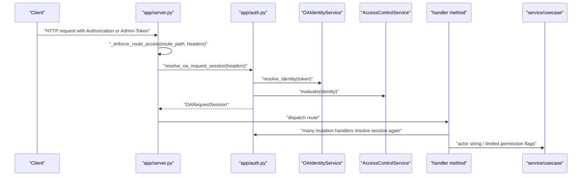
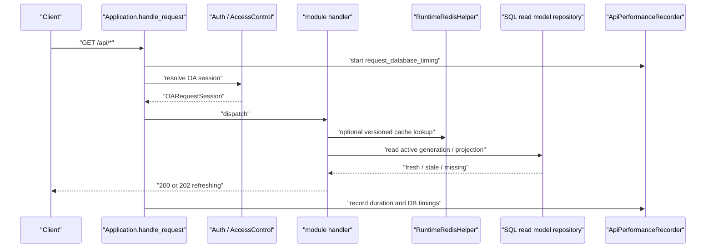
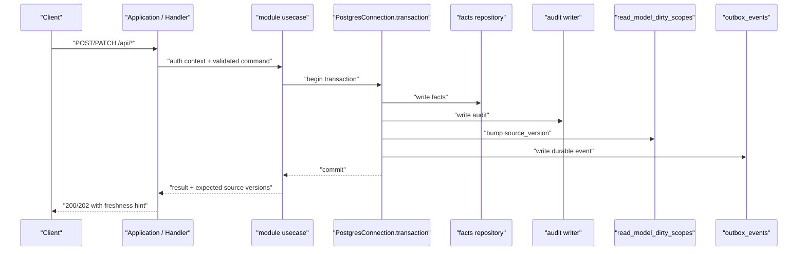
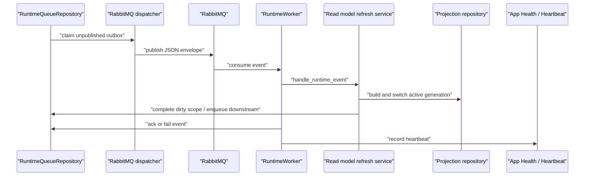
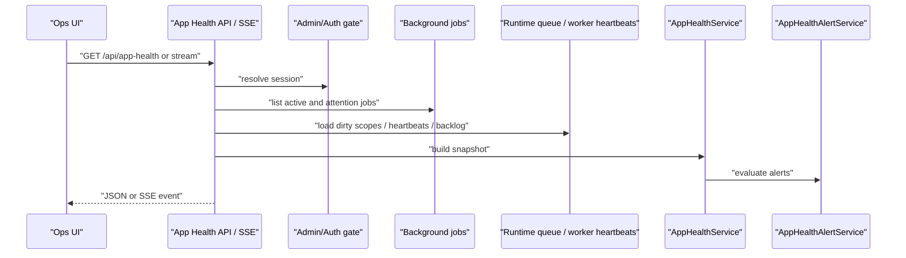
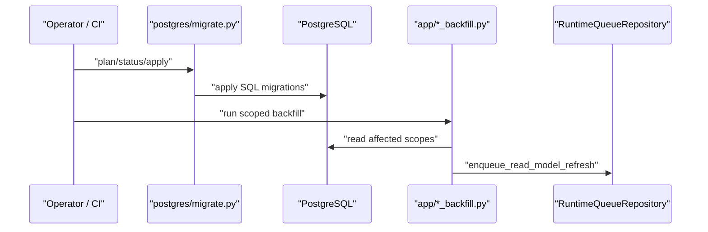

# Platform / Ops / Runtime Boundary Audit

审计编号：`PF-P002`

审计日期：2026-05-30

状态：`verified`

## 1. Executive Summary

PF-P002 的结论是：当前 Python 后端已经具备若干生产级平台边界雏形，但边界还没有被强制收口。后续业务模块重构不能直接进入 Workbench、流水台账或批量记账，必须先把 Platform / Ops / Runtime 的事实源锁定，并在模块 prompt 中引用本文档。

已确认的成熟基础：

- PostgreSQL 连接池、事务入口和查询计时集中在 `services/postgres_connection.py`。
- Durable outbox、dirty scope、source_version 已集中在 `services/runtime_queue.py`。
- RabbitMQ envelope 已限定 JSON contract，并禁止大 payload、snapshot、business fact 直接进入消息体。
- Redis 真实客户端导入集中在 `services/runtime_redis.py`。
- production bootstrap 默认不加载 full snapshot；full snapshot 只能通过 `LegacySnapshotBootstrap` 的 legacy/migration/shadow/test reason 进入。
- OA session token 解析、OA identity 查询、access decision 已形成 `app/auth.py` + `OAIdentityService` + `AccessControlService` 的主链路。

需要修正的核心风险：

- `app/server.py` 仍是巨型组合根、路由器、handler、调度器和部分 usecase 的混合体，Platform 边界容易被业务代码绕过。
- `PostgresConnection.transaction()` 可用，但 facts、audit、dirty scope、outbox 的同事务规则不是全局强制，部分业务动作仍通过 handler 后置调度刷新。
- `FIN_OPS_APP_STORAGE_BACKEND` 缺失时会回落到 `ApplicationStateStore`，生产必须明确锁定 `postgres`。
- `state_store.py`、ETC service 本地 `.pkl` fallback、Mongo pickle 兼容路径仍存在，必须被限定在 legacy、migration、shadow、test 或本地排障路径。
- Auth context 已能计算权限，但未形成统一注入到 usecase 的稳定接口，多个 handler 仍重复解析 session 或只传 actor 字符串。
- Ops tools、backfill scripts 可以直接触发 runtime queue 和 PostgreSQL 连接，必须作为 Platform / Ops 工具而不是业务模块接口使用。

## 2. File Ownership and Boundary Map

| 文件或文件族 | Primary Owner | Secondary Influence | 边界判断 |
| --- | --- | --- | --- |
| `backend/src/fin_ops_platform/domain/models.py` | Platform / Shared Domain | 所有业务模块 | 稳定值对象和枚举依赖源，不允许业务模块私自复制模型。 |
| `backend/src/fin_ops_platform/domain/enums.py` | Platform / Shared Domain | 所有业务模块 | 状态机和枚举事实源。 |
| `backend/src/fin_ops_platform/app/main.py` | Platform / App Entry | Ops | CLI/HTTP 入口，负责构建 application 和启动 server。 |
| `backend/src/fin_ops_platform/app/server.py` | Platform / App Shell | 所有业务模块 | 当前最大耦合点，后续模块拆分必须逐步抽离 routing、auth、handler、usecase。 |
| `backend/src/fin_ops_platform/app/auth.py` | Platform / Auth | Settings / OA Identity | Token/Cookie 提取、OA session resolution、Auth Context 生成入口。 |
| `backend/src/fin_ops_platform/services/postgres_connection.py` | Platform / DB Runtime | 所有 SQL repository | DB connection、pool、transaction、query timing 入口。 |
| `backend/src/fin_ops_platform/services/postgres_repositories/core.py` | Platform / Repository Core | Imports / Bankdetail / Invoices | 核心 facts repository，承担 import facts 写入和 read model dirty 标记。 |
| `backend/src/fin_ops_platform/services/runtime_queue.py` | Platform / Queue / Outbox | Read Model Workers | Durable outbox、dirty scope、source_version、worker heartbeat 入口。 |
| `backend/src/fin_ops_platform/services/runtime_worker.py` | Platform / Worker Runtime | 所有 async refresh | Worker claim、handler dispatch、ack/fail/retry、heartbeat 入口。 |
| `backend/src/fin_ops_platform/services/runtime_bootstrap.py` | Platform / Runtime Bootstrap | App Shell / Ops | runtime repositories、Redis helper、queue repository、legacy snapshot guard 入口。 |
| `backend/src/fin_ops_platform/services/runtime_redis.py` | Platform / Cache Adapter | Read Model / Worker | Redis client 唯一允许封装点。 |
| `backend/src/fin_ops_platform/services/rabbitmq_runtime.py` | Platform / MQ Adapter | Worker / Ops | RabbitMQ topology、publisher、consumer、envelope contract 唯一允许封装点。 |
| `backend/src/fin_ops_platform/services/state_store.py` | Platform / Legacy State | Migration / Shadow / Test | legacy local pickle / Mongo state store，不允许进入 production request 主路径。 |
| `backend/src/fin_ops_platform/services/postgres_state_store.py` | Platform / PostgreSQL State Store | All modules | PostgreSQL runtime state facade。 |
| `backend/src/fin_ops_platform/services/state_store_factory.py` | Platform / Storage Runtime | App Shell / Ops | storage backend 选择入口，生产必须锁定 `postgres`。 |
| `backend/src/fin_ops_platform/services/shadow_state_store.py` | Platform / Shadow Runtime | Migration / Test | shadow read compare，仅允许迁移验证或显式 rehearsal。 |
| `backend/src/fin_ops_platform/services/dual_state_store.py` | Platform / Dual Write Runtime | Migration / Test | dual write rehearsal，仅允许 preflight/cutover rehearsal。 |
| `backend/src/fin_ops_platform/services/state_store_diff.py` | Platform / State Diff | Migration / Test | primary/shadow diff 工具，不是业务路径。 |
| `backend/src/fin_ops_platform/services/shadow_read_rehearsal.py` | Platform / Shadow Read Runtime | Migration / Test | read-only rehearsal，不允许被 handler 热路径调用。 |
| `backend/src/fin_ops_platform/services/app_settings_service.py` | Platform / Settings | Auth / Workbench settings | 设置事实源，影响 Access Control、OA import settings、tag rules。 |
| `backend/src/fin_ops_platform/services/access_control_service.py` | Platform / AuthZ | Auth / Settings | 权限判定事实源。 |
| `backend/src/fin_ops_platform/services/settings_data_reset_service.py` | Platform / Ops Reset | Workbench / OA / Imports | 高风险运维动作，必须保持 admin gate 和 audit。 |
| `backend/src/fin_ops_platform/services/oa_identity_service.py` | Platform / OA Identity | Auth | OA user info / password verification adapter。 |
| `backend/src/fin_ops_platform/services/oa_role_sync_service.py` | Platform / OA Role Sync | Settings | 从应用设置同步 OA role assignment。 |
| `backend/src/fin_ops_platform/services/oa_projection_sync.py` | Platform / OA Projection Runtime | Workbench / Pending / Search direct payload | 从 OA source adapter 写 PostgreSQL projection，并标记 Workbench/Pending 等下游 read model dirty；Search 不进入 dirty/outbox，由 direct `/api/search` 读取。 |
| `backend/src/fin_ops_platform/services/postgres_repositories/oa_projection.py` | Platform / OA Projection Repository | Workbench / Search / Pending | PostgreSQL OA projection repository 和 adapter。 |
| `backend/src/fin_ops_platform/services/app_health_service.py` | Platform / Observability | Ops UI / SSE | app health payload 聚合。 |
| `backend/src/fin_ops_platform/services/app_health_alert_service.py` | Platform / Observability | Ops | health alert 规则。 |
| `backend/src/fin_ops_platform/services/api_performance_metrics.py` | Platform / Observability | App Shell / DB Runtime | per request DB timing 和 endpoint p50/p95/p99。 |
| `backend/src/fin_ops_platform/services/audit.py` | Platform / Audit | Settings / Legacy modules | 当前基础 audit trail，后续需要统一到持久化 audit policy。 |
| `backend/src/fin_ops_platform/services/operations_dashboard.py` | Platform / Ops Dashboard | Observability | 管理端 runtime metrics 汇总。 |
| `backend/src/fin_ops_platform/postgres/migrate.py` | Platform / DB Migration Runtime | CI / Ops | PostgreSQL migration 执行器。 |
| `backend/src/fin_ops_platform/app/*_backfill.py` | Platform / Ops Backfill | 对应业务域 | 手工/一次性回填入口，只能通过 ops 流程运行。 |
| `backend/src/fin_ops_platform/tools/**/*.py` | Platform / Ops Tools | Migration / Reconcile | 运维、迁移、reconcile、preflight 工具，不是业务模块 API。 |

## 3. DB Transaction / Repository Core Boundary

### 已确认事实

- `PostgresConnection.connection()` 负责 pooled/direct connection 获取、statement timeout 设置和 DB acquire timing 记录。
- `PostgresConnection.transaction()` 是当前平台级 DB transaction 入口，返回 `PostgresTransaction`。
- `PostgresCoreRepository.save_imports()` 和 `save_invoices()` 会在可用时使用 `transaction_factory()`，并在同一事务里写 facts 和标记 import fact read models dirty。
- `RuntimeQueueRepository.enqueue()` 在单个 `DB transaction` 中写 `job.outbox_events`。
- `RuntimeQueueRepository.enqueue_read_model_refresh()` 在单个 `DB transaction` 中 upsert `job.read_model_dirty_scopes`，递增 `source_version`，并写 `job.outbox_events`。
- `RuntimeWorker` 只通过 queue repository claim、ack、fail、record heartbeat，不直接操作 RabbitMQ 或 Redis 的业务语义。

### 已确认缺口

- 当前没有一个全局 Unit of Work 强制所有业务写操作同时提交 facts、audit、dirty scope、outbox。
- `app/server.py` 里存在大量 `_invalidate_*`、`_schedule_*`、`enqueue_read_model_refresh` 后置调度模式。这些调用可以保证 dirty/outbox 自身事务安全，但不天然保证与前面的业务 facts 写在同一事务。
- `AuditTrailService` 当前是内存型基础 audit；业务级持久化 audit 分散在 repository snapshot 和各模块 service 中，后续需要统一“同事务 audit policy”。

### 生产级规则

- 业务模块重构时，不允许直接拿 `PostgresConnection` 在 handler 中拼 SQL。
- 写 usecase 必须声明 transaction boundary，并在同一事务内完成 facts、audit、dirty scope、outbox。
- 如果某个 repository 暂时无法同事务写 outbox，必须在模块计划中标记为 blocker，不得直接进入 verified。
- 所有 read model source_version 递增只能通过平台 queue/dirty-scope 入口或等价 repository policy 完成。

## 4. Settings / Access Control Boundary

### 已确认事实

- `app/auth.py` 的 `extract_oa_token()` 从 `Authorization: Bearer` 或 `Admin-Token` cookie 提取 OA token。
- `resolve_oa_request_session()` 通过 `OAIdentityService.resolve_identity()` 获取 OA identity，再由 `AccessControlService.evaluate()` 计算 access tier 和权限布尔值。
- `AccessControlService.from_environment()` 读取 `FIN_OPS_OA_REQUIRED_PERMISSION`、`FIN_OPS_ALLOWED_USERNAMES`、`FIN_OPS_ALLOWED_ROLES`、`FIN_OPS_READONLY_EXPORT_USERNAMES`、`FIN_OPS_ADMIN_USERNAMES`。
- `Application._initialize_runtime_services()` 将 `AppSettingsService.get_allowed_usernames`、`get_readonly_export_usernames`、`get_admin_usernames` 注入 `AccessControlService` 的 dynamic provider。
- `AppSettingsService` 会影响 allowed users、readonly users、admin users、OA import settings、tag rules，并通过 `OARoleSyncService` 同步外部 OA role assignment。

### 已确认缺口

- Auth context 没有被统一注入到 handler/usecase。很多 handler 独立调用 `resolve_oa_request_session()`，部分写接口只传 actor string。
- `_enforce_route_access()` 只负责“能否访问应用”的统一保护；细粒度 `can_mutate_data`、`can_admin_access` 仍分散在各 handler helper。
- 后续模块 usecase 如果继续自己解析 headers，会造成权限语义漂移。

### 生产级规则

- 后续应形成稳定 `AuthContext` 或沿用并增强 `OARequestSession`，由 App Shell 统一解析后传入 usecase。
- handler 层只做 auth context 提取和权限 gate，不做业务判断。
- usecase 接收 `actor_id`、`access_tier`、`can_mutate_data`、`can_admin_access` 等显式字段，不允许读取 HTTP headers。
- Auth 测试门禁必须覆盖 Bearer token、Admin-Token cookie、local dev session、default test auth、unauthorized、forbidden、expired session、readonly export、admin gate。

## 5. OA Identity / Role / Projection Boundary

### 已确认事实

- `OAIdentityService` 调用 OA HTTP user info endpoint 解析当前登录身份，并有 token cache。
- `OAIdentityService.verify_current_user_password()` 通过 OA update password endpoint 做密码复核，但没有真正修改密码，依赖 OA 返回的同密码错误语义。
- `OARoleSyncService` 可从 app settings snapshot 生成 readonly/full/admin assignment，并通过 MySQL executor 同步 OA roles。
- `OAProjectionSyncService.handle_runtime_event()` 从 source adapter 读取 OA application records，写入 PostgreSQL projection repository，然后标记 Workbench、Search、Pending Invoice dirty。
- `PostgresOAProjectionRepository` 是 OA projection 的 PostgreSQL 事实源，`PostgresOAProjectionAdapter` 提供业务查询 adapter。
- `Application._initialize_runtime_services()` 在 production/postgres 路径优先使用 `PostgresOAProjectionAdapter`；legacy 模式下才构建 direct `MongoOAAdapter`。

### OA Mongo 与 PostgreSQL projection 的边界

- OA Mongo 是上游只读 source，不是当前 app state 写入目标。
- PostgreSQL projection 是应用内查询和 read model 依赖的目标。
- Worker path 允许读取 OA Mongo，写 PostgreSQL projection，并通过 outbox/dirty scope 驱动下游刷新。
- Production request path 不应同步访问 OA Mongo；如果 PostgreSQL projection 未 ready，应返回 `refreshing` / `read_model_unavailable`，并触发异步刷新。

### 风险

- `MongoOAAdapter` 仍由 legacy direct adapter 和 worker source adapter 使用，后续必须在文档和测试中区分“worker source read”和“request path query”。
- OA role sync 使用 `pymysql` 直接连接外部 OA DB，必须归入 Platform / OA Role Sync，不允许业务模块直接调用。

## 6. Redis / RabbitMQ Direct Dependency Audit

### 允许的 platform adapter 调用

| Adapter | 允许调用方 | 条件 |
| --- | --- | --- |
| `RuntimeRedisHelper` | `runtime_bootstrap.py`、`app/worker.py`、read model projection builder 通过依赖注入使用 | 只能作为 cache、wakeup、lock helper；业务模块不得 import `redis`。 |
| `RuntimeQueueRepository.enqueue()` | import job、runtime ops、明确的平台事件发布点 | payload 必须是 JSON object，不得放 snapshot、pickle 或大对象。 |
| `RuntimeQueueRepository.enqueue_read_model_refresh()` | handler 临时桥接、read model refresh service、backfill、OA projection sync | 现阶段允许，但业务模块重构后应收口进 module usecase / unit of work。 |
| `RabbitMqTopologyManager` | `app/rabbitmq_topology.py` | 仅用于 topology plan/apply。 |
| `RabbitMqPublisher` / dispatcher | `app/rabbitmq_dispatcher.py` | 仅用于 outbox publish，不承载业务计算。 |
| `RabbitMqConsumer` | `app/worker.py` | 仅用于 runtime worker 消费，handler 不得使用。 |
| `rabbitmq_event_routes()` | `runtime_monitoring.py`、worker check、ops dashboard | 只读 topology/metrics 信息。 |

### 禁止或可疑的业务层直接调用

- 禁止业务 service 或 handler 直接 `import redis`、`from redis`、`import pika`、`from pika`。
- 禁止业务 service 直接创建 RabbitMQ publisher/consumer/topology。
- 禁止业务 service 绕过 `RuntimeQueueRepository` 直接写 `job.outbox_events` 或 `job.read_model_dirty_scopes`。
- 禁止 RabbitMQ envelope 携带 `payload`、`raw_payload`、`snapshot`、`large_snapshot`、`business_fact` 等大业务对象。
- 可疑但暂时允许：`app/server.py` 中 handler 直接访问 `queue_repository.enqueue_read_model_refresh()` 或 `redis_helper.publish_wakeup()`。这些是历史 App Shell 桥接，后续模块重构时必须迁入对应 usecase / platform port。

### 审计发现

- 真实 Redis 客户端导入只出现在 `services/runtime_redis.py`。
- 真实 RabbitMQ `pika` 导入只出现在 `services/rabbitmq_runtime.py` 以及集成测试。
- `app/worker.py` 是当前生产 worker 组合根，会根据 CLI flags 组装 OA sync、read model refresh、import job、workbench matching 等 handler。
- `rabbitmq_runtime.py` 已有 envelope 大小和字段限制，符合跨语言隔离和事件契约要求。

## 7. Legacy State / Snapshot / Pickle Production Path Audit

### production request path

生产 API 主路径不应读取 full snapshot、local `state.pkl`、app Mongo legacy state 或 pickle。代码中已有以下保护：

- `Application._normalize_bootstrap_mode()` 默认 `production`。
- `Application._runtime_bootstrap_state()` 只有 `bootstrap_mode == "legacy"` 才调用 `_load_persisted_state("legacy_application_startup")`。
- `LegacySnapshotBootstrap.load_full_snapshot()` 只允许 reason 以 `legacy_`、`migration_`、`shadow_`、`test`、`unit_test` 开头。
- `LEGACY_SNAPSHOT_ALLOWLIST` 当前为空。
- `docs/dev/runtime-bootstrap.md` 明确 production 不得调用 `ApplicationStateStore.load()` / `PostgresStateStore.load()` / `LegacySnapshotBootstrap.load_full_snapshot()`。

### production worker path

worker 主路径应通过 PostgreSQL runtime queue、PostgreSQL projection repository 和 adapter 工作：

- `app/worker.py` 创建 `PostgresConnection`、`RuntimeQueueRepository`、`RuntimeRedisHelper`。
- OA sync worker 允许读取 OA Mongo source adapter，但写入 PostgreSQL OA projection，并通过 `RuntimeQueueRepository` 标记下游 dirty。
- Read model refresh worker 读取 PostgreSQL facts/read model context，不应读取 local pickle。

### shadow / dual / diff 边界

- `shadow_state_store.py`、`shadow_read_rehearsal.py`、`state_store_diff.py` 只允许 migration/shadow/test/rehearsal。
- `dual_state_store.py` 只允许 preflight/cutover rehearsal，`state_store_factory.py` 要求 `FIN_OPS_CUTOVER_PREFLIGHT_ONLY=1` 才能 build dual store。
- `state_store_factory.py` 支持 `shadow` 和 `dual`，但这些模式必须被 Ops gate 控制，不能由 production API 服务随意启用。

### 已确认风险

- `state_store_factory.build_state_store()` 在 `FIN_OPS_APP_STORAGE_BACKEND` 缺失或为 local/mongo/auto 时会返回 `ApplicationStateStore`。生产环境必须显式设置 `FIN_OPS_APP_STORAGE_BACKEND=postgres`，并在 readiness/部署脚本中验证。
- `state_store.py` 仍包含 local pickle 和 Mongo Binary pickle 兼容路径。
- `EtcService` 和 `EtcReconciliationTaskService` 在没有 state_store 时会 fallback 到本地 `.pkl` 文件。只要生产通过 `Application(data_dir=default_data_dir())` 且 state_store_factory 返回 PostgreSQL store，这条 fallback 不应触发；但缺失 env 会让风险回到 production request path。
- `PostgresStateStore.save()` 默认不写 `state:full_state`，但 `FIN_OPS_ENABLE_POSTGRES_FULL_STATE_SNAPSHOT=1` 会恢复 whole snapshot 写入。生产必须禁止该环境变量。

### 结论

legacy snapshot/local state/pickle 目前没有被证实进入 PostgreSQL production request/worker 主路径，但存在配置风险。后续平台 prompt 应增加机械 guard：

- 启动时如果检测到 release runtime 且 `FIN_OPS_APP_STORAGE_BACKEND != postgres`，readiness 必须 `not_ready`。
- release runtime 下禁止 `FIN_OPS_ENABLE_POSTGRES_FULL_STATE_SNAPSHOT=1`。
- production bootstrap 下禁止 `bootstrap_mode=legacy`。
- guard test 固化 `app/server.py` 不新增 direct full snapshot load。

## 8. Auth Context Propagation Audit

### 当前调用链

### 现状判断

- `_enforce_route_access()` 为大部分 protected route 做统一 app-level gate。
- `/api/session/me` 会返回完整 user、roles、permissions、access_tier、can_mutate_data、can_admin_access。
- app health、settings reset、batch accounting、turnover、no-oa batch 等高风险动作还会单独检查 `can_mutate_data` 或 `can_admin_access`。
- Auth context 没有被统一缓存到 request scope，导致部分 handler 重复解析 session。

### 后续规则

- 后续模块 handler 必须接收已解析的 `auth context`，不得重复解析 headers。
- usecase 不得 import `app/auth.py`。
- usecase 只能依赖显式 actor/permission value object。
- Readonly export 用户必须只能读和导出，不能进入 mutation usecase。
- Admin-only 运维动作必须通过统一 admin gate。

## 9. Shared Domain / App Entry / DB Migration Runtime / Backfill / Ops Tools Boundary

### Shared Domain

- `domain/models.py` 和 `domain/enums.py` 是跨模块共享事实源。
- 业务模块不能复制 dataclass、enum 或状态常量。
- 如果模块重构需要新增领域对象，必须先判断是否属于该模块私有 DTO，还是共享 domain model。

### App Entry

- `app/main.py` 只负责 CLI parser、`build_application(data_dir=default_data_dir())`、`--check` readiness 和 HTTP server 启动。
- `app/server.py` 当前负责 Application 组合根和 ThreadingHTTPServer handler factory。后续重构应保持 `app/main.py` 薄入口不扩张。

### DB Migration Runtime

- `postgres/migrate.py` 是唯一 migration Python runtime。
- `tests/test_postgres_migrations.py` 覆盖 migration discovery、plan/status/apply、安全目标、runtime grants 和 outbox/dirty scope schema。
- 业务模块重构不得修改 migration runtime 行为，除非该模块交付包含明确 SQL migration 和回滚方案。

### Backfill / Ops Tools

- `app/bank_account_balance_backfill.py` 和 `app/bank_detail_backfill.py` 直接创建 `PostgresConnection` 和 `RuntimeQueueRepository`，用于标记 read model refresh。
- `tools/runtime_queue_ops.py` 用于 inspect/replay/pause outbox，是 Platform / Ops 工具。
- `tools/run_runtime_convergence_closure.py` 会跑 migration、runtime queue、Redis、object migration、OA sync 等 closure 检查，是高权限收敛工具。
- `tools/run_shadow_read_rehearsal.py`、`tools/run_runtime_state_policy_preflight.py`、`tools/run_controlled_mirror_write_rehearsal.py` 属于 migration rehearsal，不属于业务模块。

### Ops 规则

- Ops tool 可以直接连接 PostgreSQL，但必须只在人工/CI/运维流程中运行。
- Backfill 可以触发 dirty scope/outbox，但必须记录 reason，且不能绕过 source_version。
- 任何 ops tool 不得记录 secret、token、cookie 或生产 URL 实值。

## 10. Observability / Audit / Performance Metrics Boundary

### 已确认事实

- `ApiPerformanceRecorder` 记录 endpoint duration、DB acquire duration、SQL execute/fetch duration、DB query count 和 p50/p95/p99。
- `PostgresConnection` 在 `connection()`、`fetch_one()`、`fetch_all()`、`execute()` 中向 request context 记录 DB timing。
- `Application.handle_request()` 用 `request_database_timing()` 包裹每个请求，并在 finally 中写入 `ApiPerformanceRecorder`。
- `AppHealthService` 汇总 session、OA sync、dirty scope、background jobs、dependencies、workbench read model status。
- `AppHealthAlertService` 根据 dirty scope age、dependency unavailable 等规则生成 active/recovered alerts。
- `OperationsDashboardService` 只能通过 admin gate 访问，并读取 PostgreSQL runtime metrics 与 API performance recorder。
- `RuntimeWorker` 会记录 worker heartbeat，并在日志中包含 `trace_id`、`source_version`、event_id、attempts 等字段。

### 已确认缺口

- 当前 HTTP server 的全局错误日志仍是 `print` / `stderr`，不是统一 structured logger。
- Audit trail 尚未完全统一到 PostgreSQL 持久化审计表，业务 audit 仍散落在不同 repository/state payload 中。
- App Health 和 Operations Dashboard 能看到 runtime 状态，但不能替代模块级 consistency checker。

### 生产级规则

- 后续模块必须把关键写操作 audit 作为同事务事实，而不是只写内存 audit。
- 每个 read model 模块必须提供 freshness/consistency 指标，纳入 App Health 或 Ops Dashboard。
- SSE path 和 app health path 需要保留 auth gate；代理层必须保留流式响应配置，但本轮不修改网关。

## 11. Runtime Sequence Diagrams

### HTTP read with auth and SQL read model

### Write request with target transaction boundary

当前实现只在部分 repository 和 runtime queue 中满足该目标。后续业务模块必须以这张图作为目标，不得把 dirty/outbox 放到 facts commit 之后的独立 best-effort 步骤。

### Outbox / RabbitMQ / Worker / Read Model refresh

### App Health / SSE / worker heartbeat

### DB migration runtime / ops backfill

## 12. Test Gate Matrix

| Gate | 测试文件 | 覆盖内容 |
| --- | --- | --- |
| Auth / Session | `tests/test_auth_guard.py`、`tests/test_session_api.py`、`tests/test_oa_identity_service.py` | OA token/cookie、权限、session/me、expired session、local/test auth。 |
| Access / Settings | `tests/test_app_settings_service.py`、`tests/test_settings_data_reset_service.py`、`tests/test_oa_role_sync_service.py` | settings、dynamic providers、role sync、data reset audit。 |
| PostgreSQL Runtime | `tests/test_postgres_connection.py`、`tests/test_postgres_repositories_core.py`、`tests/test_postgres_repositories_boundaries.py`、`tests/test_postgres_migrations.py` | connection、repository transaction、migration schema、runtime grants。 |
| State Store / Snapshot | `tests/test_state_store.py`、`tests/test_postgres_state_store.py`、`tests/test_state_store_factory_preflight.py`、`tests/test_runtime_bootstrap.py` | local/postgres state store、bootstrap guard、storage backend selection。 |
| Shadow / Dual / Diff | `tests/test_shadow_state_store.py`、`tests/test_dual_state_store.py`、`tests/test_state_store_diff.py`、`tests/test_shadow_read_rehearsal.py`、`tests/test_runtime_state_policy.py` | shadow/dual safety、diff、rehearsal gates、policy classification。 |
| Runtime Queue / Worker | `tests/test_runtime_queue.py`、`tests/test_runtime_worker.py`、`tests/test_runtime_infrastructure_postgres_integration.py`、`tests/test_runtime_queue_ops.py` | outbox、dirty scope、source_version、claim/ack/fail/retry、ops replay。 |
| Redis / RabbitMQ | `tests/test_runtime_redis.py`、`tests/test_rabbitmq_runtime.py`、`tests/test_rabbitmq_integration.py`、`tests/test_rabbitmq_staging_preflight.py` | Redis helper、RabbitMQ envelope、publisher/consumer/topology、staging preflight。 |
| OA Projection | `tests/test_oa_projection_sql_runtime.py`、`tests/test_worker_oa_sync.py`、`tests/test_mongo_oa_adapter.py` | OA Mongo source、PostgreSQL projection、downstream dirty scopes。 |
| Observability / Ops | `tests/test_app_health_service.py`、`tests/test_app_health_api.py`、`tests/test_app_health_alert_service.py`、`tests/test_api_performance_metrics.py`、`tests/test_operations_dashboard_service.py`、`tests/test_runtime_monitoring.py` | app health、SSE、alerts、performance metrics、operations dashboard、runtime monitoring。 |
| Release / Deploy Guard | `tests/test_deploy_oa_script.py`、`tests/test_deploy_oa_nginx_config.py`、`tests/test_deploy_runtime_examples.py`、`tests/test_runtime_convergence_closure.py` | deploy scripts、proxy/SSE rules、runtime examples、closure checks。 |

PF-P002 本轮只改文档，没有运行以上 Python tests。后续如果执行平台边界代码收口，至少应运行对应 gate 的最小子集。

## 13. PF-P003 Guard Implementation Findings

状态：`verified`，已由用户确认。

PF-P003 已把本文档中的平台风险转成可运行的机械门禁：

- Production Runtime Guard：`Application.readiness_summary()` 新增 `production_runtime_guard`。当 release runtime 或 `FIN_OPS_PRODUCTION_RUNTIME_GUARD=1` 时，若 `FIN_OPS_APP_STORAGE_BACKEND` 实际不是 `postgres`、bootstrap mode 是 `legacy`、或 `FIN_OPS_ENABLE_POSTGRES_FULL_STATE_SNAPSHOT` 启用，readiness `status` 会变为 `not_ready`。
- Legacy Snapshot / Pickle Guard：沿用 `LegacySnapshotBootstrap` reason guard、空 `LEGACY_SNAPSHOT_ALLOWLIST`、以及 production app/server 不直接调用 full snapshot load 的静态门禁。
- Auth Context Contract Guard：新增静态门禁，禁止业务 service import `fin_ops_platform.app.auth` 或解析 `Admin-Token` / cookie token；业务 usecase 后续只能接收 App Shell 注入的 auth/session value。
- Unit of Work / Outbox / Dirty Scope Guard：新增静态门禁，禁止业务代码绕过 `RuntimeQueueRepository` 直接写 `job.outbox_events` 或 `job.read_model_dirty_scopes`；`postgres_repositories/core.py` 和 `runtime_queue.py` 是当前允许的平台写入口。
- Redis / RabbitMQ Direct Import Guard：新增静态门禁，真实 Redis client import 只允许在 `services/runtime_redis.py`，真实 `pika` import 只允许在 `services/rabbitmq_runtime.py`。
- OA Mongo Adapter Direct Use Guard：新增静态门禁和 allowlist，限制 `MongoOAAdapter` direct use 只出现在 App Shell legacy/type-check、worker source sync、ops audit、projection/parser-version 兼容路径和 tests。
- External OA MySQL / `pymysql` Guard：新增静态门禁，真实 `pymysql` import 只允许在 `services/oa_role_sync_service.py`。
- Handler / Usecase Raw SQL Boundary Guard：新增静态门禁，App handler 层不得直接拿 `PostgresConnection` / `fetch_one` / `fetch_all` 拼 SQL；service raw SQL 必须归入 repository、projection、runtime、ops/backfill 或 known allowlist。

Known violations / allowlist 说明：

- `services/cost_tax_sql_projection.py` 仍通过 `MongoOAAdapter` 使用 parser version / pure utility 语义。PF-P003 不迁移业务代码，后续 Tax / Cost / ETC Micro-JIT 应把这类纯函数/版本常量迁出到 shared/domain utility。
- `app/server.py` 仍是 App Shell 和 legacy/type-check 最大耦合点。PF-P003 只锁门禁，不拆 handler；后续模块 Micro-JIT 必须逐步迁出业务逻辑。
- 多个 SQL projection、runtime monitoring、ops/backfill、repository 文件仍直接执行 raw SQL。PF-P003 将它们分类为允许边界；后续业务模块不得新增未分类 raw SQL。

PF-P003 验证：

- `PYTHONPATH=backend/src python3 -m unittest tests.test_platform_runtime_boundary_guards -v`：通过。
- `PYTHONPATH=backend/src python3 -m unittest tests.test_runtime_bootstrap tests.test_state_store_factory_preflight tests.test_app_postgres_mode -v`：通过。
- `PYTHONPATH=backend/src python3 -m unittest tests.test_auth_guard tests.test_session_api -v`：通过。
- `PYTHONPATH=backend/src python3 -m unittest tests.test_runtime_queue tests.test_runtime_redis tests.test_rabbitmq_runtime -v`：通过。
- `PYTHONPATH=backend/src python3 -m fin_ops_platform.app.main --check`：通过。
- `git diff --check`：通过。

## 14. PF-P003-MG Merge Gate Findings

状态：`verified`，已由用户确认。

PF-P003-MG 已执行平台 guard 分支的 Merge Gate 前置检查：

- Verified precondition：PF-P003 已 verified。
- Branch：当前分支为 `codex/python-first-refactor-reset`，未在 `main` 上直接开发。
- Diff scope：变更只包含 backend-refactor 文档、`backend/src/fin_ops_platform/app/server.py` 和 `tests/test_platform_runtime_boundary_guards.py`。
- Untracked scope：新增 `architecture-inventory.md`、`platform-runtime-boundary-audit.md` 和 `test_platform_runtime_boundary_guards.py` 均属于本次允许范围。
- Temp file guard：未发现 `.pkl`、`.sqlite`、`__pycache__/`、`.pytest_cache/`、测试输出目录或 IDE 临时文件需要提交。
- Commit staging rule：本次必须使用精确文件列表 stage，不允许 `git add .` 或 `git add -A`。
- Upstream sync：merge 前已 fetch origin，确认本地 `main` 与 `origin/main` 一致，且功能分支包含最新 main。
- Local main merge：已本地 merge 到 `main`，merge commit 为 `58535cab`。
- Remote push：尚未 push `main` 到 origin。
- Traffic Gate：未执行；未修改网关、部署或生产配置。

PF-P003-MG 验证：

- `git diff --check`：通过。
- `git ls-files --others --exclude-standard`：通过，仅列出允许范围内的 3 个新增文件。
- `PYTHONPATH=backend/src python3 -m unittest tests.test_platform_runtime_boundary_guards -v`：通过。
- `PYTHONPATH=backend/src python3 -m unittest tests.test_runtime_bootstrap tests.test_state_store_factory_preflight tests.test_app_postgres_mode -v`：通过。
- `PYTHONPATH=backend/src python3 -m unittest tests.test_auth_guard tests.test_session_api -v`：通过。
- `PYTHONPATH=backend/src python3 -m unittest tests.test_runtime_queue tests.test_runtime_redis tests.test_rabbitmq_runtime -v`：通过。
- `PYTHONPATH=backend/src python3 -m fin_ops_platform.app.main --check`：通过。
- `git status --short --branch`：通过，范围与 PF-P003-MG 允许列表一致。
- Main merge verification：上述测试已在本地 `main` merge 后重新执行并通过。

## 15. Refactor Readiness and Next Step

### Readiness 判断

Platform / Ops / Runtime Boundary 已具备第一批机械 guard，但还不能直接进入业务模块 verified 级重构。原因是平台 guard 只建立了禁止线和 allowlist，尚未完成各业务模块的实际 SQL/repository/usecase 收口：

- 统一 Auth Context 尚未下沉为所有 handler/usecase 的输入契约。
- DB transaction + facts + audit + dirty scope + outbox 尚未形成每个写模块的强制 Unit of Work。
- production storage backend、legacy snapshot 禁用、full snapshot 禁用已有 readiness guard，但仍需在 Merge Gate 和部署文档中复验。
- Redis/RabbitMQ adapter 边界清晰，但业务层临时桥接调用仍需逐模块收口。

### 下一步建议

PF-P003-MG 已 verified。后续才允许生成第一个业务模块 Micro-JIT prompt。
