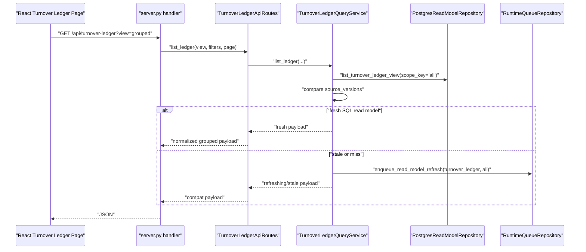
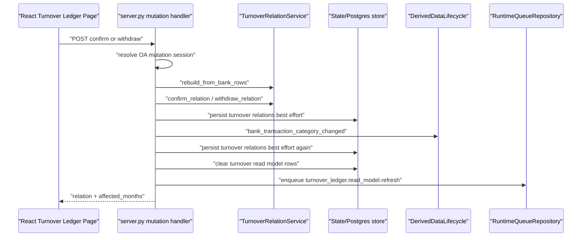
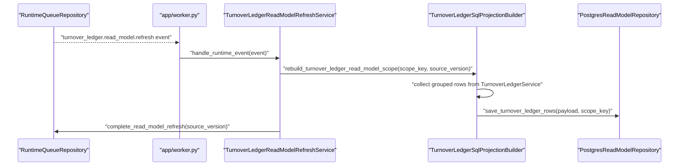

# Turnover Ledger Discovery and Planning

对应 prompt：`PF-P046 - Turnover Ledger Discovery and Planning / Main Delta-Aware Boundary Scan`

## 结论

Turnover Ledger 是独立业务模块，不归入 Workbench 或 Bankdetail。PF-P045 后的代码事实显示，它已经从早期 `TurnoverLedgerService` + `server.py` handler 演进为包含 SQL read model、source versions、worker refresh、grouped breakdown、export 和 bank row tag mutation 的完整模块。

本轮只做 discovery/planning 和文档回写，没有修改业务代码、测试实现、SQL migration、前端或部署配置。

下一步不应直接 extraction/refactor。应先执行 `PF-P047 - Turnover Ledger Characterization Tests`，用测试锁定 grouped breakdown、read model freshness、relation write side effects、export payload、extra fallback 和 Bankdetail/Workbench influence。

## 输入事实源

本轮读取了以下事实源：

- `migration-state-log.md`
- `refactor-prompts.md`
- `ai-execution-rules.md`
- `architecture-inventory.md`
- `module-refactor-plan.md`
- `runtime-call-chain.md`
- `read-model-and-external-services.md`
- `migration-roadmap.md`
- CodeGraph context/explore：Turnover Ledger route、query service、read model refresh、source versions、SQL projection、relation service、worker registration。
- 只读源码扫描：`server.py`、`routes_turnover_ledger.py`、Turnover services、runtime queue、worker registry、PostgreSQL repository、migrations、tests、frontend API calls。

## API / Action Matrix

| API / action | Handler | Primary service path | Repository / runtime path | Current coverage | Notes |
| --- | --- | --- | --- | --- | --- |
| `GET /api/turnover-ledger` | `Application._handle_api_turnover_ledger` | `TurnoverLedgerApiRoutes.list_ledger` -> `TurnoverLedgerQueryService.list_ledger` -> SQL read model, or legacy `TurnoverLedgerService.list_ledger` fallback | `PostgresReadModelRepository.list_turnover_ledger_view`; stale/miss enqueue through `RuntimeQueueRepository.enqueue_read_model_refresh` | `tests/test_turnover_ledger_api.py`, `tests/test_turnover_ledger_query_service.py` | Read path is already service-based, but fallback behavior must be characterized before extraction. |
| `GET /api/turnover-ledger?view=grouped` | same handler | `TurnoverLedgerApiRoutes.list_ledger(view="grouped")`; if SQL payload has `groups`, normalize; if SQL flat payload has freshness status, convert flat rows to grouped payload | Same read model repository; grouped compatibility lives in route facade | `tests/test_turnover_ledger_api.py`, `tests/test_turnover_ledger_service.py` | PF-P045 grouped breakdown preservation makes this the highest-priority test target. |
| `GET /api/turnover-ledger/tag-selection` | `_handle_api_turnover_ledger_tag_selection` | `AppSettingsService.get_turnover_ledger_tag_selection_payload` | Settings storage | `tests/test_turnover_ledger_api.py` | Platform/settings boundary influence. |
| `PUT /api/turnover-ledger/tag-selection` | `_handle_api_turnover_ledger_tag_selection_update` | `AppSettingsService.update_turnover_ledger_tag_selection` | Settings storage, then Turnover read model clear + refresh enqueue | `tests/test_turnover_ledger_api.py` | Mutation is outside Turnover service and schedules refresh from `server.py`. |
| `POST /api/turnover-ledger/bank-row-tags/batch` | `_handle_api_turnover_ledger_bank_row_tags_batch` | `BankTransactionCategoryService.apply_turnover_updates`; then `TurnoverRelationService.rebuild_from_bank_rows`; then `_after_turnover_relation_mutation` | Bankdetail category facts, state store save, derived lifecycle, read model clear/enqueue | `tests/test_turnover_ledger_api.py`, frontend tests | This is a Turnover API that writes Bankdetail facts. Must define owner and transaction contract before refactor. |
| `GET /api/turnover-ledger/export-preview` | `_handle_api_turnover_ledger_export_preview` | `TurnoverLedgerApiRoutes.export_preview` -> `TurnoverLedgerExportService.preview` | Loads grouped payload through route facade | `tests/test_turnover_ledger_export_service.py`, frontend tests | Export depends on grouped payload shape. |
| `GET /api/turnover-ledger/export` | `_handle_api_turnover_ledger_export` | `TurnoverLedgerApiRoutes.export` -> `TurnoverLedgerExportService.export` | Loads grouped payload, builds XLSX | `tests/test_turnover_ledger_export_service.py`, frontend tests | Needs payload compatibility test before route extraction. |
| `GET /api/turnover-ledger/relations/{id}` | `_handle_api_turnover_ledger_relation` | `TurnoverLedgerApiRoutes.get_relation` -> `TurnoverLedgerService.get_relation_detail` | Relation service snapshot + bank rows | `tests/test_turnover_ledger_api.py`, `tests/test_turnover_relation_service.py` | Read detail does not use SQL read model today. |
| `GET /api/turnover-ledger/relations/{id}/extra` | `_handle_api_turnover_ledger_relation_extra` | `TurnoverLedgerApiRoutes.get_relation_extra` | Extra service snapshot | `tests/test_turnover_ledger_api.py`, `tests/test_turnover_ledger_extra_service.py` | Extra fallback path must be locked. |
| `PUT /api/turnover-ledger/relations/{id}/extra` | `_handle_api_turnover_ledger_relation_extra_update` | `TurnoverLedgerApiRoutes.update_relation_extra` -> extra service | `state_store.save_turnover_ledger_extras`, or legacy full snapshot fallback | `tests/test_turnover_ledger_api.py`, `tests/test_turnover_ledger_extra_service.py` | High-risk legacy fallback: `legacy_turnover_ledger_extras_fallback_persist`. |
| `POST /api/turnover-ledger/relations/confirm` | `_handle_api_turnover_ledger_confirm` | `TurnoverRelationService.rebuild_from_bank_rows` -> `TurnoverLedgerApiRoutes.confirm_relation` -> `TurnoverRelationService.confirm_relation` -> `_after_turnover_relation_mutation` | state store relation save, Workbench derived lifecycle, read model clear/enqueue | `tests/test_turnover_relation_service.py`, API tests | Facts/audit and dirty/outbox are not explicitly one transaction in current request path. |
| `POST /api/turnover-ledger/relations/{id}/withdraw` | `_handle_api_turnover_ledger_withdraw` | `TurnoverLedgerApiRoutes.get_relation` -> `TurnoverLedgerApiRoutes.withdraw_relation` -> `TurnoverRelationService.withdraw_relation` -> `_after_turnover_relation_mutation` | state store relation save, Workbench derived lifecycle, read model clear/enqueue | `tests/test_turnover_relation_service.py`, frontend tests | Blocks system relations in handler, not service. |

## File Ownership Matrix

| File | Primary owner | Secondary influence | Notes |
| --- | --- | --- | --- |
| `backend/src/fin_ops_platform/app/routes_turnover_ledger.py` | Turnover Ledger route facade | Platform routing | Contains route-level grouped compatibility and export composition. |
| `backend/src/fin_ops_platform/app/server.py` Turnover handlers | Platform HTTP boundary | Turnover Ledger | Should remain routing/auth/body mapping/assembly only after refactor. Current handlers still schedule persistence and invalidation. |
| `services/turnover_ledger_query_service.py` | Turnover Ledger query/read model | Platform runtime queue | Correctly receives granular dependencies: read repository, queue repository, source versions provider, legacy builder, settings provider. |
| `services/turnover_ledger_read_model_refresh.py` | Turnover Ledger worker refresh | Platform runtime worker | Worker handler validates event type/scope and completes dirty scope after projection rebuild. |
| `services/turnover_ledger_source_versions.py` | Turnover Ledger freshness contract | Workbench read model helper | Computes versions from relation snapshot, extras, tag selection, bank categories, auto tag rules and OA projection sync version. |
| `services/turnover_ledger_sql_projection.py` | Turnover Ledger SQL projection | Platform read model repository | Can build runtime dependencies from `PostgresStateStore`; should remain worker/projection path, not request path. |
| `services/turnover_ledger_service.py` | Turnover Ledger domain/query computation | Bankdetail category semantics | Builds legacy/grouped rows from bank rows, category provider, relation service and extras. |
| `services/turnover_relation_service.py` | Turnover relation facts/audit in-memory domain service | Workbench projection | Owns relation confirm/withdraw/invalidate behavior and audit log, but persistence is still outside this service. |
| `services/turnover_ledger_extra_service.py` | Turnover extra facts | State store / PostgreSQL repository | Extra write path has legacy fallback risk. |
| `services/turnover_ledger_export_service.py` | Turnover export | Route facade grouped payload | Export should depend on a grouped payload loader, not on HTTP or Application. |
| `services/bank_turnover_tag_semantics.py` | Bankdetail / Turnover shared semantics | Bankdetail, Turnover | Shared pure functions for external turnover category labels/action types. |
| `services/postgres_repositories/read_models.py` Turnover methods | Platform read model repository | Turnover Ledger | Should eventually split or wrap behind Turnover read repository port. |
| `services/postgres_repositories/workbench.py` Turnover methods | Platform/PostgreSQL facts repository | Turnover Ledger, Workbench | Stores relations/extras in `app.turnover_*`; naming is misleading for Turnover ownership. |
| `services/runtime_queue.py` | Platform runtime queue | Turnover Ledger refresh | Provides dirty scope + outbox source_version mechanism. |
| `services/runtime_worker_registry.py` | Platform worker registry | Turnover Ledger worker | Registers `turnover-ledger-read-model` as required and RabbitMQ eligible. |
| `app/worker.py` | Platform worker runner | Turnover Ledger worker | Registers `TurnoverLedgerReadModelRefreshService` when flag is enabled. |
| `tests/test_turnover_ledger_*.py` | Turnover Ledger tests | Export/read-model/runtime | Existing tests provide good characterization starting points. |
| `tests/test_workbench_turnover_grouping.py` | Workbench tests | Turnover source versions influence | Must be included when relation/source version changes affect Workbench projection. |

## Static Call Chain

### Query / grouped read

```text
Application.handle_request
  -> Application._handle_api_turnover_ledger
  -> TurnoverLedgerApiRoutes.list_ledger
  -> TurnoverLedgerQueryService.list_ledger
     -> source_versions_provider: Application._turnover_ledger_source_versions
        -> build_turnover_ledger_source_versions
     -> read_repository.list_turnover_ledger_view(scope_key="all")
     -> source_version_mismatch_reasons
     -> refresh_queue_repository.enqueue_read_model_refresh(scope_type="turnover_ledger", scope_key="all")
  -> route facade grouped normalizer when view="grouped"
```

Fallback path:

```text
TurnoverLedgerQueryService.list_ledger
  -> if no read model and PostgreSQL required: return refreshing payload + enqueue
  -> if no read model and PostgreSQL not required: legacy_payload_builder
     -> TurnoverLedgerService.list_ledger
     -> TurnoverRelationService.rebuild_from_bank_rows
```

### Relation confirm / withdraw

```text
Application._handle_api_turnover_ledger_confirm
  -> _turnover_mutation_session
  -> _load_json_body
  -> TurnoverRelationService.rebuild_from_bank_rows
  -> TurnoverLedgerApiRoutes.confirm_relation
  -> TurnoverRelationService.confirm_relation
  -> _after_turnover_relation_mutation
     -> _persist_turnover_relations_best_effort
     -> _invalidate_workbench_after_bank_transaction_categories
        -> _execute_derived_data_lifecycle_event("bank_transaction_category_changed")
     -> _persist_turnover_relations_best_effort
     -> _clear_turnover_ledger_read_model_best_effort
     -> _enqueue_turnover_ledger_read_model_refreshes(reason="turnover_relation_changed")
```

Withdraw follows the same finalizer after first reading the relation and blocking `source != "manual"` in the handler.

### Bank row tag batch

```text
Application._handle_api_turnover_ledger_bank_row_tags_batch
  -> _turnover_mutation_session
  -> _ensure_turnover_bank_row_tag_targets
  -> BankTransactionCategoryService.apply_turnover_updates
  -> state_store.save_bank_transaction_categories
  -> TurnoverRelationService.rebuild_from_bank_rows
  -> _after_turnover_relation_mutation
```

This is a Turnover API that mutates Bankdetail category facts, so ownership must be explicit in future tests.

### Worker refresh

```text
RuntimeQueueRepository.enqueue_read_model_refresh(scope_type="turnover_ledger", scope_key="all")
  -> job.read_model_dirty_scopes source_version increments
  -> job.outbox_events event_type="turnover_ledger.read_model.refresh"
  -> app/worker.py handler registration
  -> TurnoverLedgerReadModelRefreshService.handle_runtime_event
  -> TurnoverLedgerSqlProjectionBuilder.rebuild_turnover_ledger_read_model_scope
  -> PostgresReadModelRepository.save_turnover_ledger_rows
  -> RuntimeQueueRepository.complete_read_model_refresh
```

## Dynamic Runtime Sequences

### Query / stale read model



### Relation write / projection invalidation



Current risk: relation facts/audit persistence and dirty scope/outbox enqueue are coordinated by handler finalizer code, not by a single explicit Turnover Unit of Work.

### Worker refresh



## Read Model Freshness / Source Version Audit

Current source version fields are computed by `build_turnover_ledger_source_versions`:

- `turnover_ledger_schema_version`
- `turnover_relation_schema_version`
- `bank_transaction_category_schema_version`
- `bank_auto_tag_rules_version`
- `turnover_relation_snapshot_version`
- `turnover_ledger_extras_snapshot_version`
- `turnover_ledger_tag_selection_snapshot_version`
- `bank_transaction_category_snapshot_version`
- `oa_projection_sync_version`

Read path behavior:

- `TurnoverLedgerQueryService` reads `read_model.turnover_ledger_rows` through `list_turnover_ledger_view`.
- If stored `source_versions` match expected and `read_model_status` is `fresh`, it returns SQL read model.
- If versions mismatch, it returns the stale payload with `read_model_status="refreshing"` and enqueues `api_stale`.
- If SQL read model is missing and PostgreSQL read model is required, it returns an empty refreshing payload and enqueues `api_miss`.
- If PostgreSQL read model is not required, it falls back to `TurnoverLedgerService.list_ledger`.

Open risks to lock in PF-P047:

- SQL grouped view may return flat rows; route facade converts them back to grouped payload. This compatibility path is intentional and must be tested.
- Request path can still hit legacy builder when PostgreSQL read model is not required.
- `clear_turnover_ledger_rows()` deletes all rows before refresh enqueue in several mutation paths; tests should lock stale/refreshing response behavior after clear.
- No explicit versioned Redis cache was identified for Turnover Ledger in this pass.

## Transaction / Dirty Scope / Outbox Audit

Runtime queue itself supports the desired atomic primitive:

- `enqueue_read_model_refresh()` opens a transaction.
- `enqueue_read_model_refresh_in_transaction()` writes `job.read_model_dirty_scopes` and `job.outbox_events` with monotonic `source_version` in one transaction.
- `complete_read_model_refresh()` completes dirty scope with a `source_version <= event.source_version` filter.

Current Turnover request handlers do not yet expose a single Turnover Unit of Work:

- `confirm` / `withdraw` mutate `TurnoverRelationService` in memory, then `_after_turnover_relation_mutation()` persists relation snapshot, triggers Workbench invalidation, persists again, clears Turnover read model rows and enqueues refresh.
- `bank-row-tags/batch` mutates Bankdetail category service, saves categories, rebuilds Turnover relations, then calls the same finalizer.
- `relation extra update` writes extra snapshot through `_persist_turnover_ledger_extras_best_effort()`, clears Turnover read model rows and enqueues refresh.
- `tag-selection update` writes settings through `AppSettingsService`, clears Turnover read model rows and enqueues refresh.

Production-grade target:

- Future Turnover write slice should introduce a Turnover write service/UoW or equivalent transaction boundary for relation facts, audit, Bankdetail tag mutation where applicable, dirty scope/outbox and source_version.
- The next PF-P047 tests should first characterize current best-effort behavior and exact side effects. Do not implement UoW before tests.

## Cross-Module Influence

| Influence | Direction | Current mechanism | Target rule |
| --- | --- | --- | --- |
| Turnover -> Workbench | Relation/tag changes affect Workbench grouping/projection | `_invalidate_workbench_after_bank_transaction_categories()` runs derived lifecycle event `bank_transaction_category_changed` | Use derived lifecycle / dirty scope / read model projection, not direct Workbench usecase calls. |
| Bankdetail -> Turnover | Bank category tags identify turnover rows | `BankTransactionCategoryService`, effective category provider, `bank_turnover_tag_semantics.py` | Bankdetail owns category facts; Turnover owns ledger interpretation and relation view. |
| Turnover -> Bankdetail | `/bank-row-tags/batch` writes category facts | Handler invokes `BankTransactionCategoryService.apply_turnover_updates()` | Future design must make ownership explicit; this API should use a service with explicit Bankdetail port. |
| Runtime Worker -> Turnover | Read model rebuild | worker registry and `TurnoverLedgerReadModelRefreshService` | Worker runner must not know HTTP response or page payload. |
| Turnover -> Export | Export reads grouped payload | `TurnoverLedgerExportService` receives grouped payload loader | Keep export service independent of HTTP/Application. |

## Low-Coupling Refactor Targets

Follow these targets after characterization tests are in place:

1. Keep `server.py` as HTTP boundary only: auth/session, body parsing, status mapping and service invocation.
2. Keep `routes_turnover_ledger.py` as route facade / response compatibility layer only; avoid persistence, state store or dirty scope scheduling here.
3. Extract a Turnover application service for mutation orchestration only after tests lock current behavior.
4. The mutation service must receive explicit dependencies: relation service/repository, category service port, extra service/repository, queue repository, derived lifecycle port, settings provider.
5. Do not inject `Application`, `state_store` or runtime repositories as god objects.
6. Move repository-specific SQL behind Turnover read/write repository ports; avoid business service raw SQL.
7. Keep `TurnoverLedgerExportService` as pure grouped-payload-to-XLSX logic.

## PF-P047 Characterization Test Plan

Recommended next prompt: `PF-P047 - Turnover Ledger Characterization Tests`.

PF-P047 should add or extend tests without refactoring production code. Suggested test groups:

1. Query freshness:
   - fresh SQL read model returns payload without legacy rebuild.
   - stale SQL source versions returns refreshing payload and enqueues `api_stale`.
   - SQL miss with PostgreSQL-required returns empty refreshing payload and enqueues `api_miss`.
2. Grouped breakdown:
   - flat read model rows with `pending_repayment_amount`, `repaid_amount`, `pending_collection_amount`, `collected_amount`, `closed_amount` preserve grouped totals and mixed direction.
   - grouped payload with `summary_row`, `flow_rows`, `allocation_lots`, `lot_rows` survives route normalization.
3. Relation writes:
   - confirm persists relation/audit side effects and schedules Turnover read model refresh.
   - withdraw blocks non-manual relations and schedules refresh for manual relations.
   - failures before mutation do not enqueue refresh.
4. Extra writes:
   - extra update persists current snapshot and schedules refresh.
   - legacy fallback path is explicitly characterized or marked as a removal candidate.
5. Bank row tag batch:
   - validates target rows are turnover-eligible.
   - category updates invalidate Turnover and Workbench projections.
   - conflict errors return current response shape.
6. Export:
   - preview/export flatten grouped payload into summary + real flow rows.
   - row limit/family filter behavior is stable.
7. Cross-module source versions:
   - changing relation snapshot, extras, tag selection, bank category snapshot or auto tag rules changes expected source versions.
   - Workbench turnover grouping tests remain in the verification set.

## PF-P047 Characterization Test Results

PF-P047 has been implemented as a test-only slice. It did not modify production code.

Added/extended characterization coverage:

- Query freshness:
  - SQL read model miss with PostgreSQL-required returns empty refreshing payload and enqueues `api_miss`.
  - SQL read model miss with PostgreSQL optional falls back to the legacy builder and injects current `source_versions`.
- Grouped breakdown:
  - Flat read model grouped conversion now asserts backend-only breakdown fields including `closed_amount`, `repaid_amount` and `collected_amount`.
- Relation and extra writes:
  - Confirm/withdraw currently clear Turnover read model rows and enqueue `turnover_relation_changed`.
  - Non-manual/system withdraw returns the current error shape and does not enqueue refresh.
  - Relation extra update clears Turnover read model rows and enqueues `turnover_relation_extra_changed`.
  - The legacy full snapshot fallback path for extras is explicitly characterized through `legacy_turnover_ledger_extras_fallback_persist`.
- Bank row tag batch:
  - Non-turnover rows fail validation with no Turnover read model refresh side effect.
- Export:
  - Preview limit/totals and empty grouped payload shape are locked.
- Source versions:
  - `build_turnover_ledger_source_versions` now has a dedicated contract test covering relation snapshot, extras, tag selection, bank category snapshot, bank auto tag rules and OA projection sync inputs.

Verification:

- `PYTHONPATH=backend/src python3 -m unittest tests.test_turnover_ledger_query_service tests.test_turnover_ledger_api tests.test_turnover_ledger_export_service tests.test_turnover_ledger_source_versions -v`: Pass, 33 tests.
- `PYTHONPATH=backend/src python3 -m unittest tests.test_turnover_ledger_query_service tests.test_turnover_ledger_api tests.test_turnover_ledger_export_service tests.test_turnover_relation_service tests.test_turnover_ledger_extra_service tests.test_workbench_turnover_grouping tests.test_turnover_ledger_source_versions -v`: Pass, 79 tests.

## PF-P048 Query/Route Facade Extraction Planning

PF-P048 is a planning-only slice. It does not modify production code, tests, SQL migrations, frontend code or deployment configuration.

### Target Boundary

The next implementation slice should extract only the Turnover Ledger query/read-only HTTP boundary. It must not introduce Turnover Unit of Work, stale write handling, durable idempotency, mutation orchestration or worker changes.

Keep these responsibilities in `server.py`:

- HTTP method/path dispatch.
- Query/body parsing and simple scalar normalization, such as `page`, `page_size`, `family`, `direction`, `status` and `limit`.
- Auth/session resolution where currently required.
- Mapping domain/service exceptions to HTTP status and error payloads.
- Constructing `Response`, including JSON responses and XLSX headers.

Move or make explicit these read-only route responsibilities:

- Calling `TurnoverLedgerApiRoutes.list_ledger` for list/grouped query payloads.
- Calling `TurnoverLedgerApiRoutes.export_preview` and `TurnoverLedgerApiRoutes.export`.
- Calling `TurnoverLedgerApiRoutes.get_relation` and `get_relation_extra` for read-only detail payloads.
- Keeping grouped compatibility normalization in `TurnoverLedgerApiRoutes`, including:
  - query service delegation;
  - SQL flat read model -> grouped payload compatibility;
  - native grouped payload normalization;
  - extra fields merged into flat grouped rows;
  - export grouped payload composition.

The practical shape for PF-P049 should be a narrow read/query adapter around the existing `TurnoverLedgerApiRoutes`, not a new business service. A reasonable target is a small helper/facade near the app route boundary, for example `TurnoverLedgerReadHttpFacade` or equivalent, that accepts granular dependencies and returns plain Python payload objects or export tuples. It must not know `Response`, cookies, headers, or the whole `Application`.

### File Touch Plan for PF-P049

Allowed files for the next implementation prompt:

- `backend/src/fin_ops_platform/app/server.py`
- `backend/src/fin_ops_platform/app/routes_turnover_ledger.py`, only if a small read-only facade/helper is added there or a method is split without behavior changes.
- Optionally a new focused app-boundary file such as `backend/src/fin_ops_platform/app/turnover_ledger_read_facade.py`, if keeping the extraction out of the already-large route file is clearer.
- Existing Turnover Ledger tests only if an import path or helper name changes require a mechanical update. Prefer no test edits unless necessary.
- State/prompt docs after execution.

Explicitly excluded files:

- `backend/src/fin_ops_platform/services/turnover_relation_service.py`
- `backend/src/fin_ops_platform/services/turnover_ledger_extra_service.py`
- `backend/src/fin_ops_platform/services/turnover_ledger_query_service.py`
- `backend/src/fin_ops_platform/services/turnover_ledger_export_service.py`
- `backend/src/fin_ops_platform/services/runtime_queue.py`
- `backend/src/fin_ops_platform/app/worker.py`
- `backend/src/fin_ops_platform/services/postgres_repositories/**`
- SQL migrations.
- Frontend code.
- Deployment and gateway configuration.

PF-P049 must not touch mutation handlers:

- `_handle_api_turnover_ledger_tag_selection_update`
- `_handle_api_turnover_ledger_bank_row_tags_batch`
- `_handle_api_turnover_ledger_relation_extra_update`
- `_handle_api_turnover_ledger_confirm`
- `_handle_api_turnover_ledger_withdraw`

### Dependency Injection Plan

Do not inject `Application`, `state_store`, `RuntimeRepositories`, or other god objects into the new boundary helper.

Allowed dependencies are granular and already exist:

- `TurnoverLedgerApiRoutes` for route facade behavior.
- `TurnoverLedgerQueryService` only through `TurnoverLedgerApiRoutes`, unless a method is split for clarity.
- `TurnoverLedgerExportService` only through the existing route facade composition.
- `TurnoverLedgerExtraService` only through `TurnoverLedgerApiRoutes.get_relation_extra` for GET.
- Small formatting helpers for response headers may remain in `server.py`.

Service-level code must not read HTTP headers, cookies, or import `app.auth`. Read-only facade code must not construct `Response`. It should return:

- `dict[str, object]` for JSON payloads.
- `(filename, bytes)` for XLSX export content.
- It may raise the same current exceptions (`KeyError`, `TypeError`, `ValueError`) so `server.py` keeps HTTP mapping behavior.

### Safe Slice Proposal

PF-P049 should be a conservative extraction with this order:

1. Introduce a read-only Turnover Ledger route/query facade helper that delegates to the current `TurnoverLedgerApiRoutes`.
2. Wire the helper in application initialization using the existing `_turnover_ledger_api_routes` instance, not by passing the whole application.
3. Replace only these handlers with helper calls while preserving HTTP response mapping:
   - `_handle_api_turnover_ledger`
   - `_handle_api_turnover_ledger_export_preview`
   - `_handle_api_turnover_ledger_export`
   - `_handle_api_turnover_ledger_relation`
   - `_handle_api_turnover_ledger_relation_extra`
4. Leave `_handle_api_turnover_ledger_relation_extra_update` untouched, except for reading it as a boundary reference.
5. Run PF-P047 verification after each meaningful edit if the diff grows.

PF-P047 guard coverage for this slice:

- `tests/test_turnover_ledger_query_service.py` protects SQL freshness, stale/miss refresh enqueue and legacy fallback behavior.
- `tests/test_turnover_ledger_api.py` protects grouped view response shape, family filtering, relation extra GET/PUT compatibility, export HTTP response headers and mutation side effects.
- `tests/test_turnover_ledger_export_service.py` protects grouped payload flattening, limits, empty payload and XLSX generation.
- `tests/test_turnover_ledger_extra_service.py` protects extra defaults and normalization used by GET extra responses.
- `tests/test_workbench_turnover_grouping.py` remains in the set to catch cross-module source-version influence regressions.

### Non-Goals

PF-P049 must not:

- introduce or design Turnover Unit of Work;
- fix stale write behavior;
- alter relation confirm/withdraw;
- alter `/api/turnover-ledger/bank-row-tags/batch`;
- alter tag-selection writes;
- remove or weaken legacy read fallback;
- remove extra legacy full snapshot fallback;
- optimize read model cache or source version logic;
- move SQL/repository code;
- change worker refresh routing;
- change frontend API contracts.

### Test Gate for PF-P049

Required targeted verification:

```bash
PYTHONPATH=backend/src python3 -m unittest tests.test_turnover_ledger_query_service tests.test_turnover_ledger_api tests.test_turnover_ledger_export_service tests.test_turnover_relation_service tests.test_turnover_ledger_extra_service tests.test_workbench_turnover_grouping tests.test_turnover_ledger_source_versions -v
```

Also run:

```bash
git status --short --branch
git ls-files --others --exclude-standard
git diff --check
test ! -e backend-go
```

If PF-P049 changes import boundaries or adds a new file, run the smallest additional focused import/build smoke available through unittest discovery for the touched tests.

### PF-P048 Risk Register

| Risk | Severity | Planning decision |
| --- | --- | --- |
| `TurnoverLedgerApiRoutes` already mixes compatibility normalization and export composition | Medium | Do not split those responsibilities in PF-P049. First make the HTTP read boundary explicit; deeper route facade split can be a later prompt. |
| Extra GET and PUT share route facade methods but different safety profiles | High | PF-P049 may touch `get_relation_extra` read path only. PUT remains a mutation side-effect path and is excluded. |
| Query fallback is ugly but intentionally locked | High | PF-P049 must preserve legacy fallback exactly. Any fallback removal requires a later prompt with tests and rollout decision. |
| Export returns bytes and needs headers | Medium | Keep `Response` construction and content-disposition header mapping in `server.py`; facade returns `(filename, content)` only. |
| Relation detail GET reads relation state but is not a write | Medium | It can be included in read-only facade extraction, but must not pull in confirm/withdraw logic. |

### PF-P049 Direction

Default next prompt after PF-P048 is verified:

`PF-P049 - Turnover Ledger Query/Route Facade Extraction`

PF-P049 should implement the read-only facade extraction above. If review finds the implementation slice too broad, split it into:

1. `PF-P049A - Turnover Ledger List/Grouped Read Facade Extraction`
2. `PF-P049B - Turnover Ledger Export/Detail Read Facade Extraction`

## Risk Register

| Risk | Severity | Evidence | Next action |
| --- | --- | --- | --- |
| Request path legacy rebuild fallback | High | `TurnoverLedgerQueryService` falls back to `legacy_payload_builder` when PostgreSQL read model is not required | Preserve in PF-P049; removal requires a later prompt and rollout decision. |
| Mutation side effects not under explicit UoW | High | Handler finalizer persists relation snapshot, runs derived lifecycle, clears read model and enqueues refresh separately | Exclude from PF-P049; later design Turnover write UoW after read route extraction. |
| Extra write legacy full snapshot fallback | High | `_persist_turnover_ledger_extras_best_effort()` can call `legacy_turnover_ledger_extras_fallback_persist` | Exclude from PF-P049; later remove or gate fallback after dedicated mutation tests. |
| Turnover API writes Bankdetail facts | High | `/bank-row-tags/batch` calls `BankTransactionCategoryService.apply_turnover_updates()` | Define service port and transaction boundary before refactor. |
| Grouped flat read model compatibility | Medium-high | PF-P045 preserved grouped breakdowns from flat read model rows | PF-P047 now locks response shape; PF-P049 must preserve it. |
| Worker refresh scope granularity | Medium | projection supports scope key, query always uses `scope_key="all"` | Clarify if month scopes are intended before optimizing worker fanout. |
| Repository ownership confusion | Medium | Turnover relation persistence is in `postgres_repositories/workbench.py` | Later introduce or alias Turnover repository port to avoid Workbench coupling. |

## Next Prompt

Generate and review:

`PF-P049 - Turnover Ledger Query/Route Facade Extraction`

PF-P049 should stay in the same branch unless the user chooses a cumulative Merge Gate first. It should implement only the read-only query/route facade extraction planned in PF-P048 and must preserve the PF-P047 test contract.
