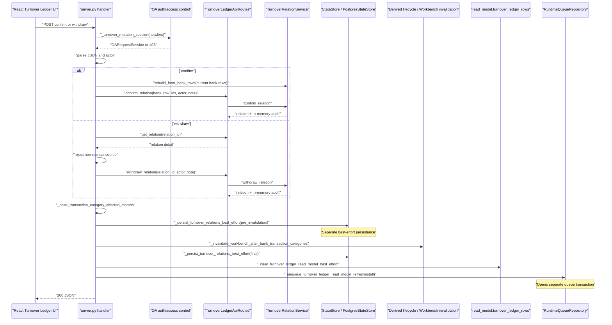
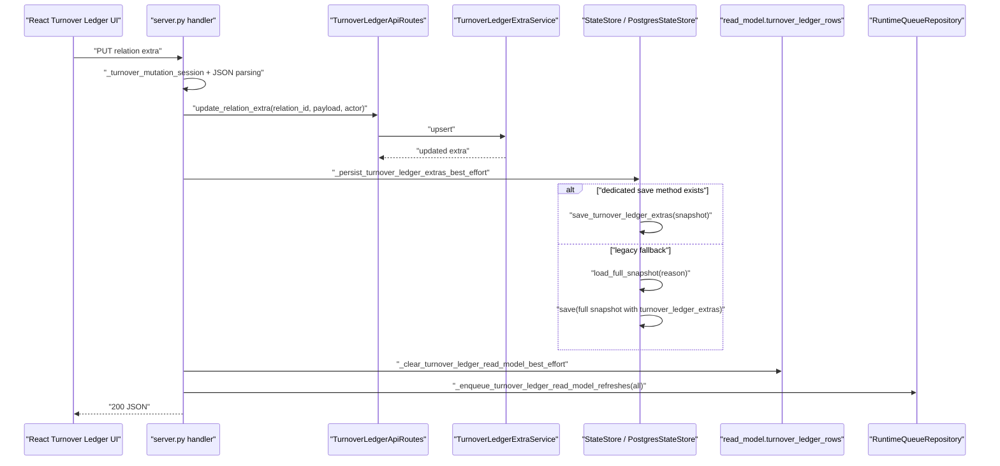
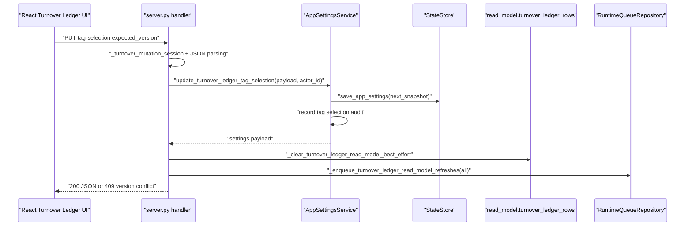
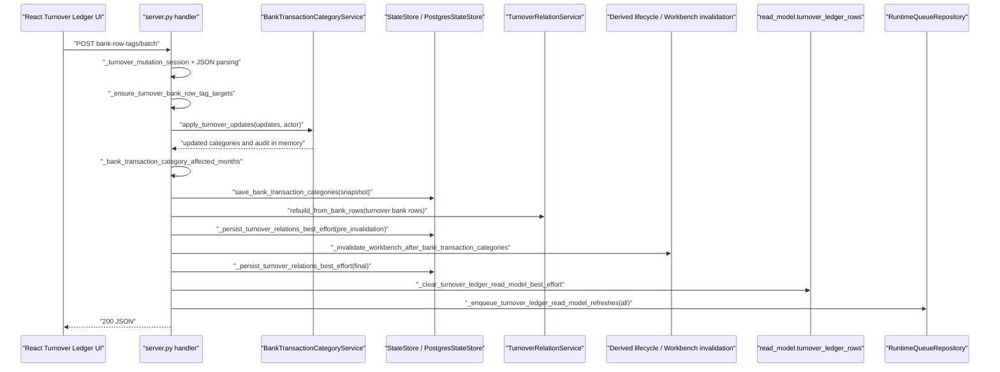
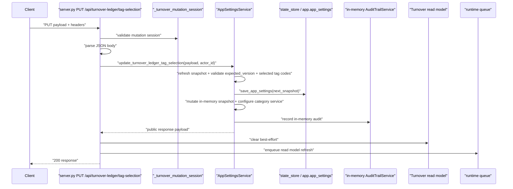
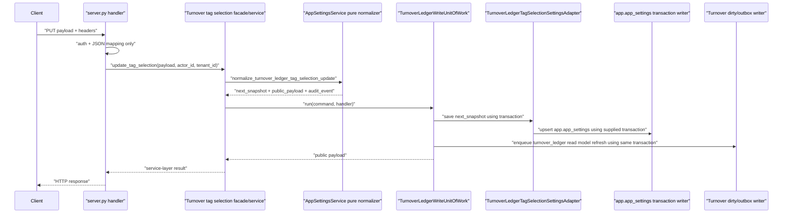

# Turnover Ledger Write Path and UoW Boundary Plan

对应 prompt：`PF-P051 - Turnover Ledger Write Path Discovery and UoW Boundary Planning`

状态：PF-P051 `verified`；PF-P052 `verified`；PF-P053 `verified`；PF-P054 `verified`

## Scope

本文件只记录 Turnover Ledger 写路径 discovery/planning。PF-P051 未修改 production code、tests、SQL migration、worker、frontend、deployment 或生产配置。

目标是为后续 Turnover Ledger 写路径重构建立事实源：

- 哪些 API 写 Turnover / Bankdetail / settings facts；
- 哪些 side effects 现在由 `server.py` 编排；
- 哪些步骤不在同一个 PostgreSQL transaction 中；
- 未来 `TurnoverLedgerWriteUnitOfWork` 必须包住哪些 facts、audit、dirty scope、outbox 和 source version；
- 下一步应该先补哪些 characterization / contract tests。

## CodeGraph And Source Coverage

PF-P051 使用 CodeGraph 覆盖了以下写路径入口和后置副作用：

- `_handle_api_turnover_ledger_confirm`
- `_handle_api_turnover_ledger_withdraw`
- `_handle_api_turnover_ledger_relation_extra_update`
- `_handle_api_turnover_ledger_tag_selection_update`
- `_handle_api_turnover_ledger_bank_row_tags_batch`
- `_after_turnover_relation_mutation`
- `_persist_turnover_relations_best_effort`
- `_persist_turnover_ledger_extras_best_effort`
- `_clear_turnover_ledger_read_model_best_effort`
- `_enqueue_turnover_ledger_read_model_refreshes`

关键源码事实：

- `server.py` 的 Turnover 写 handler 仍负责 auth/session、body parsing、业务 service 调用、state store persistence、read model clear 和 runtime queue enqueue。
- `TurnoverLedgerApiRoutes` 仍是 read/write 混合 facade：read-side 已被 `TurnoverLedgerReadFacade` 包住，但 write methods 仍直接委托 `TurnoverRelationService` 和 extra service。
- `RuntimeQueueRepository.enqueue_read_model_refresh_in_transaction()` 已具备 transaction-bound dirty scope + outbox primitive。
- 当前 `server.py` 调用的是 `_enqueue_turnover_ledger_read_model_refreshes()`，该 helper 走 queue repository 的非事务 `enqueue_read_model_refresh()` wrapper。
- `PostgresStateStore.save_turnover_relations()` 会写 repository 并保存 snapshot，`PostgresWorkbenchRepository.save_turnover_relations()` 自己开启 transaction。
- `PostgresWorkbenchRepository.save_turnover_ledger_extras()` 当前逐条 execute，没有被 Turnover 写 handler 的外层 transaction 包住。
- `_persist_turnover_ledger_extras_best_effort()` 在缺少 dedicated store method 时会调用 legacy full snapshot fallback。

## Write API Matrix

| API | Handler | Core service/usecase | Persistence today | Audit today | Dirty/outbox today | Cross-module influence | Current tests | Risk |
| --- | --- | --- | --- | --- | --- | --- | --- | --- |
| `PUT /api/turnover-ledger/tag-selection` | `_handle_api_turnover_ledger_tag_selection_update` | `AppSettingsService.update_turnover_ledger_tag_selection` | `state_store.save_app_settings()` inside app settings service | `_record_turnover_ledger_tag_selection_audit()` inside app settings service | After service returns: clear Turnover read model best-effort, enqueue `turnover_ledger.read_model.refresh` | Changes selected tags used by Turnover source_versions and query filtering | `test_turnover_ledger_tag_selection_get_put_and_version_conflict` | High. Settings fact/audit and read model dirty/outbox are split. |
| `POST /api/turnover-ledger/bank-row-tags/batch` | `_handle_api_turnover_ledger_bank_row_tags_batch` | `BankTransactionCategoryService.apply_turnover_updates`; `TurnoverRelationService.rebuild_from_bank_rows` | `state_store.save_bank_transaction_categories()` then `_after_turnover_relation_mutation()` persists turnover relations | Bank category audit inside category service; Turnover relation audit from rebuild/manual relations snapshot | `_after_turnover_relation_mutation()` clears read model and enqueues refresh after Bankdetail write | Writes Bankdetail facts, triggers Workbench invalidation, rebuilds Turnover relations | `test_turnover_bank_row_tag_batch_save_updates_category_and_reflects_to_bank_details`; invalid target side-effect test | Critical. It is a Turnover API writing Bankdetail facts plus Turnover relation/read-model side effects across separate boundaries. |
| `PUT /api/turnover-ledger/relations/{id}/extra` | `_handle_api_turnover_ledger_relation_extra_update` | `TurnoverLedgerApiRoutes.update_relation_extra`; `TurnoverLedgerExtraService.upsert` | `_persist_turnover_ledger_extras_best_effort()` | Extra payload has `updated_by`/`updated_at`, but no dedicated append-only audit table | Clear Turnover read model best-effort, enqueue refresh | Affects Turnover read model/source_versions; no Workbench invalidation | `test_relation_extra_get_returns_default_structure_and_put_persists`; legacy fallback test; invalid/readonly tests | High. Extra fact persistence and dirty/outbox are split; legacy full snapshot fallback remains. |
| `POST /api/turnover-ledger/relations/confirm` | `_handle_api_turnover_ledger_confirm` | `TurnoverRelationService.rebuild_from_bank_rows`; `TurnoverLedgerApiRoutes.confirm_relation`; `TurnoverRelationService.confirm_relation` | `_after_turnover_relation_mutation()` persists Turnover relation snapshot twice | `TurnoverRelationService.confirm_relation()` appends audit in memory, persisted through relation snapshot | `_after_turnover_relation_mutation()` clears read model and enqueues refresh | Workbench invalidation via `bank_transaction_category_changed` lifecycle | service tests and `test_confirm_and_withdraw_require_mutation_permission_and_write_audit` | High. Relation facts/audit and dirty/outbox not one transaction; no explicit expected relation version. |
| `POST /api/turnover-ledger/relations/{id}/withdraw` | `_handle_api_turnover_ledger_withdraw` | `TurnoverLedgerApiRoutes.get_relation`; handler source check; `TurnoverRelationService.withdraw_relation` | `_after_turnover_relation_mutation()` persists Turnover relation snapshot twice | `TurnoverRelationService.withdraw_relation()` appends audit in memory, persisted through relation snapshot | `_after_turnover_relation_mutation()` clears read model and enqueues refresh | Workbench invalidation via affected bank row months | service tests, API permission/audit test, system relation reject test | High. No explicit expected relation version; duplicate withdraw can increment version again unless later tests prove otherwise. |

## Runtime Sequence

### Confirm / Withdraw

### Relation Extra PUT

### Tag Selection PUT

### Bank Row Tags Batch

## Transaction / Outbox / Dirty Scope Audit

| Write path | Facts/audit same transaction? | Dirty scope/outbox same transaction? | Current split point | Failure mode |
| --- | --- | --- | --- | --- |
| Tag selection PUT | Partially. Settings save and audit are inside `AppSettingsService`, but not bound to Turnover refresh enqueue. | No. Read model clear and queue enqueue happen after service returns. | `update_turnover_ledger_tag_selection()` returns before clear/enqueue. | Settings update succeeds but read model refresh enqueue fails, leaving stale Turnover view. |
| Bank row tags batch | No. Bankdetail category facts are saved before relation rebuild/finalizer. | No. Queue enqueue happens after category save and relation persistence. | `save_bank_transaction_categories()` precedes `rebuild_from_bank_rows()` and `_after_turnover_relation_mutation()`. | Bankdetail facts change but relation rebuild or refresh enqueue fails, causing Turnover/Workbench divergence. |
| Relation extra PUT | No dedicated audit; extra fact persistence is best-effort. | No. Read model clear/enqueue happen after best-effort persistence. | `_persist_turnover_ledger_extras_best_effort()` can swallow exceptions. | API may return success after in-memory extra update while persistence or refresh silently fails. |
| Confirm relation | No explicit outer transaction. Relation and audit mutate in memory, then snapshot persistence is best-effort. | No. Clear/enqueue happen after best-effort persistence. | `_after_turnover_relation_mutation()` runs multiple independent side effects. | Relation fact/audit may persist without outbox, or Workbench invalidation may run between two relation snapshot saves. |
| Withdraw relation | Same as confirm. | Same as confirm. | Same finalizer. | Withdraw fact may persist without refresh; duplicate withdraw may increment version again without stale precondition. |

Runtime queue already has the primitive needed for the target model: `enqueue_read_model_refresh_in_transaction()` writes dirty scope and outbox in one transaction. The blocker is that Turnover write handlers do not own a transaction that also includes the facts/audit writes.

## UoW Readiness Assessment

Future `TurnoverLedgerWriteUnitOfWork` must eventually make the following writes atomic where a single API changes them:

- Turnover relation facts in `app.turnover_relations`.
- Turnover relation audit in `app.turnover_relation_events`.
- Turnover relation extras in `app.turnover_ledger_extras`.
- App setting mutation for `turnover_ledger_tag_selection` and its audit record, or a dedicated port that can join the same transaction.
- Bankdetail category facts and category audit for `bank-row-tags/batch`, through an explicit Bankdetail port.
- Workbench invalidation influence caused by bank category changes, either as transaction-bound dirty/outbox or a clearly separate downstream event.
- Turnover read model dirty scope and `job.outbox_events`.
- Source version / expected version contract for relation snapshot, extras, tag selection and bank categories.

Current blockers:

- `server.py` owns the orchestration and passes no transaction object through the write paths.
- `PostgresStateStore.save_turnover_relations()` delegates to repository and snapshot save as separate operations.
- `PostgresWorkbenchRepository.save_turnover_relations()` has its own transaction wrapper, so it cannot currently join a higher-level Turnover UoW.
- `save_turnover_ledger_extras()` is not clearly transaction-bound to dirty/outbox.
- Tag selection lives in `AppSettingsService`, not a Turnover-specific repository/port.
- `bank-row-tags/batch` is a Turnover API but writes Bankdetail facts.
- `_clear_turnover_ledger_read_model_best_effort()` deletes read model rows outside the target dirty/outbox transaction and swallows failures.
- `confirm`/`withdraw` do not take expected relation versions from the client.

Do not implement UoW until the tests below are added and the repository/port ownership is made explicit.

## PF-P052 Test Slice

`PF-P052 - Turnover Ledger Write Path Characterization Tests` has been generated and reviewed.

PF-P052 remained test-only and locked current duplicate/stale/failure behavior for:

- tag selection PUT;
- bank-row-tags batch;
- relation extra PUT;
- confirm relation;
- withdraw relation.

PF-P052 did not implement `TurnoverLedgerWriteUnitOfWork`, migrate handlers, change repository semantics, change runtime queue behavior, or modify production configuration.

PF-P052 added API-level characterization tests proving:

- tag selection PUT saves settings and clears the read model before queue failure propagates;
- bank-row-tags batch saves Bankdetail category facts before queue failure propagates, and the attempted queue sequence includes Bankdetail/Workbench/Turnover scopes;
- relation extra persistence failure is currently best-effort success and still refreshes;
- confirm relation snapshot persistence failure is currently best-effort success and still refreshes;
- duplicate confirm currently rejects with `relation_row_conflict`;
- duplicate withdraw currently succeeds again, appends a second withdraw audit entry, and refreshes again.

## Idempotency / Stale Write / Conflict Baseline

| Write path | Duplicate submit today | Stale write today | Existing conflict primitive | Gap |
| --- | --- | --- | --- | --- |
| Tag selection PUT | Same old `expected_version` returns 409 after first success. | Has optimistic version via `expected_version`/`version`. | `turnover_ledger_tag_selection_version_conflict` maps to 409. | Need tests that refresh enqueue failure does not leave silent success once UoW is introduced. |
| Bank row tags batch | Same payload with old expected row version returns 409 after version increment; same payload with current version may be treated as no-op by category service. | Has per-row category `expected_version`. | `category_version_conflict` maps to 409. | Need tests for atomicity across Bankdetail save, relation rebuild, Workbench invalidation and Turnover enqueue. |
| Relation extra PUT | Repeating same payload updates `updated_at`/`updated_by` sequencing through extra service; no expected extra version. | No expected version in API. | Validation errors map to 400; no stale conflict. | Need characterization of duplicate extra PUT and a future version contract. |
| Confirm relation | Duplicate confirm of active syncable rows is rejected by relation service as row conflict. | No expected relation/read model version. Handler rebuilds from current bank rows before confirm. | `TurnoverRelationValidationError` maps to 400, not 409. | Need API-level duplicate/stale tests and decision whether stale relation conflicts should become 409 later. |
| Withdraw relation | Current service can withdraw a relation by id and increments version; no expected version. Existing tests only cover manual source success and system source rejection. | No expected relation version. | Unknown relation maps to 404; validation maps to 400. | Need duplicate withdraw and stale version tests before migration. |

## Repository Ownership And Coupling Audit

Current coupling:

- HTTP/session parsing is in `server.py`, which is acceptable only as app boundary.
- Business orchestration is also in `server.py`, which is not acceptable long term.
- `TurnoverLedgerApiRoutes` mixes read-only and write methods. Read-side is now behind `TurnoverLedgerReadFacade`, but write-side still lacks a write facade/service.
- Turnover relation persistence lives in `services/postgres_repositories/workbench.py`, which obscures ownership.
- Bankdetail category mutation is invoked directly through `BankTransactionCategoryService`.
- Settings mutation is invoked directly through `AppSettingsService`.
- Runtime queue access is through `_runtime_repositories.queue_repository`, but from `server.py`.
- Legacy full snapshot fallback remains for extras.

Future ownership target:

- `server.py`: auth/session, request/response mapping, dependency assembly, error mapping only.
- `TurnoverLedgerWriteFacade` or equivalent app-level write service: command normalization and call into Turnover write usecase/UoW with granular dependencies.
- Turnover repository port: relation facts, relation audit and extras persistence.
- Bankdetail port: category update facts/audit for `bank-row-tags/batch`.
- Settings port: tag selection update with version contract.
- Platform runtime/outbox port: transaction-bound dirty scope + outbox using `enqueue_read_model_refresh_in_transaction()`.
- Workbench influence: explicit downstream event or platform dirty scope, not ad hoc `server.py` lifecycle calls.

## Test Gap Matrix

| Area | Existing coverage | Missing before UoW implementation | Recommended test type |
| --- | --- | --- | --- |
| Tag selection PUT | Version conflict, invalid tag, queue enqueue on success; PF-P052 locks queue failure after settings save/read model clear. | Atomic target contract for settings + dirty/outbox. | Future UoW/contract tests. |
| Bank row tags batch | Success updates Bankdetail and response flags; invalid non-turnover rows have no refresh side effects; PF-P052 locks queue failure after Bankdetail category save and derived refresh attempts. | Duplicate/current-version behavior; Workbench invalidation atomicity target contract. | Future UoW/contract tests. |
| Relation extra PUT | GET default, PUT persists, reload works, invalid payload, readonly rejection, legacy fallback; PF-P052 locks persistence failure as best-effort success. | Duplicate extra PUT behavior; stale extra version target contract. | Future UoW/contract tests. |
| Confirm relation | Service-level confirm validation/audit; API permission/audit/enqueue success; PF-P052 locks duplicate confirm and relation persistence failure behavior. | Enqueue failure after relation persist; future expected version behavior. | Future UoW/contract tests. |
| Withdraw relation | Service-level withdraw audit; API permission/audit success; system relation rejection; PF-P052 locks duplicate withdraw currently succeeding and re-enqueueing. | Stale relation version behavior; persistence/enqueue failure split target contract. | Future UoW/contract tests. |
| Dirty scope/outbox | RuntimeQueue repository has transaction-bound primitive. | Turnover write path does not use transaction-bound primitive. | Future contract tests after characterization. |
| Repository ownership | Existing repository methods persist relation/extras. | No Turnover-specific transaction-bound repository port. | Planning/design then contract tests. |

## Next Slice Recommendation

PF-P052 已完成。下一条 prompt 应该是：

`PF-P053 - Turnover Ledger Write UoW Contract Tests`

原因：

- 当前行为已经被 PF-P052 的 API-level characterization tests 锁定。
- 下一步不应直接迁移真实写 API；应先定义目标 UoW 契约，明确哪些行为需要从当前 best-effort / split side effects 收敛为 transaction-bound facts/audit/dirty/outbox。
- PF-P053 应聚焦 contract tests / expected failures / fake repository ports，不改真实 handler 语义。

不建议下一步直接实现 UoW。

## PF-P053 Contract Test Slice

`PF-P053 - Turnover Ledger Write UoW Contract Tests` has been generated, reviewed and executed.

PF-P053 created target contract tests before any production UoW implementation. The contract tests preserve future expectations for:

- transaction-bound relation facts + relation audit + dirty scope + outbox;
- rollback when dirty scope / outbox fails;
- duplicate withdraw and stale expected version conflict target semantics;
- relation extra write atomicity instead of best-effort success;
- tag selection write atomicity instead of settings save before queue failure;
- bank-row-tags batch explicit Bankdetail port / transaction-bound downstream event boundary;
- granular UoW dependencies without `Application` god object, HTTP headers/cookies or `app.auth`.

PF-P053 uses `unittest.expectedFailure` for target contracts that cannot pass before the minimal UoW skeleton exists. Default CI remains green, while unexpected success should signal that a contract has become implemented.

PF-P053 added `tests/test_turnover_ledger_uow_contract.py` with 7 expected failures:

- confirm relation commits relation facts, audit, dirty scope and outbox in one transaction;
- confirm relation outbox failure rolls back relation facts/audit;
- withdraw relation rejects stale or duplicate submit before the handler runs;
- relation extra outbox failure does not return best-effort success;
- tag selection outbox failure rolls back settings save/audit;
- bank-row-tags batch uses an explicit Bankdetail port and rolls back on outbox failure;
- UoW constructor requires granular ports and rejects `Application` god object injection.

Next slice recommendation:

`PF-P054 - Turnover Ledger Minimal UoW Skeleton`

PF-P054 should introduce the smallest `TurnoverLedgerWriteUnitOfWork.run(command, handler)` skeleton needed to start turning these contract tests green with fake/in-memory ports. PF-P054 must not migrate real Turnover Ledger write APIs.

## PF-P054 Minimal Skeleton Slice

`PF-P054 - Turnover Ledger Minimal UoW Skeleton` has been generated, reviewed and executed.

PF-P054 added only the minimal production skeleton needed by `tests/test_turnover_ledger_uow_contract.py`:

- `backend/src/fin_ops_platform/services/turnover_ledger_write_uow.py`;
- `TurnoverLedgerWriteUnitOfWork`;
- `run(command, handler)`;
- transaction context creation;
- stale precondition port call before handler;
- handler context exposing transaction and granular ports;
- transaction-bound dirty/outbox writer call after handler;
- no `Application` god object constructor.

PF-P054 did not connect the skeleton to `server.py` or any real Turnover Ledger API.

Verification:

- `PYTHONPATH=backend/src python3 -m unittest tests.test_turnover_ledger_uow_contract -v`：Pass，7 tests。
- `PYTHONPATH=backend/src python3 -m unittest tests.test_turnover_ledger_api -v`：Pass，27 tests。

Next slice recommendation:

`PF-P054-MG - Turnover Ledger Write UoW Foundation Cumulative Merge Gate`

This MG should cover PF-P051 through PF-P054 before migrating real Turnover Ledger write APIs.

## Real API Integration Plan

对应 prompt：`PF-P055 - Turnover Ledger Write Facade / UoW Integration Planning`

状态：`implemented`

PF-P055 only plans the real API integration path. It does not modify production code, tests, handlers, repositories, runtime queue, worker, SQL migrations, frontend, deployment or production configuration.

### Integration Principles

- Keep `server.py` as HTTP/session/body parsing, dependency assembly, response mapping and error mapping only.
- Do not call `TurnoverLedgerWriteUnitOfWork` directly from many handlers long term. Introduce a small `TurnoverLedgerWriteFacade` first so handler migration remains thin and reversible.
- Do not inject `Application` into the facade or UoW.
- Keep granular dependencies: relation service/repository port, extra repository port, settings port, Bankdetail port, stale precondition port, dirty/outbox writer.
- Keep PF-P052 characterization tests unchanged until a specific migration prompt intentionally changes behavior and updates target tests.
- Do not mix all write APIs in one prompt. Migrate one low-risk entry first, then continue by risk.

### Readiness Matrix

| API | Current handler responsibility | Target facade/usecase responsibility | Needed granular dependencies / ports | Current test baseline | UoW readiness | Risk | Recommendation |
| --- | --- | --- | --- | --- | --- | --- | --- |
| `PUT /api/turnover-ledger/relations/{id}/extra` | Auth/session, JSON parsing, calls `TurnoverLedgerApiRoutes.update_relation_extra`, best-effort extra persistence, read model clear, refresh enqueue, response flag. | `TurnoverLedgerWriteFacade.update_relation_extra(command)` should validate command, call extra service/repository inside UoW, enqueue dirty/outbox transaction-bound, return payload for handler mapping. | Extra repository port; relation existence reader; dirty/outbox writer; optional stale precondition for future extra version. | PF-P052 locks success, invalid, readonly, legacy fallback and persistence failure best-effort behavior. | Highest readiness. It only changes Turnover extra facts and Turnover read model refresh; no Bankdetail/Workbench lifecycle. | Medium. Current persistence failure is best-effort success, target UoW will later change failure semantics. | First real integration candidate, but next prompt should add facade-level tests before production wiring. |
| `POST /api/turnover-ledger/relations/confirm` | Auth/session, JSON parsing, rebuilds relations from bank rows, calls route confirm, computes affected months, runs `_after_turnover_relation_mutation`. | Facade should build confirm command, use relation service inside UoW, persist relation facts/audit, enqueue Turnover dirty/outbox and explicitly handle Workbench/Bankdetail influence. | Relation repository port; relation service; bank row provider; affected month provider; stale precondition; dirty/outbox writer; Workbench influence port. | PF-P052 locks success, duplicate confirm, persistence failure best-effort, audit and refresh. | Partial. Minimal UoW exists, but no real relation repository adapter or Workbench influence port. | High. Current `_after_turnover_relation_mutation` persists twice and triggers cross-module lifecycle. | Do after relation extra facade and after relation repository/Workbench influence contract tests. |
| `POST /api/turnover-ledger/relations/{id}/withdraw` | Auth/session, JSON parsing, loads relation detail, blocks non-manual source in handler, calls route withdraw, computes affected months, runs `_after_turnover_relation_mutation`. | Facade should own manual-source precondition, stale expected version precondition, withdraw mutation, relation facts/audit persistence and dirty/outbox. | Relation detail reader; relation repository port; relation service; stale precondition; dirty/outbox writer; Workbench influence port. | PF-P052 locks system relation reject and current duplicate withdraw success/re-enqueue behavior. | Partial. UoW stale precondition primitive exists, but API does not expose expected relation version yet. | High. Target behavior should reject duplicate/stale withdraw, changing current behavior. | Do after planning expected version contract and response compatibility. |
| `PUT /api/turnover-ledger/tag-selection` | Auth/session, JSON parsing, calls `AppSettingsService.update_turnover_ledger_tag_selection`, clears read model, enqueues refresh. | Facade should call settings port inside transaction and enqueue Turnover dirty/outbox in same boundary. | Settings port with transaction support; settings audit port; dirty/outbox writer. | PF-P052 locks version conflict and queue failure after settings save. | Partial. Needs settings service/repository transaction seam. | High. Crosses Platform/Settings boundary and target semantics change current save-before-queue behavior. | Do after a Settings port contract prompt. |
| `POST /api/turnover-ledger/bank-row-tags/batch` | Auth/session, JSON parsing, validates target rows, calls BankTransactionCategoryService, saves Bankdetail categories, rebuilds Turnover relations, runs `_after_turnover_relation_mutation`, sets response flags. | Facade should use explicit Bankdetail port for category facts/audit, relation rebuild port, Turnover dirty/outbox and downstream influence event in one defined transaction boundary. | Bankdetail port; bank row effective category provider; relation service/repository port; Workbench influence port; dirty/outbox writer; stale/current-version port. | PF-P052 locks success, invalid target, queue failure after Bankdetail save and derived refresh attempts. | Lowest. Cross-module Bankdetail and Workbench influence are not yet ported. | Critical. Turnover API writes Bankdetail facts and triggers multiple downstream scopes. | Last among these write APIs. Needs Bankdetail port design and cross-module event contract first. |

### Recommended Migration Order

1. `relation extra PUT` facade-level tests and thin write facade extraction.
2. `relation extra PUT` minimal UoW wiring, preserving current API response shape while moving dirty/outbox behind UoW.
3. Relation repository port design for confirm/withdraw facts and audit.
4. Confirm relation facade/UoW integration.
5. Withdraw expected relation version contract and duplicate/stale conflict migration.
6. Settings port contract for tag selection.
7. Bankdetail port and downstream influence contract for bank-row-tags batch.

### Next Prompt Recommendation

`PF-P056 - Turnover Ledger Relation Extra Write Facade Tests`

PF-P056 should be test-only or facade-test-only. It should add tests for a future `TurnoverLedgerWriteFacade.update_relation_extra()` using fake granular dependencies and the existing `TurnoverLedgerWriteUnitOfWork`. It should not change `server.py` or the real API.

## PF-P056 Relation Extra Write Facade Test Plan

状态：`verified`

PF-P056 只锁定未来 `TurnoverLedgerWriteFacade.update_relation_extra()` 的目标契约，不迁移真实 handler。

测试边界：

- 使用 fake transaction connection、fake extra write port、fake dirty/outbox writer 和 fake stale precondition port。
- 验证 facade 不接收 `Application` god object。
- 验证 relation extra write 与 Turnover dirty/outbox enqueue 在同一 UoW transaction 内完成。
- 验证 dirty/outbox failure 会回滚 extra write，而不是沿用当前 best-effort success。
- 验证 command/result 不携带 HTTP cookie/header、HTTP response object 或 `app.auth` 依赖。

如果 production facade 尚不存在，PF-P056 可以用 `unittest.expectedFailure` 保留目标契约并保持默认 CI 绿色；下一步 PF-P057 应实现最小 `TurnoverLedgerWriteFacade` 并将这些 tests 转绿。

PF-P056 execution result:

- Added 4 target contract tests for future `TurnoverLedgerWriteFacade.update_relation_extra()`.
- The 4 tests are explicit `unittest.expectedFailure` because the production facade does not exist yet.
- Default targeted CI remains green:
  - `tests.test_turnover_ledger_uow_contract` passes with 4 expected failures.
  - `tests.test_turnover_ledger_api` still passes.

PF-P057 recommended implementation:

- Add the smallest `backend/src/fin_ops_platform/services/turnover_ledger_write_facade.py`.
- Implement `TurnoverLedgerWriteFacade.update_relation_extra()` against the existing `TurnoverLedgerWriteUnitOfWork`.
- Remove the 4 PF-P056 `expectedFailure` decorators only when the facade implementation makes them pass as ordinary tests.
- Do not wire the facade into `server.py` yet.

## PF-P057 Relation Extra Write Facade Implementation Plan

状态：`verified`

PF-P057 should implement the smallest service-layer facade needed to turn the PF-P056 target tests green:

- `TurnoverLedgerWriteFacade.__init__(uow=...)`;
- `TurnoverLedgerWriteFacade.update_relation_extra(relation_id, payload, actor_id, tenant_id, scope_keys)`;
- no `Application` injection;
- no HTTP cookie/header/session parsing;
- no `server.py` wiring;
- no real API behavior change.

The facade should treat relation extra write as a service command and rely on `TurnoverLedgerWriteUnitOfWork` for transaction scope and dirty/outbox enqueue.

PF-P057 execution result:

- Added `backend/src/fin_ops_platform/services/turnover_ledger_write_facade.py`.
- Implemented minimal `TurnoverLedgerWriteFacade.update_relation_extra()`.
- Removed the 4 PF-P056 `expectedFailure` decorators; all facade contract tests now pass as ordinary tests.
- Did not wire the facade into `server.py`.

PF-P058 recommended direction:

- Characterize the real `PUT /api/turnover-ledger/relations/{id}/extra` handler integration boundary before wiring.
- Keep scope limited to relation extra; do not migrate confirm, withdraw, tag selection or bank-row-tags.

## PF-P058 Relation Extra Handler Integration Characterization Plan

状态：`verified`

PF-P058 should lock the current real handler behavior before `server.py` delegates relation extra writes to the new facade.

The highest-risk missing characterization is refresh queue failure:

- current handler writes relation extra through `TurnoverLedgerApiRoutes.update_relation_extra()`;
- then persists extras best-effort;
- then clears the Turnover read model;
- then enqueues `turnover_relation_extra_changed`;
- if enqueue fails, the exception propagates after the extra has already been updated in memory.

PF-P058 should add a targeted API test for that behavior. It must not wire the facade into `server.py`.

PF-P058 execution result:

- Added a targeted API characterization test for relation extra refresh queue failure.
- Locked the current order: extra update, best-effort persistence, read model clear, enqueue attempt, then propagated queue failure.
- Confirmed the extra remains readable after the queue failure, matching current non-atomic behavior.

PF-P059 recommended direction:

- First audit whether real transaction/repository/dirty-outbox adapters exist for relation extra handler wiring.
- Do not wire `server.py` to the facade if doing so would require fake/no-op production transactions.
- Preserve current API response shape and existing characterization tests unless a later prompt explicitly documents an intentional semantic change.
- Do not migrate confirm, withdraw, tag selection or bank-row-tags.

## PF-P059 Relation Extra Handler Wiring Readiness Plan

状态：`verified`

PF-P059 should verify that the runtime has real adapters before relation extra handler wiring:

- PostgreSQL transaction connection usable by `TurnoverLedgerWriteUnitOfWork`;
- relation extra repository adapter;
- transaction-bound dirty/outbox writer adapter;
- row/detail provider for preserving `row` response shape.

If any of these are missing, the next prompt should build the missing adapter or contract tests first. It must not introduce a fake/no-op production transaction just to wire the handler.

## PF-P059 Relation Extra Handler Wiring Readiness

状态：`verified`

PF-P059 审计结论：**不允许下一步直接把真实 relation extra handler 接到 facade**。原因不是 facade 不可用，而是 production adapter 边界还不完整；直接 wiring 容易制造假的一致性边界或破坏当前 response shape。

### Current Runtime Facts

| Boundary | Current fact | Reuse status | Risk |
| --- | --- | --- | --- |
| PostgreSQL transaction connection | `Application` 已能从 PostgreSQL `state_store._connection` 获取 `PostgresConnection`；Workbench confirm/cancel UoW 已用同一模式在 `_workbench_confirm_link_unit_of_work()` / `_workbench_cancel_link_unit_of_work()` 中创建 UoW。 | 可复用模式。 | 仅在 PostgreSQL runtime 可用；非 PostgreSQL runtime 必须保持 legacy path 或返回 no UoW。 |
| Transaction primitive | `PostgresConnection.transaction()` 返回 `PostgresTransaction`，可传给 repository。 | 可复用。 | 不能在 production path 使用 fake/no-op transaction。 |
| Relation extra facts repository | `PostgresWorkbenchRepository(transaction)` 已有 `save_turnover_ledger_extras(snapshot)`，但没有 `save_extra(extra, transaction=...)` port。 | 部分可复用。 | 当前 API facade contract 需要细粒度 `save_extra` port；直接保存整份 snapshot 会继续耦合 legacy full snapshot shape。 |
| Dirty/outbox writer | `services.workbench_uow.RuntimeQueueReadModelRefreshWriter` 已包装 `queue_repository.enqueue_read_model_refresh_in_transaction(...)`，但接口是 singular `scope_key`；`TurnoverLedgerWriteUnitOfWork` 当前需要 `enqueue_refresh(..., scope_keys=[...], payload=...)`。 | 可复用思想，不能直接注入。 | 需要 Turnover-specific writer adapter，把 scope_keys 展开为 transaction-bound queue rows，并保留 source_version/outbox 语义。 |
| Existing runtime queue repository | `runtime_queue.py` 提供 `enqueue_read_model_refresh_in_transaction`。 | 可复用。 | 需要 adapter contract tests，避免回退到非 transaction `enqueue_read_model_refresh`。 |
| Response row shape | `TurnoverLedgerApiRoutes.update_relation_extra()` 当前通过 `ledger_service.get_relation_detail()` 取 row，并合并 `_row_extra_fields(extra)` 后返回 `{"extra": extra, "row": row}`。 | 需要抽成 row/detail provider 或保留 routes helper。 | 直接使用当前 facade 会只返回 `{"extra": extra}`，破坏 API response。 |

### Missing Adapter Checklist

- `TurnoverLedgerExtraRepositoryPort.save_extra(extra, *, transaction)`：
  - 应优先用 `PostgresWorkbenchRepository(transaction)` 或更窄的 Turnover repository adapter 实现；
  - 不应要求业务 facade 保存整份 full snapshot。
- `TurnoverLedgerDirtyOutboxWriter`：
  - 应包装 `queue_repository.enqueue_read_model_refresh_in_transaction(...)`；
  - 必须拒绝缺少 transaction-bound enqueue 的 queue repository；
  - 不得调用非事务 `enqueue_read_model_refresh`。
- `TurnoverLedgerRelationRowProvider`：
  - 提供 `row_for_relation_extra(relation_id, extra)` 或等价方法，保持当前 `row` response shape；
  - 不让 facade 读取 HTTP 或依赖 `Application`。

### Wiring Decision

下一步不应直接执行 `PF-P060 - Handler Minimal Wiring`。正确下一步是先建立 Turnover-specific adapter contract/skeleton：

`PF-P060 - Turnover Ledger Relation Extra Repository and Dirty Outbox Adapter Contracts`

PF-P060 应只添加 fake/contract tests 和最小 adapter skeleton，验证：

- adapter 只接受真实 transaction；
- writer 调用 transaction-bound queue enqueue；
- relation extra repository 不依赖 `Application`；
- row provider 可保持现有 response shape；
- 不修改 `server.py`。

## PF-P060 Relation Extra Adapter Contract Plan

状态：`verified`

PF-P060 should add minimal adapter contracts and skeletons:

- `TurnoverLedgerExtraRepositoryAdapter.save_extra(extra, transaction=tx)`;
- `TurnoverLedgerDirtyOutboxWriter.enqueue_refresh(transaction=tx, scope_type, scope_keys, reason, payload)`;
- no `Application` injection;
- no fake/no-op production transaction;
- no `server.py` wiring.

The adapter should reuse existing repository and runtime queue capabilities:

- repository side should delegate to a transaction-bound repository factory, initially compatible with `PostgresWorkbenchRepository(transaction).save_turnover_ledger_extras(...)`;
- dirty/outbox side should require `queue_repository.enqueue_read_model_refresh_in_transaction(...)` and must not fallback to non-transaction enqueue.

PF-P060 execution result:

- Added `TurnoverLedgerExtraRepositoryAdapter`.
- Added `TurnoverLedgerDirtyOutboxWriter`.
- Added passing contract tests for transaction-bound repository save and transaction-bound dirty/outbox enqueue.
- `server.py` remains unchanged.

Remaining gap before handler wiring:

- The facade currently returns `{"extra": extra}`.
- The real API response currently returns `{"extra": extra, "row": row, "turnover_ledger_invalidated": true}` after handler mapping.
- PF-P061 should define a row provider / response composer boundary before `server.py` wiring.

## PF-P061 Relation Extra Row Provider Contract Plan

状态：`verified`

PF-P061 should add a narrow row provider boundary to `TurnoverLedgerWriteFacade`:

- optional `row_provider`;
- provider receives `relation_id` and normalized `extra`;
- facade result includes `row` only when provider is present;
- no `Application`, HTTP headers/cookies or `app.auth` dependency.

This preserves the current API response shape without pushing row composition back into `server.py`.

PF-P061 execution result:

- `TurnoverLedgerWriteFacade` now accepts optional `row_provider`.
- When present, `update_relation_extra()` returns `{"extra": extra, "row": row}`.
- Existing no-provider behavior remains `{"extra": extra}`.
- `server.py` remains unchanged.

Next step:

- `PF-P062 - Turnover Ledger Relation Extra Normalization Boundary Contract`, because direct handler wiring would currently save raw payload and bypass existing `TurnoverLedgerExtraService` validation/defaulting semantics.

## PF-P062 Relation Extra Normalization Boundary Plan

状态：`verified`

PF-P062 corrected the handler-wiring plan before execution:

- direct handler wiring was rejected because `TurnoverLedgerWriteFacade.update_relation_extra()` saved raw payload, while the legacy API normalizes/validates relation extra data before persistence;
- `TurnoverLedgerWriteFacade` now accepts a narrow `extra_normalizer` callable;
- facade saves the normalized extra, returns the normalized extra, and passes normalized data to the optional row provider;
- normalization failures prevent UoW execution, repository save and dirty/outbox enqueue.

Verification:

- `PYTHONPATH=backend/src python3 -m unittest tests.test_turnover_ledger_uow_contract -v`: Pass, 19 tests.
- `PYTHONPATH=backend/src python3 -m unittest tests.test_turnover_ledger_api -v`: Pass, 28 tests.

Remaining gap before handler wiring:

- The production handler still needs a pure relation extra normalizer that reuses existing `TurnoverLedgerExtraService` validation/defaulting rules without mutating in-memory state before the PostgreSQL transaction succeeds.
- Do not wire `server.py` by calling `TurnoverLedgerExtraService.upsert()` inside the facade normalizer; that would create non-transactional in-memory side effects before the UoW commits.

Next step:

- Generate and execute `PF-P063 - Turnover Ledger Relation Extra Pure Normalizer Adapter`, or fold that exact pure-normalizer work into the next handler wiring prompt before touching `server.py`.

## PF-P063 Relation Extra Pure Normalizer Adapter Plan

状态：`verified`

PF-P063 completed the remaining handler-wiring prerequisite:

- `TurnoverLedgerExtraService.normalize_update(...)` now exposes the same validation/defaulting/formatting semantics as `upsert(...)` without mutating `self._extras`;
- `TurnoverLedgerExtraNormalizerAdapter` wraps an explicit `extra_service` dependency and can be injected into `TurnoverLedgerWriteFacade(extra_normalizer=...)`;
- facade integration can now save normalized relation extra data without calling mutating service methods before the UoW commit.

Verification:

- `PYTHONPATH=backend/src python3 -m unittest tests.test_turnover_ledger_uow_contract -v`: Pass, 22 tests.
- `PYTHONPATH=backend/src python3 -m unittest tests.test_turnover_ledger_extra_service -v`: Pass, 10 tests.
- `PYTHONPATH=backend/src python3 -m unittest tests.test_turnover_ledger_api -v`: Pass, 28 tests.

Next step:

- `PF-P064 - Turnover Ledger Relation Extra Handler Minimal Wiring`.
- PF-P064 must only wire `PUT /api/turnover-ledger/relations/{id}/extra`.
- PF-P064 must keep non-PostgreSQL / dependency-missing runtime on the legacy path.
- PF-P064 must not migrate confirm, withdraw, tag selection or bank-row-tags.

## PF-P064 Relation Extra Handler Minimal Wiring Plan

状态：`verified`

PF-P064 completed the first real Turnover Ledger write handler integration:

- `server.py` now builds a relation-extra write facade only when PostgreSQL runtime and transaction-bound queue dependencies are present;
- non-PostgreSQL and dependency-missing runtime keeps the legacy best-effort path;
- the facade path uses `TurnoverLedgerWriteFacade`, `TurnoverLedgerWriteUnitOfWork`, `TurnoverLedgerExtraRepositoryAdapter`, `TurnoverLedgerDirtyOutboxWriter`, `TurnoverLedgerExtraNormalizerAdapter`, and a narrow row provider;
- the handler still owns HTTP/session/body/error mapping;
- no other Turnover Ledger write API was migrated.

Verification:

- `PYTHONPATH=backend/src python3 -m unittest tests.test_turnover_ledger_api -v`: Pass, 29 tests.
- `PYTHONPATH=backend/src python3 -m unittest tests.test_turnover_ledger_uow_contract -v`: Pass, 22 tests.
- `PYTHONPATH=backend/src python3 -m unittest tests.test_turnover_ledger_extra_service -v`: Pass, 10 tests.

Next step:

- Generate cumulative MG `PF-P064-MG - Turnover Ledger Relation Extra UoW Cumulative Merge Gate`, covering PF-P055 through PF-P064.

## PF-P065 Tag Selection Settings Port Discovery

状态：`verified`

### Runtime Call Chain

`PUT /api/turnover-ledger/tag-selection` currently runs:

1. `Application._handle_api_turnover_ledger_tag_selection_update(...)`
   - resolves mutation session through `_turnover_mutation_session(headers)`;
   - parses JSON body;
   - derives `actor` from OA session identity.
2. `AppSettingsService.update_turnover_ledger_tag_selection(payload, actor_id=actor)`
   - refreshes settings snapshot from state store;
   - reads current `turnover_ledger_tag_selection`;
   - checks `expected_version` / `version`;
   - validates selected tag codes through `_normalize_turnover_ledger_tag_selection(...)`;
   - builds `next_snapshot`;
   - calls `state_store.save_app_settings(next_snapshot)`;
   - mutates in-memory `_snapshot`;
   - reconfigures category service;
   - records in-memory audit through `_record_turnover_ledger_tag_selection_audit(...)`;
   - returns public payload.
3. Handler post-write side effects:
   - `_clear_turnover_ledger_read_model_best_effort()`;
   - `_enqueue_turnover_ledger_read_model_refreshes(["all"], reason="turnover_ledger_tag_selection_changed")`;
   - returns `200 OK`.

### Transaction Breaks

| Boundary | Current fact | Risk |
| --- | --- | --- |
| Settings fact save | `state_store.save_app_settings(next_snapshot)` happens inside `AppSettingsService`. PostgreSQL runtime delegates to `PostgresOpsTaxEtcRepository.save_settings(...)`, which writes `app.app_settings` through `self._connection.execute(...)` without an explicit transaction parameter. | Cannot yet join `TurnoverLedgerWriteUnitOfWork` transaction without an adapter/repository seam. |
| Settings audit | `AuditTrailService.record_action(...)` is in-memory, not transaction-bound PostgreSQL audit. | Audit and settings fact can diverge from future dirty/outbox semantics. |
| Read model dirty/outbox | Handler clears read model and enqueues refresh after settings update returns. | Queue failure currently happens after settings save; existing characterization test proves settings version changes despite queue failure. |
| Optimistic version | `expected_version` mismatch raises `turnover_ledger_tag_selection_version_conflict` and maps to `409`. | Existing version contract is usable; future UoW must preserve this API shape. |

### Existing Coverage

- `test_turnover_ledger_tag_selection_get_put_and_version_conflict`
  - locks GET/PUT success, selected tag code validation, queue enqueue and version conflict.
- `test_turnover_ledger_tag_selection_queue_failure_happens_after_settings_save`
  - locks current split-brain behavior: queue failure raises, but settings save/version still changed and read model clear already happened.
- `test_tag_selection_outbox_failure_rolls_back_settings_save_and_audit`
  - UoW target contract already exists at fake port level.

### Reuse / Missing Ports

Reusable:

- `AppSettingsService._normalize_turnover_ledger_tag_selection(...)` for validation/defaulting.
- Existing version contract in `update_turnover_ledger_tag_selection(...)`.
- `TurnoverLedgerWriteUnitOfWork.settings_port` fake contract.
- `TurnoverLedgerDirtyOutboxWriter` for transaction-bound Turnover dirty/outbox.

Missing:

- A pure `normalize_turnover_ledger_tag_selection_update(...)` method that validates and returns next selection + audit metadata without mutating `_snapshot` or saving settings.
- A transaction-bound settings repository/port, for example `TurnoverLedgerTagSelectionSettingsPort.save_tag_selection(payload, transaction=...)`.
- A transaction-bound audit persistence story. If durable audit is not currently available, the next slice must explicitly keep audit as current in-memory behavior or define a follow-up durable audit port.
- A production adapter for `app.app_settings` that can save via the active transaction instead of `state_store.save_app_settings(...)`.

### Next Prompt Recommendation

Next prompt should be:

`PF-P066 - Turnover Ledger Tag Selection Characterization and Settings Port Contract Tests`

Scope:

- Add/extend tests only.
- Lock current API behavior around queue failure, version conflict, invalid tag code and no legacy side effects outside tag selection.
- Add target contract tests for:
  - pure settings update normalization without snapshot mutation;
  - transaction-bound settings port save;
  - outbox failure rolling back settings save/audit at fake UoW level.
- Do not modify production code yet.

## PF-P066 Tag Selection Characterization and Contract Tests

状态：`verified`

PF-P066 strengthened tag selection tests:

- success path now explicitly asserts exactly one Turnover refresh enqueue and one read model clear;
- version conflict and invalid tag paths assert no additional enqueue/clear side effects;
- UoW contract suite now includes an expectedFailure target for `AppSettingsService.normalize_turnover_ledger_tag_selection_update`.

Verification:

- `PYTHONPATH=backend/src python3 -m unittest tests.test_turnover_ledger_api -v`: Pass, 29 tests.
- `PYTHONPATH=backend/src python3 -m unittest tests.test_turnover_ledger_uow_contract -v`: Pass, 23 tests, 1 expectedFailure.

Next step:

- `PF-P067 - Turnover Ledger Tag Selection Pure Settings Normalizer Skeleton`.
- PF-P067 should only implement the pure normalizer target and turn the expectedFailure into an ordinary passing test.
- PF-P067 must not migrate handler/UoW production wiring.

## PF-P067 Tag Selection Pure Settings Normalizer Skeleton

状态：`verified`

PF-P067 implemented the first production seam for tag selection settings updates without moving the HTTP handler or changing transaction semantics.

Implemented:

- `AppSettingsService.normalize_turnover_ledger_tag_selection_update(payload, *, actor_id)` now performs current snapshot refresh, expected version validation and existing tag selection normalization.
- The pure method returns `next_snapshot`, `next_selection`, `audit_event` and `public_payload`.
- The pure method does not call `save_app_settings`, does not mutate `_snapshot`, does not configure category services and does not record audit.
- `update_turnover_ledger_tag_selection(...)` now reuses the pure method while preserving current save/configure/audit behavior.
- The PF-P066 expectedFailure target test is now a normal passing test.

Verification:

- `PYTHONPATH=backend/src python3 -m unittest tests.test_turnover_ledger_uow_contract -v`: Pass, 23 tests.
- `PYTHONPATH=backend/src python3 -m unittest tests.test_turnover_ledger_api -v`: Pass, 29 tests.

Next step:

- `PF-P068 - Turnover Ledger Tag Selection Settings Port / Adapter Skeleton`.
- PF-P068 should introduce the minimal settings port / adapter contract needed by future UoW integration.
- PF-P068 must not migrate `server.py`, must not wire production UoW, and must not change the current queue-failure split-brain behavior yet.

## PF-P068 Tag Selection Settings Port / Adapter Skeleton

状态：`verified`

目标：

- 建立最小 settings port / adapter skeleton，让 tag selection settings fact save 能在未来进入 `TurnoverLedgerWriteUnitOfWork` transaction。
- 只建立边界和 contract tests，不迁移 HTTP handler。

边界：

- `settings_port` 应接收 PF-P067 pure normalizer 产出的 `next_snapshot` / audit metadata。
- `settings_port` 必须通过 supplied `transaction` 保存，不得直接调用 `state_store.save_app_settings(...)`。
- adapter 必须接收细粒度依赖，例如 `repository_factory(transaction)` 或明确 writer callable；不得接收 `Application`、HTTP request、state store god object。
- 本轮不改变当前 `PUT /api/turnover-ledger/tag-selection` 的 queue failure split-brain 行为。

下一步：

- `PF-P069 - Turnover Ledger Tag Selection Transaction-bound Repository Writer`。
- PF-P069 should close the real repository/writer gap so the adapter can save `app.app_settings` through the active transaction.
- PF-P069 must still not migrate `server.py` or change current handler behavior.

执行结果：

- Added `TurnoverLedgerTagSelectionSettingsAdapter` in `turnover_ledger_write_adapters.py`.
- Added contract tests proving `settings_port` and dirty/outbox share the same UoW transaction.
- Added adapter tests proving `repository_factory(transaction)` is used and `Application` god object injection is rejected.

Verification:

- `PYTHONPATH=backend/src python3 -m unittest tests.test_turnover_ledger_uow_contract -v`: Pass, 26 tests.
- `PYTHONPATH=backend/src python3 -m unittest tests.test_turnover_ledger_api -v`: Pass, 29 tests.

## PF-P069 Tag Selection Transaction-bound Repository Writer

状态：`verified`

目标：

- 为 `app.app_settings` 增加 transaction-bound writer/repository seam，使 tag selection settings save 能通过 supplied transaction 执行。

边界：

- 新 writer 必须复用现有 `save_settings(...)` 的 upsert 语义。
- 新 writer 必须使用 supplied `transaction.execute(...)`，不得使用 repository 自身连接。
- 本轮不迁移 handler，不接入 production UoW，不改变当前 tag selection queue failure 行为。

已知缺口：

- durable audit persistence 尚未完成；PF-P069 可以传递 audit metadata，但不得宣称 audit 与 settings fact 已完成同事务落库，除非本轮明确实现并测试 durable audit repository。

下一步：

- `PF-P070 - Turnover Ledger Tag Selection UoW Integration Planning`。
- PF-P070 should plan the production integration order now that pure normalizer, settings adapter and transaction-bound repository writer exist.
- PF-P070 should still avoid direct handler migration unless it first locks the remaining compatibility tests.

执行结果：

- `PostgresOpsTaxEtcRepository.save_settings_in_transaction(...)` and `save_app_settings_in_transaction(...)` now provide a transaction-bound settings writer seam.
- Existing `save_settings(...)` still has the same public contract and reuses the same SQL helper.
- `TurnoverLedgerTagSelectionSettingsAdapter` can save through a repository bound by `repository_factory(transaction)`.
- UoW contract tests now verify the repository writer uses the supplied transaction.

仍未完成：

- Durable audit persistence is not complete. The adapter carries audit metadata and fake tests record it, but the real repository does not yet persist audit in the same transaction.
- `PUT /api/turnover-ledger/tag-selection` still uses the legacy `AppSettingsService.update_turnover_ledger_tag_selection(...)` path and post-save refresh enqueue.

## PF-P070 Tag Selection UoW Integration Planning

状态：`verified`

目标：

- 在迁移 `PUT /api/turnover-ledger/tag-selection` handler 之前，明确测试锁定、目标时序、durable audit 策略和后续 prompt 顺序。

边界：

- PF-P070 只做文档和计划。
- 不修改 production code。
- 不修改 tests。
- 不迁移 handler。

下一步：

- `PF-P071 - Turnover Ledger Tag Selection UoW Compatibility and Target Tests`。
- PF-P071 should add tests first. It must not migrate the handler.

### Current Legacy Runtime Sequence

Current facts:

- Version conflict is raised by `AppSettingsService` as `turnover_ledger_tag_selection_version_conflict` and mapped by the handler to `409`.
- Invalid tag code is mapped to `400`.
- Queue failure currently happens after settings save. `test_turnover_ledger_tag_selection_queue_failure_happens_after_settings_save` locks that split-brain behavior.
- The handler directly performs read model clear/enqueue after service returns.

### Target UoW Runtime Sequence

Target facts:

- Handler remains HTTP-only: session/auth, JSON parsing, mapping validation errors to status codes, JSON response.
- The facade/service owns pure normalization and UoW command construction.
- Settings fact and dirty/outbox must be in the same transaction.
- Read model clear should be removed or reduced to a documented compatibility no-op once dirty/outbox is authoritative.
- Response payload should remain compatible with current `GET/PUT` tests.

### Required Compatibility / Target Tests Before Migration

PF-P071 should add or strengthen tests before any handler migration:

1. Current success response shape remains stable.
2. Version conflict still maps to `409` with `turnover_ledger_tag_selection_version_conflict`.
3. Invalid tag code still maps to `400` and causes no enqueue/clear side effect.
4. Target queue/outbox failure semantics are explicit:
   - current characterization: settings save already happened when queue fails;
   - target contract: once UoW path is used, outbox failure must roll back settings fact.
5. Target path must not call `_clear_turnover_ledger_read_model_best_effort` separately if dirty/outbox succeeds.
6. Source-version/freshness impact must be documented as Turnover read model refresh reason `turnover_ledger_tag_selection_changed` with scope `all`.

### Durable Audit Strategy

Decision for now:

- Do not block tag selection UoW migration on durable audit persistence.
- Keep audit metadata in the pure normalizer and settings port command/result.
- Record the gap explicitly: real audit is still in-memory in the legacy service path, and real `PostgresOpsTaxEtcRepository` does not yet persist this audit event in the same transaction.
- A later Platform / Audit prompt should introduce a durable audit port if product requirements require durable settings audit.

### Recommended Prompt Sequence

1. `PF-P071 - Turnover Ledger Tag Selection UoW Compatibility and Target Tests`
   - Tests only.
   - Lock current compatibility and future rollback/no-clear target semantics.
2. `PF-P072 - Turnover Ledger Tag Selection Facade Skeleton`
   - Service/facade only.
   - Use pure normalizer, UoW, settings adapter, dirty/outbox writer at fake-port level.
   - Do not wire server handler yet.
3. `PF-P073 - Turnover Ledger Tag Selection Handler UoW Wiring`
   - Minimal `server.py` wiring.
   - Preserve response/error contract.
   - Remove direct post-save clear/enqueue only when target tests prove dirty/outbox path.
4. `PF-P073-MG` or cumulative MG if PF-P071 to PF-P073 complete the tag selection slice.

## PF-P071 Tag Selection UoW Compatibility and Target Tests

状态：`verified`

目标：

- 补强 current API compatibility tests。
- 增加 future UoW target tests，未实现语义用 `unittest.expectedFailure` 保持默认 CI 绿色。
- 不修改 production code，不迁移 handler。

下一步：

- `PF-P072 - Turnover Ledger Tag Selection Facade Skeleton`。
- PF-P072 should create a service-layer facade using the pure normalizer and fake/UoW ports, without wiring `server.py`.

执行结果：

- Strengthened current tag selection API compatibility assertions for response shape and active tag fields.
- Added 2 future handler target tests as explicit `unittest.expectedFailure`:
  - future UoW queue/outbox failure rolls back settings save;
  - future UoW success path does not call read model clear directly.
- Strengthened fake UoW result assertions to remain service-layer payloads without HTTP coupling.

Verification:

- `PYTHONPATH=backend/src python3 -m unittest tests.test_turnover_ledger_api -v`: Pass, 31 tests, 2 expectedFailure.
- `PYTHONPATH=backend/src python3 -m unittest tests.test_turnover_ledger_uow_contract -v`: Pass, 27 tests.

## PF-P072 Tag Selection Facade Skeleton

状态：`verified`

目标：

- 在 `TurnoverLedgerWriteFacade` 中新增 `update_tag_selection(...)` service-layer method。
- 使用 pure normalizer、UoW 和 settings port。
- 不迁移 `server.py` handler。

下一步：

- `PF-P073 - Turnover Ledger Tag Selection Handler UoW Wiring`。
- PF-P073 should minimally wire `PUT /api/turnover-ledger/tag-selection` to the facade/UoW path and turn the 2 PF-P071 handler target expectedFailure tests into ordinary passing tests.

执行结果：

- Added `TurnoverLedgerWriteFacade.update_tag_selection(...)`.
- Facade accepts `tag_selection_normalizer` or `app_settings_service`, calls pure normalizer before opening UoW, saves through `context.settings_port.save_tag_selection_settings(...)`, and returns service-layer `public_payload`.
- Added facade success, outbox rollback and normalization-error tests.
- PF-P071 API handler expectedFailure tests remain in place until PF-P073.

Verification:

- `PYTHONPATH=backend/src python3 -m unittest tests.test_turnover_ledger_uow_contract -v`: Pass, 30 tests.
- `PYTHONPATH=backend/src python3 -m unittest tests.test_turnover_ledger_api -v`: Pass, 31 tests, 2 expectedFailure.

## PF-P073 Tag Selection Handler UoW Wiring

状态：`verified`

目标：

- 只迁移 `PUT /api/turnover-ledger/tag-selection` 到 `TurnoverLedgerWriteFacade.update_tag_selection(...)`。
- 将 PF-P071 的 2 个 handler target `expectedFailure` 转为普通通过测试。
- 保持 `GET /api/turnover-ledger/tag-selection`、No OA tag selection、relation extra、bank row tags 和其它 Turnover 写路径不变。

边界：

- Handler 只做 session/auth、JSON parsing、HTTP error mapping 和调用 facade。
- Production PostgreSQL path 必须使用 `PostgresConnection.transaction()`、`TurnoverLedgerTagSelectionSettingsAdapter` 和 `TurnoverLedgerDirtyOutboxWriter`。
- Local state store compatibility path 可以使用最小本地 transaction shim，以便 queue/outbox failure 时恢复 app settings snapshot；该 shim 只用于 local/dev/test state store，不得替代 PostgreSQL transaction-bound path。
- 成功路径不得再直接调用 `_clear_turnover_ledger_read_model_best_effort()`。

下一步：

- 生成 cumulative MG 覆盖 PF-P065 到 PF-P073 的 tag selection UoW slice。

执行结果：

- `PUT /api/turnover-ledger/tag-selection` handler 已迁移到 `TurnoverLedgerWriteFacade.update_tag_selection(...)`。
- PostgreSQL path 使用 transaction-bound settings adapter 和 dirty/outbox writer。
- Local state store path 使用最小 transaction shim，queue failure 时恢复 normalized app settings snapshot。
- 成功路径不再直接 clear read model。
- PF-P071 的 2 个 handler target tests 已转为普通通过。

Verification:

- `PYTHONPATH=backend/src python3 -m unittest tests.test_turnover_ledger_api -v`: Pass, 31 tests.
- `PYTHONPATH=backend/src python3 -m unittest tests.test_turnover_ledger_uow_contract -v`: Pass, 30 tests.

## PF-P073-MG Tag Selection UoW Cumulative Merge Gate

状态：`verified`

范围：

- 覆盖 PF-P065 到 PF-P073 的 tag selection UoW slice 累计 diff。
- 只执行 Merge Gate，不执行 Traffic Gate。
- 合并前后运行 Turnover Ledger targeted tests。

下一步：

- MG 已通过并合入 `main`。
- push `origin/main` 后，必须从最新 `main` 新建分支，再生成下一条 prompt。

执行结果：

- PF-P065 到 PF-P073 的 tag selection UoW slice 已合入 `main`。
- 合入前后 targeted tests 均通过。
- 未执行 Traffic Gate、部署、Nginx 修改或生产访问。

## PF-P074 Relation Extra UoW Completion Tests

状态：`verified`

目标：

- 补强 relation extra UoW completion 前的 API-level characterization / target tests。
- 保留 current legacy best-effort behavior 事实。
- 增加 future rollback/no-clear/response-shape target tests，未实现目标用 `unittest.expectedFailure` 保持默认 CI 绿色。

边界：

- 不修改 production code。
- 不迁移 handler。
- 不进入 MG。

下一步：

- PF-P074 通过后生成 PF-P075 relation extra handler UoW completion implementation。

执行结果：

- 新增 2 个 relation extra future target tests，当前为 `unittest.expectedFailure`：
  - queue/outbox failure rolls back extra save；
  - successful UoW path does not clear read model directly。
- 补强 facade override response shape 断言。
- 未修改 production code。

Verification:

- `PYTHONPATH=backend/src python3 -m unittest tests.test_turnover_ledger_api -v`: Pass, 33 tests, 2 expectedFailure.
- `PYTHONPATH=backend/src python3 -m unittest tests.test_turnover_ledger_uow_contract -v`: Pass, 30 tests.

## PF-P075 Relation Extra Handler UoW Completion

状态：`verified`

目标：

- 最小完成 `PUT /api/turnover-ledger/relations/{id}/extra` 的 local/dev/test UoW path。
- 让 PF-P074 的 2 个 relation extra target `expectedFailure` 转为普通通过。
- 不迁移其它 Turnover 写路径，不引入 durable idempotency 或 stale write guard。

边界：

- PostgreSQL path 继续使用现有 transaction-bound queue writer。
- local/dev/test path 必须使用 local connection shim、local extra repository/adapter、local dirty writer 和 existing normalizer/row provider。
- queue/outbox failure 必须恢复 in-memory extra snapshot 和 local state store extras snapshot。
- 成功路径不得直接调用 `_clear_turnover_ledger_read_model_best_effort()`。

下一步：

- 生成 cumulative MG，覆盖 PF-P074 + PF-P075。

执行结果：

- local/dev/test relation extra path 现在通过 `TurnoverLedgerWriteFacade.update_relation_extra(...)` 和 `TurnoverLedgerWriteUnitOfWork` 执行。
- local transaction shim 在 queue/outbox failure 时恢复 in-memory extra snapshot 与 local state store extras snapshot。
- 成功路径不再直接 clear read model，dirty/outbox writer 负责 enqueue `turnover_relation_extra_changed`。
- PF-P074 的 2 个 target tests 已转为普通通过。

Verification:

- `PYTHONPATH=backend/src python3 -m unittest tests.test_turnover_ledger_api -v`: Pass, 33 tests.
- `PYTHONPATH=backend/src python3 -m unittest tests.test_turnover_ledger_uow_contract -v`: Pass, 30 tests.

## PF-P076 Bank Row Tags UoW Compatibility and Target Tests

状态：`verified`

目标：

- 只为 `POST /api/turnover-ledger/bank-row-tags/batch` 增加 compatibility / target tests。
- 保留当前 queue failure split-brain 行为事实。
- 增加未来 UoW rollback/no-clear/scope target tests，未实现目标用 `unittest.expectedFailure` 保持默认 CI 绿色。

边界：

- 不修改 production code。
- 不迁移 handler。
- 不进入 MG。

下一步：

- 生成 PF-P077 bank row tags facade / port skeleton。

执行结果：

- 新增 2 个 future target tests，当前为 `unittest.expectedFailure`：
  - queue/outbox failure rolls back bank category save；
  - successful UoW path does not clear read model directly。
- 新增普通通过测试，锁定 Bankdetail affected month、Workbench affected month 和 Turnover Ledger all scope refresh。
- 未修改 production code。

Verification:

- `PYTHONPATH=backend/src python3 -m unittest tests.test_turnover_ledger_api -v`: Pass, 36 tests, 2 expectedFailure.
- `PYTHONPATH=backend/src python3 -m unittest tests.test_turnover_ledger_uow_contract -v`: Pass, 30 tests.

## PF-P077 Bank Row Tags Facade / Port Skeleton

状态：`verified`

目标：

- 建立 `TurnoverLedgerWriteFacade.update_bank_row_tags_batch(...)` 的 service-layer skeleton。
- 扩展 UoW 支持显式 multi-refresh requests，同时保持现有默认 turnover refresh 行为兼容。
- 不迁移真实 HTTP handler。

边界：

- 不修改 `server.py`。
- 不修改 PF-P076 API expectedFailure。
- 不修改 schema/migration。

下一步：

- 生成 PF-P078 bank-row-tags handler UoW wiring。

执行结果：

- `TurnoverLedgerWriteCommand` 增加 `refresh_requests`，保持默认 Turnover refresh 兼容。
- `TurnoverLedgerWriteUnitOfWork` 支持显式 multi-refresh requests。
- `TurnoverLedgerWriteFacade.update_bank_row_tags_batch(...)` 已建立，使用 `bankdetail_port.apply_turnover_category_updates(...)`。
- 新增 3 个 UoW contract tests，覆盖 service payload、dirty/outbox rollback 和三类 refresh requests。
- 未修改真实 API handler。

Verification:

- `PYTHONPATH=backend/src python3 -m unittest tests.test_turnover_ledger_uow_contract -v`: Pass, 33 tests.
- `PYTHONPATH=backend/src python3 -m unittest tests.test_turnover_ledger_api -v`: Pass, 36 tests, 2 expectedFailure.

## PF-P078 Bank Row Tags Handler UoW Wiring

状态：`verified`

目标：

- 只迁移 `POST /api/turnover-ledger/bank-row-tags/batch` 到 `TurnoverLedgerWriteFacade.update_bank_row_tags_batch(...)`。
- 将 PF-P076 的 2 个 bank-row-tags API target `expectedFailure` 转为普通通过测试。
- 保持当前 legacy split-brain behavior test，但通过显式 fallback seam 覆盖旧路径。

边界：

- Handler 只做 session/auth、JSON parsing、target validation、affected months 计算、HTTP error mapping 和 facade 调用。
- Local/dev/test path 使用最小 transaction shim，queue/outbox failure 必须恢复 bank category snapshot 和 turnover relation snapshot。
- 成功路径不得直接调用 `_clear_turnover_ledger_read_model_best_effort()`；refresh enqueue 必须走 UoW dirty/outbox explicit refresh requests。
- 如果缺少明确 transaction-bound Bankdetail category adapter，不得猜测生产 SQL；production path 可以保留 legacy fallback 并记录 blocker。

下一步：

- 生成 cumulative MG，覆盖 PF-P076 到 PF-P078。

执行结果：

- `POST /api/turnover-ledger/bank-row-tags/batch` 的 local/dev/test path 已迁移到 `TurnoverLedgerWriteFacade.update_bank_row_tags_batch(...)`。
- local transaction shim 在 queue/outbox failure 时恢复 bank transaction categories snapshot 与 turnover relations snapshot。
- 成功路径不再直接 clear Turnover Ledger read model，refresh enqueue 由 UoW explicit refresh requests 负责。
- PF-P076 的 2 个 target tests 已转为普通通过。
- PostgreSQL production path 暂保留 legacy fallback；当前缺少明确 transaction-bound Bankdetail category adapter，未猜测 SQL。

Verification:

- `PYTHONPATH=backend/src python3 -m unittest tests.test_turnover_ledger_api -v`: Pass, 36 tests.
- `PYTHONPATH=backend/src python3 -m unittest tests.test_turnover_ledger_uow_contract -v`: Pass, 33 tests.

## PF-P078-MG Bank Row Tags UoW Cumulative Merge Gate

状态：`verified`

范围：

- 覆盖 PF-P076 到 PF-P078 的 bank-row-tags UoW slice 累计 diff。
- 只执行 Merge Gate，不执行 Traffic Gate。
- 合并前后运行 Turnover Ledger targeted tests。

下一步：

- push `origin/main` 后，从最新 main 新建下一条 `codex/` 分支。

执行结果：

- PF-P076 到 PF-P078 的 bank-row-tags UoW slice 已合入 `main`。
- 合入前后 targeted tests 均通过。
- 未执行 Traffic Gate、部署、Nginx 修改或生产访问。

Verification on main:

- `PYTHONPATH=backend/src python3 -m unittest tests.test_turnover_ledger_api -v`: Pass, 36 tests.
- `PYTHONPATH=backend/src python3 -m unittest tests.test_turnover_ledger_uow_contract -v`: Pass, 33 tests.

## PF-P079 Confirm Relation Facade Contract Tests

状态：`verified`

目标：

- 只补 `POST /api/turnover-ledger/relations/confirm` 未来 facade/UoW contract tests。
- 不修改 production code，不迁移 handler。
- 若 `TurnoverLedgerWriteFacade.confirm_relation(...)` 尚未实现，用 `unittest.expectedFailure` 保留目标语义并保持默认 CI 绿色。

边界：

- 测试必须使用细粒度 relation port/repository fake，不得模拟整个 `Application`。
- 目标 contract 先锁定 Turnover scope dirty/outbox；Workbench influence port 仍作为后续设计项。

下一步：

- 生成 PF-P080 confirm relation facade skeleton。

执行结果：

- 新增 3 条 future `TurnoverLedgerWriteFacade.confirm_relation(...)` target tests，当前为 `unittest.expectedFailure`。
- 测试使用细粒度 `_RecordingConfirmRelationPort`，不模拟 `Application`。
- 未修改 production code。

Verification:

- `PYTHONPATH=backend/src python3 -m unittest tests.test_turnover_ledger_uow_contract -v`: Pass, 36 tests, 3 expectedFailure.
- `PYTHONPATH=backend/src python3 -m unittest tests.test_turnover_ledger_api -v`: Pass, 36 tests.

## PF-P080 Confirm Relation Facade Skeleton

状态：`verified`

目标：

- 最小实现 `TurnoverLedgerWriteFacade.confirm_relation(...)`。
- 将 PF-P079 的 3 条 confirm relation target tests 从 `unittest.expectedFailure` 转为普通通过。
- 不迁移真实 HTTP handler。

边界：

- 只使用已有 `TurnoverLedgerWriteUnitOfWork` 和 `refresh_requests` 机制。
- explicit refresh reason 必须是 `turnover_relation_changed`。
- 不修改 `server.py`、schema/migration 或 API tests。

下一步：

- 生成 PF-P081 confirm relation handler UoW wiring readiness。

执行结果：

- `TurnoverLedgerWriteFacade.confirm_relation(...)` 已最小实现。
- 使用细粒度 relation repository port 和现有 UoW。
- explicit refresh reason 为 `turnover_relation_changed`。
- PF-P079 的 3 条 target tests 已转为普通通过。
- 未修改 `server.py`，未迁移真实 handler。

Verification:

- `PYTHONPATH=backend/src python3 -m unittest tests.test_turnover_ledger_uow_contract -v`: Pass, 36 tests.
- `PYTHONPATH=backend/src python3 -m unittest tests.test_turnover_ledger_api -v`: Pass, 36 tests.

## PF-P081 Confirm Relation Handler UoW Wiring Readiness

状态：`verified`

目标：

- 只审计 `POST /api/turnover-ledger/relations/confirm` 真实 handler 接入 UoW 的 readiness。
- 不修改 production code，不新增测试，不迁移 handler。
- 输出下一条 prompt 应该是 handler target tests、adapter skeleton 还是 handler wiring。

下一步：

- 生成 PF-P082 confirm relation handler UoW target tests，先锁定 local/dev/test rollback/no-clear 行为；不要直接 wiring。

### Current Runtime Sequence

当前 `POST /api/turnover-ledger/relations/confirm` 运行时序：

1. `Application._handle_api_turnover_ledger_confirm` 解析 session、JSON body 和 `bank_row_ids`。
2. Handler 调用 `TurnoverRelationService.rebuild_from_bank_rows(self._turnover_bank_transaction_rows())`，先基于当前银行流水和标签重建系统推导关系。
3. Handler 调用 `TurnoverLedgerApiRoutes.confirm_relation(...)`。
4. `TurnoverLedgerApiRoutes.confirm_relation(...)` 调用 `TurnoverRelationService.confirm_relation(...)`。
5. `TurnoverRelationService.confirm_relation(...)` 在内存中写 relation facts，追加 `confirm_relation` audit，然后返回 relation payload。
6. Handler 计算 `affected_months = _bank_transaction_category_affected_months(bank_row_ids)`。
7. Handler 调用 `_after_turnover_relation_mutation(affected_months)`：
   - `_persist_turnover_relations_best_effort("turnover_relation_mutation_pre_invalidation")`;
   - `_invalidate_workbench_after_bank_transaction_categories(affected_months)`;
   - `_persist_turnover_relations_best_effort("turnover_relation_mutation")`;
   - `_clear_turnover_ledger_read_model_best_effort()`;
   - `_enqueue_turnover_ledger_read_model_refreshes(["all"], reason="turnover_relation_changed")`。

当前 facts/audit 在 `TurnoverRelationService` 内存中同步改变；local state store persistence 是 best-effort 且发生在 `_after_turnover_relation_mutation`，不是和 dirty/outbox 同一 transaction。Workbench invalidation、Turnover read model clear 和 refresh enqueue 也在 handler finalizer 中串联。

### Existing Reusable Boundaries

- `TurnoverLedgerWriteFacade.confirm_relation(...)` 已存在，可调用 `context.relation_repository.confirm_relation(..., transaction=...)`，并通过 explicit refresh request enqueue `turnover_ledger/all/turnover_relation_changed`。
- relation extra 已有 local transaction shim 模式，可作为 confirm local/dev/test rollback 参考。
- bank-row-tags 已有 local snapshot restore 模式，可复用到 confirm：queue/outbox failure 时恢复 `TurnoverRelationService.snapshot()` 并回写 local state store。
- `TurnoverLedgerApiRoutes.confirm_relation(...)` 可以作为 local/dev/test relation port 的内部调用，因为它复用现有 `TurnoverRelationService` 规则并返回现有 response shape；但它不应直接作为长期 production repository 边界。
- 当前未发现明确 transaction-bound PostgreSQL relation repository/adapter 可直接用于 confirm relation facts/audit；不得猜测 SQL。

### Wiring Readiness Matrix

| 边界 | Readiness | 结论 |
| --- | --- | --- |
| local/dev/test path | High | 可用 local transaction shim 包住 `TurnoverLedgerApiRoutes.confirm_relation(...)`，失败时恢复 relation snapshot 和 state store snapshot。 |
| PostgreSQL production path | Low | 缺少明确 transaction-bound relation repository/adapter；下一步不得猜 SQL，production 应保留 legacy fallback。 |
| Workbench influence port | Partial | `_invalidate_workbench_after_bank_transaction_categories` 仍是 handler finalizer 里的 cross-module side effect；下一步 local UoW wiring 可先不迁移 Workbench influence，保留 legacy fallback 或记录 blocker。 |
| affected months calculation | High | Handler 已能从 `bank_row_ids` 调用 `_bank_transaction_category_affected_months(...)`，可在调用 facade 前传入。 |
| legacy compatibility tests | Medium | 已有 confirm duplicate、permission/audit、persistence failure best-effort tests；但缺少 target rollback/no-clear API tests，应先补 PF-P082。 |

### Decision

下一条不应直接 handler wiring。应先生成 `PF-P082 - Turnover Ledger Confirm Relation Handler UoW Target Tests`：

- 只补 API-level target tests；
- 保留当前 legacy persistence failure / duplicate submit behavior；
- 用 `unittest.expectedFailure` 锁定 future local/dev/test UoW rollback 和 no direct read-model clear；
- 不修改 production code。

如果 PF-P082 通过，PF-P083 才能执行 local/dev/test confirm handler UoW wiring，并保留 PostgreSQL production legacy fallback。

### Risks / Blockers

- 允许直接调用 `TurnoverLedgerApiRoutes.confirm_relation(...)` 作为 local/dev/test temporary relation port；不允许把它定义为长期 production repository。
- 不允许猜测 PostgreSQL relation SQL。真实 production UoW 需要后续 transaction-bound relation repository/adapter。
- Workbench influence 本轮不应强行迁入 facade/UoW；否则会跨模块扩大 scope。PF-P083 如只做 local/dev/test wiring，应保留 production fallback，并明确 Workbench influence port 是后续 blocker。

## PF-P082 Confirm Relation Handler UoW Target Tests

状态：`verified`

目标：

- 只为 `POST /api/turnover-ledger/relations/confirm` 增加 API-level compatibility / target tests。
- 保留 current legacy queue failure split-brain 事实。
- 用 `unittest.expectedFailure` 锁定 future UoW rollback/no-direct-clear 行为。

边界：

- 不修改 production code。
- 不迁移 handler。
- 不进入 MG。

下一步：

- 生成 PF-P083 confirm relation local handler UoW wiring。

执行结果：

- 新增 current compatibility test，锁定 legacy queue failure 发生在 relation confirm/audit 和 Turnover read model clear 之后。
- 新增 2 条 `unittest.expectedFailure` future target tests，分别锁定 future rollback 和 no-direct-clear 行为。
- 未修改 production code，未迁移 handler。

Verification:

- `PYTHONPATH=backend/src python3 -m unittest tests.test_turnover_ledger_api -v`: Pass, 39 tests, 2 expectedFailure.
- `PYTHONPATH=backend/src python3 -m unittest tests.test_turnover_ledger_uow_contract -v`: Pass, 36 tests.

## PF-P083 Confirm Relation Local Handler UoW Wiring

状态：`verified`

目标：

- 只迁移 `POST /api/turnover-ledger/relations/confirm` 的 local/dev/test path 到 `TurnoverLedgerWriteFacade.confirm_relation(...)`。
- 保留 PostgreSQL production legacy fallback，不猜测 relation SQL。
- 将 PF-P082 的 2 条 target `expectedFailure` 转为普通通过。

边界：

- 不迁移 withdraw 或其它 Turnover 写路径。
- 不迁移 Workbench influence port。
- current compatibility test 必须通过显式 legacy fallback seam 继续覆盖 split-brain 基线。

下一步：

- 生成 PF-P083-MG，统一覆盖 PF-P079 到 PF-P083 的 confirm relation UoW slice。

执行结果：

- `POST /api/turnover-ledger/relations/confirm` 的 local/dev/test path 已接入 `TurnoverLedgerWriteFacade.confirm_relation(...)`。
- 新增 confirm 专用 facade seam，测试可显式强制 legacy fallback 来保留当前 split-brain characterization。
- 新增 local transaction shim，dirty/outbox failure 时恢复并保存上一版 relation snapshot；成功时保存最新 relation snapshot。
- PostgreSQL production path 仍保留 legacy fallback；未猜测 relation SQL。
- PF-P082 的 2 条 target `expectedFailure` 已转为普通通过。

Verification:

- `PYTHONPATH=backend/src python3 -m unittest tests.test_turnover_ledger_api -v`: Pass, 39 tests.
- `PYTHONPATH=backend/src python3 -m unittest tests.test_turnover_ledger_uow_contract -v`: Pass, 36 tests.
- `python3 -m compileall backend/src/fin_ops_platform/app/server.py`: Pass.

## PF-P083-MG Confirm Relation UoW Cumulative Merge Gate

状态：`verified`

范围：

- 覆盖 PF-P079 到 PF-P083 的 confirm relation UoW slice 累计 diff。
- 只执行 Merge Gate，不执行 Traffic Gate。
- 合并前后运行 Turnover Ledger targeted tests 和 compileall。

下一步：

- push `origin/main` 后，从最新 main 新建分支，生成 PF-P084。

执行结果：

- PF-P079 到 PF-P083 的 confirm relation UoW slice 已合入本地 `main`。
- Merge commit: `a1ba5532`。
- main 上 Turnover Ledger targeted tests 和 compileall 已通过。
- 已执行 `git push origin main`，`origin/main` 更新到 `8a8007cf`。
- 未执行 Traffic Gate、部署、Nginx 修改或生产访问。

Verification on main:

- `PYTHONPATH=backend/src python3 -m unittest tests.test_turnover_ledger_api -v`: Pass, 39 tests.
- `PYTHONPATH=backend/src python3 -m unittest tests.test_turnover_ledger_uow_contract -v`: Pass, 36 tests.
- `python3 -m compileall backend/src/fin_ops_platform/app/server.py backend/src/fin_ops_platform/services/turnover_ledger_write_facade.py`: Pass.

## PF-P084 Withdraw Relation Facade Contract Tests

状态：`verified`

目标：

- 只为未来 `TurnoverLedgerWriteFacade.withdraw_relation(...)` 增加 facade-level target contract tests。
- 不修改 production code，不迁移 handler。
- 未实现语义用 `unittest.expectedFailure` 保持默认 CI 绿色。

边界：

- 使用细粒度 relation port fake，不构造 `Application`。
- 不修改 `server.py`、write facade、write UoW 或 API tests。

下一步：

- 生成 PF-P085 withdraw relation facade skeleton。

执行结果：

- 新增 `_RecordingWithdrawRelationPort` fake。
- 新增 3 条 withdraw relation facade target tests，当前为 `unittest.expectedFailure`：
  - relation port payload / transaction contract；
  - dirty/outbox failure rollback；
  - `turnover_ledger/all/turnover_relation_changed` refresh enqueue。
- 未修改 production code。

Verification:

- `PYTHONPATH=backend/src python3 -m unittest tests.test_turnover_ledger_uow_contract -v`: Pass, 39 tests, 3 expectedFailure.
- `PYTHONPATH=backend/src python3 -m unittest tests.test_turnover_ledger_api -v`: Pass, 39 tests.

## PF-P085 Withdraw Relation Facade Skeleton

状态：`verified`

目标：

- 最小实现 `TurnoverLedgerWriteFacade.withdraw_relation(...)`。
- 将 PF-P084 的 3 条 withdraw relation target tests 从 `unittest.expectedFailure` 转为普通通过。
- 不迁移真实 HTTP handler。

边界：

- 只使用现有 `TurnoverLedgerWriteUnitOfWork` 和 explicit refresh request。
- 不修改 `server.py`、API tests、schema/migration 或 production SQL。

下一步：

- 生成 PF-P086 withdraw relation handler UoW wiring readiness。

执行结果：

- 新增 `TurnoverLedgerWriteFacade.withdraw_relation(...)`。
- 使用细粒度 relation repository port 和现有 UoW。
- explicit refresh reason 为 `turnover_relation_changed`。
- PF-P084 的 3 条 target tests 已转为普通通过。
- 未修改 `server.py`，未迁移真实 handler。

Verification:

- `PYTHONPATH=backend/src python3 -m unittest tests.test_turnover_ledger_uow_contract -v`: Pass, 39 tests.
- `PYTHONPATH=backend/src python3 -m unittest tests.test_turnover_ledger_api -v`: Pass, 39 tests.
- `python3 -m compileall backend/src/fin_ops_platform/services/turnover_ledger_write_facade.py`: Pass.

## PF-P086 Withdraw Relation Handler UoW Wiring Readiness

状态：`verified`

目标：

- 在迁移真实 withdraw handler 前，先审计 `_handle_api_turnover_ledger_withdraw(...)` 的接入边界。
- 只做 readiness 和下一步测试切片设计，不修改生产代码或测试。

审查结论：

- 当前真实 withdraw handler 的 legacy runtime sequence 是：
  `auth/session -> load body -> get_relation -> source manual guard -> collect bank_row_ids -> routes.withdraw_relation -> relation_service.withdraw_relation -> affected_months -> _after_turnover_relation_mutation -> response`。
- 当前 legacy 路径仍会在 relation facts/audit 已更新后才执行 `_after_turnover_relation_mutation(...)`，因此 queue/dirty-outbox failure 与 relation mutation 不在同一事务内。
- PF-P085 已提供 `TurnoverLedgerWriteFacade.withdraw_relation(...)`，但真实 handler 接入前仍需确认 local transaction shim、relation repository wrapper、affected_months 计算和 legacy fallback。

### Current Runtime Sequence

1. `_handle_api_turnover_ledger_withdraw(...)` 调用 `_turnover_mutation_session(headers)`，由 OA session 和 access control 决定是否允许 mutation。
2. Handler 解析 request body；无效 JSON 直接返回 `_load_json_body(...)` 的错误 response。
3. Handler 调用 `self._turnover_ledger_api_routes.get_relation(relation_id)`，读取 withdraw 前 relation detail。
4. Handler 将 `detail["relation"]` 转为 dict，并执行 `source != "manual"` guard；非 manual relation 返回 `system_relation_cannot_withdraw`。
5. Handler 在 withdraw 前从 relation 读取 `bank_row_ids`，这是后续 `affected_months` 的唯一稳定来源。
6. Handler 调用 `self._turnover_ledger_api_routes.withdraw_relation(relation_id=..., actor=..., note=...)`。
7. `TurnoverLedgerApiRoutes.withdraw_relation(...)` 调用 `TurnoverRelationService.withdraw_relation(...)`，后者在内存 relation snapshot 中更新 relation status、`sync_to_workbench`、audit 和 version。
8. Handler 在 withdraw 后用 withdraw 前记录的 `bank_row_ids` 调用 `_bank_transaction_category_affected_months(...)`。
9. Handler 调用 `_after_turnover_relation_mutation(affected_months)`：
   - best-effort persist relation snapshot；
   - `_invalidate_workbench_after_bank_transaction_categories(affected_months)`；
   - 再次 best-effort persist relation snapshot；
   - `_clear_turnover_ledger_read_model_best_effort()`；
   - `_enqueue_turnover_ledger_read_model_refreshes(["all"], reason="turnover_relation_changed")`。
10. Handler 追加 `result["affected_months"] = affected_months` 并返回 200 JSON。

当前风险：

- relation facts/audit 的 mutation 发生在 dirty/outbox refresh enqueue 之前；如果后者失败，当前 legacy 路径可能留下 split-brain。
- `_after_turnover_relation_mutation(...)` 同时包含 Workbench invalidation、read model direct clear 和 refresh enqueue。withdraw UoW local wiring 应只在 successful UoW path 跳过 direct clear，并保留必要的 Workbench invalidation边界，直到 Workbench influence port 单独设计。

### Wiring Readiness Matrix

| 项目 | 结论 | 说明 |
| --- | --- | --- |
| `_turnover_ledger_withdraw_write_facade()` seam | Ready | 可仿照 confirm seam；测试可通过 override 强制 legacy fallback，生产 PostgreSQL 继续 fallback。 |
| local/dev/test transaction shim | Ready with care | 可复用 confirm 的 snapshot/restore/save 模式；异常时必须 restore withdraw 前 relation snapshot 并保存，成功时保存 UoW 后 snapshot。 |
| local relation repository wrapper | Ready | 需要新增 `withdraw_relation(relation_id, actor_id, note, transaction)`，内部应复用 `routes.withdraw_relation(...)`，避免重新实现 service 规则。 |
| manual/system relation guard | Ready | guard 必须留在 handler 层，在调用 facade 前完成；system-generated relation rejection 不应触发 facade/UoW。 |
| affected_months | Ready | 必须在调用 facade 前从 withdraw 前 relation `bank_row_ids` 计算并传入 facade，response shape 继续包含 `affected_months`。 |
| queue repository fallback | Ready | 缺少 runtime queue repository 或 `enqueue_read_model_refresh` 不可调用时，应保留 legacy path，避免本轮扩大启动依赖。 |
| PostgreSQL production path | Blocked for production wiring | `state_store.storage_backend == "postgres"` 仍应返回 `None`，保留 legacy fallback；不得猜测 relation SQL 或 repository contract。 |
| Workbench influence port | Deferred | `_after_turnover_relation_mutation(...)` 仍包含 Workbench invalidation；withdraw handler local UoW wiring 不应迁移该 port。 |

### Compatibility / Behavior Locks

- `source != "manual"` 必须继续返回 400 `system_relation_cannot_withdraw`，且不能触发 facade/UoW、relation mutation 或 refresh enqueue。
- `get_relation(...)` 抛出 `KeyError` 必须继续返回 404 `unknown_relation_id`。
- `TurnoverRelationValidationError` 必须继续映射为 400，并保留原有 `error_code`。
- `affected_months` 必须基于 withdraw 前 relation 的 `bank_row_ids` 计算；不能在 withdraw 后从已修改 relation 状态重新推断。
- 当前 duplicate withdraw characterization 仍保留，直到有明确 stale/idempotency prompt 处理；PF-P087/PF-P088 不应顺手改变 duplicate semantics。

### Next Test Slice Proposal

下一条 prompt 应是 `PF-P087 - Turnover Ledger Withdraw Relation Handler UoW Target Tests`，只新增/调整 API 层 target tests，不迁移 handler。测试边界：

- 保留 legacy split-brain compatibility test：queue failure 当前发生在 relation withdraw 与 read model clear 之后。
- 新增 future target test：dirty/outbox failure 必须 rollback withdraw relation facts/audit。
- 新增 future target test：successful UoW path 不直接调用 `_clear_turnover_ledger_read_model_best_effort()`。
- 新增 guard test：system-generated relation rejection 不触发 facade/UoW。
- 新增 compatibility assertion：`affected_months` 仍来自 withdraw 前 bank rows，并进入 response payload。

这些 target tests 如果当前语义尚未实现，应使用 `unittest.expectedFailure` 保持默认 CI 绿色；不得 skip、不得放宽断言。

边界：

- 必须保留 `source != "manual"` 的 `system_relation_cannot_withdraw` 保护。
- 必须保留 unknown relation 404、`TurnoverRelationValidationError` -> 400、以及基于 withdraw 前 `bank_row_ids` 计算 `affected_months`。
- PostgreSQL production path 仍不得猜测 relation SQL；应继续保留 legacy fallback，直到有明确 repository contract 和实现。

下一步：

- 生成 PF-P087 withdraw handler UoW target tests；PF-P087 仍只做测试锁定，不直接迁移 handler。

Verification:

- `git status --short --branch`: Pass，仅 PF-P086 允许文档变更。
- `git ls-files --others --exclude-standard`: Pass，无未跟踪文件。
- `git diff --check`: Pass。
- `rg -n "PF-P086|Withdraw Relation Handler UoW Wiring Readiness|Current Runtime Sequence|Wiring Readiness Matrix|Compatibility|PF-P087|system_relation_cannot_withdraw|affected_months" docs/architecture/backend-refactor/migration-state-log.md docs/architecture/backend-refactor/refactor-prompts.md docs/architecture/backend-refactor/turnover-ledger-write-uow-plan.md`: Pass。

## PF-P087 Withdraw Relation Handler UoW Target Tests

状态：`verified`

目标：

- 只为真实 withdraw handler 增加 API 层 UoW target tests。
- 不修改 production code，不迁移 handler。
- 未实现目标语义使用 `unittest.expectedFailure` 保持默认 CI 绿色。

测试边界：

- 保留 legacy split-brain characterization：当前 queue failure 发生在 relation withdraw/audit 和 read model direct clear 后。
- 新增 future rollback target：dirty/outbox failure 应 rollback withdraw relation facts/audit。
- 新增 future no-direct-clear target：successful UoW path 不应直接调用 `_clear_turnover_ledger_read_model_best_effort()`。
- 补强 guard compatibility：system-generated relation rejection 不触发 queue、read-model clear 或 withdraw audit。
- 补强 `affected_months` compatibility：manual withdraw response 的 `affected_months` 来源必须是 withdraw 前 relation bank rows。

下一步：

- 若验证通过，生成 PF-P088 withdraw handler UoW wiring，使 PF-P087 target tests 转为普通通过。

执行结果：

- 新增普通通过的 legacy split-brain characterization：
  `test_withdraw_relation_queue_failure_happens_after_relation_withdraw_and_read_model_clear`。
- 新增 2 条 future target tests，并使用 `unittest.expectedFailure` 保持默认 CI 绿色：
  - `test_target_withdraw_relation_queue_failure_rolls_back_relation_withdraw`；
  - `test_target_withdraw_relation_uow_path_does_not_clear_read_model_directly`。
- 补强成功 withdraw payload，断言 `affected_months == ["2026-02", "2026-03"]`。
- 补强 system-generated relation rejection，断言不产生 withdraw audit。
- 未修改 production code。

Verification:

- `PYTHONPATH=backend/src python3 -m unittest tests.test_turnover_ledger_api -v`: Pass, 42 tests, 2 expectedFailure.
- `PYTHONPATH=backend/src python3 -m unittest tests.test_turnover_ledger_uow_contract -v`: Pass, 39 tests.
- `git status --short --branch`: Pass，仅 PF-P087 允许文件变更。
- `git ls-files --others --exclude-standard`: Pass，无未跟踪文件。
- `git diff --check`: Pass。
- `rg -n "test_target_withdraw_relation|expectedFailure|system_relation_cannot_withdraw|affected_months|PF-P087|withdraw_relation" tests/test_turnover_ledger_api.py docs/architecture/backend-refactor`: Pass。

## PF-P088 Withdraw Relation Handler UoW Wiring

状态：`verified`

目标：

- 将 withdraw relation 的 local/dev/test handler path 接入 `TurnoverLedgerWriteFacade.withdraw_relation(...)`。
- 让 PF-P087 的 2 条 target tests 从 `unittest.expectedFailure` 转为普通通过。
- 继续保留 PostgreSQL production legacy fallback。

实现边界：

- 新增 withdraw 专用 facade seam、local transaction shim 和 relation repository wrapper。
- manual/system relation guard、unknown 404、validation 400 和 `affected_months` 计算必须保留在 handler 边界。
- 只有 legacy fallback path 才调用 `_after_turnover_relation_mutation(...)`。
- 不迁移 Workbench influence port，不修改 schema，不实现 production PostgreSQL relation SQL。

下一步：

- 如果验证通过，生成 PF-P088-MG，统一覆盖 PF-P084 到 PF-P088 的 withdraw relation UoW slice。

执行结果：

- 新增 withdraw relation 专用 facade seam 和 override：`_turnover_ledger_withdraw_write_facade()` / `_turnover_ledger_withdraw_write_facade_override`。
- 新增 local transaction shim：`_local_turnover_ledger_withdraw_connection(...)`，dirty/outbox failure rollback relation snapshot，success 保存最新 snapshot。
- 新增 local relation repository wrapper：`_local_turnover_ledger_withdraw_relation_repository()`，复用 `routes.withdraw_relation(...)`。
- `_handle_api_turnover_ledger_withdraw(...)` 在 facade 可用时走 UoW；fallback path 保留 legacy `_after_turnover_relation_mutation(...)`。
- PF-P087 的 2 条 withdraw handler target tests 已转为普通通过。

Verification:

- `PYTHONPATH=backend/src python3 -m unittest tests.test_turnover_ledger_api -v`: Pass, 42 tests.
- `PYTHONPATH=backend/src python3 -m unittest tests.test_turnover_ledger_uow_contract -v`: Pass, 39 tests.
- `python3 -m compileall backend/src/fin_ops_platform/app/server.py`: Pass.
- `git status --short --branch`: Pass，仅 PF-P088 允许文件变更。
- `git ls-files --others --exclude-standard`: Pass，无未跟踪文件。
- `git diff --check`: Pass。
- `rg -n "_turnover_ledger_withdraw_write_facade|_local_turnover_ledger_withdraw|test_target_withdraw_relation|expectedFailure|PF-P088|_clear_turnover_ledger_read_model_best_effort" backend/src/fin_ops_platform/app/server.py tests/test_turnover_ledger_api.py docs/architecture/backend-refactor`: Pass。

## PF-P088-MG Withdraw Relation UoW Cumulative Merge Gate

状态：`verified`

范围：

- 统一覆盖 PF-P084 到 PF-P088 的 withdraw relation UoW slice。
- 预期 diff 仅包含：
  - `backend/src/fin_ops_platform/app/server.py`
  - `backend/src/fin_ops_platform/services/turnover_ledger_write_facade.py`
  - `tests/test_turnover_ledger_api.py`
  - `tests/test_turnover_ledger_uow_contract.py`
  - `docs/architecture/backend-refactor/migration-state-log.md`
  - `docs/architecture/backend-refactor/refactor-prompts.md`
  - `docs/architecture/backend-refactor/turnover-ledger-write-uow-plan.md`

门禁：

- 合并前后都必须运行 Turnover Ledger API suite、UoW contract suite 和 compileall。
- 只执行 Merge Gate，不执行 Traffic Gate。
- main 上复验失败则停止，不得 push。

执行结果：

- PF-P084 到 PF-P088 的 withdraw relation UoW slice 已合入本地 `main`。
- Merge commit: `30eb3192`。
- main 上 Turnover Ledger targeted tests、UoW contract tests 和 compileall 已通过。
- 未执行 Traffic Gate、部署或生产访问。

Verification on main:

- `PYTHONPATH=backend/src python3 -m unittest tests.test_turnover_ledger_api -v`: Pass, 42 tests.
- `PYTHONPATH=backend/src python3 -m unittest tests.test_turnover_ledger_uow_contract -v`: Pass, 39 tests.
- `python3 -m compileall backend/src/fin_ops_platform/app/server.py backend/src/fin_ops_platform/services/turnover_ledger_write_facade.py`: Pass.

## PF-P089 Remaining Write Path Rebaseline / Next Slice Selection

状态：`verified`

目标：

- 在 PF-P088-MG 已 push 到 `origin/main` 后，从最新 `main` 重新扫描 Turnover Ledger 剩余写路径。
- 输出 route matrix、UoW status matrix、remaining gap analysis 和 next slice decision。
- 修正状态机中 PF-P088-MG 已 push 后仍显示“等待 push origin/main”的 stale 记录。

边界：

- 只做 discovery/planning 和文档回写。
- 不修改 production code、tests、SQL migration、worker、frontend、deployment、Nginx、生产配置或 feature flag。
- 不访问生产、staging、真实 Redis/RabbitMQ/OA/Mongo/MySQL。
- 不执行 Traffic Gate。

必须回答：

- `/api/turnover-ledger*` 现有 path 中哪些是 read-only、哪些是 write、哪些是 export/compatibility/review。
- 每个 write path 当前是否已经接入 UoW，证据是什么。
- 是否还有 handler 直接编排 facts/audit/dirty scope/outbox。
- 是否还有 handler 直接 clear read model。
- 是否还有 stale write、durable idempotency 或 transaction rollback tests 缺口。
- 下一条最小 Micro-JIT prompt 是 characterization/contract tests、facade/UoW extraction、还是 cumulative MG。

### Route Matrix

| Path / Method | Handler | 分类 | 当前 Owner | 说明 |
| --- | --- | --- | --- | --- |
| `GET /api/turnover-ledger` | `_handle_api_turnover_ledger` | read-only | `TurnoverLedgerReadFacade.list_ledger` | PF-P046 到 PF-P050 已抽出 read facade。 |
| `GET /api/turnover-ledger/export-preview` | `_handle_api_turnover_ledger_export_preview` | read/export preview | `TurnoverLedgerReadFacade.export_preview` | 只读导出预览。 |
| `GET /api/turnover-ledger/export` | `_handle_api_turnover_ledger_export` | read/export | `TurnoverLedgerReadFacade.export` | 只读 XLSX 响应组装仍在 handler 边界。 |
| `GET /api/turnover-ledger/tag-selection` | `_handle_api_turnover_ledger_tag_selection` | read/settings | `AppSettingsService` | 读取设置，不属于 write UoW。 |
| `PUT /api/turnover-ledger/tag-selection` | `_handle_api_turnover_ledger_tag_selection_update` | write | `TurnoverLedgerWriteFacade.update_tag_selection` | Facade 可用时走 UoW；fallback path 保留 direct clear/enqueue。 |
| `POST /api/turnover-ledger/bank-row-tags/batch` | `_handle_api_turnover_ledger_bank_row_tags_batch` | write / cross-module | `TurnoverLedgerWriteFacade.update_bank_row_tags_batch` | local/dev/test path 已走 UoW；PostgreSQL storage backend 仍 fallback。 |
| `GET /api/turnover-ledger/relations/{id}` | `_handle_api_turnover_ledger_relation` | read-only | `TurnoverLedgerReadFacade.get_relation` | 只读 relation detail。 |
| `GET /api/turnover-ledger/relations/{id}/extra` | `_handle_api_turnover_ledger_relation_extra` | read-only | `TurnoverLedgerReadFacade.get_relation_extra` | 只读 relation extra。 |
| `PUT /api/turnover-ledger/relations/{id}/extra` | `_handle_api_turnover_ledger_relation_extra_update` | write | `TurnoverLedgerWriteFacade.update_relation_extra` | Facade 可用时走 UoW；PostgreSQL path 已有 extra repository adapter。 |
| `POST /api/turnover-ledger/relations/confirm` | `_handle_api_turnover_ledger_confirm` | write | `TurnoverLedgerWriteFacade.confirm_relation` | local/dev/test path 已走 UoW；PostgreSQL storage backend 仍 fallback。 |
| `POST /api/turnover-ledger/relations/{id}/withdraw` | `_handle_api_turnover_ledger_withdraw` | write | `TurnoverLedgerWriteFacade.withdraw_relation` | local/dev/test path 已走 UoW；PostgreSQL storage backend 仍 fallback。 |

### UoW Status Matrix

| Write path | UoW status | Evidence | Remaining production gap |
| --- | --- | --- | --- |
| Tag selection PUT | 已接入 facade/UoW，包含 PostgreSQL adapter path | `server.py` `_turnover_ledger_tag_selection_write_facade()` builds `TurnoverLedgerTagSelectionSettingsAdapter` and `TurnoverLedgerDirtyOutboxWriter`; tests cover rollback/no direct clear. | 仍需后续评估 stale/idempotency 是否要进入 settings command expected_versions；不是下一条最小 blocker。 |
| Bank row tags batch | local/dev/test 已接入 facade/UoW | `server.py` `_turnover_ledger_bank_row_tags_write_facade()` returns UoW for non-Postgres; `TurnoverLedgerWriteFacade.update_bank_row_tags_batch`; contract tests cover bankdetail/workbench/turnover refreshes. | PostgreSQL storage backend returns `None`；缺少 transaction-aware Bankdetail port adapter。 |
| Relation extra PUT | 已接入 facade/UoW，包含 PostgreSQL adapter path | `_turnover_ledger_relation_extra_write_facade()` uses `TurnoverLedgerExtraRepositoryAdapter` for Postgres; tests cover rollback/no direct clear/normalizer adapter. | 生产 path 已有 adapter，但仍可后续补 source version/stale contract；非当前最大 gap。 |
| Confirm relation | local/dev/test 已接入 facade/UoW | `_turnover_ledger_confirm_write_facade()` local UoW；`TurnoverLedgerWriteFacade.confirm_relation`; API tests cover rollback/no direct clear. | PostgreSQL storage backend returns `None`；缺少 transaction-aware relation repository adapter。 |
| Withdraw relation | local/dev/test 已接入 facade/UoW | `_turnover_ledger_withdraw_write_facade()` local UoW；`TurnoverLedgerWriteFacade.withdraw_relation`; API tests cover rollback/no direct clear. | PostgreSQL storage backend returns `None`；缺少 transaction-aware relation repository adapter。 |

### Remaining Gap Analysis

- `server.py` 的五条 Turnover Ledger 写 handler 都已经具备 facade seam，并在 facade 可用时不再直接 clear read model。
- legacy fallback 仍存在，并且 fallback path 仍会调用 direct read-model clear / non-transactional enqueue；这是兼容路径，不应在没有 production port contract 的情况下直接删除。
- `services/turnover_ledger_write_adapters.py` 目前只有 `TurnoverLedgerExtraRepositoryAdapter`、`TurnoverLedgerTagSelectionSettingsAdapter`、`TurnoverLedgerDirtyOutboxWriter` 和 `TurnoverLedgerExtraNormalizerAdapter`。
- 尚缺两个关键 production ports：
  - `TurnoverLedgerRelationRepositoryAdapter`：用于 PostgreSQL confirm/withdraw relation facts/audit 写入，并接受外层 transaction。
  - `TurnoverLedgerBankdetailPortAdapter`：用于 PostgreSQL bank-row-tags batch 写入 Bankdetail category facts/audit、relation rebuild influence，并接受外层 transaction。
- 因为 relation/bankdetail production adapters 不存在，`_turnover_ledger_bank_row_tags_write_facade()`、`_turnover_ledger_confirm_write_facade()` 和 `_turnover_ledger_withdraw_write_facade()` 在 `storage_backend == "postgres"` 时仍返回 `None`。
- 下一步不能直接迁移 handler 的 PostgreSQL path；必须先用 contract tests 固化 adapter 期望，避免猜测 repository SQL 或跨模块事务边界。

### Next Slice Decision

下一条最小 prompt：

`PF-P090 - Turnover Ledger PostgreSQL Write Port Contract Tests`

边界：

- 只新增/调整 contract tests，锁定 relation repository adapter 和 Bankdetail port adapter 的生产级接口。
- 不实现 adapters。
- 不修改 handler，不改变 production path，不删除 fallback。
- 不访问真实 PostgreSQL 或外部服务；使用 fake repository factory / fake transaction。
- 测试应覆盖：
  - relation adapter 使用 supplied transaction；
  - relation adapter 不接收 `Application` god object；
  - confirm/withdraw relation adapter 复用现有 relation service/repository 语义或明确 repository contract，不散落 SQL；
  - bankdetail port adapter 使用 supplied transaction；
  - bankdetail port adapter 不知道 HTTP response/cookie/header；
  - adapter failure 必须让 UoW rollback，而不是 best-effort success。

PF-P090 通过后，再进入 adapter skeleton / PostgreSQL facade wiring。

## PF-P090 PostgreSQL Write Port Contract Tests

状态：`verified`

目标：

- 先用 contract tests 锁定 Turnover Ledger PostgreSQL write port 的生产级接口。
- 目标 ports：
  - `TurnoverLedgerRelationRepositoryAdapter`
  - `TurnoverLedgerBankdetailPortAdapter`
- 本轮不实现 adapters，不迁移 handler，不修改 production code。

测试原则：

- 使用 fake repository factory / fake transaction。
- 尚未实现的 adapter target tests 使用 `unittest.expectedFailure`，保持默认 CI 绿色。
- 不允许 skip。
- 不访问真实 PostgreSQL、Redis、RabbitMQ、OA、Mongo 或 MySQL。
- 必须断言 adapters 不接收 `Application` god object，不知道 HTTP response/cookie/header/status/auth。

下一步：

- PF-P090 已 verified。下一步生成 adapter skeleton prompt，使 target tests 转绿。

执行结果：

- 新增 5 条 production write port target contract tests，当前为 `unittest.expectedFailure`：
  - relation repository adapter god-object rejection；
  - relation repository adapter confirm with supplied transaction；
  - relation repository adapter withdraw with supplied transaction；
  - bankdetail port adapter god-object rejection；
  - bankdetail port adapter apply category updates with supplied transaction。
- 新增 1 条普通通过 UoW rollback 测试，证明 adapter exception 不得成为 best-effort success。
- 未修改 production code、handler、facade、UoW 或 SQL migration。

Verification:

- `PYTHONPATH=backend/src python3 -m unittest tests.test_turnover_ledger_uow_contract -v`: Pass, 45 tests, 5 expectedFailure.

## PF-P091 PostgreSQL Write Port Adapter Skeleton

状态：`verified`

目标：

- 实现最小 `TurnoverLedgerRelationRepositoryAdapter`。
- 实现最小 `TurnoverLedgerBankdetailPortAdapter`。
- 移除 PF-P090 5 条 adapter target tests 的 `unittest.expectedFailure`，使其转为普通通过。

边界：

- 不修改 `server.py`。
- 不迁移 PostgreSQL handler path。
- 不新增 SQL migration。
- 不访问真实外部服务。
- 不执行 Traffic Gate。

下一步：

- PF-P091 已 verified。下一步先进入 PostgreSQL facade readiness / API target tests；不得直接 wiring handler。

执行结果：

- 已实现最小 `TurnoverLedgerRelationRepositoryAdapter` 和 `TurnoverLedgerBankdetailPortAdapter`。
- PF-P090 的 5 条 adapter target tests 已移除 `unittest.expectedFailure` 并转为普通通过。
- 未修改 `server.py`，未迁移 handler。

Verification:

- RED：移除 5 个 expectedFailure 后，UoW contract suite 因 adapter class 缺失失败。
- GREEN：`PYTHONPATH=backend/src python3 -m unittest tests.test_turnover_ledger_uow_contract -v`: Pass, 45 tests.
- `python3 -m compileall backend/src/fin_ops_platform/services/turnover_ledger_write_adapters.py`: Pass.

## PF-P092 PostgreSQL Facade Readiness Target Tests

状态：`verified`

目标：

- 用 API-level target tests 锁定 PostgreSQL storage backend 下的 facade readiness。
- 覆盖：
  - bank-row-tags batch；
  - confirm relation；
  - withdraw relation。

边界：

- 本轮只改测试和文档。
- 不修改 `server.py`。
- 不迁移 PostgreSQL handler path。
- 使用 fake postgres state store / fake queue repository，不访问真实数据库。

下一步：

- PF-P092 已 verified。下一步生成并审查 `PF-P093 - Turnover Ledger PostgreSQL Facade Seam Wiring`，只让 PF-P092 的 3 条 PostgreSQL facade readiness target tests 转绿；不得扩展到其它模块。

执行结果：

- 新增 3 条 API-level target tests，当前为 `unittest.expectedFailure`：
  - PostgreSQL bank-row-tags batch 应进入 facade/UoW path，不应 direct clear read model；
  - PostgreSQL confirm relation 应进入 facade/UoW path，不应 direct clear read model；
  - PostgreSQL withdraw relation 应进入 facade/UoW path，不应 direct clear read model。
- 新增 fake postgres state store 和 fake queue recorder，用于锁定 handler seam，不访问真实数据库或外部服务。
- 未修改 `server.py`、adapters、facade、UoW 或 SQL migration。

Verification:

- `PYTHONPATH=backend/src python3 -m unittest tests.test_turnover_ledger_api -v`: Pass, 45 tests, 3 expectedFailure.

## PF-P093 PostgreSQL Facade Seam Wiring

状态：`verified`

目标：

- 只让 PF-P092 的 3 条 PostgreSQL facade readiness target tests 转为普通通过。
- PostgreSQL bank-row-tags batch、confirm relation、withdraw relation 在 seam 可用时进入 `TurnoverLedgerWriteFacade` / `TurnoverLedgerWriteUnitOfWork`。
- 复用 PF-P091 的 `TurnoverLedgerRelationRepositoryAdapter` 和 `TurnoverLedgerBankdetailPortAdapter`。

边界：

- 不迁移其它 Turnover Ledger path。
- 不改 Workbench、No OA、Bankdetail 独立 API。
- 不新增 SQL migration。
- 不访问真实外部服务。
- 不删除 legacy fallback。

执行注意：

- `server.py` composition 层可以创建 granular adapters/ports，但不得把 `Application` god object 注入 service/facade/adapter。
- 如果真实 Postgres repository/port 无法用 supplied transaction 完成 facts/audit 写入，PF-P093 必须 blocked，不能退回 direct clear/read model fallback。

执行结果：

- PostgreSQL bank-row-tags batch、confirm relation、withdraw relation 已接入 `TurnoverLedgerWriteFacade` / `TurnoverLedgerWriteUnitOfWork` seam。
- PostgreSQL seam 复用 PF-P091 adapters 和 `TurnoverLedgerDirtyOutboxWriter`。
- PF-P092 的 3 条 target tests 已移除 `unittest.expectedFailure` 并普通通过。
- 新增 server composition helper 捕获 routes、services、provider 和 state store persistence function 等细粒度依赖；不向 service/facade/adapter 注入 `Application` god object。
- local/dev/test legacy path 保持原有 UoW 行为；legacy fallback 未删除。

Verification:

- RED：移除 3 个 expectedFailure 后，PF-P092 target tests 因 direct read-model clear 失败。
- GREEN：`PYTHONPATH=backend/src python3 -m unittest tests.test_turnover_ledger_api -v`: Pass, 45 tests.
- `PYTHONPATH=backend/src python3 -m unittest tests.test_turnover_ledger_uow_contract -v`: Pass, 45 tests.
- `python3 -m compileall backend/src/fin_ops_platform/app/server.py backend/src/fin_ops_platform/services/turnover_ledger_write_adapters.py`: Pass.

下一步：

- 生成并审查 `PF-P093-MG - Turnover Ledger PostgreSQL Write Path Cumulative Merge Gate`，统一覆盖 PF-P089 到 PF-P093 的完整 diff。

## PF-P093-MG PostgreSQL Write Path Cumulative Merge Gate

状态：`verified`

范围：

- 覆盖 PF-P089 到 PF-P093 的完整 diff。
- 只做 merge gate，不继续业务实现。
- 不执行 Traffic Gate。

预期变更：

- Turnover Ledger PostgreSQL write port contracts 和 adapter skeleton。
- PostgreSQL bank-row-tags batch、confirm relation、withdraw relation facade seam。
- 对应 API/UoW tests 和状态文档。

下一步：

- PF-P093-MG 已通过并本地 merge 到 `main`，merge commit `e0056963`。
- main 上复验通过：
  - `PYTHONPATH=backend/src python3 -m unittest tests.test_turnover_ledger_api -v`: Pass, 45 tests.
  - `PYTHONPATH=backend/src python3 -m unittest tests.test_turnover_ledger_uow_contract -v`: Pass, 45 tests.
  - `python3 -m compileall backend/src/fin_ops_platform/app/server.py backend/src/fin_ops_platform/services/turnover_ledger_write_adapters.py`: Pass.
- 已 push `origin/main`，远端已与当前 `main` 对齐。
- 下一步从最新 main 新建分支继续下一切片。

## PF-P094 PostgreSQL Repository Ownership Discovery

状态：`verified`

目标：

- 盘点 PF-P093 后 PostgreSQL write seam 的 repository ownership。
- 判断 `_postgres_turnover_ledger_relation_repository(...)` 和 `_postgres_turnover_ledger_bankdetail_repository(...)` 是否应继续停留在 `server.py`。
- 为下一条最小 prompt 选择测试锁定或抽离边界。

边界：

- 只做 discovery/planning。
- 不修改 production code、tests、SQL migration、前端、部署或生产配置。
- 不访问真实外部服务。

### Repository Ownership Audit

PF-P093 已把 PostgreSQL write path 接入 UoW seam，但仍有两个 repository-like helper 留在 `server.py`：

| Helper | 当前职责 | 所属层判断 | 风险 |
| --- | --- | --- | --- |
| `_postgres_turnover_ledger_relation_repository(...)` | 创建 relation write port；执行 confirm/withdraw orchestration；调用 routes/relation service；用 supplied transaction 持久化 relation snapshot。 | 组合入口应在 app 层，但 confirm/withdraw orchestration 和 persistence decision 应进入 service-level port。 | `server.py` 仍知道 relation service rebuild、routes 调用和 persistence fallback，职责偏厚。 |
| `_postgres_turnover_ledger_bankdetail_repository(...)` | 创建 bankdetail write port；执行 Bankdetail category update、Turnover relation rebuild；用 supplied transaction 持久化 category/relation snapshot。 | 跨模块 orchestration 应形成明确 Turnover write port / Bankdetail port 边界。 | `server.py` 仍协调 Bankdetail facts 与 Turnover relation facts，容易继续增长跨模块写逻辑。 |
| `_local_turnover_ledger_*` helpers | local/dev/test fallback 的 snapshot rollback、state store save 和 queue adapter。 | 可暂留 app composition 层，后续单独清理。 | 仍是 legacy compatibility；不应与 Postgres extraction 同时重构。 |

### Ownership Decision

- 下一步不应直接把 nested helper 机械搬到新文件。
- 应先用 tests 锁定两个 future service-level ports：
  - `TurnoverLedgerRelationWritePort`
  - `TurnoverLedgerBankdetailWritePort`
- 这些 ports 应只接收细粒度依赖：
  - relation service / routes 或 relation operation callable；
  - category service；
  - bank rows provider；
  - persistence repository factory；
  - optional local/fake persistence fallback for tests。
- ports 不应接收 `Application`、RuntimeRepositories、state store god object、HTTP headers/cookies/Response。
- `PostgresWorkbenchRepository.save_bank_transaction_categories(...)` 和 `save_turnover_relations(...)` 已能通过 `run_in_transaction` 使用 supplied transaction object；后续可以作为 persistence repository factory 的底层实现。

### Next Slice Decision

下一条最小 prompt：

`PF-P095 - Turnover Ledger PostgreSQL Write Port Ownership Contract Tests`

边界：

- 只新增/调整 tests，锁定 `TurnoverLedgerRelationWritePort` 与 `TurnoverLedgerBankdetailWritePort` 的接口契约。
- 未实现目标类时使用 `unittest.expectedFailure`，保持默认 CI 绿色。
- 不修改 production code，不抽离 `server.py` helper。
- 测试必须断言 future ports：
  - 不接收 `Application` god object；
  - 用 supplied transaction 调用 persistence repository factory；
  - 不知道 HTTP response/cookie/header/auth；
  - relation port 可执行 confirm/withdraw 的 service orchestration；
  - bankdetail port 可执行 category update + relation rebuild，并持久化 category/relation snapshot。

## PF-P095 PostgreSQL Write Port Ownership Contract Tests

状态：`verified`

目标：

- 用 tests 锁定 future `TurnoverLedgerRelationWritePort` 和 `TurnoverLedgerBankdetailWritePort`。
- 保持默认 CI 绿色；尚未实现的 target tests 使用 `unittest.expectedFailure`。

边界：

- 只修改 tests 和文档。
- 不实现 classes。
- 不迁移 `server.py` helper。

执行结果：

- 新增 4 条 future target contract tests，覆盖 `TurnoverLedgerRelationWritePort` 与 `TurnoverLedgerBankdetailWritePort`。
- 新增 tests 均使用 `unittest.expectedFailure`，因为目标 classes 尚未实现；这是默认 CI 隔离，不是 skip。
- relation write port 契约锁定：
  - 拒绝 `Application` god object；
  - constructor 只接收细粒度依赖；
  - confirm/withdraw 必须使用 supplied transaction 调用 persistence repository factory；
  - 必须持久化 relation snapshot；
  - 结果不暴露 HTTP response/cookie/header/auth。
- bankdetail write port 契约锁定：
  - 拒绝 `Application` god object；
  - constructor 只接收 category service、relation service、bank rows provider、persistence repository factory 等细粒度依赖；
  - category update 后必须 rebuild relation；
  - 必须使用 supplied transaction 持久化 category snapshot 和 relation snapshot；
  - 结果不暴露 HTTP response/cookie/header/auth。

验证：

- `PYTHONPATH=backend/src python3 -m unittest tests.test_turnover_ledger_uow_contract -v`：Pass，49 tests，4 expected failures。
- `git diff --check`：Pass。
- `git ls-files --others --exclude-standard`：Pass。

下一步：

- 生成并审查 `PF-P096 - Turnover Ledger PostgreSQL Write Port Ownership Skeleton`。
- PF-P096 只实现最小 write port classes 并让 PF-P095 的 4 条 expectedFailure tests 转为普通通过。
- PF-P096 不迁移 `server.py` helper，不修改 API handler，不新增 SQL migration。

## PF-P096 PostgreSQL Write Port Ownership Skeleton

状态：`verified`

目标：

- 实现最小 `TurnoverLedgerRelationWritePort` 和 `TurnoverLedgerBankdetailWritePort` classes。
- 将 PF-P095 的 4 条 expectedFailure target tests 转为普通通过。
- 先建立 service-level write port ownership，不迁移 `server.py` PostgreSQL helper。

边界：

- relation write port 负责 confirm/withdraw 的 service orchestration 与 transaction-bound relation snapshot persistence。
- bankdetail write port 负责 category update、relation rebuild、category snapshot persistence 和 relation snapshot persistence。
- repository factory 只通过 supplied transaction 构造 persistence repository。
- 不接收 `Application`、完整 runtime repositories、state store 或 HTTP request/response。

禁止：

- 不修改 `server.py`。
- 不修改 API handler。
- 不新增 SQL migration。
- 不访问真实外部服务。

执行结果：

- 新增 `TurnoverLedgerRelationWritePort`，承接 relation confirm/withdraw service orchestration。
- 新增 `TurnoverLedgerBankdetailWritePort`，承接 bankdetail category update + relation rebuild + persistence orchestration。
- PF-P095 的 4 条 target tests 已从 `unittest.expectedFailure` 转为普通通过。
- `server.py` 的 PostgreSQL nested helper 尚未迁移；下一步必须通过 PF-P097 做 composition wiring。

验证：

- `PYTHONPATH=backend/src python3 -m unittest tests.test_turnover_ledger_uow_contract -v`：Pass，49 tests。
- `python3 -m compileall backend/src/fin_ops_platform/services/turnover_ledger_write_adapters.py`：Pass。
- `git diff --check`：Pass。

下一步：

- 生成并审查 `PF-P097 - Turnover Ledger PostgreSQL Write Port Server Composition Wiring`。
- PF-P097 只替换 `server.py` PostgreSQL nested helper 的 orchestration 到 new ports，不改变 API response contract，不新增 SQL migration。

## PF-P097 PostgreSQL Write Port Server Composition Wiring

状态：`verified`

目标：

- 在 PostgreSQL storage backend path 中使用 PF-P096 的 service-level write ports。
- 让 `server.py` 只做 composition：提供 services、routes/provider 和 transaction-bound persistence repository factory。
- 移除 `_postgres_turnover_ledger_relation_repository(...)` 与 `_postgres_turnover_ledger_bankdetail_repository(...)` 中的 nested service orchestration。

边界：

- 保留 local/dev/test fallback path。
- 保持 API response contract 不变。
- 不新增 SQL migration。
- 不改 Turnover Ledger read/query code。

Merge 边界：

- 若 PF-P097 verified，当前分支已覆盖 repository ownership discovery、contract tests、skeleton 和 server composition wiring，应生成 cumulative MG 覆盖 PF-P094 到 PF-P097。

执行结果：

- PostgreSQL confirm/withdraw composition 已使用 `TurnoverLedgerRelationWritePort`。
- PostgreSQL bank-row-tags composition 已使用 `TurnoverLedgerBankdetailWritePort`。
- `server.py` 中旧 `_postgres_turnover_ledger_relation_repository(...)` 与 `_postgres_turnover_ledger_bankdetail_repository(...)` nested orchestration helper 已移除。
- 保留薄 `_postgres_turnover_ledger_persistence_repository(...)`，只负责把 supplied transaction 映射为 `PostgresWorkbenchRepository(transaction)` 或 state store persistence target。
- `TurnoverLedgerRelationWritePort.confirm_relation(...)` 调整为先 rebuild，再 confirm，再持久化，保持旧 helper 行为。

验证：

- `PYTHONPATH=backend/src python3 -m unittest tests.test_turnover_ledger_api -v`：Pass，45 tests。
- `PYTHONPATH=backend/src python3 -m unittest tests.test_turnover_ledger_uow_contract -v`：Pass，49 tests。
- `python3 -m compileall backend/src/fin_ops_platform/app/server.py backend/src/fin_ops_platform/services/turnover_ledger_write_adapters.py`：Pass。
- `git diff --check`：Pass。

下一步：

- 生成并审查 `PF-P097-MG - Turnover Ledger Repository Ownership Cumulative Merge Gate`。
- MG 覆盖 PF-P094 到 PF-P097 的完整 diff，不新增业务实现。

## PF-P097-MG Repository Ownership Cumulative Merge Gate

状态：`verified`

范围：

- 覆盖当前分支从 PF-P094 到 PF-P097 的完整 diff。
- 合入 repository ownership discovery、contract tests、write port skeleton 和 server composition wiring。

预期变更文件：

- `backend/src/fin_ops_platform/app/server.py`
- `backend/src/fin_ops_platform/services/turnover_ledger_write_adapters.py`
- `tests/test_turnover_ledger_uow_contract.py`
- `docs/architecture/backend-refactor/migration-state-log.md`
- `docs/architecture/backend-refactor/refactor-prompts.md`
- `docs/architecture/backend-refactor/turnover-ledger-write-uow-plan.md`

验证重点：

- Turnover Ledger API tests。
- Turnover Ledger UoW contract tests。
- `server.py` 与 `turnover_ledger_write_adapters.py` compileall。
- main 上复验通过后才允许 push。

执行结果：

- PF-P094 到 PF-P097 的 repository ownership 切片已合入 main。
- merge commit：`014b72e0`。
- main 上 Turnover Ledger API tests 与 UoW contract tests 均通过。
- 未执行 Traffic Gate，未部署，未修改生产配置。

下一步：

- `git push origin main`。
- push 完成后，从最新 main 新建下一条 `codex/` 分支，再选择 Turnover Ledger 下一切片。

## PF-P098 Remaining Write Path Rebaseline / Next Slice Selection

状态：`verified`

目标：

- 基于 PF-P097-MG 后的最新 main，重新盘点 Turnover Ledger 剩余写路径。
- 输出最新 write path matrix、residual orchestration、service/repository ownership、test gaps。
- 选择下一条最小 Micro-JIT prompt。

边界：

- 只做 discovery/planning 和文档回写。
- 不修改 production code。
- 不修改 tests。
- 不新增 SQL migration。
- 不执行 Traffic Gate。

### Write Path Matrix

| Path | Handler | Facade / UoW status | PostgreSQL status | Local/dev/test status | Remaining gap |
| --- | --- | --- | --- | --- | --- |
| `PUT /api/turnover-ledger/tag-selection` | `_handle_api_turnover_ledger_tag_selection_update` | `TurnoverLedgerWriteFacade.update_tag_selection` | 已通过 `TurnoverLedgerTagSelectionSettingsAdapter` + transaction-bound outbox | 已通过 local transaction shim + settings writer | Handler fallback 仍 direct clear/enqueue；当前已有 version conflict test，非下一条 blocker。 |
| `POST /api/turnover-ledger/bank-row-tags/batch` | `_handle_api_turnover_ledger_bank_row_tags_batch` | `TurnoverLedgerWriteFacade.update_bank_row_tags_batch` | 已通过 `TurnoverLedgerBankdetailWritePort` + `_postgres_turnover_ledger_persistence_repository` | 已通过 local transaction shim + local bankdetail port | Handler 仍负责 target validation、affected_months 和 fallback direct state store；category expected_version 已由 bankdetail category service 覆盖。 |
| `PUT /api/turnover-ledger/relations/{id}/extra` | `_handle_api_turnover_ledger_relation_extra_update` | `TurnoverLedgerWriteFacade.update_relation_extra` | 已通过 `TurnoverLedgerExtraRepositoryAdapter` | 已通过 local transaction shim + local extra repository | 无 stale/idempotency contract；handler fallback 仍 direct route update + best-effort persistence/clear/enqueue。 |
| `POST /api/turnover-ledger/relations/confirm` | `_handle_api_turnover_ledger_confirm` | `TurnoverLedgerWriteFacade.confirm_relation` | 已通过 `TurnoverLedgerRelationWritePort` + `_postgres_turnover_ledger_persistence_repository` | 已通过 local transaction shim + local confirm relation repository | duplicate confirm 当前已有 conflict behavior；command 未携带 expected_versions，stale precondition port 仍 no-op。 |
| `POST /api/turnover-ledger/relations/{id}/withdraw` | `_handle_api_turnover_ledger_withdraw` | `TurnoverLedgerWriteFacade.withdraw_relation` | 已通过 `TurnoverLedgerRelationWritePort` + `_postgres_turnover_ledger_persistence_repository` | 已通过 local transaction shim + local withdraw relation repository | `test_withdraw_duplicate_submit_currently_allows_second_withdraw_and_reenqueues` 明确记录当前 duplicate withdraw 仍会二次 mutation/refresh；command 未携带 expected_versions，stale precondition port 仍 no-op。 |

### Residual Orchestration

- `server.py` 仍负责 HTTP session、permission、payload parsing、response mapping 和部分 request-level validation；这符合当前目标。
- `server.py` 仍保留 local/dev/test transaction shims 和 local snapshot restore/save 逻辑，属于 legacy state path 兼容层；不应在下一条 prompt 一次性迁移。
- `server.py` fallback path 仍会直接执行 state store persistence、read model clear 和 queue enqueue；这些 fallback 只在 facade unavailable 时触发，下一步不应为了清理 fallback 扩大范围。
- `TurnoverLedgerWriteUnitOfWork` 已具备 `expected_versions` / `stale_precondition_port` seam，但当前 Turnover Ledger facade commands 基本不传 expected versions，server composition 也统一注入 no-op stale precondition port。
- `TurnoverLedgerRelationWritePort` / `TurnoverLedgerBankdetailWritePort` 已避免 Application god object 和 HTTP context 注入。

### Test Gap Matrix

| Gap | Current evidence | Risk |
| --- | --- | --- |
| Withdraw duplicate/stale write | `tests/test_turnover_ledger_api.py::test_withdraw_duplicate_submit_currently_allows_second_withdraw_and_reenqueues` | 同一 relation 可被重复 withdraw，导致重复 audit 与重复 refresh，后续可能形成 stale/blind write。 |
| Relation command expected_versions | UoW 有 `_StalePreconditionPort` contract test，但 `confirm_relation` / `withdraw_relation` commands 未传 expected_versions | UoW seam 存在但真实 Turnover Ledger relation writes 尚未使用 optimistic locking。 |
| Relation extra stale/idempotency | relation extra facade tests 覆盖 rollback/no direct clear，但没有 relation extra version/idempotency contract | 多人并发编辑 extra 可能盲写，需后续单独评估。 |
| Fallback direct persistence | facade unavailable 时 handler 仍走 direct state store/read model clear/enqueue | 兼容路径仍存在；不应和 stale write 切片混在一起。 |

### Next Slice Decision

下一条最小 Micro-JIT prompt：

`PF-P099 - Turnover Ledger Withdraw Relation Stale/Duplicate Contract Tests`

理由：

- 当前代码和测试已经明确暴露 duplicate withdraw gap。
- `TurnoverLedgerWriteUnitOfWork` 已有 stale precondition seam，适合先用 tests 锁定目标行为，再分步接入真实 relation expected versions。
- 该切片只应写 characterization / target contract tests，不直接修改 production code。
- 不应同时处理 relation extra stale write、fallback path cleanup 或 local transaction shim 抽离。

PF-P099 建议边界：

- 新增/调整 tests，锁定 withdraw duplicate/stale write 的目标行为。
- 保留现有 current behavior test，或将其改名为 legacy compatibility，另加 future target `expectedFailure`。
- 目标行为应要求第二次 withdraw 不得执行 relation mutation、audit、dirty/outbox refresh。
- 不迁移 production code，不修改 UoW/facade/server implementation。

### Verification

- `git status --short --branch`：Pass，仅有 PF-P098 文档范围改动。
- `git ls-files --others --exclude-standard`：Pass，无未跟踪文件。
- `git diff --check`：Pass。
- `rg -n "PF-P098|Remaining Write Path Rebaseline|Next Slice Decision|Write Path Matrix|Residual Orchestration" docs/architecture/backend-refactor/turnover-ledger-write-uow-plan.md docs/architecture/backend-refactor/migration-state-log.md docs/architecture/backend-refactor/refactor-prompts.md`：Pass。

## PF-P099 Withdraw Relation Stale/Duplicate Contract Tests

状态：`verified`

目标：

- 保留当前 duplicate withdraw behavior characterization。
- 新增 future target tests，锁定 duplicate/stale withdraw 不得二次 mutation、audit 或 refresh。
- 锁定 `TurnoverLedgerWriteFacade.withdraw_relation(...)` 未来应支持 expected_versions，并把 expected_versions 传入 UoW command。

边界：

- 只修改 tests 和文档。
- 不修改 production code。
- 不同时处理 relation extra stale write、fallback cleanup 或 local transaction shim extraction。

执行结果：

- 保留 current behavior test `test_withdraw_duplicate_submit_currently_allows_second_withdraw_and_reenqueues`。
- 新增 API future target test `test_target_withdraw_duplicate_submit_rejects_without_second_mutation_or_refresh`，当前为 `unittest.expectedFailure`。
- 新增 UoW/facade future target test `test_target_withdraw_relation_facade_passes_expected_versions_before_repository`，当前为 `unittest.expectedFailure`。
- 未修改 production code。

验证：

- `PYTHONPATH=backend/src python3 -m unittest tests.test_turnover_ledger_api -v`：Pass，46 tests，1 expected failure。
- `PYTHONPATH=backend/src python3 -m unittest tests.test_turnover_ledger_uow_contract -v`：Pass，50 tests，1 expected failure。
- `git diff --check`：Pass。

下一步：

- 生成并审查 `PF-P100 - Turnover Ledger Withdraw Relation Expected Versions Skeleton`。
- PF-P100 只让 PF-P099 的 2 条 target tests 转为普通通过；不得扩大到 relation extra stale write 或 fallback cleanup。

## PF-P100 Withdraw Relation Expected Versions Skeleton

状态：`verified`

目标：

- 为 `TurnoverLedgerWriteFacade.withdraw_relation(...)` 增加 optional expected_versions 参数。
- withdraw handler 对已 withdrawn relation 返回 conflict/error，避免 duplicate submit 二次 mutation/audit/refresh。
- 将 PF-P099 的 2 条 target tests 转为普通通过。

边界：

- 不处理 relation extra stale write。
- 不清理 fallback path。
- 不抽离 local transaction shim。
- 不新增 SQL migration。

执行结果：

- `TurnoverLedgerWriteFacade.withdraw_relation(...)` 已增加 optional `expected_versions` 参数，并透传到 `TurnoverLedgerWriteCommand.expected_versions`。
- withdraw handler 已拒绝已 `withdrawn` relation 的 duplicate submit，返回 409 `relation_already_withdrawn`，不再二次 mutation/audit/refresh。
- withdraw handler 已从当前 relation `version` 构造最小 expected version：`relation:{relation_id}`。
- PF-P099 的 2 条 target tests 已转为普通通过。
- 旧 duplicate-withdraw current behavior test 已收敛为当前契约：第二次 withdraw 返回 409，audit/refresh 不增加。

验证：

- `git status --short --branch`：Pass。
- `git ls-files --others --exclude-standard`：Pass。
- `git diff --check`：Pass。
- `PYTHONPATH=backend/src python3 -m unittest tests.test_turnover_ledger_api -v`：Pass，46 tests。
- `PYTHONPATH=backend/src python3 -m unittest tests.test_turnover_ledger_uow_contract -v`：Pass，50 tests。
- `python3 -m compileall backend/src/fin_ops_platform/app/server.py backend/src/fin_ops_platform/services/turnover_ledger_write_facade.py`：Pass。

剩余 gap：

- relation extra stale write 尚未处理。
- fallback cleanup 尚未处理。
- local transaction shim 尚未抽离。
- 当前 P100 只建立 withdraw duplicate/stale 最小骨架，不代表 Turnover Ledger 写路径全部完成。

下一条：

- 执行 `PF-P100-MG - Turnover Ledger Withdraw Stale/Duplicate Cumulative Merge Gate`，统一覆盖 PF-P098 到 PF-P100。

## PF-P100-MG Withdraw Stale/Duplicate Cumulative Merge Gate

状态：`verified`

结果：

- `codex/turnover-ledger-next-slice-p098` 已合入 `main`。
- merge commit：`fac75b67`。
- main 上 Turnover Ledger API tests、UoW contract tests 和 compileall 均通过。
- 未执行 Traffic Gate、部署、生产配置或 Nginx 修改。

验证：

- `PYTHONPATH=backend/src python3 -m unittest tests.test_turnover_ledger_api -v`：Pass，46 tests。
- `PYTHONPATH=backend/src python3 -m unittest tests.test_turnover_ledger_uow_contract -v`：Pass，50 tests。
- `python3 -m compileall backend/src/fin_ops_platform/app/server.py backend/src/fin_ops_platform/services/turnover_ledger_write_facade.py`：Pass。

下一步：

- push `origin/main` 后，从最新 main 新建分支。
- 生成下一条 Turnover Ledger prompt。当前不应在 main 或旧分支继续开发。

## PF-P101 Relation Extra Stale/Idempotency Discovery and Planning

状态：`verified`

目标：

- 重新审计 relation extra 写路径的 stale/idempotency 缺口。
- 明确 extra payload/response 是否有可作为 optimistic locking 的 version/updated marker。
- 明确 repeated PUT same payload、blind overwrite、validation/persistence/queue failure 的当前行为和目标测试边界。
- 给出下一条 PF-P102 characterization/contract tests 的精确范围。

边界：

- 只更新文档。
- 不修改 production code。
- 不新增 tests。
- 不进入 MG。

### 执行结果

Relation extra 当前写路径：

| Layer | 当前事实 | P101 判断 |
| --- | --- | --- |
| HTTP route | `PUT /api/turnover-ledger/relations/{id}/extra` 只接收 extra payload，不接收 `expected_versions` 或 `idempotency_key` | 下一步不能假设前端已有 stale/idempotency 契约，测试应先锁定兼容行为。 |
| Handler | `_handle_api_turnover_ledger_relation_extra_update` 负责 auth/session、JSON、facade/fallback 分流和 HTTP error mapping | handler 仍是 HTTP mapping/composition 边界；stale/idempotency 目标应进入 facade/UoW，而不是直接散落在 handler。 |
| Facade | `TurnoverLedgerWriteFacade.update_relation_extra(...)` 调用 normalizer、extra repository、row provider，并通过 UoW enqueue `relation_extra_update` | facade 当前没有 `expected_versions` 参数；可仿照 withdraw 的最小 skeleton 加入 optional expected_versions。 |
| Normalizer/service | `TurnoverLedgerExtraService` 只产出 `updated_at` / `updated_by`，没有 durable integer version | stale precondition 可以先用 `updated_at` 作为兼容 token；长期若需要强一致 optimistic lock，应考虑 extra version 字段或 repository 层 source version。 |
| Repository/UoW | UoW 已有 `expected_versions` seam；extra repository port 已通过 transaction 保存 normalized extra | 下一步只需 contract tests，不应直接实现 guard。 |
| Tests | 已覆盖 GET default、PUT persist/reload、invalid payload、readonly、persistence warning、queue rollback/no direct clear、facade no HTTP coupling | 缺少 repeated PUT characterization、stale updated_at target、facade expected_versions target。 |

### Relation Extra Stale / Idempotency Matrix

| Concern | Current behavior | Risk | PF-P102 test direction |
| --- | --- | --- | --- |
| Repeated same PUT | 目前没有专门测试；根据 `TurnoverLedgerExtraService._next_updated_at(existing)`，重复 PUT 会生成新的 `updated_at` / `updated_by` 并触发 Turnover refresh | 用户重复提交或网络重试会制造无意义版本变化和 refresh | 新增 characterization：重复同 payload 当前会更新 marker 并再次 refresh；未来 durable idempotency 不在 PF-P102 实现。 |
| Stale write | PUT 不携带 expected version；后写会基于当前 extra blind overwrite | 两个财务基于旧 extra 编辑，后提交覆盖先提交 | 新增 future target expectedFailure：携带旧 `expected_versions={"turnover_relation_extra:<relation_id>": <old_updated_at>}` 时应 409，不保存、不 enqueue。 |
| Version identity | Response 有 `extra.updated_at`，无 explicit `version` / `submit_expected_versions` | 前端不知道应回传哪个字段；直接用 `updated_at` 是兼容方案但语义较弱 | 新增 target：GET/PUT response 应暴露 `submit_expected_versions` 或等价稳定对象；若先只用 `extra.updated_at`，必须在测试中注明兼容期。 |
| Durable idempotency | 当前没有 idempotency key / record | 重试语义和 stale guard 混在一起会扩大范围 | PF-P102 只 discovery/contract；durable idempotency store 应在 stale guard 后单独切片。 |
| Error mapping | invalid payload -> 400；unknown relation -> 404；readonly -> auth failure；queue failure 在 facade/UoW path rollback | 新增 stale conflict 必须稳定为 409，不能复用 validation 400 | PF-P102 target test 建议 409 `turnover_relation_extra_conflict` 或统一 Turnover write conflict code。 |

### PF-P102 建议

下一条应生成并审查：

`PF-P102 - Turnover Ledger Relation Extra Stale/Idempotency Characterization Tests`

边界：

- 只修改 `tests/test_turnover_ledger_api.py`、`tests/test_turnover_ledger_uow_contract.py` 和必要文档。
- 新增 repeated same PUT current behavior characterization。
- 新增 relation extra stale expectedFailure target tests：
  - API target：旧 `updated_at`/expected version 下 PUT 返回 409，不保存、不 enqueue。
  - Facade/UoW target：`update_relation_extra(..., expected_versions=...)` 把 expected_versions 写入 command，并在 stale precondition 前阻止 extra repository save。
- 不实现 expected_versions 参数，不修改 production code。
- 不做 durable idempotency repository/store。

## PF-P102 Relation Extra Stale/Idempotency Characterization Tests

状态：`verified`

目标：

- 用普通测试锁定 repeated same PUT 当前行为。
- 用 `unittest.expectedFailure` 锁定 relation extra stale target behavior。
- 用 `unittest.expectedFailure` 锁定 facade/UoW expected_versions target behavior。

边界：

- 只改 tests 和文档。
- 不改 production code。
- 不实现 stale guard 或 durable idempotency。

执行结果：

- 新增 ordinary characterization：重复相同 relation extra PUT 当前会更新 `updated_at` 并再次 enqueue `turnover_relation_extra_changed`。
- 新增 API future target expectedFailure：旧 `turnover_relation_extra:<relation_id>` expected version 下 PUT 应 409，不保存 stale payload，不 enqueue stale refresh。
- 新增 facade/UoW future target expectedFailure：facade 应接受 expected_versions 并让 UoW stale precondition 在 repository save 前执行。

验证：

- `PYTHONPATH=backend/src python3 -m unittest tests.test_turnover_ledger_api -v`：Pass，48 tests，1 expected failure。
- `PYTHONPATH=backend/src python3 -m unittest tests.test_turnover_ledger_uow_contract -v`：Pass，51 tests，1 expected failure。
- `git diff --check`：Pass。

下一条：

- 生成并审查 `PF-P103 - Turnover Ledger Relation Extra Expected Versions Skeleton`。
- PF-P103 只应让 PF-P102 的 2 条 target tests 转为普通通过；不得实现 durable idempotency store。

## PF-P103 Relation Extra Expected Versions Skeleton

状态：`verified`

目标：

- 为 `TurnoverLedgerWriteFacade.update_relation_extra(...)` 增加 optional expected_versions 参数。
- relation extra handler 在请求携带旧 `turnover_relation_extra:<relation_id>` expected version 时返回 409。
- 将 PF-P102 的 2 条 target tests 转为普通通过。

边界：

- 不实现 durable idempotency store。
- 不处理 fallback cleanup。
- 不抽离 local transaction shim。
- 不新增 SQL migration。

执行结果：

- `TurnoverLedgerWriteFacade.update_relation_extra(...)` 已增加 optional `expected_versions` 参数，并透传到 `TurnoverLedgerWriteCommand.expected_versions`。
- relation extra handler 在请求携带 `turnover_relation_extra:<relation_id>` expected version 时读取当前 `extra.updated_at`；若不匹配，返回 409 `turnover_relation_extra_conflict`。
- stale conflict path 不执行 facade、extra save、dirty/outbox refresh。
- 未携带 `expected_versions` 的 legacy relation extra PUT 行为保持不变。
- PF-P102 的 2 条 target tests 已转为普通通过。

验证：

- `git status --short --branch`：Pass。
- `git ls-files --others --exclude-standard`：Pass。
- `git diff --check`：Pass。
- `PYTHONPATH=backend/src python3 -m unittest tests.test_turnover_ledger_api -v`：Pass，48 tests。
- `PYTHONPATH=backend/src python3 -m unittest tests.test_turnover_ledger_uow_contract -v`：Pass，51 tests。
- `python3 -m compileall backend/src/fin_ops_platform/app/server.py backend/src/fin_ops_platform/services/turnover_ledger_write_facade.py`：Pass。

剩余 gap：

- durable idempotency store 尚未处理。
- fallback cleanup 尚未处理。
- local transaction shim 尚未抽离。

下一条：

- 生成并执行 `PF-P103-MG - Turnover Ledger Relation Extra Expected Versions Cumulative Merge Gate`，统一覆盖 PF-P101 到 PF-P103 的完整 diff。

## PF-P103-MG Relation Extra Expected Versions Cumulative Merge Gate

状态：`verified`

范围：

- 只执行 relation extra expected_versions 切片的 cumulative Merge Gate。
- 统一覆盖 PF-P101、PF-P102、PF-P103 的完整 diff。
- 不新增业务实现，不开始 durable idempotency、fallback cleanup 或 local transaction shim extraction。

必须验证：

- `git status --short --branch`
- `git ls-files --others --exclude-standard`
- `git diff --check`
- `git diff --name-only main...HEAD`
- `git log --oneline main..HEAD`
- `PYTHONPATH=backend/src python3 -m unittest tests.test_turnover_ledger_api -v`
- `PYTHONPATH=backend/src python3 -m unittest tests.test_turnover_ledger_uow_contract -v`
- `python3 -m compileall backend/src/fin_ops_platform/app/server.py backend/src/fin_ops_platform/services/turnover_ledger_write_facade.py`

下一步：

- 执行 PF-P103-MG。
- MG 通过后合入 main、复验、push origin/main。
- push 后必须从最新 main 新建下一条 prompt 分支。

### PF-P103-MG 执行结果

状态：`verified`

结果：

- `codex/turnover-ledger-next-slice-p101` 已合入 `main`。
- merge commit：`18fbb887`。
- main 上 Turnover Ledger API tests、UoW contract tests 和 compileall 均通过。
- 未执行 Traffic Gate、部署、生产配置或 Nginx 修改。

验证：

- `PYTHONPATH=backend/src python3 -m unittest tests.test_turnover_ledger_api -v`：Pass，48 tests。
- `PYTHONPATH=backend/src python3 -m unittest tests.test_turnover_ledger_uow_contract -v`：Pass，51 tests。
- `python3 -m compileall backend/src/fin_ops_platform/app/server.py backend/src/fin_ops_platform/services/turnover_ledger_write_facade.py`：Pass。

下一步：

- push `origin/main`。
- push 后从最新 main 新建分支，生成下一条 Turnover Ledger prompt。

## PF-P104 Relation Extra Durable Idempotency Discovery and Planning

状态：`verified`

目标：

- 审计 relation extra durable idempotency 的契约边界。
- 优先评估复用 Workbench durable idempotency primitive 和 PostgreSQL repository，避免重复造轮子。
- 明确下一条 PF-P105 characterization tests 的精确范围。

边界：

- 只更新文档。
- 不修改 production code。
- 不新增或修改 tests。
- 不新增 SQL migration。
- 不处理 fallback cleanup 或 local transaction shim extraction。

### PF-P104 执行结果

状态：`verified`

#### 读取与事实源

- 已读取 `server.py` relation extra handler、`TurnoverLedgerWriteFacade.update_relation_extra`、`TurnoverLedgerWriteUnitOfWork.run`。
- 已读取 Workbench durable idempotency primitives：`workbench_idempotency.py`、`postgres_repositories/workbench_idempotency.py`、`workbench_uow.py` 的 idempotency helper flow。
- 已读取 Turnover Ledger API / UoW contract tests 和 Workbench UoW/idempotency tests 作为测试模板。

#### 当前 relation extra HTTP contract

| Concern | 当前事实 | 判断 |
| --- | --- | --- |
| idempotency key 输入 | `PUT /api/turnover-ledger/relations/{id}/extra` 当前不读取 body `idempotency_key` / `idempotencyKey`，也不读取 `Idempotency-Key` header | PF-P105 应先锁定 current behavior：相同 payload 重复 PUT 仍会生成新的 `updated_at` 并 enqueue refresh；新增 idempotency key 不应被当前逻辑误判。 |
| stale guard | PF-P103 已支持 `expected_versions["turnover_relation_extra:<relation_id>"]`，不匹配时 409 | durable idempotency 应在 stale guard 之后/同一 UoW 边界内定义清楚，不能 replay 一个基于旧 expected version 的成功响应。 |
| replay response | 当前没有持久化 response replay | PF-P105 target 应锁定：相同 actor/tenant/idempotency key + 相同 fingerprint 第二次请求 replay 第一次响应，且不再次 save/enqueue。 |
| conflict response | 当前无 idempotency conflict response | 应复用 Workbench `idempotency_key_conflict` 语义，HTTP 409，避免新造错误码，除非后续测试发现前端需要 Turnover-specific code。 |

#### 可复用 idempotency primitive 审计

| Primitive | 可复用性 | 说明 |
| --- | --- | --- |
| `WorkbenchIdempotencyRecord` | 可复用 | 字段是 tenant/actor/action/idempotency_key/fingerprint/status/request/response/source/outbox，未绑定 Workbench 页面语义。命名虽为 Workbench，但 schema 已是通用写请求幂等记录形态。 |
| `workbench_request_fingerprint` | 可复用 | 已剔除 timestamp/header/token/cookie 等不稳定或敏感字段，适合 Turnover relation extra payload。需要 action namespace 区分。 |
| `WorkbenchIdempotencyKeyConflict/InProgress/Failed` | 可复用 | 响应 payload 稳定，HTTP 409；可先接受 Workbench 命名，避免重复造轮子。 |
| `InMemoryWorkbenchIdempotencyRepository` | 可复用 | 可用于 local/testing path。PF-P105 应先用 fake/in-memory 契约测试，不要求真实 PostgreSQL。 |
| `PostgresWorkbenchIdempotencyRepository` | 可复用但需后续接线 | 依赖 `app.workbench_idempotency_records`；schema action_name 可容纳 `turnover_relation_extra_update`。接入应在后续 implementation prompt 完成，不在 PF-P104/PF-P105。 |
| `workbench_uow.py` idempotency helper flow | 可借鉴，不可直接套用 | `TurnoverLedgerWriteUnitOfWork` 当前没有 `idempotency_store` seam，也没有 command-level `idempotency_key` / `request_fingerprint`；后续需小切片引入，而不是复制整个 Workbench UoW。 |

#### Durable idempotency contract 草案

| Field | 建议 |
| --- | --- |
| action_name | `turnover_relation_extra_update`，与当前 UoW action `relation_extra_update` 可保持兼容但建议使用更明确 namespace，PF-P105 需测试最终选择。 |
| idempotency key source | 优先 body `idempotency_key` / `idempotencyKey`；可后续评估 `Idempotency-Key` header，但不应让 service 直接读 header。handler 负责 HTTP mapping。 |
| fingerprint payload | tenant_id、actor_id、action_name、relation_id、normalized extra payload、expected_versions。不得包含 header/cookie/token/timestamp/updated_at response marker。 |
| replay | committed same fingerprint replay stored response payload，不再次调用 extra repository，不再次 enqueue dirty/outbox。 |
| conflict | same tenant/actor/idempotency key + different fingerprint -> 409 `idempotency_key_conflict`。 |
| reserved/in-progress | 沿用 Workbench `idempotency_key_in_progress` 409 retryable。 |
| expired reserved | 沿用 Workbench expired reserved takeover policy。 |
| failed reservation | 沿用 Workbench `idempotency_key_failed`，要求使用新 key 重试。 |
| tenant/actor boundary | identity 使用 `(tenant_id, actor_id, idempotency_key)`；tenant 来自 `_workbench_reconciliation_tenant_id()`，actor 来自 session identity。 |
| stale order | stale expected_versions 与 idempotency 的精确顺序需用 PF-P105 target tests 锁定：建议同 fingerprint replay 可返回原响应；新 reservation 执行写入前必须先通过 stale precondition。 |

#### PF-P105 建议

下一条应生成并审查：

`PF-P105 - Turnover Ledger Relation Extra Durable Idempotency Characterization Tests`

边界：

- 只修改 `tests/test_turnover_ledger_api.py`、`tests/test_turnover_ledger_uow_contract.py` 和必要文档。
- 保留 current behavior characterization：没有 idempotency key 时 repeated same PUT 仍更新 marker/enqueue。
- 新增 future target expectedFailure：相同 idempotency key + 相同 payload/fingerprint replay response，不二次 save/enqueue。
- 新增 future target expectedFailure：相同 idempotency key + 不同 payload/fingerprint 返回 409 `idempotency_key_conflict`。
- 新增 facade/UoW future target expectedFailure：`TurnoverLedgerWriteFacade.update_relation_extra(..., idempotency_key=...)` 将 idempotency identity/fingerprint 写入 command，UoW 在 handler 前 reserve/replay/conflict。
- 不修改 production code，不实现 idempotency store，不新增 SQL migration。

验证：

- `git status --short --branch`：Pass，仅有 PF-P104 文档范围改动。
- `git ls-files --others --exclude-standard`：Pass。
- `git diff --check`：Pass。
- `rg -n "PF-P104|durable idempotency|idempotency_key|Idempotency-Key|workbench_idempotency|fingerprint|PF-P105" docs/architecture/backend-refactor/turnover-ledger-write-uow-plan.md docs/architecture/backend-refactor/migration-state-log.md docs/architecture/backend-refactor/refactor-prompts.md`：Pass。

## PF-P105 Relation Extra Durable Idempotency Characterization Tests

状态：`verified`

目标：

- 用 tests 锁定 relation extra durable idempotency 的目标语义。
- 保持默认 CI 绿色；尚未实现的目标语义使用 `unittest.expectedFailure`。

边界：

- 只修改 Turnover Ledger tests 和必要文档。
- 不修改 production code。
- 不实现 idempotency key 参数、store、repository、adapter 或 UoW seam。
- 不新增 SQL migration。

### PF-P105 执行结果

状态：`verified`

结果：

- 新增 API target expectedFailure：same idempotency key/fingerprint replay，不二次 save/enqueue。
- 新增 API target expectedFailure：same idempotency key different fingerprint 返回 409 `idempotency_key_conflict`。
- 新增 facade/UoW target expectedFailure：facade command 应携带 idempotency identity/fingerprint，UoW 应在 handler 前 reserve/replay/conflict。
- 未修改 production code。

验证：

- `PYTHONPATH=backend/src python3 -m unittest tests.test_turnover_ledger_api -v`：Pass，50 tests，2 expected failures。
- `PYTHONPATH=backend/src python3 -m unittest tests.test_turnover_ledger_uow_contract -v`：Pass，52 tests，1 expected failure。

下一条：

- 生成并审查 `PF-P106 - Turnover Ledger Relation Extra Idempotency Command Skeleton`。
- PF-P106 只实现最小 command/facade idempotency fields，让 facade/UoW target command test 转绿；不得实现 full replay/conflict HTTP behavior。

## PF-P106 Relation Extra Idempotency Command Skeleton

状态：`verified`

目标：

- 只实现 relation extra command/facade idempotency fields。
- 让 PF-P105 的 facade/UoW target command test 转为普通通过。
- 保留 API replay/conflict target tests 为 `unittest.expectedFailure`。

边界：

- 不修改 `server.py`。
- 不实现 API replay/conflict。
- 不接入 idempotency store/repository。
- 不修改 `TurnoverLedgerWriteUnitOfWork.run`。

### PF-P106 执行结果

状态：`verified`

结果：

- `TurnoverLedgerWriteCommand` 新增 `idempotency_key` 和 `request_fingerprint` 字段。
- `TurnoverLedgerWriteFacade.update_relation_extra(...)` 新增 optional `idempotency_key` 参数。
- relation extra idempotency command 使用 `workbench_request_fingerprint(...)` 计算 request fingerprint。
- 有 idempotency key 时，command `action_name` 使用 `turnover_relation_extra_update`。
- PF-P105 的 facade/UoW command target test 已转为普通通过。
- 两个 API-level replay/conflict target tests 继续保持 `unittest.expectedFailure`。

验证：

- `PYTHONPATH=backend/src python3 -m unittest tests.test_turnover_ledger_uow_contract -v`：Pass，52 tests。
- `PYTHONPATH=backend/src python3 -m unittest tests.test_turnover_ledger_api -v`：Pass，50 tests，2 expected failures。
- `python3 -m compileall backend/src/fin_ops_platform/services/turnover_ledger_write_facade.py`：Pass。

下一条：

- 生成 `PF-P106-MG - Turnover Ledger Relation Extra Durable Idempotency Contract Cumulative Merge Gate`，统一覆盖 PF-P104 到 PF-P106。

## PF-P106-MG Relation Extra Durable Idempotency Contract Cumulative Merge Gate

状态：`verified`

范围：

- 只执行 relation extra durable idempotency contract 切片的 cumulative Merge Gate。
- 统一覆盖 PF-P104、PF-P105、PF-P106 的完整 diff。
- 不新增业务实现，不开始 API replay/conflict、idempotency store/UoW seam、fallback cleanup 或 local transaction shim extraction。

必须验证：

- `git status --short --branch`
- `git ls-files --others --exclude-standard`
- `git diff --check`
- `git diff --name-only main...HEAD`
- `git log --oneline main..HEAD`
- `PYTHONPATH=backend/src python3 -m unittest tests.test_turnover_ledger_api -v`
- `PYTHONPATH=backend/src python3 -m unittest tests.test_turnover_ledger_uow_contract -v`
- `python3 -m compileall backend/src/fin_ops_platform/services/turnover_ledger_write_facade.py`

执行结果：

- 分支：`codex/turnover-ledger-next-slice-p104`
- Merge commit：`e2c97b89`
- PF-P104 到 PF-P106 已作为 relation extra durable idempotency contract 切片合入 `main`。
- 分支验证：
  - `git status --short --branch`：clean on feature branch
  - `git ls-files --others --exclude-standard`：empty
  - `git diff --check`：Pass
  - `git diff --name-only main...HEAD`：只包含允许文件
  - `PYTHONPATH=backend/src python3 -m unittest tests.test_turnover_ledger_api -v`：Pass，50 tests，2 expected failures
  - `PYTHONPATH=backend/src python3 -m unittest tests.test_turnover_ledger_uow_contract -v`：Pass，52 tests
  - `python3 -m compileall backend/src/fin_ops_platform/services/turnover_ledger_write_facade.py`：Pass
- `main` 验证：
  - `PYTHONPATH=backend/src python3 -m unittest tests.test_turnover_ledger_api -v`：Pass，50 tests，2 expected failures
  - `PYTHONPATH=backend/src python3 -m unittest tests.test_turnover_ledger_uow_contract -v`：Pass，52 tests
  - `python3 -m compileall backend/src/fin_ops_platform/services/turnover_ledger_write_facade.py`：Pass
- Traffic Gate：未执行；未部署、未切流、未访问生产。
- 下一步：先 push `origin/main`，再从最新 `main` 新建下一条 `codex/` 分支，继续 relation extra idempotency 后续切片。

## PF-P107 Relation Extra Idempotency UoW Store Seam

状态：`verified`

目标：

- 建立 Turnover Ledger relation extra 的最小 UoW idempotency store seam。
- 复用现有 Workbench idempotency primitive，不新建平行状态机。
- 让 UoW 层能够按 command idempotency identity/fingerprint 做 reserve/replay/conflict。

边界：

- 可修改 `turnover_ledger_write_uow.py` 和 `tests/test_turnover_ledger_uow_contract.py`。
- 不修改 `server.py`。
- 不实现 API-level idempotency key extraction、HTTP replay 或 HTTP conflict mapping。
- 不新增 SQL migration，不接入真实 PostgreSQL idempotency repository。
- `tests/test_turnover_ledger_api.py` 中 relation extra API replay/conflict expectedFailure 必须继续保留。

必须验证：

- `git status --short --branch`
- `git ls-files --others --exclude-standard`
- `git diff --check`
- `PYTHONPATH=backend/src python3 -m unittest tests.test_turnover_ledger_uow_contract -v`
- `PYTHONPATH=backend/src python3 -m unittest tests.test_turnover_ledger_api -v`
- `python3 -m compileall backend/src/fin_ops_platform/services/turnover_ledger_write_uow.py backend/src/fin_ops_platform/services/turnover_ledger_write_facade.py`

执行结果：

- `TurnoverLedgerWriteUnitOfWork.__init__` 新增 optional `idempotency_store` 依赖，仍保持默认兼容。
- `run(command, handler)` 现在在 command 带 `idempotency_key` 且 UoW 有 store 时执行 idempotency get/reserve/replay/conflict/in-progress/commit。
- UoW idempotency reservation/commit 绑定当前 transaction-bound store。
- 复用 Workbench idempotency primitive 和 helper，未新建平行状态机。
- 新增 UoW contract tests：
  - first request reserve before handler and commit response；
  - committed replay without handler/dirty outbox；
  - same key different fingerprint conflict before handler；
  - reserved in-progress reject before handler。
- 未修改 `server.py`。
- `tests/test_turnover_ledger_api.py` 中两个 API-level relation extra replay/conflict expectedFailure 仍保留。

验证：

- `PYTHONPATH=backend/src python3 -m unittest tests.test_turnover_ledger_uow_contract -v`：Pass，56 tests。
- `PYTHONPATH=backend/src python3 -m unittest tests.test_turnover_ledger_api -v`：Pass，50 tests，2 expected failures。
- `python3 -m compileall backend/src/fin_ops_platform/services/turnover_ledger_write_uow.py backend/src/fin_ops_platform/services/turnover_ledger_write_facade.py`：Pass。

下一条：

- 生成并审查 `PF-P108 - Turnover Ledger Relation Extra Idempotency HTTP Boundary and Error Mapping`。
- PF-P108 只处理 handler 读取 body idempotency key、注入 facade/UoW、HTTP replay/conflict/in-progress mapping；不得新增 SQL migration、不得迁移其它 Turnover 写路径。

## PF-P108 Relation Extra Idempotency HTTP Boundary and Error Mapping

状态：`verified`

目标：

- 将 PF-P107 的 relation extra idempotency UoW seam 接到 HTTP boundary。
- Handler 从 JSON body 读取 `idempotency_key` / `idempotencyKey` 并传给 facade。
- postgres relation extra facade construction 复用 `_workbench_write_idempotency_store(...)` 注入 durable-capable store；local path 可使用 in-memory store 维持测试/开发 idempotency 语义，但不得声明为 durable。
- 捕获 Workbench idempotency conflict/in-progress/failed 并返回 HTTP 409 JSON。
- 让两个 relation extra API-level idempotency expectedFailure 转为普通通过。

边界：

- 可修改 `server.py` 的 relation extra handler 和 relation extra facade construction。
- 可修改 `tests/test_turnover_ledger_api.py` 移除对应 expectedFailure。
- 不新增 SQL migration，不修改 idempotency schema。
- 不迁移其它 Turnover 写路径。
- 不执行 Traffic Gate、部署、生产访问或真实外部服务访问。

必须验证：

- `git status --short --branch`
- `git ls-files --others --exclude-standard`
- `git diff --check`
- `PYTHONPATH=backend/src python3 -m unittest tests.test_turnover_ledger_api -v`
- `PYTHONPATH=backend/src python3 -m unittest tests.test_turnover_ledger_uow_contract -v`
- `python3 -m compileall backend/src/fin_ops_platform/app/server.py backend/src/fin_ops_platform/services/turnover_ledger_write_uow.py backend/src/fin_ops_platform/services/turnover_ledger_write_facade.py`

执行结果：

- relation extra handler 从 body 读取 `idempotency_key` / `idempotencyKey` 并传入 facade。
- relation extra facade construction 为 postgres path 注入 durable-capable idempotency store；local path 使用 in-memory store 保持测试/开发 idempotency 语义。
- handler 捕获 Workbench idempotency conflict/in-progress/failed 并返回 HTTP 409 JSON。
- 两个 relation extra API-level idempotency expectedFailure 已转为普通通过：
  - same key/fingerprint replay 不重复 save/enqueue；
  - same key/different payload 返回 409 `idempotency_key_conflict`。
- relation extra refresh reason 固定为 `turnover_relation_extra_changed`。

验证：

- `PYTHONPATH=backend/src python3 -m unittest tests.test_turnover_ledger_api -v`：Pass，50 tests。
- `PYTHONPATH=backend/src python3 -m unittest tests.test_turnover_ledger_uow_contract -v`：Pass，56 tests。
- `python3 -m compileall backend/src/fin_ops_platform/app/server.py backend/src/fin_ops_platform/services/turnover_ledger_write_uow.py backend/src/fin_ops_platform/services/turnover_ledger_write_facade.py`：Pass。

下一条：

- 生成 `PF-P108-MG - Turnover Ledger Relation Extra Idempotency Cumulative Merge Gate`，统一覆盖 PF-P107 + PF-P108 完整 diff。

## PF-P108-MG Relation Extra Idempotency Cumulative Merge Gate

状态：`verified`

范围：

- 只执行 relation extra idempotency 切片的 cumulative Merge Gate。
- 统一覆盖 PF-P107、PF-P108 的完整 diff。
- 不新增业务实现，不迁移其它 Turnover 写路径，不新增 migration，不执行 Traffic Gate。

必须验证：

- `git status --short --branch`
- `git ls-files --others --exclude-standard`
- `git diff --check`
- `git diff --name-only main...HEAD`
- `git log --oneline main..HEAD`
- `PYTHONPATH=backend/src python3 -m unittest tests.test_turnover_ledger_api -v`
- `PYTHONPATH=backend/src python3 -m unittest tests.test_turnover_ledger_uow_contract -v`
- `python3 -m compileall backend/src/fin_ops_platform/app/server.py backend/src/fin_ops_platform/services/turnover_ledger_write_uow.py backend/src/fin_ops_platform/services/turnover_ledger_write_facade.py`

执行结果：

- 分支：`codex/turnover-ledger-next-slice-p107`
- Merge commit：`7edcb0b5`
- PF-P107/PF-P108 已作为 relation extra idempotency 切片合入 `main`。
- 分支验证：
  - `git status --short --branch`：clean on feature branch
  - `git ls-files --others --exclude-standard`：empty
  - `git diff --check`：Pass
  - `git diff --name-only main...HEAD`：只包含允许文件
  - `PYTHONPATH=backend/src python3 -m unittest tests.test_turnover_ledger_api -v`：Pass，50 tests
  - `PYTHONPATH=backend/src python3 -m unittest tests.test_turnover_ledger_uow_contract -v`：Pass，56 tests
  - `python3 -m compileall backend/src/fin_ops_platform/app/server.py backend/src/fin_ops_platform/services/turnover_ledger_write_uow.py backend/src/fin_ops_platform/services/turnover_ledger_write_facade.py`：Pass
- `main` 验证：
  - `PYTHONPATH=backend/src python3 -m unittest tests.test_turnover_ledger_api -v`：Pass，50 tests
  - `PYTHONPATH=backend/src python3 -m unittest tests.test_turnover_ledger_uow_contract -v`：Pass，56 tests
  - `python3 -m compileall backend/src/fin_ops_platform/app/server.py backend/src/fin_ops_platform/services/turnover_ledger_write_uow.py backend/src/fin_ops_platform/services/turnover_ledger_write_facade.py`：Pass
- Traffic Gate：未执行；未部署、未切流、未访问生产。
- 下一步：先 push `origin/main`，再从最新 `main` 新建下一条 `codex/` 分支。

## PF-P109 Remaining Write Path Rebaseline / Fallback Cleanup Decision

状态：`implemented`

目标：

- 基于 PF-P108-MG 后的最新 main，重新盘点 Turnover Ledger 剩余写路径。
- 明确 `server.py` 中仍存在的 fallback/local transaction shim/best-effort helper。
- 选择下一条最小可执行 prompt。

边界：

- 只做 discovery/planning 和文档回写。
- 不修改 production code，不修改 tests，不新增 SQL migration。
- 不执行 Traffic Gate、部署、生产访问或真实外部服务访问。

必须扫描：

- `server.py` 的 Turnover Ledger 写 handler、facade construction helper、`_local_turnover_ledger_*` helpers、`_persist_turnover_ledger_extras_best_effort`。
- `turnover_ledger_write_facade.py`
- `turnover_ledger_write_uow.py`
- `turnover_ledger_write_adapters.py`
- `tests/test_turnover_ledger_api.py`
- `tests/test_turnover_ledger_uow_contract.py`

必须输出：

- 当前 Turnover Ledger 写路径矩阵。
- fallback/local transaction shim 残留清单。
- cleanup 优先级和阻断条件。
- 下一条 prompt 的精确建议。

验证：

- `git status --short --branch`
- `git ls-files --others --exclude-standard`
- `git diff --check`
- `rg -n "PF-P109|Remaining Write Path Rebaseline|Fallback Cleanup Decision|local transaction shim|fallback cleanup" docs/architecture/backend-refactor/migration-state-log.md docs/architecture/backend-refactor/refactor-prompts.md docs/architecture/backend-refactor/turnover-ledger-write-uow-plan.md`

执行结果：

### Write Path Matrix

| 写路径 | 当前目标状态 | production/PostgreSQL path | local/dev/test path | 剩余风险 |
| --- | --- | --- | --- | --- |
| Tag selection | 已有 `TurnoverLedgerWriteFacade.update_tag_selection` | `TurnoverLedgerTagSelectionSettingsAdapter` 在 UoW transaction 内写 settings/audit，并通过 transaction-bound dirty/outbox 刷新 Turnover Ledger | `server.py` local settings transaction shim + local dirty/outbox writer | handler fallback 仍会 direct service update、clear read model、enqueue refresh。 |
| Bank row tags batch | 已有 `TurnoverLedgerWriteFacade.update_bank_row_tags_batch` | `TurnoverLedgerBankdetailWritePort` 在 transaction 内写 bank category snapshot 与 turnover relations snapshot，再 enqueue bank detail/workbench/turnover refresh | local bank row tags transaction shim + local bankdetail port | handler 仍承担 target validation 和 affected_months 计算；fallback 仍 direct service + relation rebuild。 |
| Relation extra | 已有 `TurnoverLedgerWriteFacade.update_relation_extra` | `TurnoverLedgerExtraRepositoryAdapter` + expected_versions + idempotency store seam + transaction-bound dirty/outbox | local relation extra transaction shim + local extra repository + in-memory idempotency store | `_persist_turnover_ledger_extras_best_effort` 仍有 dedicated store / legacy full snapshot fallback，需要测试锁定后再清理。 |
| Confirm relation | 已有 `TurnoverLedgerWriteFacade.confirm_relation` | `TurnoverLedgerRelationWritePort` + persistence repository factory + transaction-bound dirty/outbox | local confirm transaction shim + local relation repository | fallback direct route path 仍保留；handler 仍计算 affected_months。 |
| Withdraw relation | 已有 `TurnoverLedgerWriteFacade.withdraw_relation` | `TurnoverLedgerRelationWritePort` + expected_versions + transaction-bound dirty/outbox | local withdraw transaction shim + local relation repository | handler 仍先读 relation detail 并组装 expected_versions；fallback direct route path 仍保留。 |

### Residual Server Orchestration

- `server.py` 中仍存在 local transaction shim：
  - `_local_turnover_ledger_tag_selection_connection`
  - `_local_turnover_ledger_bank_row_tags_connection`
  - `_local_turnover_ledger_relation_extra_connection`
  - `_local_turnover_ledger_confirm_connection`
  - `_local_turnover_ledger_withdraw_connection`
- `server.py` 中仍存在 local repository/port 适配：
  - `_local_turnover_ledger_dirty_outbox_writer`
  - `_local_turnover_ledger_bankdetail_port`
  - `_local_turnover_ledger_extra_repository`
  - `_local_turnover_ledger_confirm_relation_repository`
  - `_local_turnover_ledger_withdraw_relation_repository`
- `server.py` 中仍存在 fallback direct orchestration：
  - facade 为 `None` 时，handler 直接调用 service/routes。
  - fallback 成功后直接 clear read model / enqueue refresh。
  - `_persist_turnover_ledger_extras_best_effort` 仍可能进入 legacy full snapshot fallback。

### Cleanup Decision

- 不能直接删除 local/dev/test shim：现有 API tests 仍通过 local state store 路径覆盖兼容行为。
- 不能直接删除 fallback direct route/service calls：需要先证明 production/postgres path 不再依赖 fallback，同时保留 local test/dev 兼容策略。
- `_persist_turnover_ledger_extras_best_effort` 是最高优先级 cleanup 候选，因为它仍能调用 `legacy_bootstrap.load_full_snapshot(...)`；但必须先用 characterization tests 锁定 dedicated store path 与 legacy fallback 行为。

### Next Prompt Recommendation

下一条应生成并审查 `PF-P110 - Turnover Ledger Fallback and Local Shim Characterization Tests`。

PF-P110 边界：

- 只新增/调整 tests 和文档。
- 不修改 production code。
- 不执行 fallback cleanup。
- 不抽离 local transaction shim。
- 不进入下一业务模块。

## PF-P110 Fallback and Local Shim Characterization Tests

状态：`verified`

目标：

- 为 PF-P109 发现的 fallback/local shim 残留补测试护栏。
- 锁定当前兼容行为，再决定后续 cleanup/extraction。

边界：

- 只允许修改 `tests/test_turnover_ledger_api.py` 和 backend-refactor 文档。
- 不修改 production code。
- 不新增 SQL migration。
- 不清理 fallback，不抽离 local transaction shim。

必须覆盖：

- facade path 不触发 direct fallback persistence/read-model clear/enqueue。
- facade unavailable 时 local fallback 的返回、queue enqueue 和 local state store persistence。
- relation extra dedicated persistence path 与 legacy full snapshot fallback。
- 至少一个 local transaction shim 的 queue/outbox failure rollback 行为。

验证：

- `git status --short --branch`
- `git ls-files --others --exclude-standard`
- `git diff --check`
- `PYTHONPATH=backend/src python3 -m unittest tests.test_turnover_ledger_api -v`
- `PYTHONPATH=backend/src python3 -m unittest tests.test_turnover_ledger_uow_contract -v`
- `python3 -m compileall backend/src/fin_ops_platform/app/server.py backend/src/fin_ops_platform/services/turnover_ledger_write_facade.py backend/src/fin_ops_platform/services/turnover_ledger_write_uow.py`

执行结果：

- 新增 confirm facade override characterization，证明 facade path 不触发 `_after_turnover_relation_mutation(...)`。
- 新增 withdraw facade override characterization，证明 facade path 不触发 `_after_turnover_relation_mutation(...)`，同时保留 `expected_versions` 传递断言。
- 新增 relation extra dedicated persistence characterization，证明 dedicated `save_turnover_ledger_extras(...)` path 不读取 full snapshot。
- 验证通过：
  - `PYTHONPATH=backend/src python3 -m unittest tests.test_turnover_ledger_api -v`：Pass，53 tests。
  - `PYTHONPATH=backend/src python3 -m unittest tests.test_turnover_ledger_uow_contract -v`：Pass，56 tests。
  - `python3 -m compileall backend/src/fin_ops_platform/app/server.py backend/src/fin_ops_platform/services/turnover_ledger_write_facade.py backend/src/fin_ops_platform/services/turnover_ledger_write_uow.py`：Pass。

## PF-P111 Relation Extra Legacy Full Snapshot Fallback Cleanup

状态：`verified`

目标：

- 移除 `_persist_turnover_ledger_extras_best_effort(...)` 中缺少 dedicated `save_turnover_ledger_extras(...)` 时读取 legacy full snapshot 的 fallback。
- 保持 best-effort warning/no-op 语义。

边界：

- 只允许修改 `server.py`、`tests/test_turnover_ledger_api.py` 和 backend-refactor 文档。
- 不清理其它 handler fallback。
- 不抽离 local transaction shim。
- 不修改 facade/UoW/adapters。

验证：

- `git status --short --branch`
- `git ls-files --others --exclude-standard`
- `git diff --check`
- `PYTHONPATH=backend/src python3 -m unittest tests.test_turnover_ledger_api -v`
- `PYTHONPATH=backend/src python3 -m unittest tests.test_turnover_ledger_uow_contract -v`
- `python3 -m compileall backend/src/fin_ops_platform/app/server.py backend/src/fin_ops_platform/services/turnover_ledger_write_facade.py backend/src/fin_ops_platform/services/turnover_ledger_write_uow.py`

执行结果：

- `_persist_turnover_ledger_extras_best_effort(...)` 不再读取 legacy full snapshot。
- 缺少 dedicated `save_turnover_ledger_extras(...)` 时仅发出 best-effort warning。
- 对应 API tests 已更新为 no-full-snapshot 行为。
- 验证通过：
  - `PYTHONPATH=backend/src python3 -m unittest tests.test_turnover_ledger_api -v`：Pass，53 tests。
  - `PYTHONPATH=backend/src python3 -m unittest tests.test_turnover_ledger_uow_contract -v`：Pass，56 tests。
  - `python3 -m compileall backend/src/fin_ops_platform/app/server.py backend/src/fin_ops_platform/services/turnover_ledger_write_facade.py backend/src/fin_ops_platform/services/turnover_ledger_write_uow.py`：Pass。

## PF-P111-MG Fallback Cleanup Cumulative Merge Gate

状态：`verified`

范围：

- 统一覆盖 PF-P109、PF-P110、PF-P111。
- 只包含 rebaseline docs、fallback/local shim characterization tests、relation extra full snapshot fallback cleanup。

允许文件：

- `backend/src/fin_ops_platform/app/server.py`
- `tests/test_turnover_ledger_api.py`
- `docs/architecture/backend-refactor/migration-state-log.md`
- `docs/architecture/backend-refactor/refactor-prompts.md`
- `docs/architecture/backend-refactor/turnover-ledger-write-uow-plan.md`

验证：

- `git status --short --branch`
- `git ls-files --others --exclude-standard`
- `git diff --check`
- `git diff --name-only main...HEAD`
- `git log --oneline main..HEAD`
- `PYTHONPATH=backend/src python3 -m unittest tests.test_turnover_ledger_api -v`
- `PYTHONPATH=backend/src python3 -m unittest tests.test_turnover_ledger_uow_contract -v`
- `python3 -m compileall backend/src/fin_ops_platform/app/server.py backend/src/fin_ops_platform/services/turnover_ledger_write_facade.py backend/src/fin_ops_platform/services/turnover_ledger_write_uow.py`

执行结果：

- PF-P109/PF-P110/PF-P111 已合并为一个 cumulative slice。
- `backend/src/fin_ops_platform/app/server.py` 已移除 relation extra legacy full snapshot fallback。
- `tests/test_turnover_ledger_api.py` 增至 53 tests，覆盖 fallback/local shim characterization 和 no-full-snapshot 行为。
- Branch 和 main 验证均通过：
  - `PYTHONPATH=backend/src python3 -m unittest tests.test_turnover_ledger_api -v`：Pass，53 tests。
  - `PYTHONPATH=backend/src python3 -m unittest tests.test_turnover_ledger_uow_contract -v`：Pass，56 tests。
  - `python3 -m compileall backend/src/fin_ops_platform/app/server.py backend/src/fin_ops_platform/services/turnover_ledger_write_facade.py backend/src/fin_ops_platform/services/turnover_ledger_write_uow.py`：Pass。
- Traffic Gate 未执行。

## PF-P115 Relation Local Adapter Extraction

状态：`verified`

目标：

- 把 confirm/withdraw 共用的 local relation transaction/repository 逻辑从 `server.py` 迁入 adapter module。
- 保持 relation rollback、confirm/withdraw queue failure rollback 和 affected_months 行为不变。

边界：

- 只处理 confirm/withdraw relation local adapter。
- 不处理 bank row tags/tag selection local shim。
- 不修改 facade/UoW 行为。

验证：

- `git status --short --branch`
- `git ls-files --others --exclude-standard`
- `git diff --check`
- `PYTHONPATH=backend/src python3 -m unittest tests.test_turnover_ledger_api -v`
- `PYTHONPATH=backend/src python3 -m unittest tests.test_turnover_ledger_uow_contract -v`
- `python3 -m compileall backend/src/fin_ops_platform/app/server.py backend/src/fin_ops_platform/services/turnover_ledger_write_adapters.py`

执行结果：

- `TurnoverLedgerLocalRelationConnection` 已迁入 `turnover_ledger_write_adapters.py`，通过显式 snapshot provider / replace / save callbacks 保持 local rollback 和成功保存行为。
- `TurnoverLedgerLocalRelationRepository` 已迁入 `turnover_ledger_write_adapters.py`，confirm 使用显式 relation rebuild callback，withdraw 仅调用 routes withdraw。
- `server.py` 删除 confirm/withdraw 专用 local connection/repository helper，只保留 adapter 组装。
- 验证通过：
  - `PYTHONPATH=backend/src python3 -m unittest tests.test_turnover_ledger_api -v`：Pass，53 tests。
  - `PYTHONPATH=backend/src python3 -m unittest tests.test_turnover_ledger_uow_contract -v`：Pass，56 tests。
  - `python3 -m compileall backend/src/fin_ops_platform/app/server.py backend/src/fin_ops_platform/services/turnover_ledger_write_adapters.py`：Pass。

下一步：

- 生成并审查 `PF-P116 - Turnover Ledger Tag Selection Local Adapter Extraction`。
- PF-P116 只处理 tag selection local connection/settings repository；bank row tags local shim 由于跨 Bankdetail/category/relation 边界，暂不处理。

## PF-P116 Tag Selection Local Adapter Extraction

状态：`verified`

目标：

- 把 tag selection local transaction/settings writer 逻辑从 `server.py` 迁入 adapter module。
- 保持 app settings rollback、version conflict、queue failure rollback 和 dirty/outbox enqueue 行为不变。

边界：

- 只处理 tag selection local adapter。
- 不处理 bank row tags local shim。
- 不修改 facade/UoW 行为。
- 不新增 SQL migration，不执行 Traffic Gate。

验证：

- `git status --short --branch`
- `git ls-files --others --exclude-standard`
- `git diff --check`
- `PYTHONPATH=backend/src python3 -m unittest tests.test_turnover_ledger_api -v`
- `PYTHONPATH=backend/src python3 -m unittest tests.test_turnover_ledger_uow_contract -v`
- `python3 -m compileall backend/src/fin_ops_platform/app/server.py backend/src/fin_ops_platform/services/turnover_ledger_write_adapters.py`

执行结果：

- `TurnoverLedgerLocalTagSelectionConnection` 已迁入 `turnover_ledger_write_adapters.py`，通过 settings snapshot provider / save / refresh callbacks 保留 local rollback 行为。
- `TurnoverLedgerLocalTagSelectionSettingsWriter` 已迁入 `turnover_ledger_write_adapters.py`，负责本地保存 app settings snapshot 并刷新 app settings service snapshot。
- `server.py` 删除 tag selection local transaction/settings writer helper，只保留 adapter 组装。
- 验证通过：
  - `PYTHONPATH=backend/src python3 -m unittest tests.test_turnover_ledger_api -v`：Pass，53 tests。
  - `PYTHONPATH=backend/src python3 -m unittest tests.test_turnover_ledger_uow_contract -v`：Pass，56 tests。
  - `python3 -m compileall backend/src/fin_ops_platform/app/server.py backend/src/fin_ops_platform/services/turnover_ledger_write_adapters.py`：Pass。

下一步：

- 生成 `PF-P116-MG - Turnover Ledger Local Relation and Tag Selection Adapter Merge Gate`，统一覆盖 PF-P115/PF-P116 完整 diff。
- MG 后如合入 main，再从最新 main 新建分支处理 bank row tags local shim discovery/characterization。

## PF-P116-MG Local Relation and Tag Selection Adapter Merge Gate

状态：`verified`

范围：

- 统一覆盖 PF-P115、PF-P116。
- 只包含 confirm/withdraw relation local adapter extraction 和 tag selection local adapter extraction。

允许文件：

- `backend/src/fin_ops_platform/app/server.py`
- `backend/src/fin_ops_platform/services/turnover_ledger_write_adapters.py`
- `docs/architecture/backend-refactor/migration-state-log.md`
- `docs/architecture/backend-refactor/refactor-prompts.md`
- `docs/architecture/backend-refactor/turnover-ledger-write-uow-plan.md`

验证：

- `git status --short --branch`
- `git ls-files --others --exclude-standard`
- `git diff --check`
- `git diff --name-only main...HEAD`
- `git log --oneline main..HEAD`
- `PYTHONPATH=backend/src python3 -m unittest tests.test_turnover_ledger_api -v`
- `PYTHONPATH=backend/src python3 -m unittest tests.test_turnover_ledger_uow_contract -v`
- `python3 -m compileall backend/src/fin_ops_platform/app/server.py backend/src/fin_ops_platform/services/turnover_ledger_write_adapters.py`

执行结果：

- PF-P115/PF-P116 已合并为一个 cumulative slice。
- `TurnoverLedgerLocalRelationConnection`、`TurnoverLedgerLocalRelationRepository`、`TurnoverLedgerLocalTagSelectionConnection`、`TurnoverLedgerLocalTagSelectionSettingsWriter` 已进入 `turnover_ledger_write_adapters.py`。
- `server.py` 删除 confirm/withdraw relation local helper 和 tag selection local helper，只保留 adapter 组装。
- Branch 和 main 验证均通过：
  - `PYTHONPATH=backend/src python3 -m unittest tests.test_turnover_ledger_api -v`：Pass，53 tests。
  - `PYTHONPATH=backend/src python3 -m unittest tests.test_turnover_ledger_uow_contract -v`：Pass，56 tests。
  - `python3 -m compileall backend/src/fin_ops_platform/app/server.py backend/src/fin_ops_platform/services/turnover_ledger_write_adapters.py`：Pass。
- Traffic Gate 未执行。

下一步：

- 执行 `git push origin main`。
- push 后从最新 main 新建分支，生成 Turnover Ledger bank row tags local shim discovery/characterization prompt；该路径跨 Bankdetail/category/relation，应先 discovery/characterization，不直接实现。

## PF-P117 Bank Row Tags Local Shim Discovery and Characterization Planning

状态：`verified`

目标：

- 盘点 bank row tags local connection、local bankdetail port、handler direct fallback 和现有测试覆盖。
- 输出 characterization test gap、风险清单和下一条最小测试 prompt。

边界：

- 只做 discovery/planning 和文档回写。
- 不修改 production code，不修改 tests。
- 不抽离 adapter，不修改 facade/UoW 语义。
- 不新增 SQL migration，不执行 Traffic Gate。

必须输出：

- Bank Row Tags Local Shim Inventory。
- Runtime Sequence：facade path、local facade path、facade None fallback path、queue/outbox failure rollback path。
- Characterization Test Gap。
- Extraction Risk。
- 下一条最小 prompt，优先 `PF-P118 - Turnover Ledger Bank Row Tags Local Shim Characterization Tests`。

验证：

- `git status --short --branch`
- `git ls-files --others --exclude-standard`
- `git diff --check`
- `rg -n "PF-P117|Bank Row Tags Local Shim|bank row tags local" docs/architecture/backend-refactor/migration-state-log.md docs/architecture/backend-refactor/refactor-prompts.md docs/architecture/backend-refactor/turnover-ledger-write-uow-plan.md`

执行结果：

- Bank Row Tags Local Shim Inventory：
  - `_turnover_ledger_bank_row_tags_write_facade(...)` 的 local path 仍在 `server.py` 组装 local connection、local bankdetail port 和 local dirty/outbox writer。
  - `_local_turnover_ledger_bank_row_tags_connection(...)` 捕获 bank category snapshot 与 turnover relation snapshot；failure path restore/save previous snapshots；success path save current snapshots。
  - `_local_turnover_ledger_bankdetail_port(...)` 直接调用 category service apply，再调用 relation rebuild。
  - handler facade None fallback 仍直接 apply category、save category snapshot、rebuild relation、clear/enqueue read model，是 legacy/local compatibility。
- 已有测试覆盖：
  - facade None queue failure currently happens after category save；
  - target facade queue failure rolls back category save；
  - target facade path does not directly clear read model；
  - UoW/facade bankdetail port contract。
- 测试缺口：
  - local facade queue failure 未显式断言 relation snapshot rollback/save previous；
  - local facade success 未显式断言 category/relation snapshots 都保存；
  - local bankdetail port apply -> relation rebuild 顺序未锁定；
  - facade None fallback direct side effects 需作为 legacy compatibility 明确锁定。

下一步：

- 生成 `PF-P118 - Turnover Ledger Bank Row Tags Local Shim Characterization Tests`。
- PF-P118 只补 tests 和文档，不修改 production code。

## PF-P118 Bank Row Tags Local Shim Characterization Tests

状态：`verified`

目标：

- 补齐 bank row tags local shim 抽离前的 behavior locks。
- 覆盖 local facade rollback、success save、apply/rebuild 顺序和 facade None fallback legacy behavior。

边界：

- 只修改 tests 和 backend-refactor 文档。
- 不修改 production code。
- 不抽离 adapter，不修改 facade/UoW 语义。

测试要求：

- local facade queue failure 同时 rollback category 和 relation snapshot。
- local facade success 保存 category 和 relation snapshots。
- local bankdetail port 先 apply category update，再 relation rebuild。
- facade None fallback 保持 direct category save、relation rebuild、direct read model clear/enqueue 的 legacy behavior。

验证：

- `git status --short --branch`
- `git ls-files --others --exclude-standard`
- `git diff --check`
- `PYTHONPATH=backend/src python3 -m unittest tests.test_turnover_ledger_api -v`
- `PYTHONPATH=backend/src python3 -m unittest tests.test_turnover_ledger_uow_contract -v`

执行结果：

- 新增 3 个 API-level characterization tests：
  - queue failure rolls back relation snapshot；
  - local facade success saves category/relation snapshots and rebuilds after apply；
  - facade None keeps legacy direct side effects。
- `tests.test_turnover_ledger_api` 从 53 增至 56 tests。
- 未修改 production code。
- 验证通过：
  - `PYTHONPATH=backend/src python3 -m unittest tests.test_turnover_ledger_api -v`：Pass，56 tests。
  - `PYTHONPATH=backend/src python3 -m unittest tests.test_turnover_ledger_uow_contract -v`：Pass，56 tests。

下一步：

- 生成 `PF-P119 - Turnover Ledger Bank Row Tags Local Adapter Extraction`。
- PF-P119 只抽离 `_local_turnover_ledger_bank_row_tags_connection(...)` 和 `_local_turnover_ledger_bankdetail_port(...)`，不得改 handler facade None fallback。

## PF-P119 Bank Row Tags Local Adapter Extraction

状态：`planned`

目标：

- 把 bank row tags local transaction/port 逻辑从 `server.py` 迁入 adapter module。
- 保持 PF-P118 锁定的 rollback/save/order/fallback 行为不变。

边界：

- 只处理 bank row tags local connection 和 local bankdetail port。
- 不修改 handler facade None fallback。
- 不修改 facade/UoW 语义。
- 不新增 SQL migration，不执行 Traffic Gate。

验证：

- `git status --short --branch`
- `git ls-files --others --exclude-standard`
- `git diff --check`
- `PYTHONPATH=backend/src python3 -m unittest tests.test_turnover_ledger_api -v`
- `PYTHONPATH=backend/src python3 -m unittest tests.test_turnover_ledger_uow_contract -v`
- `python3 -m compileall backend/src/fin_ops_platform/app/server.py backend/src/fin_ops_platform/services/turnover_ledger_write_adapters.py`

执行结果：

- `TurnoverLedgerLocalBankRowTagsConnection` 已迁入 `turnover_ledger_write_adapters.py`，通过明确依赖保留 category/relation snapshot rollback/save 行为。
- `TurnoverLedgerLocalBankdetailPort` 已迁入 `turnover_ledger_write_adapters.py`，保留 category apply -> relation rebuild 顺序。
- `server.py` 删除 bank row tags local connection/port helper，只保留 adapter 组装。
- handler facade None fallback 未修改。
- 验证通过：
  - `PYTHONPATH=backend/src python3 -m unittest tests.test_turnover_ledger_api -v`：Pass，56 tests。
  - `PYTHONPATH=backend/src python3 -m unittest tests.test_turnover_ledger_uow_contract -v`：Pass，56 tests。
  - `python3 -m compileall backend/src/fin_ops_platform/app/server.py backend/src/fin_ops_platform/services/turnover_ledger_write_adapters.py`：Pass。

下一步：

- 生成 `PF-P119-MG - Turnover Ledger Bank Row Tags Local Adapter Cumulative Merge Gate`，统一覆盖 PF-P117/PF-P118/PF-P119 完整 diff。

## PF-P119-MG Bank Row Tags Local Adapter Cumulative Merge Gate

状态：`verified`

范围：

- 统一覆盖 PF-P117、PF-P118、PF-P119。
- 只包含 bank row tags local shim discovery、characterization tests 和 local adapter extraction。

允许文件：

- `backend/src/fin_ops_platform/app/server.py`
- `backend/src/fin_ops_platform/services/turnover_ledger_write_adapters.py`
- `tests/test_turnover_ledger_api.py`
- `docs/architecture/backend-refactor/migration-state-log.md`
- `docs/architecture/backend-refactor/refactor-prompts.md`
- `docs/architecture/backend-refactor/turnover-ledger-write-uow-plan.md`

验证：

- `git status --short --branch`
- `git ls-files --others --exclude-standard`
- `git diff --check`
- `git diff --name-only main...HEAD`
- `git log --oneline main..HEAD`
- `PYTHONPATH=backend/src python3 -m unittest tests.test_turnover_ledger_api -v`
- `PYTHONPATH=backend/src python3 -m unittest tests.test_turnover_ledger_uow_contract -v`
- `python3 -m compileall backend/src/fin_ops_platform/app/server.py backend/src/fin_ops_platform/services/turnover_ledger_write_adapters.py`

执行结果：

- PF-P117/PF-P118/PF-P119 已合并为一个 cumulative slice。
- `tests/test_turnover_ledger_api.py` 已增加 bank row tags local shim characterization tests。
- `TurnoverLedgerLocalBankRowTagsConnection`、`TurnoverLedgerLocalBankdetailPort` 已进入 `turnover_ledger_write_adapters.py`。
- `server.py` 删除 bank row tags local connection/port helper。
- Branch 和 main 验证均通过：
  - `PYTHONPATH=backend/src python3 -m unittest tests.test_turnover_ledger_api -v`：Pass，56 tests。
  - `PYTHONPATH=backend/src python3 -m unittest tests.test_turnover_ledger_uow_contract -v`：Pass，56 tests。
  - `python3 -m compileall backend/src/fin_ops_platform/app/server.py backend/src/fin_ops_platform/services/turnover_ledger_write_adapters.py`：Pass。
- Traffic Gate 未执行。

下一步：

- 执行 `git push origin main`。
- push 后从最新 main 新建分支，并基于剩余 Turnover Ledger 重构清单生成下一条 prompt。

## PF-P120 Facade None Fallback Rebaseline and Handler Thinness Planning

状态：`verified`

目标：

- 盘点 Turnover Ledger 写 handler 中所有 `facade is None` fallback。
- 判断哪些 fallback 仍是 local/dev/test compatibility，哪些可以进入后续 cleanup。
- 输出 handler thinness gap、characterization test gap 和下一条最小 prompt。

边界：

- 只做 discovery/planning 和文档回写。
- 不修改 production code，不修改 tests。
- 不删除 fallback，不修改 facade/UoW 语义。

必须输出：

- Facade None Fallback Matrix。
- Handler Thinness Gap。
- Compatibility Decision。
- Characterization Test Gap。
- 下一条最小 prompt。

验证：

- `git status --short --branch`
- `git ls-files --others --exclude-standard`
- `git diff --check`
- `rg -n "PF-P120|Facade None Fallback|Handler Thinness" docs/architecture/backend-refactor/migration-state-log.md docs/architecture/backend-refactor/refactor-prompts.md docs/architecture/backend-refactor/turnover-ledger-write-uow-plan.md`

执行结果：

### Facade None Fallback Matrix

| 写入口 | fallback 触发条件 | direct side effects | 当前测试覆盖 | 目标架构状态 |
| --- | --- | --- | --- | --- |
| tag selection update | facade construction 因 `state_store`、`queue_repository` 或 queue API 缺失返回 `None`。 | 直接调用 `AppSettingsService.update_turnover_ledger_tag_selection(...)`，再 clear Turnover Ledger read model 并 enqueue refresh。 | 已覆盖 UoW/local facade queue rollback 和 no direct clear；未覆盖 facade None 正向 fallback。 | 暂留 local/dev/test compatibility；先补 tests，再推动稳定 local facade construction。 |
| bank row tags batch | facade construction 依赖缺失返回 `None`，或显式 monkeypatch 为 `None`。 | 直接 apply bank category、save category snapshot、rebuild relation、执行 `_after_turnover_relation_mutation(...)`。 | 已覆盖显式 facade None direct side effects、local facade success/rollback；缺少 dependency-missing fallback。 | 已接近可 cleanup，但需要先区分 override None 与 dependency missing。 |
| relation extra update | facade construction 依赖缺失返回 `None`，或显式 monkeypatch 为 `None`。 | 直接 route update extra、best-effort persist extra、clear read model、enqueue refresh。 | 已覆盖 queue failure after direct update、facade path skips legacy side effects、target rollback；缺少 facade None success characterization。 | 暂留，先补正向 fallback tests。 |
| confirm relation | facade construction 依赖缺失返回 `None`，或 override 属性存在且为 `None`。 | 直接 rebuild relation、route confirm、执行 `_after_turnover_relation_mutation(...)`。 | 已覆盖 queue failure after direct confirm、target rollback、facade override skips after-mutation、Postgres facade readiness；缺少 facade None success characterization。 | 暂留，后续按测试锁定再 cleanup。 |
| withdraw relation | facade construction 依赖缺失返回 `None`，或 override 属性存在且为 `None`。 | 直接 route withdraw、执行 `_after_turnover_relation_mutation(...)`。 | 已覆盖 queue failure after direct withdraw、target rollback、facade override skips after-mutation、Postgres facade readiness；缺少 facade None success characterization。 | 暂留，后续按测试锁定再 cleanup。 |

### Handler Thinness Gap

- handler 可保留：session/auth、JSON parsing、HTTP status mapping、response packaging、简单 body shape 校验。
- handler 应迁出：facade construction failure policy、local direct mutation、snapshot persistence、read model clear/enqueue、Workbench/Bankdetail invalidation orchestration、relation rebuild sequencing。
- `_after_turnover_relation_mutation(...)` 仍是跨模块副作用聚合点，长期应收敛到 facade/application service 或专门 invalidation adapter。

### Compatibility Decision

- 所有 `facade is None` fallback 当前都先保留。
- 删除 fallback 前必须先补 characterization tests，且测试要区分：
  - 显式 override None。
  - dependency missing / unsupported queue API 导致 construction None。
- 下一步不改 production code，先补 fallback tests。

### Characterization Test Gap

- tag selection：缺少 facade None success fallback 的 direct update、clear、enqueue 断言。
- relation extra：缺少 facade None success fallback 的 direct update、persist、clear、enqueue 断言。
- confirm relation：缺少 facade None success fallback 的 rebuild、confirm、after-mutation 断言。
- withdraw relation：缺少 facade None success fallback 的 withdraw、after-mutation 断言。
- bank row tags：已有 explicit override None 测试，但缺少 dependency-missing fallback 测试。

下一条最小 prompt：

- `PF-P121 - Turnover Ledger Facade None Fallback Characterization Tests`
- 只补测试和文档，不修改 production code。
- 不删除 fallback，不改变 UoW/facade 语义。

## PF-P121 Facade None Fallback Characterization Tests

状态：`verified`

目标：

- 补齐 PF-P120 识别的 facade None fallback characterization tests。
- 锁定 tag selection、relation extra、confirm relation、withdraw relation 的 facade None success fallback。
- 补齐 bank row tags dependency-missing fallback 覆盖。

边界：

- 允许修改 `tests/test_turnover_ledger_api.py` 和 backend-refactor 文档。
- 不修改 production code。
- 不删除 fallback。
- 不改变 UoW/facade 语义。

必须覆盖：

- tag selection direct settings update、read model clear、refresh enqueue。
- relation extra direct update、best-effort persist、read model clear、refresh enqueue。
- confirm relation direct rebuild、route confirm、after-mutation side effects。
- withdraw relation direct route withdraw、after-mutation side effects。
- bank row tags queue API missing 导致 facade construction None 的 legacy fallback。

验证：

- `git status --short --branch`
- `git ls-files --others --exclude-standard`
- `git diff --check`
- `PYTHONPATH=backend/src python3 -m unittest tests.test_turnover_ledger_api -v`
- `PYTHONPATH=backend/src python3 -m unittest tests.test_turnover_ledger_uow_contract -v`

执行结果：

- 新增 `test_turnover_ledger_tag_selection_facade_none_keeps_legacy_direct_update_and_refresh`。
- 新增 `test_relation_extra_facade_none_keeps_legacy_direct_update_persist_and_refresh`。
- 新增 `test_confirm_relation_facade_none_keeps_legacy_rebuild_confirm_and_after_mutation`。
- 新增 `test_withdraw_relation_facade_none_keeps_legacy_withdraw_and_after_mutation`。
- 新增 `test_turnover_bank_row_tag_batch_dependency_missing_keeps_legacy_direct_side_effects`。

验证：

- `PYTHONPATH=backend/src python3 -m unittest tests.test_turnover_ledger_api -v`：Pass，61 tests。
- `PYTHONPATH=backend/src python3 -m unittest tests.test_turnover_ledger_uow_contract -v`：Pass，56 tests。

下一条最小 prompt：

- `PF-P122 - Turnover Ledger Facade None Fallback Cleanup Planning`
- 只规划最小 cleanup 顺序和风险，不直接修改 production code。

## PF-P112 Local Shim Extraction Discovery and Planning

状态：`verified`

目标：

- 盘点 Turnover Ledger local transaction shim、local port、local repository helper。
- 设计抽离边界，避免继续让 `server.py` 承担 local adapter 细节。

边界：

- 只做 discovery/planning 和文档回写。
- 不修改 production code，不修改 tests。
- 不抽离 helper。

必须输出：

- Local shim inventory。
- Extraction target recommendation。
- Risk/blocker。
- 下一条最小 prompt。

验证：

- `git status --short --branch`
- `git ls-files --others --exclude-standard`
- `git diff --check`
- `rg -n "PF-P112|Local Shim Extraction|local shim inventory|Extraction target" docs/architecture/backend-refactor/migration-state-log.md docs/architecture/backend-refactor/refactor-prompts.md docs/architecture/backend-refactor/turnover-ledger-write-uow-plan.md`

执行结果：

- `_local_turnover_ledger_dirty_outbox_writer` 是最低风险抽离点：无 Application 依赖，只依赖 queue repository。
- tag selection / relation extra / confirm / withdraw / bank row tags local transaction shim 仍通过闭包捕获 `Application`，需要后续按明确依赖逐步拆。
- 下一条最小 prompt：`PF-P113 - Turnover Ledger Local Dirty Outbox Writer Extraction`。

## PF-P113 Local Dirty Outbox Writer Extraction

状态：`verified`

目标：

- 把 `_local_turnover_ledger_dirty_outbox_writer(...)` 从 `server.py` 抽为 `TurnoverLedgerLocalDirtyOutboxWriter` adapter。
- 保持 local queue enqueue 和 reason mapping 行为不变。

边界：

- 只修改 `server.py`、`turnover_ledger_write_adapters.py` 和 backend-refactor 文档。
- 不修改 local transaction shim。
- 不修改 facade/UoW 行为。

验证：

- `git status --short --branch`
- `git ls-files --others --exclude-standard`
- `git diff --check`
- `PYTHONPATH=backend/src python3 -m unittest tests.test_turnover_ledger_api -v`
- `PYTHONPATH=backend/src python3 -m unittest tests.test_turnover_ledger_uow_contract -v`
- `python3 -m compileall backend/src/fin_ops_platform/app/server.py backend/src/fin_ops_platform/services/turnover_ledger_write_adapters.py`

执行结果：

- `TurnoverLedgerLocalDirtyOutboxWriter` 已迁入 `turnover_ledger_write_adapters.py`。
- `server.py` 已删除旧 `_local_turnover_ledger_dirty_outbox_writer(...)` helper。
- 验证通过：
  - `PYTHONPATH=backend/src python3 -m unittest tests.test_turnover_ledger_api -v`：Pass，53 tests。
  - `PYTHONPATH=backend/src python3 -m unittest tests.test_turnover_ledger_uow_contract -v`：Pass，56 tests。
  - `python3 -m compileall backend/src/fin_ops_platform/app/server.py backend/src/fin_ops_platform/services/turnover_ledger_write_adapters.py`：Pass。

## PF-P114 Relation Extra Local Adapter Extraction

状态：`verified`

目标：

- 把 relation extra local transaction/repository 逻辑从 `server.py` 迁入 adapter module。
- 保持 local rollback、dedicated persistence、idempotency/stale 行为不变。

边界：

- 只处理 relation extra local adapter。
- 不处理 confirm/withdraw/bank row tags/tag selection local shim。
- 不修改 facade/UoW 行为。

验证：

- `git status --short --branch`
- `git ls-files --others --exclude-standard`
- `git diff --check`
- `PYTHONPATH=backend/src python3 -m unittest tests.test_turnover_ledger_api -v`
- `PYTHONPATH=backend/src python3 -m unittest tests.test_turnover_ledger_uow_contract -v`
- `python3 -m compileall backend/src/fin_ops_platform/app/server.py backend/src/fin_ops_platform/services/turnover_ledger_write_adapters.py`

执行结果：

- `TurnoverLedgerLocalRelationExtraConnection` 已迁入 `turnover_ledger_write_adapters.py`。
- `TurnoverLedgerLocalExtraRepository` 已迁入 `turnover_ledger_write_adapters.py`。
- `server.py` 删除 relation extra local transaction/repository helper，只保留 adapter 组装所需 snapshot replace/save callbacks。
- 验证通过：
  - `PYTHONPATH=backend/src python3 -m unittest tests.test_turnover_ledger_api -v`：Pass，53 tests。
  - `PYTHONPATH=backend/src python3 -m unittest tests.test_turnover_ledger_uow_contract -v`：Pass，56 tests。
  - `python3 -m compileall backend/src/fin_ops_platform/app/server.py backend/src/fin_ops_platform/services/turnover_ledger_write_adapters.py`：Pass。

## PF-P114-MG Local Adapter Extraction Cumulative Merge Gate

状态：`verified`

范围：

- 统一覆盖 PF-P112、PF-P113、PF-P114。
- 只包含 local shim extraction discovery、local dirty outbox adapter、relation extra local adapter。

允许文件：

- `backend/src/fin_ops_platform/app/server.py`
- `backend/src/fin_ops_platform/services/turnover_ledger_write_adapters.py`
- `docs/architecture/backend-refactor/migration-state-log.md`
- `docs/architecture/backend-refactor/refactor-prompts.md`
- `docs/architecture/backend-refactor/turnover-ledger-write-uow-plan.md`

验证：

- `git status --short --branch`
- `git ls-files --others --exclude-standard`
- `git diff --check`
- `git diff --name-only main...HEAD`
- `git log --oneline main..HEAD`
- `PYTHONPATH=backend/src python3 -m unittest tests.test_turnover_ledger_api -v`
- `PYTHONPATH=backend/src python3 -m unittest tests.test_turnover_ledger_uow_contract -v`
- `python3 -m compileall backend/src/fin_ops_platform/app/server.py backend/src/fin_ops_platform/services/turnover_ledger_write_adapters.py`

执行结果：

- PF-P112/PF-P113/PF-P114 已合并为一个 cumulative slice。
- `TurnoverLedgerLocalDirtyOutboxWriter`、`TurnoverLedgerLocalRelationExtraConnection`、`TurnoverLedgerLocalExtraRepository` 已进入 `turnover_ledger_write_adapters.py`。
- `server.py` 删除 local dirty outbox writer 和 relation extra local transaction/repository helper。
- Branch 和 main 验证均通过：
  - `PYTHONPATH=backend/src python3 -m unittest tests.test_turnover_ledger_api -v`：Pass，53 tests。
  - `PYTHONPATH=backend/src python3 -m unittest tests.test_turnover_ledger_uow_contract -v`：Pass，56 tests。
  - `python3 -m compileall backend/src/fin_ops_platform/app/server.py backend/src/fin_ops_platform/services/turnover_ledger_write_adapters.py`：Pass。
- Traffic Gate 未执行。
