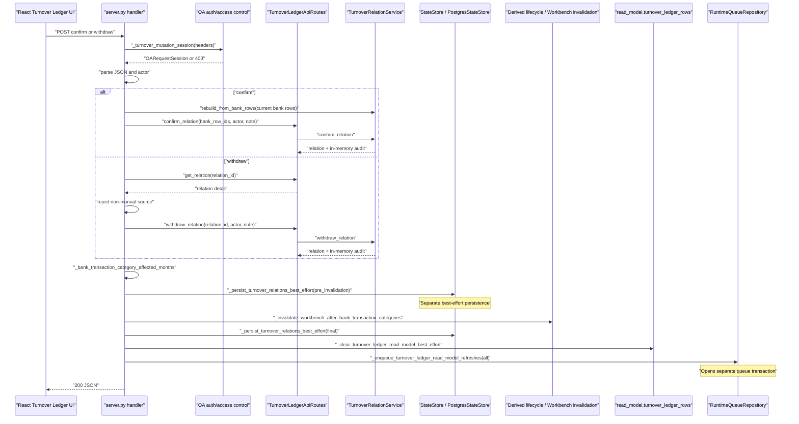
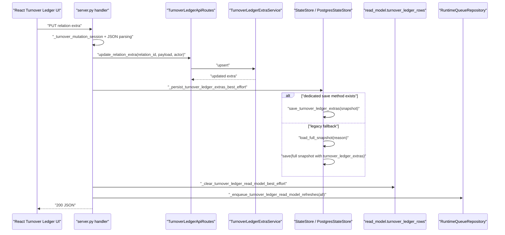
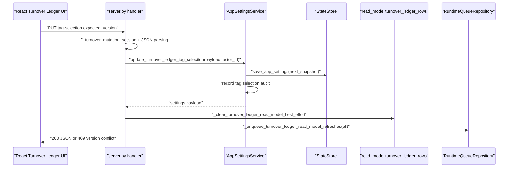
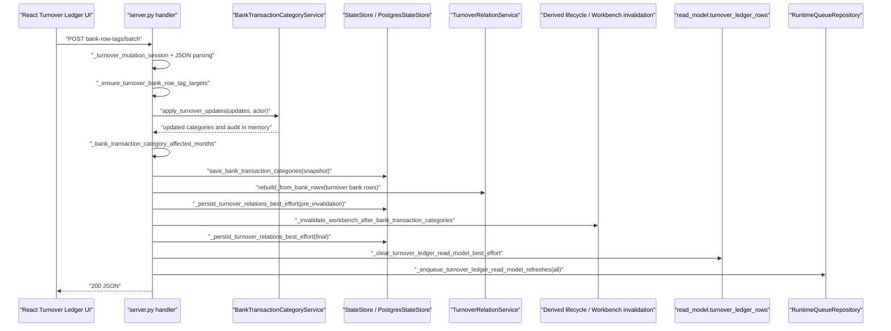
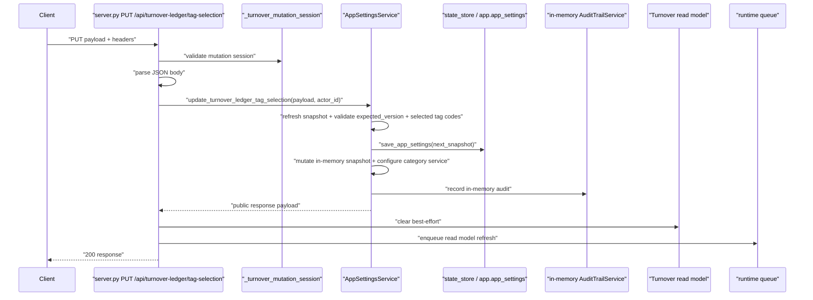
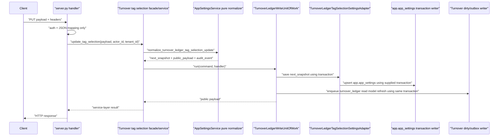

# Turnover Ledger Write Path and UoW Boundary Plan

对应 prompt：`PF-P051 - Turnover Ledger Write Path Discovery and UoW Boundary Planning`

状态：PF-P051 `verified`；PF-P052 `verified`；PF-P053 `verified`；PF-P054 `verified`

## Scope

本文件只记录 Turnover Ledger 写路径 discovery/planning。PF-P051 未修改 production code、tests、SQL migration、worker、frontend、deployment 或生产配置。

目标是为后续 Turnover Ledger 写路径重构建立事实源：

- 哪些 API 写 Turnover / Bankdetail / settings facts；
- 哪些 side effects 现在由 `server.py` 编排；
- 哪些步骤不在同一个 PostgreSQL transaction 中；
- 未来 `TurnoverLedgerWriteUnitOfWork` 必须包住哪些 facts、audit、dirty scope、outbox 和 source version；
- 下一步应该先补哪些 characterization / contract tests。

## CodeGraph And Source Coverage

PF-P051 使用 CodeGraph 覆盖了以下写路径入口和后置副作用：

- `_handle_api_turnover_ledger_confirm`
- `_handle_api_turnover_ledger_withdraw`
- `_handle_api_turnover_ledger_relation_extra_update`
- `_handle_api_turnover_ledger_tag_selection_update`
- `_handle_api_turnover_ledger_bank_row_tags_batch`
- `_after_turnover_relation_mutation`
- `_persist_turnover_relations_best_effort`
- `_persist_turnover_ledger_extras_best_effort`
- `_clear_turnover_ledger_read_model_best_effort`
- `_enqueue_turnover_ledger_read_model_refreshes`

关键源码事实：

- `server.py` 的 Turnover 写 handler 仍负责 auth/session、body parsing、业务 service 调用、state store persistence、read model clear 和 runtime queue enqueue。
- `TurnoverLedgerApiRoutes` 仍是 read/write 混合 facade：read-side 已被 `TurnoverLedgerReadFacade` 包住，但 write methods 仍直接委托 `TurnoverRelationService` 和 extra service。
- `RuntimeQueueRepository.enqueue_read_model_refresh_in_transaction()` 已具备 transaction-bound dirty scope + outbox primitive。
- 当前 `server.py` 调用的是 `_enqueue_turnover_ledger_read_model_refreshes()`，该 helper 走 queue repository 的非事务 `enqueue_read_model_refresh()` wrapper。
- `PostgresStateStore.save_turnover_relations()` 会写 repository 并保存 snapshot，`PostgresWorkbenchRepository.save_turnover_relations()` 自己开启 transaction。
- `PostgresWorkbenchRepository.save_turnover_ledger_extras()` 当前逐条 execute，没有被 Turnover 写 handler 的外层 transaction 包住。
- `_persist_turnover_ledger_extras_best_effort()` 在缺少 dedicated store method 时会调用 legacy full snapshot fallback。

## Write API Matrix

| API | Handler | Core service/usecase | Persistence today | Audit today | Dirty/outbox today | Cross-module influence | Current tests | Risk |
| --- | --- | --- | --- | --- | --- | --- | --- | --- |
| `PUT /api/turnover-ledger/tag-selection` | `_handle_api_turnover_ledger_tag_selection_update` | `AppSettingsService.update_turnover_ledger_tag_selection` | `state_store.save_app_settings()` inside app settings service | `_record_turnover_ledger_tag_selection_audit()` inside app settings service | After service returns: clear Turnover read model best-effort, enqueue `turnover_ledger.read_model.refresh` | Changes selected tags used by Turnover source_versions and query filtering | `test_turnover_ledger_tag_selection_get_put_and_version_conflict` | High. Settings fact/audit and read model dirty/outbox are split. |
| `POST /api/turnover-ledger/bank-row-tags/batch` | `_handle_api_turnover_ledger_bank_row_tags_batch` | `BankTransactionCategoryService.apply_turnover_updates`; `TurnoverRelationService.rebuild_from_bank_rows` | `state_store.save_bank_transaction_categories()` then `_after_turnover_relation_mutation()` persists turnover relations | Bank category audit inside category service; Turnover relation audit from rebuild/manual relations snapshot | `_after_turnover_relation_mutation()` clears read model and enqueues refresh after Bankdetail write | Writes Bankdetail facts, triggers Workbench invalidation, rebuilds Turnover relations | `test_turnover_bank_row_tag_batch_save_updates_category_and_reflects_to_bank_details`; invalid target side-effect test | Critical. It is a Turnover API writing Bankdetail facts plus Turnover relation/read-model side effects across separate boundaries. |
| `PUT /api/turnover-ledger/relations/{id}/extra` | `_handle_api_turnover_ledger_relation_extra_update` | `TurnoverLedgerApiRoutes.update_relation_extra`; `TurnoverLedgerExtraService.upsert` | `_persist_turnover_ledger_extras_best_effort()` | Extra payload has `updated_by`/`updated_at`, but no dedicated append-only audit table | Clear Turnover read model best-effort, enqueue refresh | Affects Turnover read model/source_versions; no Workbench invalidation | `test_relation_extra_get_returns_default_structure_and_put_persists`; legacy fallback test; invalid/readonly tests | High. Extra fact persistence and dirty/outbox are split; legacy full snapshot fallback remains. |
| `POST /api/turnover-ledger/relations/confirm` | `_handle_api_turnover_ledger_confirm` | `TurnoverRelationService.rebuild_from_bank_rows`; `TurnoverLedgerApiRoutes.confirm_relation`; `TurnoverRelationService.confirm_relation` | `_after_turnover_relation_mutation()` persists Turnover relation snapshot twice | `TurnoverRelationService.confirm_relation()` appends audit in memory, persisted through relation snapshot | `_after_turnover_relation_mutation()` clears read model and enqueues refresh | Workbench invalidation via `bank_transaction_category_changed` lifecycle | service tests and `test_confirm_and_withdraw_require_mutation_permission_and_write_audit` | High. Relation facts/audit and dirty/outbox not one transaction; no explicit expected relation version. |
| `POST /api/turnover-ledger/relations/{id}/withdraw` | `_handle_api_turnover_ledger_withdraw` | `TurnoverLedgerApiRoutes.get_relation`; handler source check; `TurnoverRelationService.withdraw_relation` | `_after_turnover_relation_mutation()` persists Turnover relation snapshot twice | `TurnoverRelationService.withdraw_relation()` appends audit in memory, persisted through relation snapshot | `_after_turnover_relation_mutation()` clears read model and enqueues refresh | Workbench invalidation via affected bank row months | service tests, API permission/audit test, system relation reject test | High. No explicit expected relation version; duplicate withdraw can increment version again unless later tests prove otherwise. |

## Runtime Sequence

### Confirm / Withdraw

### Relation Extra PUT

### Tag Selection PUT

### Bank Row Tags Batch

## Transaction / Outbox / Dirty Scope Audit

| Write path | Facts/audit same transaction? | Dirty scope/outbox same transaction? | Current split point | Failure mode |
| --- | --- | --- | --- | --- |
| Tag selection PUT | Partially. Settings save and audit are inside `AppSettingsService`, but not bound to Turnover refresh enqueue. | No. Read model clear and queue enqueue happen after service returns. | `update_turnover_ledger_tag_selection()` returns before clear/enqueue. | Settings update succeeds but read model refresh enqueue fails, leaving stale Turnover view. |
| Bank row tags batch | No. Bankdetail category facts are saved before relation rebuild/finalizer. | No. Queue enqueue happens after category save and relation persistence. | `save_bank_transaction_categories()` precedes `rebuild_from_bank_rows()` and `_after_turnover_relation_mutation()`. | Bankdetail facts change but relation rebuild or refresh enqueue fails, causing Turnover/Workbench divergence. |
| Relation extra PUT | No dedicated audit; extra fact persistence is best-effort. | No. Read model clear/enqueue happen after best-effort persistence. | `_persist_turnover_ledger_extras_best_effort()` can swallow exceptions. | API may return success after in-memory extra update while persistence or refresh silently fails. |
| Confirm relation | No explicit outer transaction. Relation and audit mutate in memory, then snapshot persistence is best-effort. | No. Clear/enqueue happen after best-effort persistence. | `_after_turnover_relation_mutation()` runs multiple independent side effects. | Relation fact/audit may persist without outbox, or Workbench invalidation may run between two relation snapshot saves. |
| Withdraw relation | Same as confirm. | Same as confirm. | Same finalizer. | Withdraw fact may persist without refresh; duplicate withdraw may increment version again without stale precondition. |

Runtime queue already has the primitive needed for the target model: `enqueue_read_model_refresh_in_transaction()` writes dirty scope and outbox in one transaction. The blocker is that Turnover write handlers do not own a transaction that also includes the facts/audit writes.

## UoW Readiness Assessment

Future `TurnoverLedgerWriteUnitOfWork` must eventually make the following writes atomic where a single API changes them:

- Turnover relation facts in `app.turnover_relations`.
- Turnover relation audit in `app.turnover_relation_events`.
- Turnover relation extras in `app.turnover_ledger_extras`.
- App setting mutation for `turnover_ledger_tag_selection` and its audit record, or a dedicated port that can join the same transaction.
- Bankdetail category facts and category audit for `bank-row-tags/batch`, through an explicit Bankdetail port.
- Workbench invalidation influence caused by bank category changes, either as transaction-bound dirty/outbox or a clearly separate downstream event.
- Turnover read model dirty scope and `job.outbox_events`.
- Source version / expected version contract for relation snapshot, extras, tag selection and bank categories.

Current blockers:

- `server.py` owns the orchestration and passes no transaction object through the write paths.
- `PostgresStateStore.save_turnover_relations()` delegates to repository and snapshot save as separate operations.
- `PostgresWorkbenchRepository.save_turnover_relations()` has its own transaction wrapper, so it cannot currently join a higher-level Turnover UoW.
- `save_turnover_ledger_extras()` is not clearly transaction-bound to dirty/outbox.
- Tag selection lives in `AppSettingsService`, not a Turnover-specific repository/port.
- `bank-row-tags/batch` is a Turnover API but writes Bankdetail facts.
- `_clear_turnover_ledger_read_model_best_effort()` deletes read model rows outside the target dirty/outbox transaction and swallows failures.
- `confirm`/`withdraw` do not take expected relation versions from the client.

Do not implement UoW until the tests below are added and the repository/port ownership is made explicit.

## PF-P052 Test Slice

`PF-P052 - Turnover Ledger Write Path Characterization Tests` has been generated and reviewed.

PF-P052 remained test-only and locked current duplicate/stale/failure behavior for:

- tag selection PUT;
- bank-row-tags batch;
- relation extra PUT;
- confirm relation;
- withdraw relation.

PF-P052 did not implement `TurnoverLedgerWriteUnitOfWork`, migrate handlers, change repository semantics, change runtime queue behavior, or modify production configuration.

PF-P052 added API-level characterization tests proving:

- tag selection PUT saves settings and clears the read model before queue failure propagates;
- bank-row-tags batch saves Bankdetail category facts before queue failure propagates, and the attempted queue sequence includes Bankdetail/Workbench/Turnover scopes;
- relation extra persistence failure is currently best-effort success and still refreshes;
- confirm relation snapshot persistence failure is currently best-effort success and still refreshes;
- duplicate confirm currently rejects with `relation_row_conflict`;
- duplicate withdraw currently succeeds again, appends a second withdraw audit entry, and refreshes again.

## Idempotency / Stale Write / Conflict Baseline

| Write path | Duplicate submit today | Stale write today | Existing conflict primitive | Gap |
| --- | --- | --- | --- | --- |
| Tag selection PUT | Same old `expected_version` returns 409 after first success. | Has optimistic version via `expected_version`/`version`. | `turnover_ledger_tag_selection_version_conflict` maps to 409. | Need tests that refresh enqueue failure does not leave silent success once UoW is introduced. |
| Bank row tags batch | Same payload with old expected row version returns 409 after version increment; same payload with current version may be treated as no-op by category service. | Has per-row category `expected_version`. | `category_version_conflict` maps to 409. | Need tests for atomicity across Bankdetail save, relation rebuild, Workbench invalidation and Turnover enqueue. |
| Relation extra PUT | Repeating same payload updates `updated_at`/`updated_by` sequencing through extra service; no expected extra version. | No expected version in API. | Validation errors map to 400; no stale conflict. | Need characterization of duplicate extra PUT and a future version contract. |
| Confirm relation | Duplicate confirm of active syncable rows is rejected by relation service as row conflict. | No expected relation/read model version. Handler rebuilds from current bank rows before confirm. | `TurnoverRelationValidationError` maps to 400, not 409. | Need API-level duplicate/stale tests and decision whether stale relation conflicts should become 409 later. |
| Withdraw relation | Current service can withdraw a relation by id and increments version; no expected version. Existing tests only cover manual source success and system source rejection. | No expected relation version. | Unknown relation maps to 404; validation maps to 400. | Need duplicate withdraw and stale version tests before migration. |

## Repository Ownership And Coupling Audit

Current coupling:

- HTTP/session parsing is in `server.py`, which is acceptable only as app boundary.
- Business orchestration is also in `server.py`, which is not acceptable long term.
- `TurnoverLedgerApiRoutes` mixes read-only and write methods. Read-side is now behind `TurnoverLedgerReadFacade`, but write-side still lacks a write facade/service.
- Turnover relation persistence lives in `services/postgres_repositories/workbench.py`, which obscures ownership.
- Bankdetail category mutation is invoked directly through `BankTransactionCategoryService`.
- Settings mutation is invoked directly through `AppSettingsService`.
- Runtime queue access is through `_runtime_repositories.queue_repository`, but from `server.py`.
- Legacy full snapshot fallback remains for extras.

Future ownership target:

- `server.py`: auth/session, request/response mapping, dependency assembly, error mapping only.
- `TurnoverLedgerWriteFacade` or equivalent app-level write service: command normalization and call into Turnover write usecase/UoW with granular dependencies.
- Turnover repository port: relation facts, relation audit and extras persistence.
- Bankdetail port: category update facts/audit for `bank-row-tags/batch`.
- Settings port: tag selection update with version contract.
- Platform runtime/outbox port: transaction-bound dirty scope + outbox using `enqueue_read_model_refresh_in_transaction()`.
- Workbench influence: explicit downstream event or platform dirty scope, not ad hoc `server.py` lifecycle calls.

## Test Gap Matrix

| Area | Existing coverage | Missing before UoW implementation | Recommended test type |
| --- | --- | --- | --- |
| Tag selection PUT | Version conflict, invalid tag, queue enqueue on success; PF-P052 locks queue failure after settings save/read model clear. | Atomic target contract for settings + dirty/outbox. | Future UoW/contract tests. |
| Bank row tags batch | Success updates Bankdetail and response flags; invalid non-turnover rows have no refresh side effects; PF-P052 locks queue failure after Bankdetail category save and derived refresh attempts. | Duplicate/current-version behavior; Workbench invalidation atomicity target contract. | Future UoW/contract tests. |
| Relation extra PUT | GET default, PUT persists, reload works, invalid payload, readonly rejection, legacy fallback; PF-P052 locks persistence failure as best-effort success. | Duplicate extra PUT behavior; stale extra version target contract. | Future UoW/contract tests. |
| Confirm relation | Service-level confirm validation/audit; API permission/audit/enqueue success; PF-P052 locks duplicate confirm and relation persistence failure behavior. | Enqueue failure after relation persist; future expected version behavior. | Future UoW/contract tests. |
| Withdraw relation | Service-level withdraw audit; API permission/audit success; system relation rejection; PF-P052 locks duplicate withdraw currently succeeding and re-enqueueing. | Stale relation version behavior; persistence/enqueue failure split target contract. | Future UoW/contract tests. |
| Dirty scope/outbox | RuntimeQueue repository has transaction-bound primitive. | Turnover write path does not use transaction-bound primitive. | Future contract tests after characterization. |
| Repository ownership | Existing repository methods persist relation/extras. | No Turnover-specific transaction-bound repository port. | Planning/design then contract tests. |

## Next Slice Recommendation

PF-P052 已完成。下一条 prompt 应该是：

`PF-P053 - Turnover Ledger Write UoW Contract Tests`

原因：

- 当前行为已经被 PF-P052 的 API-level characterization tests 锁定。
- 下一步不应直接迁移真实写 API；应先定义目标 UoW 契约，明确哪些行为需要从当前 best-effort / split side effects 收敛为 transaction-bound facts/audit/dirty/outbox。
- PF-P053 应聚焦 contract tests / expected failures / fake repository ports，不改真实 handler 语义。

不建议下一步直接实现 UoW。

## PF-P053 Contract Test Slice

`PF-P053 - Turnover Ledger Write UoW Contract Tests` has been generated, reviewed and executed.

PF-P053 created target contract tests before any production UoW implementation. The contract tests preserve future expectations for:

- transaction-bound relation facts + relation audit + dirty scope + outbox;
- rollback when dirty scope / outbox fails;
- duplicate withdraw and stale expected version conflict target semantics;
- relation extra write atomicity instead of best-effort success;
- tag selection write atomicity instead of settings save before queue failure;
- bank-row-tags batch explicit Bankdetail port / transaction-bound downstream event boundary;
- granular UoW dependencies without `Application` god object, HTTP headers/cookies or `app.auth`.

PF-P053 uses `unittest.expectedFailure` for target contracts that cannot pass before the minimal UoW skeleton exists. Default CI remains green, while unexpected success should signal that a contract has become implemented.

PF-P053 added `tests/test_turnover_ledger_uow_contract.py` with 7 expected failures:

- confirm relation commits relation facts, audit, dirty scope and outbox in one transaction;
- confirm relation outbox failure rolls back relation facts/audit;
- withdraw relation rejects stale or duplicate submit before the handler runs;
- relation extra outbox failure does not return best-effort success;
- tag selection outbox failure rolls back settings save/audit;
- bank-row-tags batch uses an explicit Bankdetail port and rolls back on outbox failure;
- UoW constructor requires granular ports and rejects `Application` god object injection.

Next slice recommendation:

`PF-P054 - Turnover Ledger Minimal UoW Skeleton`

PF-P054 should introduce the smallest `TurnoverLedgerWriteUnitOfWork.run(command, handler)` skeleton needed to start turning these contract tests green with fake/in-memory ports. PF-P054 must not migrate real Turnover Ledger write APIs.

## PF-P054 Minimal Skeleton Slice

`PF-P054 - Turnover Ledger Minimal UoW Skeleton` has been generated, reviewed and executed.

PF-P054 added only the minimal production skeleton needed by `tests/test_turnover_ledger_uow_contract.py`:

- `backend/src/fin_ops_platform/services/turnover_ledger_write_uow.py`;
- `TurnoverLedgerWriteUnitOfWork`;
- `run(command, handler)`;
- transaction context creation;
- stale precondition port call before handler;
- handler context exposing transaction and granular ports;
- transaction-bound dirty/outbox writer call after handler;
- no `Application` god object constructor.

PF-P054 did not connect the skeleton to `server.py` or any real Turnover Ledger API.

Verification:

- `PYTHONPATH=backend/src python3 -m unittest tests.test_turnover_ledger_uow_contract -v`：Pass，7 tests。
- `PYTHONPATH=backend/src python3 -m unittest tests.test_turnover_ledger_api -v`：Pass，27 tests。

Next slice recommendation:

`PF-P054-MG - Turnover Ledger Write UoW Foundation Cumulative Merge Gate`

This MG should cover PF-P051 through PF-P054 before migrating real Turnover Ledger write APIs.

## Real API Integration Plan

对应 prompt：`PF-P055 - Turnover Ledger Write Facade / UoW Integration Planning`

状态：`implemented`

PF-P055 only plans the real API integration path. It does not modify production code, tests, handlers, repositories, runtime queue, worker, SQL migrations, frontend, deployment or production configuration.

### Integration Principles

- Keep `server.py` as HTTP/session/body parsing, dependency assembly, response mapping and error mapping only.
- Do not call `TurnoverLedgerWriteUnitOfWork` directly from many handlers long term. Introduce a small `TurnoverLedgerWriteFacade` first so handler migration remains thin and reversible.
- Do not inject `Application` into the facade or UoW.
- Keep granular dependencies: relation service/repository port, extra repository port, settings port, Bankdetail port, stale precondition port, dirty/outbox writer.
- Keep PF-P052 characterization tests unchanged until a specific migration prompt intentionally changes behavior and updates target tests.
- Do not mix all write APIs in one prompt. Migrate one low-risk entry first, then continue by risk.

### Readiness Matrix

| API | Current handler responsibility | Target facade/usecase responsibility | Needed granular dependencies / ports | Current test baseline | UoW readiness | Risk | Recommendation |
| --- | --- | --- | --- | --- | --- | --- | --- |
| `PUT /api/turnover-ledger/relations/{id}/extra` | Auth/session, JSON parsing, calls `TurnoverLedgerApiRoutes.update_relation_extra`, best-effort extra persistence, read model clear, refresh enqueue, response flag. | `TurnoverLedgerWriteFacade.update_relation_extra(command)` should validate command, call extra service/repository inside UoW, enqueue dirty/outbox transaction-bound, return payload for handler mapping. | Extra repository port; relation existence reader; dirty/outbox writer; optional stale precondition for future extra version. | PF-P052 locks success, invalid, readonly, legacy fallback and persistence failure best-effort behavior. | Highest readiness. It only changes Turnover extra facts and Turnover read model refresh; no Bankdetail/Workbench lifecycle. | Medium. Current persistence failure is best-effort success, target UoW will later change failure semantics. | First real integration candidate, but next prompt should add facade-level tests before production wiring. |
| `POST /api/turnover-ledger/relations/confirm` | Auth/session, JSON parsing, rebuilds relations from bank rows, calls route confirm, computes affected months, runs `_after_turnover_relation_mutation`. | Facade should build confirm command, use relation service inside UoW, persist relation facts/audit, enqueue Turnover dirty/outbox and explicitly handle Workbench/Bankdetail influence. | Relation repository port; relation service; bank row provider; affected month provider; stale precondition; dirty/outbox writer; Workbench influence port. | PF-P052 locks success, duplicate confirm, persistence failure best-effort, audit and refresh. | Partial. Minimal UoW exists, but no real relation repository adapter or Workbench influence port. | High. Current `_after_turnover_relation_mutation` persists twice and triggers cross-module lifecycle. | Do after relation extra facade and after relation repository/Workbench influence contract tests. |
| `POST /api/turnover-ledger/relations/{id}/withdraw` | Auth/session, JSON parsing, loads relation detail, blocks non-manual source in handler, calls route withdraw, computes affected months, runs `_after_turnover_relation_mutation`. | Facade should own manual-source precondition, stale expected version precondition, withdraw mutation, relation facts/audit persistence and dirty/outbox. | Relation detail reader; relation repository port; relation service; stale precondition; dirty/outbox writer; Workbench influence port. | PF-P052 locks system relation reject and current duplicate withdraw success/re-enqueue behavior. | Partial. UoW stale precondition primitive exists, but API does not expose expected relation version yet. | High. Target behavior should reject duplicate/stale withdraw, changing current behavior. | Do after planning expected version contract and response compatibility. |
| `PUT /api/turnover-ledger/tag-selection` | Auth/session, JSON parsing, calls `AppSettingsService.update_turnover_ledger_tag_selection`, clears read model, enqueues refresh. | Facade should call settings port inside transaction and enqueue Turnover dirty/outbox in same boundary. | Settings port with transaction support; settings audit port; dirty/outbox writer. | PF-P052 locks version conflict and queue failure after settings save. | Partial. Needs settings service/repository transaction seam. | High. Crosses Platform/Settings boundary and target semantics change current save-before-queue behavior. | Do after a Settings port contract prompt. |
| `POST /api/turnover-ledger/bank-row-tags/batch` | Auth/session, JSON parsing, validates target rows, calls BankTransactionCategoryService, saves Bankdetail categories, rebuilds Turnover relations, runs `_after_turnover_relation_mutation`, sets response flags. | Facade should use explicit Bankdetail port for category facts/audit, relation rebuild port, Turnover dirty/outbox and downstream influence event in one defined transaction boundary. | Bankdetail port; bank row effective category provider; relation service/repository port; Workbench influence port; dirty/outbox writer; stale/current-version port. | PF-P052 locks success, invalid target, queue failure after Bankdetail save and derived refresh attempts. | Lowest. Cross-module Bankdetail and Workbench influence are not yet ported. | Critical. Turnover API writes Bankdetail facts and triggers multiple downstream scopes. | Last among these write APIs. Needs Bankdetail port design and cross-module event contract first. |

### Recommended Migration Order

1. `relation extra PUT` facade-level tests and thin write facade extraction.
2. `relation extra PUT` minimal UoW wiring, preserving current API response shape while moving dirty/outbox behind UoW.
3. Relation repository port design for confirm/withdraw facts and audit.
4. Confirm relation facade/UoW integration.
5. Withdraw expected relation version contract and duplicate/stale conflict migration.
6. Settings port contract for tag selection.
7. Bankdetail port and downstream influence contract for bank-row-tags batch.

### Next Prompt Recommendation

`PF-P056 - Turnover Ledger Relation Extra Write Facade Tests`

PF-P056 should be test-only or facade-test-only. It should add tests for a future `TurnoverLedgerWriteFacade.update_relation_extra()` using fake granular dependencies and the existing `TurnoverLedgerWriteUnitOfWork`. It should not change `server.py` or the real API.

## PF-P056 Relation Extra Write Facade Test Plan

状态：`verified`

PF-P056 只锁定未来 `TurnoverLedgerWriteFacade.update_relation_extra()` 的目标契约，不迁移真实 handler。

测试边界：

- 使用 fake transaction connection、fake extra write port、fake dirty/outbox writer 和 fake stale precondition port。
- 验证 facade 不接收 `Application` god object。
- 验证 relation extra write 与 Turnover dirty/outbox enqueue 在同一 UoW transaction 内完成。
- 验证 dirty/outbox failure 会回滚 extra write，而不是沿用当前 best-effort success。
- 验证 command/result 不携带 HTTP cookie/header、HTTP response object 或 `app.auth` 依赖。

如果 production facade 尚不存在，PF-P056 可以用 `unittest.expectedFailure` 保留目标契约并保持默认 CI 绿色；下一步 PF-P057 应实现最小 `TurnoverLedgerWriteFacade` 并将这些 tests 转绿。

PF-P056 execution result:

- Added 4 target contract tests for future `TurnoverLedgerWriteFacade.update_relation_extra()`.
- The 4 tests are explicit `unittest.expectedFailure` because the production facade does not exist yet.
- Default targeted CI remains green:
  - `tests.test_turnover_ledger_uow_contract` passes with 4 expected failures.
  - `tests.test_turnover_ledger_api` still passes.

PF-P057 recommended implementation:

- Add the smallest `backend/src/fin_ops_platform/services/turnover_ledger_write_facade.py`.
- Implement `TurnoverLedgerWriteFacade.update_relation_extra()` against the existing `TurnoverLedgerWriteUnitOfWork`.
- Remove the 4 PF-P056 `expectedFailure` decorators only when the facade implementation makes them pass as ordinary tests.
- Do not wire the facade into `server.py` yet.

## PF-P057 Relation Extra Write Facade Implementation Plan

状态：`verified`

PF-P057 should implement the smallest service-layer facade needed to turn the PF-P056 target tests green:

- `TurnoverLedgerWriteFacade.__init__(uow=...)`;
- `TurnoverLedgerWriteFacade.update_relation_extra(relation_id, payload, actor_id, tenant_id, scope_keys)`;
- no `Application` injection;
- no HTTP cookie/header/session parsing;
- no `server.py` wiring;
- no real API behavior change.

The facade should treat relation extra write as a service command and rely on `TurnoverLedgerWriteUnitOfWork` for transaction scope and dirty/outbox enqueue.

PF-P057 execution result:

- Added `backend/src/fin_ops_platform/services/turnover_ledger_write_facade.py`.
- Implemented minimal `TurnoverLedgerWriteFacade.update_relation_extra()`.
- Removed the 4 PF-P056 `expectedFailure` decorators; all facade contract tests now pass as ordinary tests.
- Did not wire the facade into `server.py`.

PF-P058 recommended direction:

- Characterize the real `PUT /api/turnover-ledger/relations/{id}/extra` handler integration boundary before wiring.
- Keep scope limited to relation extra; do not migrate confirm, withdraw, tag selection or bank-row-tags.

## PF-P058 Relation Extra Handler Integration Characterization Plan

状态：`verified`

PF-P058 should lock the current real handler behavior before `server.py` delegates relation extra writes to the new facade.

The highest-risk missing characterization is refresh queue failure:

- current handler writes relation extra through `TurnoverLedgerApiRoutes.update_relation_extra()`;
- then persists extras best-effort;
- then clears the Turnover read model;
- then enqueues `turnover_relation_extra_changed`;
- if enqueue fails, the exception propagates after the extra has already been updated in memory.

PF-P058 should add a targeted API test for that behavior. It must not wire the facade into `server.py`.

PF-P058 execution result:

- Added a targeted API characterization test for relation extra refresh queue failure.
- Locked the current order: extra update, best-effort persistence, read model clear, enqueue attempt, then propagated queue failure.
- Confirmed the extra remains readable after the queue failure, matching current non-atomic behavior.

PF-P059 recommended direction:

- First audit whether real transaction/repository/dirty-outbox adapters exist for relation extra handler wiring.
- Do not wire `server.py` to the facade if doing so would require fake/no-op production transactions.
- Preserve current API response shape and existing characterization tests unless a later prompt explicitly documents an intentional semantic change.
- Do not migrate confirm, withdraw, tag selection or bank-row-tags.

## PF-P059 Relation Extra Handler Wiring Readiness Plan

状态：`verified`

PF-P059 should verify that the runtime has real adapters before relation extra handler wiring:

- PostgreSQL transaction connection usable by `TurnoverLedgerWriteUnitOfWork`;
- relation extra repository adapter;
- transaction-bound dirty/outbox writer adapter;
- row/detail provider for preserving `row` response shape.

If any of these are missing, the next prompt should build the missing adapter or contract tests first. It must not introduce a fake/no-op production transaction just to wire the handler.

## PF-P059 Relation Extra Handler Wiring Readiness

状态：`verified`

PF-P059 审计结论：**不允许下一步直接把真实 relation extra handler 接到 facade**。原因不是 facade 不可用，而是 production adapter 边界还不完整；直接 wiring 容易制造假的一致性边界或破坏当前 response shape。

### Current Runtime Facts

| Boundary | Current fact | Reuse status | Risk |
| --- | --- | --- | --- |
| PostgreSQL transaction connection | `Application` 已能从 PostgreSQL `state_store._connection` 获取 `PostgresConnection`；Workbench confirm/cancel UoW 已用同一模式在 `_workbench_confirm_link_unit_of_work()` / `_workbench_cancel_link_unit_of_work()` 中创建 UoW。 | 可复用模式。 | 仅在 PostgreSQL runtime 可用；非 PostgreSQL runtime 必须保持 legacy path 或返回 no UoW。 |
| Transaction primitive | `PostgresConnection.transaction()` 返回 `PostgresTransaction`，可传给 repository。 | 可复用。 | 不能在 production path 使用 fake/no-op transaction。 |
| Relation extra facts repository | `PostgresWorkbenchRepository(transaction)` 已有 `save_turnover_ledger_extras(snapshot)`，但没有 `save_extra(extra, transaction=...)` port。 | 部分可复用。 | 当前 API facade contract 需要细粒度 `save_extra` port；直接保存整份 snapshot 会继续耦合 legacy full snapshot shape。 |
| Dirty/outbox writer | `services.workbench_uow.RuntimeQueueReadModelRefreshWriter` 已包装 `queue_repository.enqueue_read_model_refresh_in_transaction(...)`，但接口是 singular `scope_key`；`TurnoverLedgerWriteUnitOfWork` 当前需要 `enqueue_refresh(..., scope_keys=[...], payload=...)`。 | 可复用思想，不能直接注入。 | 需要 Turnover-specific writer adapter，把 scope_keys 展开为 transaction-bound queue rows，并保留 source_version/outbox 语义。 |
| Existing runtime queue repository | `runtime_queue.py` 提供 `enqueue_read_model_refresh_in_transaction`。 | 可复用。 | 需要 adapter contract tests，避免回退到非 transaction `enqueue_read_model_refresh`。 |
| Response row shape | `TurnoverLedgerApiRoutes.update_relation_extra()` 当前通过 `ledger_service.get_relation_detail()` 取 row，并合并 `_row_extra_fields(extra)` 后返回 `{"extra": extra, "row": row}`。 | 需要抽成 row/detail provider 或保留 routes helper。 | 直接使用当前 facade 会只返回 `{"extra": extra}`，破坏 API response。 |

### Missing Adapter Checklist

- `TurnoverLedgerExtraRepositoryPort.save_extra(extra, *, transaction)`：
  - 应优先用 `PostgresWorkbenchRepository(transaction)` 或更窄的 Turnover repository adapter 实现；
  - 不应要求业务 facade 保存整份 full snapshot。
- `TurnoverLedgerDirtyOutboxWriter`：
  - 应包装 `queue_repository.enqueue_read_model_refresh_in_transaction(...)`；
  - 必须拒绝缺少 transaction-bound enqueue 的 queue repository；
  - 不得调用非事务 `enqueue_read_model_refresh`。
- `TurnoverLedgerRelationRowProvider`：
  - 提供 `row_for_relation_extra(relation_id, extra)` 或等价方法，保持当前 `row` response shape；
  - 不让 facade 读取 HTTP 或依赖 `Application`。

### Wiring Decision

下一步不应直接执行 `PF-P060 - Handler Minimal Wiring`。正确下一步是先建立 Turnover-specific adapter contract/skeleton：

`PF-P060 - Turnover Ledger Relation Extra Repository and Dirty Outbox Adapter Contracts`

PF-P060 应只添加 fake/contract tests 和最小 adapter skeleton，验证：

- adapter 只接受真实 transaction；
- writer 调用 transaction-bound queue enqueue；
- relation extra repository 不依赖 `Application`；
- row provider 可保持现有 response shape；
- 不修改 `server.py`。

## PF-P060 Relation Extra Adapter Contract Plan

状态：`verified`

PF-P060 should add minimal adapter contracts and skeletons:

- `TurnoverLedgerExtraRepositoryAdapter.save_extra(extra, transaction=tx)`;
- `TurnoverLedgerDirtyOutboxWriter.enqueue_refresh(transaction=tx, scope_type, scope_keys, reason, payload)`;
- no `Application` injection;
- no fake/no-op production transaction;
- no `server.py` wiring.

The adapter should reuse existing repository and runtime queue capabilities:

- repository side should delegate to a transaction-bound repository factory, initially compatible with `PostgresWorkbenchRepository(transaction).save_turnover_ledger_extras(...)`;
- dirty/outbox side should require `queue_repository.enqueue_read_model_refresh_in_transaction(...)` and must not fallback to non-transaction enqueue.

PF-P060 execution result:

- Added `TurnoverLedgerExtraRepositoryAdapter`.
- Added `TurnoverLedgerDirtyOutboxWriter`.
- Added passing contract tests for transaction-bound repository save and transaction-bound dirty/outbox enqueue.
- `server.py` remains unchanged.

Remaining gap before handler wiring:

- The facade currently returns `{"extra": extra}`.
- The real API response currently returns `{"extra": extra, "row": row, "turnover_ledger_invalidated": true}` after handler mapping.
- PF-P061 should define a row provider / response composer boundary before `server.py` wiring.

## PF-P061 Relation Extra Row Provider Contract Plan

状态：`verified`

PF-P061 should add a narrow row provider boundary to `TurnoverLedgerWriteFacade`:

- optional `row_provider`;
- provider receives `relation_id` and normalized `extra`;
- facade result includes `row` only when provider is present;
- no `Application`, HTTP headers/cookies or `app.auth` dependency.

This preserves the current API response shape without pushing row composition back into `server.py`.

PF-P061 execution result:

- `TurnoverLedgerWriteFacade` now accepts optional `row_provider`.
- When present, `update_relation_extra()` returns `{"extra": extra, "row": row}`.
- Existing no-provider behavior remains `{"extra": extra}`.
- `server.py` remains unchanged.

Next step:

- `PF-P062 - Turnover Ledger Relation Extra Normalization Boundary Contract`, because direct handler wiring would currently save raw payload and bypass existing `TurnoverLedgerExtraService` validation/defaulting semantics.

## PF-P062 Relation Extra Normalization Boundary Plan

状态：`verified`

PF-P062 corrected the handler-wiring plan before execution:

- direct handler wiring was rejected because `TurnoverLedgerWriteFacade.update_relation_extra()` saved raw payload, while the legacy API normalizes/validates relation extra data before persistence;
- `TurnoverLedgerWriteFacade` now accepts a narrow `extra_normalizer` callable;
- facade saves the normalized extra, returns the normalized extra, and passes normalized data to the optional row provider;
- normalization failures prevent UoW execution, repository save and dirty/outbox enqueue.

Verification:

- `PYTHONPATH=backend/src python3 -m unittest tests.test_turnover_ledger_uow_contract -v`: Pass, 19 tests.
- `PYTHONPATH=backend/src python3 -m unittest tests.test_turnover_ledger_api -v`: Pass, 28 tests.

Remaining gap before handler wiring:

- The production handler still needs a pure relation extra normalizer that reuses existing `TurnoverLedgerExtraService` validation/defaulting rules without mutating in-memory state before the PostgreSQL transaction succeeds.
- Do not wire `server.py` by calling `TurnoverLedgerExtraService.upsert()` inside the facade normalizer; that would create non-transactional in-memory side effects before the UoW commits.

Next step:

- Generate and execute `PF-P063 - Turnover Ledger Relation Extra Pure Normalizer Adapter`, or fold that exact pure-normalizer work into the next handler wiring prompt before touching `server.py`.

## PF-P063 Relation Extra Pure Normalizer Adapter Plan

状态：`verified`

PF-P063 completed the remaining handler-wiring prerequisite:

- `TurnoverLedgerExtraService.normalize_update(...)` now exposes the same validation/defaulting/formatting semantics as `upsert(...)` without mutating `self._extras`;
- `TurnoverLedgerExtraNormalizerAdapter` wraps an explicit `extra_service` dependency and can be injected into `TurnoverLedgerWriteFacade(extra_normalizer=...)`;
- facade integration can now save normalized relation extra data without calling mutating service methods before the UoW commit.

Verification:

- `PYTHONPATH=backend/src python3 -m unittest tests.test_turnover_ledger_uow_contract -v`: Pass, 22 tests.
- `PYTHONPATH=backend/src python3 -m unittest tests.test_turnover_ledger_extra_service -v`: Pass, 10 tests.
- `PYTHONPATH=backend/src python3 -m unittest tests.test_turnover_ledger_api -v`: Pass, 28 tests.

Next step:

- `PF-P064 - Turnover Ledger Relation Extra Handler Minimal Wiring`.
- PF-P064 must only wire `PUT /api/turnover-ledger/relations/{id}/extra`.
- PF-P064 must keep non-PostgreSQL / dependency-missing runtime on the legacy path.
- PF-P064 must not migrate confirm, withdraw, tag selection or bank-row-tags.

## PF-P064 Relation Extra Handler Minimal Wiring Plan

状态：`verified`

PF-P064 completed the first real Turnover Ledger write handler integration:

- `server.py` now builds a relation-extra write facade only when PostgreSQL runtime and transaction-bound queue dependencies are present;
- non-PostgreSQL and dependency-missing runtime keeps the legacy best-effort path;
- the facade path uses `TurnoverLedgerWriteFacade`, `TurnoverLedgerWriteUnitOfWork`, `TurnoverLedgerExtraRepositoryAdapter`, `TurnoverLedgerDirtyOutboxWriter`, `TurnoverLedgerExtraNormalizerAdapter`, and a narrow row provider;
- the handler still owns HTTP/session/body/error mapping;
- no other Turnover Ledger write API was migrated.

Verification:

- `PYTHONPATH=backend/src python3 -m unittest tests.test_turnover_ledger_api -v`: Pass, 29 tests.
- `PYTHONPATH=backend/src python3 -m unittest tests.test_turnover_ledger_uow_contract -v`: Pass, 22 tests.
- `PYTHONPATH=backend/src python3 -m unittest tests.test_turnover_ledger_extra_service -v`: Pass, 10 tests.

Next step:

- Generate cumulative MG `PF-P064-MG - Turnover Ledger Relation Extra UoW Cumulative Merge Gate`, covering PF-P055 through PF-P064.

## PF-P065 Tag Selection Settings Port Discovery

状态：`verified`

### Runtime Call Chain

`PUT /api/turnover-ledger/tag-selection` currently runs:

1. `Application._handle_api_turnover_ledger_tag_selection_update(...)`
   - resolves mutation session through `_turnover_mutation_session(headers)`;
   - parses JSON body;
   - derives `actor` from OA session identity.
2. `AppSettingsService.update_turnover_ledger_tag_selection(payload, actor_id=actor)`
   - refreshes settings snapshot from state store;
   - reads current `turnover_ledger_tag_selection`;
   - checks `expected_version` / `version`;
   - validates selected tag codes through `_normalize_turnover_ledger_tag_selection(...)`;
   - builds `next_snapshot`;
   - calls `state_store.save_app_settings(next_snapshot)`;
   - mutates in-memory `_snapshot`;
   - reconfigures category service;
   - records in-memory audit through `_record_turnover_ledger_tag_selection_audit(...)`;
   - returns public payload.
3. Handler post-write side effects:
   - `_clear_turnover_ledger_read_model_best_effort()`;
   - `_enqueue_turnover_ledger_read_model_refreshes(["all"], reason="turnover_ledger_tag_selection_changed")`;
   - returns `200 OK`.

### Transaction Breaks

| Boundary | Current fact | Risk |
| --- | --- | --- |
| Settings fact save | `state_store.save_app_settings(next_snapshot)` happens inside `AppSettingsService`. PostgreSQL runtime delegates to `PostgresOpsTaxEtcRepository.save_settings(...)`, which writes `app.app_settings` through `self._connection.execute(...)` without an explicit transaction parameter. | Cannot yet join `TurnoverLedgerWriteUnitOfWork` transaction without an adapter/repository seam. |
| Settings audit | `AuditTrailService.record_action(...)` is in-memory, not transaction-bound PostgreSQL audit. | Audit and settings fact can diverge from future dirty/outbox semantics. |
| Read model dirty/outbox | Handler clears read model and enqueues refresh after settings update returns. | Queue failure currently happens after settings save; existing characterization test proves settings version changes despite queue failure. |
| Optimistic version | `expected_version` mismatch raises `turnover_ledger_tag_selection_version_conflict` and maps to `409`. | Existing version contract is usable; future UoW must preserve this API shape. |

### Existing Coverage

- `test_turnover_ledger_tag_selection_get_put_and_version_conflict`
  - locks GET/PUT success, selected tag code validation, queue enqueue and version conflict.
- `test_turnover_ledger_tag_selection_queue_failure_happens_after_settings_save`
  - locks current split-brain behavior: queue failure raises, but settings save/version still changed and read model clear already happened.
- `test_tag_selection_outbox_failure_rolls_back_settings_save_and_audit`
  - UoW target contract already exists at fake port level.

### Reuse / Missing Ports

Reusable:

- `AppSettingsService._normalize_turnover_ledger_tag_selection(...)` for validation/defaulting.
- Existing version contract in `update_turnover_ledger_tag_selection(...)`.
- `TurnoverLedgerWriteUnitOfWork.settings_port` fake contract.
- `TurnoverLedgerDirtyOutboxWriter` for transaction-bound Turnover dirty/outbox.

Missing:

- A pure `normalize_turnover_ledger_tag_selection_update(...)` method that validates and returns next selection + audit metadata without mutating `_snapshot` or saving settings.
- A transaction-bound settings repository/port, for example `TurnoverLedgerTagSelectionSettingsPort.save_tag_selection(payload, transaction=...)`.
- A transaction-bound audit persistence story. If durable audit is not currently available, the next slice must explicitly keep audit as current in-memory behavior or define a follow-up durable audit port.
- A production adapter for `app.app_settings` that can save via the active transaction instead of `state_store.save_app_settings(...)`.

### Next Prompt Recommendation

Next prompt should be:

`PF-P066 - Turnover Ledger Tag Selection Characterization and Settings Port Contract Tests`

Scope:

- Add/extend tests only.
- Lock current API behavior around queue failure, version conflict, invalid tag code and no legacy side effects outside tag selection.
- Add target contract tests for:
  - pure settings update normalization without snapshot mutation;
  - transaction-bound settings port save;
  - outbox failure rolling back settings save/audit at fake UoW level.
- Do not modify production code yet.

## PF-P066 Tag Selection Characterization and Contract Tests

状态：`verified`

PF-P066 strengthened tag selection tests:

- success path now explicitly asserts exactly one Turnover refresh enqueue and one read model clear;
- version conflict and invalid tag paths assert no additional enqueue/clear side effects;
- UoW contract suite now includes an expectedFailure target for `AppSettingsService.normalize_turnover_ledger_tag_selection_update`.

Verification:

- `PYTHONPATH=backend/src python3 -m unittest tests.test_turnover_ledger_api -v`: Pass, 29 tests.
- `PYTHONPATH=backend/src python3 -m unittest tests.test_turnover_ledger_uow_contract -v`: Pass, 23 tests, 1 expectedFailure.

Next step:

- `PF-P067 - Turnover Ledger Tag Selection Pure Settings Normalizer Skeleton`.
- PF-P067 should only implement the pure normalizer target and turn the expectedFailure into an ordinary passing test.
- PF-P067 must not migrate handler/UoW production wiring.

## PF-P067 Tag Selection Pure Settings Normalizer Skeleton

状态：`verified`

PF-P067 implemented the first production seam for tag selection settings updates without moving the HTTP handler or changing transaction semantics.

Implemented:

- `AppSettingsService.normalize_turnover_ledger_tag_selection_update(payload, *, actor_id)` now performs current snapshot refresh, expected version validation and existing tag selection normalization.
- The pure method returns `next_snapshot`, `next_selection`, `audit_event` and `public_payload`.
- The pure method does not call `save_app_settings`, does not mutate `_snapshot`, does not configure category services and does not record audit.
- `update_turnover_ledger_tag_selection(...)` now reuses the pure method while preserving current save/configure/audit behavior.
- The PF-P066 expectedFailure target test is now a normal passing test.

Verification:

- `PYTHONPATH=backend/src python3 -m unittest tests.test_turnover_ledger_uow_contract -v`: Pass, 23 tests.
- `PYTHONPATH=backend/src python3 -m unittest tests.test_turnover_ledger_api -v`: Pass, 29 tests.

Next step:

- `PF-P068 - Turnover Ledger Tag Selection Settings Port / Adapter Skeleton`.
- PF-P068 should introduce the minimal settings port / adapter contract needed by future UoW integration.
- PF-P068 must not migrate `server.py`, must not wire production UoW, and must not change the current queue-failure split-brain behavior yet.

## PF-P068 Tag Selection Settings Port / Adapter Skeleton

状态：`verified`

目标：

- 建立最小 settings port / adapter skeleton，让 tag selection settings fact save 能在未来进入 `TurnoverLedgerWriteUnitOfWork` transaction。
- 只建立边界和 contract tests，不迁移 HTTP handler。

边界：

- `settings_port` 应接收 PF-P067 pure normalizer 产出的 `next_snapshot` / audit metadata。
- `settings_port` 必须通过 supplied `transaction` 保存，不得直接调用 `state_store.save_app_settings(...)`。
- adapter 必须接收细粒度依赖，例如 `repository_factory(transaction)` 或明确 writer callable；不得接收 `Application`、HTTP request、state store god object。
- 本轮不改变当前 `PUT /api/turnover-ledger/tag-selection` 的 queue failure split-brain 行为。

下一步：

- `PF-P069 - Turnover Ledger Tag Selection Transaction-bound Repository Writer`。
- PF-P069 should close the real repository/writer gap so the adapter can save `app.app_settings` through the active transaction.
- PF-P069 must still not migrate `server.py` or change current handler behavior.

执行结果：

- Added `TurnoverLedgerTagSelectionSettingsAdapter` in `turnover_ledger_write_adapters.py`.
- Added contract tests proving `settings_port` and dirty/outbox share the same UoW transaction.
- Added adapter tests proving `repository_factory(transaction)` is used and `Application` god object injection is rejected.

Verification:

- `PYTHONPATH=backend/src python3 -m unittest tests.test_turnover_ledger_uow_contract -v`: Pass, 26 tests.
- `PYTHONPATH=backend/src python3 -m unittest tests.test_turnover_ledger_api -v`: Pass, 29 tests.

## PF-P069 Tag Selection Transaction-bound Repository Writer

状态：`verified`

目标：

- 为 `app.app_settings` 增加 transaction-bound writer/repository seam，使 tag selection settings save 能通过 supplied transaction 执行。

边界：

- 新 writer 必须复用现有 `save_settings(...)` 的 upsert 语义。
- 新 writer 必须使用 supplied `transaction.execute(...)`，不得使用 repository 自身连接。
- 本轮不迁移 handler，不接入 production UoW，不改变当前 tag selection queue failure 行为。

已知缺口：

- durable audit persistence 尚未完成；PF-P069 可以传递 audit metadata，但不得宣称 audit 与 settings fact 已完成同事务落库，除非本轮明确实现并测试 durable audit repository。

下一步：

- `PF-P070 - Turnover Ledger Tag Selection UoW Integration Planning`。
- PF-P070 should plan the production integration order now that pure normalizer, settings adapter and transaction-bound repository writer exist.
- PF-P070 should still avoid direct handler migration unless it first locks the remaining compatibility tests.

执行结果：

- `PostgresOpsTaxEtcRepository.save_settings_in_transaction(...)` and `save_app_settings_in_transaction(...)` now provide a transaction-bound settings writer seam.
- Existing `save_settings(...)` still has the same public contract and reuses the same SQL helper.
- `TurnoverLedgerTagSelectionSettingsAdapter` can save through a repository bound by `repository_factory(transaction)`.
- UoW contract tests now verify the repository writer uses the supplied transaction.

仍未完成：

- Durable audit persistence is not complete. The adapter carries audit metadata and fake tests record it, but the real repository does not yet persist audit in the same transaction.
- `PUT /api/turnover-ledger/tag-selection` still uses the legacy `AppSettingsService.update_turnover_ledger_tag_selection(...)` path and post-save refresh enqueue.

## PF-P070 Tag Selection UoW Integration Planning

状态：`verified`

目标：

- 在迁移 `PUT /api/turnover-ledger/tag-selection` handler 之前，明确测试锁定、目标时序、durable audit 策略和后续 prompt 顺序。

边界：

- PF-P070 只做文档和计划。
- 不修改 production code。
- 不修改 tests。
- 不迁移 handler。

下一步：

- `PF-P071 - Turnover Ledger Tag Selection UoW Compatibility and Target Tests`。
- PF-P071 should add tests first. It must not migrate the handler.

### Current Legacy Runtime Sequence

Current facts:

- Version conflict is raised by `AppSettingsService` as `turnover_ledger_tag_selection_version_conflict` and mapped by the handler to `409`.
- Invalid tag code is mapped to `400`.
- Queue failure currently happens after settings save. `test_turnover_ledger_tag_selection_queue_failure_happens_after_settings_save` locks that split-brain behavior.
- The handler directly performs read model clear/enqueue after service returns.

### Target UoW Runtime Sequence

Target facts:

- Handler remains HTTP-only: session/auth, JSON parsing, mapping validation errors to status codes, JSON response.
- The facade/service owns pure normalization and UoW command construction.
- Settings fact and dirty/outbox must be in the same transaction.
- Read model clear should be removed or reduced to a documented compatibility no-op once dirty/outbox is authoritative.
- Response payload should remain compatible with current `GET/PUT` tests.

### Required Compatibility / Target Tests Before Migration

PF-P071 should add or strengthen tests before any handler migration:

1. Current success response shape remains stable.
2. Version conflict still maps to `409` with `turnover_ledger_tag_selection_version_conflict`.
3. Invalid tag code still maps to `400` and causes no enqueue/clear side effect.
4. Target queue/outbox failure semantics are explicit:
   - current characterization: settings save already happened when queue fails;
   - target contract: once UoW path is used, outbox failure must roll back settings fact.
5. Target path must not call `_clear_turnover_ledger_read_model_best_effort` separately if dirty/outbox succeeds.
6. Source-version/freshness impact must be documented as Turnover read model refresh reason `turnover_ledger_tag_selection_changed` with scope `all`.

### Durable Audit Strategy

Decision for now:

- Do not block tag selection UoW migration on durable audit persistence.
- Keep audit metadata in the pure normalizer and settings port command/result.
- Record the gap explicitly: real audit is still in-memory in the legacy service path, and real `PostgresOpsTaxEtcRepository` does not yet persist this audit event in the same transaction.
- A later Platform / Audit prompt should introduce a durable audit port if product requirements require durable settings audit.

### Recommended Prompt Sequence

1. `PF-P071 - Turnover Ledger Tag Selection UoW Compatibility and Target Tests`
   - Tests only.
   - Lock current compatibility and future rollback/no-clear target semantics.
2. `PF-P072 - Turnover Ledger Tag Selection Facade Skeleton`
   - Service/facade only.
   - Use pure normalizer, UoW, settings adapter, dirty/outbox writer at fake-port level.
   - Do not wire server handler yet.
3. `PF-P073 - Turnover Ledger Tag Selection Handler UoW Wiring`
   - Minimal `server.py` wiring.
   - Preserve response/error contract.
   - Remove direct post-save clear/enqueue only when target tests prove dirty/outbox path.
4. `PF-P073-MG` or cumulative MG if PF-P071 to PF-P073 complete the tag selection slice.

## PF-P071 Tag Selection UoW Compatibility and Target Tests

状态：`verified`

目标：

- 补强 current API compatibility tests。
- 增加 future UoW target tests，未实现语义用 `unittest.expectedFailure` 保持默认 CI 绿色。
- 不修改 production code，不迁移 handler。

下一步：

- `PF-P072 - Turnover Ledger Tag Selection Facade Skeleton`。
- PF-P072 should create a service-layer facade using the pure normalizer and fake/UoW ports, without wiring `server.py`.

执行结果：

- Strengthened current tag selection API compatibility assertions for response shape and active tag fields.
- Added 2 future handler target tests as explicit `unittest.expectedFailure`:
  - future UoW queue/outbox failure rolls back settings save;
  - future UoW success path does not call read model clear directly.
- Strengthened fake UoW result assertions to remain service-layer payloads without HTTP coupling.

Verification:

- `PYTHONPATH=backend/src python3 -m unittest tests.test_turnover_ledger_api -v`: Pass, 31 tests, 2 expectedFailure.
- `PYTHONPATH=backend/src python3 -m unittest tests.test_turnover_ledger_uow_contract -v`: Pass, 27 tests.

## PF-P072 Tag Selection Facade Skeleton

状态：`verified`

目标：

- 在 `TurnoverLedgerWriteFacade` 中新增 `update_tag_selection(...)` service-layer method。
- 使用 pure normalizer、UoW 和 settings port。
- 不迁移 `server.py` handler。

下一步：

- `PF-P073 - Turnover Ledger Tag Selection Handler UoW Wiring`。
- PF-P073 should minimally wire `PUT /api/turnover-ledger/tag-selection` to the facade/UoW path and turn the 2 PF-P071 handler target expectedFailure tests into ordinary passing tests.

执行结果：

- Added `TurnoverLedgerWriteFacade.update_tag_selection(...)`.
- Facade accepts `tag_selection_normalizer` or `app_settings_service`, calls pure normalizer before opening UoW, saves through `context.settings_port.save_tag_selection_settings(...)`, and returns service-layer `public_payload`.
- Added facade success, outbox rollback and normalization-error tests.
- PF-P071 API handler expectedFailure tests remain in place until PF-P073.

Verification:

- `PYTHONPATH=backend/src python3 -m unittest tests.test_turnover_ledger_uow_contract -v`: Pass, 30 tests.
- `PYTHONPATH=backend/src python3 -m unittest tests.test_turnover_ledger_api -v`: Pass, 31 tests, 2 expectedFailure.

## PF-P073 Tag Selection Handler UoW Wiring

状态：`verified`

目标：

- 只迁移 `PUT /api/turnover-ledger/tag-selection` 到 `TurnoverLedgerWriteFacade.update_tag_selection(...)`。
- 将 PF-P071 的 2 个 handler target `expectedFailure` 转为普通通过测试。
- 保持 `GET /api/turnover-ledger/tag-selection`、No OA tag selection、relation extra、bank row tags 和其它 Turnover 写路径不变。

边界：

- Handler 只做 session/auth、JSON parsing、HTTP error mapping 和调用 facade。
- Production PostgreSQL path 必须使用 `PostgresConnection.transaction()`、`TurnoverLedgerTagSelectionSettingsAdapter` 和 `TurnoverLedgerDirtyOutboxWriter`。
- Local state store compatibility path 可以使用最小本地 transaction shim，以便 queue/outbox failure 时恢复 app settings snapshot；该 shim 只用于 local/dev/test state store，不得替代 PostgreSQL transaction-bound path。
- 成功路径不得再直接调用 `_clear_turnover_ledger_read_model_best_effort()`。

下一步：

- 生成 cumulative MG 覆盖 PF-P065 到 PF-P073 的 tag selection UoW slice。

执行结果：

- `PUT /api/turnover-ledger/tag-selection` handler 已迁移到 `TurnoverLedgerWriteFacade.update_tag_selection(...)`。
- PostgreSQL path 使用 transaction-bound settings adapter 和 dirty/outbox writer。
- Local state store path 使用最小 transaction shim，queue failure 时恢复 normalized app settings snapshot。
- 成功路径不再直接 clear read model。
- PF-P071 的 2 个 handler target tests 已转为普通通过。

Verification:

- `PYTHONPATH=backend/src python3 -m unittest tests.test_turnover_ledger_api -v`: Pass, 31 tests.
- `PYTHONPATH=backend/src python3 -m unittest tests.test_turnover_ledger_uow_contract -v`: Pass, 30 tests.

## PF-P073-MG Tag Selection UoW Cumulative Merge Gate

状态：`verified`

范围：

- 覆盖 PF-P065 到 PF-P073 的 tag selection UoW slice 累计 diff。
- 只执行 Merge Gate，不执行 Traffic Gate。
- 合并前后运行 Turnover Ledger targeted tests。

下一步：

- MG 已通过并合入 `main`。
- push `origin/main` 后，必须从最新 `main` 新建分支，再生成下一条 prompt。

执行结果：

- PF-P065 到 PF-P073 的 tag selection UoW slice 已合入 `main`。
- 合入前后 targeted tests 均通过。
- 未执行 Traffic Gate、部署、Nginx 修改或生产访问。

## PF-P074 Relation Extra UoW Completion Tests

状态：`verified`

目标：

- 补强 relation extra UoW completion 前的 API-level characterization / target tests。
- 保留 current legacy best-effort behavior 事实。
- 增加 future rollback/no-clear/response-shape target tests，未实现目标用 `unittest.expectedFailure` 保持默认 CI 绿色。

边界：

- 不修改 production code。
- 不迁移 handler。
- 不进入 MG。

下一步：

- PF-P074 通过后生成 PF-P075 relation extra handler UoW completion implementation。

执行结果：

- 新增 2 个 relation extra future target tests，当前为 `unittest.expectedFailure`：
  - queue/outbox failure rolls back extra save；
  - successful UoW path does not clear read model directly。
- 补强 facade override response shape 断言。
- 未修改 production code。

Verification:

- `PYTHONPATH=backend/src python3 -m unittest tests.test_turnover_ledger_api -v`: Pass, 33 tests, 2 expectedFailure.
- `PYTHONPATH=backend/src python3 -m unittest tests.test_turnover_ledger_uow_contract -v`: Pass, 30 tests.

## PF-P075 Relation Extra Handler UoW Completion

状态：`verified`

目标：

- 最小完成 `PUT /api/turnover-ledger/relations/{id}/extra` 的 local/dev/test UoW path。
- 让 PF-P074 的 2 个 relation extra target `expectedFailure` 转为普通通过。
- 不迁移其它 Turnover 写路径，不引入 durable idempotency 或 stale write guard。

边界：

- PostgreSQL path 继续使用现有 transaction-bound queue writer。
- local/dev/test path 必须使用 local connection shim、local extra repository/adapter、local dirty writer 和 existing normalizer/row provider。
- queue/outbox failure 必须恢复 in-memory extra snapshot 和 local state store extras snapshot。
- 成功路径不得直接调用 `_clear_turnover_ledger_read_model_best_effort()`。

下一步：

- 生成 cumulative MG，覆盖 PF-P074 + PF-P075。

执行结果：

- local/dev/test relation extra path 现在通过 `TurnoverLedgerWriteFacade.update_relation_extra(...)` 和 `TurnoverLedgerWriteUnitOfWork` 执行。
- local transaction shim 在 queue/outbox failure 时恢复 in-memory extra snapshot 与 local state store extras snapshot。
- 成功路径不再直接 clear read model，dirty/outbox writer 负责 enqueue `turnover_relation_extra_changed`。
- PF-P074 的 2 个 target tests 已转为普通通过。

Verification:

- `PYTHONPATH=backend/src python3 -m unittest tests.test_turnover_ledger_api -v`: Pass, 33 tests.
- `PYTHONPATH=backend/src python3 -m unittest tests.test_turnover_ledger_uow_contract -v`: Pass, 30 tests.
