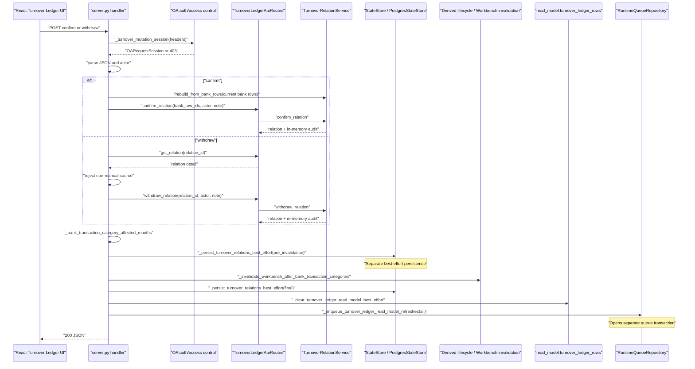
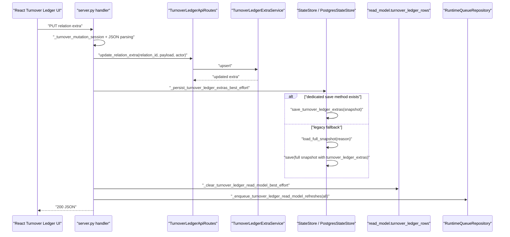
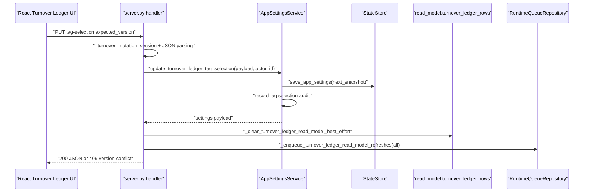
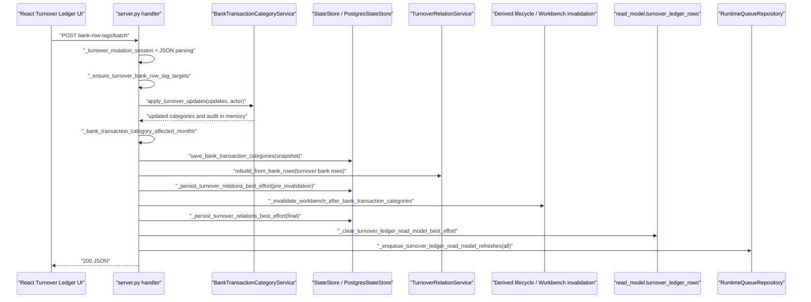

# Turnover Ledger Write Path and UoW Boundary Plan

对应 prompt：`PF-P051 - Turnover Ledger Write Path Discovery and UoW Boundary Planning`

状态：PF-P051 `verified`；PF-P052 `verified`；PF-P053 `verified`；PF-P054 `verified`

## Scope

本文件只记录 Turnover Ledger 写路径 discovery/planning。PF-P051 未修改 production code、tests、SQL migration、worker、frontend、deployment 或生产配置。

目标是为后续 Turnover Ledger 写路径重构建立事实源：

- 哪些 API 写 Turnover / Bankdetail / settings facts；
- 哪些 side effects 现在由 `server.py` 编排；
- 哪些步骤不在同一个 PostgreSQL transaction 中；
- 未来 `TurnoverLedgerWriteUnitOfWork` 必须包住哪些 facts、audit、dirty scope、outbox 和 source version；
- 下一步应该先补哪些 characterization / contract tests。

## CodeGraph And Source Coverage

PF-P051 使用 CodeGraph 覆盖了以下写路径入口和后置副作用：

- `_handle_api_turnover_ledger_confirm`
- `_handle_api_turnover_ledger_withdraw`
- `_handle_api_turnover_ledger_relation_extra_update`
- `_handle_api_turnover_ledger_tag_selection_update`
- `_handle_api_turnover_ledger_bank_row_tags_batch`
- `_after_turnover_relation_mutation`
- `_persist_turnover_relations_best_effort`
- `_persist_turnover_ledger_extras_best_effort`
- `_clear_turnover_ledger_read_model_best_effort`
- `_enqueue_turnover_ledger_read_model_refreshes`

关键源码事实：

- `server.py` 的 Turnover 写 handler 仍负责 auth/session、body parsing、业务 service 调用、state store persistence、read model clear 和 runtime queue enqueue。
- `TurnoverLedgerApiRoutes` 仍是 read/write 混合 facade：read-side 已被 `TurnoverLedgerReadFacade` 包住，但 write methods 仍直接委托 `TurnoverRelationService` 和 extra service。
- `RuntimeQueueRepository.enqueue_read_model_refresh_in_transaction()` 已具备 transaction-bound dirty scope + outbox primitive。
- 当前 `server.py` 调用的是 `_enqueue_turnover_ledger_read_model_refreshes()`，该 helper 走 queue repository 的非事务 `enqueue_read_model_refresh()` wrapper。
- `PostgresStateStore.save_turnover_relations()` 会写 repository 并保存 snapshot，`PostgresWorkbenchRepository.save_turnover_relations()` 自己开启 transaction。
- `PostgresWorkbenchRepository.save_turnover_ledger_extras()` 当前逐条 execute，没有被 Turnover 写 handler 的外层 transaction 包住。
- `_persist_turnover_ledger_extras_best_effort()` 在缺少 dedicated store method 时会调用 legacy full snapshot fallback。

## Write API Matrix

| API | Handler | Core service/usecase | Persistence today | Audit today | Dirty/outbox today | Cross-module influence | Current tests | Risk |
| --- | --- | --- | --- | --- | --- | --- | --- | --- |
| `PUT /api/turnover-ledger/tag-selection` | `_handle_api_turnover_ledger_tag_selection_update` | `AppSettingsService.update_turnover_ledger_tag_selection` | `state_store.save_app_settings()` inside app settings service | `_record_turnover_ledger_tag_selection_audit()` inside app settings service | After service returns: clear Turnover read model best-effort, enqueue `turnover_ledger.read_model.refresh` | Changes selected tags used by Turnover source_versions and query filtering | `test_turnover_ledger_tag_selection_get_put_and_version_conflict` | High. Settings fact/audit and read model dirty/outbox are split. |
| `POST /api/turnover-ledger/bank-row-tags/batch` | `_handle_api_turnover_ledger_bank_row_tags_batch` | `BankTransactionCategoryService.apply_turnover_updates`; `TurnoverRelationService.rebuild_from_bank_rows` | `state_store.save_bank_transaction_categories()` then `_after_turnover_relation_mutation()` persists turnover relations | Bank category audit inside category service; Turnover relation audit from rebuild/manual relations snapshot | `_after_turnover_relation_mutation()` clears read model and enqueues refresh after Bankdetail write | Writes Bankdetail facts, triggers Workbench invalidation, rebuilds Turnover relations | `test_turnover_bank_row_tag_batch_save_updates_category_and_reflects_to_bank_details`; invalid target side-effect test | Critical. It is a Turnover API writing Bankdetail facts plus Turnover relation/read-model side effects across separate boundaries. |
| `PUT /api/turnover-ledger/relations/{id}/extra` | `_handle_api_turnover_ledger_relation_extra_update` | `TurnoverLedgerApiRoutes.update_relation_extra`; `TurnoverLedgerExtraService.upsert` | `_persist_turnover_ledger_extras_best_effort()` | Extra payload has `updated_by`/`updated_at`, but no dedicated append-only audit table | Clear Turnover read model best-effort, enqueue refresh | Affects Turnover read model/source_versions; no Workbench invalidation | `test_relation_extra_get_returns_default_structure_and_put_persists`; legacy fallback test; invalid/readonly tests | High. Extra fact persistence and dirty/outbox are split; legacy full snapshot fallback remains. |
| `POST /api/turnover-ledger/relations/confirm` | `_handle_api_turnover_ledger_confirm` | `TurnoverRelationService.rebuild_from_bank_rows`; `TurnoverLedgerApiRoutes.confirm_relation`; `TurnoverRelationService.confirm_relation` | `_after_turnover_relation_mutation()` persists Turnover relation snapshot twice | `TurnoverRelationService.confirm_relation()` appends audit in memory, persisted through relation snapshot | `_after_turnover_relation_mutation()` clears read model and enqueues refresh | Workbench invalidation via `bank_transaction_category_changed` lifecycle | service tests and `test_confirm_and_withdraw_require_mutation_permission_and_write_audit` | High. Relation facts/audit and dirty/outbox not one transaction; no explicit expected relation version. |
| `POST /api/turnover-ledger/relations/{id}/withdraw` | `_handle_api_turnover_ledger_withdraw` | `TurnoverLedgerApiRoutes.get_relation`; handler source check; `TurnoverRelationService.withdraw_relation` | `_after_turnover_relation_mutation()` persists Turnover relation snapshot twice | `TurnoverRelationService.withdraw_relation()` appends audit in memory, persisted through relation snapshot | `_after_turnover_relation_mutation()` clears read model and enqueues refresh | Workbench invalidation via affected bank row months | service tests, API permission/audit test, system relation reject test | High. No explicit expected relation version; duplicate withdraw can increment version again unless later tests prove otherwise. |

## Runtime Sequence

### Confirm / Withdraw

### Relation Extra PUT

### Tag Selection PUT

### Bank Row Tags Batch

## Transaction / Outbox / Dirty Scope Audit

| Write path | Facts/audit same transaction? | Dirty scope/outbox same transaction? | Current split point | Failure mode |
| --- | --- | --- | --- | --- |
| Tag selection PUT | Partially. Settings save and audit are inside `AppSettingsService`, but not bound to Turnover refresh enqueue. | No. Read model clear and queue enqueue happen after service returns. | `update_turnover_ledger_tag_selection()` returns before clear/enqueue. | Settings update succeeds but read model refresh enqueue fails, leaving stale Turnover view. |
| Bank row tags batch | No. Bankdetail category facts are saved before relation rebuild/finalizer. | No. Queue enqueue happens after category save and relation persistence. | `save_bank_transaction_categories()` precedes `rebuild_from_bank_rows()` and `_after_turnover_relation_mutation()`. | Bankdetail facts change but relation rebuild or refresh enqueue fails, causing Turnover/Workbench divergence. |
| Relation extra PUT | No dedicated audit; extra fact persistence is best-effort. | No. Read model clear/enqueue happen after best-effort persistence. | `_persist_turnover_ledger_extras_best_effort()` can swallow exceptions. | API may return success after in-memory extra update while persistence or refresh silently fails. |
| Confirm relation | No explicit outer transaction. Relation and audit mutate in memory, then snapshot persistence is best-effort. | No. Clear/enqueue happen after best-effort persistence. | `_after_turnover_relation_mutation()` runs multiple independent side effects. | Relation fact/audit may persist without outbox, or Workbench invalidation may run between two relation snapshot saves. |
| Withdraw relation | Same as confirm. | Same as confirm. | Same finalizer. | Withdraw fact may persist without refresh; duplicate withdraw may increment version again without stale precondition. |

Runtime queue already has the primitive needed for the target model: `enqueue_read_model_refresh_in_transaction()` writes dirty scope and outbox in one transaction. The blocker is that Turnover write handlers do not own a transaction that also includes the facts/audit writes.

## UoW Readiness Assessment

Future `TurnoverLedgerWriteUnitOfWork` must eventually make the following writes atomic where a single API changes them:

- Turnover relation facts in `app.turnover_relations`.
- Turnover relation audit in `app.turnover_relation_events`.
- Turnover relation extras in `app.turnover_ledger_extras`.
- App setting mutation for `turnover_ledger_tag_selection` and its audit record, or a dedicated port that can join the same transaction.
- Bankdetail category facts and category audit for `bank-row-tags/batch`, through an explicit Bankdetail port.
- Workbench invalidation influence caused by bank category changes, either as transaction-bound dirty/outbox or a clearly separate downstream event.
- Turnover read model dirty scope and `job.outbox_events`.
- Source version / expected version contract for relation snapshot, extras, tag selection and bank categories.

Current blockers:

- `server.py` owns the orchestration and passes no transaction object through the write paths.
- `PostgresStateStore.save_turnover_relations()` delegates to repository and snapshot save as separate operations.
- `PostgresWorkbenchRepository.save_turnover_relations()` has its own transaction wrapper, so it cannot currently join a higher-level Turnover UoW.
- `save_turnover_ledger_extras()` is not clearly transaction-bound to dirty/outbox.
- Tag selection lives in `AppSettingsService`, not a Turnover-specific repository/port.
- `bank-row-tags/batch` is a Turnover API but writes Bankdetail facts.
- `_clear_turnover_ledger_read_model_best_effort()` deletes read model rows outside the target dirty/outbox transaction and swallows failures.
- `confirm`/`withdraw` do not take expected relation versions from the client.

Do not implement UoW until the tests below are added and the repository/port ownership is made explicit.

## PF-P052 Test Slice

`PF-P052 - Turnover Ledger Write Path Characterization Tests` has been generated and reviewed.

PF-P052 remained test-only and locked current duplicate/stale/failure behavior for:

- tag selection PUT;
- bank-row-tags batch;
- relation extra PUT;
- confirm relation;
- withdraw relation.

PF-P052 did not implement `TurnoverLedgerWriteUnitOfWork`, migrate handlers, change repository semantics, change runtime queue behavior, or modify production configuration.

PF-P052 added API-level characterization tests proving:

- tag selection PUT saves settings and clears the read model before queue failure propagates;
- bank-row-tags batch saves Bankdetail category facts before queue failure propagates, and the attempted queue sequence includes Bankdetail/Workbench/Turnover scopes;
- relation extra persistence failure is currently best-effort success and still refreshes;
- confirm relation snapshot persistence failure is currently best-effort success and still refreshes;
- duplicate confirm currently rejects with `relation_row_conflict`;
- duplicate withdraw currently succeeds again, appends a second withdraw audit entry, and refreshes again.

## Idempotency / Stale Write / Conflict Baseline

| Write path | Duplicate submit today | Stale write today | Existing conflict primitive | Gap |
| --- | --- | --- | --- | --- |
| Tag selection PUT | Same old `expected_version` returns 409 after first success. | Has optimistic version via `expected_version`/`version`. | `turnover_ledger_tag_selection_version_conflict` maps to 409. | Need tests that refresh enqueue failure does not leave silent success once UoW is introduced. |
| Bank row tags batch | Same payload with old expected row version returns 409 after version increment; same payload with current version may be treated as no-op by category service. | Has per-row category `expected_version`. | `category_version_conflict` maps to 409. | Need tests for atomicity across Bankdetail save, relation rebuild, Workbench invalidation and Turnover enqueue. |
| Relation extra PUT | Repeating same payload updates `updated_at`/`updated_by` sequencing through extra service; no expected extra version. | No expected version in API. | Validation errors map to 400; no stale conflict. | Need characterization of duplicate extra PUT and a future version contract. |
| Confirm relation | Duplicate confirm of active syncable rows is rejected by relation service as row conflict. | No expected relation/read model version. Handler rebuilds from current bank rows before confirm. | `TurnoverRelationValidationError` maps to 400, not 409. | Need API-level duplicate/stale tests and decision whether stale relation conflicts should become 409 later. |
| Withdraw relation | Current service can withdraw a relation by id and increments version; no expected version. Existing tests only cover manual source success and system source rejection. | No expected relation version. | Unknown relation maps to 404; validation maps to 400. | Need duplicate withdraw and stale version tests before migration. |

## Repository Ownership And Coupling Audit

Current coupling:

- HTTP/session parsing is in `server.py`, which is acceptable only as app boundary.
- Business orchestration is also in `server.py`, which is not acceptable long term.
- `TurnoverLedgerApiRoutes` mixes read-only and write methods. Read-side is now behind `TurnoverLedgerReadFacade`, but write-side still lacks a write facade/service.
- Turnover relation persistence lives in `services/postgres_repositories/workbench.py`, which obscures ownership.
- Bankdetail category mutation is invoked directly through `BankTransactionCategoryService`.
- Settings mutation is invoked directly through `AppSettingsService`.
- Runtime queue access is through `_runtime_repositories.queue_repository`, but from `server.py`.
- Legacy full snapshot fallback remains for extras.

Future ownership target:

- `server.py`: auth/session, request/response mapping, dependency assembly, error mapping only.
- `TurnoverLedgerWriteFacade` or equivalent app-level write service: command normalization and call into Turnover write usecase/UoW with granular dependencies.
- Turnover repository port: relation facts, relation audit and extras persistence.
- Bankdetail port: category update facts/audit for `bank-row-tags/batch`.
- Settings port: tag selection update with version contract.
- Platform runtime/outbox port: transaction-bound dirty scope + outbox using `enqueue_read_model_refresh_in_transaction()`.
- Workbench influence: explicit downstream event or platform dirty scope, not ad hoc `server.py` lifecycle calls.

## Test Gap Matrix

| Area | Existing coverage | Missing before UoW implementation | Recommended test type |
| --- | --- | --- | --- |
| Tag selection PUT | Version conflict, invalid tag, queue enqueue on success; PF-P052 locks queue failure after settings save/read model clear. | Atomic target contract for settings + dirty/outbox. | Future UoW/contract tests. |
| Bank row tags batch | Success updates Bankdetail and response flags; invalid non-turnover rows have no refresh side effects; PF-P052 locks queue failure after Bankdetail category save and derived refresh attempts. | Duplicate/current-version behavior; Workbench invalidation atomicity target contract. | Future UoW/contract tests. |
| Relation extra PUT | GET default, PUT persists, reload works, invalid payload, readonly rejection, legacy fallback; PF-P052 locks persistence failure as best-effort success. | Duplicate extra PUT behavior; stale extra version target contract. | Future UoW/contract tests. |
| Confirm relation | Service-level confirm validation/audit; API permission/audit/enqueue success; PF-P052 locks duplicate confirm and relation persistence failure behavior. | Enqueue failure after relation persist; future expected version behavior. | Future UoW/contract tests. |
| Withdraw relation | Service-level withdraw audit; API permission/audit success; system relation rejection; PF-P052 locks duplicate withdraw currently succeeding and re-enqueueing. | Stale relation version behavior; persistence/enqueue failure split target contract. | Future UoW/contract tests. |
| Dirty scope/outbox | RuntimeQueue repository has transaction-bound primitive. | Turnover write path does not use transaction-bound primitive. | Future contract tests after characterization. |
| Repository ownership | Existing repository methods persist relation/extras. | No Turnover-specific transaction-bound repository port. | Planning/design then contract tests. |

## Next Slice Recommendation

PF-P052 已完成。下一条 prompt 应该是：

`PF-P053 - Turnover Ledger Write UoW Contract Tests`

原因：

- 当前行为已经被 PF-P052 的 API-level characterization tests 锁定。
- 下一步不应直接迁移真实写 API；应先定义目标 UoW 契约，明确哪些行为需要从当前 best-effort / split side effects 收敛为 transaction-bound facts/audit/dirty/outbox。
- PF-P053 应聚焦 contract tests / expected failures / fake repository ports，不改真实 handler 语义。

不建议下一步直接实现 UoW。

## PF-P053 Contract Test Slice

`PF-P053 - Turnover Ledger Write UoW Contract Tests` has been generated, reviewed and executed.

PF-P053 created target contract tests before any production UoW implementation. The contract tests preserve future expectations for:

- transaction-bound relation facts + relation audit + dirty scope + outbox;
- rollback when dirty scope / outbox fails;
- duplicate withdraw and stale expected version conflict target semantics;
- relation extra write atomicity instead of best-effort success;
- tag selection write atomicity instead of settings save before queue failure;
- bank-row-tags batch explicit Bankdetail port / transaction-bound downstream event boundary;
- granular UoW dependencies without `Application` god object, HTTP headers/cookies or `app.auth`.

PF-P053 uses `unittest.expectedFailure` for target contracts that cannot pass before the minimal UoW skeleton exists. Default CI remains green, while unexpected success should signal that a contract has become implemented.

PF-P053 added `tests/test_turnover_ledger_uow_contract.py` with 7 expected failures:

- confirm relation commits relation facts, audit, dirty scope and outbox in one transaction;
- confirm relation outbox failure rolls back relation facts/audit;
- withdraw relation rejects stale or duplicate submit before the handler runs;
- relation extra outbox failure does not return best-effort success;
- tag selection outbox failure rolls back settings save/audit;
- bank-row-tags batch uses an explicit Bankdetail port and rolls back on outbox failure;
- UoW constructor requires granular ports and rejects `Application` god object injection.

Next slice recommendation:

`PF-P054 - Turnover Ledger Minimal UoW Skeleton`

PF-P054 should introduce the smallest `TurnoverLedgerWriteUnitOfWork.run(command, handler)` skeleton needed to start turning these contract tests green with fake/in-memory ports. PF-P054 must not migrate real Turnover Ledger write APIs.

## PF-P054 Minimal Skeleton Slice

`PF-P054 - Turnover Ledger Minimal UoW Skeleton` has been generated, reviewed and executed.

PF-P054 added only the minimal production skeleton needed by `tests/test_turnover_ledger_uow_contract.py`:

- `backend/src/fin_ops_platform/services/turnover_ledger_write_uow.py`;
- `TurnoverLedgerWriteUnitOfWork`;
- `run(command, handler)`;
- transaction context creation;
- stale precondition port call before handler;
- handler context exposing transaction and granular ports;
- transaction-bound dirty/outbox writer call after handler;
- no `Application` god object constructor.

PF-P054 did not connect the skeleton to `server.py` or any real Turnover Ledger API.

Verification:

- `PYTHONPATH=backend/src python3 -m unittest tests.test_turnover_ledger_uow_contract -v`：Pass，7 tests。
- `PYTHONPATH=backend/src python3 -m unittest tests.test_turnover_ledger_api -v`：Pass，27 tests。

Next slice recommendation:

`PF-P054-MG - Turnover Ledger Write UoW Foundation Cumulative Merge Gate`

This MG should cover PF-P051 through PF-P054 before migrating real Turnover Ledger write APIs.

## Real API Integration Plan

对应 prompt：`PF-P055 - Turnover Ledger Write Facade / UoW Integration Planning`

状态：`implemented`

PF-P055 only plans the real API integration path. It does not modify production code, tests, handlers, repositories, runtime queue, worker, SQL migrations, frontend, deployment or production configuration.

### Integration Principles

- Keep `server.py` as HTTP/session/body parsing, dependency assembly, response mapping and error mapping only.
- Do not call `TurnoverLedgerWriteUnitOfWork` directly from many handlers long term. Introduce a small `TurnoverLedgerWriteFacade` first so handler migration remains thin and reversible.
- Do not inject `Application` into the facade or UoW.
- Keep granular dependencies: relation service/repository port, extra repository port, settings port, Bankdetail port, stale precondition port, dirty/outbox writer.
- Keep PF-P052 characterization tests unchanged until a specific migration prompt intentionally changes behavior and updates target tests.
- Do not mix all write APIs in one prompt. Migrate one low-risk entry first, then continue by risk.

### Readiness Matrix

| API | Current handler responsibility | Target facade/usecase responsibility | Needed granular dependencies / ports | Current test baseline | UoW readiness | Risk | Recommendation |
| --- | --- | --- | --- | --- | --- | --- | --- |
| `PUT /api/turnover-ledger/relations/{id}/extra` | Auth/session, JSON parsing, calls `TurnoverLedgerApiRoutes.update_relation_extra`, best-effort extra persistence, read model clear, refresh enqueue, response flag. | `TurnoverLedgerWriteFacade.update_relation_extra(command)` should validate command, call extra service/repository inside UoW, enqueue dirty/outbox transaction-bound, return payload for handler mapping. | Extra repository port; relation existence reader; dirty/outbox writer; optional stale precondition for future extra version. | PF-P052 locks success, invalid, readonly, legacy fallback and persistence failure best-effort behavior. | Highest readiness. It only changes Turnover extra facts and Turnover read model refresh; no Bankdetail/Workbench lifecycle. | Medium. Current persistence failure is best-effort success, target UoW will later change failure semantics. | First real integration candidate, but next prompt should add facade-level tests before production wiring. |
| `POST /api/turnover-ledger/relations/confirm` | Auth/session, JSON parsing, rebuilds relations from bank rows, calls route confirm, computes affected months, runs `_after_turnover_relation_mutation`. | Facade should build confirm command, use relation service inside UoW, persist relation facts/audit, enqueue Turnover dirty/outbox and explicitly handle Workbench/Bankdetail influence. | Relation repository port; relation service; bank row provider; affected month provider; stale precondition; dirty/outbox writer; Workbench influence port. | PF-P052 locks success, duplicate confirm, persistence failure best-effort, audit and refresh. | Partial. Minimal UoW exists, but no real relation repository adapter or Workbench influence port. | High. Current `_after_turnover_relation_mutation` persists twice and triggers cross-module lifecycle. | Do after relation extra facade and after relation repository/Workbench influence contract tests. |
| `POST /api/turnover-ledger/relations/{id}/withdraw` | Auth/session, JSON parsing, loads relation detail, blocks non-manual source in handler, calls route withdraw, computes affected months, runs `_after_turnover_relation_mutation`. | Facade should own manual-source precondition, stale expected version precondition, withdraw mutation, relation facts/audit persistence and dirty/outbox. | Relation detail reader; relation repository port; relation service; stale precondition; dirty/outbox writer; Workbench influence port. | PF-P052 locks system relation reject and current duplicate withdraw success/re-enqueue behavior. | Partial. UoW stale precondition primitive exists, but API does not expose expected relation version yet. | High. Target behavior should reject duplicate/stale withdraw, changing current behavior. | Do after planning expected version contract and response compatibility. |
| `PUT /api/turnover-ledger/tag-selection` | Auth/session, JSON parsing, calls `AppSettingsService.update_turnover_ledger_tag_selection`, clears read model, enqueues refresh. | Facade should call settings port inside transaction and enqueue Turnover dirty/outbox in same boundary. | Settings port with transaction support; settings audit port; dirty/outbox writer. | PF-P052 locks version conflict and queue failure after settings save. | Partial. Needs settings service/repository transaction seam. | High. Crosses Platform/Settings boundary and target semantics change current save-before-queue behavior. | Do after a Settings port contract prompt. |
| `POST /api/turnover-ledger/bank-row-tags/batch` | Auth/session, JSON parsing, validates target rows, calls BankTransactionCategoryService, saves Bankdetail categories, rebuilds Turnover relations, runs `_after_turnover_relation_mutation`, sets response flags. | Facade should use explicit Bankdetail port for category facts/audit, relation rebuild port, Turnover dirty/outbox and downstream influence event in one defined transaction boundary. | Bankdetail port; bank row effective category provider; relation service/repository port; Workbench influence port; dirty/outbox writer; stale/current-version port. | PF-P052 locks success, invalid target, queue failure after Bankdetail save and derived refresh attempts. | Lowest. Cross-module Bankdetail and Workbench influence are not yet ported. | Critical. Turnover API writes Bankdetail facts and triggers multiple downstream scopes. | Last among these write APIs. Needs Bankdetail port design and cross-module event contract first. |

### Recommended Migration Order

1. `relation extra PUT` facade-level tests and thin write facade extraction.
2. `relation extra PUT` minimal UoW wiring, preserving current API response shape while moving dirty/outbox behind UoW.
3. Relation repository port design for confirm/withdraw facts and audit.
4. Confirm relation facade/UoW integration.
5. Withdraw expected relation version contract and duplicate/stale conflict migration.
6. Settings port contract for tag selection.
7. Bankdetail port and downstream influence contract for bank-row-tags batch.

### Next Prompt Recommendation

`PF-P056 - Turnover Ledger Relation Extra Write Facade Tests`

PF-P056 should be test-only or facade-test-only. It should add tests for a future `TurnoverLedgerWriteFacade.update_relation_extra()` using fake granular dependencies and the existing `TurnoverLedgerWriteUnitOfWork`. It should not change `server.py` or the real API.
