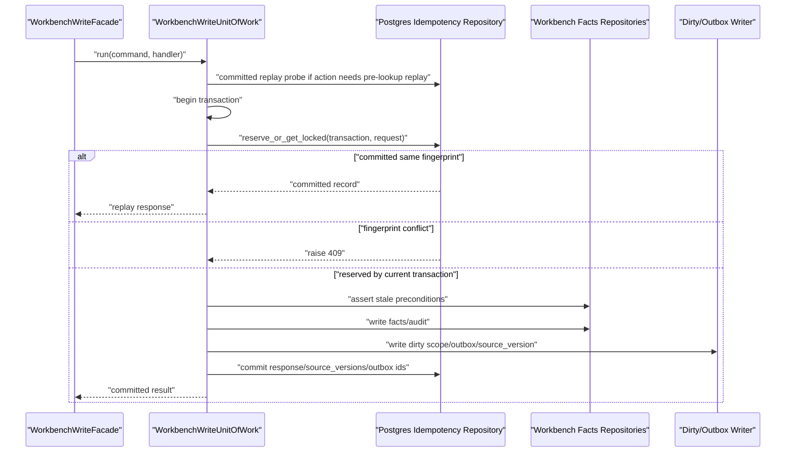

# Workbench Durable Idempotency PostgreSQL Store Plan

对应 prompt：`PF-P037 - Workbench Durable Idempotency PostgreSQL Store Planning`

状态：`implemented`

本文档规划 Workbench 写路径的 durable idempotency PostgreSQL store。本文档只做架构规划，不新增 SQL migration，不实现 repository，不修改生产代码，不迁移更多 Workbench 写 API。

## 1. Executive Summary

PF-P035 和 PF-P036 已经把真实 Workbench pair relation 写路径中的 `confirm-link` 与 `cancel-link` 接入 `WorkbenchWriteUnitOfWork`。UoW 现在已经具备 idempotency 的 get、reserve、commit、replay skeleton，但生产组装仍使用 `InMemoryWorkbenchIdempotencyRepository`。

当前能力只能保证同一进程内的 replay / conflict：

- 进程重启后记录丢失。
- 多 worker / 多 API 进程之间不能共享同一个 idempotency key 状态。
- 同 key 并发请求仍依赖当前 Python 进程内的时序，不能形成数据库级锁。
- 财务写操作的审计追溯无法依赖内存记录。

目标是新增一个 PostgreSQL durable idempotency store，使后续 `confirm-link`、`cancel-link` 以及更多 Workbench 写 API 可以在同一 PostgreSQL transaction 中完成 facts、audit/history、dirty scope、outbox、source_version 和 idempotency commit。

本计划建议下一步分两段实现：

1. `PF-P038 - Workbench Durable Idempotency Migration and Contract Tests`
   新增 SQL migration、migration discovery test、PostgreSQL repository contract tests，但不切生产 wiring。
2. `PF-P039 - Workbench Durable Idempotency Repository Integration`
   实现 repository 并接入 UoW feature flag / wiring，仍不迁移更多 Workbench 写 API。

## 2. Current State

### 2.1 Current Record

当前 `WorkbenchIdempotencyRecord` 位于 `backend/src/fin_ops_platform/services/workbench_idempotency.py`，字段为：

| 字段 | 当前语义 |
| --- | --- |
| `tenant_id` | 当前默认 `default`，未来应接真实租户或组织上下文 |
| `actor_id` | 当前默认 `system`，未来应接真实 OA/user auth context |
| `action_name` | 例如 `confirm_link`、`cancel_link`，用于诊断和 fingerprint |
| `idempotency_key` | 客户端或 facade 传入的幂等 key |
| `request_fingerprint` | 由 tenant、actor、action 和业务 payload 计算的 SHA-256 |
| `status` | `reserved` / `committed` / `failed` |
| `request_payload` | sanitized 请求 payload |
| `response_payload` | replay-safe response payload |
| `source_versions` | UoW 写入 dirty/outbox 后返回的 source_version map |
| `outbox_event_ids` | UoW 写入 outbox 后返回的 event ids |
| `created_at` | 记录创建时间 |
| `completed_at` | committed / failed 完成时间 |
| `expires_at` | 未来 retention / cleanup 使用 |

当前 identity 已在 PF-P024/PF-P025 锁定：

- durable unique identity：`(tenant_id, actor_id, idempotency_key)`
- action diagnostics identity：`(tenant_id, action_name, idempotency_key)`

PF-P037 不建议改变 durable uniqueness。把 `action_name` 放进唯一键会允许同一个 actor 用同一个 idempotency key 在不同 action 上成功提交不同写操作，这会削弱“客户端重试 key 全局唯一”的安全性，并冲突于现有 contract tests。

### 2.2 Current In-Memory Store API

`InMemoryWorkbenchIdempotencyRepository` 当前提供：

- `get_committed_or_reserved(tenant_id, actor_id, idempotency_key)`
- `reserve(...)`
- `commit(...)`
- `mark_failed(...)`
- `has_fingerprint_conflict(identity, incoming_fingerprint)`

这套 API 对 UoW 已经足够，但不表达数据库锁和并发语义。PostgreSQL implementation 需要新增锁定式 reserve API，同时兼容当前方法名，减少 UoW 改动面。

### 2.3 Current UoW Sequence

当前 `WorkbenchWriteUnitOfWork.run(command, handler)` 的 idempotency sequence：

1. transaction 外构造 `_IdempotencyRequest`。
2. transaction 外调用 `_idempotency_get(store, request)`。
3. 如果已有 record：
   - fingerprint 不同：抛 `WorkbenchIdempotencyKeyConflict`。
   - committed 且 fingerprint 相同：replay response。
   - reserved / failed：当前没有 durable 等待/抢占语义。
4. 打开 PostgreSQL transaction。
5. 执行 stale precondition。
6. transaction 内调用 `_idempotency_reserve(store, request)`。
7. 执行 handler 写 facts。
8. 写 dirty scope / outbox / source_version。
9. transaction 内调用 `_idempotency_commit(...)`。

这个 sequence 对 in-memory store 可用，但对 PostgreSQL durable store 有 TOCTOU 风险：两个请求可能都在 transaction 外看不到 committed record，然后同时进入 transaction 尝试 reserve。PostgreSQL implementation 必须把“插入或锁定 idempotency row”的决策放进数据库 transaction 中。

### 2.4 Current Real API Usage

`Application._workbench_confirm_link_unit_of_work()` 和 `_workbench_cancel_link_unit_of_work()` 目前在 PostgreSQL storage backend 下创建 UoW，但 idempotency store 是 per-Application attribute 上的 `InMemoryWorkbenchIdempotencyRepository`。

这意味着：

- 同一个 Python process 内可以 replay/conflict。
- 多 process 之间不能 replay/conflict。
- process restart 后不能 replay。
- 当前实现不能支撑生产级 HTTP retry 语义。

## 3. Target PostgreSQL Schema Proposal

### 3.1 Table Ownership

推荐表名：

`app.workbench_idempotency_records`

理由：

- 它是 Workbench 写命令的业务幂等记录，不是 worker queue 状态。
- 它必须和 Workbench facts 同事务提交，更接近 `app.workbench_pair_relations` / `app.workbench_exception_cases`。
- 记录有财务审计价值，保留在 `app` schema 比放在 `job` schema 更清晰。

### 3.2 Proposed Columns

| Column | Type | Null | Default | 说明 |
| --- | --- | --- | --- | --- |
| `id` | `uuid` | no | `gen_random_uuid()` | 内部主键 |
| `tenant_id` | `text` | no | `'default'` | 租户/组织边界 |
| `actor_id` | `text` | no | none | 执行动作的用户/OA 身份 |
| `action_name` | `text` | no | none | 诊断字段，不进入 durable unique key |
| `idempotency_key` | `text` | no | none | 客户端或 facade 提供的 key |
| `request_fingerprint` | `text` | no | none | SHA-256 hex，建议 check 长度 64 |
| `status` | `text` | no | `'reserved'` | `reserved` / `committed` / `failed` |
| `request_payload` | `jsonb` | no | `'{}'::jsonb` | sanitized 请求 payload |
| `response_payload` | `jsonb` | no | `'{}'::jsonb` | replay-safe response payload |
| `source_versions` | `jsonb` | no | `'{}'::jsonb` | dirty scope source versions |
| `outbox_event_ids` | `jsonb` | no | `'[]'::jsonb` | outbox event ids |
| `trace_id` | `text` | yes | none | 诊断链路 |
| `reserved_at` | `timestamptz` | no | `now()` | reserve 时间 |
| `completed_at` | `timestamptz` | yes | none | commit/failed 时间 |
| `expires_at` | `timestamptz` | yes | none | retention cutoff |
| `last_error` | `text` | yes | none | failed 诊断 |
| `created_at` | `timestamptz` | no | `now()` | 创建时间 |
| `updated_at` | `timestamptz` | no | `now()` | 更新时间 |

### 3.3 Constraints and Indexes

Required constraints:

```sql
alter table app.workbench_idempotency_records
    add constraint workbench_idempotency_status_chk
    check (status in ('reserved', 'committed', 'failed'));

alter table app.workbench_idempotency_records
    add constraint workbench_idempotency_fingerprint_chk
    check (request_fingerprint ~ '^[0-9a-f]{64}$');
```

Required unique index:

```sql
create unique index workbench_idempotency_identity_uidx
    on app.workbench_idempotency_records (tenant_id, actor_id, idempotency_key);
```

Recommended lookup indexes:

```sql
create index workbench_idempotency_action_status_idx
    on app.workbench_idempotency_records (tenant_id, action_name, status, created_at desc);

create index workbench_idempotency_expires_idx
    on app.workbench_idempotency_records (expires_at)
    where expires_at is not null;

create index workbench_idempotency_committed_idx
    on app.workbench_idempotency_records (tenant_id, actor_id, completed_at desc)
    where status = 'committed';
```

### 3.4 Grants

Follow current migration patterns:

- `fin_ops_api`: `select, insert, update` on `app.workbench_idempotency_records`
- `fin_ops_worker`: likely `select` only unless workers will replay write commands, which is not currently planned
- `fin_ops_readonly`: `select`
- `fin_ops_migrator`: `select, insert, update` and sequence usage if needed

If `id` uses `gen_random_uuid()` there is no sequence grant for this table.

### 3.5 Retention

Do not delete committed idempotency records aggressively. For financial write commands, replay keys can become operational evidence. Recommended defaults:

- `committed`: retain at least 90 days, preferably 180 days if storage pressure is low.
- `failed`: retain 30 days for debugging.
- `reserved` expired without completion: retain 7 to 14 days after being marked failed/expired.

Cleanup must be a separate ops job or admin command, not hidden in request path.

## 4. Concurrency and Locking Semantics

### 4.1 Required Behavior

For `(tenant_id, actor_id, idempotency_key)`:

| Existing row | Same fingerprint | Different fingerprint |
| --- | --- | --- |
| none | reserve and continue |
| `reserved`, not expired | return in-progress conflict or wait with bounded timeout; do not execute handler twice | return 409 conflict |
| `reserved`, expired | lock and either take over or mark failed then retry reserve | return 409 conflict if fingerprint differs |
| `committed` | replay stored response | return 409 conflict |
| `failed` | return previous failure or allow retry only if policy says failed is retryable | return 409 conflict |

Default recommendation:

- Do not wait in the HTTP request thread for another request to finish.
- If a row is `reserved` and not expired, return a deterministic 409-like idempotency in-progress response or 425/409 equivalent. The existing `WorkbenchIdempotencyKeyConflict` is fingerprint conflict; a separate future primitive may be needed for “same key still processing”.
- For expired `reserved`, the repository may mark it `failed` under lock and allow a new reserve only when the fingerprint is the same and policy allows retry.

### 4.2 Eliminating TOCTOU

Current UoW performs a transaction-outside `get` before transaction-inside `reserve`. PostgreSQL store should not depend on that pattern for correctness.

Recommended future repository method:

```python
reserve_or_get_locked(
    *,
    transaction,
    tenant_id: str,
    actor_id: str,
    action_name: str,
    idempotency_key: str,
    request_fingerprint: str,
    request_payload: dict[str, Any],
    expires_at: datetime | None = None,
) -> WorkbenchIdempotencyRecord
```

Semantics:

1. Try `insert ... on conflict do nothing`.
2. Select the row `for update`.
3. If inserted row is current request: return `reserved`.
4. If existing fingerprint differs: raise conflict.
5. If existing status is `committed`: return committed for replay.
6. If existing status is active `reserved`: return reserved/in-progress signal.
7. If existing status is expired `reserved`: mark failed or take over according to policy.

The key point is that insert/select/decision happens inside one PostgreSQL transaction and locks the row.

### 4.3 Replay Before Active Relation Lookup

`cancel-link` currently needs `replay_committed(command)` before active relation lookup, because after first successful cancel there is no active relation to find. Durable repository therefore needs a read path that can safely return only committed rows:

```python
get_committed_for_replay(
    tenant_id: str,
    actor_id: str,
    idempotency_key: str,
) -> WorkbenchIdempotencyRecord | None
```

This method may run outside the facts transaction, but it must never create/reserve rows. It only supports committed replay or fingerprint conflict. If it sees `reserved`, it should return a processing signal or `None` according to UoW policy; it must not let the request fall through and execute a duplicate write.

## 5. Repository API Design

### 5.1 Target Class

Recommended implementation class:

`PostgresWorkbenchIdempotencyRepository`

Possible location:

`backend/src/fin_ops_platform/services/postgres_repositories/workbench_idempotency.py`

Reason:

- Keeps raw SQL in repository boundary.
- Avoids expanding `postgres_repositories/workbench.py`, which already owns pair relation/exception/candidate persistence.
- Makes platform guard allowlist explicit if needed.

### 5.2 Methods

Minimum methods:

```python
class PostgresWorkbenchIdempotencyRepository:
    def __init__(self, connection_or_transaction: Any) -> None: ...

    def get_committed_or_reserved(
        self,
        tenant_id: str,
        actor_id: str,
        idempotency_key: str,
    ) -> WorkbenchIdempotencyRecord | None: ...

    def get_committed_for_replay(
        self,
        tenant_id: str,
        actor_id: str,
        idempotency_key: str,
    ) -> WorkbenchIdempotencyRecord | None: ...

    def reserve(
        self,
        *,
        tenant_id: str,
        actor_id: str,
        action_name: str,
        idempotency_key: str,
        request_fingerprint: str,
        request_payload: dict[str, Any] | None = None,
        expires_at: datetime | None = None,
    ) -> WorkbenchIdempotencyRecord: ...

    def reserve_or_get_locked(...): ...

    def commit(
        self,
        *,
        tenant_id: str,
        actor_id: str,
        action_name: str,
        idempotency_key: str,
        request_fingerprint: str,
        response_payload: dict[str, Any],
        source_versions: dict[str, Any] | None = None,
        outbox_event_ids: list[Any] | None = None,
    ) -> WorkbenchIdempotencyRecord: ...

    def mark_failed(...): ...
```

`get_committed_or_reserved`, `reserve`, `commit`, `mark_failed` preserve the current store surface. `reserve_or_get_locked` is the production-grade extension needed to eliminate TOCTOU.

### 5.3 Transaction Boundary

The repository must accept either `PostgresConnection` or `PostgresTransaction`, following existing repository patterns:

- Read-only replay can use `PostgresConnection`.
- Transaction-bound reserve/commit must use the same `PostgresTransaction` as Workbench facts/outbox.

UoW should eventually pass the transaction-bound repository into `WorkbenchWriteUnitOfWorkContext.idempotency_store` or call a transaction-bound idempotency writer directly. It must not open a nested transaction.

## 6. UoW Integration Plan

### 6.1 Current Required Change

Current `run()`:

- pre-transaction get
- transaction opens
- reserve
- handler
- dirty/outbox
- commit

Future durable sequence:



### 6.2 Split Read/Write Ports

To keep `cancel-link` replay before active relation lookup, use two explicit ports:

- `idempotency_replay_reader`: can read committed rows outside transaction.
- `idempotency_transaction_store`: must reserve/commit with `PostgresTransaction`.

This avoids making all UoW calls open a transaction just to answer “already committed?” and keeps raw SQL inside repository adapters.

### 6.3 Response Payload Boundary

`response_payload` should store replay-safe internal result, including:

- public response fields needed by facade/handler;
- `source_versions`;
- `outbox_event_ids`;

HTTP response filtering must remain in facade/handler. Internal `source_versions` and `outbox_event_ids` are needed to replay the same UoW result and to expose future freshness metadata, but they must not leak to existing frontend payload unless a later compatibility prompt explicitly changes the API contract.

## 7. Migration and Rollout Plan

### 7.1 Migration Number

Current migrations end at:

`0042_bank_detail_candidate_projection.sql`

Recommended next migration:

`0043_workbench_idempotency_records.sql`

PF-P037 does not create this file. PF-P038 should create it and update `tests/test_postgres_migrations.py`.

### 7.2 Feature Flag / Wiring

Recommended environment flag:

`FIN_OPS_WORKBENCH_DURABLE_IDEMPOTENCY=1`

Default behavior should remain current in-memory store until:

1. migration is present and tested;
2. repository tests are green;
3. UoW integration tests prove same-transaction semantics;
4. rollback plan is documented.

Wiring strategy:

- keep in-memory as default;
- when flag enabled and storage backend is PostgreSQL, construct `PostgresWorkbenchIdempotencyRepository`;
- do not enable if `state_store.storage_backend != "postgres"`;
- keep test override hooks for `_workbench_confirm_link_uow_override` and `_workbench_cancel_link_uow_override`.

### 7.3 Rollback

Rollback should be operationally simple:

- disable `FIN_OPS_WORKBENCH_DURABLE_IDEMPOTENCY`;
- fall back to in-memory store;
- keep the table in place;
- do not delete records during rollback;
- retain monitoring to detect duplicate submit issues.

Since the durable table only supports idempotency and does not become a source of truth for Workbench facts, disabling the flag should not corrupt facts. It only reduces replay durability.

### 7.4 Observability

Add metrics/log fields in future implementation:

- `workbench_idempotency_replay_total`
- `workbench_idempotency_conflict_total`
- `workbench_idempotency_reserved_in_progress_total`
- `workbench_idempotency_reserved_timeout_total`
- `workbench_idempotency_commit_total`
- action name, tenant id, status, but never raw idempotency key or sensitive payload.

## 8. Test Strategy

### 8.1 Contract Tests

Extend `tests/test_workbench_idempotency_contract.py` so in-memory and PostgreSQL-backed stores share the same behavior matrix:

- reserve creates `reserved`;
- commit turns record into `committed`;
- same fingerprint replay returns response payload plus `source_versions` / `outbox_event_ids`;
- different fingerprint raises stable 409 conflict;
- sensitive keys are removed from storage payload;
- same `(tenant_id, actor_id, idempotency_key)` uniqueness is enforced.

### 8.2 PostgreSQL Integration Tests

Add tests under a future PostgreSQL integration suite, likely guarded by existing database env conventions:

- migration creates table, constraints and indexes;
- duplicate insert with same `(tenant_id, actor_id, idempotency_key)` is prevented;
- `reserve_or_get_locked` locks the row and serializes concurrent same-key calls;
- failed transaction rolls back reserve if reserve lives in the same transaction;
- commit persists `response_payload`, `source_versions`, and `outbox_event_ids`;
- committed replay survives repository instance recreation.

### 8.3 UoW Tests

Extend `tests/test_workbench_uow_contract.py`:

- facts/outbox/source_version/idempotency commit all occur within one transaction;
- outbox failure rolls back idempotency reserve/commit;
- idempotency commit failure rolls back facts/outbox;
- committed replay does not execute handler/outbox;
- same key different fingerprint does not open facts handler.

### 8.4 Migration Tests

Update `tests/test_postgres_migrations.py` in PF-P038:

- add `0043_workbench_idempotency_records.sql` to `EXPECTED_MIGRATIONS`;
- add `app.workbench_idempotency_records` to `EXPECTED_TABLES`;
- assert status check, fingerprint check and unique index appear in aggregated SQL;
- assert grants for `fin_ops_api`, `fin_ops_readonly`, and migrator role.

### 8.5 Platform Guard Tests

No business service should write raw SQL for idempotency directly. Raw SQL must live under `services/postgres_repositories/` or migration files. If needed, update guard allowlist narrowly for `postgres_repositories/workbench_idempotency.py`.

## 9. Risk Register

| Risk | Severity | Mitigation |
| --- | --- | --- |
| Current UoW transaction-outside get creates TOCTOU under durable store | High | Implement `reserve_or_get_locked` and shift decision into transaction |
| Real actor/tenant still defaulted | High | Keep durable uniqueness ready for real auth context; do not claim full audit semantics until auth propagation is fixed |
| `reserved` record semantics can block retry forever | Medium | Add `expires_at`, timeout metrics, and explicit expired-reserve policy |
| Storing response payload may leak sensitive data | High | Reuse `_sanitize_payload`, add tests for auth/cookie/token removal |
| TTL cleanup may remove audit evidence too early | Medium | Default long retention; cleanup only via explicit ops job |
| Pre-lookup replay for cancel-link conflicts with transaction-bound reserve | High | Split replay reader from transaction store |
| Migration grants may be incomplete | Medium | Add migration tests and runtime role checks |

## 10. Next Prompt Split

Recommended next prompt:

`PF-P038 - Workbench Durable Idempotency Migration and Contract Tests`

PF-P038 should:

- add `0043_workbench_idempotency_records.sql`;
- update migration discovery tests;
- add contract tests for PostgreSQL repository behavior;
- not switch production wiring;
- not migrate more Workbench write APIs.

Then:

`PF-P039 - Workbench Durable Idempotency Repository Integration`

PF-P039 should:

- implement `PostgresWorkbenchIdempotencyRepository`;
- wire it behind `FIN_OPS_WORKBENCH_DURABLE_IDEMPOTENCY`;
- update UoW integration tests for durable same-transaction semantics;
- still avoid migrating additional Workbench write APIs.

Only after PF-P039 is verified should we continue migrating more Workbench write APIs.

## 11. PF-P038 Planned Boundary

用户已确认 PF-P037 `verified`。下一条 planned prompt：

`PF-P038 - Workbench Durable Idempotency Migration and Contract Tests`

PF-P038 的目标是把本文档的 schema 规划落成迁移文件和默认绿色测试门禁：

- 新增 `backend/src/fin_ops_platform/postgres/migrations/0043_workbench_idempotency_records.sql`。
- 更新 `tests/test_postgres_migrations.py` 的 migration discovery 和 table inventory。
- 增加 migration/schema contract tests，验证 `app.workbench_idempotency_records`、status/fingerprint constraints、JSONB 字段、grants、indexes 和 durable unique identity。

PF-P038 不应实现 `PostgresWorkbenchIdempotencyRepository`，不应修改 UoW 或 production wiring，也不应迁移更多 Workbench 写 API。Repository integration 应拆到 PF-P039。

## 12. PF-P038 Execution Result

PF-P038 已落地 durable idempotency 的 schema contract，但仍未切换任何生产路径。

已完成：

- 新增 `backend/src/fin_ops_platform/postgres/migrations/0043_workbench_idempotency_records.sql`。
- 创建 `app.workbench_idempotency_records`，字段覆盖 tenant、actor、action、idempotency key、request fingerprint、status、request/response payload、source versions、outbox event ids、trace id、reserve/complete/expiry timestamps 和诊断错误。
- 固化 durable unique identity：`(tenant_id, actor_id, idempotency_key)`。
- 保留 `action_name` 作为诊断字段和 action/status index 维度，但不进入 durable unique key。
- 新增 status check：`reserved` / `committed` / `failed`。
- 新增 request fingerprint check：64 位 lowercase hex。
- 新增 expires cleanup index 和 committed replay lookup index。
- 增加 role grants：
  - `fin_ops_api`: `select, insert, update`
  - `fin_ops_worker`: `select`
  - `fin_ops_readonly`: `select`
  - `fin_ops_migrator`: `select, insert, update`
- 更新 `tests/test_postgres_migrations.py`，用默认绿色 migration/schema contract 测试锁定上面的 schema、索引、约束和 grants。

仍未完成：

- 未实现 `PostgresWorkbenchIdempotencyRepository`。
- 未新增 `services/postgres_repositories/workbench_idempotency.py`。
- 未切换 `InMemoryWorkbenchIdempotencyRepository`。
- 未引入 feature flag wiring。
- 未修改 `server.py`、`workbench_uow.py` 或真实 Workbench 写 API。
- 未实现 PostgreSQL row locking、expired reserved takeover、committed replay repository API 或 transaction-bound reserve/commit。

下一步建议：

`PF-P039 - Workbench Durable Idempotency Repository Integration`

PF-P039 应基于 `0043_workbench_idempotency_records.sql` 实现 PostgreSQL repository，并用 fake/contract/integration-style 测试验证 reserve、commit、same-fingerprint replay、different-fingerprint conflict 和 transaction-bound rollback 语义。PF-P039 仍不应顺手迁移更多 Workbench 写 API。
