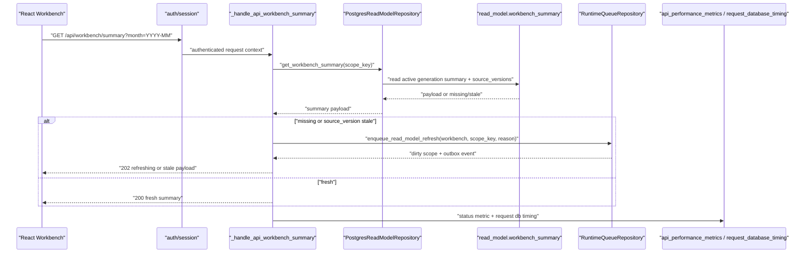
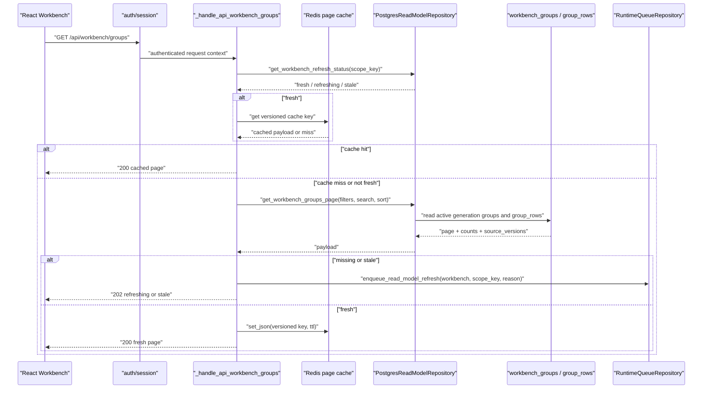
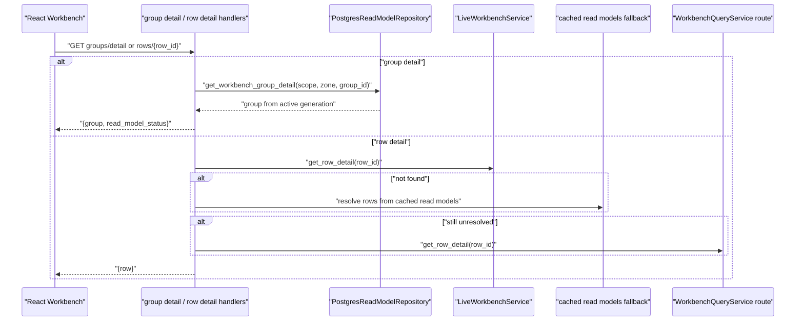
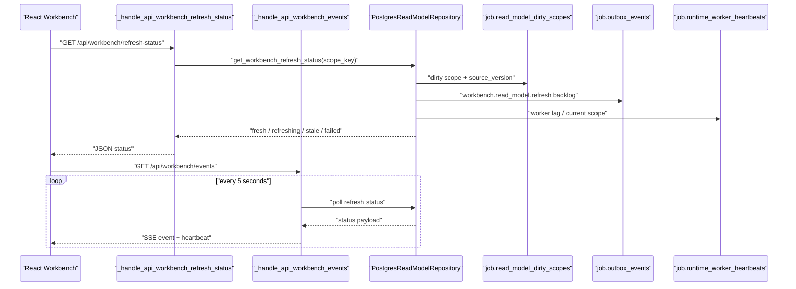
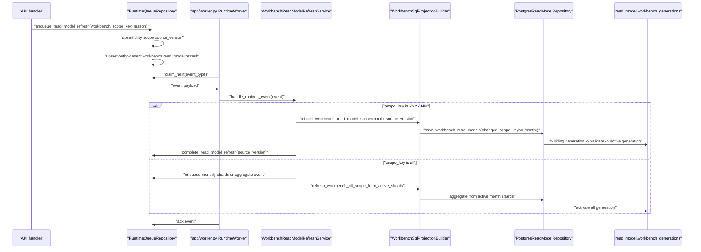

# Workbench Read Model Query 发现与边界计划

状态：PF-P004 `verified`；PF-P005 `verified`；PF-P005-MG `verified`；PF-P006 `verified`；PF-P006-MG `verified`；PF-P007 `verified`；PF-P007-MG `verified`

对应 prompt：`PF-P004 - Workbench Read Model Query Discovery / Boundary Plan`

本文档是 Workbench `query/read-model` 子域的事实级发现结果。它只锁定读路径、Read Model freshness、worker refresh、SSE、前后端契约和后续测试切片，不代表已经开始业务代码重构。

## Scope Boundary

### In Scope

本轮只覆盖 Workbench 查询和 read model 刷新可见性链路：

| API / 能力 | 入口 | 本轮边界 |
| --- | --- | --- |
| `GET /api/workbench/summary` | `backend/src/fin_ops_platform/app/server.py::_handle_api_workbench_summary` | 首屏 summary 查询、fresh/stale/refreshing 语义、缺失时 enqueue refresh |
| `GET /api/workbench/groups` | `server.py::_handle_api_workbench_groups` | 分页、筛选、搜索、排序、Redis page cache、freshness 语义 |
| `GET /api/workbench/groups/detail` | `server.py::_handle_api_workbench_group_detail` | group detail 查询，不处理写入和关系变更 |
| `GET /api/workbench/refresh-status` | `server.py::_handle_api_workbench_refresh_status` | dirty scope、source_version、worker lag、outbox backlog、generation 状态 |
| `GET /api/workbench/events` | `server.py::_handle_api_workbench_events` | SSE 状态推送，不承载 group/row payload |
| 兼容期 `GET /api/workbench` | `server.py::_handle_api_workbench` | legacy workbench view 兼容读取，重点审计 fallback 风险 |
| row detail 查询 | `server.py::_handle_api_workbench_row_detail` | 单行详情读取，重点审计 live service / cached read model fallback |
| worker refresh | `backend/src/fin_ops_platform/app/worker.py` + `WorkbenchReadModelRefreshService` | `workbench.read_model.refresh` event 到 active generation 发布 |

### Out Of Scope

本轮明确不处理：

- confirm/cancel。
- ignore/unignore。
- exception preview/apply/revert 的写路径。
- reconciliation write。
- matching/candidates generation。
- pair relation write。
- Batch Accounting 写路径。
- Turnover Ledger 写路径。
- 任何业务代码、测试、SQL migration、前端或部署配置修改。

## API Contract Matrix

字段审计分类只使用 `frontend-used`、`backend-only`、`contract-mismatch`、`unknown / needs confirmation`。PF-P004 不删除字段，只记录后续需要锁定或精简的契约。

| Endpoint | Handler | Service / Repository | Query Params | Response Contract | Freshness / Cache | Frontend | Contract Notes | Test Anchor / Gap |
| --- | --- | --- | --- | --- | --- | --- | --- | --- |
| `GET /api/workbench/summary` | `_handle_api_workbench_summary` | `_workbench_sql_read_repository.get_workbench_summary(scope_key)` | `month` / scope | summary payload、`read_model_status`、`oa_status`、stale reasons | payload 缺失返回 `202 refreshing` 并 enqueue `api_summary_miss`；source_versions stale 返回 `stale` 并 enqueue `api_summary_source_versions_stale` | `web/src/features/workbench/api.ts::fetchWorkbenchInitialPage` | `frontend-used`：summary zone counts、total count、OA status 经 mapper 使用。`backend-only`：diagnostics、source_versions、active generation metadata 多数只用于诊断。`unknown / needs confirmation`：summary 中 invoice_inventory 是否有前端隐藏依赖。 | `tests/test_workbench_sql_runtime.py::test_workbench_summary_api_uses_sql_summary_contract`；需要补 stale source_versions 响应契约的 characterization |
| `GET /api/workbench/groups` | `_handle_api_workbench_groups` | `_workbench_sql_read_repository.get_workbench_groups_page(...)` | `month`、`zone`、`page`、`page_size`、`status`、`source_kind`、`search`、`search_mode`、`detail_level`、filters、sort | groups page、row counts、pagination、`read_model_status` | 只有 refresh status fresh 时使用 Redis；Redis key 包含 scope/version/filter/detail_level 维度；miss/stale enqueue refresh 并返回 `202 refreshing` 或 stale payload | `api.ts::fetchWorkbenchGroupsPage`、`types.ts::ApiWorkbenchGroupsPayload` | `frontend-used`：groups、pagination、row counts、group rows summary。`backend-only`：source_versions、active_generation_id、read_model_version 当前前端类型未显式承接。`contract-mismatch`：后端可能返回 `read_model_status` 和 stale reasons，前端 mapper 使用不完整，需要 PF-P005 锁定。 | `test_workbench_sql_runtime.py::test_workbench_groups_api_uses_sql_groups_contract`；Redis 版本 key tests 已存在；需要补 search/filter/sort 组合契约 |
| `GET /api/workbench/groups/detail` | `_handle_api_workbench_group_detail` | `_workbench_sql_read_repository.get_workbench_group_detail(...)` | `month`、`zone`、`group_id` | `{month, scope_key, zone, group_id, group, read_model_status}` | 直接读 repository；当前未看到等价 summary/groups 的 stale check 和 Redis cache | `api.ts::fetchWorkbenchGroupDetail` | `frontend-used`：只读取 `group`。`backend-only`：month/scope_key/zone/group_id/read_model_status。`contract-mismatch`：后端 wrapper metadata 比前端类型更多，需确认是否保留诊断字段。 | 需要补 group detail 只读 active generation、missing/stale 语义的 characterization |
| `GET /api/workbench/refresh-status` | `_handle_api_workbench_refresh_status` | `_workbench_sql_read_repository.get_workbench_refresh_status(scope_key)` + freshness wrapper | `month` / scope | status、dirty scopes、worker lag、outbox backlog、generation metadata、stale reasons | 不使用 Redis；直接从 dirty scope、worker heartbeat、outbox、generation 表聚合 | `api.ts::fetchWorkbenchRefreshStatus` | `frontend-used`：scopeKey、readModelStatus、consistencyStatus、generatedAt、activeGenerationId、readModelVersion、dirtyScopes、runningScopes、processedCount、totalCount、workerLagSeconds、lastError、retryable。`backend-only`：building_generation_id、failed_generation_id、generations、outbox_backlog、workers、consistency_failures 多数被 mapper 丢弃。 | `test_workbench_sql_runtime.py` 已有 refresh handler 相关测试；需要补 outbox backlog / worker lag contract snapshot |
| `GET /api/workbench/events` | `_handle_api_workbench_events` | `_workbench_refresh_status_payload_for_scope` polling | `month` / scope | SSE event stream，包含 status/progress/error summary；不传 group/row payload | 当前是循环 polling refresh status，非 Redis PubSub；header 设置 `X-Accel-Buffering: no` | `api.ts::subscribeWorkbenchRefreshEvents` | `frontend-used`：前端监听 `refresh_started`、`progress`、`page_available`、`summary_updated`、`completed`、`failed`。`backend-only`：server 发送 `heartbeat`，前端没有专门监听。`contract-mismatch`：EventSource onerror 直接 close，缺少重连策略需要确认。 | 需要补 SSE event name、断连退出、heartbeat 的 characterization |
| 兼容期 `GET /api/workbench` | `_handle_api_workbench`、`_handle_api_workbench_from_sql_read_model` | `_workbench_sql_read_repository.get_workbench_view(...)`，必要时 fallback `_build_api_workbench_payload` | `month`、`page`、`page_size`、`status`、`source_kind`、`search` | legacy Workbench page payload | SQL read model missing/stale 会 enqueue refresh；production require SQL 时返回 unavailable/refreshing；否则可能 fallback legacy builder | `api.ts::fetchWorkbenchWithProgress` | `frontend-used`：兼容期页面 payload。`contract-mismatch`：legacy fallback 可能返回比 read model view 更宽的字段集合，PF-P005 需冻结响应样本。 | `tests/test_workbench_v2_api.py` 巨型端到端覆盖；需要选 targeted test，避免只跑全量 |
| row detail 查询 | `_handle_api_workbench_row_detail`、`_get_api_workbench_row_detail_payload` | `_live_workbench_service.get_row_detail`、`_resolve_rows_from_cached_read_models`、`_workbench_api_routes.get_row_detail` | row id path | `{row}` | 当前存在 live service、cached read model、route service 多级 fallback；active generation 边界不够清晰 | `api.ts::fetchWorkbenchRowDetail` | `frontend-used`：`row` 详情字段大量使用。`contract-mismatch`：fallback 来源不同可能导致字段完整度和 override 应用顺序不一致。 | 需要补 row detail fallback 来源和字段一致性 tests |

## Runtime Call Chain

### Summary 首屏读取链路



要点：

- Summary 不走 Redis；直接读 PostgreSQL read model active generation。
- 缺失或 source_version stale 时只 enqueue refresh，不在请求线程同步 rebuild。
- `request_database_timing` 在 app shell 层包裹请求，`_emit_workbench_read_model_status_metric` 输出 Workbench freshness 状态。

### Groups 分页、筛选、搜索、排序链路



要点：

- Redis page cache 必须包含 active generation 或 source version 边界，不能只按 month/page/filter 缓存。
- Repository 使用 `workbench_groups` 和 `workbench_group_rows` 的结构化表分页，不应回读 full snapshot 大 JSON。
- 需要在 PF-P005 用 characterization tests 锁定搜索、筛选、排序组合的响应契约。

### Group Detail / Row Detail 链路



要点：

- Group detail 基本在 SQL read model 内，但 stale/missing 语义不如 summary/groups 明确。
- Row detail 仍有多级 fallback：live service、cached read models、WorkbenchQueryService route。它是本轮发现的高风险读路径之一。
- PF-P005 不应立即重写 row detail；应先用测试锁定 fallback 顺序和字段一致性。

### Refresh Status 和 SSE 链路



要点：

- SSE 当前是 status polling，不是 Redis PubSub；因此没有 PubSub 订阅释放问题，但有长连接线程占用和客户端断开后循环退出风险。
- Header 包含 `X-Accel-Buffering: no`，符合反向代理关闭 buffering 的方向。
- 需要补测试确认 EventSource 断开、generator 退出和 heartbeat 事件契约。

### Worker Refresh Event 到 Active Generation 发布链路



要点：

- `backend/src/fin_ops_platform/app/worker.py` 注册 `workbench.read_model.refresh` handler 的前提是启用 `--enable-workbench-read-model-refresh`。
- `RuntimeQueueRepository.enqueue_read_model_refresh` 在 PostgreSQL 中维护 dirty scope 和 outbox event，事件类型为 `workbench.read_model.refresh`。
- `source_version` 是幂等和乱序保护的核心字段。
- `save_workbench_read_models` 使用 building generation，成功校验后才切 active generation；failed generation 只用于诊断。
- `all` scope 会从一致 active month shards 聚合，不能混入 building generation。

## Read Model Data Boundary

### 表与状态边界

Workbench read model 涉及的核心表：

- `read_model.workbench_generations`：generation 生命周期。用户读路径应只读 active generation；building/failed generation 仅用于诊断和 refresh-status。
- `read_model.workbench_rows`：结构化 row 明细。
- `read_model.workbench_groups`：结构化 group header、summary 和状态。
- `read_model.workbench_group_rows`：group 到 row 的结构化关联，支撑分页、筛选、搜索。
- `read_model.workbench_snapshots`：legacy / compatibility snapshot。兼容期仍存在，但重构目标是不让查询热路径依赖 full snapshot 大 JSON。
- `read_model.workbench_summary`：summary 聚合结果。
- `job.read_model_dirty_scopes`：scope freshness、source_version、状态、错误。
- `job.outbox_events`：`workbench.read_model.refresh` durable event。
- `job.runtime_worker_heartbeats`：worker lag、当前处理 scope、运行状态。

状态语义：

- `fresh`：active generation 与 expected source_versions 对齐。
- `refreshing`：dirty scope pending/processing、building generation 存在或缺失触发 refresh。
- `stale`：dirty scope failed、source_versions 落后、schema version 不匹配或存在 failed generation 影响当前 scope。
- `failed`：consistency checker 或 generation failure 命中。
- `unavailable`：SQL read model 不可用或生产强制 SQL read model 时无法读取。

### Active Generation 读取路径

已确认更接近 active generation 读取的路径：

- `get_workbench_summary`：读取 active generation summary，必要时修复 summary counts。
- `get_workbench_groups_page`：以 active_generation_id pin 住 `workbench_groups` / `workbench_group_rows`。
- `get_workbench_group_detail`：按 active generation 查询 group。
- `get_workbench_refresh_status`：读取 active/building/failed generation metadata 和 dirty scope/outbox/worker 状态。

仍需警惕的路径：

- 兼容期 `GET /api/workbench` 在 SQL read model missing 且未强制生产 SQL read model 时可能 fallback 到 legacy builder。
- Row detail 当前存在 live service 和 cached read models fallback，未完全收口到 active generation。
- `workbench_snapshots` 仍用于兼容 view 和部分 fallback，不应继续扩大使用。

### `YYYY-MM` Scope 与 `all` Scope

- `YYYY-MM` scope：builder 从当月 facts 和相关来源构建 rows/groups/summary，写入 building generation，验证后切 active。
- `all` scope：不能直接混合 building month shards。它应只从 active month shards 聚合，生成 `all` 的 active generation。
- `source_version`：来自 dirty scope / event，是防并发、幂等跳过旧事件和 API freshness 判断的关键字段。
- Redis key：groups page cache 必须包含 scope、active generation/source version、detail_level、search_mode、filter、sort 等维度，旧 key 依靠 TTL 自然过期。

## Current Risk and Optimization Findings

| 风险 | 证据 | 严重度 | 建议处理阶段 |
| --- | --- | --- | --- |
| Row detail 多级 fallback 可能绕过 active generation | `_get_api_workbench_row_detail_payload` 依次尝试 live service、cached read models、route service，并应用 override | 高 | PF-P005 先补 characterization；PF-P006 再考虑收口 |
| 兼容期 `GET /api/workbench` 仍可能 fallback legacy builder | `_handle_api_workbench` 在 SQL read model 不可用时仍可能 `_build_api_workbench_payload` | 高 | PF-P005 锁定响应和生产开关；后续再拆 |
| Group detail stale / missing 语义不如 summary/groups 明确 | group detail 直接读 repository 返回 group，未看到等价 stale enqueue 行为 | 中 | PF-P005 增补 tests，PF-P006 再决定是否统一 freshness facade |
| SSE 长连接线程占用和断连退出不清晰 | `_handle_api_workbench_events` generator 循环 sleep 5s polling status | 高 | PF-P005 补 generator cancellation tests；PF-P006 再优化 |
| Redis PubSub 风险当前不成立但需记录 | SSE 当前为 polling refresh status，不是 Redis PubSub | 低 | 保持记录，若后续引入 PubSub 必须加释放测试 |
| Redis cache 依赖 refresh status fresh 判断，需继续锁定 version key | `_handle_api_workbench_groups` 先读 refresh status，再按 versioned key 读写 Redis | 中 | PF-P005 扩充 Redis key characterization |
| `all` scope refresh 原始 dirty scope completion 语义需确认 | `WorkbenchReadModelRefreshService` 对 all scope 会 enqueue shards/aggregate，完成 dirty scope 的时机需用测试锁定 | 高 | PF-P005 补 `all` scope worker refresh tests |
| `WorkbenchSqlProjectionBuilder` 静态依赖 `MongoOAAdapter` parser version | builder source_versions 包含 OA attachment parser version | 中 | PF-P003 guard 允许名单需确认，PF-P006 再考虑 adapter boundary |
| 慢查询 observability 粒度不足 | app shell 有 `request_database_timing` 和 `api_performance_metrics`，但 groups 内部 page/count/filter/search 子查询未见细粒度标签 | 中 | PF-P005 先测现有 metrics；PF-P006 再补细粒度 tracing |
| Operations dashboard 覆盖可能只包含 summary/groups | 现有 dashboard 重点追踪 Workbench summary/groups，group detail、row detail、refresh-status、SSE 覆盖需确认 | 中 | PF-P005 补观测性检查清单 |

### 性能优化判断

当前不应先动算法或拆大 service。生产级顺序应是：

1. 先用 characterization tests 锁定 response contract、freshness、cache、fallback、SSE event。
2. 再薄化 handler，把 request validation、freshness、cache、repository 调度收口到 query facade。
3. 然后收口 repository/cache/freshness 边界，减少 handler 内的状态判断。
4. 最后处理 row detail fallback、legacy builder fallback、SSE 长连接和观测性粒度。

## Test Matrix

### PF-P004 文档验证命令

PF-P004 只做文档发现，可运行：

```bash
git status --short --branch
git diff --check
test -f docs/architecture/backend-refactor/workbench-read-model-query-plan.md
rg -n "Scope Boundary|API Contract Matrix|Runtime Call Chain|Read Model Data Boundary|Current Risk|Test Matrix|Next Execution Slices|Guard Compatibility" docs/architecture/backend-refactor/workbench-read-model-query-plan.md
rg -n "summary|groups|groups/detail|refresh-status|events|active generation|source_version|Redis|SSE|worker refresh|worker.py|contract-mismatch|frontend-used|PubSub|request_database_timing|api_performance_metrics" docs/architecture/backend-refactor/workbench-read-model-query-plan.md
```

### PF-P005 代码执行前必须锁定的 targeted tests

PF-P005 不应直接跑巨型全量测试作为唯一反馈，应先选 targeted tests：

| 文件 | 已知/建议目标 | 覆盖 |
| --- | --- | --- |
| `tests/test_workbench_sql_runtime.py` | `test_workbench_summary_api_uses_sql_summary_contract` | summary API contract |
| `tests/test_workbench_sql_runtime.py` | `test_workbench_groups_api_uses_sql_groups_contract` | groups API contract |
| `tests/test_workbench_sql_runtime.py` | `test_repository_reads_workbench_groups_page_from_structured_groups` | structured groups page |
| `tests/test_workbench_sql_runtime.py` | `test_repository_pins_workbench_groups_page_to_active_generation` | active generation pin |
| `tests/test_workbench_sql_runtime.py` | `test_repository_workbench_groups_cache_version_uses_active_generation` | Redis version key / active generation |
| `tests/test_workbench_sql_runtime.py` | `test_repository_filters_workbench_groups_page_from_structured_group_rows` | filter/search path |
| `tests/test_workbench_sql_runtime.py` | `test_repository_reports_failed_workbench_generation_without_promoting_it` | failed generation 不进用户读路径 |
| `tests/test_workbench_v2_api.py` | 选择 `/api/workbench` compatibility 和 row detail 相关 target | legacy compatibility / row detail |
| `tests/test_workbench_query_service.py` | row detail / query service target | service fallback / field mapping |
| `tests/test_workbench_read_model_service.py` | read model service target | snapshot/service boundary |
| `tests/test_platform_runtime_boundary_guards.py` | 全文件 | PF-P003 8 类 guard 不得回退 |

PF-P005 需要新增或固定的 characterization tests：

- Summary missing -> `202 refreshing` + enqueue reason。
- Summary stale source_version -> stale payload + enqueue reason。
- Groups fresh Redis cache hit 不打 repository page query。
- Groups stale 不使用旧 Redis cache。
- Group detail 只读 active generation，缺失时行为固定。
- Row detail fallback 顺序和 override 应用顺序固定。
- Legacy `GET /api/workbench`：锁定 SQL read model 使用条件、refreshing/unavailable 条件和 `_build_api_workbench_payload` legacy fallback 条件。
- SSE event names、heartbeat、断连退出固定。
- Worker refresh month scope：source_version 旧事件不覆盖新 active generation。
- Worker refresh all scope：只从 active month shards 聚合，dirty scope completion 语义固定。
- Refresh-status：dirty scope、outbox backlog、worker lag、failed generation 映射固定。
- PF-P004 标记为 `backend-only` / `contract-mismatch` 的字段必须在 expected payload 中保留；易变诊断字段断言 key/type/语义，不硬断言不稳定精确值。
- PostgreSQL / Redis / dirty scope / outbox / generation / worker heartbeat 测试必须避免 State Bleed，使用事务隔离、唯一 scope key、独立 fake 或显式清理。
- SSE / worker tests 必须 deterministic，不得使用真实 sleep、无限 generator 或不可控线程等待。

### PF-P005 执行结果

PF-P005 已按 test-first 原则执行完成，并已由用户确认 `verified`。

#### 新增 / 复用测试

| 文件 | 测试 | 锁定行为 |
| --- | --- | --- |
| `tests/test_workbench_sql_runtime.py` | `test_workbench_api_sql_contract_preserves_backend_only_fields` | 兼容期 `GET /api/workbench` 命中 SQL read model 时保留 `diagnostics`、`invoice_inventory`、`active_generation_id`、`read_model_version`、`rows_page`、`read_model_generated_at` 等 backend-only / contract-mismatch 字段 |
| `tests/test_workbench_sql_runtime.py` | `test_workbench_api_legacy_endpoint_falls_back_when_sql_runtime_not_required` | legacy bootstrap 且 SQL runtime 非强制时允许 fallback `_build_api_workbench_payload` |
| `tests/test_workbench_sql_runtime.py` | `test_workbench_api_production_runtime_without_sql_repository_returns_unavailable` | PostgreSQL production runtime 缺失 SQL read repository 时返回 `503 read_model_unavailable`，并 enqueue `api_sql_repository_unavailable`，不 fallback legacy builder |
| `tests/test_workbench_sql_runtime.py` | `test_workbench_summary_api_missing_payload_enqueues_refreshing_contract` | Summary missing payload 返回 `202 refreshing`，并 enqueue `api_summary_miss` |
| `tests/test_workbench_sql_runtime.py` | `test_workbench_summary_api_stale_source_versions_preserves_backend_only_fields` | Summary stale source_versions 保留 backend-only 字段、返回 stale contract，并 enqueue `api_summary_source_versions_stale` |
| `tests/test_workbench_sql_runtime.py` | `test_workbench_groups_api_stale_refresh_status_bypasses_redis_payload` | Groups refresh status stale/refreshing 时不读取旧 Redis JSON payload，改读 DB page，并 enqueue `api_groups_source_versions_stale` |
| `tests/test_workbench_sql_runtime.py` | `test_workbench_events_stream_exposes_no_buffering_headers_and_heartbeat` | SSE `Content-Type`、`Cache-Control`、`X-Accel-Buffering: no`、stream flag、首个 refresh event 和 heartbeat event |
| `tests/test_workbench_v2_api.py` | 现有 row detail targeted tests | row detail live/cached/404/多来源兼容路径 |

#### 验证命令

```bash
PYTHONPATH=backend/src python3 -m unittest \
  tests.test_workbench_sql_runtime.WorkbenchSqlRuntimeTests.test_workbench_api_sql_contract_preserves_backend_only_fields \
  tests.test_workbench_sql_runtime.WorkbenchSqlRuntimeTests.test_workbench_api_legacy_endpoint_falls_back_when_sql_runtime_not_required \
  tests.test_workbench_sql_runtime.WorkbenchSqlRuntimeTests.test_workbench_api_production_runtime_without_sql_repository_returns_unavailable \
  tests.test_workbench_sql_runtime.WorkbenchSqlRuntimeTests.test_workbench_summary_api_missing_payload_enqueues_refreshing_contract \
  tests.test_workbench_sql_runtime.WorkbenchSqlRuntimeTests.test_workbench_summary_api_stale_source_versions_preserves_backend_only_fields \
  tests.test_workbench_sql_runtime.WorkbenchSqlRuntimeTests.test_workbench_groups_api_stale_refresh_status_bypasses_redis_payload \
  tests.test_workbench_sql_runtime.WorkbenchSqlRuntimeTests.test_workbench_events_stream_exposes_no_buffering_headers_and_heartbeat -v

PYTHONPATH=backend/src python3 -m unittest tests.test_workbench_sql_runtime -v

PYTHONPATH=backend/src python3 -m unittest \
  tests.test_workbench_v2_api.WorkbenchV2ApiTests.test_row_detail_prefers_cached_read_model_before_query_service_sync \
  tests.test_workbench_v2_api.WorkbenchV2ApiTests.test_opaque_oa_row_detail_prefers_month_read_model_without_full_oa_sync \
  tests.test_workbench_v2_api.WorkbenchV2ApiTests.test_opaque_oa_row_detail_without_cache_returns_404_without_full_oa_sync \
  tests.test_workbench_v2_api.WorkbenchV2ApiTests.test_get_api_workbench_row_detail_supports_oa_bank_and_invoice -v

PYTHONPATH=backend/src python3 -m unittest tests.test_platform_runtime_boundary_guards -v
```

结果：

- PF-P005 新增 tests targeted run：通过，7 tests passed。
- `tests.test_workbench_sql_runtime` 全文件：通过，102 tests passed。
- Row detail targeted run：通过，4 tests passed。
- PF-P003 platform runtime boundary guards：通过，9 tests passed。

#### 测试事实修正

- PF-P004 中对 stale reason 的文字预期需要以当前实现为准：当前 summary stale source_versions 实际输出 `builder_mismatch`，并且会补齐 `bank_auto_tag_rules_version_missing`、`oa_attachment_invoice_parser_version_missing`、`oa_projection_sync_version_missing` 等 missing reasons。
- Groups refresh status stale/refreshing 时不会读取旧 Redis JSON payload；PF-P007 已进一步收紧为：即使 DB 返回 fresh-looking payload，只要 refresh-status freshness gate 未通过，也不得写入 Redis JSON payload。
- SSE 当前测试只锁定 headers、首个 event 和 heartbeat；客户端断开后的 generator 退出仍是 PF-P006 风险。

## Next Execution Slices

### Slice A：Workbench Query Characterization Tests

- 目标：只补/固定 Workbench query/read-model characterization tests。
- 允许：修改 tests 和必要的 test fixtures。
- 禁止：修改业务实现、SQL migration、前端、部署配置。
- Rollback：回滚 test-only diff。
- 验证：targeted tests + PF-P003 guard tests。

### Slice B：薄化 Handler 到 Query Facade

- 目标：在不改变 response 的前提下，把 summary/groups/group detail/refresh-status 的 validation、freshness、cache、repository 调度移入 Workbench query facade。
- 允许：小范围新增 facade / helper，保留 handler 轻量。
- 依赖边界：Facade 只能接收细粒度依赖或 callable，不得注入 `Application`、`RuntimeRepositories`、`RuntimeRepositoryContext`、`ApplicationStateStore` 或其他全局 runtime container。
- 测试边界：PF-P005 characterization tests 必须保持黑盒链路，不得在 `tests/test_workbench_sql_runtime.py` 中 mock/patch Facade。
- 观测边界：`request_database_timing` 等带 HTTP path/method/request context 的 wrapper 留在 handler；`_emit_workbench_read_model_status_metric` 等纯 read-model 指标可移动或注入，但必须保持语义。
- 禁止：改变 API contract、改写 worker、重写 repository SQL。
- Rollback：切回旧 handler 调度。
- 验证：Slice A tests + affected API tests。
- 当前状态：`PF-P006-MG - Workbench Query Facade Merge Gate` 已由用户确认 `verified`，`main` 已 push 到 `origin/main`。
- 执行结果：新增 `WorkbenchQueryFacade`，summary / groups / group detail / refresh-status handler 已薄化；`8937bb15` 已 fast-forward 合入 `main`；PF-P005 characterization tests、facade unit tests、platform guards、row detail targeted tests 和 `app.main --check` 均在 feature branch 与 `main` 上通过。

### Slice C：收口 Read Model Repository / Cache / Freshness Boundary

- 目标：统一 active generation、source_version、Redis key、stale/refreshing 语义。
- 允许：调整 repository/cache/freshness helper。
- 禁止：引入新的缓存格式破坏兼容；禁止读 building/failed generation。
- Rollback：恢复旧 helper 和 cache key version，保留 TTL 自然过期。
- 验证：Redis cache tests、active generation tests、refresh-status tests。
- 当前 prompt：`PF-P007 - Workbench Query Cache and Freshness Boundary (Slice C)` 已由用户确认 `verified`；`PF-P007-MG - Workbench Query Cache and Freshness Merge Gate` 已由用户确认 `verified` 并已同步到 `origin/main`。
- 执行结果：`WorkbenchQueryFacade.groups(...)` 写 Redis JSON payload 的条件现在同时要求 freshness gate 允许使用 groups Redis cache；stale / refreshing / unavailable 状态下只允许读取 DB payload 作为当前响应，不允许把它写入可复用缓存。
- TTL 决策：继续保留现有 bounded TTL 默认 `600s`。虽然 active generation / read model version 化 key 具备 immutable cache 语义，但是否放宽 TTL 需要后续结合 Redis key cardinality、memory、eviction 和 hit-rate 指标单独判断。
- Slice D 输入：legacy `GET /api/workbench` fallback、row detail fallback、SSE long polling cancellation 与观测性粒度仍未处理；不得把 PF-P007 的 cache/freshness 结果误当成这些风险已关闭。

### Slice D：优化请求线程重算或 fallback 风险

- 目标：处理 `GET /api/workbench` legacy fallback、row detail fallback、SSE long polling cancellation、观测性粒度。
- 允许：在测试锁定后逐项缩小 fallback。
- 禁止：一次性删除 legacy path；禁止无测试地改 SSE 行为。
- Rollback：按 feature flag 或小提交回退单项风险。
- 验证：compatibility tests、SSE tests、dashboard/metrics tests。

## Guard Compatibility

PF-P003 的 8 类平台 guard 对 Workbench query/read-model 的约束如下：

| Guard | Workbench Query 约束 |
| --- | --- |
| Production Runtime Guard | 查询路径不得依赖 local state、full snapshot 或非 PostgreSQL production backend。兼容 fallback 必须被测试和开关约束。 |
| Legacy Snapshot / Pickle Guard | 不得新增 pickle、state.pkl、legacy local snapshot 读取；`workbench_snapshots` 只能作为 PostgreSQL read model 兼容表，不能回退到 Python pickle。 |
| Auth Context Contract Guard | Handler / facade 必须接收统一 auth/session context，不得绕过 `app/auth.py` 或自行解析 cookie/token。 |
| Unit of Work / Outbox / Dirty Scope Guard | 查询路径只允许 enqueue refresh；写路径未来必须同事务提交 facts、audit、dirty scope、outbox。 |
| Redis / RabbitMQ Direct Import Guard | Workbench 业务模块不得直接 import Redis/RabbitMQ client，只能通过 platform/runtime adapter 或既有服务边界。 |
| OA Mongo Adapter Direct Use Guard | 查询路径不得直接同步访问 OA Mongo；`MongoOAAdapter` 仅能出现在允许名单或 worker/projection sync 边界。当前 builder 使用 parser version，需要后续确认 allowlist。 |
| External OA MySQL / `pymysql` Guard | Workbench query/read-model 不得直接 import 或调用 `pymysql` / OA MySQL。OA role sync 属于 platform/ops 边界。 |
| Handler / Usecase Raw SQL Boundary Guard | Handler 和 query facade 不得拼 raw SQL；SQL 必须在 `services/postgres_repositories/` repository 边界内。 |

## CodeGraph 与文件覆盖记录

PF-P004 使用 CodeGraph 和 literal search 交叉确认以下事实：

- CodeGraph 入口：`WorkbenchReadModelService`、`WorkbenchSqlProjectionBuilder`、`WorkbenchQueryService`、`WorkbenchReadModelRefreshService`。
- Handler 入口：`_handle_api_workbench_summary`、`_handle_api_workbench_groups`、`_handle_api_workbench_group_detail`、`_handle_api_workbench_refresh_status`、`_handle_api_workbench_events`、`_handle_api_workbench`、`_handle_api_workbench_row_detail`。
- Worker 入口：`backend/src/fin_ops_platform/app/worker.py` 注册 `workbench.read_model.refresh`。
- Repository 边界：`PostgresReadModelRepository.get_workbench_summary`、`get_workbench_groups_page`、`get_workbench_group_detail`、`get_workbench_refresh_status`、`save_workbench_read_models`。
- 前端契约：`web/src/features/workbench/api.ts`、`web/src/features/workbench/types.ts`。
- 测试基线：`tests/test_workbench_sql_runtime.py`、`tests/test_workbench_v2_api.py`、`tests/test_workbench_query_service.py`、`tests/test_workbench_read_model_service.py`、`tests/test_platform_runtime_boundary_guards.py`。
