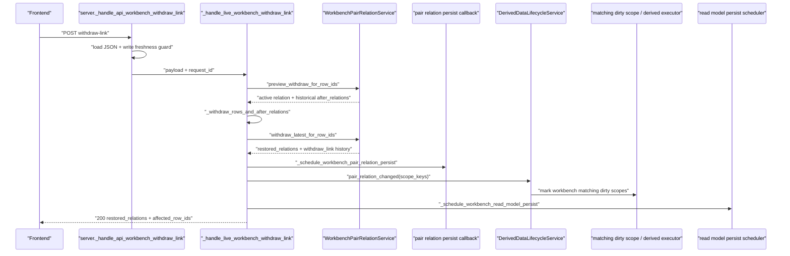
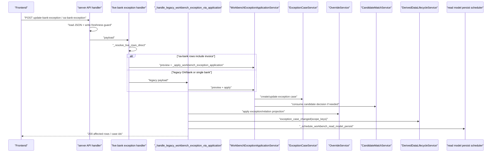
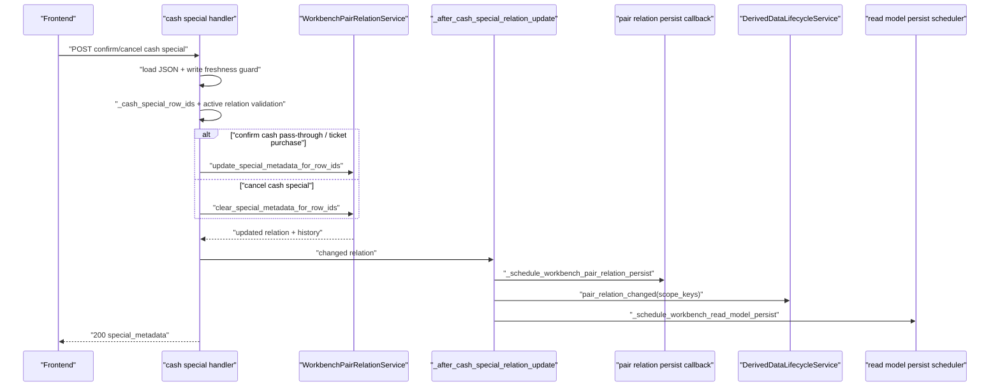
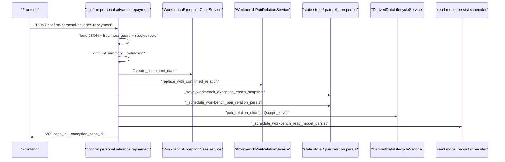
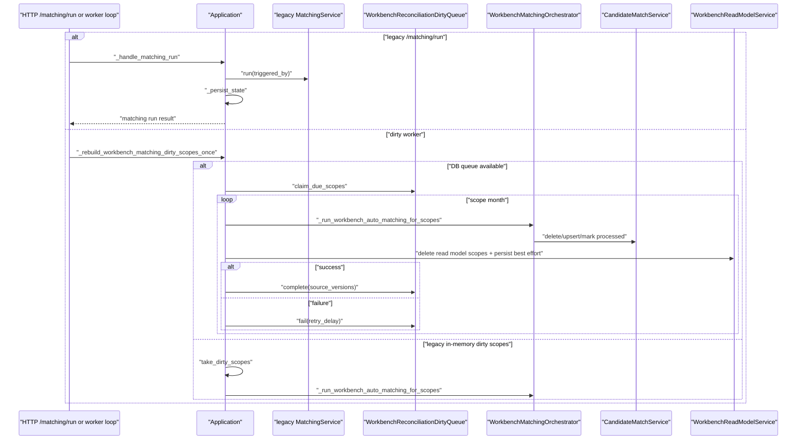

# Workbench Remaining Write Facade Discovery and Planning

对应 prompt：`PF-P015 - Workbench Remaining Write Facade Discovery and Planning`

状态：`verified`

本文档只记录 PF-P014 之后仍留在 `server.py` / runtime loop 中的 Workbench 写入口事实、调用链、测试缺口和 UoW readiness。本文档不包含业务代码改动、测试改动、UoW API 设计或实现方案。

## 1. Scope and Evidence

本轮读取和覆盖：

- 状态和规划文档：
  - `migration-state-log.md`
  - `refactor-prompts.md`
  - `workbench-writes-and-matching-plan.md`
  - `module-refactor-plan.md`
  - `platform-runtime-boundary-audit.md`
  - `architecture-inventory.md`
- CodeGraph 覆盖：
  - `codegraph_context`：Workbench remaining write facade discovery。
  - `codegraph_search`：remaining handler、live handler、dirty worker、`WorkbenchWriteFacade`。
  - `codegraph_callees`：withdraw、cash special、bank exception、OA-bank exception、personal advance repayment、matching dirty worker。
  - `codegraph_callers`：matching dirty scope rebuild。
  - `codegraph_explore`：`WorkbenchWriteFacade`、`WorkbenchActionService`、`WorkbenchOverrideService` 等相关服务。
- 精确源码读取：
  - `backend/src/fin_ops_platform/app/server.py`
  - `backend/src/fin_ops_platform/app/worker.py`
  - `backend/src/fin_ops_platform/services/workbench_pair_relation_service.py`
  - `backend/src/fin_ops_platform/services/workbench_exception_case_service.py`
  - `backend/src/fin_ops_platform/services/workbench_override_service.py`
  - Workbench 相关测试文件。

分支预检：

- 当前分支：`codex/workbench-remaining-write-facade-planning`。
- `refs/remotes/origin/main` 是当前 `HEAD` 的祖先。
- PF-P015 执行前工作区无未跟踪文件、无未提交 diff。

## 2. Remaining Write API Matrix

| API / Trigger | Handler / Entry | Primary service calls | Writes facts | Audit / History | Dirty scope / outbox / read model scheduling | Failure propagation | Idempotency / stale-write baseline | Current tests |
| --- | --- | --- | --- | --- | --- | --- | --- | --- |
| `POST /api/workbench/actions/withdraw-link/preview` | `_handle_api_workbench_withdraw_link_preview` -> `_preview_withdraw_link` | `WorkbenchPairRelationService.preview_withdraw_for_row_ids`、`_withdraw_rows_and_after_relations`、`_relation_groups`、`_amount_check_for_withdraw_preview` | No | No | No | `KeyError` -> `400` with relation history error; invalid payload -> `400` | Read-only preview. Staleness depends on active relation snapshot at request time. | `tests/test_workbench_v2_api.py` covers restoring previous relation, existing case group, OA attachment inferred relation, and no-history fallback preview. |
| `POST /api/workbench/actions/withdraw-link` | `_handle_api_workbench_withdraw_link` -> `_handle_live_workbench_withdraw_link` | `preview_withdraw_for_row_ids`、`_withdraw_rows_and_after_relations`、`withdraw_latest_for_row_ids`、`_schedule_workbench_pair_relation_persist`、`_execute_derived_data_lifecycle_event`、`_schedule_workbench_read_model_persist` | Pair relation facts: cancels latest active relation and restores previous/fallback active relations. | `WorkbenchPairRelationService.record_history(operation_type="withdraw_link")` | `pair_relation_changed` -> derived lifecycle; pair relation snapshot persist; read model persist scheduling. No single transaction with dirty scope/outbox. | Missing rollback around service mutation and later scheduling. If scheduling fails after relation mutation, behavior is not fully characterized. | Repeat withdraw likely becomes `workbench_pair_relation_not_found` or withdraws newly restored relation if selected row still belongs to restored relation. Stale caller can withdraw currently active relation, not necessarily the relation visible when preview was generated. | Strong scenario coverage exists, but duplicate submit, stale preview submit and scheduling failure tests are missing. |
| `POST /api/workbench/actions/confirm-cash-pass-through` | `_handle_api_workbench_confirm_cash_pass_through` | `_cash_special_row_ids`、`_active_relation_for_cash_special`、`_validate_cash_pass_through_relation`、`_cash_special_cash_amount`、`update_special_metadata_for_row_ids`、`_after_cash_special_relation_update` | Pair relation `special_metadata` updated with `cash_pass_through` and cost policy. | `record_history(operation_type="update_special_relation")` | `_after_cash_special_relation_update` schedules pair relation persist, `pair_relation_changed`, read model persist. | No local rollback around special metadata mutation and later scheduling. | Repeat request overwrites same metadata and appends another `update_special_relation` history entry; not explicitly locked. Stale write against relation changed by another user is not locked. | No targeted black-box tests found by pattern scan. |
| `POST /api/workbench/actions/confirm-cash-ticket-purchase` | `_handle_api_workbench_confirm_cash_ticket_purchase` | `_active_relation_for_cash_special`、`_validate_cash_ticket_purchase_relation`、`_required_non_negative_amount`、`update_special_metadata_for_row_ids`、`_after_cash_special_relation_update` | Pair relation `special_metadata` updated with `cash_ticket_purchase`、ticket/cash amount、project info、cost policy. | `record_history(operation_type="update_special_relation")` | Same as cash pass-through. | No local rollback around special metadata mutation and later scheduling. | Repeat request overwrites metadata and appends history. Stale write not locked. | No targeted black-box tests found by pattern scan. |
| `POST /api/workbench/actions/cancel-cash-special` | `_handle_api_workbench_cancel_cash_special` | `_cash_special_row_ids`、`clear_special_metadata_for_row_ids`、`_after_cash_special_relation_update` | Pair relation `special_metadata` cleared. | `record_history(operation_type="clear_special_relation")` | Same as cash special confirm. | No local rollback around metadata clear and later scheduling. | Repeat request likely records another clear history against already-cleared metadata; not locked. Stale write not locked. | No targeted black-box tests found by pattern scan. |
| `POST /api/workbench/actions/update-bank-exception` | `_handle_api_workbench_update_bank_exception` -> `_handle_live_workbench_update_bank_exception` -> `_handle_legacy_workbench_exception_via_application` | `_resolve_live_rows_direct`、`WorkbenchExceptionApplicationService.preview/apply` through `_apply_workbench_exception_application` | Exception case, row override; potentially candidate state through exception application. | Exception case history and application result. Legacy relation code/label stored in resolution payload. | `_apply_workbench_exception_application` persists cases/overrides/candidates, then `exception_case_changed`, optional pair relation persist, read model persist. | `_apply_workbench_exception_application` has in-memory snapshot rollback if persistence fails, but dirty/read model scheduling after persistence remains outside one UoW. | Duplicate behavior not locked. Stale write likely follows current row state after resolving live row, not caller's previous read model version. | One broad API test checks success payload and legacy resolution fields. Missing duplicate, stale/conflict, and persistence/scheduling failure tests. |
| `POST /api/workbench/actions/oa-bank-exception` | `_handle_api_workbench_oa_bank_exception` -> `_handle_live_workbench_oa_bank_exception` -> `_handle_legacy_workbench_exception_via_application` or `_handle_live_workbench_oa_bank_exception_with_invoice` | `_resolve_live_rows_direct`、`WorkbenchExceptionApplicationService.preview/apply`、`_apply_workbench_exception_application` | Exception case, row overrides, candidate state; invoice path can include pair relation produced by exception application. | Exception case history and application result. | `exception_case_changed`; optional pair relation persist; read model persist. | StatePersistenceError maps to service unavailable; scheduling failure after fact persistence remains outside one UoW. | Some conflict protection exists inside exception application for incompatible state, but duplicate-submit and stale previous read model submission are not fully locked. | Extensive tests cover invalidation, row resolution, cached read model rows, invoice-row compatibility and processed state. Missing duplicate submit and scheduling failure characterization. |
| `POST /api/workbench/actions/confirm-personal-advance-repayment` | `_handle_api_workbench_confirm_personal_advance_repayment` | `_resolve_live_rows_direct`、amount summary/validation helpers、`create_settlement_case`、`replace_with_confirmed_relation`、`_save_workbench_exception_cases_snapshot`、`_schedule_workbench_pair_relation_persist`、`_execute_derived_data_lifecycle_event`、`_schedule_workbench_read_model_persist` | Settlement exception case and pair relation with `relation_mode=personal_advance_repayment_settlement` and special metadata. | Exception case `history=[settled]`; pair relation `confirm_link` history. | `pair_relation_changed`; pair relation persist; read model persist. No outbox/dirty scope in same transaction. | In-memory rollback restores exception/pair service snapshots if case save throws. It does not prove atomic persistence with pair relation, dirty scope/outbox and read model scheduling. | Duplicate request likely creates a new settlement case and replaces active relation again. Stale write not locked. | Success and validation tests exist. Missing duplicate submit, stale conflict and persistence/scheduling failure tests. |
| `POST /matching/run` legacy | `_handle_matching_run` | `_matching_service.run`、`_persist_state` | Legacy matching run/result state, not Workbench candidate service. | Legacy matching run state only. | No Workbench dirty scope/outbox/read model scheduling. | Persist state failure path not specialized here. | Legacy endpoint; should not be folded into Workbench write facade. | `tests/test_workbench_api.py` only smoke-covers `/matching/run`. |
| HTTP process matching dirty worker | `start_workbench_matching_dirty_scope_worker` -> `_run_workbench_matching_dirty_scope_worker` -> `_rebuild_workbench_matching_dirty_scopes_once` | DB queue path: `_rebuild_workbench_matching_db_dirty_scopes_once`; legacy path: `WorkbenchMatchingDirtyScopeService.take_dirty_scopes` -> `_run_workbench_auto_matching_for_scopes` | Candidate state and dirty queue state; read models invalidated/deleted by matching run. | Matching run/candidate persistence; dirty queue complete/fail. | DB queue claim/complete/fail; `_run_workbench_auto_matching_for_scopes` invalidates read models and persists candidate/read model snapshots best-effort. | DB queue path catches per-scope failure and calls queue `fail`. Legacy path has no DB lease and relies on in-memory dirty service. | Worker has run lock/coalescing for overlapping scopes. Idempotency is service/queue-level, not API-level. | `test_workbench_dirty_queue_wiring.py` and `test_workbench_write_characterization.py` cover start-once, max iterations, claim/complete/fail. |
| Standalone worker matching loop | `app.worker._run_workbench_matching_dirty_queue_loop` | `Application._rebuild_workbench_matching_dirty_scopes_once` | Same as HTTP dirty worker. | Same as HTTP dirty worker. | Same as HTTP dirty worker. | Loop catches exceptions, logs warning JSON, continues until `max_iterations`. | Can run beside `RuntimeWorker`; deployment topology must prevent surprise duplicate workers unless DB queue lease is relied on. | Loop max-iteration behavior covered. Mixed runtime worker + matching loop contract is still mostly deployment/documentation level. |

## 3. Dynamic Runtime Sequence

### 3.1 Withdraw Link

### 3.2 Update Bank Exception / OA Bank Exception

### 3.3 Cash Special

### 3.4 Personal Advance Repayment

### 3.5 Matching Run / Dirty Worker

## 4. Facade Classification

| Entry | Classification | Reason |
| --- | --- | --- |
| `withdraw-link/preview` | `move_to_workbench_write_facade_next` | It is read-only but tightly coupled to withdraw submit. Move together with withdraw to preserve preview/submit parity. |
| `withdraw-link` | `move_to_workbench_write_facade_next` after targeted tests | Behavior is pair relation orchestration, similar to confirm/cancel already in facade. Existing tests are strong enough for main scenarios, but duplicate/stale/scheduling failure tests should be added before extraction. |
| cash special confirm/cancel | `needs_characterization_tests_first` | Writes pair relation special metadata and history but has little targeted API coverage. Extracting before tests would hide duplicate submit and stale write behavior. |
| `update-bank-exception` | `needs_characterization_tests_first` | Uses legacy exception application pipeline and has only broad success coverage. Needs duplicate/stale/failure tests before facade movement. |
| `oa-bank-exception` | `move_to_workbench_write_facade_next` after gap tests | Mechanically close to PF-P014 exception apply path and already has several behavior tests. Still needs duplicate-submit and scheduling failure characterization. |
| `confirm-personal-advance-repayment` | `needs_characterization_tests_first` | Creates both settlement exception case and pair relation. This is closer to a future UoW hotspot than a simple facade move. Needs failure/duplicate/stale tests first. |
| `/matching/run` | `separate_domain_or_not_workbench_write_facade` | This endpoint uses legacy `MatchingService`, not Workbench matching orchestrator. Keep out of Workbench write facade. |
| HTTP process matching dirty worker | `worker_or_runtime_boundary_only` | Runtime loop around matching dirty queue; not an HTTP write facade candidate. Future work belongs to worker/runtime boundary or matching subdomain planning. |
| standalone worker dirty loop | `worker_or_runtime_boundary_only` | Same boundary as HTTP dirty worker; should be validated through runtime/deployment and queue lease semantics, not Workbench write facade. |

## 5. Characterization Test Gap Matrix

| Entry | Existing coverage | Missing duplicate-submit tests | Missing stale/conflict tests | Missing persistence / rollback tests | Missing dirty/read model scheduling tests |
| --- | --- | --- | --- | --- | --- |
| `withdraw-link/preview` | Previous relation, existing case group, OA attachment inference, no-history fallback. | Not applicable for preview, but preview/submit parity under stale relation is missing. | Yes: preview old relation, then relation changes, then submit. | Not applicable. | Not applicable. |
| `withdraw-link` | Main restore/cancel cases and history. | Yes: repeated withdraw on same rows. | Yes: submit after preview against replaced relation. | Yes: pair relation persist / lifecycle / read model scheduling failure after mutation. | Yes: assert changed scopes and action name under failure and success. |
| cash pass-through | No targeted tests found. | Yes. | Yes. | Yes. | Yes. |
| cash ticket purchase | No targeted tests found. | Yes. | Yes. | Yes. | Yes. |
| cancel cash special | No targeted tests found. | Yes. | Yes. | Yes. | Yes. |
| update bank exception | Broad success and resolution payload fields. | Yes. | Yes. | Yes. | Yes. |
| OA bank exception | Many tests for invalidation, cached rows, invoice compatibility, processed state. | Yes. | Partial only; needs stale previous read model submission. | Yes. | Mostly success scheduling exists; failure propagation is missing. |
| personal advance repayment | Success + validation failures. | Yes. | Yes. | Yes: exception case save vs pair relation scheduling atomicity. | Yes. |
| matching dirty worker | DB claim/complete/fail, start-once, max iteration. | Not API duplicate. | Concurrency and overlapping worker topology still partial. | Failure queue path covered; legacy fallback less strong. | Source version and read model invalidation covered indirectly, not complete for mixed RuntimeWorker mode. |
| `/matching/run` | Smoke only. | Out of Workbench facade scope. | Out of Workbench facade scope. | Legacy endpoint risk only. | Not Workbench read model path. |

## 6. UoW Readiness Assessment

### Facts Future UoW Must Cover

- Pair relation facts:
  - active/cancelled relation state.
  - relation history for `withdraw_link`、cash special update/clear、personal advance repayment.
  - special metadata and amount check.
- Exception facts:
  - exception case creation/update, including settlement cases.
  - exception row index / row-case mapping where applicable.
  - exception application result and candidate consumption.
- Override facts:
  - row overrides from exception/bank exception/OA-bank exception paths.
- Candidate facts:
  - best-effort candidate match consumption currently happens inside exception application persistence path.
- Matching dirty queue facts:
  - DB-backed `job.workbench_matching_dirty_scopes` claim/complete/fail are already separate runtime facts.
  - Write-side dirty marking should eventually be tied to the business facts commit.

### Audit / History Future UoW Must Cover

- Pair relation history rows generated by `record_history`.
- Exception case history arrays/actions.
- Legacy action metadata currently embedded in exception application payload:
  - `legacy_relation_code`
  - `legacy_relation_label`
  - `legacy_exception_code`
  - `legacy_exception_label`
- Request metadata: actor/request_id/action_name should be made explicit before UoW, because current paths often use `"system"`.

### Dirty Scope / Outbox Future UoW Must Cover

- Workbench matching dirty scopes produced by `pair_relation_changed` and `exception_case_changed`.
- Read model refresh dirty scopes for affected month and `all`.
- Outbox event that wakes runtime workers or downstream read model refresh.
- Source versions for matching and read model freshness.

Current blocker：`_execute_derived_data_lifecycle_event` and `_schedule_workbench_read_model_persist` are post-fact side effects. They can be safe individually, but they are not proven atomic with Workbench facts.

### Read Model Scheduling That Should Move Behind Dirty Scope / Outbox

- `withdraw-link`: `_schedule_workbench_read_model_persist` should eventually be driven from committed dirty scope/outbox.
- cash special: `_after_cash_special_relation_update` should not schedule read model directly after in-memory mutation.
- bank/OA-bank exception: `_apply_workbench_exception_application` should not schedule read model directly after cases/overrides/candidates are persisted.
- personal advance repayment: read model scheduling should happen from the same committed event that covers exception case + pair relation.

### Reusable Primitives

- `RuntimeQueueRepository.enqueue_read_model_refresh()` already writes `job.read_model_dirty_scopes` and `job.outbox_events` in one transaction with monotonic `source_version`.
- `PostgresCoreRepository` has transaction helper patterns noted in the platform audit.
- `WorkbenchReconciliationDirtyQueue` wraps DB-backed matching dirty queue claim/complete/fail and source versions.
- `PostgresWorkbenchRepository.save_workbench_pair_relations(...)` writes relation/history snapshots, but current App Shell still coordinates it outside a broader UoW.

### Current Blockers

- In-memory services own mutation first, persistence second:
  - `WorkbenchPairRelationService`
  - `WorkbenchExceptionCaseService`
  - `WorkbenchOverrideService`
  - `WorkbenchCandidateMatchService`
- Snapshot/persist callbacks still live in `Application`.
- Scheduling is split:
  - pair relation snapshot persist
  - exception/override/candidate snapshot persist
  - derived lifecycle dirty marking
  - read model persist
- Async/background switches can make write response precede persistence or read model availability.
- Test gaps remain for cash special, duplicate submit, stale preview submit, scheduling failure and mixed worker topology.
- Actor/auth context is still not consistently explicit on all write operations.
- `/matching/run` is a legacy endpoint and should not contaminate Workbench write UoW design.

## 7. Next Prompt Recommendation

下一条建议 prompt：

`PF-P016 - Workbench Remaining Write Characterization Tests`

理由：

- 直接继续 facade extraction 会把未锁定的 cash special、bank exception、personal advance repayment 行为搬进新边界，测试不足。
- 直接进入 UoW design 会缺少重复提交、旧视图提交、调度失败和 persistence rollback 的当前行为基线。
- PF-P016 应优先补：
  - withdraw preview -> stale submit 行为。
  - withdraw duplicate submit 行为。
  - cash special 三个入口的 success、duplicate、stale/conflict、scheduling failure。
  - update-bank-exception duplicate/stale/failure。
  - OA-bank exception duplicate/failure。
  - personal advance repayment duplicate/stale/persistence failure。

用户已确认 PF-P015 `verified`。PF-P016 已生成并审查，等待执行。

PF-P016 仍不应该修复 stale write 或实现 UoW。它的产物应是黑盒 characterization tests 和必要的文档回写。PF-P016 verified 后，才适合决定 PF-P017 是 remaining facade extraction 还是 Workbench Unit of Work Boundary Design。
