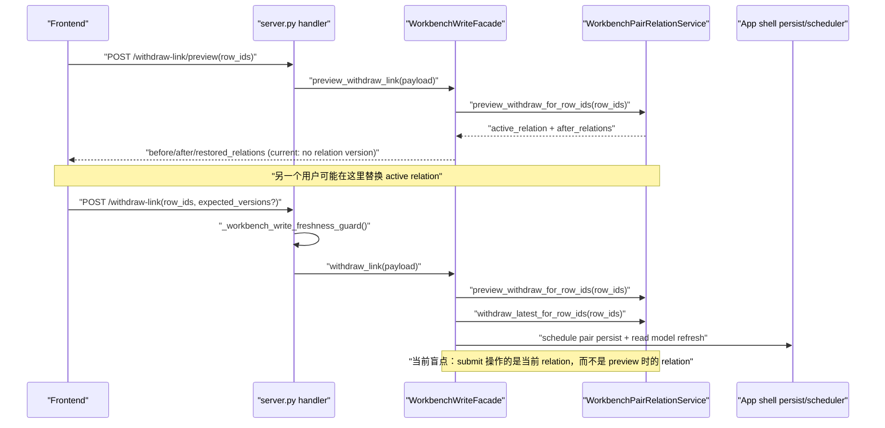
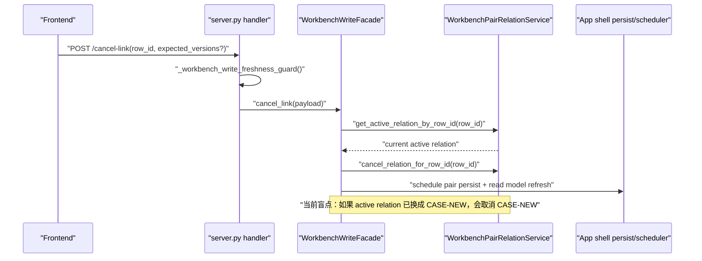
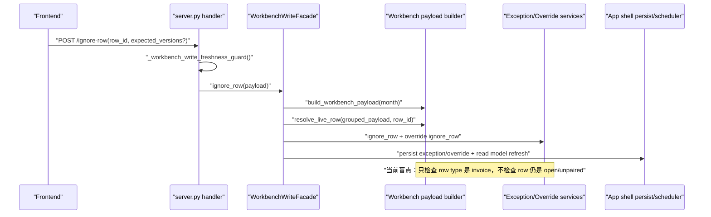
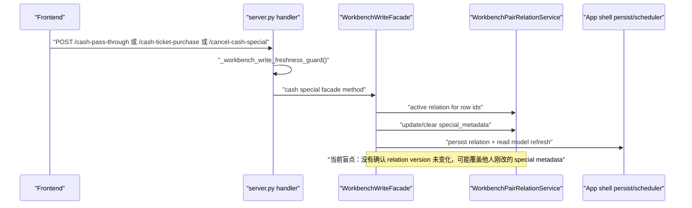

# Workbench Stale Write Boundary Plan

## 状态

- Prompt：`PF-P027 - Workbench Stale Write Boundary Discovery and Planning`
- 状态：`implemented`，等待用户确认后才能标记 `verified`
- 日期：2026-05-31
- 分支：`codex/workbench-stale-write-planning`

## 范围

本文档只规划 Workbench 写路径的 stale write / optimistic locking 边界，不修改生产代码、不修改测试、不迁移真实 Workbench 写 API。

本轮覆盖的写入口：

- withdraw preview / withdraw submit
- cancel link
- ignore row
- cash special：cash pass-through、cash ticket purchase、cancel cash special

## 证据来源

### 读取文件

- `docs/architecture/backend-refactor/migration-state-log.md`
- `docs/architecture/backend-refactor/refactor-prompts.md`
- `docs/architecture/backend-refactor/workbench-uow-integration-plan.md`
- `docs/architecture/backend-refactor/workbench-write-uow-boundary-design.md`
- `docs/architecture/backend-refactor/workbench-writes-and-matching-plan.md`
- `docs/architecture/backend-refactor/read-model-and-external-services.md`
- `tests/test_workbench_stale_write_contract.py`
- `tests/test_workbench_uow_contract.py`
- `backend/src/fin_ops_platform/app/server.py`
- `backend/src/fin_ops_platform/services/workbench_write_facade.py`
- `backend/src/fin_ops_platform/services/workbench_uow.py`
- `backend/src/fin_ops_platform/services/workbench_pair_relation_service.py`
- `backend/src/fin_ops_platform/services/workbench_override_service.py`

### CodeGraph 覆盖

已使用 CodeGraph 梳理以下调用边界：

- `_handle_api_workbench_withdraw_link_preview` -> `WorkbenchWriteFacade.preview_withdraw_link`
- `_handle_api_workbench_withdraw_link` -> `_workbench_write_freshness_guard` -> `WorkbenchWriteFacade.withdraw_link`
- `_handle_api_workbench_cancel_link` -> `_workbench_write_freshness_guard` -> `_handle_live_workbench_cancel_link` -> `WorkbenchWriteFacade.cancel_link`
- `_handle_api_workbench_ignore_row` -> `_workbench_write_freshness_guard` -> `_handle_workbench_ignore_row_payload` -> `WorkbenchWriteFacade.ignore_row`
- `_handle_api_workbench_confirm_cash_pass_through` -> `_workbench_write_freshness_guard` -> `WorkbenchWriteFacade.confirm_cash_pass_through`
- `_handle_api_workbench_confirm_cash_ticket_purchase` -> `_workbench_write_freshness_guard` -> `WorkbenchWriteFacade.confirm_cash_ticket_purchase`
- `_handle_api_workbench_cancel_cash_special` -> `_workbench_write_freshness_guard` -> `WorkbenchWriteFacade.cancel_cash_special`
- `WorkbenchWriteUnitOfWork.run()` 当前已覆盖 transaction、dirty/outbox writer 和 idempotency replay/reserve/commit skeleton，但尚未执行 stale precondition。

## 当前结论

当前 `_workbench_write_freshness_guard()` 只检查 OA sync dirty scopes / rebuild scheduled，返回 `workbench_stale`。它不是 facts 级乐观锁，不能阻止用户基于旧页面状态提交写操作。

当前 stale write 风险点集中在：

- facade 在执行写入前读取“当前 active relation / current row”，但没有和用户看到的旧 relation/row version 做比较。
- withdraw submit 会重新 preview 当前 relation，然后撤销当前 relation，而不是验证 submit 是否仍对应 preview 时看到的 relation。
- cancel link 按 row id 查当前 active relation 并取消，可能取消掉另一个用户刚创建的新 relation。
- ignore row 重新构建当前 payload 并忽略 invoice row，但没有确认该 row 仍是 open / unpaired。
- cash special 按 row ids 查当前 active relation 并更新 special metadata，可能覆盖已经变化的 relation。

## ExpectedFailure Inventory

| 测试 | 当前测试期望 | 当前生产行为 | 目标行为 | 需要的输入/版本身份 | 最终事实源 | 是否需要真实 API migration |
| --- | --- | --- | --- | --- | --- | --- |
| `test_withdraw_preview_exposes_relation_identity_and_version_for_submit_expected_versions` | preview response 暴露 `active_relation.case_id`、`active_relation.version` 和 `submit_expected_versions` | preview 只返回 before/after/restored_relations，不暴露稳定 submit 版本契约 | preview 给前端一个可原样带回 submit 的 relation identity/version | `relation:<case_id>` -> relation version | active pair relation facts / repository current-state reader | 不一定。可先改 preview response contract，但 submit 拒绝 stale 需要后续 API migration |
| `test_target_workbench_write_conflict_response_shape_is_stable` | 存在 `WorkbenchWriteConflict`，可转为 409 response payload | 当前没有统一 conflict primitive | 统一 stale write 409 payload：`workbench_write_conflict` | action、reason、expected、actual、message | UoW / write service 检查结果 | 否。可先用 pure primitive 转绿 |
| `test_withdraw_submit_rejects_stale_preview_relation_version` | UoW 在 handler 前拒绝 stale relation version，handler 不执行 | UoW 不读取 expected_versions，不做 precondition | 如果 submit 携带的 preview relation version 已变化，返回 409，不撤销当前 relation | `relation:<case_id>` -> relation version | transaction 内 active relation facts | 是。最终需要 withdraw submit 接入 UoW precondition |
| `test_cancel_link_rejects_stale_replaced_relation` | UoW 在 handler 前拒绝 active relation 已从 CASE-OLD 变为 CASE-NEW | cancel 按 row id 取消当前 active relation | 如果用户要取消的 relation 与当前 active relation 不一致，返回 409，不取消新 relation | `relation:<case_id>` -> relation version；row id -> active relation identity | transaction 内 active relation facts | 是 |
| `test_ignore_row_rejects_when_row_already_confirmed` | UoW 在 handler 前拒绝 row 已从 open 变为 confirmed/paired | ignore 以当前 grouped payload 查 row，只要求 type 是 invoice | 如果 row 已被确认/关联，不创建 ignored case，不写 override | `row:<row_id>` -> open/status token；必要时 `relation:<case_id>` absent | transaction 内 row/relation facts，而不是 read model | 是 |
| `test_cash_special_rejects_changed_relation_version` | UoW 在 handler 前拒绝 cash relation version 已变化 | cash special 按 row ids 查当前 active relation 并更新 metadata | 如果 active relation version 与前端看到的不一致，返回 409，不覆盖 metadata | `relation:<case_id>` -> relation version | transaction 内 active relation facts | 是 |

## 动态运行时序

### Withdraw Preview -> Submit Stale Relation Version



目标：preview 必须暴露 stable relation identity/version；submit 必须在 UoW transaction 内验证当前 active relation 仍等于 expected relation/version，否则返回 409。

### Cancel Link Stale Replaced Relation



目标：用户提交时必须携带或后端兼容推导 `expected_versions`。UoW 在 transaction 内读取 row 当前 active relation identity/version；不一致时直接 409，handler 不执行。

### Ignore Row After Already Confirmed



目标：ignore 前必须在 transaction 内确认 row 仍处于可忽略状态，且没有被确认进 active relation。

### Cash Special Changed Relation Version



目标：cash special 类写入必须验证 active relation identity/version，一致才允许更新 metadata。

## `expected_versions` 契约

### 统一形态

```json
{
  "expected_versions": {
    "relation:CASE-123": 2,
    "row:invoice-001": "open",
    "case:EX-001": 4,
    "read_model:2026-05": 17
  }
}
```

### Key shape

| Key | Value | 用途 |
| --- | --- | --- |
| `relation:<case_id>` | integer relation version | 防止 cancel/withdraw/cash special 操作到已替换 relation |
| `row:<row_id>` | status token 或未来 row version | 防止 ignore 已确认/已忽略/已关联的 row |
| `case:<case_id>` | integer exception case version | 后续异常 case apply/cancel 的乐观锁，PF-P027 不迁移 |
| `read_model:<scope_key>` | active generation 或 source_version | 只用于前端提示和兼容校验；不能作为最终写入合法性事实源 |

### 兼容策略

- 第一阶段允许 `expected_versions` 可选，避免立即破坏旧前端。
- 对已能在后端明确发现的冲突，应优先返回 409；不能因为缺少前端字段而继续扩大盲写。
- 高风险写路径迁入 UoW 后，应逐步要求前端携带 expected_versions；在强制前必须先有兼容期和前端契约更新。
- read model 可以承载用户看到的版本身份，但最终写入判断必须回到 transaction 内 facts repository。

### PF-P029 执行补充

PF-P029 已让 withdraw preview 暴露 `active_relation.case_id`、`active_relation.version` 和 `submit_expected_versions`。当前 in-memory pair relation facts 尚未提供 durable facts-level relation version，因此 preview 使用兼容期的 preview-only integer token。这个 token 只用于建立前端可回传的 submit contract，不代表已经具备 facts 级 optimistic locking。

后续实现 submit stale rejection 时，必须用 transaction-bound facts current-state reader 提供真实 relation version 或等价 identity；不得把 PF-P029 的 preview-only fallback 当作最终并发控制依据。

### PF-P030 执行补充

PF-P030 已在 UoW 层引入 fake/in-memory stale precondition skeleton。当前实现基于 `command.expected_versions` 与 `command.payload` 中的 `current_relation_*` / `current_row_status` 做 target contract 校验，可以表达 relation version mismatch、relation identity changed 和 row status changed，并在 handler 执行前抛出 `WorkbenchWriteConflict`。

该 skeleton 仍不是生产 facts reader。真实 Workbench API 还没有迁移进这个 precondition，HTTP 写路径仍保持 PF-P012/PF-P016/PF-P017/PF-P029 之前锁定的当前行为。后续迁移真实 submit/cancel/ignore/cash special 时，必须把当前 command-carried state 替换为 transaction-bound PostgreSQL facts current-state reader。

### PF-P031 执行补充

PF-P031 已完成第一条真实写 API stale guard 迁移：`cancel link`。

当前行为：

- 如果 `cancel-link` 请求没有携带 `expected_versions`，继续走 legacy 行为；重复 cancel 仍按当前 contract 返回 404。
- 如果请求携带 `expected_versions`，且当前 row active relation 已从 expected relation 替换为其它 relation，返回 `409 workbench_write_conflict`。
- 冲突在 mutation 前返回，不会取消新的 active relation，也不会触发 pair relation / read model persistence scheduling。

限制：

- 本轮只使用当前 `WorkbenchPairRelationService` active relation 作为 facts/service state。
- 当前仍没有 durable PostgreSQL relation version；因此 PF-P031 主要完成 relation identity mismatch guard，不能视为完整 durable optimistic locking。
- `ignore row`、`cash special`、`withdraw submit` 仍未迁移。

## Conflict Primitive Boundary

目标 primitive：`WorkbenchWriteConflict`。

建议放置位置：`backend/src/fin_ops_platform/services/workbench_uow.py` 或相邻的 `workbench_write_conflict.py`。更推荐独立 `workbench_write_conflict.py`，原因是：

- 它属于 Workbench write domain primitive，不是 HTTP handler 逻辑。
- UoW、Facade 和后续 repository precondition 都需要使用同一个 conflict 类型。
- 它应和 idempotency conflict 分离，避免把“请求重复/指纹冲突”和“业务状态已变化”混在一起。

目标字段：

- `action`
- `reason`
- `expected`
- `actual`
- `message`
- `status_code = 409`

目标 response：

```json
{
  "error": "workbench_write_conflict",
  "message": "工作台数据已变化，请刷新后重试。",
  "conflict": {
    "action": "cancel_link",
    "reason": "stale_relation_version",
    "expected": {"relation:CASE-OLD": 2},
    "actual": {"relation:CASE-NEW": 5}
  }
}
```

### 与 Idempotency Conflict 的区别

- `WorkbenchIdempotencyKeyConflict`：同一个 idempotency key 被不同 payload/fingerprint 复用，是请求去重契约冲突。
- `WorkbenchWriteConflict`：用户提交时数据库 facts 已经和用户看到的状态不一致，是业务状态冲突。

两者都可能返回 409，但 error code、reason 和修复动作不同。

## Repository / UoW Precondition Boundary

### 必须在 UoW transaction 内完成

- 按 row id / case id 读取当前 active relation identity/version。
- 判断 expected relation 是否仍 active。
- 判断 row 是否仍处于可写状态，例如 invoice row 是否仍 open/unpaired。
- 判断 cash special relation metadata 的目标 relation 是否仍匹配。
- 通过后才执行 handler mutation。

### 不能作为最终事实源

- SQL read model。
- Redis cache。
- 前端传回的 read model generation。
- server.py 中临时构建的 grouped payload。

这些可以用于用户提示、兼容字段或性能优化，但不能决定写入是否合法。

### 需要的未来 repository surface

建议后续以 port/adapter 方式逐步补齐：

- `get_active_relation_identity_for_row(row_id) -> {case_id, version, row_ids, status}`
- `get_relation_identity(case_id) -> {case_id, version, status}`
- `get_row_write_state(row_id) -> {row_id, type, status, active_relation_case_id}`
- `assert_expected_versions(expected_versions, action, row_ids/case_ids) -> None | WorkbenchWriteConflict`

这些方法应由 transaction-bound repository 实现，并由 `WorkbenchWriteUnitOfWork.run()` 在 handler 前调用。

## 测试转绿顺序

不要一次性迁移所有 Workbench 写 API。推荐顺序：

1. `PF-P028 - Workbench Write Conflict Primitive and Expected Versions Contract`
   - 只实现 `WorkbenchWriteConflict` primitive 和 response payload contract。
   - 目标转绿：`test_target_workbench_write_conflict_response_shape_is_stable`。
   - 不迁移真实 API。
2. `PF-P029 - Workbench Withdraw Preview Version Identity Contract`
   - 让 withdraw preview response 暴露 `active_relation` identity/version 和 `submit_expected_versions`。
   - 目标转绿：`test_withdraw_preview_exposes_relation_identity_and_version_for_submit_expected_versions`。
   - 不要求 submit 立即拒绝 stale。
3. `PF-P030 - Workbench UoW Stale Precondition Port Skeleton`
   - 在 UoW 中引入 fake/in-memory precondition port，先让 target UoW contract 可表达。
   - 目标逐步转绿 UoW expectedFailure，但仍不迁移真实 API。
4. `PF-P031 - Workbench Cancel Link Stale Guard Migration`
   - 第一条真实写 API 迁移候选，因为 cancel link 风险清晰：row id 当前 relation 已替换时必须 409。
   - 必须带 characterization + UoW transaction-bound facts check。
   - 状态：已实现 relation identity mismatch guard；等待 PF-P031-MG 合入。
5. `PF-P032 - Workbench Ignore Row Stale Guard Migration`
   - 处理 row 已 confirmed/paired 时仍 ignore 的风险。
   - 状态：已验证 expected row open guard；请求携带 `expected_versions` 且当前 invoice row 已有 active relation 时返回 `409 workbench_write_conflict`，不创建 ignored case/override。
   - MG：不单独执行，延后到累计 MG；`PF-P032-MG deferred; cumulative MG will cover PF-P032 through PF-P034`。
6. `PF-P033 - Workbench Cash Special Stale Guard Migration`
   - 覆盖 pass-through、ticket purchase、cancel special 的 relation version guard。
   - 状态：已验证 relation identity mismatch guard；三个 cash special 入口在携带 stale `expected_versions` 时返回 `409 workbench_write_conflict`，不更新或清空 `special_metadata`。
   - MG：不单独执行，延后到累计 MG；最终覆盖 PF-P032 到 PF-P034。
7. `PF-P034 - Workbench Withdraw Submit Stale Guard Migration`
   - 最后处理 withdraw submit，因为它涉及 preview/submit 两阶段契约、撤销当前 relation 和恢复历史 relation，风险最高。
   - 状态：已生成并审查，等待执行。

## 下一步建议

下一条 prompt 建议为：

`PF-P034 - Workbench Withdraw Submit Stale Guard Migration`

PF-P033 已完成实现和验证。按当前策略，PF-P032/PF-P033 MG 仍延后，最终累计 MG 将覆盖 PF-P032 到 PF-P034。下一步应执行 PF-P034，只迁移 `withdraw submit` stale guard；不得扩大到其它 Workbench 写路径。
