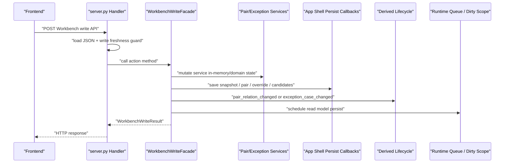
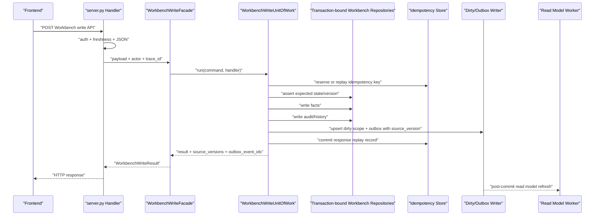
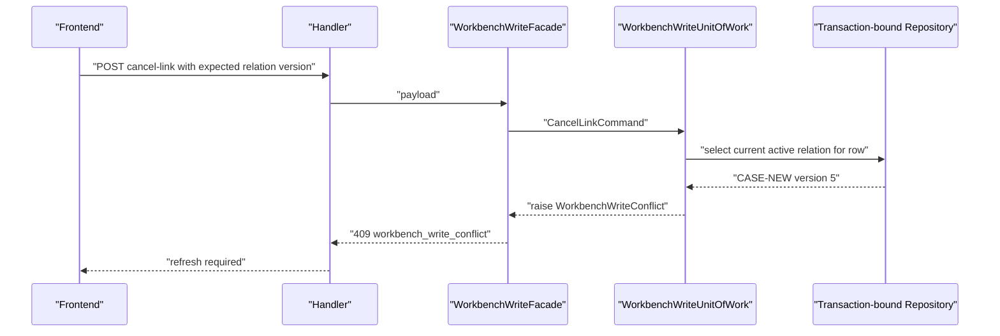
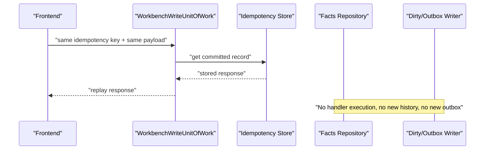

# Workbench UoW Integration Plan

对应 prompt：`PF-P022 - Workbench Write UoW Integration Planning / Stale Write and Idempotency Strategy`

状态：`verified`

本文档只规划 Workbench 真实写 API 如何接入 `WorkbenchWriteUnitOfWork`，并定义 stale write、durable idempotency、schema readiness 和后续测试转绿顺序。本文档不修改生产代码、不修改测试、不新增 SQL migration。

## 1. Executive Summary

PF-P021 已经建立最小 UoW skeleton：

- `WorkbenchWriteUnitOfWork.run(command, handler)` 打开 PostgreSQL transaction。
- `run()` 创建 transaction-bound repository context。
- handler 返回 `affected_scope_keys` 后，UoW 在同一 transaction 内调用 transaction-bound dirty/outbox writer。
- `run()` 返回 `source_versions` 与 `outbox_event_ids`。

但真实 Workbench 写 API 还没有接入 UoW：

- HTTP handler 仍进入 `WorkbenchWriteFacade`。
- `WorkbenchWriteFacade` 仍通过 App Shell callback 写 facts、snapshot、derived lifecycle 和 read model scheduling。
- Stale write / optimistic locking 未实现。
- Durable idempotency replay 未实现。
- 7 个目标契约测试仍以 `unittest.expectedFailure` 保留在默认 CI 中。

结论：下一阶段不能直接一次性迁移全部写路径。生产级顺序应是：

1. 先补最小 stale write / idempotency contract tests 与 schema 草案。
2. 再实现 UoW 层的 stale precondition 与 idempotency store。
3. 先迁移 `confirm_link` / `cancel_link` 这组最小 pair relation 写路径。
4. 再迁移 `ignore_row` / exception apply。
5. 最后迁移 cash special、withdraw、personal advance repayment 等复合写路径。

## 2. Evidence

### 2.1 Documents Read

- `docs/architecture/backend-refactor/migration-state-log.md`
- `docs/architecture/backend-refactor/refactor-prompts.md`
- `docs/architecture/backend-refactor/workbench-write-uow-boundary-design.md`
- `docs/architecture/backend-refactor/workbench-writes-and-matching-plan.md`
- `docs/architecture/backend-refactor/platform-runtime-boundary-audit.md`
- `docs/architecture/backend-refactor/read-model-and-external-services.md`

### 2.2 Code and Tests Read

- `backend/src/fin_ops_platform/app/server.py`
- `backend/src/fin_ops_platform/services/workbench_write_facade.py`
- `backend/src/fin_ops_platform/services/workbench_uow.py`
- `backend/src/fin_ops_platform/services/runtime_queue.py`
- `backend/src/fin_ops_platform/services/postgres_repositories/workbench.py`
- `tests/test_workbench_uow_contract.py`
- `tests/test_workbench_write_characterization.py`
- `tests/test_workbench_dirty_queue_wiring.py`

### 2.3 CodeGraph Coverage

Used CodeGraph for structural analysis:

- `codegraph_context` for Workbench write UoW integration planning.
- `codegraph_explore` for `WorkbenchWriteFacade`, `WorkbenchWriteUnitOfWork`, `RuntimeQueueRepository`, and UoW contract tests.
- `codegraph_trace` confirmed `_handle_api_workbench_confirm_link` reaches facade through dynamic dispatch via `_handle_live_workbench_confirm_link`.
- `codegraph_node` confirmed:
  - `_handle_api_workbench_confirm_link` calls `_workbench_write_freshness_guard()` then `_handle_live_workbench_confirm_link()`.
  - `_handle_live_workbench_confirm_link` calls `self._workbench_write_facade().confirm_link(...)`.
  - `WorkbenchWriteUnitOfWork.run()` currently opens transaction, creates repository context, calls handler, then writes dirty/outbox events for scope keys.

## 3. Current Runtime Sequence

### 3.1 Current Write Path



Current risk:

- Facts persistence can succeed before dirty/outbox scheduling fails.
- Some paths use snapshot restore for persistence failures, but this is not a database transaction.
- Stale write is only partially constrained by current service logic.
- Duplicate submits have inconsistent semantics.

### 3.2 Target UoW Write Path



Target rule: facts, audit/history, dirty scope, outbox, source_version, and idempotency completion must share one PostgreSQL commit for each migrated write action.

## 4. Real Write API Integration Map

| Action | Current HTTP entry | Current facade method | Current facts mutation | Current scheduling path | Target UoW command | Target response contract |
| --- | --- | --- | --- | --- | --- | --- |
| Confirm link | `_handle_api_workbench_confirm_link` -> `_handle_live_workbench_confirm_link` | `confirm_link` | `WorkbenchPairRelationService.replace_with_confirmed_relation` writes relation/history through snapshot persist | `_schedule_pair_relation_persist`, `_consume_reconciliation_decisions`, `_invalidate_and_schedule_read_model` | `ConfirmLinkCommand` with `row_ids`, `month`, optional `case_id`, note, actor, trace id, idempotency key, expected relation/row versions | Keep existing `success`, `action`, `month`, `case_id`, `affected_row_ids`, `affected_months`, `amount_check`, `message`; add `source_versions` and `outbox_event_ids` only after compatibility test locks response |
| Cancel link | `_handle_api_workbench_cancel_link` -> `_handle_live_workbench_cancel_link` | `cancel_link` | `cancel_relation_for_row_id` mutates active relation status/history | `_schedule_pair_relation_persist`, `_invalidate_and_schedule_read_model` | `CancelLinkCommand` with row id, expected active relation id/version, actor, trace id, idempotency key | Keep existing 404 when no relation unless stale contract explicitly changes it to 409 for expected relation mismatch |
| Withdraw submit | `_handle_api_workbench_withdraw_link` | `withdraw_link` | `preview_withdraw_for_row_ids` then `withdraw_latest_for_row_ids`; restores previous relation set | `_schedule_pair_relation_persist`, `_invalidate_and_schedule_read_model` | `WithdrawLinkCommand` with row ids plus previewed active relation id/version | Must reject if active relation changed since preview |
| Cash pass-through | `_handle_api_workbench_confirm_cash_pass_through` | `confirm_cash_pass_through` | `update_special_metadata_for_row_ids` appends relation history | `_after_cash_special_relation_update` -> pair persist + lifecycle + read model scheduling | `ConfirmCashPassThroughCommand` with expected relation id/version and idempotency key | Keep existing special metadata payload; reject changed relation version |
| Cash ticket purchase | `_handle_api_workbench_confirm_cash_ticket_purchase` | `confirm_cash_ticket_purchase` | Same relation metadata path with ticket/project payload | Same as cash pass-through | `ConfirmCashTicketPurchaseCommand` with expected relation id/version and idempotency key | Same as pass-through with ticket fields |
| Cancel cash special | `_handle_api_workbench_cancel_cash_special` | `cancel_cash_special` | `clear_special_metadata_for_row_ids` appends relation history | Same as cash pass-through | `CancelCashSpecialCommand` with expected relation id/version and idempotency key | Keep existing payload and ensure no duplicate history under same key |
| Mark exception | `_handle_api_workbench_mark_exception` -> `_handle_live_workbench_mark_exception` | `mark_exception` -> `_legacy_exception_result` -> `_apply_exception_payload` | `WorkbenchExceptionApplicationService.apply`, exception case, override, candidates, optional relation | `_execute_derived_data_lifecycle_event`, optional `_schedule_pair_relation_persist`, `_schedule_read_model_persist` | `MarkExceptionCommand` as legacy compatibility wrapper around `ExceptionApplyCommand` | Preserve legacy error codes and response shape |
| Exception apply | `_handle_api_workbench_exception_apply` | `apply_exception` -> `_apply_exception_payload` | Exception case, override, candidate resolution, optional relation | Same as mark exception | `ExceptionApplyCommand` with actor, scenario/action, expected row/relation/case versions, idempotency key | Service idempotency must become durable and transaction-bound |
| Cancel exception | `_handle_api_workbench_cancel_exception` -> `_handle_live_workbench_cancel_exception` | `cancel_exception` | `cancel_exception_cases` + `override_service.cancel_exception` | `_persist_exception_and_override_change` -> lifecycle + read model scheduling | `CancelExceptionCommand` with expected case id/version | Keep current success/404 behavior until a target test changes duplicate semantics |
| Ignore row | `_handle_api_workbench_ignore_row` -> `_handle_workbench_ignore_row_payload` | `ignore_row` | `exception_case_service.ignore_row` + `override_service.ignore_row` | `_persist_exception_and_override_change` -> lifecycle + read model scheduling | `IgnoreRowCommand` with expected row status/version and idempotency key | Must reject if row has become confirmed/paired since user saw it |
| Unignore row | `_handle_api_workbench_unignore_row` -> `_handle_workbench_unignore_row_payload` | `unignore_row` | `exception_case_service.unignore_row` + `override_service.unignore_row` | `_persist_exception_and_override_change` -> lifecycle + read model scheduling | `UnignoreRowCommand` with expected ignored case id/version | Keep current 404 for missing ignored row until target tests say otherwise |
| Update bank exception | `_handle_api_workbench_update_bank_exception` | `update_bank_exception` -> `_legacy_exception_result` | Legacy exception apply path | Same as exception apply | `UpdateBankExceptionCommand` as compatibility wrapper around exception apply | Preserve legacy error code and bank-only validation |
| OA-bank exception | `_handle_api_workbench_oa_bank_exception` | `oa_bank_exception` | Legacy exception apply or invoice compatibility path | Same as exception apply | `OaBankExceptionCommand` wrapping exception apply | Preserve invoice compatibility response shape |
| Personal advance repayment | `_handle_api_workbench_confirm_personal_advance_repayment` | `confirm_personal_advance_repayment` | Creates settlement exception case then confirmed pair relation | `save_exception_cases_snapshot`, `_schedule_pair_relation_persist`, lifecycle, read model scheduling | `ConfirmPersonalAdvanceRepaymentCommand` with expected no-conflicting case/relation and idempotency key | Case and relation must commit or rollback together |

## 5. Transaction Boundary Map

| Action group | Same transaction must include | Current blocker | First safe migration target |
| --- | --- | --- | --- |
| Pair relation confirm/cancel | `app.workbench_pair_relations`, pair relation history, reconciliation decision consumption if still same business fact, dirty scope, outbox, source_version, idempotency record | Current `schedule_pair_relation_persist` is an App Shell callback; relation service mutates snapshot first | `confirm_link` and `cancel_link` |
| Withdraw | Pair relation cancellation, restored relation history, dirty scope, outbox, source_version, idempotency record | Submit currently re-previews current active relation and does not assert preview version | Add preview relation version contract before migration |
| Cash special | Relation metadata, relation history, dirty scope, outbox, source_version, idempotency record | No expected relation version; duplicate history currently possible | After pair relation UoW, reuse relation version guard |
| Exception apply / mark / bank / OA-bank | Exception case, override, optional relation, candidates, audit/history, dirty scope, outbox, source_version, idempotency record | `_apply_exception_payload` persists several snapshots and catches persistence errors manually | After idempotency store exists |
| Cancel/ignore/unignore exception | Exception case status, overrides, audit/history, dirty scope, outbox, source_version, idempotency record | `_persist_exception_and_override_change` schedules read model after facts persistence | `ignore_row` can be first stale-row guard path |
| Personal advance repayment | Settlement exception case, pair relation, pair history, dirty scope, outbox, source_version, idempotency record | Currently saves exception case before pair persist scheduling; rollback relies on snapshots | Migrate after exception and pair repositories are both command-oriented |

## 6. Stale Write / Optimistic Locking Strategy

### 6.1 Required Precondition Model

Use a unified `expected_versions` object on UoW command. The command may be built from HTTP payload fields, backend-derived facts, or both.

Recommended keys:

- `relation:<case_id>` -> integer relation version.
- `case:<case_id>` -> integer exception case version.
- `row:<row_id>` -> status token such as `open`, `ignored`, `confirmed`, or a future row version.
- `read_model:<scope_key>` -> observed source_version or active generation id.

### 6.2 Compatibility Strategy

Not every current frontend payload has expected version fields. Therefore stale write should roll out in two layers:

1. Backend-only conflict detection for obvious conflicts:
   - cancel relation when current active relation case id differs from expected relation id;
   - ignore row when current row is already confirmed/paired;
   - cash special when current active relation version differs from payload-provided expected version if present;
   - withdraw submit when preview response included relation version and submit sends it back.
2. Frontend contract expansion:
   - preview and row payloads expose stable `relation_case_id`, `relation_version`, `exception_case_id`, `exception_case_version`, `row_status`, and `read_model_source_version` where relevant;
   - write payload sends those fields under `expected_versions` or explicit `expected_*` fields.

### 6.3 Conflict Response

Recommended response:

```json
{
  "error": "workbench_write_conflict",
  "message": "工作台数据已变化，请刷新后重试。",
  "conflict": {
    "action": "cancel_link",
    "reason": "stale_relation_version",
    "expected": {"relation:CASE-OLD": 2},
    "actual": {"relation:CASE-NEW": 5}
  }
}
```

HTTP status should be `409 Conflict`. This is distinct from:

- `400 Bad Request` for malformed payload.
- `404 Not Found` for no target and no expected version.
- `503 Service Unavailable` for read model freshness guard / persistence unavailable.

### 6.4 Stale Rejection Sequence



## 7. Durable Idempotency Strategy

### 7.1 Storage Owner

Recommendation: start with a Workbench-owned idempotency repository behind a small port injected into `WorkbenchWriteUnitOfWork`. Do not create a generic platform abstraction until a second module needs the same semantics.

Rationale:

- Request fingerprint and response replay are action-specific.
- Workbench write responses include domain fields such as `case_id`, `exception_case_id`, `affected_row_ids`, `source_versions`.
- A local Workbench table avoids over-generalizing before Turnover Ledger or Batch Accounting need the pattern.

### 7.2 Required Record Shape

Suggested table concept, not SQL:

- `tenant_id`
- `actor_id`
- `idempotency_key`
- `action_name`
- `request_fingerprint`
- `status`: `reserved`, `committed`, `failed`
- `response_payload`
- `source_versions`
- `outbox_event_ids`
- `created_at`
- `completed_at`
- `expires_at`
- unique key on `(tenant_id, actor_id, idempotency_key)`

### 7.3 Transaction Semantics

For the first implementation, prefer same-transaction reservation and completion:

1. In UoW transaction, look up `(tenant_id, actor_id, idempotency_key)`.
2. If committed and fingerprint matches, return stored response without running handler or writing dirty/outbox.
3. If committed and fingerprint differs, return `409 idempotency_key_conflict`.
4. If missing, insert `reserved`.
5. Run stale guard and handler.
6. Write facts/audit/dirty/outbox.
7. Store response replay payload and mark committed.
8. Commit transaction.

Do not publish RabbitMQ or Redis wakeup inside the UoW. Any external wakeup remains post-commit and must be recoverable from PostgreSQL outbox.

### 7.4 Idempotency Replay Sequence



## 8. Seven ExpectedFailure Turn-Green Plan

| Test | Current missing behavior | Target semantics | Required contract/data | Suggested prompt |
| --- | --- | --- | --- | --- |
| `test_withdraw_submit_rejects_stale_preview_relation_version` | UoW does not evaluate `expected_versions`; withdraw submit does not carry preview relation version | If active relation version differs from preview, handler is not called and response is 409 | Preview response must expose relation id/version; submit payload must send expected relation version | `PF-P023 - Workbench Stale Write Contract Tests` then `PF-P025 - Withdraw Stale Guard` |
| `test_cancel_link_rejects_stale_replaced_relation` | UoW does not compare expected relation with current active relation | Cancel must reject if user saw CASE-OLD but current active relation is CASE-NEW | Pair relation repository needs current active relation lookup by row id with version | `PF-P023` then `PF-P026 - Pair Relation UoW Integration` |
| `test_ignore_row_rejects_when_row_already_confirmed` | UoW does not assert row is still open/unpaired | Ignore must reject if row already confirmed/paired | Read model/facts repository must expose current row relation status or active relation lookup | `PF-P023` then `PF-P027 - Ignore Row UoW Integration` |
| `test_cash_special_rejects_changed_relation_version` | Cash special writes metadata on current relation without expected version check | Cash special must reject if relation version changed | Payload or active relation read must include expected relation version | `PF-P023` then `PF-P028 - Cash Special UoW Integration` |
| `test_confirm_link_idempotency_key_replays_first_result_without_duplicate_history` | UoW ignores `idempotency_key`; handler runs twice | Same key/fingerprint replays first result and does not append history again | Workbench idempotency store with committed response payload | `PF-P024 - Workbench Durable Idempotency Store Contract` then `PF-P026` |
| `test_exception_apply_idempotency_key_replays_first_result_without_duplicate_case_or_outbox` | Service-level idempotency is not durable at UoW/outbox boundary | Same key/fingerprint replays first result; no second case/outbox | Idempotency store must include response + outbox metadata; exception apply command must use it | `PF-P024` then `PF-P029 - Exception Apply UoW Integration` |
| `test_cash_special_idempotency_key_does_not_append_duplicate_history` | Cash special duplicate request appends relation history again | Same key/fingerprint replays first result; no second history append | Same idempotency store; cash special command fingerprint includes special metadata | `PF-P024` then `PF-P028` |

Suggested sequencing:

1. `PF-P023 - Workbench Stale Write Contract Tests`: add/adjust target tests and API compatibility tests only; no implementation.
2. `PF-P024 - Workbench Durable Idempotency Store Contract`: test/store design and migration draft; no production migration unless separately approved.
3. `PF-P025 - Workbench UoW Conflict Primitive`: implement reusable UoW stale precondition check and conflict exception; no real API migration.
4. `PF-P026 - Confirm/Cancel Link UoW Integration`: first real write path migration.
5. `PF-P027 - Ignore Row UoW Integration`: row-status conflict path.
6. `PF-P028 - Cash Special UoW Integration`: relation metadata and idempotent history.
7. `PF-P029 - Exception Apply UoW Integration`: durable exception apply idempotency and case/outbox atomicity.
8. `PF-P030 - Withdraw and Personal Advance UoW Integration`: complex relation restoration and mixed case/relation transaction.

## 9. Schema / Migration Readiness

### 9.1 Existing Useful Columns

Current migrations and repository code already show useful fields:

- `app.workbench_pair_relations.version`
- `app.workbench_exception_cases.version`
- `app.workbench_row_overrides.projection_version`
- `source_versions` JSONB on Workbench facts and read model tables
- `job.read_model_dirty_scopes.source_version`
- `job.outbox_events.source_version`

These fields are useful, but current snapshot persistence does not yet enforce command-level `where version = expected_version` semantics.

### 9.2 Likely New Schema Needed

Durable idempotency likely needs a new table or equivalent persistent repository. A pure in-memory idempotency store is insufficient because:

- HTTP retry may land on another process.
- Process restart must not duplicate history/outbox for already committed keys.
- Response replay must survive after the original transaction commits.

Recommended as a future migration draft:

- `app.workbench_write_idempotency_keys` or `platform.idempotency_records`.
- Unique `(tenant_id, actor_id, idempotency_key)`.
- Index on `expires_at` for cleanup.
- JSONB `request_fingerprint`, `response_payload`, `source_versions`, `outbox_event_ids`.

Do not implement this in PF-P022. The next implementation prompt must decide whether to write SQL migration or first create repository tests with fakes.

### 9.3 Migration Risks

| Risk | Mitigation |
| --- | --- |
| Existing clients do not send idempotency keys | Roll out optional keys first; require keys only after frontend compatibility is merged |
| Existing rows may have version defaults but no command semantics | Add repository methods that conditionally update by version; do not reinterpret old history as authoritative without tests |
| Idempotency records can grow unbounded | Add retention policy and cleanup task before making keys mandatory |
| Replay payload can leak sensitive fields | Store only response fields already returned to the same actor; never store token/cookie |
| Race between two identical first requests | Use unique constraint and transaction isolation; one request commits, the other re-reads/replays or receives in-progress retry response |

## 10. Target Command Shape

Future commands should be dataclasses or simple immutable value objects. They should not carry HTTP request objects.

Minimum fields:

- `action_name`
- `tenant_id`
- `actor_id`
- `trace_id`
- `month`
- `payload`
- `scope_keys`
- `idempotency_key`
- `request_fingerprint`
- `expected_versions`

Do not inject:

- `Application`
- `RuntimeRepositories`
- `ApplicationStateStore`
- Redis or RabbitMQ clients
- HTTP headers

## 11. Risk Matrix

| Risk | Current exposure | Target control | Next validation |
| --- | --- | --- | --- |
| Stale write / blind overwrite | Multiple write paths operate on current active state without checking what user saw | `expected_versions` + 409 conflict | PF-P023/PF-P025 |
| Duplicate submit | Current behavior varies: replay, 404, duplicate history, or duplicate scheduling | Durable idempotency key + fingerprint + replay | PF-P024/PF-P026/PF-P028/PF-P029 |
| Outbox failure after facts | Current dirty/outbox scheduling is after facts persistence for many paths | Dirty/outbox writer inside UoW transaction | Already skeletoned; verify per migrated path |
| Dirty scope failure | Same as outbox failure | UoW rollback | Path-specific tests |
| Worker lag / read model stale | Existing async model can show refreshing/stale | Write response returns `source_versions`; read path can compare expected versions | Later read/write integration tests |
| Partial history write | Snapshot persist and history append can diverge under failure | Command repository writes facts/history together | Path-specific repository tests |
| Callback side effect | Facade still calls App Shell callback for lifecycle/scheduling | Replace callbacks with transaction-bound repository bundle | First migration must remove callbacks only for that action |
| Schema rollout | Idempotency table not present | Separate migration prompt with rollback and cleanup plan | PF-P024 |
| Frontend contract mismatch | Expected versions not currently guaranteed in payload | Backward compatible optional fields, then mandatory for high-risk writes | Frontend/API contract tests |

## 12. Next Prompt Recommendation

Do not go straight to real write path migration.

Recommended next prompt after PF-P022 is confirmed `verified`:

`PF-P023 - Workbench Stale Write Contract and Compatibility Tests`

PF-P023 should:

- add or refine tests around expected relation/case/row versions;
- verify preview responses expose enough version identity for withdraw submit;
- verify conflict response shape is 409-compatible;
- keep `unittest.expectedFailure` where target implementation is still absent;
- not migrate production write paths yet.

PF-P022 has been confirmed `verified` by the user. PF-P023 has been generated and reviewed in `refactor-prompts.md`; it must be executed before any real Workbench write path migration.

PF-P023 has been executed and is waiting for user confirmation. It added stale write / optimistic locking contract coverage without changing production code:

- `tests/test_workbench_uow_contract.py` still has 7 target `expectedFailure` tests; stale cancel, ignore, and cash special now also assert the handler is not executed when conflict is detected.
- `tests/test_workbench_stale_write_contract.py` adds one passing write-payload compatibility test and two target `expectedFailure` tests for withdraw preview version identity and 409 conflict response shape.
- The confirmed gaps are: withdraw preview does not expose stable relation version identity, and UoW does not yet expose a stable `WorkbenchWriteConflict` response contract.

After PF-P023 is confirmed `verified`, the next planning target should be `PF-P024 - Workbench Durable Idempotency Store Contract`; real write path migration should still wait.

Then use PF-P024 for durable idempotency store contract and schema readiness before the first real write path UoW integration.
