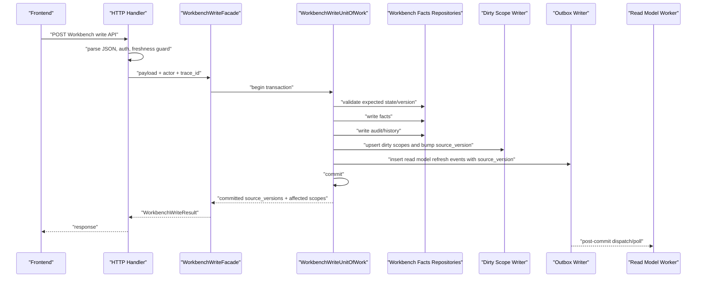

# Workbench Write Unit of Work Boundary Design

对应 prompt：`PF-P018 - Workbench Write Unit of Work Boundary Design`

状态：`verified`

本文档只定义 Workbench 写路径未来 Unit of Work 目标边界、事务范围、失败语义和测试策略。本文档不修改生产代码，不实现 UoW，不修复 stale write、duplicate submit、rollback 或 read model scheduling 当前语义。

## 1. Executive Summary

Workbench 写路径已经完成三轮 facade extraction：

- PF-P013：confirm/cancel link 写入口进入 `WorkbenchWriteFacade`。
- PF-P014：mark-exception、exception/apply、cancel-exception、ignore/unignore 写入口进入 `WorkbenchWriteFacade`。
- PF-P017：withdraw、cash special、update-bank-exception、OA-bank exception、personal advance repayment 写入口进入 `WorkbenchWriteFacade`。

当前剩余的生产级一致性风险不是 handler 过厚，而是写入边界仍然不是单一 PostgreSQL transaction：

- facts 写入由 pair relation / exception / override / candidate snapshot persistence 分散完成。
- audit/history 随 facts snapshot 写入，但不是所有入口都和 dirty scope/outbox 同事务。
- dirty scope 与 outbox 由 runtime queue 能力支持，但当前 Workbench 写路径通过 derived lifecycle 和 scheduling callback 后置触发。
- `RuntimeQueueRepository.enqueue_read_model_refresh()` 自己开启事务，不能直接加入当前业务 facts transaction。
- scheduling failure after mutation 已由 characterization tests 锁定为当前行为，但这是目标架构需要修复的缺陷。

结论：下一步不应该直接实现 UoW。应先写 `PF-P019 - Workbench UoW Contract Tests`，把同事务、source_version、duplicate submit、stale write、scheduling failure rollback 等目标契约用测试锁住，再做最小 UoW 实现。

## 2. Evidence and Code Coverage

本轮读取或通过 CodeGraph 覆盖：

- `backend/src/fin_ops_platform/services/workbench_write_facade.py`
- `backend/src/fin_ops_platform/app/server.py`
- `backend/src/fin_ops_platform/services/postgres_connection.py`
- `backend/src/fin_ops_platform/services/postgres_repositories/core.py`
- `backend/src/fin_ops_platform/services/postgres_repositories/workbench.py`
- `backend/src/fin_ops_platform/services/runtime_queue.py`
- `backend/src/fin_ops_platform/services/derived_data_lifecycle_service.py`
- `backend/src/fin_ops_platform/services/runtime_worker.py`
- `backend/src/fin_ops_platform/app/worker.py`
- Workbench characterization、dirty queue、v2 API、exception、pair relation、runtime queue 和 platform guard tests。

关键事实：

- `PostgresConnection.transaction()` 返回 `PostgresTransaction`，其提供 `fetch_one`、`fetch_all`、`execute`。
- `postgres_repositories.common.run_in_transaction()` 如果对象有 `transaction()` 就开启事务，否则直接把当前对象传给 callback。这意味着 repository 可以通过注入 `PostgresTransaction` 复用外层事务。
- `PostgresWorkbenchRepository.save_workbench_pair_relations()` 和 `save_workbench_exception_cases()` 使用 `run_in_transaction()`，可以适配外层 transaction-like 对象。
- `PostgresWorkbenchRepository.save_workbench_overrides()` 当前直接调用 `self._connection.execute()`。如果注入 `PostgresTransaction`，它能落在外层事务内；如果注入 `PostgresConnection`，每次 execute 是独立 connection boundary。
- `RuntimeQueueRepository.enqueue_read_model_refresh()` 当前内部调用 `self._connection.transaction()`，在单独事务里 upsert `job.read_model_dirty_scopes` 并写 `job.outbox_events`。它不能直接加入 Workbench facts transaction。
- `WorkbenchWriteFacade._invalidate_and_schedule_read_model()` 当前先执行 derived lifecycle，再调用 `schedule_read_model_persist()`。这发生在 facts mutation/persistence 之后，不是同事务保证。

## 3. Current State Inventory

| Entry | Current facts mutation | Persistence callback | Derived lifecycle / dirty scope callback | Read model scheduling callback | Known failure mode |
| --- | --- | --- | --- | --- | --- |
| `confirm_link` | `pair_relation_service.replace_with_confirmed_relation` 写 active relation 和 history | `schedule_pair_relation_persist`，另有 reconciliation decision consumption | `_invalidate_and_schedule_read_model` 调 `pair_relation_changed` | `_schedule_read_model_persist` | scheduling failure 可发生在 pair relation mutation/persist 后；无 request idempotency key；无 stale precondition |
| `cancel_link` | `pair_relation_service.cancel_relation_for_row_id` | `schedule_pair_relation_persist` | `pair_relation_changed` | `_schedule_read_model_persist` | duplicate cancel 当前返回 not found；scheduling failure 后可能已有 relation 取消 |
| `preview_withdraw_link` | 无写入 | 无 | 无 | 无 | read-only，但 submit 可能基于过时 preview 操作当前 active relation |
| `withdraw_link` | `withdraw_latest_for_row_ids` 取消当前 relation 并恢复历史 relation | `schedule_pair_relation_persist` | `pair_relation_changed` | `_schedule_read_model_persist` | stale preview submit 会操作当前 relation；scheduling failure 后 relation 已变 |
| `confirm_cash_pass_through` | `update_special_metadata_for_row_ids` 更新 special metadata 和 history | `_after_cash_special_relation_update` 中 `schedule_pair_relation_persist` | `pair_relation_changed` | `_schedule_read_model_persist` | repeated update 重放并追加 history；scheduling failure 后 metadata 已变 |
| `confirm_cash_ticket_purchase` | 同 cash special，写 ticket/cash/project metadata | 同上 | 同上 | 同上 | stale update 不锁定 relation version；scheduling failure 后 metadata 已变 |
| `cancel_cash_special` | `clear_special_metadata_for_row_ids` 清空 metadata 和 history | 同上 | 同上 | 同上 | repeated clear 当前行为被锁定为可重放；无幂等 key |
| `mark_exception` | 经 `_legacy_exception_result` 调 `exception_service.apply`，写 exception case/override/candidate | `_apply_exception_payload` 调 `save_exception_cases_snapshot`、`save_overrides_snapshot`、`persist_candidate_matches_best_effort` | `exception_case_changed` | `_schedule_read_model_persist` | service-level idempotency 部分存在；scheduling failure 后 case/override 已保存 |
| `cancel_exception` | `exception_case_service.cancel_exception_cases` + `override_service.cancel_exception` | `_persist_exception_and_override_change` 保存 cases/overrides | `exception_case_changed` | `_schedule_read_model_persist` | persistence failure 有内存快照恢复；dirty/read model scheduling 仍后置 |
| `ignore_row` | `exception_case_service.ignore_row` + `override_service.ignore_row` | `_persist_exception_and_override_change` | `exception_case_changed` | `_schedule_read_model_persist` | duplicate ignore 当前会重放并 reschedule；stale ignore after confirm 当前会留下 ignored case 和 active relation |
| `unignore_row` | `exception_case_service.unignore_row` + `override_service.unignore_row` | `_persist_exception_and_override_change` | `exception_case_changed` | `_schedule_read_model_persist` | duplicate unignore 当前可能 not found；无 expected version |
| `apply_exception` | `exception_service.apply`，可能写 exception case、candidate、pair relation、override projection | `_apply_exception_payload` 保存 cases/pair/overrides/candidates | `exception_case_changed` | `_schedule_read_model_persist` | conflict path 有服务层保护；outbox/dirty scope 不同事务 |
| `update_bank_exception` | legacy exception apply path | 同 `_apply_exception_payload` | `exception_case_changed` | `_schedule_read_model_persist` | active relation conflict 当前 409；scheduling failure 后 case/override 已保存 |
| `oa_bank_exception` | legacy 或 invoice compatibility exception apply path | 同 `_apply_exception_payload` | `exception_case_changed` | `_schedule_read_model_persist` | invoice path 涉及 pair relation；duplicate submit 当前重放并 reschedule |
| `confirm_personal_advance_repayment` | 创建 settlement exception case + confirmed pair relation | `save_exception_cases_snapshot` 后 `schedule_pair_relation_persist` | `pair_relation_changed` | `_schedule_read_model_persist` | persistence failure 会恢复内存快照；scheduling failure 后 case/relation 已变 |

## 4. Target UoW Boundary Matrix

| Write API | Facts tables / service state | Audit / history | Dirty scope | Outbox / read model scheduling | Version / idempotency / stale guard | Rollback expectation | Tests needed |
| --- | --- | --- | --- | --- | --- | --- | --- |
| `confirm_link` | `app.workbench_pair_relations` | `app.workbench_pair_relation_history` | `workbench_matching_dirty_scopes` for affected months | `job.outbox_events` with `workbench.read_model.refresh` per scope | request idempotency key from client or deterministic row-set/action key; expected relation state/version for selected rows | Any failure before commit leaves no relation/history/dirty/outbox | success同事务、duplicate same key、no-case retry、stale after ignore/confirm conflict |
| `cancel_link` | pair relation status -> cancelled | pair relation history cancel event | affected month scopes | read model refresh outbox | expected active relation id/version for row | no partial cancellation if dirty/outbox fails | duplicate cancel idempotency vs 404 decision、stale replaced relation conflict |
| `withdraw_link` | cancel latest relation and restore prior relation facts | withdraw history and restored relation history | affected month scopes | read model refresh outbox | submit must include previewed active relation id/version | stale preview submit returns conflict, not operate current relation | preview/submit parity, stale preview conflict, scheduling failure rollback |
| cash special confirm/cancel | pair relation special metadata | special metadata history event | affected month scopes | read model refresh outbox | expected relation id/version; optional idempotency key for same metadata | no metadata/history if dirty/outbox fails | repeated update idempotency target, stale relation conflict, failure rollback |
| `mark_exception` | exception case + override + candidate resolution | exception case events/history | affected month scopes | read model refresh outbox | deterministic exception idempotency key over month,row,scenario,action,payload | no case/override/candidate if dirty/outbox fails | duplicate HTTP contract, stale after relation conflict, source_version |
| `cancel_exception` | exception case status + override clear | exception case event | affected month scopes | read model refresh outbox | expected active exception case id/version | no partial case/override update | duplicate cancel target, stale case already changed |
| `ignore_row` | ignored exception case + invoice override | exception case event | affected month scope | read model refresh outbox | expected row read model version or row current status | no ignored case without dirty/outbox | stale after confirm conflict, duplicate ignore idempotency |
| `unignore_row` | ignored case cancelled + override clear | exception case event | affected month scope | read model refresh outbox | expected ignored case id/version | no override clear without dirty/outbox | duplicate unignore target, stale row conflict |
| `apply_exception` | exception case, optional pair relation, overrides, candidates | exception and pair events | affected month scopes | read model refresh outbox | existing service idempotency key must become persisted/durable | no partial case/pair/override/candidate | durable idempotency, relation conflict, outbox failure rollback |
| `update_bank_exception` | exception case + bank override | exception case event | bank month scope | read model refresh outbox | expected row current section/status | no case/override if dirty/outbox fails | duplicate current behavior vs target idempotency, active relation conflict |
| `oa_bank_exception` | exception case + overrides, optional pair relation | exception/pair events | OA/bank/invoice month scopes | read model refresh outbox | expected row states and durable idempotency key | no partial multi-row update | invoice compatibility target, duplicate, stale relation conflict |
| `confirm_personal_advance_repayment` | settlement exception case + pair relation | exception case history + pair relation history | affected month scopes | read model refresh outbox | expected no conflicting active relation/exception for selected rows | case and relation must commit or rollback together with dirty/outbox | partial case/relation rollback, duplicate second-submit target, stale after exception conflict |

Read-only `preview_withdraw_link` stays outside UoW, but its response must carry enough stable identity for submit:

- active relation `case_id` or future relation UUID;
- relation `version`;
- affected row ids;
- optional `read_model_source_version` observed by the user.

Without that, submit cannot reliably reject stale preview requests.

## 5. Target Transaction Sequence

Transaction 内必须包含：

- Workbench facts：pair relation、exception case、row override、candidate decision 或后续拆出的 facts 表。
- Audit/history：pair relation history、exception case events/history。
- Dirty scope：`job.read_model_dirty_scopes` 或目标等价表。
- Outbox：`job.outbox_events`，payload 为 JSON envelope，不传 Python object 或 snapshot。
- Source version：每个 `(tenant_id, scope_type, scope_key)` 单调递增。
- Idempotency record：若目标 API 需要 durable idempotency，必须与 facts 同事务写入。

Post-commit 后才允许执行：

- RabbitMQ publish 或 wakeup。
- Redis pub/sub wakeup。
- metrics emission。
- best-effort notification。

Post-commit 不允许再决定业务事实是否存在。业务事实必须完全由 commit 决定。

## 6. Postgres / Repository Boundary Design

### 6.1 Existing reusable pieces

可复用：

- `PostgresConnection.transaction()` 可作为平台事务入口。
- `PostgresTransaction` 已提供 `fetch_one`、`fetch_all`、`execute`。
- `run_in_transaction(connection, callback)` 可让 repository 在传入 `PostgresTransaction` 时复用外层事务。
- `PostgresWorkbenchRepository` 部分保存方法可在 transaction-like 对象上运行。

不够用：

- `RuntimeQueueRepository.enqueue_read_model_refresh()` 总是自己开启事务，不能加入业务 facts transaction。
- Workbench write facade 当前依赖 callback，而不是 transaction-bound repository bundle。
- 当前 persistence 主要保存 snapshot，缺少针对单个 usecase 的显式 facts command。
- Override 保存方法没有显式 `run_in_transaction()` wrapper，虽然在 transaction object 上可工作，但边界不够自解释。
- 当前 App Shell 的 `_execute_derived_data_lifecycle_event()` 会执行多个 domain executor，其中部分会直接删除 read model 或标记 matching dirty scopes。UoW 不能把整个 derived lifecycle plan 原样放入 transaction，否则会把跨域副作用混入 Workbench write transaction。

### 6.2 Target minimal interface shape

PF-P018 不写代码。未来最小接口应满足这些语义：

- `WorkbenchWriteUnitOfWork.run(command, handler)`：统一打开 PostgreSQL transaction。
- `handler` 收到 transaction-bound repositories：
  - `pair_relations`
  - `exception_cases`
  - `row_overrides`
  - `candidate_matches`
  - `dirty_scopes`
  - `outbox`
  - `idempotency`
- UoW 返回 committed result，包含：
  - affected row ids；
  - affected scope keys；
  - source_versions；
  - outbox event ids；
  - response payload facts。

禁止：

- 把 `Application` 注入 UoW。
- 把 `RuntimeRepositories` 整包注入 UoW。
- 把 `ApplicationStateStore` / `state_store` 注入 UoW。
- 在 UoW 内直接调用 Redis、RabbitMQ、OA Mongo、MySQL。
- 在 UoW 内调用需要线程或后台任务的 App Shell scheduling helper。

### 6.3 Outbox writer blocker

当前已有 outbox 能力，但不是可加入业务事务的 writer。下一步需要先设计或测试以下能力之一：

- 新增 transaction-bound queue writer，接收 `PostgresTransaction` 并写 dirty scope/outbox；
- 或把 `RuntimeQueueRepository` 拆出纯 SQL writer，使 `enqueue_read_model_refresh()` 可以委托同一个 writer；
- 或在 UoW 内直接通过 repository bundle 写 dirty/outbox，但 SQL 和 JSON envelope 必须复用 runtime queue contract，不能复制出第二套事件语义。

这是进入 UoW 实现前的 blocker。

## 7. Read Model / Dirty Scope / Outbox Contract

Workbench 写路径最低一致性规则：

- facts、audit/history、dirty scope、outbox 必须在同一 PostgreSQL transaction 中提交。
- dirty scope 的 source_version 必须在该 transaction 内递增。
- outbox event 的 source_version 必须与 dirty scope 返回值一致。
- dedupe key 必须稳定，建议形态：`workbench.read_model.refresh:workbench:{scope_key}`。
- worker refresh 必须按 `(tenant_id, scope_type, scope_key, source_version)` 幂等执行。
- worker 完成时只能完成 `source_version <= event.source_version` 的 dirty scope，避免旧 event 覆盖新 event。
- API 读路径继续只读 active generation，并能返回 stale/refreshing。
- Redis key 必须包含 active generation 或 source_version。

Scope type 建议：

- Workbench read model refresh 使用 `scope_type="workbench"`。
- Scope key 使用月份，例如 `2026-05`，跨月或全局使用 `all` 前必须明确 all scope 聚合规则。
- Matching dirty scope 可以继续使用 Workbench matching queue，但 UoW 必须明确它和 read model refresh 是否同一个 source_version，或分别记录 source_version。

## 8. Failure Mode Matrix

| Failure mode | Current locked behavior | Target behavior | Required test before implementation |
| --- | --- | --- | --- |
| persistence failure before scheduling | 部分路径使用内存 snapshot rollback，部分依赖 callback 抛错 | transaction rollback，facts/audit/dirty/outbox 全无 | 用 fake transaction 验证 rollback，不依赖内存 snapshot |
| scheduling failure after mutation | PF-P012/PF-P016 锁定为会传播异常但 facts 可能已变 | outbox/dirty scope 写入失败必须 rollback facts | scheduling/outbox writer failure leaves no pair relation/case/override |
| duplicate submit with same idempotency key | 部分重放成功，部分 404/409，行为不统一 | durable idempotency 返回同一结果或明确 conflict | duplicate confirm/exception/cash/withdraw/person advance target contract |
| duplicate submit without key | 可能分配新 case 或重放当前状态 | 要么要求 key，要么用 deterministic action key 限制重复 | no-key duplicate target policy |
| stale write / blind overwrite | 当前多处操作 current active state，不校验用户看到的版本 | expected relation/case/read model version 不匹配则 409 | stale confirm/cancel/withdraw/ignore/cash special conflict |
| partial pair relation + exception case | personal advance 等路径可能先建 case 再建 relation | case/relation 同 commit 或同 rollback | personal advance partial rollback target |
| worker/read model lag | 通过 dirty queue 和 active generation 异步处理，API 读路径 freshness guard 部分覆盖 | write response 返回 committed source_versions，读路径识别 stale/refreshing | write then read stale status contract |
| outbox enqueue failure | 当前 outbox 不在 Workbench facts transaction 内 | enqueue failure rollback facts | forced outbox failure test |
| old event arrives after new event | runtime queue 已有 source_version guard 基础 | worker 以 source_version 跳过旧 event | worker idempotent refresh compatibility |

## 9. Test Strategy

下一条建议 prompt：

`PF-P019 - Workbench UoW Contract Tests`

PF-P019 应先写测试，不实现生产 UoW。建议测试分层：

1. Platform transaction writer tests
   - transaction-bound dirty/outbox writer 可在一个 fake transaction 中写 dirty scope 和 outbox。
   - source_version 单调递增。
   - writer failure 触发 rollback。

2. Workbench UoW contract tests
   - confirm_link 成功时 facts、history、dirty scope、outbox 在同一个 transaction call sequence 中。
   - scheduling/outbox failure 不留下 pair relation facts。
   - exception apply 成功时 exception case、override、candidate、dirty scope、outbox 同事务。
   - personal advance repayment 的 exception case 与 pair relation 同 commit/rollback。

3. Stale write target tests
   - stale withdraw preview submit 返回 409。
   - stale cancel after relation replaced 返回 409，不取消 current relation。
   - stale ignore after confirm 返回 409，不创建 ignored case。
   - cash special against changed relation version 返回 409。

4. Idempotency target tests
   - duplicate confirm with idempotency key returns first result and does not append duplicate history。
   - duplicate exception apply preserves one case/outbox source_version policy。
   - duplicate cash special update with same key does not append duplicate history。

5. Worker/read model compatibility tests
   - outbox payload 包含 source_version。
   - complete read model refresh uses source_version guard。
   - older event after newer event does not mark newer dirty scope done incorrectly。

PF-P019 不应直接改当前 behavior tests 的期望。应新增 target contract tests，并明确它们预期先失败。随后才能进入 UoW implementation prompt。

## 10. Blocker List

进入实现前必须解决：

1. Transaction-bound outbox/dirty writer 缺失。
2. Workbench facts repositories 仍以 snapshot save 为主，缺少 usecase-level command repository。
3. Current `WorkbenchWriteFacade` 依赖 App Shell callbacks，需要替换为 UoW port，而不能把 App Shell 注入 UoW。
4. Durable idempotency store 不存在，不能只依赖内存 service idempotency。
5. Stale write precondition 字段尚未成为 API 契约，前端可能没有提交 expected version。
6. Read model source_version 和 matching dirty scope source_version 的关系需要明确，避免一条写操作产生两套互相不可比较的 freshness 口径。
7. Existing characterization tests 锁定了当前非理想行为，目标 contract tests 必须与它们并存，直到实现 prompt 明确切换语义。

## 11. PF-P019 Target Contract Test Results

PF-P019 已新增 `tests/test_workbench_uow_contract.py`，用于锁定 UoW 目标契约，不改变当前生产行为。

覆盖范围：

- transaction-bound dirty/outbox writer：必须能接收外层 transaction，不得自己开启嵌套 transaction；dirty scope 与 outbox event 必须共享 source_version。
- Workbench UoW atomicity：`confirm_link`、`exception_apply`、personal advance repayment 等写路径必须把 facts、history/audit、dirty scope、outbox 放入同一 PostgreSQL transaction。
- stale write：withdraw、cancel、ignore、cash special 必须在 expected version 不匹配时返回冲突语义，不得盲写覆盖。
- durable idempotency：confirm、exception apply、cash special 必须能用持久 idempotency key 重放首个结果，且不重复追加 history、case 或 outbox。
- worker/source_version：outbox payload 必须携带 source_version，worker completion 不能用旧 event 完成更新版本的 dirty scope。

验证结果：

- `tests.test_workbench_uow_contract`：Expected Red，16 tests，14 failures，2 ok。失败均指向缺失 `WorkbenchWriteUnitOfWork` 或 transaction-bound read model refresh writer。
- `tests.test_workbench_write_characterization`：Pass，29 tests。
- `tests.test_workbench_dirty_queue_wiring`：Pass，17 tests。
- `tests.test_platform_runtime_boundary_guards`：Pass，12 tests。

新的实现顺序建议：

1. 先实现 transaction-bound dirty/outbox writer，让 read model refresh 写入可加入外层 PostgreSQL transaction。
2. 再实现最小 `WorkbenchWriteUnitOfWork.run(command, handler)`。
3. 再逐步把已抽出的 Workbench write facade 写路径迁入 UoW。

## 12. Next Slice Recommendation

推荐下一条 prompt：

`PF-P020 - Workbench Transaction-bound Dirty/Outbox Writer`

边界：

- 只实现可加入外层 transaction 的 dirty scope / outbox writer。
- 优先让 PF-P019 中 platform transaction-bound writer contract 变绿。
- 不把完整 Workbench write facade 切入 UoW。
- 不修 stale write，不实现 durable idempotency store。
- 不修改生产逻辑。
- 必须保持现有 characterization、dirty queue wiring 和 platform guard tests 绿色。
