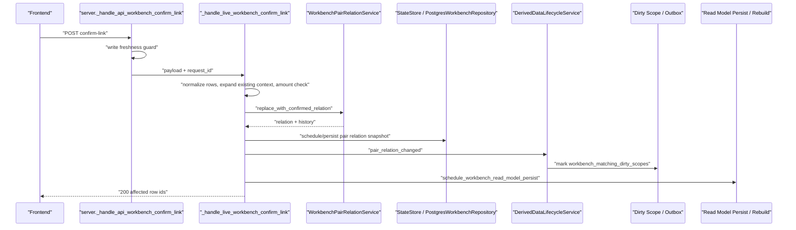
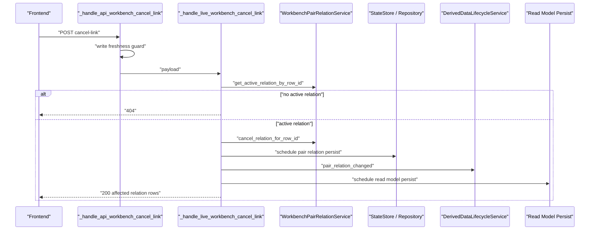
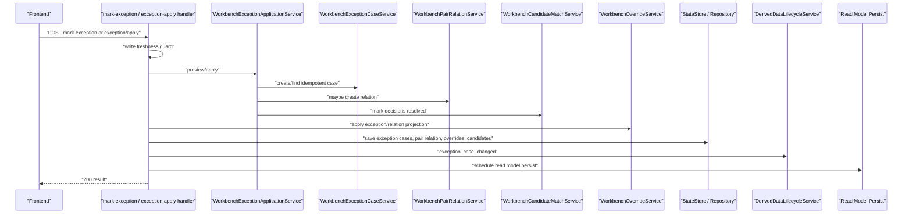
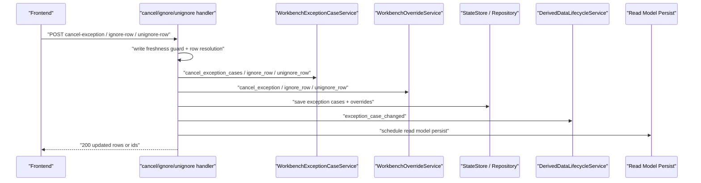
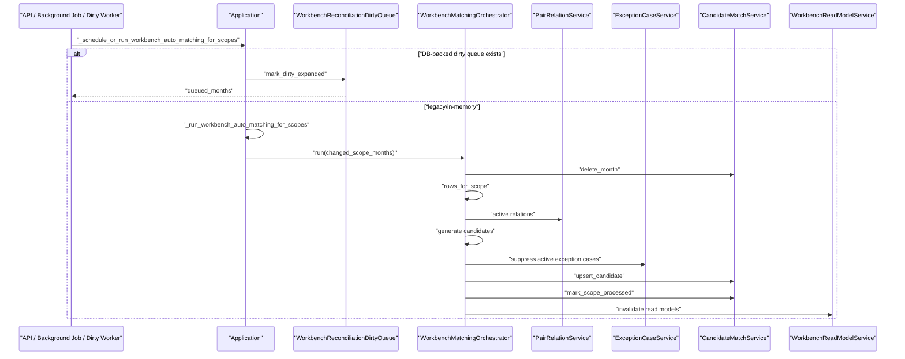
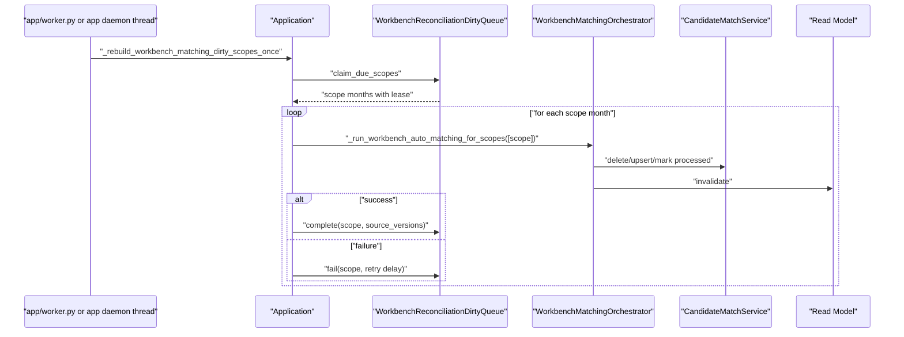
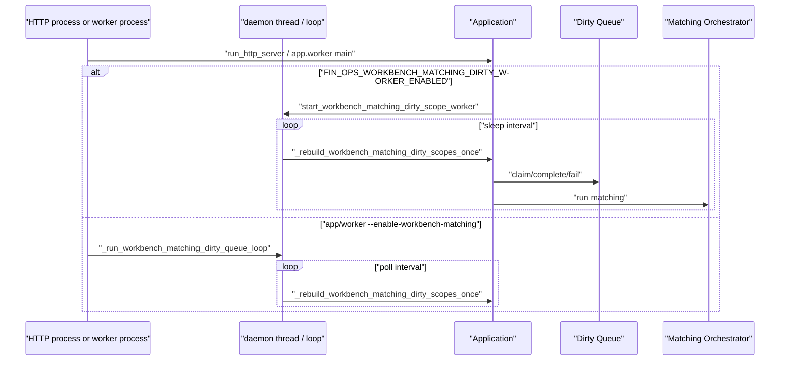
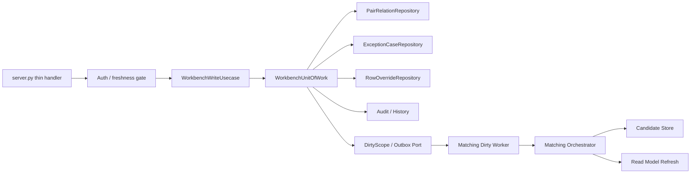

# Workbench Writes / Matching Discovery and Planning

对应 prompt：`PF-P011 - Workbench Matching Engine / Writes Discovery and Planning`

状态：`verified`

本文档是 Workbench 写路径、pair-relations/actions、exceptions、matching/candidates、dirty scope 和 worker refresh 的事实源。它只记录发现、边界、风险和下一步测试计划；本轮未修改业务代码、测试、SQL migration、前端、部署或生产配置。

PF-P011 已由用户确认 `verified`。PF-P012 已由用户确认 `verified`，并已锁定本文档列出的写路径测试缺口。PF-P013 已由用户确认 `verified`，在不改变当前行为的前提下抽取第一层写路径 facade 边界。PF-P013-MG 已由用户确认 `verified` 并 push 到 `origin/main`。PF-P014 与 PF-P014-MG 已由用户确认 `verified`，并已 push 到 `origin/main`。PF-P015 已由用户确认 `verified`，产物是 `workbench-remaining-write-facade-plan.md`。PF-P016 已由用户确认 `verified`。PF-P017 已由用户确认 `verified`。PF-P017-MG 已由用户确认 `verified` 并 push 到 `origin/main`。PF-P018 已由用户确认 `verified`，产物是 `workbench-write-uow-boundary-design.md`。PF-P019 已由用户确认 `verified`，新增 UoW 目标契约测试。PF-P020 已由用户确认 `verified`，新增 transaction-bound dirty/outbox writer。PF-P021 已执行，当前为 `implemented`，等待用户确认。

## 1. Scope Boundary

### In Scope

- Workbench 写 API：confirm link、cancel link、mark exception、exception apply、cancel exception、ignore/unignore row、update bank exception、OA-bank exception、cash special、personal advance repayment。
- Workbench matching/candidates：manual dirty marking、DB-backed dirty queue、matching orchestrator、candidate store、candidate freshness、read model invalidation。
- Worker / runtime trigger：`app/worker.py` 的 workbench matching loop、`RuntimeWorker` 的 read model refresh handler、`server.py` 中可选的 in-process matching dirty worker。
- 现有测试覆盖和 characterization gap。

### Out Of Scope

- 不改写 Workbench 写路径实现。
- 不改写 matching engine、candidate grouping、repository、worker 或 read model builder。
- 不新增或修改测试。
- 不执行 Merge Gate、Traffic Gate、部署、push 或生产访问。

## 2. CodeGraph / Scan Coverage

已使用 CodeGraph 覆盖以下符号和关系：

- `codegraph_context`：Workbench write path、matching/candidates、dirty scope、worker refresh。
- `codegraph_search`：`_handle_live_workbench_confirm_link`、`_handle_live_workbench_cancel_link`、`_handle_live_workbench_mark_exception`、`_handle_workbench_ignore_row_payload`、`_run_workbench_auto_matching_for_scopes`、`_handle_matching_run`、`WorkbenchActionService`、`WorkbenchPairRelationService`、`WorkbenchOverrideService`、`WorkbenchExceptionCaseService`、`WorkbenchMatchingOrchestrator`、`WorkbenchCandidateMatchService`。
- `codegraph_callees`：confirm/cancel/mark/ignore/matching run 的直接调用链。
- `codegraph_callers`：`_execute_derived_data_lifecycle_event`、`_schedule_workbench_read_model_persist`、`_rebuild_workbench_matching_dirty_scopes_once`、`_run_workbench_matching_dirty_queue_loop`、`start_workbench_matching_dirty_scope_worker`、`_apply_workbench_exception_application` 的调用方。
- `codegraph_explore`：`WorkbenchMatchingOrchestrator`、`WorkbenchCandidateMatchService`、`WorkbenchPairRelationService`、`WorkbenchOverrideService` 等核心服务源码。

补充源码扫描覆盖：

- `backend/src/fin_ops_platform/app/server.py`
- `backend/src/fin_ops_platform/app/routes_workbench.py`
- `backend/src/fin_ops_platform/app/worker.py`
- `backend/src/fin_ops_platform/services/workbench_*`
- `backend/src/fin_ops_platform/services/derived_data_lifecycle_service.py`
- `backend/src/fin_ops_platform/services/runtime_queue.py`
- `backend/src/fin_ops_platform/services/runtime_worker.py`
- `backend/src/fin_ops_platform/services/postgres_repositories/workbench.py`
- `tests/test_workbench_v2_api.py`
- `tests/test_workbench_*`
- `tests/test_derived_data_lifecycle_service.py`
- `tests/test_platform_runtime_boundary_guards.py`

## 3. API / Action Matrix

| API / Trigger | Handler / Entry | Primary Services | Writes Facts | Audit / History | Dirty Scope / Outbox | Read Model Invalidation | API Idempotency Baseline | Existing Tests / Gap |
| --- | --- | --- | --- | --- | --- | --- | --- | --- |
| `POST /api/workbench/actions/confirm-link` | `_handle_api_workbench_confirm_link` -> `_handle_live_workbench_confirm_link` | `WorkbenchPairRelationService.replace_with_confirmed_relation`、`_schedule_workbench_pair_relation_persist`、`_execute_derived_data_lifecycle_event` | `app.workbench_pair_relations` via state store / repository | `app.workbench_pair_relation_history` via pair relation history | Derived lifecycle marks `workbench_matching_dirty_scopes`; read model refresh scheduling is post-write | `_schedule_workbench_read_model_persist`；candidate decisions consumed | Partial. If caller supplies same `case_id`, pair relation service merges existing same-case relation unless different rows conflict. Without `case_id`, retry can allocate new case id. No request idempotency key. | Many black-box tests cover persistence, rollback, no full rebuild, async persistence. Missing explicit duplicate POST tests for no-case-id and same-case-id retry behavior. |
| `POST /api/workbench/actions/confirm-link/preview` | `_handle_api_workbench_confirm_link_preview` -> `_preview_confirm_link` | row resolving、amount check、pair relation preview | No | No | No | No | Read-only preview; deterministic depends on current read model / relation state. | Covered for note-required and case preservation. Missing preview/submit idempotency parity test for duplicate submit. |
| `POST /api/workbench/actions/cancel-link` | `_handle_api_workbench_cancel_link` -> `_handle_live_workbench_cancel_link` | `WorkbenchPairRelationService.cancel_relation_for_row_id`、pair relation persist、derived lifecycle | `app.workbench_pair_relations` status -> cancelled | pair relation history is not obviously appended in cancel path from reviewed code; needs confirmation in service history behavior | Derived lifecycle marks matching dirty scopes after write | `_schedule_workbench_read_model_persist` | Not idempotent at API level. First call cancels; repeat likely returns `404 workbench_pair_relation_not_found`. | Tests cover existing case members, async persistence, no source-row hot path. Missing explicit duplicate cancel retry contract. |
| `POST /api/workbench/actions/mark-exception` | `_handle_api_workbench_mark_exception` -> `_handle_live_workbench_mark_exception` -> `_handle_legacy_workbench_exception_via_application` | `WorkbenchExceptionApplicationService.preview/apply`、exception case、override、candidate match, optional pair relation | `app.workbench_exception_cases`、`app.workbench_row_overrides`、possibly `app.workbench_pair_relations` | exception case audit/history in payload; candidate consumption | Derived lifecycle marks matching dirty scopes after apply | `_schedule_workbench_read_model_persist` | Service-level idempotency exists via `idempotency_key` in `WorkbenchExceptionApplicationService.apply`; HTTP legacy wrapper needs explicit duplicate request characterization. | Service tests cover repeated apply idempotency. API tests cover invalidation/503. Missing HTTP duplicate retry contract. |
| `POST /api/workbench/exception/apply` | `_handle_api_workbench_exception_apply` -> `_apply_workbench_exception_application` | `WorkbenchExceptionApplicationService` | exception case, override, candidate match, maybe pair relation | exception case audit/history | Derived lifecycle marks matching dirty scopes after apply | `_schedule_workbench_read_model_persist` | Stronger than legacy mark path: service idempotency key includes month/row_ids/scenario/action. | Service-level idempotency covered. Need HTTP-level duplicate apply + stale freshness guard characterization. |
| `POST /api/workbench/actions/cancel-exception` | `_handle_api_workbench_cancel_exception` -> `_handle_live_workbench_cancel_exception` | `WorkbenchExceptionCaseService.cancel_exception_cases`、`WorkbenchOverrideService.cancel_exception` | exception cases and row overrides | exception transition history | Derived lifecycle marks matching dirty scopes after write | `_schedule_workbench_read_model_persist` | Partial. Repeated call likely sees no active cases and may return success with empty rows or error depending row resolution; not explicitly locked. | API tests cover changed scopes/no full sync. Missing duplicate cancel-exception test. |
| `POST /api/workbench/actions/ignore-row` | `_handle_api_workbench_ignore_row` -> `_handle_workbench_ignore_row_payload` | `WorkbenchExceptionCaseService.ignore_row`、`WorkbenchOverrideService.ignore_row` | exception case status `ignored` and row override | exception history first action `ignored` | Derived lifecycle marks matching dirty scopes after write | `_schedule_workbench_read_model_persist` | Service idempotency exists for already ignored row: returns existing ignored case. HTTP path still writes override and schedules invalidation again; duplicate side effects need characterization. | Service tests cover ignore/unignore. API tests cover live row path. Missing duplicate ignore-row POST behavior. |
| `POST /api/workbench/actions/unignore-row` | `_handle_api_workbench_unignore_row` -> `_handle_workbench_unignore_row_payload` | ignored rows payload -> `WorkbenchExceptionCaseService.unignore_row`、`WorkbenchOverrideService.unignore_row` | exception case cancelled and row override | exception transition history | Derived lifecycle marks matching dirty scopes after write | `_schedule_workbench_read_model_persist` | Not idempotent at API level. Repeat likely cannot find ignored row or returns `404`. | API smoke coverage exists. Missing duplicate unignore-row contract. |
| `POST /api/workbench/actions/update-bank-exception` | `_handle_api_workbench_update_bank_exception` -> live handler | override/exception path | exception/override | likely exception history | Derived lifecycle expected through helper | read model persist expected | Unknown from this pass; needs targeted call-chain read if this becomes next slice. | Existing broad API coverage unclear. |
| `POST /api/workbench/actions/oa-bank-exception` | `_handle_api_workbench_oa_bank_exception` -> live handler | exception case + override for OA/bank rows | exception/override | exception history | Derived lifecycle expected | read model persist expected | Unknown. | API tests cover invalidation only. |
| Cash special / personal advance write APIs | `_handle_api_workbench_confirm_cash_*`、`_handle_api_workbench_cancel_cash_special`、`_handle_api_workbench_confirm_personal_advance_repayment` | pair relation special metadata, exception case application | pair relation / exception facts | pair relation history | Derived lifecycle after relation update | read model persist | Unknown; outside first write-slice recommendation. | Some tests exist, not fully audited here. |
| `/matching/run` legacy | `_handle_matching_run` | `_matching_service.run` | legacy matching result state | matching run snapshot | No Workbench dirty queue | `_persist_state` only | Legacy endpoint, not Workbench matching orchestrator. | `tests/test_workbench_api.py` smoke includes `/matching/run`; should not be mixed with Workbench matching/candidates. |
| Background job: workbench matching | `_enqueue_workbench_auto_matching_for_scopes` | `BackgroundJobService` -> `_schedule_or_run_workbench_auto_matching_for_scopes` | background job state, candidate state | job status/history | DB-backed dirty queue if available; otherwise direct run | candidate run invalidates read models | Job creation idempotency not obvious; existing function uses `create_job`, not `create_or_get_idempotent_job`. | Tests assert no legacy matching engine and failure requeues dirty scope. Missing duplicate job scheduling contract. |
| App dirty worker | `start_workbench_matching_dirty_scope_worker` -> `_run_workbench_matching_dirty_scope_worker` | `_rebuild_workbench_matching_dirty_scopes_once` | candidate state, dirty queue state | matching runs | DB-backed queue claim/complete/fail or in-memory dirty service | matching run invalidates read models | Worker has scope overlap lock and lease behavior. | Dirty queue service/repository tests cover lease/retry; app loop tests limited. |
| Standalone worker dirty loop | `app/worker.py --enable-workbench-matching` -> `_run_workbench_matching_dirty_queue_loop` | Application + `_rebuild_workbench_matching_dirty_scopes_once` | same as app dirty worker | matching runs | DB-backed queue claim/complete/fail | same as app dirty worker | Lease identity and retry covered at service level. Process-level loop not fully covered for concurrent RuntimeWorker + matching thread mode. | `tests/test_workbench_dirty_queue_wiring.py` and `tests/test_runtime_worker.py` cover pieces. |

## 4. File Ownership / Subdomain Boundary

| Subdomain | Primary Files | Boundary |
| --- | --- | --- |
| `pair-relations/actions` | `workbench_pair_relation_service.py`、`workbench_action_service.py`、`workbench_override_service.py`、`server.py` live handlers | Manual relation facts, relation history, row overrides, action response contract. Current App Shell still owns transaction/persist/invalidation orchestration. |
| `exceptions` | `workbench_exception_case_service.py`、`workbench_exception_application_service.py`、`workbench_exception_projection.py`、`workbench_exception_classifier.py`、`workbench_exception_rules.py` | Exception case lifecycle, workflow projection, apply/revert semantics, candidate consumption. Service layer has useful idempotency, but HTTP wrapper and persistence are still App Shell-driven. |
| `matching/candidates` | `workbench_matching_orchestrator.py`、`workbench_candidate_grouping.py`、`workbench_free_matching_engine.py`、`workbench_matching_rules.py`、`workbench_candidate_match_service.py`、`workbench_amount_check_service.py` | Candidate generation and freshness. Pure rules exist, but orchestrator writes candidate state and invalidates Workbench read models. |
| `special/reconciliation` | `workbench_special_pair_rule_service.py`、`workbench_special_rule_detectors.py`、`workbench_special_reconciliation_adapter.py`、`workbench_reconciliation_engine.py`、`workbench_reconciliation_decision_store.py`、`workbench_reconciliation_dirty_queue.py` | Special decisions, decision store, dirty queue leases and retries. Still coupled to Workbench candidate state and exception/pair relation consumption. |
| `dirty scope / refresh trigger` | `derived_data_lifecycle_service.py`、`runtime_queue.py`、`workbench_reconciliation_dirty_queue.py`、`server.py` lifecycle executors、`app/worker.py` | Cross-domain invalidation and refresh trigger. Needs stronger Unit of Work boundary before business writes can be called production-grade. |
| `shared normalization / utility` | `workbench_text_normalization.py`、selected helper methods in `server.py` | Text/row normalization should remain shared utility, but many row resolution helpers are still inside App Shell. |

### Matching Engine 升格判断

结论：本轮仍不建议把 Workbench Matching Engine 升格为独立顶层模块。

证据：

- `WorkbenchFreeMatchingEngine` 和 `WorkbenchAmountCheckService` 偏纯逻辑，适合单独测试和抽 port。
- `WorkbenchMatchingOrchestrator.run(...)` 不是纯算法：它删除月份 candidates、读取 Workbench rows、排除 active pair relations、生成 candidates、抑制 active exception cases、upsert candidates、mark scope processed，并触发 read model invalidation。
- `WorkbenchCandidateMatchService` 管理 candidate state、scope run freshness 和 source_versions，不只是算法输出容器。
- pair relation、exception、candidate freshness、read model invalidation 仍共享 Workbench consistency boundary。

后续策略：先作为 Workbench 内部 `matching/candidates` 子域推进，优先建立 ports：row provider、relation reader、exception reader、candidate store、read model invalidator、dirty scope queue。

## 5. Static Call Chain / Dynamic Runtime Sequence

### 5.1 Confirm Link

CodeGraph 直接调用链显示 `_handle_live_workbench_confirm_link` 调用：

- `_normalize_row_ids`
- `_resolved_row_types_for_row_ids`
- `_can_confirm_link_row_types`
- `_expand_confirm_link_row_ids_for_existing_context`
- `_amount_check_for_row_ids`
- `WorkbenchPairRelationService.active_relations_for_row_ids`
- `WorkbenchPairRelationService.replace_with_confirmed_relation`
- `_schedule_workbench_pair_relation_persist`
- `_consume_workbench_reconciliation_decisions`
- `_execute_derived_data_lifecycle_event`
- `_schedule_workbench_read_model_persist`

Dynamic break：`_schedule_workbench_pair_relation_persist` 和 `_schedule_workbench_read_model_persist` 可以同步运行，也可以通过 `Thread(..., daemon=True)` 异步运行，取决于 env 开关。CodeGraph 只能看到调用关系，实际线程行为必须由 runtime config 和 tests 锁定。

### 5.2 Cancel Link

### 5.3 Mark Exception / Exception Apply

Dynamic break：service-level idempotency exists in `WorkbenchExceptionApplicationService.apply`, but HTTP legacy wrapper behavior under duplicate mark-exception request still needs characterization.

### 5.4 Cancel Exception / Ignore / Unignore

### 5.5 Matching Run / Candidate Refresh

### 5.6 Worker Dirty Scope -> Matching -> Read Model Invalidation

### 5.7 In-Memory Background Loop / Daemon Thread Triggers

## 6. Transaction / Outbox / Dirty Scope Audit

### Findings

- `RuntimeQueueRepository.enqueue_read_model_refresh(...)` is a strong platform primitive: it updates `job.read_model_dirty_scopes` and inserts/updates `job.outbox_events` in one PostgreSQL transaction, with monotonic `source_version`.
- Workbench write handlers do not currently use one explicit Unit of Work that encloses facts、audit/history、dirty scope、outbox.
- Pair relation persistence is performed through `_schedule_workbench_pair_relation_persist(...)`; `PostgresWorkbenchRepository.save_workbench_pair_relations(...)` writes relations and history in a transaction, but dirty scope/outbox/read model scheduling happens later through derived lifecycle and read model persistence.
- Exception/override persistence is App Shell orchestration: `_persist_workbench_exception_and_override_change(...)` saves exception cases and overrides, then calls derived lifecycle and read model scheduling. The reviewed code does not prove a single PostgreSQL transaction covering facts + audit + dirty scope + outbox.
- Matching dirty queue has lease/retry semantics. DB-backed queue path claims scopes and calls `complete/fail`; in-memory fallback uses a local service.

### Compliance Table

| Requirement | Current Evidence | Status |
| --- | --- | --- |
| facts + audit/history same transaction | pair relation repository writes relation/history together; exception case repository writes case/events together | Partial |
| facts + dirty scope + outbox same transaction | write handlers call derived lifecycle after facts persistence; no single UoW proven | Not compliant / needs refactor |
| monotonic read model source_version | `RuntimeQueueRepository.enqueue_read_model_refresh` increments dirty scope `source_version` and writes outbox in one transaction | Compliant for platform read model refresh primitive |
| matching dirty source_versions | `WorkbenchReconciliationDirtyQueue.mark_dirty_expanded` stores `source_versions`; complete records source_versions | Partial, depends on repository implementation and worker path |
| API idempotency | exception application service has idempotency key; candidate upsert stable key; confirm/cancel/ignore HTTP retry behavior not fully locked | Needs characterization |
| worker idempotency / retry | dirty queue lease/retry tests cover claim, complete, fail and stale lease reclaim | Partial / service-level covered |

## 7. In-Memory Runtime Trigger Audit

| Trigger | Startup / Condition | Loop / Thread | Workbench Effect | Stop Condition | Risk |
| --- | --- | --- | --- | --- | --- |
| HTTP process dirty worker | `FIN_OPS_WORKBENCH_MATCHING_DIRTY_WORKER_ENABLED` in `run_http_server` | `Thread(target=_run_workbench_matching_dirty_scope_worker, daemon=True)`; loop sleeps at least 60s | Claims dirty scopes and runs matching | Process exits only | Can run in same process as user writes; relies on run lock and queue lease. Needs explicit single-instance/deployment guidance. |
| Standalone worker dirty loop | `app/worker.py --enable-workbench-matching` | Either foreground loop or daemon thread beside `RuntimeWorker` | Claims DB-backed dirty scopes and runs matching | `max_iterations` or process exits | If enabled with other runtime handlers, runs concurrently in same process. Needs tests for mixed mode and docs on deployment topology. |
| Pair relation persist async | `FIN_OPS_WORKBENCH_PAIR_RELATION_PERSIST_ASYNC` truthy | Daemon thread per scheduled persist, coalesced by version lock | Persists relation snapshot/history | Thread exits after one run | Default disabled unless env set. If enabled, write API can return before persistence completes. |
| Workbench read model persist async | `FIN_OPS_WORKBENCH_PERSIST_ASYNC`; default async outside unittest | Daemon thread per scheduled rebuild, coalesced by version lock | Rebuilds/persists read model scopes | Thread exits after one run | User write response may precede read model availability; existing freshness contract must stay explicit. |
| OA sync polling / dirty rebuild | `FIN_OPS_OA_POLLING_ENABLED` or OA dirty scheduling | daemon polling/rebuild threads | Can call `_hot_rebuild_workbench_read_model_scopes`, which schedules matching and rebuilds read models | Process exits / recursive until no dirty scopes | Can overlap with Workbench writes. Scope is adjacent but must be considered in lock/contention tests. |
| `RuntimeWorker.run_forever` | `app/worker.py` runtime event worker | poll loop with sleep | Handles `workbench.read_model.refresh` event when enabled | `max_iterations` or process exits | Refresh worker and matching dirty worker may run in same process if both enabled. |

## 8. Platform Boundary / External Dependency Audit

### Direct Redis / RabbitMQ

- No direct `import redis`, `from redis`, `import pika`, or `from pika` was found in Workbench business service files scanned.
- RabbitMQ and Redis clients remain in platform adapters (`rabbitmq_runtime.py`, `runtime_redis.py`) and worker composition.

### OA Mongo / MySQL

- `MongoOAAdapter` is imported in `app/server.py`, `app/worker.py`, and `workbench_sql_projection.py`.
- `app/worker.py` uses `MongoOAAdapter` for OA projection sync source. This matches Platform boundary: worker source read -> PostgreSQL projection.
- `server.py` still contains legacy direct adapter wiring and request-path checks for `MongoOAAdapter`; this is an App Shell legacy boundary, not a Workbench module port.
- `workbench_sql_projection.py` imports `MongoOAAdapter` for attachment invoice parser version helper. This is a static helper dependency; it should be removed later or moved behind a platform parser-version provider to make the projection builder independent of Mongo adapter.
- No `pymysql` import was found in Workbench write/matching scan scope.

### Raw SQL / PostgresConnection

- Workbench services generally do not import `PostgresConnection` directly.
- `workbench_sql_projection.py` and `postgres_repositories/workbench.py` perform raw SQL as repository/builder layers. This is allowed by current platform guard rules but should not leak into handlers/usecases.
- `server.py` App Shell still orchestrates persistence and runtime boundaries. It should remain the extraction target for future slices.

## 9. Test Inventory / Gap Analysis

### Existing Useful Coverage

| Test File | Coverage |
| --- | --- |
| `tests/test_workbench_v2_api.py` | Black-box / handler-level coverage for confirm/cancel/mark/cancel exception, async read model persistence, no full rebuild, dirty scope retry, matching failure coalescing, action timing logs. |
| `tests/test_workbench_pair_relation_service.py` | Pair relation creation, active relation lookup, cancellation, history, normalization. |
| `tests/test_workbench_exception_application_service.py` | Exception apply, idempotency key behavior, candidate decision consumption, repeated apply idempotency. |
| `tests/test_workbench_exception_case_service.py` | exception case lifecycle, cancel cases, ignore/unignore row service-level behavior. |
| `tests/test_workbench_matching_orchestrator.py` | source versions, idempotent rerun for same scope/rows, candidate generation summary, failure logging. |
| `tests/test_workbench_candidate_match_service.py` | candidate stable key upsert idempotency, scope freshness and source_versions. |
| `tests/test_workbench_reconciliation_dirty_queue.py` | dirty window expansion, debounce, lease claim/reclaim, complete/fail, retry and lease identity. |
| `tests/test_derived_data_lifecycle_service.py` | pair/exception changes mark Workbench matching dirty scopes and enqueue workbench matching jobs. |
| `tests/test_platform_runtime_boundary_guards.py` | static guard for direct dirty/outbox writes and platform boundary rules. |

### Required Characterization Gaps Before Refactor

1. API idempotency and duplicate-submit behavior:
   - confirm-link with explicit same `case_id`.
   - confirm-link without `case_id`.
   - cancel-link repeated request.
   - mark-exception repeated request through HTTP legacy wrapper.
   - exception/apply repeated request through HTTP endpoint.
   - ignore-row repeated request.
   - unignore-row repeated request.
2. Transaction / UoW boundary:
   - prove current facts/history persistence can fail independently from dirty scope/outbox/read model scheduling.
   - lock rollback behavior for exception cases + overrides if one save succeeds and the second fails.
   - lock current response when `_execute_derived_data_lifecycle_event` or `_schedule_workbench_read_model_persist` fails, if failures are possible.
3. Background trigger concurrency:
   - app dirty worker and API write same scope concurrently.
   - standalone worker with runtime worker handlers enabled.
   - async pair relation persist/read model persist env-enabled behavior.
4. Platform boundary:
   - prevent new direct MongoOAAdapter/pymysql/Redis/RabbitMQ imports from Workbench write/matching services.
   - document or test that `workbench_sql_projection.py` MongoOAAdapter usage is parser-version-only until it can be extracted.

### PF-P012 Characterization Results

PF-P012 已补充测试并锁定以下当前行为：

- `confirm-link` 显式同一 `case_id` 重复提交：两次均成功，保留同一 active relation，但重复写 `confirm_link` history 并重复调度 background persistence / read model。
- `confirm-link` 不传 `case_id` 重复提交：生成两个不同自动 case，第二次替换 active relation。
- `cancel-link` 重复提交：第一次成功，第二次 `404 workbench_pair_relation_not_found`。
- `ignore-row` 重复提交：两次均成功，复用同一 ignored exception case；`unignore-row` 第二次 `404 workbench_row_not_found`。
- `mark-exception` legacy HTTP wrapper 重复提交：两次均成功，复用同一 exception case。
- `exception/apply` 重复提交：第二次 `idempotent=True`。
- `confirm-after-ignore` 和 `ignore-after-confirm` 当前均存在 blind write 风险。
- `cancel-after-replaced` 当前按 row id 取消最新 active relation，而不是调用方旧视图里的 relation。
- `exception-after-relation` 当前有冲突保护，返回 `409 active_pair_relation_conflict`。
- read model scheduling failure 会在 pair relation fact 已变更后向外传播，说明当前仍缺少单一 UoW。
- HTTP dirty worker 启动为 opt-in 且只启动一次；standalone dirty loop 可通过 `max_iterations` 有界退出。
- Workbench write/matching services 当前没有直接 import Redis、RabbitMQ、MongoOAAdapter 或 pymysql。

### PF-P013 Facade Extraction Results

PF-P013 已完成首轮行为保持型 facade 抽取：

- 新增 `WorkbenchWriteFacade`，文件为 `backend/src/fin_ops_platform/services/workbench_write_facade.py`。
- 首轮只覆盖 `confirm-link` 与 `cancel-link`。
- `server.py` 仍负责 HTTP body 解析、freshness guard、request id、HTTP response construction 和 route-level timing wrapper。
- Facade 通过细粒度依赖注入接收 pair relation service、row resolution helper、amount check helper、scope calculation helper、persistence / derived lifecycle / read model scheduling callbacks；没有接收 `Application`、`RuntimeRepositories`、`ApplicationStateStore`、`state_store` 等上帝对象。
- PF-P012 锁定的 duplicate submit、stale write、cancel-after-replaced、read model scheduling failure propagation、history/audit 和 dirty/read model scheduling 当前行为保持不变。
- `mark-exception`、`exception/apply`、`ignore-row`、`unignore-row` 尚未迁移。
- Stale write / optimistic locking 和 Workbench Unit of Work 仍是后续独立语义变更。

### PF-P014 Exception Facade Extraction Results

PF-P014 已完成第二轮行为保持型 facade 抽取：

- `WorkbenchWriteFacade` 新增 `apply_exception`、`mark_exception`、`cancel_exception`、`ignore_row`、`unignore_row` entrypoints。
- `server.py` 对 `mark-exception`、`exception/apply`、`cancel-exception`、`ignore-row`、`unignore-row` 保留 HTTP body parsing、freshness guard、request id 和 response wrapper；非 HTTP 编排迁入 facade。
- Facade 继续使用细粒度依赖注入，未注入 `Application`、`RuntimeRepositories`、`ApplicationStateStore`、`state_store` 或外部客户端。
- PF-P012 锁定的 duplicate submit、stale write、blind write、read model scheduling failure 和异常映射行为保持不变。
- 本轮未引入 Workbench Unit of Work，未修复 stale write / optimistic locking，未改变事务模型、dirty scope / outbox、derived lifecycle 或 read model scheduling 顺序。
- `update-bank-exception`、`oa-bank-exception`、cash special、personal advance repayment、withdraw-link、matching run / dirty worker 仍在 `server.py` 后续切片中处理。

### PF-P017 Remaining Write Facade Extraction Results

PF-P017 已完成第三轮行为保持型 facade 抽取：

- `WorkbenchWriteFacade` 已承接 `withdraw-link/preview`、`withdraw-link`、cash special、`update-bank-exception`、`oa-bank-exception` 和 `confirm-personal-advance-repayment`。
- `server.py` 对目标 Workbench 写入口只保留 parse、freshness guard、request id、facade call 和 response wrapping。
- 本轮继续保持 PF-P012/PF-P016 锁定的 duplicate submit、stale write、blind write、read model scheduling failure 和 persistence failure 当前语义。
- 本轮未引入 Workbench Unit of Work，未修复 stale write / optimistic locking，未改变 dirty scope / outbox 或 read model scheduling 顺序。

### PF-P018 UoW Boundary Design Results

PF-P018 已完成 Workbench 写路径 UoW 边界设计：

- 新增 `workbench-write-uow-boundary-design.md`，明确逐 API UoW matrix、目标事务时序、PostgreSQL/repository 边界、read model/dirty scope/outbox contract、failure mode matrix 和测试策略。
- 已确认核心 blocker：`RuntimeQueueRepository.enqueue_read_model_refresh()` 当前内部开启独立事务，不能直接加入 Workbench facts transaction；实现前需要 transaction-bound dirty/outbox writer 或拆出可复用 SQL writer。
- 已确认未来 UoW 必须把 facts、audit/history、dirty scope、outbox、source_version 和 durable idempotency 置于同一 PostgreSQL transaction。
- 已确认下一步应优先生成 `PF-P019 - Workbench UoW Contract Tests`，先写目标契约测试，不直接实现 UoW。

## 10. Risk / Optimization Findings

| Risk | Severity | Evidence | Required Next Step |
| --- | --- | --- | --- |
| facts + dirty scope + outbox are not one UoW | High | Work handlers mutate services/persist facts, then call derived lifecycle/read model scheduling afterward | Add characterization tests first; then introduce Workbench write Unit of Work / platform port. |
| API retry idempotency is inconsistent | High | PF-P012 locked current behavior: explicit same-case confirm replays success but repeats side effects; no-case confirm allocates a new case; cancel/unignore repeat returns 404; exception/apply is idempotent | PF-P013 must preserve current behavior during extraction; later semantic changes need separate prompt and tests. |
| stale write / blind overwrite behavior exists | High | PF-P012 locked current behavior: confirm-after-ignore and ignore-after-confirm both succeed and leave conflicting facts; exception-after-relation returns 409 | Do not fix during facade extraction. Plan a later optimistic state assertion / conflict semantics prompt. |
| read model scheduling failure happens after fact mutation | High | PF-P012 shows `_schedule_workbench_read_model_persist` failure propagates after pair relation fact is already mutated | UoW/outbox refactor must explicitly handle facts + dirty scope + outbox atomicity. |
| App Shell is still orchestration god object | High | PF-P013/PF-P014 已将 confirm/cancel、exception/apply、mark-exception、cancel-exception、ignore/unignore 的非 HTTP 编排抽入 `WorkbenchWriteFacade`，但 `server.py` 仍拥有 withdraw-link、cash special、bank exception、personal advance repayment、matching run / dirty worker、persistence callbacks、derived lifecycle、background threads、read model scheduling | 先执行 PF-P015 完成剩余写入口 discovery / planning；不得直接跳到 UoW 或继续盲抽 facade。 |
| In-process daemon threads can overlap writes | Medium-High | HTTP server can start matching dirty worker; app/worker can run matching loop beside RuntimeWorker; async persist thread env flags exist | Document deployment mode and add concurrency characterization tests. |
| Matching engine cannot yet be standalone | Medium | orchestrator writes candidate state, reads pair relations/exceptions, invalidates read models | Keep as Workbench internal subdomain; extract ports first. |
| Direct Mongo adapter remains in App Shell and projection builder | Medium | `server.py`, `worker.py`, `workbench_sql_projection.py` import `MongoOAAdapter` | Keep in Platform/App Shell for now; later move parser version helper and direct adapter checks behind ports. |
| Read model refresh and matching refresh are separate async systems | Medium | `RuntimeWorker` handles `workbench.read_model.refresh`; matching dirty loop handles candidate regeneration | Future plan must define ordering: write -> matching dirty -> candidate refresh -> read model refresh. |
| Legacy `/matching/run` can be confused with Workbench matching | Low-Medium | `/matching/run` calls `_matching_service.run`, not Workbench matching orchestrator | Keep out of Workbench matching module; mark legacy/review. |

## 11. Target Architecture for This Module

Do not implement this yet; this is the target direction discovered by PF-P011.

Required properties:

- Handler only parses HTTP, checks auth/freshness, and delegates.
- Usecase owns API idempotency, semantic validation and response contract.
- UoW owns single transaction for facts、audit/history、dirty scope、outbox.
- Matching orchestrator depends on ports, not App Shell.
- Read model invalidation must be versioned and observable.

## 12. Next Slice Recommendation

PF-P015、PF-P016、PF-P017、PF-P017-MG 已由用户确认 `verified`，并已 push 到 `origin/main`。

PF-P016 新增测试已锁定剩余写入口当前行为：

- `withdraw-link` duplicate submit、stale preview submit、read model scheduling failure。
- cash pass-through、cash ticket purchase、cancel cash special 的 duplicate submit、current relation update、scheduling failure。
- `update-bank-exception` duplicate submit、active relation conflict、scheduling failure after case/override。
- `oa-bank-exception` duplicate submit、active relation conflict、scheduling failure after case/override。
- `confirm-personal-advance-repayment` duplicate submit、stale after exception、persistence rollback、scheduling failure after settlement facts。

PF-P016 未新增 worker tests：现有 `test_workbench_dirty_queue_wiring.py` 与 `test_workbench_write_characterization.py` 已覆盖本轮需要的 dirty worker start/loop/claim/complete/fail 基线，本轮风险集中在 HTTP write API。

PF-P017 已完成行为保持型 facade extraction：

- `withdraw-link/preview`、`withdraw-link` 已迁入 `WorkbenchWriteFacade`。
- cash special 三个入口已迁入 `WorkbenchWriteFacade`。
- `update-bank-exception`、`oa-bank-exception`（含 invoice compatibility）已迁入 `WorkbenchWriteFacade`。
- `confirm-personal-advance-repayment` 已迁入 `WorkbenchWriteFacade`。
- `server.py` 目标 HTTP handlers 只保留 parse、freshness guard、request_id、facade call、response wrapping。

PF-P018 已完成 UoW 边界设计并由用户确认 `verified`。PF-P019 已生成并审查，下一条允许执行：

`PF-P019 - Workbench UoW Contract Tests`

PF-P019 应只新增目标 contract tests，不实现 UoW，不修改生产逻辑。测试应覆盖 facts/audit/dirty scope/outbox 同事务、source_version monotonicity、outbox failure rollback、duplicate submit durable idempotency、stale write conflict 和 worker idempotent refresh compatibility。

PF-P019 已新增 `tests/test_workbench_uow_contract.py` 并完成红相验证：

- 16 个目标契约测试覆盖 transaction-bound dirty/outbox writer、Workbench UoW atomicity、stale write、durable idempotency 和 worker/source_version compatibility。
- `tests.test_workbench_uow_contract` 当前为 Expected Red：16 tests，14 failures，2 ok。红灯原因是缺失 transaction-bound writer / `WorkbenchWriteUnitOfWork`，不是测试自身错误。
- 既有 `tests.test_workbench_write_characterization`、`tests.test_workbench_dirty_queue_wiring`、`tests.test_platform_runtime_boundary_guards` 全部通过。

PF-P019 已由用户确认 `verified`。下一条建议 prompt 已生成并审查：

`PF-P020 - Workbench Transaction-bound Dirty/Outbox Writer`

PF-P020 应先让 read model refresh dirty scope/outbox 写入能复用外层 PostgreSQL transaction。不要在 PF-P020 直接实现完整 Workbench UoW、stale write guard 或 durable idempotency store。

PF-P020 已执行：

- `RuntimeQueueRepository.enqueue_read_model_refresh_in_transaction(transaction=...)` 已作为 transaction-bound dirty/outbox writer 落地。
- `enqueue_read_model_refresh()` 保持 public API，内部委托 transaction-bound writer。
- PF-P019 writer group 已转绿：3 tests pass。
- PF-P019 全量 contract file 仍是 Expected Red：16 tests，11 failures，5 ok；剩余红灯为缺失 `WorkbenchWriteUnitOfWork` / UoW 语义。
- 现有 runtime queue、Workbench characterization、dirty queue wiring 和 platform guard tests 全部通过。

PF-P020 已由用户确认 `verified`。下一条 prompt 已生成并审查：

`PF-P021 - Workbench Minimal Unit of Work Skeleton`

PF-P021 应只建立最小 `WorkbenchWriteUnitOfWork.run(command, handler)` skeleton，并接入 PF-P020 的 transaction-bound writer。不要在同一 prompt 中迁移全部 Workbench 写路径、修 stale write 或实现 durable idempotency store。

PF-P021 的边界：

- 只允许新增 `backend/src/fin_ops_platform/services/workbench_uow.py`。
- `run(command, handler)` 负责打开 PostgreSQL transaction、创建 repository context、执行 handler，并通过 PF-P020 的 transaction-bound writer 在同一 transaction 内写入 dirty scope/outbox。
- 只让 PF-P019 中 4 个 UoW atomicity skeleton tests 转绿。
- 不迁移 `server.py` 或 `WorkbenchWriteFacade` 的真实写路径。
- 不实现 stale write guard、durable idempotency replay 或新的数据库 schema。

PF-P021 已执行：

- 已新增 `WorkbenchWriteUnitOfWork.run(command, handler)` minimal skeleton。
- 4 个 UoW atomicity tests 已从红转绿。
- PF-P020 writer group 保持绿色。
- PF-P019 全量 contract file 仍为 Expected Red：16 tests，7 failures，9 ok；剩余 failures 均为 stale write / durable idempotency 目标语义。
- 现有 runtime queue、Workbench characterization、dirty queue wiring 和 platform guard tests 全部通过。
- 未迁移任何真实 Workbench write API，未修改 `server.py` 或 `workbench_write_facade.py`。

下一步应等待用户确认 PF-P021 `verified`，然后生成并审查 `PF-P021-MG - Workbench Minimal Unit of Work Skeleton Merge Gate`。不得在 PF-P021-MG 前继续迁移更多 Workbench 写路径。
