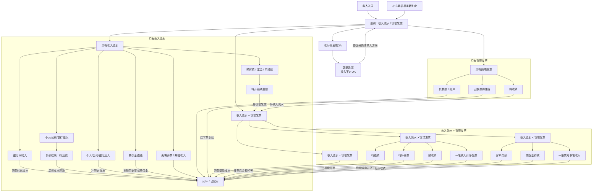

# 关联台异常处理流程图

本文把 `异常处理.xlsx` 梳理成两张 Mermaid 流程图。图中直接使用业务对象名称，节点不显示编号。

## 支出流程

```mermaid
flowchart TD
  PayStart["支出入口"] --> PayJudge["识别：OA / 支出流水 / 进项发票"]

  PayJudge --> OnlyOA["只有OA"]
  PayJudge --> OnlyBankPay["只有支出流水"]
  PayJudge --> OnlyInputInvoice["只有进项发票"]
  PayJudge --> OaBankNoInvoice["OA + 支出流水<br/>缺进项发票"]
  PayJudge --> OaInvoiceNoBank["OA + 进项发票<br/>缺支出流水"]
  PayJudge --> BankInvoiceNoOa["支出流水 + 进项发票<br/>缺OA"]
  PayJudge --> AllPayObjects["OA + 支出流水 + 进项发票"]

  ClosedPay["闭环 / 已配对"]
  RejudgePay["补充数据后重新判定"]
  ManualReviewPay["人工复核"]

  subgraph "单对象"
    OnlyOA -->|补支出流水| OaBankNoInvoice
    OnlyOA -->|补进项发票| OaInvoiceNoBank
    OnlyOA -->|流水和发票都补齐| AllPayObjects

    OnlyBankPay --> AutoDebit["自动扣款<br/>手续费/利息/托收"]
    AutoDebit --> ClosedPay
    OnlyBankPay --> SalaryPay["工资/过节费"]
    SalaryPay --> ClosedPay
    OnlyBankPay --> InternalTransferPay["内部转账"]
    InternalTransferPay --> ClosedPay
    OnlyBankPay -->|补OA| OaBankNoInvoice
    OnlyBankPay -->|补进项发票| BankInvoiceNoOa

    OnlyInputInvoice --> EtcFlow["ETC票据管理<br/>创建并提交OA"]
    EtcFlow --> OaInvoiceNoBank
    OnlyInputInvoice -->|补OA| OaInvoiceNoBank
    OnlyInputInvoice -->|补支出流水| BankInvoiceNoOa
  end

  subgraph "OA + 支出流水，缺进项发票"
    OaBankNoInvoice --> OaMoreThanBank["OA金额 > 支出流水"]
    OaBankNoInvoice --> OaEqualsBank["OA金额 = 支出流水"]
    OaBankNoInvoice --> BankMoreThanOa["OA金额 < 支出流水"]

    OaMoreThanBank --> OaBankShortPay["少付 / 扣款 / 支付错误"]
    OaBankShortPay --> ManualReviewPay
    OaBankShortPay -->|补进项发票| AllPayObjects

    OaEqualsBank --> MissingInputInvoice["追进项发票"]
    MissingInputInvoice -->|补票后金额相等| ClosedPay
    MissingInputInvoice -->|补票后票少| NeedMoreInvoicePay["继续追票"]
    MissingInputInvoice -->|补票后票多| ExtraInvoicePay["确认票多归属"]

    BankMoreThanOa --> OverPayNoInvoice["多付 / 补OA / 合并付款"]
    OverPayNoInvoice --> ManualReviewPay
    OverPayNoInvoice -->|补OA或补票| AllPayObjects
  end

  subgraph "OA + 进项发票，缺支出流水"
    OaInvoiceNoBank --> OaMoreThanInvoice["OA金额 > 进项发票"]
    OaInvoiceNoBank --> OaEqualsInvoice["OA金额 = 进项发票"]
    OaInvoiceNoBank --> InvoiceMoreThanOa["OA金额 < 进项发票"]

    OaMoreThanInvoice --> NeedInvoiceAndBank["票不足 + 待流水"]
    NeedInvoiceAndBank -->|补票| OaInvoiceNoBank
    NeedInvoiceAndBank -->|补支出流水| AllPayObjects

    OaEqualsInvoice --> WaitPayment["待付款 / 待匹配流水"]
    WaitPayment -->|支出流水金额相等| ClosedPay
    WaitPayment -->|支出流水不足| PayablePay["待付款"]
    WaitPayment -->|支出流水超额| RefundPay["多付追款"]

    OaEqualsInvoice --> ZhouOffset["周洁云冲"]
    ZhouOffset --> ClosedPay

    InvoiceMoreThanOa --> ExtraInvoiceNoBank["票多 / 审批不足 / 现金归属"]
    ExtraInvoiceNoBank --> ManualReviewPay
    ExtraInvoiceNoBank -->|确认归属| ClosedPay
    ExtraInvoiceNoBank -->|补OA或流水| AllPayObjects
  end

  subgraph "支出流水 + 进项发票，缺OA"
    BankInvoiceNoOa --> BankMoreThanInvoice["支出流水 > 进项发票"]
    BankInvoiceNoOa --> BankEqualsInvoice["支出流水 = 进项发票"]
    BankInvoiceNoOa --> InvoiceMoreThanBank["支出流水 < 进项发票"]

    BankMoreThanInvoice --> OverPayOrMissingInvoice["多付 / 追票 / 补OA / 免OA"]
    OverPayOrMissingInvoice --> ManualReviewPay
    OverPayOrMissingInvoice -->|补OA| AllPayObjects
    OverPayOrMissingInvoice -->|补票| BankInvoiceNoOa

    BankEqualsInvoice --> OaExemption["免OA判断"]
    OaExemption -->|自动免OA| ClosedPay
    OaExemption -->|人工确认免OA| ClosedPay
    OaExemption -->|需要补OA| RejudgePay
    RejudgePay --> AllPayObjects

    InvoiceMoreThanBank --> InstallmentPay["待付款 / 分期 / 现金补付"]
    InstallmentPay -->|补支出流水| BankInvoiceNoOa
    InstallmentPay -->|补OA| AllPayObjects
  end

  subgraph "三者都有"
    AllPayObjects --> AllEqualPay["OA = 支出流水 = 进项发票"]
    AllEqualPay --> ClosedPay

    AllPayObjects --> OaBankEqualInvoiceLess["OA = 支出流水 > 进项发票"]
    OaBankEqualInvoiceLess --> NeedMoreInvoicePay
    NeedMoreInvoicePay -->|补票后金额相等| ClosedPay

    AllPayObjects --> OaBankEqualInvoiceMore["OA = 支出流水 < 进项发票"]
    OaBankEqualInvoiceMore --> ExtraInvoicePay
    ExtraInvoicePay -->|确认超额归属| ClosedPay

    AllPayObjects --> OaInvoiceEqualBankLess["OA = 进项发票 > 支出流水"]
    OaInvoiceEqualBankLess --> PayablePay
    PayablePay -->|补付款| ClosedPay

    AllPayObjects --> OaInvoiceEqualBankMore["OA = 进项发票 < 支出流水"]
    OaInvoiceEqualBankMore --> RefundPay
    RefundPay -->|追回多付或现金退回| ClosedPay

    AllPayObjects --> BankInvoiceEqualOaLess["支出流水 = 进项发票 > OA"]
    BankInvoiceEqualOaLess --> MissingOaPay["缺OA / 审批不足"]
    MissingOaPay -->|免补OA| ClosedPay
    MissingOaPay -->|补OA后金额相等| ClosedPay

    AllPayObjects --> BankInvoiceEqualOaMore["支出流水 = 进项发票 < OA"]
    BankInvoiceEqualOaMore --> OaRemainingPay["OA包含剩余待支付"]
    OaRemainingPay -->|拆分OA或补付| ClosedPay

    AllPayObjects --> AllMismatchPay["三方金额都不相等"]
    AllMismatchPay --> ManualReviewPay
    ManualReviewPay -->|补票 / 补流水 / 补OA / 拆分后| AllPayObjects
  end
```

## 收入流程

## 使用口径

- Mermaid 是主流程图，负责表达补票、补流水、补 OA、退款、还款后的跳转。
- Xmind 是导航图，负责快速定位支出、收入、特殊流程和实现建议。
- 支出和收入分开维护，避免单图过大。
