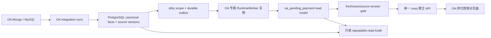

# OA 待付款核对：高性能与完整性闭环设计

日期：2026-07-16
状态：本地实施与旧链路清理完成，`READY_FOR_UNIFIED_DEPLOYMENT`；生产回填和 SLO 证据待统一部署
适用范围：`/oa-pending-payments` 页面、`oa_pending_payment` read model、OA 专属刷新链路和页面 Audit

## 1. 结论

本设计合理，可以进入实施。它不是最小补丁，也不是重建一套基础设施：只复用现有 PostgreSQL canonical facts、durable queue、dirty scope、source version、CAS、`RuntimeWorker`、operation barrier 和 Page Audit；只新增一个当前确实缺失的 OA MySQL 支付状态 PostgreSQL 快照。

最终链路必须满足：

- PostgreSQL 统一事实源某个月份提交后，新 read model 在页面可见的 `p95 <= 1s`；`500ms` 作为挑战目标，不作为首版硬承诺。
- read model 已 fresh 时，首屏聚合 API 服务端耗时 `p95 <= 250ms`、`p99 <= 500ms`。
- 已打开且可见的页面每 500ms 用 rows endpoint 的条件请求检查版本；检测到 dirty/version 变化后立即隐藏旧 rows，等待 OA operation barrier 后重新读取。没有 stale-while-revalidate。
- OA read model 刷新不访问 Mongo/MySQL，不参与 input/output invoice read model 的共享 worker 竞争。
- 统一事实源版本变化后，即使刷新事件暂时遗漏，查询 gate 也能通过动态 source-version mismatch 拒绝旧投影并补发刷新。
- 迁移后不存在旧查询入口、live fallback、重复 filter 扫描、共享 worker OA 分支和本地 pickle/snapshot 运行时路径。

## 2. SLO 的计时边界

### 2.1 硬 SLO

`T0` 定义为 OA 相关事实已经提交到平台 PostgreSQL 统一事实源的时刻。`T1` 定义为已打开且可见的浏览器页面检测到变化、重新读取并渲染包含该版本的 fresh read model 的时刻。

```text
T1 - T0 的 p95 <= 1s
```

普通单条或单月变化适用该 SLO；显式 `all` 全量重建按月份和总时长单独度量，不能拿全量重建结果冒充普通变化 SLO。

浏览器无法在服务端 commit 的同一瞬间知道版本已经变化。为了不引入 SSE/WebSocket，本设计接受最长 500ms 的有界检测窗口；检测到变化后立即移除旧 rows。这个窗口计入 1 秒端到端 SLO，不把它描述成“零延迟不显示旧数据”。

### 2.2 外部系统边界

Mongo 或 OA MySQL 的变化尚未同步进 PostgreSQL 时，不属于上述 `T0`。外部源到 PostgreSQL 的同步延迟必须单独展示和告警，不能混进 read model 的 1 秒指标，也不能让页面热路径直接访问外部系统来掩盖同步延迟。

本设计不假设 `t_payment_simple` 存在尚未验证的可靠增量 cursor。默认由现有 OA integration sync 周期性读取页面所需的最小列并做全量内容签名/快照对账；若后续证明上游有权威 cursor，只把它作为同步优化，不改变 PostgreSQL snapshot、version 和 outbox 合同。该对账在 integration 边界执行，不进入页面或 read model 热路径。

因此，对“外部 OA 已变化但页面没变”要区分两种情况：

1. PostgreSQL 统一事实源尚未变化：属于 OA integration sync 延迟，由 sync watermark/lag 负责。
2. PostgreSQL 统一事实源已经变化：属于 read model 一致性问题，本设计通过原子 outbox、动态 source version、CAS 和 fresh gate 阻止页面继续显示旧数据。

## 3. 已验证的现状

2026-07-16 只读生产复测得到：

- fresh rows 请求 `p95` 约 `258ms ~ 305ms`。
- fresh filter-options 请求 `p95` 约 `291ms ~ 383ms`。
- non-fresh 时曾连续约 13 秒返回 `202 refreshing`，页面在这段时间拿不到数据。
- Page Audit 当前复测为通过：integrity pass、freshness fresh、queue drained、issues `0`；一次 Audit 请求约 `514ms`。
- 之前页面显示的 3 个 issue 的具体 code 无法从历史 UI 恢复，因为前端拿到 `issues` 后只展示计数，没有展示样本内容。当前已通过只能说明问题后来收敛，不能证明当时 3 个 issue 的确切原因。

已确认的主要瓶颈和风险：

1. 页面并发请求 rows 和 filter-options，必须等待二者全部完成。
2. `filter_options()` 通过 `all_rows()` 每 200 行分页读取全部 read model；每页又重复 aggregate、view counts、freshness、scope、source versions 和 rows 查询。
3. OA refresh 当前仍在投影阶段访问 Mongo/MySQL，外部 I/O 直接进入 1 秒热路径。
4. OA 与 input/output invoice read model 共享 `invoice-usage-collection` worker，吞吐和延迟相互影响。
5. 普通月份变化同时 enqueue `month + all`；`all` 再 fan-out 月份，产生重复和全局工作。
6. 现有 expected source versions 主要是静态代码/schema 版本，未完整包含 OA、银行、发票、支付状态等动态事实版本。
7. builder 写入的部分签名只存在于 actual source versions，expected provider 不比较这些 key，不能形成有效 fresh 证明。
8. 页面初始请求遇到 refreshing 时没有复用 operation barrier 自动等待并重读，只能停在同步状态或依赖人工刷新。
9. Audit UI 把内部枚举和重复计数直接拼成文案：`Audit 未通过 · integrity issues_found · blocking samples 3 · issue samples 3`，既不可读，也没有区分“正在收敛”和“fresh 后仍不一致”。

## 4. 目标边界



| 边界 | 输入 | 输出 | 禁止行为 |
| --- | --- | --- | --- |
| OA integration sync | Mongo/MySQL 外部事实 | PostgreSQL canonical/admission/payment-status snapshot、watermark、精确月份 outbox | 写 read model；让页面或 RM worker 访问外部源 |
| OA read model projector | PostgreSQL canonical facts、月份、event source version | 该月份 rows/scope/source versions | 外部 I/O；写其它页面 read model；普通变化 fan-out `all` |
| OA query service | OA read model、dirty/outbox、expected source versions | fresh payload 或 `202 refreshing` | live scan；返回 stale rows；调用完整 live query service |
| OA 页面 | 单一聚合 payload、ETag 条件请求、operation barrier | 表格、筛选、状态 | 并发读取旧 filter endpoint；轮询完整 payload；自行推断 freshness 或付款状态 |
| OA Audit | 同一 PostgreSQL repeatable-read snapshot | integrity/freshness/queue 证据 | 写数据；自动修复；把 refreshing 误报为 integrity failure |

### 4.1 唯一必要的新持久化对象

新增一个 OA 模块私有的 PostgreSQL 支付状态快照，保存 `t_payment_simple.flow_id` 对应的页面/投影必需字段和同步版本。原因是：当前没有该镜像；如果不持久化，就无法把 MySQL 从 read model 刷新热路径移除。

不把支付状态塞进 `app.oa_applications` 或仅服务 in-progress 的 `app.oa_pending_payment_admissions`，避免改变现有事实所有权和字段语义。具体表名在实施时按现有 migration 命名规范确定，不再为它增加通用 repository framework。

其余对象全部复用：

- completed OA：`app.oa_applications`。
- in-progress admission：`app.oa_pending_payment_admissions`，所有权从 RM worker 收敛到 OA integration sync。
- sync watermark/version：现有 `app.oa_sync_watermarks` 和 source-version 合同。
- queue/CAS：现有 `job.outbox_events`、`job.read_model_dirty_scopes`、refresh gateway 和 `RuntimeWorker`。
- relation、银行、发票、规则：继续由各 canonical owner 写入，通过现有 derived lifecycle 只触发 OA 精确月份 scope。

权限继续最小化：OA integration sync 角色可以写 OA canonical/admission/payment-status snapshot 和对应 outbox，但不能写 read model；OA worker 只能读这些 PostgreSQL facts 并写 OA read model；页面 query 不写业务事实或 read model，只允许在 fresh gate 失败时通过现有 refresh gateway 请求刷新；Audit 严格只读。新 snapshot 只保存投影必需字段，不保存外部连接凭据或无关 OA payload。

payment-status snapshot 必须具备完整删除语义：

- 以 tenant + `flow_id` 作为唯一事实身份，月份只用于 scope/index，不参与制造重复身份。
- 只有一次外部读取完整成功后，才能在同一 PostgreSQL 事务中 upsert 当前集合、删除本次权威集合中已消失的旧记录、更新 watermark/version 并 enqueue 受影响月份。
- 外部超时、分页不完整、响应/schema 解析失败导致集合完整性未知或连接中断时整轮不提交，不能把“读取失败”解释为上游删除。
- 重复或非法 `flow_id` 按当前 `OAPaymentStatusRepository` 的已验证业务规则处理并输出诊断；实施前不得猜测新的优先级规则。

### 4.2 精确 scope 与跨月依赖

所有 queue/version key 都必须包含 tenant。OA、银行流水、进项发票和 relation 的业务月份可能不同，不能用被修改事实自身的月份直接代替 OA read model 月份。

- OA/admission/payment-status writer 直接使用对应 OA 月份。
- Workbench relation 和 pending relation writer 从 relation 的 OA 成员解析全部受影响 OA 月份。
- 银行/发票事实变化通过现有 active relation/pending relation owner 反查其消费方 OA 月份；没有 OA consumer 时不刷新 OA read model。
- scope resolution 只允许一次有索引的批量 relation-owner lookup；不得调用 OA query/projector，不得读取其它页面 read model，也不得改变其它 read model invalidation。
- 同一事务内批量 normalize、dedupe 后 enqueue 精确月份，禁止 per-row enqueue。

若一个已知会影响 OA 的 canonical 变化无法证明受影响月份，必须 enqueue 可观测的低优先级 `all` safety refresh 并告警 `scope_resolution_failed`。这是罕见的正确性保护，不是普通路径，也不计入普通单月 1 秒 SLO；不得静默漏刷或退回 live query。

## 5. 一致性闭环

### 5.1 Canonical commit

每个受支持 writer 在同一个 PostgreSQL 事务中完成；tenant 参与 scope、dedupe 和 version identity：

1. 写 canonical fact 或 integration snapshot。
2. 增加对应依赖的动态 source version。
3. 对受影响的 `oa_pending_payment:<YYYY-MM>` dirty scope 增加单调 event source version。
4. 插入 deduped durable outbox event。

不做跨 Mongo/MySQL/PostgreSQL 的分布式事务。外部读取先完成，再以一次 PostgreSQL 事务提交 snapshot、watermark、version 和 outbox；失败时全部不提交。

普通写入只 enqueue 精确月份。`all` 只用于首次初始化、回填、显式全量修复、运维重建，以及第 4.2 节已经告警的 scope-resolution 正确性保护。

沿用现有 queue coalescing 语义：同一 tenant/scope 已有 pending event 时更新为最新 source version；已有 processing event 时允许再产生一个 pending event。旧 processing event 不能吞掉并发新版本。该行为必须作为 OA worker 的并发合同测试，而不是另造 debounce/cache。

### 5.2 动态 source-version vector

每个月份 read model scope 必须保存并比较实际依赖版本，至少覆盖：

- completed OA projection。
- in-progress admission。
- OA MySQL payment-status snapshot。
- completed Workbench relation 与 in-progress pending relation。
- 被投影引用的银行流水和进项发票 canonical facts。
- 影响付款状态/分类的规则版本（当前 `InvoiceLifecyclePolicy.evaluate_oa_payment` 不读取 input invoice payment rules，因此本轮明确为 N/A，不制造虚假依赖）。

expected provider 只读取小型 version/watermark 记录，不扫描业务事实。当前仅 actual 侧存在、expected 侧不比较的 signature 必须改为 Audit 证据或删除，不能继续伪装成 fresh contract。

动态版本优先复用各 canonical owner 已存在的 scope version/watermark；若某个 owner 缺少权威版本，只在该 owner 现有 scope/watermark 合同中补最小、additive 的版本字段/记录，不改变该 owner 的 API、read model 或其它 invalidation，不新建跨模块通用 version service。completed OA、admission 和 payment-status 的内容签名在 integration sync 时计算并持久化，query gate 只读结果。

这提供第二道保护：即使某次 outbox enqueue 因 writer 缺陷遗漏，只要 canonical 事务正确增加了依赖版本，query gate 会看到 `expected != actual`，返回 `202` 并通过现有 gateway 补发刷新，而不是继续返回旧 rows。

直接绕过 canonical writer 修改数据库不在受支持合同内。生产权限必须禁止此路径；Audit 继续用 expected-set/projection equality 检测越界写入或版本协议缺陷。

### 5.3 Build 与发布

OA 专属 worker 领取月份事件 `N` 后：

1. 先确认 `N` 仍是该 dirty scope 当前版本；旧事件直接 `skipped/stale_source_version`。
2. 在 PostgreSQL 一致性快照中读取 canonical facts 和动态 version vector。
3. 批量构建该月份 rows；禁止 per-row repository/external calls。
4. 在一个短事务中原子 replace 该月份 rows、写 scope metadata，并标记 actual version vector 和 event version `N`。
5. 只有 dirty scope 当前版本仍不大于 `N` 时才完成事件并清 dirty；并发的新写入不能被旧任务清除。

若步骤 3 后又发生 canonical write，旧 rows 即使暂时落库也不会被 query gate 当作 fresh；新的 dirty/version 会阻断读取并触发下一次构建。

空权威集合必须原子删除该 scope 的旧 rows并发布 `row_count=0` 的 fresh scope。进程在 rows replace 与 scope metadata 之间崩溃时，整个发布事务必须回滚；进程在发布后、清 dirty 前崩溃时允许幂等重建，但页面仍被 dirty gate 阻断。

### 5.4 Query gate 与页面恢复

沿用 `GET /api/oa-pending-payments/rows` 作为唯一页面聚合入口，返回：

- 当前页 rows。
- pagination、summary、view counts。
- filter config 和 filter options。
- read model status、scope 和 source-version proof。
- `operationBarrierTargets`：non-fresh 时列出当前登录 tenant 下的精确 month blocking scopes；tenant 由服务端认证上下文确定，不在前端猜测或透传。默认“全部”视图不得优先等待控制 scope `all`。

查询先用独立 freshness statement 完成 expected versions、dirty/outbox 和 scope metadata 判断。匹配 ETag 直接返回 `304`；versioned Redis hit 直接返回 fresh `200`，两者都不启动 read transaction。只有 cache miss 或 Redis fallback 才进入只读 repeatable-read snapshot，重新执行同一 gate并要求 `status=fresh`、version token 与外层完全相同，再用一个有界、set-based 数据 statement 返回 summary/facets 和当前页 payload；读中 version/status 变化 fail-closed 为 `202`且不缓存。该顺序不改变 freshness 事实源或 API DTO。

fresh gate 检查 dirty、outbox、scope existence 和动态 version vector。任何一项无法证明都返回 `202 refreshing`，不返回旧 rows。

rows 响应使用标准 HTTP 条件请求形成最小开放页面检测闭环：

1. `200` 响应返回由 tenant、normalized query fingerprint、API/read-model contract revision 和 read-model version token 组成的 `ETag`，并使用 `Cache-Control: private, no-cache` 以及与实际认证方式匹配的 `Vary`，禁止中间层跨用户或跨 contract 复用旧 payload。
2. 页面仅在 tab 可见时，每 500ms 对同一个 normalized query 发送 `If-None-Match` 条件 GET；tab 从隐藏恢复可见时立即检查一次。query/auth/fresh gate 必须先执行，query 变化时不得复用旧 ETag。
3. version 未变且仍 fresh 时只做一次有索引的小型状态/version 查询并返回 `304`，不执行 rows/filter aggregation。
4. dirty/source mismatch 时返回 `202` 和精确 `operationBarrierTargets`；页面立即隐藏旧 rows，停止条件轮询，等待这些月份 fresh 后重读一次完整 payload。
5. 新版本已经 fresh 时返回 `200` 新 payload 和新 `ETag`。

页面同一时刻最多保留一个条件请求；query 变化、tab 隐藏或组件卸载时取消旧请求，并用 request id/query fingerprint 防止晚到响应覆盖新筛选结果。

默认“全部”视图的 version token 从 expected canonical months、月份 scope metadata/version、dirty/outbox 的并集一次批量读取并确定性聚合，不扫描业务 rows，也不创建 `all` 物理快照。新月份尚未生成 rows、整月被删除或 outbox 遗漏时仍会表现为 missing/mismatch，而不会从 token 中消失；这样既能发现任一月份变化，又不会恢复 `all` fan-out。

条件 GET 是 rows endpoint 的 HTTP 快路径，不是第二个数据 API、不是页面 payload cache，也不影响其它页面。超时后保留“正在同步”及显式重试，不退回旧快照。

detail endpoints 继续按用户打开 drawer 时惰性读取，不合并进首屏 payload；它们必须使用相同 dynamic source-version gate，只读 OA read model，不访问 Mongo/MySQL。这样既保持详情一致性，也避免首屏过度取数。

## 6. 性能预算

普通单月变化从 PostgreSQL commit 到页面可见的 `p95` 预算：

| 并行/串行阶段 | p95 预算 |
| --- | ---: |
| 服务端：queue 领取 + PG-only 构建 + CAS 发布 | `<= 500ms` |
| 浏览器：条件请求发现变化（与服务端构建并行） | `<= 500ms` |
| 条件请求 `304` 服务端耗时 | `<= 30ms` |
| 发现 fresh 后聚合 API | `<= 250ms` |
| 前端状态更新与渲染 | `<= 100ms` |
| 关键路径预算 `max(构建, 检测) + API + 渲染` | `<= 850ms` |
| 抖动余量 | `150ms` |
| 端到端硬门槛 | `<= 1000ms` |

实现时必须分别记录这些阶段，不能只记录一个总 handler 时间；端到端分位值也必须独立测量，不能用各阶段 `p95` 的简单相加代替。`500ms` 端到端挑战目标只有在生产样本证明月份构建和 API 都有足够余量后再提升为硬 SLO。

### 6.1 SQL 策略

- 删除 `all_rows()` 全量分页和每 200 行重复 gate/aggregate 查询。
- filter options 由 repository 使用 set-based aggregation 计算，保持现有筛选语义。
- freshness/version/ETag fast path 只能查询 scope/version/dirty/outbox 的索引记录；`304` 路径不能执行 count、JSON expansion、sort 或 filter aggregation。
- rows、sort、filter 和 facet aggregation 优先复用现有 native projection columns；禁止在每次请求中对全量 payload 做无界 `jsonb_array_elements`。
- `all` 查询直接组合月份 shards；跨 scope 重复 `row_id` 由 freshness gate 与 Page Audit fail closed，列表禁止用 `DISTINCT ON` 或 Python 去重静默隐藏 projection 错误。
- 只有执行计划证明需要时，才添加 OA read model 私有索引；禁止为该页面修改共享表或其它页面的索引合同。
- freshness gate 的生产 500 样本、server/DB 分段和 internal `304/200` 对照若共同证明 latest dirty lookup 是主长尾，可在共享 dirty 表上增加仅覆盖 `scope_type='oa_pending_payment'` 的 partial index；键顺序必须与 latest source-version 查询一致，predicate 不得覆盖其它页面。
- 继续保留现有 page/offset pagination；当前数据量和功能不证明需要 cursor pagination，不为此增加第二套合同。
- Redis payload cache 只在 2026-07-17 生产等量 1000 样本证明 DB-only 路径未达标后启用，并严格位于 fresh gate 之后。cache 仅复用现有 gateway、使用 OA 私有 versioned key，不增加 writer invalidation、共享失效或第二事实源；命中不得为 gate 额外启动 repeatable-read transaction。

### 6.2 Worker 隔离

复用现有 `RuntimeWorker` 类，仅增加一个 OA 专属进程/配置，claim event type 限定为 `oa_pending_payment.read_model.refresh`。这不是新 worker framework；它只把现有共享 worker 中的 OA handler 和资源竞争移出。

`invoice-usage-collection` worker 保留 input/output invoice 责任，不再注册、claim 或 fan-out OA 事件。OA projector 也从 `InvoiceUsageCollectionSqlProjectionBuilder` 拆出，成为 OA 模块内部的 PostgreSQL-only projector。

普通月份事件使用 normal/high priority；显式 `all` fan-out 和 safety refresh 使用 low priority，不能让全量修复排在新业务变化之前。同一 tenant/month 最多保留一个 pending 最新版本，由现有 queue dedupe 实现。首版只运行一个 OA worker 实例，不预建 worker pool；只有生产峰值两倍负载下 queue age 仍超 SLO，才评估增加相同 worker 实例。

专属 worker 只新增现有连接池预算内的一条长期 PostgreSQL 连接；上线前必须证明数据库连接余量和 statement 并发不会挤压其它 worker。不能为了 OA 单页提高共享连接池上限或降低其它页面资源。

## 7. Audit 语义与正确文案

Audit 继续 admin-only、只读、repeatable-read，并分别证明 integrity、freshness 和 queue。UI 不再显示内部枚举，也不重复展示 `blocking samples` 与 `issue samples` 两套计数。

| 状态 | 用户文案 | 行为 |
| --- | --- | --- |
| fresh、queue drained、integrity pass | `Audit 通过 · App 内部数据一致` | 可展开证据摘要和最近外部同步 watermark |
| dirty/outbox 活跃 | `Audit 校验中 · 新数据正在生成` | 不判 integrity 失败；barrier fresh 后自动重跑一次 |
| fresh 后仍有 integrity issues | `Audit 未通过 · 发现 3 个一致性问题` | 展示前三个去重样本的中文类型、scope、subject；内部 code 仅作次级诊断 |
| dirty 超过运行时阈值或 refresh failed | `Audit 未通过 · Read model 未在时限内更新` | 展示 scope、queue age、最后错误 |
| Audit 请求失败/证据不完整 | `Audit 无法完成 · 请查看诊断` | 不显示通过或数据一致 |

不新增 Audit 历史数据库，不做 Audit 自动修复。当前后端已经返回 issue samples，前端只需正确展示并区分“正在收敛”与“fresh 后仍不一致”；样本只展示定位所需的 code/scope/subject，不回显完整 OA payload、账号或无关金额。

Page Audit 只证明同一 PostgreSQL snapshot 内部一致性。外部来源健康度单独展示最近成功 watermark、同步延迟和最近一次全量对账结果；文案不得把“同步最近成功”冒充“与此刻外部 Mongo/MySQL 完全相等”。

`PageAuditIcon` 是共享组件，OA 的文案、样本展示和 barrier 后重跑必须通过 OA 页面传入的可选 formatter/wrapper 实现；共享组件默认行为和其它页面输出保持不变，禁止为了本页面全局改写所有 Page Audit。

## 8. 旧链路删除清单

迁移不是“新增快路径并保留旧路径”。实施完成前必须用 CodeGraph 加 whole-repo symbol/text scan 确认全部调用者，并删除以下可执行路径及其专属测试/文档引用：

| 旧对象 | 删除或收敛方式 | 完成证据 |
| --- | --- | --- |
| `GET /api/oa-pending-payments/filter-options` | filter options 合并进 rows payload，删除 route | whole-repo 无调用；contract test 证明旧 route 不存在 |
| `fetchOaPendingPaymentFilterOptions` | 页面只调用 rows 聚合 API | 前端无并行 filter 请求 |
| `OaPendingPaymentReadModelService.all_rows()` | 删除 Python 全量分页 | guard test 禁止符号回流 |
| `OaPendingPaymentReadModelService.filter_options()` 的全量扫描 | 删除；repository set-based aggregation 替代 | 高数据量测试无 per-page 查询放大 |
| `OaPendingPaymentApiRoutes._query_service` 未使用依赖 | 删除字段和组装参数 | 构造函数只保留实际依赖 |
| read model service 对完整 live `OaPendingPaymentQueryService` 的注入 | 只保留 read-model query parsing/filter contract；无 live source 依赖 | 依赖图无页面读到 live query service 的路径 |
| `InvoiceUsageCollectionSqlProjectionBuilder` 中 OA constructor deps/methods | 移至 OA PostgreSQL-only projector，删除共享 builder OA 分支 | input/output builder 无 OA/Mongo/MySQL 依赖 |
| `InvoiceUsageCollectionReadModelRefreshService` 和共享 registry/manifest 的 OA 分支 | 迁到 OA handler/专属 worker 配置 | 共享 worker 不 claim OA event |
| projector 内 MySQL payment status、Mongo/OA adapter 读取 | 移到 OA integration sync | worker dependency test 证明只访问 PostgreSQL ports |
| 普通 `_refresh_scope_keys()` 返回 `month + all` | 普通变化只返回精确 month | scope-policy tests；无重复 fan-out |
| `SnapshotOaPendingPaymentRelationRepository` 和本地 pickle/state-store load/save fallback | production composition 和无调用实现全部删除 | whole-repo 无运行时调用；持久化只走 PostgreSQL owner |
| server 组装回退到 `workbench_query_service._oa_adapter` | 删除 private adapter fallback；依赖缺失时 fail fast | composition test |
| initial refreshing 依赖人工刷新 | 复用 OA operation barrier 后重读一次 | frontend interaction/E2E |
| actual-only、expected 不比较的 source signature | 改为 Audit-only evidence 或删除 | freshness contract 双向 key 测试 |

数据库 migration 历史、审计证据和回滚 release artifact 不属于运行时旧链路，不删除。若 whole-repo 扫描发现某个公共符号仍有受支持调用者，只删除 OA 旧调用和 fallback，不误删其它模块所有权。

## 9. 实施顺序与回滚

### 9.1 实施顺序

1. **合同与基线**：锁定当前 API/worker/Audit/性能样本，补旧路径不可回流 guard。
2. **Integration boundary**：增加 payment-status snapshot 和完整 replace/delete 语义；把 admission/payment status 外部读取移入 OA sync；同事务提交 watermark/version/month outbox。
3. **PostgreSQL-only projector**：拆出 OA projector，接入 tenant-aware dynamic source-version vector、跨月 scope resolver、原子 scope publish 和现有 CAS。
4. **Worker isolation**：在一次受控切换中让旧共享 worker 完成或释放当前 OA lease，以不含 OA event type 的配置立即恢复 input/output invoice worker，再启动 OA-only 实例；禁止滚动窗口内两条 OA handler 并存，也不能让 input/output invoice queue 因 OA 切换形成持续 backlog。
5. **Query hot path**：rows route 返回完整页面 payload和 ETag/精确 barrier targets；实现 `304` fast path；删除 filter endpoint、`all_rows()` 和 live query dependency。前后端必须由同一 release 原子切换或共同回滚，不保留旧 filter endpoint 兼容窗口。
6. **页面恢复与 Audit 文案**：可见 tab 条件检查；`202` 后隐藏 rows 并复用 barrier；展示去重 issue samples 和明确中文状态。
7. **旧代码清零**：执行全仓 symbol/text scan，删除 snapshot/pickle/private adapter fallback、共享 OA 分支和过期测试/文档。
8. **生产验收**：先完成 snapshot backfill 和 source-version 校验，再重建全部月份；普通月份压测、全量重建和 Audit 分别验收。

不得用 feature flag 保留两条可执行读路径，也不得在新路径失败时 live fallback。生产切换失败时执行 release rollback，不在运行时代码中保留兼容分支。

### 9.2 回滚

- 数据库变更保持 additive；回滚应用 release 时新 snapshot 表可暂时保留但不被旧版本读取。
- 停止 OA-only worker，恢复前一 release 的 worker 配置；这是部署回滚，不是新版本内的 fallback。
- 因页面禁止显示 stale rows，切换或回滚期间最多显示 refreshing，不会展示未经证明的数据。
- 完成新 release 稳定性窗口后，清理旧本地 snapshot/pickle 运行时数据；迁移文件和审计记录保留。

## 10. 可观测性与告警

复用现有 structured logs、App Status 和 worker health，不新增监控系统。至少暴露：

- canonical commit 到 fresh publish、到页面可见的耗时。
- 沿用现有 trace id 和 source version，把 canonical commit、outbox、worker、scope publish、条件请求和 E2E 浏览器渲染样本关联起来；不新增分布式 tracing 平台。
- queue pickup、projector build、CAS publish、page API 各阶段耗时。
- OA dirty scope age、outbox backlog、retry/failure、stale event skip。
- expected/actual source-version mismatch。
- OA sync watermark age 和最后成功时间。
- payment-status snapshot replace/delete/invalid/duplicate 计数和最近对账结果。
- ETag 条件请求 QPS、`304/200/202` 比例、`304` 延迟和页面版本检测延迟。
- `scope_resolution_failed` safety refresh 次数；正常运行期必须为 0。
- Audit integrity/freshness/queue 结果及去重 issue count。

硬告警至少覆盖：普通月份 `p95 > 1s`、dirty/outbox 长时间不收敛、worker 连续失败、sync watermark 超出既定上游同步 SLO、fresh 后 Audit integrity failure。

## 11. 测试责任

实施时七类测试均适用：

1. **业务核心单测**：tenant-aware 精确月份和跨月 relation scope、dynamic version vector、stale event/CAS、重复事件幂等、空月份、规则版本变化。
2. **Service-layer**：snapshot replace/delete + version + outbox 原子提交；部分外部读取不删除；重复/非法 flow id；projector publish rollback；Audit read-only。
3. **API contract**：聚合 rows payload、ETag/`304`、`Cache-Control`/`Vary`、精确 `operationBarrierTargets`、新月份/整月删除的 all token、非法 query、权限先于条件响应、fresh/refreshing/unavailable、旧 filter route 不存在。
4. **Read model/worker**：canonical write 后 invalidation、pending/processing event coalescing、专属 worker claim 隔离、PG-only dependency、常数级批量查询、空 scope 清理、全量低优先级 fan-out、并发新版本不能被旧任务清 dirty。
5. **Frontend interaction**：首次 loading、可见 tab 条件检查、隐藏 tab 不轮询且恢复可见时立即检查、query/contract 变化不复用旧 ETag、同一时刻一个条件请求、晚到响应不覆盖新 query、版本变化立即隐藏旧 rows、`202 -> barrier -> fresh`、超时/失败、筛选/排序/分页、OA 专属 Audit 状态文案和 issue samples。
6. **E2E**：页面保持打开时 canonical change -> month outbox -> OA worker -> 条件请求发现新版本 -> 新 rows 可见 -> Audit pass；记录 commit-to-visible 耗时。
7. **Regression**：input/output invoice worker/read models、Workbench relation、bank detail、invoice detail、共享 `PageAuditIcon`、权限和其它页面 API/文案不受影响。

另外必须使用生产等量级数据做可重复性能测试，并对关键 SQL 保存 `EXPLAIN (ANALYZE, BUFFERS)` 证据。fresh payload 至少采集 1000 次请求，普通 canonical mutation 至少采集 200 次端到端样本，覆盖代表性月份、当前生产峰值并发和两倍数据/写入余量，分别报告 p50/p95/p99、错误率、warm/cold-start；不能只用空库或几十行 fixture 宣称达标。

端到端样本用 trace id/source version 关联 `T0/T1`，失败、超时和 `202` 不得从统计中静默剔除。外部 Mongo/MySQL 到 PostgreSQL 的同步延迟单独报告；没有单独测量前，不能宣称“外部变化到页面”也满足 1 秒。

实施前还必须维护一次 OA dependency writer inventory：列出 completed OA、admission、payment status、relation、银行、发票和规则的全部受支持写入口，并用现有 lifecycle/boundary guard 证明每个入口都更新 owner version 且 enqueue 正确 OA scope。该 inventory 是测试输入，不新增运行时 registry。

## 12. Go / No-Go 验收门槛

同时满足以下条件才能宣布完成：

- 普通月份 commit-to-visible `p95 <= 1s`，fresh API `p95 <= 250ms`、`p99 <= 500ms`。
- 开放且可见的页面无需人工刷新即可在上述 SLO 内显示新版本；条件 `304` 路径 `p95 <= 30ms`，并发负载不拖慢其它页面。
- read model worker 运行期间 Mongo/MySQL 调用数为 0。
- canonical version 变化但 outbox 缺失的测试中，query gate 必须拒绝旧投影并补发 refresh。
- dependency writer inventory 与 whole-repo scan 不存在未登记的直接 canonical write path。
- 并发版本测试中，旧事件不能清除新 dirty scope或把旧 rows 标记 fresh。
- Page Audit 在 queue 收敛后 integrity/freshness/queue 全通过；问题样本可定位到 code/scope/subject。
- whole-repo scan 和 boundary guard 证明第 8 节旧运行时路径已清零。
- payment-status 上游删除、空月份、跨月 relation 和 processing 中再次写入均不会留下 falsely-fresh rows。
- input/output invoice 和其它页面的 read model/API/worker 回归全部通过。
- OA worker 新增连接和页面条件请求在生产峰值并发两倍压力下，不造成共享数据库连接耗尽或其它页面延迟回归。
- 文档边界、worker governance、API contract、状态机和测试矩阵已同步。

## 13. 明确不做

为避免过度设计，本阶段不做：

- 新消息系统、通用 event bus、CDC 平台或新的 worker framework。
- 绕过 PostgreSQL fresh gate、无版本 key 或跨页面共享失效的 Redis 页面 payload cache；生产等量 1000 样本已证明重复 OA rows 聚合是热路径后，只允许复用现有 `ReadModelQueryGateway` 的 OA 私有版本化 payload cache。
- SSE/WebSocket、新 freshness endpoint 或轮询完整 rows payload；开放页面只使用原 rows endpoint 的标准 ETag 条件请求。
- Audit 历史数据库、自动修复或第二套 reconciliation engine。
- per-row refresh、跨页面共享新 read model、其它页面 API 改造。
- 没有 `EXPLAIN` 证据的索引和分区。
- cursor pagination、预计算 filter-options 表和预建 worker pool；现有数据及负载尚不证明需要它们。
- 新旧读路径并行、隐藏 fallback、兼容 endpoint 或 stale-while-revalidate。

这份设计中的新增组件仍只有三项：一个必要的支付状态快照、一个从共享 builder 拆出的 OA projector、一个复用现有 RuntimeWorker 的 OA 专属进程。ETag、条件请求、现有 queue coalescing、operation barrier、Redis runtime 和 `ReadModelQueryGateway` 都是既有平台能力，不增加新服务。OA rows 只在自己的 fresh gate 后 opt in 到版本化 cache，不修改共享 gateway 或其它页面。三项新增组件分别解决外部 I/O、模块污染和延迟竞争，均有当前生产证据支撑。

## 14. 本地实施复核（2026-07-16）

已完成：

- OA sync 将 completed projection、in-progress admission、payment-status snapshot、source watermark 和精确月份 outbox 收敛为一次 PostgreSQL 事务；queue失败全回滚。
- `writeback-paid` / `link-bank-transactions` 在 MySQL成功后幂等 reconcile PostgreSQL payment snapshot；即使重试时 MySQL已paid，也不会跳过PG修复。
- OA projector只读PostgreSQL，并由 `oa-pending-payment` 专属worker消费；shared `invoice-usage-collection` 的 OA handler/dependencies已删除。
- rows成为唯一首屏入口，返回filter options和ETag；实现304快路径、202无旧rows、500ms可见页条件检查和operation barrier恢复。
- OA Audit使用页面专属wrapper输出中文五态文案；共享组件和其它页面默认行为不变。
- 旧filter route/client、`all_rows`/filter全扫、snapshot relation、本地state-store relation snapshot、shared worker OA分支和server private adapter fallback已删除；负向测试/历史记录中的旧名称不属于可执行路径。
- 本地in-process HTTP/ETag守门各1000次且错误率0：fresh 200 `p95 5.874ms`、304 `p95 5.755ms`；304不执行rows aggregation。该测试未连接PostgreSQL，不替代生产等量级SQL和部署后API采样。
- 隔离真实PG闭环发现并修复`YYYY-MM` snapshot date cast和组合repository漏暴露OA freshness/snapshot两个生产阻断缺口；新增真实PG集成测试覆盖canonical commit到fresh 200/304。
- 生产并发证据将剩余长尾限定在 OA freshness statement；新增两个 OA 私有 partial index，分别匹配 dirty latest-version 顺序和 active outbox blocking predicate。outbox 索引在 50,000 条 completed 历史样本上为 `Index Only Scan`、执行 `0.026ms`、2 shared buffers、16kB，且不会索引其它 event type 或 completed history。
- 单月500行本地PG门：fresh 200顺序1000次`p95 9.938ms`，8并发1000次`p95 33.243ms`，304 1000次`p95 0.520ms`；200次mutation从commit返回到fresh API `p95 544.178ms`，projector `p95 435.400ms`，最终fresh API `p95 131.274ms`，错误率均为0且200次均在收敛前返回202。500行相对历史生产总量210行是2.381倍，但当前生产峰值未知，不能视为当前生产等量结论。
- SQL计划为gate `0.090ms`、aggregate/facets `5.755ms`、bounded page `0.306ms`，无physical/temp I/O；304只执行gate。本地证据当时不支持新增 cache，但 2026-07-17 公网 1000 次 fresh `200` 的原基线 `p95=292.945ms` 与进程 rolling DB `p95=87.450ms` 已补充生产等量证据。版本化 cache release 部署后 1000/1000 fresh `200` 为 `p50=174.569ms`、`p95=281.536ms`、`p99=424.983ms`，只改善约 11ms；rolling 512 样本仍固定 6 次 DB 操作、DB `p95=81.148ms`，证明 cache hit 外围的 repeatable-read transaction 是剩余可删除 I/O。下一步仅去除 hit/304 的事务，miss 仍二次 gate，不新增 index、partition、schema、worker或 API。

Writer inventory以 `boundary-io.md` 为准。当前支持入口覆盖 external OA sync、页面paid写回、pending relation、Workbench relation、银行和进项发票 lifecycle；input invoice payment rules当前不进入OA付款算法，明确不适用。

2026-07-17 已完成 migration `0110`、OA 双视图同步/幂等隔离、版本化 cache release 与三页面部署后 Audit；功能正确且 p99 达标，但严格 p95 仍未达标。cache-hit 去事务修复仍必须完成本地/CI/真实 PostgreSQL、精确 release 再部署、1000 次采样、三页同时负载和安全可逆操作后连续 Audit；live Nginx `If-None-Match` 转发仍由 root owner 关闭。在这些证据完成前不得宣称 `p95 <= 250ms` 或把当前 `/goal` 标记 complete。
