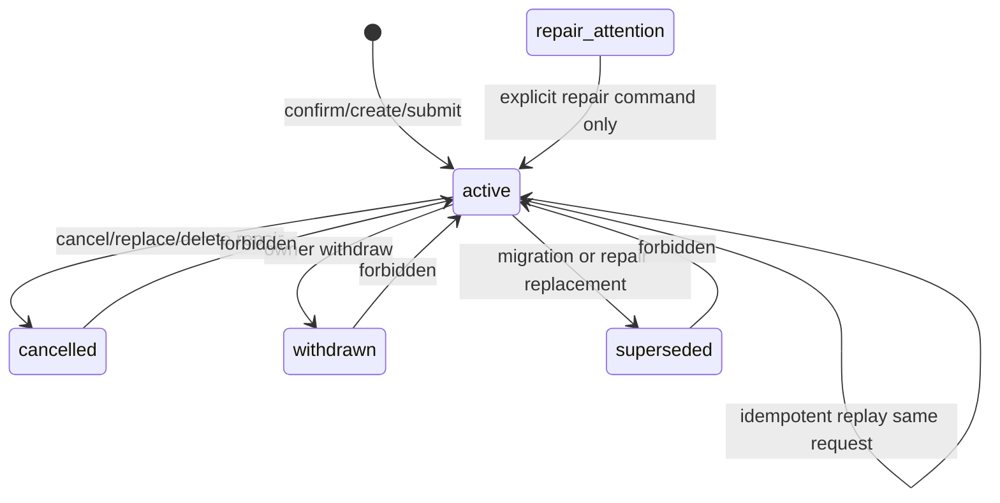

# 关联台关系事实源 状态机

## Relation 事实与展示上下文

`app.workbench_pair_relations` 只保存 confirmed relation fact。`workbench_relation` read model 只向下游业务分发 active confirmed relation 和 unlinked rows；automatic decision/candidate 只属于自动匹配内部计算过程。满足确定性条件的 free paired decision 必须先通过 `WorkbenchRelationCommandService.confirm_relation(...)` 写成 active relation，才能进入下游已配对口径。

Workbench active generation 是面向关联台页面的派生投影；`workbench_relation` 是面向下游页面的关系分发 read model。二者都只能从 canonical relation fact、自动匹配内部结果和各业务事实表派生，不能互相作为写入事实源。active relation 的 `special_metadata`、`amount_check`、`display_tags` 和 `source_versions` 必须随投影传播，以便批量账务、ETC、待找发票、进项反提等外部 owner 的展示归属保持一致。

confirmed relation fact 不等于关联台 paired zone。普通 `manual_confirmed` OA+银行、OA+发票、银行+发票两栏 relation 必须继续作为 `app.workbench_pair_relations.status='active'` 分发给下游，`workbench_relation` 可读为 `relation_status='linked'`。关联台 active generation 的 paired/open 分区由后端投影判定：含银行流水的 relation 只按 relation fact 中物化的 `requires_oa` / `requires_invoice` policy metadata 判定；不含银行流水的普通两栏 relation 保留 canonical `case:<case_id>` open group，等待三栏补齐或显式业务例外。

页面和 downstream read model 不能把以下内容当作 confirmed relation：

- 前端 `workbenchRelationUpdated` event。
- `read_model.workbench_reconciliation_decisions` 中未被 command service 消费为 active relation 的自动匹配结果。
- OA 待付款进行中 OA 的 active pending relation 或 `app.bank_transaction_relation_claims`。它们只用于 OA 待付款 in-progress 视图和关联台候选排除，不是 Workbench confirmed relation fact。
- 页面本地 table rows、drawer state、session state。
- 非 fresh `workbench_relation` 返回的空 rows。

`relation_status='linked'` 是下游只读页面判断已关联/已支付的唯一关系状态；没有 linked relation 的 row 必须按 unlinked/未配对处理。`candidate` 不再作为下游业务筛选口径。

## Relation mode

| Mode | Owner | confirmed fact | 说明 |
| --- | --- | --- | --- |
| `manual_confirmed` | 关联台 | 是 | 普通人工确认 OA/银行/发票关系。 |
| `pending_invoice_attach_existing` | 待找发票 | 是 | 选择已有发票并挂接银行流水。 |
| `pending_invoice_manual_invoice` | 待找发票 | 是 | 人工补票确认后建立关系。 |
| `bank_flow_rule_batch` | 流水规则批量处理 | 是 | 从流水规则批量处理页提交的银行流水批量关系。是否进入关联台 paired 由 metadata 中 OA/发票 requirement 是否满足决定。 |
| `no_oa_bank_batch` | 免 OA 批次 | 是 | 免 OA 批次提交和 internal transfer confirm-link 统一使用。 |
| `turnover_manual_closure` | 外部往来 | 是 | 手工零差额闭环对应的 relation。通常只含 bank rows；当所选银行流水已处于 OA-bank relation 时，可由外部往来确认闭环合并为包含 `oa` + `bank` rows 的同一 active case。不得包含 invoice；包含发票或其他业务 row type 的完整关系必须在关联台处理。 |
| `batch_accounting` | 批量账务 | 是 | 日常报销 OA 与银行流水批量账务关系。 |
| `manual_confirmed` / `normal_match` + `special_metadata.origin=oa_pending_payment_promotion` | OA 待付款核对 promotion | 是 | 进行中 OA 的独立 pending relation 在 OA sync 发现 OA 已 completed 后 promotion 成普通 Workbench active relation。新建进行中 OA 关系不得使用 `origin=oa_pending_payment_in_progress` 写入 Workbench；历史残留由 migration 0073 迁移到 OA 待付款独立关系并撤回旧 Workbench active relation。 |
| `etc_business_batch` | ETC | 是 | ETC summary 或业务批次关系。 |
| `etc_historical_repair` | ETC repair | 是 | 历史 ETC 修复工具创建或修复的关系。 |
| `etc_batch_invoice_link` | ETC repair/link | 是 | 历史 ETC 批次补关联或 existing batch link 兼容关系；新增写入必须通过 command service，不允许页面 service 直接写 pair snapshot。 |
| `input_invoice_oa_reverse` | 进项发票使用 | 是 | 以发票反提 OA 后的本地确认关系。 |

`automatic_decision` 不是合法 relation mode，不能写入 active relation，也不能作为页面或下游 read model 的 linked 关系分发。`free + paired + paired display` 且金额校验 matched、无 active 冲突、同 row-set 未被撤回的 decision，如需成为 linked 关系，必须通过 `WorkbenchRelationCommandService.confirm_relation(...)` 写成 `manual_confirmed` active relation 并标记 consumed；open/proposed decision 不进入下游业务关系。

新增 mode 必须同时定义：

- owner service。
- 允许的 row type 组合。
- 是否允许 withdraw。
- 是否允许被普通关联台 cancel。
- affected scopes。
- audit event 名称。
- idempotency key 规则。

## Relation status

| Status | 语义 | row 是否独占 | 可见性 |
| --- | --- | --- | --- |
| `active` | 当前有效 relation fact | 是 | 读模型分发为 linked。 |
| `cancelled` | 被取消或被替换取消 | 否 | 只保留历史，页面不作为 active relation 展示。 |
| `withdrawn` | 由业务 owner 撤回 | 否 | 只保留历史，owner 页面可展示撤回历史。 |
| `superseded` | 被明确的新 relation 替代 | 否 | 用于迁移/修复说明，不作为 active。 |
| `repair_attention` | 工具发现异常但不能自动修复 | 否 | 只能出现在 repair/report，不进入页面 fresh projection。 |

## 合法转换

规则：

- 同一个 `case_id` 已 active 且 row set 不同，必须 fail fast。
- 同一个 row 已属于其他 active case，必须 fail fast。
- 同一 request/idempotency key 重放，只能返回原 relation 或原业务错误。
- `cancelled`、`withdrawn`、`superseded` 默认不恢复先前 relation。只有 `withdraw_relation` 按最新确认历史中的 `before_relations` 恢复显式标记为 `restorable_on_withdraw` 的关系；普通 cancel/delete repair 不能恢复。ETC 删除场景已明确不能恢复旧 OA+银行二栏 relation。OA 自带附件发票 binding 是状态机例外：完整关系撤回时必须保留或重建父 OA+附件发票 relation；纯父 OA+自带附件发票 relation 不是用户可撤回的配对结果，preview/submit 都必须拒绝撤回。
- owner withdraw 不能绕过 owner 状态。例如 no-OA submitted batch 必须从 no-OA API 撤回，不能从关联台普通取消绕过业务 batch。
- turnover relation 如果仅包含 `oa` + `bank` rows，外部往来页可撤回 `turnover_manual_closure` 并恢复闭环确认前的 OA-bank relation；如果已升级为包含发票或其他业务 row type 的完整关系，turnover withdraw 必须返回冲突并要求到关联台处理完整关系。

## Freshness 与写安全

`workbench_relation` distribution freshness 是读侧状态，不是默认写安全事实源。relation 写 API 默认按 canonical write model 执行：

- `app.workbench_pair_relations` / transaction-bound relation repository：判断 active relation、row occupation 和状态转换。
- `submit_expected_versions` / preview id / expected versions：判断撤回 preview 是否过期。
- idempotency key：判断重复请求或冲突请求。
- 权限、session、DB 可写性和目标 owner 状态：判断是否允许 mutation。

只有调用方显式要求 read-model freshness precondition 时，`refreshing` / `stale` / `missing` / `source_mismatch` / `schema_mismatch` / `failed` / `unavailable` 才阻断该写入。普通页面 read model non-fresh 只影响读侧诊断和 payload freshness，不应让已具备 canonical 写安全的 relation mutation 等待 distribution 追赶。

错误响应至少包含：

- `error`
- `message`
- version/idempotency/permission/write safety 冲突字段。
- 如果错误来自显式 freshness precondition，则包含 `read_model_status`、`read_model_stale_reasons`、`read_model_scope_keys`、`refresh_enqueued`。

## Audit history

每次状态变化必须记录：

- operation type。
- before relation(s)。
- after relation(s)。
- actor。
- reason/note。
- affected months。
- request id / idempotency key。
- source versions。
- occurred_at。

history 是生产审计事实，不得在 repository 抽离时丢失。

## 外部往来闭环恢复规则

- `turnover_manual_closure_confirm` 与普通 `confirm_link` 一样，是可被 `withdraw_relation` 查询的确认历史类型。
- 外部往来确认闭环合并既有 OA-bank relation 时，必须把被替换的 active relation 写入 `before_relations` 并标记 `restorable_on_withdraw`。
- 外部往来撤回闭环只能撤回 `turnover_manual_closure` active case；撤回后应恢复被替换的 OA-bank relation，未参与既有 OA 关系的新增银行流水不应留在任何 active relation 中。
- 外部往来页不得撤回包含 `invoice` 或其他业务 row type 的 relation；这类完整关系必须由关联台按完整 case 处理。
