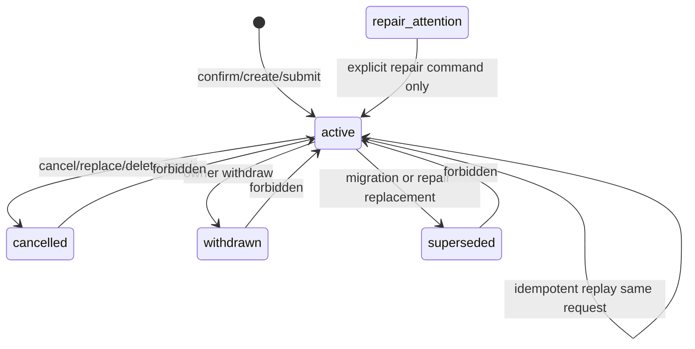

# 关联台关系事实源 状态机

## Relation 事实与展示上下文

`app.workbench_pair_relations` 只保存 confirmed relation fact。`workbench_relation` read model 可以同时分发 active confirmed relation、paired automatic decision 和 unlinked rows，但 automatic decision 不是 confirmed write fact。

页面和 downstream read model 不能把以下内容当作 confirmed relation：

- 前端 `workbenchRelationUpdated` event。
- `read_model.workbench_reconciliation_decisions` 中未确认或仅用于候选展示的匹配。
- 页面本地 table rows、drawer state、session state。
- 非 fresh `workbench_relation` 返回的空 rows。

## Relation mode

| Mode | Owner | confirmed fact | 说明 |
| --- | --- | --- | --- |
| `manual_confirmed` | 关联台 | 是 | 普通人工确认 OA/银行/发票关系。 |
| `pending_invoice_attach_existing` | 待找发票 | 是 | 选择已有发票并挂接银行流水。 |
| `pending_invoice_manual_invoice` | 待找发票 | 是 | 人工补票确认后建立关系。 |
| `no_oa_bank_batch` | 免 OA 批次 | 是 | 免 OA 批次提交和 internal transfer confirm-link 统一使用。 |
| `turnover_manual_closure` | 外部往来 | 是 | 手工零差额闭环对应的 bank-only relation。 |
| `batch_accounting` | 批量账务 | 是 | 日常报销 OA 与银行流水批量账务关系。 |
| `etc_business_batch` | ETC | 是 | ETC summary 或业务批次关系。 |
| `etc_historical_repair` | ETC repair | 是 | 历史 ETC 修复工具创建或修复的关系。 |
| `etc_batch_invoice_link` | ETC repair/link | 是 | 历史 ETC 批次补关联或 existing batch link 兼容关系；新增写入必须通过 command service，不允许页面 service 直接写 pair snapshot。 |
| `input_invoice_oa_reverse` | 进项发票使用 | 是 | 以发票反提 OA 后的本地确认关系。 |
| `automatic_decision` | workbench relation read model | 否 | 只能用于 distribution 展示上下文，不能写 active fact。 |

新增 mode 必须同时定义：

- owner service。
- 允许的 row type 组合。
- 是否允许 withdraw。
- 是否允许被普通关联台 cancel。
- affected scopes。
- audit event 名称。
- idempotency key 规则。

## Relation status

| Status | 语义 | row 是否独占 | 可见性 |
| --- | --- | --- | --- |
| `active` | 当前有效 relation fact | 是 | 读模型分发为 linked。 |
| `cancelled` | 被取消或被替换取消 | 否 | 只保留历史，页面不作为 active relation 展示。 |
| `withdrawn` | 由业务 owner 撤回 | 否 | 只保留历史，owner 页面可展示撤回历史。 |
| `superseded` | 被明确的新 relation 替代 | 否 | 用于迁移/修复说明，不作为 active。 |
| `repair_attention` | 工具发现异常但不能自动修复 | 否 | 只能出现在 repair/report，不进入页面 fresh projection。 |

## 合法转换

规则：

- 同一个 `case_id` 已 active 且 row set 不同，必须 fail fast。
- 同一个 row 已属于其他 active case，必须 fail fast。
- 同一 request/idempotency key 重放，只能返回原 relation 或原业务错误。
- `cancelled`、`withdrawn`、`superseded` 不自动恢复先前 relation。ETC 删除场景已明确不能恢复旧 OA+银行二栏 relation。
- owner withdraw 不能绕过 owner 状态。例如 no-OA submitted batch 必须从 no-OA API 撤回，不能从关联台普通取消绕过业务 batch。
- turnover bank-only relation 如果已升级为完整三栏关系，turnover withdraw 必须返回冲突并要求到关联台处理完整关系。

## Freshness 状态

写 API 在执行前需要 relation read model fresh 或等价 write model version precondition：

- `fresh`：允许继续业务校验。
- `refreshing` / `stale` / `missing` / `source_mismatch` / `schema_mismatch` / `failed` / `unavailable`：阻断写入，返回业务错误和 refresh 信息。

错误响应至少包含：

- `error`
- `message`
- `read_model_status`
- `read_model_stale_reasons`
- `read_model_scope_keys`
- `refresh_enqueued`

## Audit history

每次状态变化必须记录：

- operation type。
- before relation(s)。
- after relation(s)。
- actor。
- reason/note。
- affected months。
- request id / idempotency key。
- source versions。
- occurred_at。

history 是生产审计事实，不得在 repository 抽离时丢失。
