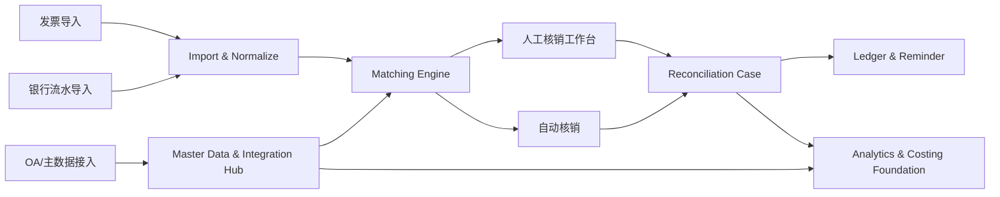

# 方案设计

## 1. 设计目标

方案需要同时满足两件事：

1. 让银企核销 MVP 能尽快落地
2. 不把未来的 OA 接入和项目成本测算堵死

因此架构设计应采用 **核心领域稳定、接入层可替换、规则层可扩展** 的思路。

## 2. 推荐模块划分

### 2.1 Import & Normalize

职责：

- 接收发票和流水导入文件
- 做字段映射、格式校验、去重和名称标准化
- 产出统一结构的发票和流水数据
- 产出导入预览结果和逐行判定结果

边界：

- 不直接做核销结论
- 不掺杂页面层逻辑

核心要求：

- 导入模块必须实现幂等，不能依赖人工“记得不要重复上传”
- 防重采用两层规则：
  - 第一层：唯一业务主键
  - 第二层：数据指纹
- 导入流程应是 `上传 -> 解析预览 -> 用户确认 -> 正式入库`
- 导入结果应区分 `新增`、`状态更新`、`重复跳过`、`疑似重复`、`异常`

### 2.2 Matching Engine

职责：

- 执行自动匹配规则
- 输出自动核销结果、建议匹配结果、待人工处理结果
- 记录匹配置信度和命中规则

边界：

- 只做“建议”和“规则执行”
- 不直接吞掉所有异常，复杂场景必须转交人工工作台

### 2.3 Reconciliation Workbench

职责：

- 提供左发票右流水的人工处理工作台
- 支持一对一、多对一、一对多、部分核销、差额核销、线下补录、内部抵扣
- 为每次动作生成核销单和操作日志
- 当左右都选中后，在右侧显示上下文操作区，只放 `确认核销` 与 `异常处理`
- `异常处理` 选项必须按当前模式动态切换：
  - 销项应收只显示 `SO-*`
  - 进项应付只显示 `PI-*`

### 2.4 Ledger & Reminder

职责：

- 接收核销后的未闭环事项
- 生成催款、催票、退款、预收、预付台账
- 驱动提醒和后续跟进

### 2.5 Master Data & Integration Hub

职责：

- 维护客商、项目、部门、审批单等主数据映射
- 为 OA、税务系统、银行模板等接入提供统一适配层

### 2.6 Analytics & Costing Foundation

职责：

- 对核销结果进行项目维度挂接
- 为后续项目成本测算、收入成本归集和管理分析预留数据出口

## 3. 推荐架构关系

## 4. 建议的数据流

1. 外部文件导入后先形成 `ImportedBatch`
2. 解析每一行后生成 `ImportedBatchRowResult`
3. 执行唯一主键校验与数据指纹校验
4. 用户确认导入后，新增或更新落地为 `Invoice` / `BankTransaction`
5. 匹配引擎产出建议结果
6. 确定的核销动作形成 `ReconciliationCase + ReconciliationLine`
7. 未闭环部分沉淀为 `FollowUpLedger`
8. 后续接入 OA 时，通过集成层把审批单和项目数据映射进来
9. 后续做项目成本测算时，从核销结果和台账结果按项目归集

## 5. 关键设计决策

## 5.0 导入必须先预览后确认

导入不能采用“上传即入库”的模式。原因：

- 财务需要先确认新增、更新、重复、异常的分类
- 疑似重复数据需要人工判断
- 只有这样，幂等策略和用户感知才一致

因此，导入中心至少要具备：

- 解析预览
- 分类汇总
- 逐行明细
- 确认执行

## 5.1 核销结果必须建模为“核销单”

不要只在发票或流水表上改状态。原因：

- 多票一付、一付多票无法清晰表达
- 差额核销和内部抵扣需要独立审计对象
- 后续要做撤销、审批、复核时必须有独立单据

## 5.2 自动匹配与人工核销要解耦

自动匹配引擎只给出结果或建议，不应把复杂异常硬编码在规则里直接闭环。否则后续规则一多，维护会很快失控。

## 5.2.1 异常处理必须结构化

工作台中的异常处理不能只是一个“报异常”按钮加备注框，必须是：

- 结构化编码
- 上下文敏感
- 能直接驱动后续台账或登记
- 能被审计与统计

## 5.3 台账不是附属表，而是闭环中心

少收款、缺票、预收、退款这些不是“备注信息”，而是后续财务动作本身。必须作为独立台账追踪。

## 5.4 集成层必须独立

未来无论接 OA、ERP 还是更多银行模板，都不应直接入侵核销核心模块。应该通过适配器或连接器进入统一主数据与集成层。

## 5.5 项目维度应提前预留

虽然 MVP 不需要完整成本测算，但发票、流水、核销单、台账最好都允许挂项目，以避免后续补数据时成本过高。

## 6. MVP 建议页面

- 导入中心
- 自动匹配结果列表
- 人工核销工作台
- 台账中心
- 核销单详情页
- 基础配置页

## 7. 技术层面的最低要求

- 支持批量导入和幂等处理
- 支持唯一业务主键和数据指纹双重防重
- 支持审计日志
- 支持状态机和枚举化业务状态
- 支持后续增加新匹配规则和新业务对象
- 支持分页、筛选和批量操作

## 8. 为未来蓝图预留的扩展点

### OA 集成

- 审批单主键映射
- 付款申请与银行流水关联
- 报销单与进项发票关联
- 项目主数据同步

### 项目成本测算

- 发票和流水挂项目
- 台账挂项目
- 预付与缺票跟项目成本归集关联
- 内部抵扣对项目损益的影响记录
