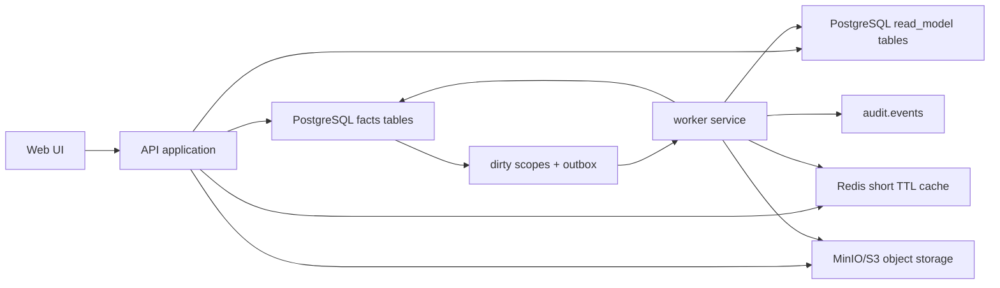

# 运行时 SQL Read Model 收敛设计

日期：2026-05-21

## 背景

当前系统已经完成从 App Mongo 主存储向 PostgreSQL 主存储的主要迁移，生产读写事实源以 PostgreSQL 为主。仓库文档也明确了长期方向：运行时不能继续依赖“全量内存状态 + JSON 快照”的主路径，高频查询应走带索引的数据库表或 read model，导入、OCR、OA 同步和统计预热等任务应由后台 worker 异步处理。

但现有后端仍保留兼容层：

- `backend/src/fin_ops_platform/app/server.py` 的 `Application.__init__` 仍通过 `_load_persisted_state()` 调用 `state_store.load()`，再用完整快照初始化运行时服务。
- `backend/src/fin_ops_platform/adapters/postgres_state_store.py` 的 `PostgresStateStore.load()` 会组装完整应用状态字典，并保留 `state:full_state` 与若干 `state:*` JSON fallback。
- 工作台、成本统计、税金抵扣等 read model 服务仍以进程内内存对象作为主要查询入口，命中失败时由 API 请求路径同步构建。
- 后台刷新已经有 in-process thread 和 dirty scope 机制，但还没有收敛成独立 worker 服务，也没有把 PostgreSQL outbox/job 表作为统一 durable queue。

这导致几个生产级问题：

- API 启动和运行时读路径会被全量状态大小拖慢，数据规模越大越明显。
- JSON 快照成为隐藏事实源，容易和结构化事实表/read model 表发生漂移。
- API miss 后同步构建 read model，会把重计算成本暴露给用户请求。
- 模块之间切换不干净：部分模块读 SQL，部分模块读内存快照，调试和回滚边界不清晰。
- 文件内容仍有 GridFS 历史负担，虽然 `app.file_objects` 已具备对象存储字段，但对象存储接口和迁移闭环仍未完成。

本设计把运行时读路径收敛为“按 scope/month 的 SQL/read-model 查询 + 后台异步刷新”，并要求每个模块完成后直接切到新路径。旧 Mongo/GridFS/JSON 快照只作为迁移、审计、shadow 对账和短期回滚工具，不再作为已迁移模块的生产读取 fallback。

## 已确认决策

- 本次是完整应用运行时收敛，不只改工作台。
- 目标是生产级整合方案，不接受救急补丁或长期临时分叉。
- 已迁移模块必须直接切到新 SQL/read-model 路径，不保留旧 snapshot fallback。
- 保留短期 shadow-read/audit/rollback 工具，但不在生产请求路径中使用旧 Mongo 模式。
- 需要更新数据库 schema，建立结构化 facts、read model、dirty scope、job/outbox、object storage 和审计所需的表或字段。
- 后台任务采用独立 worker 进程/服务，不继续依赖 API 进程内 thread 作为生产机制。
- 本次引入 Redis 的合理定位是辅助性能与协同：短 TTL cache、通知、worker 协调。Redis 不是业务事实源，也不是唯一任务队列。
- durable queue 以 PostgreSQL `job`/`outbox` 表为权威来源。Redis 丢失或清空不能影响业务正确性。
- 本次引入 MinIO/S3 替换 GridFS 合理。第一阶段使用部署在 app 云服务器或同内网的 MinIO，代码以 S3-compatible interface 抽象，后续可切外部 S3。
- 每个模块只有在 schema、写路径、读路径、worker、backfill、验证、cutover、rollback、monitoring 都完成后才算完成。

## 目标

- 启动时不再加载完整应用状态快照作为运行时主读源。
- API 高频读取按 `tenant/scope/month` 或业务分页条件直接查询 PostgreSQL facts/read model 表。
- 写路径只同步写事实表、审计、dirty scope/outbox；重 read model 由 worker 异步刷新。
- Worker 可以独立部署、独立扩缩容，并可安全重试、断点恢复、幂等处理。
- Redis 只加速热点读和跨进程通知，不承载不可丢失业务状态。
- 文件内容迁移到 MinIO/S3，PostgreSQL 保存元数据和对象指针，GridFS 只保留迁移校验和短期回滚。
- 旧 `PostgresStateStore.load()` 和 `state:*` JSON 快照从生产运行时主路径退出。
- 模块按顺序直接 cutover，每个模块有可执行 `/goal` prompt、验收门槛和回滚边界。

## 非目标

- 不重做业务口径，例如发票、银行流水、OA、关联规则和税金统计的业务定义。
- 不把 Redis 设计成业务事实库、唯一队列、永久缓存或需要人工恢复的状态源。
- 不一次性删除所有旧迁移工具。旧工具可以保留在 `scripts/`、shadow 对账和运维文档里。
- 不引入 Kafka、Celery、RabbitMQ 等新基础设施。第一阶段用 PostgreSQL durable queue + worker service 足够。
- 不把所有 read model 都做成超大 JSON 快照。只允许在必要字段里存小型 payload，查询维度必须结构化。
- 不做跨云对象存储高级能力，例如多区域复制、生命周期分层、CDN 签名分发。第一阶段只完成 S3-compatible 可迁移边界。

## 总体架构

目标架构分为五层：



请求路径原则：

- 查询请求优先读 PostgreSQL read model 或结构化 facts 查询。
- 允许 Redis 作为短 TTL cache，但 cache miss 必须回 PostgreSQL，不能回旧 snapshot。
- 如果 read model stale，API 返回明确状态或轻量降级数据，并 enqueue refresh；不能在用户请求中做重构建。
- 小 scope 可在事务内同步 patch read model，但必须有清晰上限；超限则只标 dirty 由 worker 处理。

写路径原则：

- 同一业务写操作在一个数据库事务内写 facts、审计、dirty scope/outbox。
- 外部副作用，例如对象存储上传、OCR、OA 拉取、read model rebuild，由 worker 处理。
- Worker 任务必须幂等，以 `scope_key + version` 或 source record checksum 去重。
- 对 read model 的写入要带 `source_version`、`built_at`、`scope_key`，避免旧任务覆盖新结果。

运行时状态原则：

- `Application` 启动只初始化 repositories、services、cache clients、object storage clients 和 worker dispatcher。
- 不通过 `ApplicationStateStore.load()` 构造完整内存业务状态。
- 仍可保留轻量配置读取，例如 feature flags、database settings、service options，但不能加载全量 imports/matching/read_models。
- 已迁移模块禁止读取 `state:full_state`、`state:workbench_*` 等 JSON snapshot。

## 数据库 Schema 方向

现有迁移已经有 `app`、`read_model`、`job`、`audit`、`staging` schema，本次应延续这些边界，不新建平行命名体系。

### 统一 scope 约定

新增或规范化 scope 字段：

```text
tenant_id             TEXT NOT NULL DEFAULT 'default'
scope_type            TEXT NOT NULL
scope_key             TEXT NOT NULL
month                 DATE NULL
source_version        BIGINT NOT NULL DEFAULT 0
built_at              TIMESTAMPTZ NULL
stale_reason          TEXT NULL
```

建议 scope：

- `workbench:month:{YYYY-MM}`
- `cost:month:{YYYY-MM}`
- `tax_offset:month:{YYYY-MM}`
- `search:entity:{type}:{id}`
- `pending_invoice:month:{YYYY-MM}`
- `file:{object_id}`
- `oa:period:{YYYY-MM}`

所有 read model 表必须有唯一键：

```text
(tenant_id, scope_type, scope_key, source_version)
```

或者在只保留最新版本的表上使用：

```text
(tenant_id, scope_type, scope_key)
```

并配合 `source_version` 防旧写覆盖。

### Dirty Scope

规范化 dirty scope 表，建议放在 `job` schema：

```text
job.read_model_dirty_scopes
  id
  tenant_id
  scope_type
  scope_key
  month
  reason
  source_version
  status                pending|processing|done|failed|superseded
  attempts
  locked_by
  locked_at
  next_run_at
  created_at
  updated_at
  last_error
```

要求：

- `(tenant_id, scope_type, scope_key, status in pending/processing)` 需要防重复策略。
- 新事件到来时提升 `source_version`，老任务完成时不能覆盖新版本。
- Worker crash 后 `locked_at` 超时可被其他 worker 抢占。

### Job/Outbox

保留并强化现有 `job.outbox_events`：

```text
job.outbox_events
  id
  tenant_id
  event_type
  aggregate_type
  aggregate_id
  scope_type
  scope_key
  payload
  dedupe_key
  status
  attempts
  available_at
  locked_by
  locked_at
  created_at
  updated_at
  processed_at
  last_error
```

要求：

- `dedupe_key` 对可合并任务唯一，例如 `read_model:workbench:2026-05`.
- PostgreSQL 是 durable queue 权威。
- Redis 可接收 `PUBLISH` 或轻量 wake-up key，用于减少 polling 延迟。
- Worker 必须能在没有 Redis 的情况下通过 PostgreSQL polling 正常完成。

### Read Model 表

现有 `read_model.workbench_rows`、`workbench_snapshots`、`workbench_candidate_matches`、`search_index_rows`、`cost_statistics_read_models`、`tax_offset_read_models` 应逐步改成“结构化可查 + 小 payload 辅助”的形态。

要求：

- 工作台主查询按 month/scope/page/filter/order 走 `read_model.workbench_rows`。
- 成本统计按 month、category、counterparty、invoice/bank dimensions 走结构化聚合表。
- 税金抵扣按 month、invoice tax status、deduction status 走结构化聚合表。
- 搜索索引按 entity type、tokens、updated_at 查询。
- JSON payload 只能承载 UI 展示辅助字段，不作为唯一查询条件来源。

### 文件对象

现有 `app.file_objects` 已包含对象存储字段，本次补齐使用规范：

```text
app.file_objects
  storage_backend      s3|minio|gridfs_legacy|local
  storage_uri
  bucket_name
  object_key
  sha256
  size_bytes
  content_type
  etag
  migration_status     pending|uploaded|verified|failed|legacy
  source_gridfs_id
```

要求：

- PostgreSQL 只存元数据和对象指针，不存大文件内容。
- MinIO/S3 object key 必须稳定、可重试、避免业务文件名冲突，例如 `{tenant}/{yyyy}/{mm}/{sha256[:2]}/{object_id}`。
- 上传后校验 size、sha256、etag 或服务端 checksum。
- 删除业务记录时先标记 tombstone，实际对象清理由 worker 做可审计任务。

## Redis 边界

Redis 可以使用在以下场景：

- API 热点查询短 TTL cache，例如 cost month summary、tax month summary、workbench page filter。
- Worker wake-up notification，减少 PostgreSQL queue polling 延迟。
- 分布式锁的辅助层，但锁的最终正确性仍由 PostgreSQL row lock/version check 保证。
- SSE 或内部事件广播的短期状态。

Redis 不允许用于：

- 业务事实存储。
- read model 的唯一存储。
- 任务队列的唯一来源。
- 文件迁移进度的唯一记录。
- 需要人工恢复的状态。

性能判断：

- Redis 单次 key-value 访问通常比 PostgreSQL 更快，适合短 TTL cache。
- PostgreSQL 对结构化过滤、分页、聚合、事务、一致性和持久任务队列更适合。
- 本系统正确选择是 PostgreSQL 作为事实和可恢复队列，Redis 只减少热点和唤醒延迟。

## MinIO/S3 边界

本次引入 MinIO/S3 是合理且必要的，因为 GridFS 属于旧 Mongo 体系，和“不要用老 Mongo 模式”的目标冲突。

第一阶段部署口径：

- MinIO 部署在 app 所在云服务器或同 VPC/内网。
- API 和 worker 通过 S3-compatible endpoint 访问。
- 配置项不得写死 MinIO，使用 `OBJECT_STORAGE_BACKEND=s3`、`S3_ENDPOINT_URL`、`S3_BUCKET`、`S3_REGION`、`S3_ACCESS_KEY_ID`、`S3_SECRET_ACCESS_KEY`。
- 代码层抽象为 `ObjectStorageRepository` 或等价接口，MinIO 只是实现之一。

迁移口径：

- 新上传文件直接写 MinIO/S3。
- 旧 GridFS 文件通过 worker backfill 迁移。
- 迁移完成且校验通过后，读取只走对象存储。
- GridFS fallback 只允许在迁移工具和短期回滚脚本里使用，不在已 cutover 的生产模块请求路径使用。

## 模块执行顺序

模块必须顺序 cutover。每个模块内部可以并行做 schema、服务、worker、测试，但上一个模块未通过 completion gate 前，不进入下一个模块代码执行。

推荐顺序：

1. 基础设施收敛：schema、repository 边界、PostgreSQL durable queue、worker runtime、Redis helper、object storage interface。
2. 文件存储：MinIO/S3 新上传、GridFS 迁移、file object read path cutover。
3. 导入事实模型：发票、银行流水、导入批次从 snapshot 初始化退出，按 SQL 查询和分页读取。
4. 工作台 read model：workbench rows/candidates/dirty scopes 全 SQL 化，API 不同步重构建。
5. 成本统计 read model：month scope 聚合表 + worker refresh + Redis TTL cache。
6. 税金抵扣 read model：month scope 聚合表 + worker refresh + Redis TTL cache。
7. 搜索和待找发票相关 read model：结构化索引和聚合查询。
8. OA 同步投影：OA facts/projections worker 化，API 读 SQL projection。
9. Application runtime bootstrap：移除生产主路径 `state_store.load()` 全量快照初始化。
10. 旧 snapshot/Mongo/GridFS 生产路径下线：保留 migration/shadow/audit 工具和运维回滚文档。

## 每个模块的完整完成门槛

每个模块必须同时满足：

- Schema：迁移脚本、索引、约束、幂等 seed/backfill 状态表完成。
- 写路径：业务写操作落结构化 facts/outbox/audit，不依赖 JSON snapshot。
- 读路径：API 查询走 SQL/read model/Redis cache，不读取旧 snapshot fallback。
- Worker：有独立任务、幂等锁、重试、失败记录、可恢复策略。
- Backfill：旧数据迁移脚本或 job 完成，可重复执行，可校验。
- Verification：单元测试、集成测试、迁移测试和关键 API smoke 通过。
- Cutover：feature flag 或配置切换清晰，默认目标环境走新路径。
- Rollback：只回滚到上一个模块边界，不把已迁移模块悄悄读回旧 snapshot。
- Monitoring：日志、指标或健康检查能看见 queue backlog、失败数、stale scopes、cache 状态。
- Docs：更新 `ARCHITECTURE.md`、`docs/architecture/`、`docs/dev/` 或 `docs/operations/` 中受影响文档。

## 模块 `/goal` Prompt

以下 prompt 用于后续执行。每个 prompt 都要求先读相关代码和文档，再做最小但完整的生产级改动。

### Module 1: 基础设施收敛

```text
/goal 建立运行时 SQL/read-model 收敛的基础设施边界，不切业务模块。

上下文：
- 仓库：/Users/yu/Desktop/fin-ops-platform
- 设计规格：docs/superpowers/specs/2026-05-21-runtime-sql-read-model-convergence-design.md
- 现有 PostgreSQL schema 在 backend/src/fin_ops_platform/adapters/postgres_migrations/
- 现有 ApplicationStateStore/PostgresStateStore 仍有全量 snapshot load/save 兼容路径。

目标：
1. 新增或规范 job.read_model_dirty_scopes、job.outbox_events 必要字段/索引/状态约束。
2. 建立 PostgreSQL durable queue repository，支持 enqueue、claim、complete、fail、retry、dedupe。
3. 建立独立 worker runtime 入口，可作为单独进程启动，不依赖 API in-process thread。
4. 建立 Redis helper，限定为短 TTL cache、pub/sub wakeup、辅助锁；无 Redis 时 PostgreSQL polling 仍可运行。
5. 建立 ObjectStorageRepository 接口和 MinIO/S3 配置骨架，但不切文件业务。
6. 补齐审计、日志、健康检查或指标入口，至少能观测 backlog、failed jobs、stale dirty scopes。

串行任务：
1. 读取 README、ARCHITECTURE、docs/architecture/persistence-and-read-models.md、backend/README.md 和现有 migrations。
2. 设计并实现 schema migration，保持向后兼容和可重复迁移。
3. 实现 durable queue repository 和 worker claim/lock/retry 语义。
4. 实现 worker CLI/entrypoint 和配置文档。
5. 实现 Redis/ObjectStorage 抽象骨架。
6. 添加测试和 smoke 验证。

可并行任务：
- A: schema/index/constraint 迁移与迁移测试。
- B: queue repository 与 worker runtime 单元测试。
- C: Redis helper 与 object storage config 文档。
- D: health/monitoring endpoint 或脚本。

完成门槛：
- API 现有测试不退化。
- 新 queue/worker 测试覆盖 claim 幂等、retry、dedupe、lock timeout。
- 无 Redis 时 worker 仍可从 PostgreSQL claim job。
- 未改变业务读写路径。
- 文档说明如何启动 worker 和如何配置 Redis/MinIO。
```

### Module 2: 文件存储 MinIO/S3 Cutover

```text
/goal 将新文件上传和文件读取从 GridFS/本地兼容路径切到 S3-compatible object storage，并提供 GridFS 到 MinIO/S3 的生产级迁移闭环。

目标：
1. 新上传文件写 ObjectStorageRepository，PostgreSQL app.file_objects 保存元数据和 object pointer。
2. 旧 GridFS 文件通过 worker backfill 迁移到 MinIO/S3，校验 sha256/size/etag。
3. 已迁移文件读取只走对象存储，不在生产请求路径 fallback 到 GridFS。
4. 保留独立迁移校验和短期回滚工具。
5. 更新部署文档，明确本机/同内网 MinIO 配置、bucket 初始化、备份策略。

串行任务：
1. 读取现有文件上传、import file、GridFS、file_objects 相关代码和 docs/operations。
2. 补齐 file_objects migration 字段和索引。
3. 实现 upload/download/delete/tombstone 的 object storage 路径。
4. 实现 GridFS migration worker job 和校验脚本。
5. 切换新上传默认路径，添加 feature flag/config。
6. 编写测试和迁移 smoke。

可并行任务：
- A: object storage service + API path。
- B: GridFS migration worker + verification。
- C: deploy/operations docs。
- D: tests/fixtures。

完成门槛：
- 新上传文件不写 GridFS。
- 迁移后文件读取不依赖 Mongo/GridFS。
- 迁移 job 可重复运行，不重复上传，不破坏已验证对象。
- 对象存储不可用时写操作失败 fast，并有清晰错误和审计。
```

### Module 3: 导入事实模型 SQL Runtime

```text
/goal 将发票、银行流水、导入批次等基础事实从全量内存 snapshot 初始化改为按 SQL repository 查询和分页读取。

目标：
1. ImportNormalizationService 或其替代查询边界不再要求启动时注入完整 imports snapshot。
2. 发票、银行流水、导入文件、批次状态等 API 按 SQL 分页/过滤读取。
3. 写入 facts 后通过 outbox/dirty scope 通知下游 read model，不保存 state:* JSON 作为生产事实。
4. 保持现有导入、去重、银行标签、发票识别业务口径不变。

串行任务：
1. 读取 import service、PostgresStateStore imports load/save、相关 API 和 tests。
2. 建立 invoice/bank/import batch repository 查询接口。
3. 改造 API/service 初始化，移除对 imports snapshot 的必需依赖。
4. 写路径补齐 dirty scope/outbox。
5. Backfill/校验现有 facts 表完整性。
6. 测试导入、分页、去重和标签。

可并行任务：
- A: SQL repository 查询接口和索引。
- B: service 初始化去 snapshot 化。
- C: API contract/tests。
- D: backfill/consistency check 脚本。

完成门槛：
- 导入相关生产 API 不读取 `state:full_state` 或 imports snapshot fallback。
- 大数据量分页不会加载全量发票/流水到内存。
- 导入写入后可触发后续 workbench/cost/tax/search dirty scope。
```

### Module 4: 工作台 Read Model SQL Cutover

```text
/goal 将工作台运行时读取切到 read_model.workbench_rows/candidate tables 和 dirty scope worker，移除 API 请求路径同步构建。

目标：
1. /api/workbench 查询按 scope/month/filter/page 读取 SQL read model。
2. API miss/stale 时 enqueue refresh，返回明确 stale/refreshing 状态或已有最新可用版本，不同步 rebuild 全量工作台。
3. Worker 根据 dirty scope 构建 workbench rows、snapshots metadata、candidate matches。
4. Pair relations、row overrides、exception cases 写入后只标记受影响 scope，不重写全量 state。
5. 切断 `state:workbench_candidate_matches` 和 workbench snapshot fallback 在生产读取中的使用。

串行任务：
1. 读取 `_handle_api_workbench`、`_get_or_build_workbench_read_model`、`_build_raw_workbench_payload`、WorkbenchReadModelService、dirty scope worker。
2. 设计 SQL 查询 DTO 和索引，覆盖现有前端需要的字段。
3. 实现 workbench read repository 和 API 查询路径。
4. 实现 worker rebuild/patch 逻辑和 version 防旧写。
5. 改造 pair relation/override/exception 写路径触发 dirty scope。
6. 添加对账脚本，比对旧 builder 和新 SQL read model 输出。
7. 测试分页、筛选、候选匹配、刷新状态。

可并行任务：
- A: SQL read repository + API。
- B: worker builder + dirty scope。
- C: write path invalidation。
- D: reconciliation tests/scripts。

完成门槛：
- 工作台 API 不调用 `_build_raw_workbench_payload` 做生产同步构建。
- 生产路径不读取 `state:workbench_*` fallback。
- 修改关系/覆盖后对应 month scope 可自动刷新。
- 有 stale/backlog 可观测指标。
```

### Module 5: 成本统计 Read Model SQL Cutover

```text
/goal 将成本统计 explorer/month summary 从内存 read model 和同步计算切到 SQL 聚合 read model + worker 刷新 + Redis TTL cache。

目标：
1. /api/cost-statistics/explorer 读取按 month/scope 的 SQL 聚合表。
2. all/month miss 时 enqueue refresh，不在 API 请求里重算大范围统计。
3. Worker 从发票、银行流水、关系事实构建成本统计 read model。
4. Redis 只缓存热点 month/all summary，TTL 短且可失效。
5. 写入发票/银行/关系后标记受影响月份 dirty。

串行任务：
1. 读取 `_get_or_build_cost_statistics_explorer`、CostStatisticsReadModelService 和现有 PG repository。
2. 设计结构化聚合表和索引。
3. 实现 SQL read path 和 cache policy。
4. 实现 worker rebuild 和 dirty scope。
5. 添加 backfill、对账和 API tests。

可并行任务：
- A: schema/repository。
- B: worker aggregation。
- C: API/cache。
- D: reconciliation tests。

完成门槛：
- API miss 不返回由同步重算生成的大 payload。
- Redis 清空后仍能从 PostgreSQL 返回正确已构建结果。
- 统计口径与旧实现对账通过。
```

### Module 6: 税金抵扣 Read Model SQL Cutover

```text
/goal 将税金抵扣月度 payload 从内存 read model 和同步计算切到 SQL read model + worker 刷新 + Redis TTL cache。

目标：
1. /api/tax-offset 按 month 查询 SQL read model。
2. month miss/stale 时 enqueue refresh，不在 API 里同步计算全月 payload。
3. Worker 根据发票、抵扣状态、关系事实构建月度 read model。
4. 写入抵扣设置/发票/关系后标记受影响 month dirty。
5. 保持现有税金业务口径和前端响应兼容。

串行任务：
1. 读取 `_get_or_build_tax_offset_month_payload`、TaxOffsetReadModelService、相关 schema/tests。
2. 设计 SQL 表和 version 字段。
3. 实现 API SQL read path 和 Redis cache。
4. 实现 worker rebuild/backfill。
5. 添加对账和测试。

可并行任务：
- A: schema/repository。
- B: worker rebuild。
- C: API/cache。
- D: tests/reconciliation。

完成门槛：
- 税金接口生产路径不读内存 snapshot fallback。
- Redis 丢失不影响正确性。
- 旧口径对账通过。
```

### Module 7: 搜索与待找发票 Read Model

```text
/goal 将搜索索引和待找发票聚合查询建立在结构化 SQL/read model 上，并接入 dirty scope worker。

目标：
1. search_index_rows 由 worker 根据 facts 和关系事实维护，不依赖全量 in-memory state。
2. 待找发票页面所需聚合按 bank transaction month/page/filter 查询 SQL/read model。
3. 补票、标签、pair relation 变更后标记搜索和待找发票 scope dirty。
4. API 不同步扫描全量发票/流水/OA 数据。

串行任务：
1. 读取搜索、待找发票、银行标签、pair relation 和 pending invoice 相关代码/docs。
2. 设计 search/pending invoice read model 查询字段和索引。
3. 实现 worker build/patch。
4. 改造 API 查询。
5. 添加一致性测试和 UI smoke。

可并行任务：
- A: search read model。
- B: pending invoice read model。
- C: dirty scope/write invalidation。
- D: tests。

完成门槛：
- 搜索和待找发票不再依赖全量内存状态。
- 标签设置变更可使相关查询正确刷新。
- 大数据分页查询有索引支持。
```

### Module 8: OA 同步投影 Worker 化

```text
/goal 将 OA 同步和 OA 投影读取收敛为 PostgreSQL facts/projections + worker，不让 API 请求路径访问旧同步状态或全量内存。

目标：
1. OA polling/sync 作为独立 worker job 运行。
2. OA facts/projections 写 PostgreSQL，API 只读 SQL projection。
3. OA 变更标记 workbench/search/pending invoice 等受影响 scope dirty。
4. 现有 OA Mongo 只作为外部 read-only source，不作为 App runtime state。

串行任务：
1. 读取 OA sync、OA projection migrations、WorkbenchQueryService OA rows 相关代码。
2. 建立/补齐 OA sync job、projection repository 和索引。
3. 改造 API/工作台读取 OA projection。
4. 接入 dirty scope。
5. 测试同步、重试、投影刷新。

可并行任务：
- A: worker sync。
- B: projection read repository。
- C: dirty invalidation。
- D: tests/docs。

完成门槛：
- API 不启动 in-process OA polling 作为生产必需机制。
- OA projection 可独立 backfill 和对账。
- OA 源不可用时不破坏已有 projection 查询。
```

### Module 9: Application Runtime Bootstrap 去 Snapshot 化

```text
/goal 从 Application runtime 启动路径移除全量 ApplicationStateStore.load() 主依赖，使服务启动只初始化 repositories/services，而不是加载完整业务状态。

目标：
1. Application.__init__ 不调用 `_load_persisted_state()` 初始化业务运行态。
2. `_initialize_runtime_services` 改为注入 SQL repositories、queue、cache、object storage 和轻量配置。
3. 兼容旧 StateStore 的迁移/shadow 工具从 API production bootstrap 分离。
4. 启动时间和内存使用不随发票/银行/工作台历史数据线性增长。

串行任务：
1. 读取 Application init、所有 service 构造参数、测试 fixture。
2. 为尚未去 snapshot 的服务补齐 repository 初始化路径。
3. 移除/隔离 `_load_persisted_state()` 主路径。
4. 更新 tests 和 dev docs。
5. 做启动 smoke、API smoke、worker smoke。

可并行任务：
- A: Application bootstrap 改造。
- B: service constructor/repository injection。
- C: tests fixtures。
- D: docs/operations。

完成门槛：
- 生产启动不加载 full_state。
- `PostgresStateStore.load()` 只在迁移/shadow/test 明确场景调用。
- 启动 smoke 和主要 API smoke 通过。
```

### Module 10: 旧 Snapshot/Mongo/GridFS 生产路径下线

```text
/goal 清理旧 snapshot/Mongo/GridFS 在生产请求路径中的使用，保留必要迁移、shadow-read、audit 和 rollback 工具。

目标：
1. 搜索代码确认生产 API/worker 主路径不读取 state:* JSON、App Mongo snapshot、GridFS fallback。
2. 删除或隔离不再使用的 runtime fallback 分支。
3. 保留 scripts/docs 下的 migration/shadow/audit 工具，明确不能被生产请求路径调用。
4. 更新架构、开发、运维文档。
5. 增加 guard test，防止 production modules 重新引入 snapshot fallback。

串行任务：
1. 全仓库搜索 StateStore.load、state:*、GridFS、Mongo fallback 调用点。
2. 分类：生产路径、测试路径、迁移工具、文档。
3. 清理生产路径 fallback。
4. 添加 guard tests 或 static checks。
5. 更新 docs 和 rollback playbook。

可并行任务：
- A: code search/classification。
- B: cleanup patches。
- C: guard tests。
- D: docs/playbook。

完成门槛：
- 生产 API/worker 主路径没有旧 snapshot/Mongo/GridFS fallback。
- 迁移和审计工具仍可手动运行。
- 文档明确新架构、回滚边界和运维验证方式。
```

## 验证策略

分层验证：

- Schema migration tests：迁移可从空库和已有库重复执行。
- Repository tests：SQL 查询、分页、索引条件、锁、version 防旧写。
- Worker tests：claim、retry、dedupe、lock timeout、idempotency、failure recording。
- Backfill tests：重复执行不破坏数据，checksum/row count 对账。
- API tests：响应契约兼容，miss/stale 行为明确。
- Reconciliation scripts：旧 builder 输出与新 SQL/read model 输出在样本库对账。
- Smoke：启动 API、启动 worker、执行导入、刷新 read model、打开关键页面。
- Performance checks：至少记录大样本下启动时间、workbench page query、cost month query、tax month query。

完成前必须运行：

- 仓库已有后端验证入口。
- 受影响模块的 pytest。
- 迁移脚本 smoke。
- 关键 API smoke。

如果某项验证因为环境缺少 PostgreSQL、MinIO、Redis 或 OA 源无法运行，必须明确记录未运行项、原因和替代验证。

## Cutover 与 Rollback

Cutover 原则：

- 每个模块有独立 feature/config flag，但通过模块 gate 后目标环境默认启用新路径。
- 切换前先 backfill，再 reconciliation，再开启读路径。
- 切换后持续观察 stale scope、queue backlog、failed jobs、API latency。
- 旧 snapshot fallback 不在已切模块生产路径保留。

Rollback 原则：

- 回滚到上一个模块边界，例如禁用某模块新 SQL read path 并停止相关 worker。
- 回滚不能静默混用旧 snapshot 与新 facts，必须通过明确 config 和操作文档执行。
- 对象存储迁移回滚只针对读取指针和迁移状态，不删除已验证对象。
- PostgreSQL facts 是权威事实源，不回滚到 Mongo 写入。

## 监控与运维

至少暴露或记录：

- `job.outbox_events` pending/processing/failed 数量。
- `job.read_model_dirty_scopes` pending/failed/stale 数量。
- 每个 scope type 的最大滞后时间。
- Worker claim/complete/fail/retry 计数。
- Redis connected/miss/error 指标。
- Object storage upload/download/checksum failure。
- API read model stale/miss 返回次数。
- Backfill progress 和 reconciliation mismatch。

运维文档需要包含：

- API 和 worker 启动命令。
- PostgreSQL/Redis/MinIO 配置项。
- MinIO bucket 初始化和备份。
- 常见队列卡住、worker crash、Redis 不可用、对象存储不可用处理方式。
- 模块 cutover 和 rollback 步骤。

## 风险与处理

- 风险：一次性重构范围过大。
  - 处理：严格按模块顺序 cutover，每个模块完成门槛通过后再进入下一个模块。
- 风险：新 read model 和旧口径不一致。
  - 处理：每个模块必须有 reconciliation 脚本和样本对账。
- 风险：worker lag 导致页面 stale。
  - 处理：API 返回刷新状态，监控 stale scope，必要时优先级队列处理交互写入触发的 scope。
- 风险：Redis 被误用为事实源。
  - 处理：代码边界和测试强制 cache miss 可回 PostgreSQL。
- 风险：MinIO 单点。
  - 处理：第一阶段明确备份策略和对象 checksum；接口保持 S3-compatible，后续可迁移到托管 S3。
- 风险：旧 snapshot fallback 重新进入生产路径。
  - 处理：最后模块增加 guard test/static check，并在代码注释/文档标明允许场景。

## Definition of Done

整体任务完成必须满足：

- API 生产启动不加载完整 `ApplicationStateStore.load()` 业务 snapshot。
- 已迁移模块查询按 SQL/read model/Redis cache 执行，cache miss 回 PostgreSQL。
- Worker 独立进程可刷新工作台、成本、税金、搜索、待找发票、OA 投影和文件迁移任务。
- 所有业务写路径能标记受影响 dirty scope/outbox，并写审计。
- MinIO/S3 承担新文件对象存储，GridFS 只保留迁移/回滚工具场景。
- 旧 App Mongo/JSON snapshot 不再是生产请求路径事实源。
- 关键模块完成 backfill、对账、测试、cutover 文档和 rollback 文档。
- 相关 README、ARCHITECTURE、docs/architecture、docs/dev、docs/operations 已更新。
